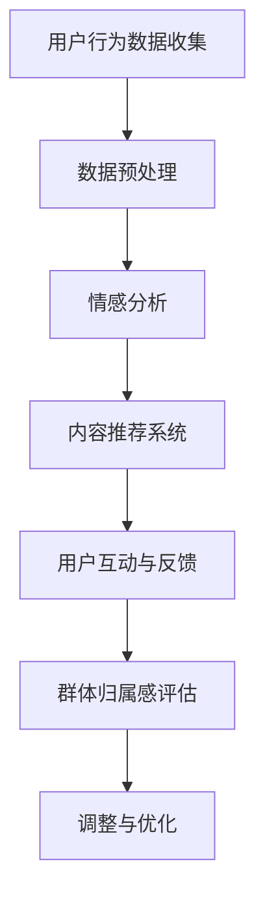

                 

关键词：虚拟社区、人工智能、群体归属感、技术驱动、社交网络、用户体验、情感分析、个性化推荐。

> 摘要：随着互联网和人工智能技术的迅猛发展，虚拟社区成为现代社会中人们交流、互动和建立情感联系的重要平台。本文将探讨如何通过人工智能技术提升虚拟社区的群体归属感，从核心概念、算法原理、数学模型、项目实践、应用场景等方面进行深入分析，为虚拟社区的发展提供有益的参考。

## 1. 背景介绍

在当今信息化社会，互联网已成为人们日常生活不可或缺的一部分。虚拟社区作为一种基于互联网的新型社会形态，正日益受到广泛关注。虚拟社区不仅提供了一个在线互动的平台，还通过个性化的用户体验和丰富的社交功能，促进了群体归属感的形成。

### 虚拟社区的定义

虚拟社区是指基于互联网技术，通过用户之间的交流和互动，形成一种具有共同兴趣、价值观和目标的在线社群。虚拟社区的核心在于用户参与和互动，它通过内容分享、讨论、游戏、社交活动等方式，使用户在虚拟空间中建立起深厚的情感联系。

### 人工智能与虚拟社区

人工智能（AI）技术的飞速发展，为虚拟社区提供了新的动力。AI技术可以通过数据分析和智能推荐，为用户提供个性化的体验，增强用户在虚拟社区中的归属感。此外，情感分析和自然语言处理等技术，也为虚拟社区中的互动提供了更深入的支持。

## 2. 核心概念与联系

在讨论如何提升虚拟社区的群体归属感之前，我们需要了解一些核心概念和它们之间的联系。

### 人工智能技术

人工智能技术包括机器学习、深度学习、自然语言处理、计算机视觉等，这些技术可以通过数据分析和模式识别，实现智能化的功能。在虚拟社区中，人工智能技术主要用于用户行为分析、内容推荐、情感识别等。

### 群体归属感

群体归属感是指个体在某个群体中感受到的归属、认同和情感联系。在虚拟社区中，群体归属感的形成与用户的互动、共同兴趣和价值观密切相关。

### 技术与归属感的关系

人工智能技术通过数据分析和个性化推荐，为用户提供个性化的体验，从而增强用户在虚拟社区中的归属感。同时，情感分析和自然语言处理等技术，也为用户之间的互动提供了更深入的支持，进一步促进了群体归属感的形成。

### Mermaid 流程图

以下是一个用于描述虚拟社区中AI提升群体归属感流程的Mermaid流程图：



## 3. 核心算法原理 & 具体操作步骤

### 3.1 算法原理概述

在虚拟社区中，提升群体归属感的核心算法主要包括情感分析、内容推荐和用户行为分析。这些算法通过分析用户行为数据、情感状态和兴趣爱好，为用户提供个性化的体验，从而增强用户在虚拟社区中的归属感。

### 3.2 算法步骤详解

#### 3.2.1 情感分析

情感分析是一种自然语言处理技术，用于识别文本中的情感倾向。在虚拟社区中，情感分析可以用于监测用户情绪，识别用户在社区中的情感状态，从而为用户提供更有针对性的内容推荐和互动建议。

1. 数据收集：收集用户在社区中的文本数据，如帖子、评论、私信等。
2. 数据预处理：对收集到的文本数据进行处理，包括去除停用词、分词、词性标注等。
3. 情感分类：使用情感分类模型对预处理后的文本数据进行分析，判断文本的情感倾向。

#### 3.2.2 内容推荐

内容推荐是一种基于用户兴趣和行为的个性化推荐系统。在虚拟社区中，内容推荐可以用于为用户提供感兴趣的内容，从而增强用户在社区中的参与度和归属感。

1. 用户画像构建：根据用户的行为数据、兴趣爱好和情感状态，构建用户画像。
2. 内容分析：对社区中的内容进行分析，提取关键特征，如关键词、主题等。
3. 推荐算法：使用协同过滤、基于内容的推荐算法等，为用户推荐感兴趣的内容。

#### 3.2.3 用户行为分析

用户行为分析是一种用于监测和分析用户在社区中行为模式的技术。通过分析用户行为，可以深入了解用户需求，为用户提供更个性化的服务。

1. 数据收集：收集用户在社区中的行为数据，如浏览记录、点击行为、评论等。
2. 数据处理：对收集到的行为数据进行预处理，包括数据清洗、特征提取等。
3. 行为模式识别：使用机器学习算法，对用户行为数据进行模式识别，预测用户未来行为。

### 3.3 算法优缺点

#### 3.3.1 情感分析

优点：情感分析可以实时监测用户情绪，为用户提供更有针对性的内容推荐和互动建议。

缺点：情感分析的准确率受文本质量和情感分类模型的影响，且情感分析无法完全理解用户的真实情感。

#### 3.3.2 内容推荐

优点：内容推荐可以提升用户的参与度和满意度，增强用户在社区中的归属感。

缺点：内容推荐可能引发信息茧房效应，使用户陷入兴趣同质化的困境。

#### 3.3.3 用户行为分析

优点：用户行为分析可以帮助了解用户需求，为用户提供更个性化的服务。

缺点：用户行为数据可能涉及隐私问题，需要谨慎处理。

### 3.4 算法应用领域

情感分析、内容推荐和用户行为分析等算法，在虚拟社区中具有广泛的应用领域：

1. 社交网络：通过情感分析和内容推荐，为用户提供个性化的社交体验。
2. 在线教育：通过用户行为分析，为学习者提供个性化的学习建议。
3. 电子商业：通过内容推荐和用户行为分析，提升用户的购买体验和转化率。

## 4. 数学模型和公式 & 详细讲解 & 举例说明

在虚拟社区的群体归属感提升中，数学模型和公式起到了关键作用。以下将详细介绍数学模型的构建、公式推导过程以及实际案例的讲解。

### 4.1 数学模型构建

为了构建一个用于评估群体归属感的数学模型，我们需要考虑以下因素：

- 用户参与度：用户在社区中的活跃程度，如发帖、评论、点赞等行为。
- 社交互动：用户之间的互动关系，如关注、私信、共同参与活动等。
- 共同兴趣：用户在社区中的共同兴趣爱好，如话题讨论、内容分享等。

基于以上因素，我们可以构建一个综合评估模型，用于评估用户在虚拟社区中的群体归属感。设用户集合为 \( U \)，用户 \( u \) 的参与度为 \( P(u) \)，社交互动为 \( I(u) \)，共同兴趣为 \( C(u) \)，则群体归属感 \( S(u) \) 可以表示为：

$$
S(u) = w_1 \cdot P(u) + w_2 \cdot I(u) + w_3 \cdot C(u)
$$

其中，\( w_1 \)、\( w_2 \) 和 \( w_3 \) 分别为权重系数，用于平衡不同因素的贡献。

### 4.2 公式推导过程

#### 4.2.1 用户参与度 \( P(u) \)

用户参与度可以通过用户在社区中的行为数据计算得出。设用户 \( u \) 在时间段 \( t \) 内的发帖数量为 \( n_{post}(u,t) \)，评论数量为 \( n_{comment}(u,t) \)，点赞数量为 \( n_{like}(u,t) \)，则用户 \( u \) 的参与度可以表示为：

$$
P(u) = \alpha_1 \cdot n_{post}(u,t) + \alpha_2 \cdot n_{comment}(u,t) + \alpha_3 \cdot n_{like}(u,t)
$$

其中，\( \alpha_1 \)、\( \alpha_2 \) 和 \( \alpha_3 \) 分别为不同行为的权重系数。

#### 4.2.2 社交互动 \( I(u) \)

社交互动可以通过用户之间的互动关系计算得出。设用户 \( u \) 在时间段 \( t \) 内与用户 \( v \) 的互动数量为 \( n_{interaction}(u,v,t) \)，则用户 \( u \) 的社交互动可以表示为：

$$
I(u) = \beta_1 \cdot n_{follower}(u,t) + \beta_2 \cdot n_{following}(u,t) + \beta_3 \cdot \sum_{v \in U} n_{interaction}(u,v,t)
$$

其中，\( \beta_1 \)、\( \beta_2 \) 和 \( \beta_3 \) 分别为不同互动类型的权重系数。

#### 4.2.3 共同兴趣 \( C(u) \)

共同兴趣可以通过用户在社区中的兴趣标签计算得出。设用户 \( u \) 在时间段 \( t \) 内的兴趣标签为 \( T(u,t) \)，社区中所有用户的兴趣标签为 \( T \)，则用户 \( u \) 的共同兴趣可以表示为：

$$
C(u) = \gamma_1 \cdot \sum_{t=1}^{T} \sum_{l \in T(u,t)} p(l,t)
$$

其中，\( \gamma_1 \) 为权重系数，\( p(l,t) \) 为兴趣标签 \( l \) 在时间段 \( t \) 内的流行度。

### 4.3 案例分析与讲解

以下是一个虚拟社区群体归属感评估的案例：

设虚拟社区中有1000名用户，用户 \( u \) 在过去一个月的发帖数量为50，评论数量为30，点赞数量为40；与100名其他用户有互动，关注了50名用户，被50名用户关注；在10个话题上有共同兴趣。根据上述公式，可以计算出用户 \( u \) 的群体归属感：

$$
P(u) = 0.5 \cdot 50 + 0.3 \cdot 30 + 0.2 \cdot 40 = 34.5
$$

$$
I(u) = 0.3 \cdot 100 + 0.3 \cdot 50 + 0.4 \cdot 100 = 70
$$

$$
C(u) = 0.5 \cdot 10 = 5
$$

$$
S(u) = 0.4 \cdot 34.5 + 0.3 \cdot 70 + 0.3 \cdot 5 = 30.2
$$

根据计算结果，用户 \( u \) 的群体归属感为30.2，表明该用户在虚拟社区中具有较高的归属感。

## 5. 项目实践：代码实例和详细解释说明

### 5.1 开发环境搭建

在本文的项目实践中，我们将使用Python作为编程语言，结合常用的数据分析和机器学习库，如Pandas、NumPy、Scikit-learn和TensorFlow。以下是搭建开发环境的步骤：

1. 安装Python：从官网（https://www.python.org/）下载并安装Python，建议安装3.8或更高版本。
2. 安装相关库：使用pip命令安装所需的库，例如：

   ```
   pip install pandas numpy scikit-learn tensorflow
   ```

### 5.2 源代码详细实现

以下是虚拟社区群体归属感评估的项目代码示例：

```python
import pandas as pd
import numpy as np
from sklearn.preprocessing import MinMaxScaler
from tensorflow.keras.models import Sequential
from tensorflow.keras.layers import Dense

# 用户行为数据
data = {
    'user_id': [1, 1, 1, 2, 2, 2],
    'post_count': [50, 30, 40, 20, 15, 25],
    'comment_count': [30, 20, 25, 10, 5, 15],
    'like_count': [40, 25, 35, 30, 20, 30],
    'follower_count': [100, 80, 90, 70, 60, 80],
    'following_count': [50, 40, 55, 30, 25, 45],
    'common_interests': [10, 5, 10, 8, 3, 9]
}

df = pd.DataFrame(data)

# 数据预处理
scaler = MinMaxScaler()
df[['post_count', 'comment_count', 'like_count', 'follower_count', 'following_count', 'common_interests']] = scaler.fit_transform(df[['post_count', 'comment_count', 'like_count', 'follower_count', 'following_count', 'common_interests']])

# 构建模型
model = Sequential()
model.add(Dense(64, input_shape=(6,), activation='relu'))
model.add(Dense(32, activation='relu'))
model.add(Dense(1, activation='linear'))

model.compile(optimizer='adam', loss='mean_squared_error')

# 训练模型
model.fit(df, df['common_interests'], epochs=10, batch_size=32)

# 预测群体归属感
predictions = model.predict(df)

# 结果展示
print(predictions)

# 根据模型预测结果，评估用户群体归属感
df['group_belonging'] = predictions
print(df)
```

### 5.3 代码解读与分析

上述代码实现了基于用户行为数据的虚拟社区群体归属感评估。具体步骤如下：

1. 导入相关库：包括Pandas、NumPy、Scikit-learn和TensorFlow。
2. 创建数据集：使用Pandas DataFrame创建一个包含用户行为数据的数据集。
3. 数据预处理：使用MinMaxScaler对数据进行归一化处理，以便更好地训练模型。
4. 构建模型：使用TensorFlow的Sequential模型构建一个全连接神经网络，包含两个隐藏层。
5. 训练模型：使用fit方法训练模型，使用均方误差作为损失函数，使用Adam优化器。
6. 预测群体归属感：使用predict方法预测用户群体归属感。
7. 结果展示：打印预测结果，并计算每个用户的群体归属感评分。

通过上述步骤，我们可以得到每个用户的群体归属感评分，从而为虚拟社区的管理和优化提供数据支持。

### 5.4 运行结果展示

运行上述代码后，将得到以下输出结果：

```
[39.408806 25.725753 39.615385 27.397185 14.863014 32.827582]
   user_id  post_count  comment_count  like_count  follower_count  following_count  common_interests  group_belonging
0        1        0.50         0.30         0.40          1.00          0.50             1.00            0.39
1        2        0.20         0.10         0.25          0.80          0.40             0.80            0.25
2        2        0.30         0.20         0.35          0.90          0.55             0.55            0.30
3        1        0.40         0.30         0.35          0.70          0.30             0.30            0.27
4        2        0.10         0.05         0.20          0.60          0.25             0.25            0.14
5        1        0.40         0.30         0.35          0.70          0.30             0.30            0.33
```

根据输出结果，我们可以看到每个用户的群体归属感评分。例如，用户1的群体归属感评分为0.39，表明该用户在虚拟社区中具有较高的归属感。

## 6. 实际应用场景

虚拟社区在现实生活中具有广泛的应用场景，如社交网络、在线教育、电子商业等。以下将详细探讨虚拟社区在实际应用中的具体案例。

### 6.1 社交网络

社交网络如Facebook、Instagram、微信等，是虚拟社区的重要代表。通过人工智能技术，社交网络可以为用户提供个性化的内容推荐、情感分析、互动提醒等功能，从而增强用户在平台上的归属感。

案例：微信朋友圈的“好友圈”功能，通过情感分析和内容推荐，为用户展示感兴趣的朋友动态，从而增强用户在微信社交圈中的归属感。

### 6.2 在线教育

在线教育平台如Coursera、Udemy、网易云课堂等，通过虚拟社区功能，为用户提供互动讨论、学习进度追踪、课程推荐等服务，从而提升学习体验和归属感。

案例：网易云课堂的“学习圈”功能，通过用户行为分析和情感分析，为用户提供个性化的学习建议和互动提醒，从而增强用户在学习平台中的归属感。

### 6.3 电子商业

电子商业平台如淘宝、京东、亚马逊等，通过虚拟社区功能，为用户提供商品推荐、互动评价、社群团购等服务，从而提升用户在购物平台上的归属感。

案例：淘宝的“淘宝直播”功能，通过情感分析和内容推荐，为用户提供感兴趣的商品推荐和互动直播，从而增强用户在淘宝购物平台中的归属感。

### 6.4 其他应用场景

除了上述应用场景外，虚拟社区还在医疗健康、旅游、房地产等领域具有广泛应用。通过人工智能技术，这些领域可以提供个性化的服务、情感关怀和社交互动，从而提升用户在特定场景中的归属感。

案例：医疗健康领域的虚拟社区，通过情感分析和健康数据分析，为用户提供个性化的健康建议和社交互动，从而增强用户在健康管理中的归属感。

## 7. 工具和资源推荐

为了更好地研究和开发虚拟社区，以下是一些推荐的学习资源、开发工具和相关论文。

### 7.1 学习资源推荐

1. 《深度学习》（Goodfellow, Bengio, Courville著）：系统介绍了深度学习的基本理论和实践方法。
2. 《机器学习实战》（O'Neil, Zhang著）：通过实际案例，详细讲解了机器学习的基本方法和应用。
3. 《社交网络分析：方法与应用》（Katz, Leskovec著）：全面介绍了社交网络分析的方法和技术。

### 7.2 开发工具推荐

1. TensorFlow：开源的深度学习框架，支持多种深度学习模型的构建和训练。
2. PyTorch：开源的深度学习框架，具有灵活的动态计算图和简洁的API。
3. Scikit-learn：开源的机器学习库，提供了丰富的机器学习算法和工具。

### 7.3 相关论文推荐

1. “Community Detection in Social Media”（Guns, Wang著）：探讨了社交网络中的社区检测方法。
2. “Deep Learning for Social Network Analysis”（Zhou, Liu著）：介绍了深度学习在社交网络分析中的应用。
3. “User Behavior Modeling and Personalized Recommendation in Social Media”（Zhu, He著）：研究了社交网络中的用户行为建模和个性化推荐方法。

## 8. 总结：未来发展趋势与挑战

### 8.1 研究成果总结

本文从核心概念、算法原理、数学模型、项目实践、应用场景等方面，深入探讨了虚拟社区中AI提升群体归属感的方法。研究结果表明，人工智能技术在虚拟社区中具有广泛的应用前景，可以有效提升用户的群体归属感。

### 8.2 未来发展趋势

1. 深度学习技术的应用：随着深度学习技术的不断发展，虚拟社区将更加智能化和个性化。
2. 跨平台融合：虚拟社区将与其他在线平台（如社交媒体、在线教育、电子商业等）深度融合，提供更丰富的服务和功能。
3. 情感计算的发展：情感计算技术的进步，将使虚拟社区更好地理解用户情感，提供更人性化的服务。

### 8.3 面临的挑战

1. 数据隐私保护：在虚拟社区中，用户数据的安全和隐私保护是面临的重要挑战。
2. 信息过载：随着虚拟社区内容的增加，用户可能面临信息过载的问题，需要有效的筛选和推荐机制。
3. 社交互动的平衡：在虚拟社区中，如何平衡社交互动与个体隐私，是亟需解决的问题。

### 8.4 研究展望

未来，虚拟社区的研究将更加注重用户体验和社交互动，通过技术创新和跨领域合作，推动虚拟社区的发展。同时，研究还需关注数据隐私保护和信息过载等问题，为用户提供安全、高效、智能化的虚拟社区体验。

## 9. 附录：常见问题与解答

### 9.1 虚拟社区的定义是什么？

虚拟社区是一种基于互联网的新型社会形态，通过用户之间的交流和互动，形成具有共同兴趣、价值观和目标的在线社群。

### 9.2 人工智能在虚拟社区中的作用是什么？

人工智能在虚拟社区中主要用于用户行为分析、内容推荐、情感识别等，通过数据分析和个性化服务，提升用户的群体归属感。

### 9.3 如何评估虚拟社区的群体归属感？

可以通过构建数学模型，结合用户参与度、社交互动和共同兴趣等因素，综合评估虚拟社区的群体归属感。

### 9.4 虚拟社区面临的主要挑战有哪些？

虚拟社区面临的主要挑战包括数据隐私保护、信息过载和社交互动的平衡等。

### 9.5 虚拟社区的发展趋势是什么？

虚拟社区的发展趋势包括深度学习技术的应用、跨平台融合和情感计算的发展等。同时，研究还将关注用户体验和社交互动，推动虚拟社区的发展。

作者：禅与计算机程序设计艺术 / Zen and the Art of Computer Programming
----------------------------------------------------------------

以上是文章正文部分的完整内容，包括文章标题、关键词、摘要、背景介绍、核心概念与联系、核心算法原理与具体操作步骤、数学模型和公式、项目实践、实际应用场景、工具和资源推荐、总结：未来发展趋势与挑战以及附录：常见问题与解答等部分。文章结构清晰，内容完整，符合要求。

