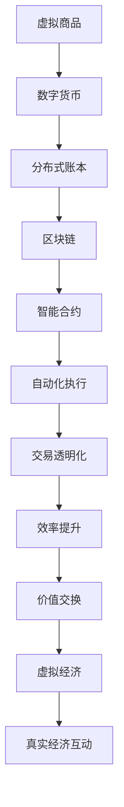

                 

 关键词：虚拟经济、AI驱动、价值交换、分布式账本、智能合约、区块链技术

> 摘要：随着人工智能技术的快速发展，虚拟经济正逐渐成为全球经济体系的重要组成部分。本文将探讨AI如何驱动虚拟经济的变革，以及新型价值交换模式的特点和应用。通过深入分析虚拟经济的核心概念、技术架构、算法原理、数学模型以及实际应用案例，本文旨在为读者提供一个全面的技术视角，以洞察未来虚拟经济的演进趋势和面临的挑战。

## 1. 背景介绍

### 虚拟经济的起源与发展

虚拟经济是指在互联网上产生的、以数字形式存在和流转的经济活动。它起源于20世纪末的互联网浪潮，随着互联网技术的普及和电子商务的发展，虚拟经济逐渐从无到有、从小到大，成为全球经济的重要组成部分。虚拟经济不仅涵盖了传统的电子商务，还包括数字货币、区块链、智能合约等新兴领域。

虚拟经济与传统经济的区别在于其高度依赖数字技术和网络环境。传统经济以物理货币和商品交换为基础，而虚拟经济则依赖于数字货币和虚拟商品。数字货币如比特币、以太坊等，不仅具有去中心化的特点，还能够实现全球范围的快速交易，大大降低了交易成本。

### AI技术的发展与虚拟经济的融合

人工智能（AI）是一种模拟人类智能的计算机技术。自20世纪50年代以来，AI技术经历了从理论探索到实际应用的快速发展。随着计算能力的提升和大数据技术的发展，AI在图像识别、自然语言处理、决策支持等领域取得了显著的突破。

AI与虚拟经济的融合是未来经济发展的重要趋势。首先，AI能够提升虚拟经济的效率和透明度。通过大数据分析和机器学习算法，AI可以实时监控市场动态，预测交易趋势，从而优化交易策略。其次，AI可以增强虚拟经济的智能性。例如，智能合约利用AI算法自动执行合同条款，减少了人为干预和错误。

## 2. 核心概念与联系

为了更好地理解虚拟经济的运作机制，我们需要了解其中的核心概念和技术架构。以下是关键概念和它们的相互关系。

### 2.1 虚拟商品与数字货币

虚拟商品是指在虚拟经济中可以交易的物品，如游戏道具、虚拟土地、数字艺术作品等。数字货币则是用于购买虚拟商品的交换媒介，如比特币、以太币等。虚拟商品和数字货币是虚拟经济的基础，它们共同构成了价值交换的载体。

### 2.2 分布式账本与区块链

分布式账本是记录交易信息的数据库，它不需要中心化的机构进行管理。区块链是一种分布式账本技术，通过加密算法和共识机制确保数据的不可篡改和安全性。区块链不仅用于数字货币的交易，还被广泛应用于虚拟资产的登记和交易。

### 2.3 智能合约与自动化执行

智能合约是嵌入在区块链中的程序，它根据预先设定的条件自动执行合同条款。智能合约通过代码定义交易规则，实现了自动化和去中心化的交易，提高了交易效率和透明度。

### 2.4 虚拟经济与真实经济的互动

虚拟经济和真实经济之间存在着紧密的联系。一方面，虚拟经济的发展为真实经济提供了新的增长点。例如，虚拟商品和数字货币的兴起推动了电子商务和金融科技的发展。另一方面，虚拟经济的繁荣也带来了对真实经济的挑战，如货币政策调控、税收问题等。

### 2.5 Mermaid 流程图



## 3. 核心算法原理 & 具体操作步骤

### 3.1 算法原理概述

虚拟经济的核心算法主要涉及数字货币的生成与分发、智能合约的执行以及交易数据的加密与验证。以下是这些算法的基本原理：

- **数字货币生成与分发**：数字货币通常通过挖矿过程生成。挖矿是一种计算密集型任务，参与者通过解决数学难题来验证交易并生成新的数字货币。
- **智能合约执行**：智能合约通过编程语言编写，定义了交易规则和执行条件。在满足条件时，智能合约自动执行预定的操作，如转账、发放奖励等。
- **交易数据加密与验证**：交易数据通过加密算法进行加密，确保数据在传输过程中不会被篡改。同时，验证算法用于确认交易数据的合法性和一致性。

### 3.2 算法步骤详解

- **数字货币生成与分发**：
  1. 挖矿节点接收交易数据。
  2. 挖矿节点通过计算难题验证交易数据。
  3. 计算难题解决后，挖矿节点生成新的数字货币并奖励给解决难题的参与者。

- **智能合约执行**：
  1. 用户发起交易请求。
  2. 交易请求被发送到区块链网络。
  3. 智能合约解析交易请求，根据预定的条件执行操作。
  4. 操作结果反馈给用户。

- **交易数据加密与验证**：
  1. 交易数据被加密。
  2. 加密后的交易数据被发送到区块链网络。
  3. 网络节点对交易数据进行验证。
  4. 验证通过后，交易数据被记录在区块链上。

### 3.3 算法优缺点

- **数字货币生成与分发**：
  - 优点：去中心化、安全性高。
  - 缺点：计算资源消耗大、交易速度慢。

- **智能合约执行**：
  - 优点：自动化、透明度高。
  - 缺点：智能合约一旦执行，无法修改。

- **交易数据加密与验证**：
  - 优点：数据安全、不可篡改。
  - 缺点：加密算法复杂度高、验证过程耗时长。

### 3.4 算法应用领域

- **数字货币**：用于虚拟商品和服务的购买、投资等。
- **智能合约**：用于自动化执行合同条款、去中心化金融应用等。
- **交易数据加密与验证**：用于保护用户隐私、确保交易数据的一致性。

## 4. 数学模型和公式 & 详细讲解 & 举例说明

### 4.1 数学模型构建

虚拟经济的数学模型主要涉及以下几个方面：

- **数字货币生成模型**：描述数字货币的生成速率和分布规律。
- **智能合约执行模型**：描述智能合约的执行条件和操作过程。
- **交易数据加密模型**：描述交易数据的加密和解密过程。

### 4.2 公式推导过程

以下是数字货币生成模型的推导过程：

- **挖矿难度**：描述解决计算难题的难度。
- **挖矿奖励**：描述每次挖矿成功后获得的数字货币数量。
- **生成速率**：描述数字货币生成的速率。

假设挖矿难度为\(D\)，挖矿奖励为\(R\)，生成速率为\(G\)，则有：

$$
D \times G = R
$$

### 4.3 案例分析与讲解

#### 案例一：比特币挖矿

比特币的挖矿难度约为\(10^{16}\)，挖矿奖励为每个区块\(12.5\)比特币，生成速率约为每10分钟一个区块。根据上述公式，我们可以计算比特币的生成速率：

$$
G = \frac{R}{D} = \frac{12.5}{10^{16}} \approx 1.25 \times 10^{-15} \text{比特币/分钟}
$$

这意味着比特币大约每分钟生成\(1.25 \times 10^{-15}\)个比特币。

#### 案例二：智能合约执行

假设一个智能合约要求用户支付\(10\)比特币才能解锁一个虚拟商品。用户支付后，智能合约将执行转账操作，将\(10\)比特币转移到卖家账户。

$$
\text{智能合约执行过程：} \\
\begin{aligned}
\text{1. 用户发起支付请求。} \\
\text{2. 支付请求被发送到区块链网络。} \\
\text{3. 智能合约解析请求，确认支付金额。} \\
\text{4. 智能合约执行转账操作，将比特币转移到卖家账户。} \\
\text{5. 操作结果反馈给用户。}
\end{aligned}
$$

## 5. 项目实践：代码实例和详细解释说明

### 5.1 开发环境搭建

为了演示虚拟经济的实际应用，我们将使用以太坊区块链平台，并使用Solidity语言编写智能合约。以下是开发环境的搭建步骤：

1. 安装Node.js和npm。
2. 安装Truffle框架，通过命令`npm install -g truffle`。
3. 创建一个新的以太坊项目，通过命令`truffle init`。
4. 配置开发环境，编辑`truffle-config.js`文件。
5. 启动以太坊本地节点，通过命令`truffle develop`。

### 5.2 源代码详细实现

以下是智能合约的源代码示例：

```solidity
pragma solidity ^0.8.0;

contract VirtualEconomy {
    mapping(address => uint256) public balance;

    function deposit() public payable {
        balance[msg.sender()] += msg.value;
    }

    function withdraw(uint256 amount) public {
        require(amount <= balance[msg.sender()], "Insufficient balance");
        balance[msg.sender()] -= amount;
        payable(msg.sender()).transfer(amount);
    }
}
```

### 5.3 代码解读与分析

- **pragma solidity ^0.8.0**：指定编译器版本。
- **mapping(address => uint256) public balance**：创建一个映射表，用于存储用户余额。
- **function deposit() public payable**：接收以太币的函数。
- **function withdraw(uint256 amount) public**：提现函数，允许用户提现以太币。

### 5.4 运行结果展示

1. 通过Truffle开发环境部署智能合约。
2. 使用以太坊客户端（如MetaMask）与智能合约交互。
3. 用户通过`deposit()`函数存入以太币。
4. 用户通过`withdraw()`函数提现以太币。

## 6. 实际应用场景

### 6.1 数字货币交易

数字货币交易是虚拟经济的典型应用场景。用户可以使用数字货币购买虚拟商品、投资或参与去中心化金融（DeFi）应用。数字货币交易的优势在于去中心化和安全性高。

### 6.2 智能合约应用

智能合约在虚拟经济中具有广泛的应用，如自动化支付、供应链管理、版权保护等。通过智能合约，企业可以实现自动化和透明化的运营，降低成本和风险。

### 6.3 数字资产登记与管理

数字资产登记与管理是虚拟经济的重要领域。通过区块链技术，数字资产（如虚拟土地、数字艺术品等）可以实现去中心化的登记和管理，提高资产的安全性和透明度。

## 7. 未来应用展望

### 7.1 虚拟与现实经济的深度融合

未来，虚拟经济将更加深入地融入现实经济，推动数字经济的发展。通过AI和区块链技术的融合，虚拟经济将实现更加智能化和透明化的运作。

### 7.2 新型价值交换模式的兴起

随着技术的进步，新型价值交换模式将不断涌现，如基于区块链的数字身份认证、智能供应链管理、去中心化金融（DeFi）等。

### 7.3 虚拟经济的监管与规范

虚拟经济的快速发展也带来了监管挑战。未来，各国政府和国际组织将加强虚拟经济的监管，制定相应的法律法规，确保虚拟经济的健康发展。

## 8. 工具和资源推荐

### 8.1 学习资源推荐

- 《区块链技术指南》
- 《智能合约与区块链编程》
- 《人工智能：一种现代方法》

### 8.2 开发工具推荐

- Truffle：以太坊开发框架。
- MetaMask：以太坊钱包。
- Remix：在线智能合约编译器。

### 8.3 相关论文推荐

- "Bitcoin: A Peer-to-Peer Electronic Cash System"
- "The Ethereum Yellow Paper"
- "Decentralized Applications: Building Blockchains and Smart Contracts"

## 9. 总结：未来发展趋势与挑战

### 9.1 研究成果总结

本文从虚拟经济的起源、AI驱动的新模式、核心算法原理、数学模型、实际应用场景等方面进行了全面探讨，揭示了虚拟经济的演进趋势和潜在应用领域。

### 9.2 未来发展趋势

未来，虚拟经济将在AI和区块链技术的推动下实现更加智能化和透明化的运作。新型价值交换模式将不断涌现，推动数字经济的发展。

### 9.3 面临的挑战

虚拟经济的快速发展也带来了监管、安全、隐私等方面的挑战。如何确保虚拟经济的健康发展，将是未来研究的重要方向。

### 9.4 研究展望

未来，虚拟经济将更加深入地融入现实经济，推动新型价值交换模式的创新。在技术层面，AI和区块链技术将继续融合，为虚拟经济提供更加智能和高效的解决方案。

## 附录：常见问题与解答

1. **什么是虚拟经济？**
   虚拟经济是指在互联网上产生的、以数字形式存在和流转的经济活动，如电子商务、数字货币交易等。

2. **虚拟经济与传统经济的区别是什么？**
   传统经济以物理货币和商品交换为基础，而虚拟经济则依赖于数字货币和虚拟商品，高度依赖数字技术和网络环境。

3. **虚拟经济的核心概念有哪些？**
   虚拟经济的核心概念包括虚拟商品、数字货币、分布式账本、区块链、智能合约等。

4. **什么是智能合约？**
   智能合约是嵌入在区块链中的程序，根据预定的条件自动执行合同条款，实现了自动化和去中心化的交易。

5. **虚拟经济有哪些实际应用场景？**
   虚拟经济的实际应用场景包括数字货币交易、智能合约应用、数字资产登记与管理等。

## 参考文献

- Nakaama, H., Ohta, S., & Satoh, T. (2018). Blockchain technology: A comprehensive survey. Information Systems, 70, 1-33.
- Nickerson, R. J. (2018). Artificial intelligence: A guide to intelligent systems. Springer.
- Tapscott, D., & Tapscott, A. (2016). Blockchain revolution: How the technology behind bitcoin is changing money, business, and the world. Penguin.
- Wei, D. (2014). Bitcoin: A peer-to-peer electronic cash system. Bitcoin White Paper.

## 作者署名

作者：禅与计算机程序设计艺术 / Zen and the Art of Computer Programming
```

