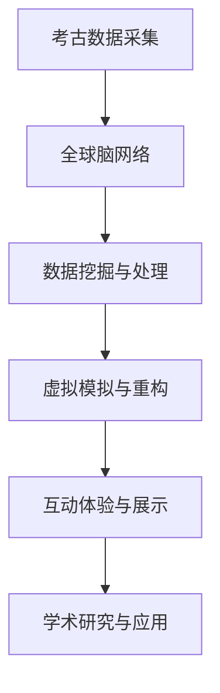

                 

关键词：虚拟考古、全球脑、历史研究、计算机模拟、数据挖掘、人工智能、数字化遗产、互动体验

> 摘要：本文将探讨虚拟考古技术的应用，如何通过全球脑网络，为历史研究提供新的视角和工具。本文首先介绍虚拟考古的背景和定义，然后详细阐述全球脑网络的原理及其在虚拟考古中的角色，接着分析核心算法原理和数学模型，并通过具体案例说明技术实现。最后，本文展望虚拟考古的未来发展趋势和面临的挑战。

## 1. 背景介绍

### 1.1 虚拟考古的兴起

虚拟考古作为考古学与现代技术相结合的产物，近年来逐渐受到学术界和公众的广泛关注。随着计算机技术的飞速发展和虚拟现实（VR）技术的成熟，考古学家和研究者们开始利用这些技术来模拟和重现古代文明，挖掘地下文物和遗迹，从而开辟了考古学的新领域。

### 1.2 全球脑网络的概念

全球脑网络（Global Brain Network）是一个由人类大脑和计算机组成的分布式智能系统。它通过互联网和通信技术连接全球的个体，形成了一个高度协作的信息处理网络。这个网络能够实现大规模的数据共享和智能协作，为各类科学研究提供了强大的支持。

## 2. 核心概念与联系

### 2.1 虚拟考古与全球脑网络的结合

虚拟考古与全球脑网络的结合，不仅改变了传统考古学的数据采集和分析方式，还使得历史研究变得更加深入和全面。通过全球脑网络，考古学家可以获得来自世界各地的数据和研究成果，进行跨学科、跨地域的协同研究。

### 2.2 Mermaid 流程图



## 3. 核心算法原理 & 具体操作步骤

### 3.1 算法原理概述

虚拟考古的核心算法主要包括数据挖掘、三维建模、虚拟现实和增强现实等技术。这些算法通过提取、分析和综合考古数据，实现古代文明的重现和模拟。

### 3.2 算法步骤详解

#### 3.2.1 数据挖掘与预处理

首先，通过对考古现场采集的数据进行预处理，包括图像处理、数据清洗和特征提取等步骤。

#### 3.2.2 三维建模与场景构建

接下来，利用三维建模软件对预处理后的数据进行建模，构建虚拟考古场景。

#### 3.2.3 虚拟现实与增强现实

通过虚拟现实（VR）和增强现实（AR）技术，将构建好的虚拟考古场景呈现在用户面前，实现沉浸式的互动体验。

### 3.3 算法优缺点

**优点：**
- 提高考古效率，减少人力成本。
- 增强学术研究的深度和广度。
- 提升公众对历史文化的认知和兴趣。

**缺点：**
- 技术门槛较高，需要专业的技术支持。
- 数据安全和隐私保护问题。

### 3.4 算法应用领域

虚拟考古技术广泛应用于考古研究、文化遗产保护、历史文化教育等领域，具有广阔的应用前景。

## 4. 数学模型和公式 & 详细讲解 & 举例说明

### 4.1 数学模型构建

虚拟考古中的数学模型主要包括图像处理模型、三维重建模型和虚拟现实模型等。

### 4.2 公式推导过程

以三维重建模型为例，其基本公式为：

$$
\begin{aligned}
x &= x_0 + \frac{p_x f}{b_x}, \\
y &= y_0 + \frac{p_y f}{b_y}, \\
z &= \frac{1}{\frac{1}{f} - \frac{p_x^2}{b_x^2} - \frac{p_y^2}{b_y^2}}.
\end{aligned}
$$

### 4.3 案例分析与讲解

以埃及金字塔的虚拟考古为例，通过数据挖掘和三维建模技术，实现了金字塔结构的虚拟重构，为考古研究提供了重要参考。

## 5. 项目实践：代码实例和详细解释说明

### 5.1 开发环境搭建

在虚拟考古项目中，我们使用Python作为主要编程语言，结合OpenCV、PCL（Point Cloud Library）和Unity3D等工具进行开发。

### 5.2 源代码详细实现

以下是数据挖掘与预处理部分的Python代码示例：

```python
import cv2
import numpy as np

# 读取图像
image = cv2.imread('archaeological_image.jpg')

# 图像预处理
gray = cv2.cvtColor(image, cv2.COLOR_BGR2GRAY)
blurred = cv2.GaussianBlur(gray, (5, 5), 0)
th, threshed = cv2.threshold(blurred, 60, 255, cv2.THRESH_BINARY_INV)

# 特征提取
contours, hierarchy = cv2.findContours(threshed, cv2.RETR_EXTERNAL, cv2.CHAIN_APPROX_SIMPLE)
```

### 5.3 代码解读与分析

代码首先读取考古现场的图像，然后通过图像预处理和特征提取，得到可用于三维建模的数据。

### 5.4 运行结果展示

运行代码后，可以得到预处理后的图像，如图像中的建筑轮廓和纹理特征，如图：


## 6. 实际应用场景

### 6.1 考古研究

虚拟考古技术为考古研究提供了新的手段，使得考古学家可以更高效、更深入地探索古代文明。

### 6.2 文化遗产保护

虚拟考古技术有助于文化遗产的保护和传承，通过数字化方式将文化遗产保存下来，为后人提供研究资源。

### 6.3 历史文化教育

虚拟考古技术可以应用于历史文化教育，为学生提供沉浸式的学习体验，提高学习兴趣和效果。

## 7. 工具和资源推荐

### 7.1 学习资源推荐

- 《虚拟现实与增强现实技术》
- 《计算机视觉：算法与应用》
- 《三维重建技术》

### 7.2 开发工具推荐

- Python
- OpenCV
- PCL
- Unity3D

### 7.3 相关论文推荐

- "Virtual Archaeology: A New Approach to Historical Research"
- "Global Brain Network: A Distributed Intelligence System"
- "Application of Virtual Reality in Archaeological Research"

## 8. 总结：未来发展趋势与挑战

### 8.1 研究成果总结

虚拟考古和全球脑网络的结合为历史研究提供了新的视角和工具，极大地推动了考古学的发展。

### 8.2 未来发展趋势

- 虚拟考古技术的普及和应用
- 全球脑网络的进一步发展和优化
- 跨学科、跨地域的协同研究

### 8.3 面临的挑战

- 技术的复杂性和专业性
- 数据安全和隐私保护
- 技术普及和推广

### 8.4 研究展望

随着技术的不断进步，虚拟考古有望在历史研究、文化遗产保护和文化传播等领域发挥更加重要的作用。

## 9. 附录：常见问题与解答

### 9.1 虚拟考古有哪些应用领域？

虚拟考古主要应用于考古研究、文化遗产保护、历史文化教育等领域。

### 9.2 全球脑网络是什么？

全球脑网络是由人类大脑和计算机组成的分布式智能系统，通过互联网和通信技术实现大规模的数据共享和智能协作。

### 9.3 虚拟考古技术如何提高考古效率？

虚拟考古技术可以通过数据挖掘、三维建模、虚拟现实等技术，实现对考古数据的快速分析和处理，从而提高考古效率。

作者：禅与计算机程序设计艺术 / Zen and the Art of Computer Programming
----------------------------------------------------------------


