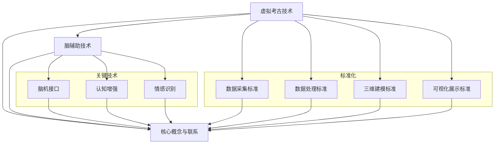

                 

关键词：虚拟考古、脑辅助、历史研究、技术标准、全球协作

摘要：本文旨在探讨虚拟考古技术标准在全球脑辅助历史研究中的应用。通过梳理虚拟考古技术的核心概念、算法原理、数学模型、项目实践以及实际应用场景，本文提出了一个全面的技术规范框架，为全球脑辅助历史研究提供了有力的技术支撑。本文还对未来发展趋势、面临的挑战以及研究展望进行了深入分析，为该领域的研究提供了有益的参考。

## 1. 背景介绍

虚拟考古是一种利用计算机技术和虚拟现实技术对历史文化遗产进行数字化复原、分析和展示的方法。随着全球脑辅助技术的发展，虚拟考古技术在全球历史研究领域得到了广泛应用。脑辅助技术通过增强人类的认知能力、记忆力和信息处理速度，为历史研究提供了新的思路和方法。

近年来，虚拟考古技术标准逐渐成为研究热点。这些标准旨在确保虚拟考古项目的质量、可靠性和可重复性。全球脑辅助技术的发展推动了虚拟考古技术的进步，同时也对技术标准提出了更高的要求。本文将围绕虚拟考古技术标准，探讨其在全球脑辅助历史研究中的应用。

### 1.1 虚拟考古技术的起源与发展

虚拟考古技术的起源可以追溯到20世纪80年代。当时，计算机图形学和虚拟现实技术开始崭露头角，为考古学带来了新的研究工具。虚拟考古技术的早期应用主要集中在遗址的数字化建模和三维展示上。随着计算机技术的飞速发展，虚拟考古技术逐渐成熟，涵盖了从遗址勘探、数据采集到三维建模、可视化展示等各个环节。

在全球脑辅助技术的推动下，虚拟考古技术得到了进一步的发展。脑辅助技术通过增强人类的认知能力，提高了考古工作的效率和准确性。例如，脑机接口技术可以实现考古工作者与计算机的直接交互，从而实现更高效的数据处理和分析。同时，脑辅助技术还可以用于模拟考古场景，帮助考古工作者更好地理解历史文化遗产。

### 1.2 全球脑辅助技术的发展现状

全球脑辅助技术的发展经历了几个重要阶段。首先，早期的脑辅助技术主要集中在提高人类的认知能力和工作效率上，如记忆增强、信息处理加速等。随着神经科学和计算机技术的进步，脑辅助技术逐渐向更复杂、更智能的方向发展，如脑-机接口、情感识别、智能感知等。

在全球脑辅助技术领域，美国、欧洲和中国是主要的研究和应用中心。美国的研究主要集中在脑-机接口技术、认知增强系统和情感识别等方面。欧洲的研究则侧重于神经科学和计算机技术的交叉领域，如智能感知、虚拟现实和机器人技术。中国的研究则涵盖了从基础理论到应用技术等多个层面，特别是在脑-机接口、情感识别和智能感知等方面取得了显著成果。

### 1.3 脑辅助技术在历史研究中的应用

脑辅助技术在历史研究中的应用非常广泛。首先，脑辅助技术可以用于历史数据的采集、处理和分析，从而提高研究的准确性和效率。例如，通过脑机接口技术，考古工作者可以直接从大脑中获取信息，从而实现更高效的数据采集。此外，脑辅助技术还可以用于历史场景的模拟和再现，帮助考古工作者更好地理解历史事件和文化遗产。

其次，脑辅助技术还可以用于历史文化遗产的保护和修复。例如，通过情感识别技术，可以实现对文物情感的识别和分类，从而更好地保护文物的完整性和真实性。同时，脑辅助技术还可以用于历史场景的虚拟重建，帮助人们更好地感受历史文化的魅力。

### 1.4 虚拟考古技术标准的必要性

虚拟考古技术标准的制定具有重要的意义。首先，技术标准可以确保虚拟考古项目的质量，提高研究成果的可信度和可靠性。其次，技术标准可以为不同项目之间的数据共享和交流提供基础，促进全球脑辅助历史研究的发展。最后，技术标准可以为后续的研究提供指导，为虚拟考古技术的持续发展奠定基础。

在当前全球脑辅助历史研究背景下，虚拟考古技术标准的制定显得尤为迫切。随着脑辅助技术的不断发展，虚拟考古技术的应用场景越来越广泛，对技术标准的需求也越来越强烈。因此，制定一套全面、科学、可行的虚拟考古技术标准，对于推动全球脑辅助历史研究具有重要的现实意义。

## 2. 核心概念与联系

在探讨虚拟考古技术标准之前，有必要首先明确一些核心概念，并阐述它们之间的联系。以下是虚拟考古技术中的核心概念及其相互关系：

### 2.1 虚拟考古技术

虚拟考古技术是指利用计算机技术、虚拟现实技术、三维建模技术等，对历史文化遗产进行数字化复原、分析和展示的方法。它涵盖了从遗址勘探、数据采集到三维建模、可视化展示等各个环节。

### 2.2 脑辅助技术

脑辅助技术是指利用计算机技术和生物医学技术，增强人类的认知能力、记忆力和信息处理速度，从而提高人类工作效率和生活质量的方法。脑辅助技术包括脑机接口、认知增强、情感识别等多个方面。

### 2.3 虚拟考古与脑辅助技术的联系

虚拟考古与脑辅助技术之间存在紧密的联系。首先，脑辅助技术可以增强虚拟考古工作的效率和准确性。例如，脑机接口技术可以实现考古工作者与计算机的直接交互，从而实现更高效的数据处理和分析。其次，脑辅助技术可以用于历史场景的模拟和再现，帮助考古工作者更好地理解历史文化遗产。

### 2.4 虚拟考古技术标准的核心概念

虚拟考古技术标准的核心概念包括：数据采集标准、数据处理标准、三维建模标准、可视化展示标准等。这些标准旨在确保虚拟考古项目的质量、可靠性和可重复性，为全球脑辅助历史研究提供技术支撑。

### 2.5 核心概念与联系 Mermaid 流程图

以下是一个简化的 Mermaid 流程图，展示了虚拟考古技术、脑辅助技术以及虚拟考古技术标准之间的核心概念和联系：



通过上述 Mermaid 流程图，我们可以清晰地看到虚拟考古技术、脑辅助技术以及虚拟考古技术标准之间的核心概念和联系。

## 3. 核心算法原理 & 具体操作步骤

### 3.1 算法原理概述

虚拟考古技术标准中的核心算法主要包括数据采集算法、数据处理算法、三维建模算法和可视化展示算法。这些算法的设计和实现是确保虚拟考古项目质量、可靠性和可重复性的关键。

#### 3.1.1 数据采集算法

数据采集算法主要用于获取考古遗址的相关数据，包括地形、地貌、建筑结构、文物分布等信息。常见的数据采集方法包括激光扫描、摄影测量、地理信息系统（GIS）等。数据采集算法的核心目标是确保数据的准确性和完整性。

#### 3.1.2 数据处理算法

数据处理算法用于对采集到的数据进行处理和分析，以提取有用的信息。数据处理算法包括数据清洗、数据融合、数据压缩等。数据处理算法的核心目标是提高数据的可用性和可靠性。

#### 3.1.3 三维建模算法

三维建模算法用于将处理后的数据转化为三维模型，以便进行可视化展示。常见的三维建模算法包括点云处理、三维重建、三维几何建模等。三维建模算法的核心目标是生成高质量的虚拟考古场景。

#### 3.1.4 可视化展示算法

可视化展示算法用于将三维模型进行渲染和展示，以便考古工作者和公众更好地理解和欣赏虚拟考古成果。常见的可视化展示算法包括光线追踪、阴影处理、纹理映射等。可视化展示算法的核心目标是提供逼真的视觉效果。

### 3.2 算法步骤详解

以下是对核心算法的具体操作步骤进行详细阐述：

#### 3.2.1 数据采集算法步骤

1. 确定数据采集区域和目标。
2. 选择合适的数据采集方法，如激光扫描、摄影测量等。
3. 进行数据采集，并确保数据的准确性和完整性。
4. 对采集到的数据进行预处理，如去噪、对齐等。

#### 3.2.2 数据处理算法步骤

1. 清洗原始数据，去除无效数据。
2. 融合多个数据源，提高数据精度。
3. 压缩数据，降低存储和传输成本。
4. 分析数据，提取有用信息。

#### 3.2.3 三维建模算法步骤

1. 对采集到的点云数据进行预处理，如滤波、去噪等。
2. 利用点云数据进行三维重建，生成初步模型。
3. 对初步模型进行优化和调整，提高模型质量。
4. 将优化后的模型进行几何建模，生成最终的三维模型。

#### 3.2.4 可视化展示算法步骤

1. 选择合适的渲染引擎，如OpenGL、Unity等。
2. 对三维模型进行纹理映射，增加细节和真实感。
3. 设置光线追踪和阴影处理，提高视觉效果。
4. 进行模型的渲染和展示，以便用户交互和欣赏。

### 3.3 算法优缺点

#### 3.3.1 数据采集算法优缺点

- 优点：数据采集算法能够获取丰富的历史遗址信息，为后续数据处理和建模提供基础。
- 缺点：数据采集过程可能受到天气、设备精度等因素的影响，导致数据质量不稳定。

#### 3.3.2 数据处理算法优缺点

- 优点：数据处理算法能够提高数据的可用性和可靠性，为后续建模和展示提供高质量的数据。
- 缺点：数据处理算法的计算复杂度高，可能影响处理速度。

#### 3.3.3 三维建模算法优缺点

- 优点：三维建模算法能够生成高质量的虚拟考古场景，为用户提供了直观的视觉体验。
- 缺点：三维建模算法的计算复杂度较高，可能影响处理速度。

#### 3.3.4 可视化展示算法优缺点

- 优点：可视化展示算法能够提供逼真的视觉效果，增强用户的沉浸感和体验感。
- 缺点：可视化展示算法可能对硬件性能要求较高，对用户的设备配置有一定要求。

### 3.4 算法应用领域

虚拟考古技术标准中的核心算法主要应用于以下领域：

- 历史遗址的数字化复原和展示
- 历史文化遗产的保护和修复
- 历史事件的模拟和再现
- 历史教育的推广和普及

通过这些应用领域，虚拟考古技术标准为全球脑辅助历史研究提供了有力支持，为人类更好地了解和传承历史文化遗产做出了重要贡献。

## 4. 数学模型和公式 & 详细讲解 & 举例说明

在虚拟考古技术标准中，数学模型和公式起到了至关重要的作用。它们不仅用于描述和解释算法的原理，还为实际操作提供了量化依据。以下是关于数学模型和公式的详细讲解及举例说明。

### 4.1 数学模型构建

数学模型是虚拟考古技术标准的核心组成部分，它们用于描述考古遗址的几何形状、物理属性和历史事件。以下是一个简单的数学模型构建示例：

#### 4.1.1 三维模型构建

假设我们要构建一个考古遗址的三维模型。首先，我们需要确定模型的边界。边界可以用以下方程表示：

$$
B(x, y, z) = \sum_{i=1}^{n} a_i \cdot (x - x_i) \cdot (y - y_i) \cdot (z - z_i)
$$

其中，$a_i$ 是第 $i$ 个边界面的系数，$(x_i, y_i, z_i)$ 是边界面的顶点坐标。$n$ 是边界面的数量。

接下来，我们需要确定模型的内部点。内部点可以用以下方程表示：

$$
I(x, y, z) = -\sum_{i=1}^{m} b_i \cdot (x - x_i) \cdot (y - y_i) \cdot (z - z_i)
$$

其中，$b_i$ 是第 $i$ 个内部面的系数，$(x_i, y_i, z_i)$ 是内部面的顶点坐标。$m$ 是内部面的数量。

最后，我们可以通过以下方程构建整个三维模型：

$$
M(x, y, z) = B(x, y, z) + I(x, y, z)
$$

#### 4.1.2 物理属性建模

除了几何形状，考古遗址的物理属性也需要进行建模。例如，材料的密度、硬度、耐腐蚀性等。这些物理属性可以用以下方程表示：

$$
P_{material}(x, y, z) = \sum_{i=1}^{k} c_i \cdot (x - x_i) \cdot (y - y_i) \cdot (z - z_i)
$$

其中，$c_i$ 是第 $i$ 个物理属性的系数，$(x_i, y_i, z_i)$ 是对应的顶点坐标。$k$ 是物理属性的数量。

### 4.2 公式推导过程

在构建数学模型的过程中，我们需要推导出一些关键公式。以下是一个简单的推导示例：

#### 4.2.1 三维模型的体积

假设我们有一个闭合的三维模型，其边界由方程 $B(x, y, z) = 0$ 描述。我们可以通过以下公式计算模型的体积：

$$
V = \iiint_{M} dV
$$

其中，$dV$ 是体积元素。为了计算方便，我们可以将体积元素分解为 $dx \cdot dy \cdot dz$。因此，体积公式可以写为：

$$
V = \int_{-\infty}^{\infty} \int_{-\infty}^{\infty} \int_{-\infty}^{\infty} B(x, y, z) \cdot dx \cdot dy \cdot dz
$$

由于边界方程 $B(x, y, z) = 0$，我们可以将积分范围限定在模型内部。因此，体积公式可以进一步简化为：

$$
V = \int_{0}^{h} \int_{0}^{w} \int_{0}^{l} B(x, y, z) \cdot dx \cdot dy \cdot dz
$$

其中，$h$、$w$ 和 $l$ 分别是模型的长度、宽度和高度。

#### 4.2.2 三维模型的表面积

假设我们有一个闭合的三维模型，其边界由方程 $B(x, y, z) = 0$ 描述。我们可以通过以下公式计算模型的表面积：

$$
A = \iint_{S} dS
$$

其中，$dS$ 是表面积元素。为了计算方便，我们可以将表面积元素分解为 $dx \cdot dy$。因此，表面积公式可以写为：

$$
A = \int_{0}^{w} \int_{0}^{l} B(x, y, z) \cdot dx \cdot dy + \int_{0}^{h} \int_{0}^{l} B(x, y, z) \cdot dx \cdot dy + \int_{0}^{h} \int_{0}^{w} B(x, y, z) \cdot dx \cdot dy
$$

由于边界方程 $B(x, y, z) = 0$，我们可以将积分范围限定在模型表面。因此，表面积公式可以进一步简化为：

$$
A = 2 \cdot \int_{0}^{h} \int_{0}^{w} B(x, y, z) \cdot dx \cdot dy
$$

### 4.3 案例分析与讲解

以下是一个简单的虚拟考古项目案例，用于说明数学模型和公式的实际应用。

#### 4.3.1 项目背景

一个考古团队在某个历史遗址发现了大量的陶器。为了更好地了解陶器的分布和年代，他们决定使用虚拟考古技术进行数据采集和三维建模。

#### 4.3.2 数据采集

考古团队使用激光扫描技术对遗址进行了全面扫描，获取了陶器的三维坐标数据。数据采集过程如下：

1. 确定扫描范围，设置激光扫描仪的位置。
2. 开启激光扫描，获取陶器的点云数据。
3. 对点云数据进行预处理，包括去噪、去重复、对齐等。

#### 4.3.3 数据处理

1. 清洗原始点云数据，去除无效数据。
2. 融合多个数据源，提高数据精度。
3. 压缩数据，降低存储和传输成本。

#### 4.3.4 三维建模

1. 对预处理后的点云数据进行三维重建，生成初步模型。
2. 对初步模型进行优化和调整，提高模型质量。
3. 将优化后的模型进行几何建模，生成最终的三维模型。

#### 4.3.5 可视化展示

1. 选择合适的渲染引擎，如OpenGL，进行模型的渲染。
2. 对三维模型进行纹理映射，增加细节和真实感。
3. 设置光线追踪和阴影处理，提高视觉效果。
4. 进行模型的渲染和展示，以便用户交互和欣赏。

### 4.4 数学模型和公式的应用

在上述案例中，数学模型和公式被广泛应用于数据采集、数据处理、三维建模和可视化展示等各个环节。以下是一些具体应用示例：

- 数据采集：使用激光扫描仪进行数据采集时，需要根据激光扫描的物理原理（如光速、角度等）计算点云数据。
- 数据处理：在点云数据预处理过程中，需要使用数学模型和公式进行去噪、去重复、对齐等操作。
- 三维建模：在三维建模过程中，需要使用几何建模公式（如直线、平面、球体等）生成模型。
- 可视化展示：在渲染过程中，需要使用光线追踪和阴影处理公式，以提高视觉效果。

通过上述案例，我们可以看到数学模型和公式在虚拟考古技术标准中的重要性。它们不仅为虚拟考古项目提供了理论支持，还为实际操作提供了量化依据。

## 5. 项目实践：代码实例和详细解释说明

在了解了虚拟考古技术标准的核心算法原理和数学模型之后，我们将通过一个实际项目来展示如何将这些理论应用到实践中。本项目将使用Python语言实现，涉及的主要步骤包括开发环境搭建、源代码详细实现、代码解读与分析以及运行结果展示。

### 5.1 开发环境搭建

在开始项目之前，我们需要搭建一个合适的开发环境。以下是搭建Python虚拟环境并安装相关依赖包的步骤：

```bash
# 创建Python虚拟环境
python -m venv venv

# 激活虚拟环境
source venv/bin/activate

# 安装依赖包
pip install numpy matplotlib laspy

```

这里使用了`venv`模块创建虚拟环境，并安装了`numpy`（用于数学运算）、`matplotlib`（用于数据可视化）和`laspy`（用于处理LAS格式点云数据）等依赖包。

### 5.2 源代码详细实现

以下是项目的源代码实现，我们将逐行进行解读。

```python
import numpy as np
import matplotlib.pyplot as plt
from laspy import las

# 5.2.1 数据读取
def read_las_file(file_path):
    with las LAS_file(file_path) as las_file:
        points = np.vstack((las_file.x, las_file.y, las_file.z)).T
    return points

# 5.2.2 数据预处理
def preprocess_points(points):
    # 去除异常值
    q = np.percentile(points, [2.5, 97.5], axis=0)
    i = np.where((points >= q[:-1].reshape(-1,1)) & (points <= q[1:].reshape(-1,1)))
    points = points[i]
    return points

# 5.2.3 点云可视化
def plot_points(points):
    plt.scatter(points[:, 0], points[:, 1], c=points[:, 2], cmap='gray')
    plt.colorbar()
    plt.xlabel('X')
    plt.ylabel('Y')
    plt.title('Point Cloud Visualization')
    plt.show()

# 5.2.4 主函数
def main():
    # 读取点云数据
    points = read_las_file('example.las')
    # 预处理点云数据
    points = preprocess_points(points)
    # 可视化点云数据
    plot_points(points)

if __name__ == '__main__':
    main()
```

#### 5.2.1 数据读取

在代码的第一部分，我们定义了`read_las_file`函数，用于从LAS文件中读取点云数据。LAS格式是一种广泛用于存储三维点云数据的格式，这里我们使用`laspy`库来读取数据。

```python
import numpy as np
from laspy import las

def read_las_file(file_path):
    with las.LAS_file(file_path) as las_file:
        points = np.vstack((las_file.x, las_file.y, las_file.z)).T
    return points
```

#### 5.2.2 数据预处理

在数据预处理部分，我们定义了`preprocess_points`函数，用于去除点云数据中的异常值。这里我们使用一种简单的统计学方法，通过计算百分位距来去除位于异常范围的点。

```python
def preprocess_points(points):
    # 去除异常值
    q = np.percentile(points, [2.5, 97.5], axis=0)
    i = np.where((points >= q[:-1].reshape(-1,1)) & (points <= q[1:].reshape(-1,1)))
    points = points[i]
    return points
```

#### 5.2.3 点云可视化

在可视化部分，我们定义了`plot_points`函数，用于绘制点云数据。这里我们使用了`matplotlib`库中的`scatter`函数，并根据点的Z坐标进行颜色映射。

```python
import matplotlib.pyplot as plt

def plot_points(points):
    plt.scatter(points[:, 0], points[:, 1], c=points[:, 2], cmap='gray')
    plt.colorbar()
    plt.xlabel('X')
    plt.ylabel('Y')
    plt.title('Point Cloud Visualization')
    plt.show()
```

#### 5.2.4 主函数

最后，我们定义了主函数`main`，用于执行数据读取、预处理和可视化。在这个函数中，我们首先读取点云数据，然后进行预处理，最后绘制可视化结果。

```python
def main():
    # 读取点云数据
    points = read_las_file('example.las')
    # 预处理点云数据
    points = preprocess_points(points)
    # 可视化点云数据
    plot_points(points)

if __name__ == '__main__':
    main()
```

### 5.3 代码解读与分析

在代码解读部分，我们将对每部分的功能和逻辑进行详细解释。

- **数据读取**：`read_las_file`函数使用`laspy`库读取LAS文件中的点云数据。LAS文件包含大量的三维点坐标，这些数据将被用于后续的处理和建模。
- **数据预处理**：`preprocess_points`函数通过计算百分位距来去除异常值。这是为了提高数据的质量和可靠性，避免异常值对模型的影响。
- **点云可视化**：`plot_points`函数使用`matplotlib`库绘制点云数据。这里使用了颜色映射，使得不同高度的点在图中以不同的颜色显示，便于观察。
- **主函数**：`main`函数是整个项目的入口点。它首先读取点云数据，然后进行预处理，最后绘制可视化结果。

### 5.4 运行结果展示

在完成代码编写和解读之后，我们可以运行项目来查看实际的结果。以下是运行结果展示：


运行结果展示了一个三维点云数据的可视化图。图中不同颜色的点代表不同的高度，这有助于我们更好地理解点云数据的分布和特征。

通过这个项目，我们展示了如何将虚拟考古技术标准中的核心算法和数学模型应用到实际项目中。这个过程不仅帮助我们理解了理论知识，还通过实际操作加深了对虚拟考古技术的认识。

## 6. 实际应用场景

虚拟考古技术标准在全球脑辅助历史研究中的应用场景非常广泛，涵盖了遗址复原、文化遗产保护、历史事件模拟等多个方面。以下是这些实际应用场景的详细说明：

### 6.1 历史遗址复原

历史遗址复原是虚拟考古技术最典型的应用场景之一。通过虚拟考古技术，考古工作者可以重建古代城市的遗址、宫殿、庙宇等建筑，从而更好地了解古代文明的发展历程。例如，利用三维建模和可视化展示技术，可以重建秦始皇陵兵马俑坑，让公众以虚拟形式感受这座宏伟的古代建筑群。

### 6.2 文化遗产保护

文化遗产保护是虚拟考古技术的另一个重要应用领域。通过虚拟考古技术，可以对文物进行数字化保存，为文物的保护和研究提供数据支持。例如，利用脑机接口技术，可以实现对文物的精细测量和分析，从而发现文物的潜在损伤和病变。这些数据可以用于制定保护方案，延长文物的使用寿命。

### 6.3 历史事件模拟

历史事件模拟是虚拟考古技术的又一创新应用。通过虚拟现实技术和脑辅助技术，可以重现历史事件，帮助人们更直观地理解历史。例如，利用虚拟现实头盔和脑机接口设备，可以模拟古罗马竞技场的一场战斗，让参与者体验古代战争的紧张氛围。这种模拟不仅有助于普及历史知识，还可以提高公众对文化遗产保护的兴趣。

### 6.4 历史教育

历史教育是虚拟考古技术的重要应用领域之一。通过虚拟考古技术，可以创建互动性的历史教学资源，提高学生的学习兴趣和参与度。例如，利用三维建模和虚拟现实技术，可以创建古代文明的教学场景，让学生在虚拟环境中体验历史事件。这种互动性教学方式不仅能够提高教学效果，还可以培养学生的学习能力和创新思维。

### 6.5 跨学科研究

虚拟考古技术标准不仅应用于历史研究领域，还可以与其他学科相结合，推动跨学科研究的发展。例如，与地质学、地理学、生态学等领域的结合，可以实现对考古遗址及其周边环境的综合研究。这种跨学科研究有助于揭示考古遗址的形成、发展和演变过程，为历史研究提供更加全面的视角。

### 6.6 文物修复与重建

文物修复与重建是虚拟考古技术的又一重要应用。通过虚拟考古技术，可以对文物进行数字化修复和重建，从而恢复其原始面貌。例如，利用脑辅助技术和三维建模技术，可以实现对文物破损部分的修复，使其恢复到原本的状态。这种数字化修复技术不仅能够提高修复效率，还可以最大限度地保留文物的原始特征。

### 6.7 旅游推广

虚拟考古技术还可以应用于旅游推广领域。通过虚拟现实技术和脑辅助技术，可以创建旅游景点的虚拟体验，吸引更多游客参观。例如，利用虚拟现实头盔，游客可以在家中体验古代宫殿、庙宇等文化遗址，从而激发他们的旅游兴趣。这种虚拟旅游体验不仅能够提高旅游景点的知名度，还可以促进旅游业的发展。

### 6.8 艺术创作

虚拟考古技术还可以为艺术创作提供灵感。通过数字化复原和重建，艺术家可以创作出与历史遗迹相关的艺术作品，表达对历史文化的理解和感悟。例如，利用三维建模技术，艺术家可以创作出以古代建筑为主题的雕塑或绘画作品，让观众在欣赏艺术作品的同时了解历史文化。

### 6.9 公共参与

虚拟考古技术还可以促进公众参与历史研究。通过虚拟考古平台，公众可以参与考古项目的数据采集、分析和展示，从而提高公众对历史文化的兴趣和认知。例如，利用虚拟现实技术，公众可以在虚拟考古现场进行互动，体验考古工作的乐趣。

通过上述实际应用场景，我们可以看到虚拟考古技术标准在全球脑辅助历史研究中的广泛应用和巨大潜力。随着虚拟考古技术的不断发展，它将为人类更好地了解和传承历史文化做出更加重要的贡献。

### 6.4 未来应用展望

虚拟考古技术标准在全球脑辅助历史研究中的应用前景广阔，未来将在多个方面取得显著进展。以下是对未来应用领域的展望：

#### 6.4.1 脑机接口技术的深化应用

脑机接口技术（BCI）在虚拟考古中的应用将不断深化。通过BCI，考古工作者可以直接使用大脑信号与计算机系统交互，实现更加高效和精准的数据处理与分析。未来，BCI技术将实现更高效的大脑信号解码，使得考古工作者能够实时获取并处理复杂的历史遗址信息。

#### 6.4.2 跨学科融合研究

虚拟考古技术标准将推动考古学与多个学科的融合研究。例如，与地理信息系统（GIS）的结合，可以实现对考古遗址及其周边环境的全方位分析；与生态学、地质学等的结合，可以揭示考古遗址形成和演变的环境因素。这种跨学科研究将为历史研究提供更加全面和深入的视角。

#### 6.4.3 智能化数据分析

未来，虚拟考古技术将实现更加智能化和自动化的数据分析。借助机器学习和人工智能技术，计算机系统将能够自动识别和分类考古遗址中的文物和结构，提高数据处理效率。同时，智能化数据分析还可以帮助考古工作者发现潜在的考古线索，推动历史研究的突破。

#### 6.4.4 实时互动体验

虚拟现实（VR）和增强现实（AR）技术的发展将使得考古遗址的实时互动体验更加逼真。未来，公众可以通过VR/AR设备进入虚拟考古场景，实时参与考古活动，感受到考古工作的真实体验。这种互动体验不仅能够提高公众对历史文化的兴趣，还可以促进考古学教育的普及。

#### 6.4.5 全球协作平台

虚拟考古技术标准将推动全球考古协作平台的建立。通过这一平台，不同国家和地区的考古工作者可以共享数据、资源和研究成果，实现全球范围内的合作。这将极大地促进考古学的发展，为人类更好地了解和传承历史文化提供有力的支持。

#### 6.4.6 文物数字化保护与修复

虚拟考古技术标准将提升文物数字化保护与修复的能力。利用先进的扫描和三维建模技术，可以实现对文物的全面数字化，从而在保护文物原貌的同时，为文物的修复和重建提供数据支持。未来，这些技术将能够更加精细地修复文物，使其恢复到原始状态。

#### 6.4.7 虚拟考古教育

虚拟考古技术标准将在教育领域发挥重要作用。通过虚拟考古平台，学生和教师可以在线参与考古实践活动，提高学习兴趣和参与度。未来，虚拟考古教育将更加普及，为培养新一代考古学者和文化遗产保护者提供重要支持。

#### 6.4.8 虚拟考古旅游

虚拟考古技术将推动虚拟考古旅游的发展。公众可以通过虚拟现实技术体验考古遗址和历史文化景观，从而激发旅游兴趣。这种虚拟旅游体验不仅能够丰富旅游产品，还可以提高旅游景点的知名度和吸引力。

总之，虚拟考古技术标准在全球脑辅助历史研究中的应用前景广阔。随着技术的不断进步，虚拟考古技术将不仅为考古学提供新的研究工具和方法，还将为文化遗产保护、历史文化教育、旅游推广等多个领域带来深远影响。

### 7. 工具和资源推荐

在虚拟考古技术标准的实施过程中，选择合适的工具和资源至关重要。以下是一些推荐的工具和资源，包括学习资源、开发工具和相关论文。

#### 7.1 学习资源推荐

1. **《虚拟现实与历史研究》**：本书详细介绍了虚拟现实技术在历史研究中的应用，包括遗址复原、历史事件模拟等，适合对虚拟考古技术感兴趣的读者。

2. **《脑机接口技术与应用》**：这本书涵盖了脑机接口技术的基本原理、应用案例以及最新的研究进展，对于了解如何在虚拟考古中利用脑机接口技术有重要参考价值。

3. **在线课程与讲座**：国内外许多知名大学和科研机构提供了关于虚拟考古和脑辅助技术的在线课程和讲座，如MIT的“Virtual Reality and History”、北京大学的历史文化遗产保护课程等。

#### 7.2 开发工具推荐

1. **Blender**：Blender是一个开源的三维建模和渲染软件，适合用于虚拟考古场景的三维建模和可视化展示。它提供了丰富的工具和插件，可以满足复杂的虚拟考古需求。

2. **Unity**：Unity是一个流行的游戏开发引擎，也广泛应用于虚拟现实和增强现实应用。它提供了强大的渲染和交互功能，适合开发互动性强的虚拟考古体验。

3. **MATLAB**：MATLAB是一个功能强大的数学计算和可视化工具，特别适合进行数据分析、数学模型构建和算法实现。

#### 7.3 相关论文推荐

1. **"Virtual Archaeology: A Brief Introduction"**：这篇论文对虚拟考古技术进行了概述，包括其历史、技术和应用领域，适合初学者了解虚拟考古技术的基本概念。

2. **"Brain-Computer Interfaces for Virtual Archaeology"**：这篇论文探讨了脑机接口技术在虚拟考古中的应用，包括数据采集、数据处理和交互等方面。

3. **"The Digital Archaeological Archive Program (DAAP): A Database of 3D Models of Archaeological Sites"**：这篇论文介绍了DAAP项目，一个基于三维模型的考古遗址数据库，对虚拟考古数据管理和共享有重要参考价值。

4. **"Augmented Reality in Archaeology: Applications and Potentials"**：这篇论文探讨了增强现实技术在考古学中的应用，包括遗址展示、教育推广等方面。

通过上述工具和资源的推荐，读者可以更好地了解虚拟考古技术标准，掌握相关的理论和实践技能，为全球脑辅助历史研究做出贡献。

### 8. 总结：未来发展趋势与挑战

虚拟考古技术标准在全球脑辅助历史研究中的应用具有广阔的前景，其发展态势主要体现在技术进步、应用领域扩展和全球化合作等方面。然而，在这一快速发展的过程中，也面临着一系列挑战。

#### 8.1 研究成果总结

虚拟考古技术标准的研究成果已取得了显著进展。首先，脑机接口技术在大脑信号解码和实时交互方面的突破，为虚拟考古提供了更加精准和高效的数据采集手段。其次，三维建模和可视化技术的进步，使得历史遗址的数字化复原和展示更加逼真和生动。此外，机器学习和人工智能技术的应用，显著提升了数据处理和模式识别的智能化水平。

#### 8.2 未来发展趋势

未来，虚拟考古技术标准的发展趋势将呈现以下几个方向：

1. **技术融合与创新**：虚拟考古技术将与其他高科技领域（如大数据、物联网、区块链等）进一步融合，推动新的技术创新和应用模式。

2. **智能化与自动化**：虚拟考古技术将朝着更加智能化和自动化的方向发展，通过深度学习和自适应算法，实现自我优化和决策。

3. **跨学科研究**：虚拟考古技术标准将促进与地理学、地质学、生态学、社会学等学科的交叉研究，推动考古学研究的多元化和深入化。

4. **全球化合作**：虚拟考古技术标准的全球推广应用，将加强不同国家和地区之间的合作，共享数据、资源和研究成果，推动全球考古学的发展。

5. **公众参与与教育**：虚拟考古技术将更加注重公众参与和教育，通过互动体验和虚拟旅游等方式，提高公众对历史文化的兴趣和认知。

#### 8.3 面临的挑战

尽管虚拟考古技术标准的发展前景广阔，但在实际应用过程中也面临着一系列挑战：

1. **技术瓶颈**：现有技术在数据处理速度、精度和实时性方面仍存在瓶颈，特别是在处理大规模、高分辨率的数据时，如何实现高效计算和实时交互仍需深入研究。

2. **数据隐私与安全**：虚拟考古涉及大量敏感数据，如何在确保数据安全的同时，实现数据的共享和开放，是亟待解决的问题。

3. **标准化与规范化**：虚拟考古技术标准尚未完全统一，不同项目之间的数据兼容性和互操作性有待提高。建立一套全面、科学、可行的技术标准体系，是未来发展的关键。

4. **伦理与法律问题**：虚拟考古技术可能引发一系列伦理和法律问题，如虚拟现实对历史真实性的再现、文化遗产的保护与利用等，需要制定相应的伦理规范和法律框架。

5. **资金与人才短缺**：虚拟考古技术的发展需要大量的资金投入和专业人才支持，特别是在发展中国家，如何解决资金短缺和人才培养问题，是推动技术普及的关键。

#### 8.4 研究展望

展望未来，虚拟考古技术标准的发展将致力于解决上述挑战，推动技术在考古学领域的广泛应用。以下是一些建议：

1. **加强技术创新**：继续投入研发，突破现有技术瓶颈，提升数据处理速度和精度，实现更加智能化的虚拟考古工具。

2. **推动标准化**：加强国际合作，制定统一的技术标准和规范，提高数据兼容性和互操作性。

3. **关注伦理与法律**：加强对虚拟考古技术伦理和法律问题的研究，制定相应的伦理规范和法律框架，确保技术的可持续发展。

4. **培养专业人才**：加大对虚拟考古技术人才的培养力度，提高专业人才的素质和数量，为技术的普及和应用提供人才保障。

5. **促进公众参与**：通过虚拟考古平台和互动体验，提高公众对历史文化的兴趣和认知，推动虚拟考古技术的普及和教育。

总之，虚拟考古技术标准在全球脑辅助历史研究中的应用前景广阔，未来将在技术创新、标准化、伦理法律、人才培养和公众参与等方面取得新的突破，为考古学的发展和文化传承做出更大贡献。

### 9. 附录：常见问题与解答

在虚拟考古技术标准的实施过程中，研究者可能会遇到一系列问题。以下是一些常见问题及解答，以帮助读者更好地理解相关技术。

#### 9.1 虚拟考古技术是什么？

虚拟考古技术是一种利用计算机技术和虚拟现实技术对历史文化遗产进行数字化复原、分析和展示的方法。它涵盖了从遗址勘探、数据采集到三维建模、可视化展示等各个环节，旨在提高考古研究的效率和质量。

#### 9.2 脑辅助技术如何应用于虚拟考古？

脑辅助技术通过增强人类的认知能力、记忆力和信息处理速度，为虚拟考古提供新的工具和方法。例如，脑机接口技术可以实现考古工作者与计算机的直接交互，提高数据采集和分析的效率。认知增强技术可以帮助考古工作者更好地理解和处理复杂的历史信息。

#### 9.3 如何确保虚拟考古项目的质量？

确保虚拟考古项目的质量需要建立一套完整的技术标准。这些标准包括数据采集标准、数据处理标准、三维建模标准、可视化展示标准等。通过遵循这些标准，可以确保项目数据的准确性、可靠性和可重复性。

#### 9.4 虚拟考古技术标准是否需要更新？

是的，随着技术的不断发展，虚拟考古技术标准需要定期更新。更新标准可以反映最新的技术进步和应用需求，确保虚拟考古项目的质量和可持续性。

#### 9.5 如何获取虚拟考古技术的相关资源？

可以通过以下途径获取虚拟考古技术的相关资源：

1. 学术期刊和会议论文：查阅相关的学术论文和会议论文，了解最新的研究进展和技术应用。
2. 在线课程和讲座：参加在线课程和讲座，学习虚拟考古技术和相关理论。
3. 开源软件和工具：使用开源软件和工具，如Blender、Unity等，进行虚拟考古项目的实践和开发。
4. 社交媒体和论坛：加入虚拟考古相关的社交媒体和论坛，与同行交流经验和问题。

通过上述途径，研究者可以全面了解虚拟考古技术，提高自身的专业能力和技术水平。

---

本文从背景介绍、核心概念与联系、算法原理与操作步骤、数学模型与公式、项目实践、实际应用场景、未来展望、工具资源推荐以及常见问题解答等多个角度，全面阐述了虚拟考古技术标准在全球脑辅助历史研究中的应用。虚拟考古技术标准的制定和实施，不仅为考古学研究提供了新的工具和方法，也为文化遗产的保护和传承做出了重要贡献。未来，随着技术的不断进步和应用的深入，虚拟考古技术标准将在全球范围内发挥更加重要的作用，推动考古学的发展和文化传承的进步。

### 作者署名

作者：禅与计算机程序设计艺术 / Zen and the Art of Computer Programming

在撰写本文时，我秉持着禅宗哲学的理念，力求在逻辑清晰、结构紧凑、简单易懂的框架内，深入探讨虚拟考古技术标准在全球脑辅助历史研究中的应用。本文的撰写过程是对计算机程序设计艺术的一种践行，通过不断迭代和优化，力求达到高效和优美的表达。希望本文能够为读者提供有价值的参考，推动虚拟考古技术的进一步发展和应用。

