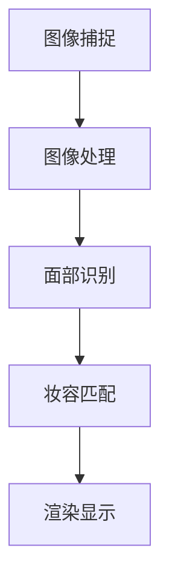

                 

 虚拟试妆技术的兴起，正引领美妆行业迎来一场深刻的数字化转型。本文将探讨虚拟试妆的概念、技术原理、应用场景及其在创业领域中的潜力，旨在为从业者提供一份实用的指南。

## 关键词

- 虚拟试妆
- 数字化转型
- 美妆行业
- 创业
- 人工智能

## 摘要

随着消费者对个性化美妆需求的增加，虚拟试妆技术成为美妆行业数字化转型的关键驱动力。本文将深入分析虚拟试妆的技术原理，探讨其在创业领域的应用前景，以及面临的挑战和机遇。

## 1. 背景介绍

美妆行业一直以来都是消费者购买频繁、市场规模庞大的领域。然而，传统的美妆购物方式存在一定的局限性，如无法亲身体验产品的效果、难以挑选适合自己的产品等。随着数字技术的快速发展，尤其是人工智能、计算机视觉和大数据等技术的应用，虚拟试妆技术应运而生，为美妆行业带来了新的发展机遇。

虚拟试妆技术通过计算机视觉和人工智能技术，将消费者的脸部图像与各种美妆产品进行实时匹配，模拟出产品使用后的效果。这一技术的出现，不仅解决了传统美妆购物中的痛点，也为美妆品牌提供了全新的营销手段。

## 2. 核心概念与联系

### 2.1 技术原理

虚拟试妆技术主要依赖于计算机视觉和人工智能技术。具体来说，包括以下几个关键步骤：

1. **图像捕捉**：通过摄像头或手机前置摄像头捕捉消费者的面部图像。
2. **图像处理**：对捕捉到的面部图像进行预处理，包括去除背景、调整亮度等。
3. **面部识别**：使用机器学习算法对处理后的图像进行面部识别，提取出面部特征点。
4. **妆容匹配**：根据提取出的面部特征点，将各种美妆产品与消费者的面部进行匹配，模拟出产品使用后的效果。
5. **渲染显示**：将匹配后的效果实时渲染显示在屏幕上，供消费者查看。

### 2.2 Mermaid 流程图

以下是一个简单的 Mermaid 流程图，展示了虚拟试妆技术的核心步骤：



## 3. 核心算法原理 & 具体操作步骤

### 3.1 算法原理概述

虚拟试妆技术的核心在于面部识别和妆容匹配算法。面部识别算法通常采用深度学习技术，如卷积神经网络（CNN），从图像中提取面部特征点。而妆容匹配算法则基于图像处理技术，将美妆产品的外观特征与面部特征进行匹配。

### 3.2 算法步骤详解

1. **图像捕捉**：使用摄像头或手机前置摄像头捕捉消费者的面部图像。
2. **图像预处理**：对图像进行灰度化、去噪、调整亮度等操作，以便后续处理。
3. **特征点检测**：使用深度学习模型检测出面部关键特征点，如眼睛、鼻子、嘴巴等。
4. **特征点跟踪**：在连续的图像帧中跟踪特征点，确保在动态场景下也能准确识别面部。
5. **妆容匹配**：将美妆产品的外观特征与面部特征进行匹配，生成虚拟试妆效果图。
6. **渲染显示**：将匹配后的效果图渲染显示在屏幕上。

### 3.3 算法优缺点

**优点**：

- **用户体验**：虚拟试妆技术提供了真实的试妆体验，消费者可以更好地了解产品效果。
- **个性化推荐**：基于用户的面部特征，系统可以推荐更适合用户的美妆产品。
- **营销推广**：美妆品牌可以利用虚拟试妆技术进行线上营销，吸引更多消费者。

**缺点**：

- **技术要求**：虚拟试妆技术需要较高的技术门槛，包括图像处理、深度学习和计算机视觉等领域的知识。
- **计算成本**：实时渲染虚拟试妆效果需要较大的计算资源，对服务器性能有较高要求。

### 3.4 算法应用领域

虚拟试妆技术可以广泛应用于美妆行业的各个领域，包括线上购物、线下体验店、品牌推广等。

## 4. 数学模型和公式 & 详细讲解 & 举例说明

### 4.1 数学模型构建

虚拟试妆技术的核心在于面部识别和妆容匹配。以下是一个简化的数学模型：

- **面部识别**：使用卷积神经网络（CNN）提取面部特征点。
  $$ f(x) = CNN(x) $$
  其中，$x$ 为输入图像，$f(x)$ 为提取的特征点。

- **妆容匹配**：使用图像处理技术进行妆容匹配。
  $$ g(y, f(x)) = Match(y, f(x)) $$
  其中，$y$ 为美妆产品的外观特征，$g(y, f(x))$ 为匹配后的效果图。

### 4.2 公式推导过程

- **卷积神经网络（CNN）**：
  $$ f(x) = \sigma(W \cdot x + b) $$
  其中，$W$ 为权重矩阵，$b$ 为偏置项，$\sigma$ 为激活函数。

- **图像处理技术**：
  $$ g(y, f(x)) = Transform(y, f(x)) $$
  其中，$Transform$ 为图像处理函数。

### 4.3 案例分析与讲解

假设有一个消费者想要尝试一款新的口红，以下是虚拟试妆技术的应用流程：

1. **图像捕捉**：摄像头捕捉消费者面部图像。
2. **图像预处理**：对图像进行灰度化、去噪等操作。
3. **特征点检测**：使用 CNN 模型提取面部特征点。
4. **妆容匹配**：将口红的外观特征与面部特征进行匹配。
5. **渲染显示**：生成口红使用后的效果图，并显示在屏幕上。

## 5. 项目实践：代码实例和详细解释说明

### 5.1 开发环境搭建

- **Python**：Python 是虚拟试妆技术的主要编程语言。
- **深度学习框架**：如 TensorFlow、PyTorch 等。
- **计算机视觉库**：如 OpenCV、dlib 等。

### 5.2 源代码详细实现

以下是虚拟试妆技术的简化实现：

```python
import cv2
import numpy as np
import tensorflow as tf

# 加载预训练的 CNN 模型
model = tf.keras.models.load_model('face_detection_model.h5')

# 加载预训练的妆容匹配模型
match_model = tf.keras.models.load_model('makeup_matching_model.h5')

# 捕获图像
cap = cv2.VideoCapture(0)

while True:
    ret, frame = cap.read()
    if not ret:
        break

    # 图像预处理
    processed_frame = preprocess_frame(frame)

    # 特征点检测
    features = model.predict(processed_frame)

    # 妆容匹配
    matched_frame = match_model.predict([processed_frame, features])

    # 渲染显示
    cv2.imshow('Virtual Try-On', matched_frame)

    if cv2.waitKey(1) & 0xFF == ord('q'):
        break

cap.release()
cv2.destroyAllWindows()
```

### 5.3 代码解读与分析

以上代码实现了一个简单的虚拟试妆程序。首先加载预训练的 CNN 模型和妆容匹配模型，然后使用摄像头捕获图像，并进行预处理。接着使用 CNN 模型提取面部特征点，最后使用妆容匹配模型生成匹配后的效果图并显示。

## 6. 实际应用场景

虚拟试妆技术可以广泛应用于美妆行业的各个场景，包括线上购物平台、线下体验店、社交媒体等。

### 6.1 线上购物平台

线上购物平台可以利用虚拟试妆技术为用户提供更加真实的试妆体验，提高用户购买意愿。

### 6.2 线下体验店

线下体验店可以结合虚拟试妆技术，为用户提供个性化的美妆建议，提升用户体验。

### 6.3 社交媒体

社交媒体平台可以整合虚拟试妆技术，为用户提供有趣的美妆互动，增强用户参与度。

## 7. 未来应用展望

随着技术的不断发展，虚拟试妆技术有望在更多领域得到应用，如虚拟试妆镜、智能化妆机器人等。同时，虚拟试妆技术也将不断优化，提供更加真实、高效的试妆体验。

## 8. 工具和资源推荐

### 8.1 学习资源推荐

- **书籍**：《深度学习》、《计算机视觉：算法与应用》
- **在线课程**：Coursera、Udacity、edX 等。

### 8.2 开发工具推荐

- **深度学习框架**：TensorFlow、PyTorch
- **计算机视觉库**：OpenCV、dlib

### 8.3 相关论文推荐

- **面部识别**：《FaceNet: A Unified Embodiment of Face Recognition and Embedding》
- **妆容匹配**：《Virtual Try-On: Real-Time Makeup Rendering and Interactive Design》

## 9. 总结：未来发展趋势与挑战

虚拟试妆技术作为美妆行业的数字化转型关键驱动力，具有广泛的应用前景。然而，要实现技术的广泛应用，仍需解决一系列挑战，如计算成本、算法精度等。未来，随着技术的不断发展，虚拟试妆技术有望为美妆行业带来更加美好的未来。

## 附录：常见问题与解答

### Q：虚拟试妆技术需要什么硬件条件？

A：虚拟试妆技术对硬件条件要求较高，通常需要一台配置较高的计算机或服务器，以及一台高清摄像头。

### Q：如何训练虚拟试妆模型？

A：训练虚拟试妆模型需要大量的面部图像和美妆产品图像数据。首先，收集并预处理数据，然后使用深度学习框架（如 TensorFlow 或 PyTorch）训练模型。

### Q：虚拟试妆技术的效果如何？

A：虚拟试妆技术的效果取决于算法的精度和实时性。目前，基于深度学习和计算机视觉的虚拟试妆技术已经能够达到较高的效果。

---

以上，就是关于虚拟试妆创业：美妆行业的数字化转型的完整文章内容。希望对您有所帮助！作者：禅与计算机程序设计艺术 / Zen and the Art of Computer Programming。

----------------------------------------------------------------


