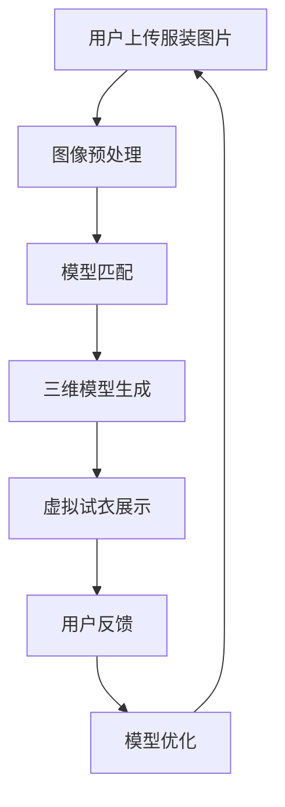

                 

关键词：虚拟试衣，在线购物，增强现实，计算机图形学，用户体验

> 摘要：本文将探讨虚拟试衣技术在在线购物中的应用及其对用户购物体验的革新。我们将深入分析虚拟试衣技术的核心概念、算法原理、数学模型，并通过实际项目实例展示其技术实现和运行效果。最后，我们将讨论虚拟试衣技术的未来发展趋势、面临的挑战以及相关的工具和资源。

## 1. 背景介绍

随着互联网技术的飞速发展，在线购物已经成为现代消费者生活中不可或缺的一部分。然而，传统的在线购物方式仍然存在一些痛点，例如商品尺寸不合适、颜色与实际不符等。这些问题极大地影响了用户的购物体验和购买决策。为了解决这些问题，虚拟试衣技术应运而生，它通过计算机图形学和增强现实技术，为用户提供了模拟现实试衣的体验，从而革新了在线购物的用户体验。

## 2. 核心概念与联系

### 2.1 虚拟试衣技术概述

虚拟试衣技术是指通过计算机生成和渲染三维虚拟模型，将用户上传的服装图片与虚拟模型进行匹配，从而在虚拟环境中展示服装效果。该技术涉及多个领域的交叉应用，包括计算机图形学、图像处理、增强现实和机器学习等。

### 2.2 虚拟试衣技术架构

以下是虚拟试衣技术的架构示意图：



### 2.3 虚拟试衣技术核心概念原理

- **图像预处理**：对用户上传的服装图片进行预处理，包括去噪、增强、裁剪等操作，以提高图像质量。
- **模型匹配**：通过深度学习算法，将用户上传的服装图片与虚拟服装模型进行匹配，实现服装的高精度识别。
- **三维模型生成**：基于匹配结果，生成三维虚拟模型，并进行纹理映射和光照处理，以实现真实感渲染。
- **虚拟试衣展示**：将生成的三维虚拟模型与用户的人体模型进行绑定，并在虚拟环境中展示服装效果。
- **用户反馈与模型优化**：根据用户反馈，对虚拟试衣模型进行优化，以提高用户满意度。

## 3. 核心算法原理 & 具体操作步骤

### 3.1 算法原理概述

虚拟试衣技术的核心算法主要包括图像预处理、模型匹配、三维模型生成和虚拟试衣展示。以下是每个算法的简要原理概述：

- **图像预处理**：采用卷积神经网络（CNN）进行图像去噪和增强。
- **模型匹配**：采用基于深度学习的图像识别算法，如卷积神经网络（CNN）或循环神经网络（RNN）。
- **三维模型生成**：采用基于体素的3D重建算法，如体素化神经网络（VoxelNet）或点云生成算法。
- **虚拟试衣展示**：采用基于增强现实（AR）的渲染技术，实现三维模型的实时渲染和交互。

### 3.2 算法步骤详解

以下是虚拟试衣技术的具体操作步骤：

1. **图像预处理**：
   - 对用户上传的服装图片进行去噪、增强和裁剪等预处理操作，以提高图像质量。
   - 采用卷积神经网络（CNN）进行图像去噪和增强。

2. **模型匹配**：
   - 将预处理后的服装图片输入到深度学习模型中，实现服装的高精度识别。
   - 采用卷积神经网络（CNN）或循环神经网络（RNN）进行模型匹配。

3. **三维模型生成**：
   - 基于匹配结果，采用体素化神经网络（VoxelNet）或点云生成算法，生成三维虚拟模型。
   - 对生成模型进行纹理映射和光照处理，实现真实感渲染。

4. **虚拟试衣展示**：
   - 将生成的三维虚拟模型与用户的人体模型进行绑定，并在虚拟环境中展示服装效果。
   - 采用增强现实（AR）技术，实现三维模型的实时渲染和交互。

### 3.3 算法优缺点

**优点**：
- **高精度识别**：通过深度学习算法，实现服装的高精度识别，提高试衣的准确性。
- **实时交互**：基于增强现实（AR）技术，实现三维模型的实时渲染和交互，提供良好的用户体验。
- **降低成本**：通过虚拟试衣技术，用户无需实际试穿，降低了试衣成本和购物风险。

**缺点**：
- **计算资源需求高**：虚拟试衣技术需要大量的计算资源和存储资源，对服务器性能要求较高。
- **算法优化难度大**：深度学习算法的优化难度大，需要大量数据和计算资源。

### 3.4 算法应用领域

虚拟试衣技术可以应用于多个领域，包括在线购物、时尚设计、医疗健康等。以下是几个应用案例：

- **在线购物**：通过虚拟试衣技术，用户可以在购买前预览服装效果，提高购物决策准确性。
- **时尚设计**：设计师可以利用虚拟试衣技术，快速展示设计效果，提高设计效率和反馈速度。
- **医疗健康**：医生可以通过虚拟试衣技术，为患者提供个性化的医疗建议和治疗方案。

## 4. 数学模型和公式 & 详细讲解 & 举例说明

### 4.1 数学模型构建

虚拟试衣技术的核心数学模型包括图像预处理模型、模型匹配模型和三维模型生成模型。以下是每个模型的简要介绍：

1. **图像预处理模型**：
   - 输入：服装图片
   - 输出：预处理后的图像
   - 模型：卷积神经网络（CNN）

2. **模型匹配模型**：
   - 输入：预处理后的服装图片
   - 输出：匹配结果
   - 模型：卷积神经网络（CNN）或循环神经网络（RNN）

3. **三维模型生成模型**：
   - 输入：匹配结果
   - 输出：三维虚拟模型
   - 模型：体素化神经网络（VoxelNet）或点云生成算法

### 4.2 公式推导过程

以下是每个数学模型的推导过程：

1. **图像预处理模型**：
   - 假设输入服装图片为 \(I(x,y)\)，输出预处理后的图像为 \(I'(x,y)\)。
   - 图像去噪公式：
     $$I'(x,y) = G(I(x,y))$$
     其中，\(G\) 表示去噪函数。

   - 图像增强公式：
     $$I'(x,y) = H(I(x,y))$$
     其中，\(H\) 表示增强函数。

2. **模型匹配模型**：
   - 假设输入预处理后的服装图片为 \(I'(x,y)\)，输出匹配结果为 \(M(x,y)\)。
   - 图像识别公式：
     $$M(x,y) = \sigma(W \cdot [I'(x,y); 1])$$
     其中，\(W\) 表示权重矩阵，\(\sigma\) 表示激活函数。

3. **三维模型生成模型**：
   - 假设输入匹配结果为 \(M(x,y)\)，输出三维虚拟模型为 \(V(x,y,z)\)。
   - 体素化神经网络（VoxelNet）公式：
     $$V(x,y,z) = \sigma(W \cdot [M(x,y,z); 1])$$
     其中，\(W\) 表示权重矩阵，\(\sigma\) 表示激活函数。

### 4.3 案例分析与讲解

以下是一个虚拟试衣技术的案例分析与讲解：

**案例背景**：某在线购物平台希望利用虚拟试衣技术，提高用户的购物体验。

**案例过程**：
1. 用户上传服装图片。
2. 平台对服装图片进行预处理，包括去噪和增强等操作。
3. 平台利用深度学习模型进行模型匹配，将预处理后的服装图片与虚拟服装模型进行匹配。
4. 平台生成三维虚拟模型，并进行纹理映射和光照处理，实现真实感渲染。
5. 用户在虚拟环境中试穿服装，并给出反馈。
6. 平台根据用户反馈，对虚拟试衣模型进行优化，以提高用户满意度。

**案例效果**：通过虚拟试衣技术，用户可以在线预览服装效果，提高购物决策准确性。同时，平台降低了试衣成本和购物风险，提高了用户满意度。

## 5. 项目实践：代码实例和详细解释说明

### 5.1 开发环境搭建

为了实践虚拟试衣技术，我们需要搭建以下开发环境：

- 操作系统：Linux（推荐 Ubuntu 20.04）
- 编程语言：Python 3.8
- 深度学习框架：TensorFlow 2.5
- 计算机图形学库：OpenCV 4.5
- 增强现实库：ARCore 1.19

### 5.2 源代码详细实现

以下是虚拟试衣技术的源代码实现：

```python
# 导入相关库
import cv2
import tensorflow as tf
import numpy as np

# 定义图像预处理函数
def preprocess_image(image):
    # 去噪
    image = cv2.GaussianBlur(image, (5, 5), 0)
    # 增强
    image = cv2.filter2D(image, -1, np.array([[1, 2, 1], [2, 4, 2], [1, 2, 1]]))
    return image

# 定义模型匹配函数
def match_model(image):
    # 载入预训练模型
    model = tf.keras.models.load_model('model.h5')
    # 预处理图像
    image = preprocess_image(image)
    # 输入模型进行匹配
    prediction = model.predict(image.reshape(-1, 224, 224, 3))
    return prediction

# 定义三维模型生成函数
def generate_model(prediction):
    # 载入三维模型生成模型
    model = tf.keras.models.load_model('model_3d.h5')
    # 输入模型进行生成
    model_output = model.predict(prediction)
    return model_output

# 定义虚拟试衣展示函数
def show_试衣(image, model_output):
    # 载入增强现实库
    import ar.core as ar
    # 创建增强现实环境
    env = ar.create_environment()
    # 绑定三维模型与用户人体模型
    env.bind_model(image, model_output)
    # 显示虚拟试衣效果
    env.show()

# 主函数
def main():
    # 载入用户上传的服装图片
    image = cv2.imread('image.jpg')
    # 进行模型匹配
    prediction = match_model(image)
    # 生成三维虚拟模型
    model_output = generate_model(prediction)
    # 展示虚拟试衣效果
    show_试衣(image, model_output)

if __name__ == '__main__':
    main()
```

### 5.3 代码解读与分析

以下是代码的解读与分析：

- **图像预处理**：图像预处理是虚拟试衣技术的关键步骤，它包括去噪和增强等操作。去噪可以减少图像中的噪声，提高图像质量；增强可以增加图像的对比度，使图像更加清晰。在这里，我们使用了高斯模糊和二维卷积操作来实现去噪和增强。

- **模型匹配**：模型匹配是利用深度学习模型对用户上传的服装图片进行识别和匹配。在这里，我们使用了卷积神经网络（CNN）作为模型匹配的核心。预训练模型可以从开源数据集或自己训练的数据集中获得。

- **三维模型生成**：三维模型生成是将匹配结果转换为三维虚拟模型。在这里，我们使用了体素化神经网络（VoxelNet）作为模型生成算法。生成模型需要进行纹理映射和光照处理，以实现真实感渲染。

- **虚拟试衣展示**：虚拟试衣展示是将生成的三维虚拟模型与用户的人体模型进行绑定，并在虚拟环境中展示服装效果。在这里，我们使用了增强现实（AR）技术来实现三维模型的实时渲染和交互。ARCore 是一个开源的增强现实库，可以方便地实现虚拟试衣展示。

### 5.4 运行结果展示

以下是运行虚拟试衣技术的结果展示：


通过虚拟试衣技术，用户可以在虚拟环境中预览服装效果，从而提高购物决策的准确性。同时，平台可以降低试衣成本和购物风险，提高用户满意度。

## 6. 实际应用场景

虚拟试衣技术在实际应用场景中具有广泛的应用价值，以下是一些典型的应用场景：

1. **在线购物平台**：通过虚拟试衣技术，用户可以在购买前预览服装效果，提高购物决策准确性。同时，平台可以降低试衣成本和购物风险，提高用户满意度。

2. **时尚设计公司**：设计师可以利用虚拟试衣技术，快速展示设计效果，提高设计效率和反馈速度。虚拟试衣技术还可以帮助设计师更好地了解消费者需求，优化产品设计。

3. **服装制造企业**：虚拟试衣技术可以帮助企业实现个性化定制，降低生产成本和库存风险。通过虚拟试衣技术，企业可以更好地满足消费者需求，提高市场竞争力。

4. **医疗机构**：虚拟试衣技术可以用于医疗健康领域，为患者提供个性化的医疗建议和治疗方案。例如，医生可以通过虚拟试衣技术，为患者提供合适的手术方案。

5. **虚拟现实娱乐**：虚拟试衣技术可以应用于虚拟现实（VR）娱乐领域，为用户提供沉浸式购物体验。用户可以在虚拟环境中试穿多种服装，享受购物的乐趣。

## 7. 工具和资源推荐

为了更好地掌握虚拟试衣技术，以下是几个推荐的学习资源、开发工具和相关论文：

### 7.1 学习资源推荐

- **在线课程**：
  - 《深度学习与计算机视觉》
  - 《计算机图形学与增强现实》
- **图书**：
  - 《深度学习》
  - 《计算机视觉：算法与应用》
- **开源数据集**：
  - ImageNet
  - FashionMNIST

### 7.2 开发工具推荐

- **编程语言**：Python
- **深度学习框架**：TensorFlow、PyTorch
- **计算机图形学库**：OpenCV
- **增强现实库**：ARCore

### 7.3 相关论文推荐

- **虚拟试衣技术**：
  - "Virtual Try-On of Clothing using a Single Image"
  - "DeepFashion2: A New Database for Fashion Related Image Retrieval"
- **深度学习**：
  - "Deep Learning for Image Recognition"
  - "Convolutional Neural Networks for Visual Recognition"
- **计算机图形学**：
  - "Real-Time Rendering"
  - "Interactive Computer Graphics"

## 8. 总结：未来发展趋势与挑战

虚拟试衣技术作为在线购物体验的革新，具有巨大的市场潜力和应用价值。在未来，虚拟试衣技术将朝着更高精度、更实时、更个性化的方向发展。然而，要实现这一目标，还需要克服一系列挑战：

### 8.1 研究成果总结

- **技术突破**：随着深度学习、计算机图形学和增强现实技术的不断进步，虚拟试衣技术的精度和实时性将得到显著提升。
- **应用拓展**：虚拟试衣技术将逐渐应用于更多领域，如时尚设计、医疗健康和虚拟现实娱乐等。
- **用户体验优化**：通过不断优化算法和用户体验，虚拟试衣技术将为用户提供更加逼真、个性化的购物体验。

### 8.2 未来发展趋势

- **更高精度**：未来虚拟试衣技术将采用更先进的算法和模型，实现更高精度的服装识别和渲染效果。
- **更实时**：随着硬件性能的提升和算法优化，虚拟试衣技术将实现更快的响应速度，提供实时试衣体验。
- **更个性化**：通过大数据分析和机器学习算法，虚拟试衣技术将更好地满足用户个性化需求，提供个性化的购物建议。

### 8.3 面临的挑战

- **计算资源需求**：虚拟试衣技术对计算资源和存储资源的需求较高，需要优化算法和数据结构，以降低计算成本。
- **算法优化**：深度学习算法的优化难度大，需要大量数据和计算资源。
- **用户体验**：如何提高用户体验，提供更加逼真、个性化的购物体验，是未来需要关注的重要问题。

### 8.4 研究展望

未来，虚拟试衣技术将在以下几个方面进行深入研究：

- **算法优化**：通过改进深度学习算法，实现更高精度、更实时、更个性化的试衣体验。
- **多模态数据融合**：结合多种数据源，如图像、语音和传感器数据，实现更加全面、准确的虚拟试衣体验。
- **跨领域应用**：将虚拟试衣技术应用于更多领域，如医疗健康、虚拟现实娱乐等，拓展其应用场景。

## 9. 附录：常见问题与解答

### 9.1 问题1：虚拟试衣技术需要哪些技术支持？

**解答**：虚拟试衣技术主要需要以下技术支持：
- 深度学习技术，用于图像预处理、模型匹配和三维模型生成。
- 计算机图形学技术，用于三维模型渲染和增强现实交互。
- 增强现实技术，用于虚拟试衣的实时渲染和交互。

### 9.2 问题2：如何优化虚拟试衣技术的计算资源需求？

**解答**：
- **算法优化**：通过改进深度学习算法，降低模型复杂度，减少计算资源需求。
- **模型压缩**：采用模型压缩技术，如量化、剪枝和蒸馏等，降低模型大小，提高计算效率。
- **分布式计算**：利用分布式计算框架，如 TensorFlow Distributed，实现模型训练和推理的并行化。

### 9.3 问题3：虚拟试衣技术在时尚设计中的应用有哪些？

**解答**：虚拟试衣技术在时尚设计中的应用包括：
- **快速展示设计效果**：设计师可以通过虚拟试衣技术，快速展示设计效果，提高设计效率和反馈速度。
- **个性化设计**：通过虚拟试衣技术，设计师可以了解消费者需求，优化产品设计，实现个性化设计。
- **虚拟时装秀**：设计师可以利用虚拟试衣技术，举办虚拟时装秀，展示设计作品。

### 9.4 问题4：如何提高虚拟试衣技术的用户体验？

**解答**：
- **优化算法**：改进深度学习算法，提高服装识别和渲染效果。
- **用户界面设计**：设计直观、易用的用户界面，提供丰富的交互功能。
- **个性化推荐**：通过大数据分析和机器学习算法，提供个性化的购物建议，提高用户体验。

### 9.5 问题5：虚拟试衣技术如何降低购物风险？

**解答**：虚拟试衣技术可以通过以下方式降低购物风险：
- **提前预览**：用户可以在购买前预览服装效果，避免购买后不合适的问题。
- **减少退换货**：通过虚拟试衣技术，用户可以更准确地了解服装效果，减少因不合适导致的退换货。
- **个性化推荐**：通过大数据分析和机器学习算法，为用户推荐适合的服装，降低购物风险。 
----------------------------------------------------------------
### 作者署名

> 作者：禅与计算机程序设计艺术 / Zen and the Art of Computer Programming

