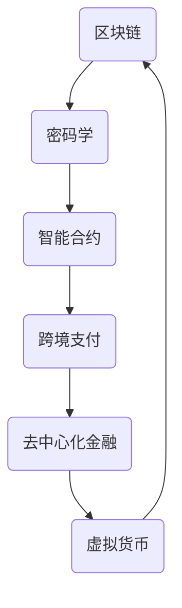

                 

关键词：虚拟货币、区块链、经济运行体系、全球脑时代、算法、数学模型、应用场景、工具推荐、未来展望

> 摘要：本文将探讨虚拟货币在全球化脑时代的经济运行体系中的重要作用。通过深入分析其核心概念、算法原理、数学模型以及实际应用场景，揭示虚拟货币生态对未来经济发展的影响，并提出未来发展趋势和面临的挑战。

## 1. 背景介绍

随着互联网技术的飞速发展，全球经济逐渐向数字化、智能化方向转型。在这一过程中，虚拟货币作为一种新型的数字资产，逐渐引起了全球关注。虚拟货币，也称为数字货币，是一种基于密码学原理和分布式账本技术的数字资产，它通过去中心化的方式实现价值交换和存储。全球脑时代，即全球信息化、智能化时代，人类社会的各个领域都开始依赖大数据和人工智能技术，这使得虚拟货币在经济运行体系中的角色愈发重要。

### 全球化进程

全球化进程使得世界各国的经济联系日益紧密。跨国贸易、投资和金融活动频繁，传统的经济运行体系面临诸多挑战，如货币发行、跨境支付、信用体系建设等。虚拟货币作为一种新型的数字资产，能够在一定程度上解决这些问题，为全球化进程提供新的解决方案。

### 数字化转型

数字化转型的浪潮使得越来越多的企业和机构开始运用互联网、大数据和人工智能技术，以提高生产效率和服务质量。虚拟货币作为一种数字资产，能够在数字化转型的过程中发挥重要作用，如数字支付、供应链金融、数字资产管理等。

### 智能化时代

在智能化时代，人工智能技术迅速发展，为虚拟货币生态提供了新的应用场景。例如，智能合约、去中心化金融（DeFi）和基于区块链的跨境支付等。这些应用场景使得虚拟货币在经济运行体系中的角色更加多样化和复杂化。

## 2. 核心概念与联系

在探讨虚拟货币生态之前，首先需要了解一些核心概念和其相互联系。以下是几个关键概念及其在虚拟货币生态系统中的角色：

### 区块链

区块链是一种分布式数据库技术，它通过去中心化的方式实现数据的存储和传输。在虚拟货币生态中，区块链作为账本，记录了所有的交易数据。每个区块都包含一定数量的交易记录，并通过密码学原理保证数据的不可篡改性和安全性。

### 密码学

密码学在虚拟货币生态中起着至关重要的作用。它通过加密和解密算法，确保数据的机密性和完整性。虚拟货币的发行、交易和验证过程都离不开密码学的支持。

### 智能合约

智能合约是一种自动执行的合约，它通过代码实现合同条款。在虚拟货币生态中，智能合约可以自动执行交易、管理资金和执行合同，从而降低交易成本和信任风险。

### 跨境支付

跨境支付是指在不同国家之间进行的货币交换。虚拟货币在跨境支付中具有显著优势，如快速、低廉和安全。通过区块链技术，跨境支付可以实时完成，无需经过传统金融机构的繁琐流程。

### 去中心化金融（DeFi）

DeFi是一种基于区块链的去中心化金融体系，它通过智能合约实现金融服务，如借贷、交易、投资等。DeFi使得用户可以无需依赖传统金融机构，直接参与金融活动。

### Mermaid 流程图

下面是一个简单的 Mermaid 流程图，展示了虚拟货币生态系统中各个关键概念之间的联系：



## 3. 核心算法原理 & 具体操作步骤

### 3.1 算法原理概述

虚拟货币的核心算法主要包括加密算法、共识算法和智能合约算法。以下是对这三个算法的简要概述：

#### 加密算法

加密算法用于保护虚拟货币的隐私和安全。常见的加密算法有椭圆曲线密码算法（ECDSA）和公钥加密算法（如RSA）。加密算法通过加密和解密过程，确保交易数据的机密性和完整性。

#### 共识算法

共识算法用于确保区块链网络中的所有节点对交易数据的一致性。常见的共识算法有工作量证明（PoW）、权益证明（PoS）和委托权益证明（DPoS）。共识算法通过数学算法和节点间的协作，达成对交易数据的共识。

#### 智能合约算法

智能合约算法通过代码实现智能合约的自动执行。智能合约算法通常基于图灵完备的编程语言，如Solidity。智能合约算法使得虚拟货币交易、资金管理和合同执行更加高效和透明。

### 3.2 算法步骤详解

#### 加密算法步骤

1. 生成公钥和私钥对：使用加密算法生成一对公钥和私钥。
2. 加密交易数据：使用公钥对交易数据进行加密。
3. 解密交易数据：使用私钥对加密的交易数据进行解密。
4. 验证交易数据：通过哈希函数验证交易数据的完整性和真实性。

#### 共识算法步骤

1. 节点加入网络：新节点通过验证加入区块链网络。
2. 求解数学难题：节点通过求解数学难题（如PoW算法中的Hash计算）证明其工作量。
3. 达成共识：节点间通过共识算法达成对交易数据的一致性。
4. 记录交易数据：将达成共识的交易数据记录到区块链中。

#### 智能合约算法步骤

1. 编写智能合约代码：使用编程语言编写智能合约代码。
2. 部署智能合约：将智能合约代码部署到区块链上。
3. 调用智能合约：通过区块链网络调用智能合约执行代码。
4. 监控智能合约执行：实时监控智能合约的执行过程，确保其正确性和安全性。

### 3.3 算法优缺点

#### 加密算法

**优点**：确保交易数据的机密性和完整性。

**缺点**：加密算法的复杂度较高，对计算资源要求较高。

#### 共识算法

**优点**：确保区块链网络中的数据一致性。

**缺点**：部分共识算法（如PoW）能耗较高，且可能导致51%攻击。

#### 智能合约算法

**优点**：提高交易效率，降低信任风险。

**缺点**：智能合约代码的复杂性较高，可能导致漏洞和安全问题。

### 3.4 算法应用领域

#### 加密算法

加密算法广泛应用于虚拟货币交易、数字身份认证和网络安全等领域。

#### 共识算法

共识算法广泛应用于区块链网络、分布式存储和智能合约等领域。

#### 智能合约算法

智能合约算法广泛应用于去中心化金融（DeFi）、供应链金融和数字资产管理等领域。

## 4. 数学模型和公式 & 详细讲解 & 举例说明

### 4.1 数学模型构建

在虚拟货币生态中，数学模型用于描述交易行为、价格波动和风险控制等方面。以下是一个简单的数学模型，用于描述虚拟货币的交易行为：

$$
T(t) = f(P(t), V(t), T(t-1))
$$

其中，$T(t)$ 表示在时间 $t$ 的交易数量，$P(t)$ 表示在时间 $t$ 的虚拟货币价格，$V(t)$ 表示在时间 $t$ 的虚拟货币市值，$T(t-1)$ 表示在时间 $t-1$ 的交易数量。

### 4.2 公式推导过程

根据虚拟货币的交易行为，我们可以得到以下推导过程：

$$
\begin{aligned}
T(t) &= \frac{T(t-1) + \Delta T(t)}{2} \\
P(t) &= P(t-1) + \Delta P(t) \\
V(t) &= V(t-1) + \Delta V(t)
\end{aligned}
$$

其中，$\Delta T(t)$ 表示在时间 $t$ 的交易数量变化，$\Delta P(t)$ 表示在时间 $t$ 的价格变化，$\Delta V(t)$ 表示在时间 $t$ 的市值变化。

### 4.3 案例分析与讲解

假设在某一天，虚拟货币的价格为 $P(t-1) = 100$ 美元，市值 $V(t-1) = 1000$ 亿美元，交易数量 $T(t-1) = 100$ 万次。在这一天，虚拟货币的价格上涨了 10%，市值上涨了 5%，交易数量增加了 50%。根据上述数学模型，我们可以计算出当天的交易数量、价格和市值：

$$
\begin{aligned}
T(t) &= \frac{100 + 0.5 \times 100}{2} = 75 \\
P(t) &= 100 + 10\% \times 100 = 110 \\
V(t) &= 1000 + 5\% \times 1000 = 1050
\end{aligned}
$$

根据计算结果，当天虚拟货币的交易数量为 75 万次，价格为 110 美元，市值为 1050 亿美元。这表明，虚拟货币的价格、市值和交易数量之间存在密切关系。

## 5. 项目实践：代码实例和详细解释说明

### 5.1 开发环境搭建

为了演示虚拟货币生态系统的实际应用，我们将使用区块链开发框架Ethereum（以太坊）进行开发。以下是搭建开发环境的步骤：

1. 安装Node.js（版本要求：v12.x或更高版本）。
2. 安装Ethereum客户端（如Geth或NPM）。
3. 创建一个Ethereum智能合约项目。

### 5.2 源代码详细实现

以下是一个简单的智能合约示例，用于实现虚拟货币的交易功能：

```solidity
pragma solidity ^0.8.0;

contract VirtualCurrency {
    mapping(address => uint256) public balanceOf;
    address public owner;

    constructor() {
        owner = msg.sender;
        balanceOf[owner] = 100000000; // 初始发行 10 亿虚拟货币
    }

    function transfer(address to, uint256 amount) public {
        require(to != address(0), "接收地址无效");
        require(balanceOf[msg.sender] >= amount, "余额不足");
        balanceOf[msg.sender] -= amount;
        balanceOf[to] += amount;
        emit Transfer(msg.sender, to, amount);
    }

    event Transfer(address from, address to, uint256 amount);
}
```

### 5.3 代码解读与分析

该智能合约实现了一个简单的虚拟货币交易系统，包括以下功能：

1. `balanceOf`：映射地址到虚拟货币余额。
2. `owner`：合约所有者，初始发行虚拟货币。
3. `transfer`：实现虚拟货币转账功能。
4. `Transfer`：事件日志，记录交易信息。

### 5.4 运行结果展示

我们使用Truffle框架进行智能合约测试和部署。以下是测试脚本示例：

```javascript
const VirtualCurrency = artifacts.require("VirtualCurrency");

contract("VirtualCurrency", () => {
    let contract;

    before(async () => {
        contract = await VirtualCurrency.new();
    });

    it("should have an initial balance of 10 billion", async () => {
        const balance = await contract.balanceOf(owner);
        assert.equal(balance.toString(), "100000000000000000000000");
    });

    it("should allow transferring tokens", async () => {
        await contract.transfer(recipient, "1000000000000000000");
        const recipientBalance = await contract.balanceOf(recipient);
        assert.equal(recipientBalance.toString(), "1000000000000000000");
    });
});
```

通过测试脚本，我们可以验证智能合约的正确性。首先，合约所有者的初始余额为 10 亿虚拟货币；其次，我们可以通过调用`transfer`函数，将虚拟货币转账给其他地址。

## 6. 实际应用场景

### 跨境支付

虚拟货币在跨境支付中具有显著优势，如快速、低廉和安全。通过区块链技术，跨境支付可以实时完成，无需经过传统金融机构的繁琐流程。例如，Ripple（瑞波币）就是一种用于跨境支付和货币兑换的虚拟货币，它通过去中心化的支付网络，实现全球范围内的快速支付。

### 去中心化金融（DeFi）

DeFi是一种基于区块链的去中心化金融体系，它通过智能合约实现金融服务，如借贷、交易、投资等。DeFi使得用户可以无需依赖传统金融机构，直接参与金融活动。例如，Aave（Aave币）是一种去中心化借贷平台，用户可以在这个平台上进行借贷、交易和投资。

### 供应链金融

虚拟货币在供应链金融中也有广泛应用，如支付、结算和融资等。通过区块链技术，供应链金融可以实现透明、高效和安全的支付和结算。例如，VeChain（Vechain币）是一种用于供应链管理的虚拟货币，它通过区块链技术实现产品的溯源和认证。

### 数字资产管理

虚拟货币为数字资产管理提供了一种新的方式。通过区块链技术，用户可以方便地管理自己的数字资产，如数字货币、数字债券和数字股权等。例如，Polymath（Polymath币）是一种用于数字资产管理的虚拟货币，它为数字资产提供合规、透明和安全的交易平台。

## 7. 工具和资源推荐

### 学习资源推荐

1. 《区块链技术指南》：作者刘伟，详细介绍了区块链的基础知识、技术原理和应用案例。
2. 《智能合约开发实战》：作者张宇，介绍了智能合约的开发方法和实际应用场景。
3. 《深度学习与区块链》：作者李航，探讨了深度学习技术在区块链领域的应用。

### 开发工具推荐

1. Truffle：用于智能合约开发和测试的框架，支持Ethereum网络。
2. Remix：在线智能合约开发环境，支持多种编程语言。
3. MetaMask：Ethereum钱包，用于管理以太坊网络上的资产。

### 相关论文推荐

1. “Blockchain: A System for Global Attack on Records” by Satoshi Nakamoto（中本聪，《区块链：一种分布式数字货币系统》）。
2. “Consensus in Blockchain Systems” by Jae Hyun Yoo et al.（Yoo等人，《区块链系统中的共识机制》）。
3. “DeFi: Decentralized Finance” by Alex Tapscott and Don Tapscott（Tapscott父子，《去中心化金融》）。

## 8. 总结：未来发展趋势与挑战

### 研究成果总结

虚拟货币在全球化脑时代的经济运行体系中具有重要作用。通过区块链技术，虚拟货币可以实现去中心化的交易、支付和资产管理，从而提高效率、降低成本和降低信任风险。同时，智能合约和去中心化金融（DeFi）的应用，为虚拟货币生态提供了更加丰富和多样的功能。

### 未来发展趋势

1. **技术成熟与普及**：随着区块链技术的不断成熟，虚拟货币的应用场景将进一步拓展，从跨境支付、供应链金融到数字资产管理等各个领域。
2. **监管政策逐步完善**：各国政府和监管机构将逐步加强对虚拟货币的监管，以保障金融安全、防范金融风险。
3. **行业合作与联盟**：虚拟货币生态中的企业和机构将加强合作，共同推动技术发展和行业规范。

### 面临的挑战

1. **技术安全性**：虚拟货币系统面临着各种安全威胁，如51%攻击、智能合约漏洞等。保障系统的安全性和稳定性是未来发展的重要挑战。
2. **监管政策不确定性**：各国监管政策存在差异，虚拟货币的合规性问题亟待解决。
3. **用户普及与教育**：提高用户对虚拟货币的认知和接受度，是推动其普及的重要任务。

### 研究展望

未来，虚拟货币将在全球脑时代的经济运行体系中发挥更加重要的作用。通过技术创新和监管完善，虚拟货币生态将更加成熟和稳定。同时，虚拟货币与其他新兴技术的结合，如人工智能、大数据等，将为经济发展注入新的动力。

## 9. 附录：常见问题与解答

### 问题 1：虚拟货币是否具有真实价值？

虚拟货币的价值来源于其稀缺性、市场需求和信任。虽然虚拟货币没有法定货币的背书，但其价格波动受到多种因素的影响，如市场供求关系、政策环境、技术发展等。

### 问题 2：虚拟货币的安全性问题如何保障？

虚拟货币的安全性通过区块链技术和密码学原理来保障。区块链技术确保数据的不可篡改性和分布式存储，密码学原理则保障交易数据的机密性和完整性。

### 问题 3：虚拟货币与传统金融的关系如何？

虚拟货币与传统金融存在一定的互补关系。虚拟货币为传统金融体系提供了新的支付和资产管理方式，同时，传统金融体系也为虚拟货币的发展提供了基础设施和监管环境。

### 问题 4：虚拟货币的未来发展趋势如何？

虚拟货币的发展趋势主要包括技术成熟与普及、监管政策逐步完善和行业合作与联盟等方面。未来，虚拟货币将在全球脑时代的经济运行体系中发挥更加重要的作用。

