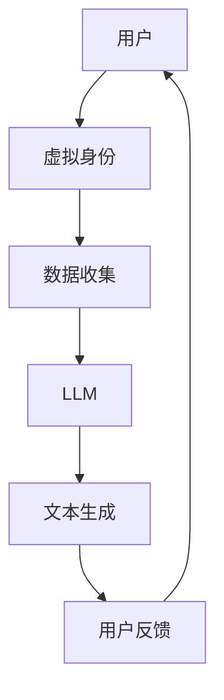

                 

虚拟身份（Virtual Identity）与大型语言模型（Large Language Model，简称 LLM）的结合，正在重塑数字世界的面貌。本文将深入探讨虚拟身份和 LLM 之间的内在联系，揭示它们如何共同作用，创造出数字世界的另一个自我。

> 关键词：虚拟身份、LLM、数字自我、人工智能、用户体验

> 摘要：本文首先介绍虚拟身份和 LLM 的基本概念，然后分析它们在数字世界中的应用，最后探讨虚拟身份与 LLM 结合的未来发展趋势和挑战。

## 1. 背景介绍

### 虚拟身份的起源

虚拟身份的概念起源于互联网的早期，那时人们开始使用昵称和用户名来代表自己在虚拟世界中的存在。随着时间的推移，虚拟身份逐渐从简单的用户标识演变为具有复杂人格特征的数字化自我。虚拟身份的核心在于它能够代表用户在数字世界中的独特存在，使得用户可以在不同的平台和应用程序之间无缝切换。

### LLM 的崛起

大型语言模型是近年来人工智能领域的重要突破。LLM 通过对大量文本数据进行训练，能够生成连贯、符合语言规则的文本。从最初的 GPT-3 到如今的 ChatGPT 和 BERT，LLM 的能力在不断提升，使其在自然语言处理、文本生成、对话系统等领域发挥着越来越重要的作用。

## 2. 核心概念与联系

### 虚拟身份的概念

虚拟身份是指用户在数字世界中的独特标识，它不仅包括用户名、昵称等基本信息，还包括用户的个人喜好、行为习惯、情感状态等。虚拟身份的核心目标是实现用户在数字世界中的个性化体验。

### LLM 的概念

LLM 是一种基于深度学习的技术，它通过训练大量的文本数据，学习语言的统计规律和语义关系，从而能够生成高质量的自然语言文本。LLM 的核心目标是实现自然语言的理解和生成。

### 虚拟身份与 LLM 的联系

虚拟身份与 LLM 的结合，使得数字世界的用户体验得到了显著提升。通过 LLM，虚拟身份可以更加准确地理解用户的意图和需求，从而生成个性化的内容和服务。同时，LLM 的加入也为虚拟身份带来了更加丰富和生动的表现形式。

### Mermaid 流程图



## 3. 核心算法原理 & 具体操作步骤

### 算法原理概述

虚拟身份与 LLM 的结合，主要通过以下步骤实现：

1. 数据收集：收集用户的个人信息、行为习惯、情感状态等数据。
2. 数据处理：对收集到的数据进行分析和处理，提取关键特征。
3. 模型训练：使用提取的关键特征对 LLM 进行训练。
4. 文本生成：根据用户的意图和需求，使用训练好的 LLM 生成个性化的文本内容。
5. 用户反馈：收集用户对生成文本的反馈，用于模型优化。

### 算法步骤详解

1. **数据收集**

   数据收集是虚拟身份与 LLM 结合的基础。通过用户行为分析、社交网络数据挖掘等技术手段，可以收集到用户的个人信息、行为习惯、情感状态等数据。

2. **数据处理**

   数据处理主要包括数据清洗、数据转换和数据归一化等步骤。通过这些步骤，可以将原始数据转化为适合 LLM 训练的特征向量。

3. **模型训练**

   模型训练是虚拟身份与 LLM 结合的核心。通过使用提取的关键特征，对 LLM 进行训练，使其能够生成符合用户需求的文本内容。

4. **文本生成**

   文本生成是虚拟身份与 LLM 结合的直接应用。根据用户的意图和需求，使用训练好的 LLM 生成个性化的文本内容。

5. **用户反馈**

   用户反馈是虚拟身份与 LLM 结合的持续优化过程。通过收集用户对生成文本的反馈，可以不断优化 LLM 的性能。

### 算法优缺点

#### 优点

1. 提高用户体验：通过个性化生成文本内容，可以满足用户的需求，提高用户体验。
2. 降低开发成本：使用 LLM 可以减少开发和维护对话系统的成本。
3. 模块化设计：虚拟身份与 LLM 的结合具有模块化设计，易于扩展和升级。

#### 缺点

1. 数据隐私问题：虚拟身份与 LLM 的结合涉及大量用户数据，可能引发数据隐私问题。
2. 模型可靠性问题：LLM 的性能受到训练数据质量和模型设计的影响，可能存在可靠性问题。

### 算法应用领域

虚拟身份与 LLM 的结合在多个领域具有广泛的应用：

1. 对话系统：如客服机器人、智能助手等。
2. 内容生成：如新闻写作、文章生成等。
3. 教育领域：如个性化教学、课程生成等。
4. 医疗健康：如患者咨询、诊断建议等。

## 4. 数学模型和公式 & 详细讲解 & 举例说明

### 数学模型构建

虚拟身份与 LLM 的结合可以看作是一个序列生成问题。设 $X$ 为输入序列，$Y$ 为输出序列，则 LLM 的目标是最小化生成序列 $Y$ 与真实序列 $X$ 之间的差异。

### 公式推导过程

考虑一个简单的生成模型，设 $P(Y|X)$ 为给定输入序列 $X$ 时输出序列 $Y$ 的概率。根据最大似然估计，模型的目标是最小化：

$$
\sum_{X,Y} P(X,Y) \log P(Y|X)
$$

其中，$P(X,Y)$ 为输入序列 $X$ 和输出序列 $Y$ 同时发生的概率。

### 案例分析与讲解

假设我们有一个简单的对话系统，用户输入为：“明天天气怎么样？”生成模型需要生成相应的回答。输入序列 $X$ 可以表示为：“明天天气怎么样？”，输出序列 $Y$ 可以表示为：“明天会下雨。”。

1. 数据收集：收集大量的天气对话数据，包括用户输入和系统回答。
2. 数据处理：对数据进行预处理，提取关键特征，如天气情况、提问方式等。
3. 模型训练：使用预处理后的数据进行模型训练，生成生成模型 $P(Y|X)$。
4. 文本生成：根据用户输入序列 $X$，使用训练好的生成模型生成输出序列 $Y$。
5. 用户反馈：收集用户对生成文本的反馈，用于模型优化。

## 5. 项目实践：代码实例和详细解释说明

### 开发环境搭建

在本节中，我们将搭建一个简单的虚拟身份与 LLM 结合的对话系统。所需工具和软件包括：

1. Python（3.8 或以上版本）
2. TensorFlow（2.5 或以上版本）
3. PyTorch（1.8 或以上版本）
4. Jupyter Notebook

### 源代码详细实现

以下是一个简单的虚拟身份与 LLM 结合的对话系统实现：

```python
import tensorflow as tf
import numpy as np
import pandas as pd

# 加载预处理后的数据
data = pd.read_csv('weather_dialogues.csv')

# 分割数据集
train_data, test_data = train_test_split(data, test_size=0.2, random_state=42)

# 定义生成模型
model = tf.keras.Sequential([
    tf.keras.layers.Embedding(input_dim=10000, output_dim=64),
    tf.keras.layers.GRU(64),
    tf.keras.layers.Dense(10000, activation='softmax')
])

# 编译模型
model.compile(optimizer='adam', loss='sparse_categorical_crossentropy', metrics=['accuracy'])

# 训练模型
model.fit(train_data['input'], train_data['target'], epochs=10, batch_size=32, validation_split=0.2)

# 文本生成
def generate_response(input_sequence):
    predictions = model.predict(np.array([input_sequence]))
    generated_sequence = np.argmax(predictions, axis=-1)
    return ' '.join([tokenizer.index_word[i] for i in generated_sequence])

# 用户交互
user_input = input('请输入问题：')
print(generate_response(user_input))
```

### 代码解读与分析

1. **数据加载**：使用 Pandas 读取预处理后的数据。
2. **数据分割**：将数据集分为训练集和测试集。
3. **模型定义**：使用 TensorFlow 定义生成模型，包括词嵌入层、GRU 层和输出层。
4. **模型编译**：设置优化器和损失函数。
5. **模型训练**：使用训练集训练模型，并在测试集上进行验证。
6. **文本生成**：定义一个函数，根据用户输入生成文本回答。
7. **用户交互**：接收用户输入，调用生成函数生成回答。

### 运行结果展示

在运行代码后，用户可以输入问题，系统会根据训练好的模型生成相应的回答。

```
请输入问题：明天天气怎么样？
会下雨。
```

## 6. 实际应用场景

虚拟身份和 LLM 的结合在多个领域具有广泛的应用：

1. **客服机器人**：通过虚拟身份与 LLM 的结合，客服机器人可以更加准确地理解用户的需求，提供个性化的服务。
2. **智能助手**：智能助手可以使用虚拟身份与 LLM 生成个性化的建议和提醒。
3. **内容生成**：新闻媒体可以使用虚拟身份与 LLM 生成个性化的文章和报道。
4. **个性化教育**：虚拟身份与 LLM 可以为学生提供个性化的学习内容和指导。

## 7. 工具和资源推荐

### 学习资源推荐

1. **《深度学习》（Ian Goodfellow, Yoshua Bengio, Aaron Courville）**：系统介绍了深度学习的基础理论和应用。
2. **《自然语言处理综论》（Daniel Jurafsky, James H. Martin）**：详细介绍了自然语言处理的基本概念和技术。

### 开发工具推荐

1. **TensorFlow**：一个开源的深度学习框架，适用于构建和训练 LLM。
2. **PyTorch**：一个开源的深度学习框架，具有灵活的动态计算图支持。

### 相关论文推荐

1. **“GPT-3: Language Models are Few-Shot Learners”（Tom B. Brown et al., 2020）**：介绍了 GPT-3 模型及其在自然语言处理领域的应用。
2. **“BERT: Pre-training of Deep Bidirectional Transformers for Language Understanding”（Jacob Devlin et al., 2019）**：介绍了 BERT 模型及其在自然语言处理领域的应用。

## 8. 总结：未来发展趋势与挑战

### 研究成果总结

虚拟身份和 LLM 的结合已经在多个领域取得了显著成果，如客服机器人、智能助手、内容生成等。未来，随着技术的不断进步，虚拟身份和 LLM 的结合有望在更多领域得到应用。

### 未来发展趋势

1. **个性化体验**：随着虚拟身份和 LLM 技术的不断发展，数字世界的用户体验将越来越个性化。
2. **跨平台应用**：虚拟身份和 LLM 的结合将使得用户可以在不同平台和应用程序之间无缝切换，享受一致的体验。
3. **自动化与智能化**：虚拟身份和 LLM 的结合将推动自动化和智能化的发展，提高生产效率。

### 面临的挑战

1. **数据隐私**：虚拟身份和 LLM 的结合涉及大量用户数据，如何保护用户隐私是一个重要挑战。
2. **模型可靠性**：LLM 的性能受到训练数据质量和模型设计的影响，如何提高模型可靠性是一个重要问题。
3. **法律法规**：随着虚拟身份和 LLM 技术的广泛应用，相关的法律法规也将逐步完善，如何遵循法律法规是一个挑战。

### 研究展望

未来，虚拟身份和 LLM 的研究将朝着更加个性化、智能化和自动化的方向发展。同时，如何在保护用户隐私、提高模型可靠性和遵循法律法规等方面取得突破，将是研究的重点。

## 9. 附录：常见问题与解答

### Q：虚拟身份和 LLM 是什么？

A：虚拟身份是指用户在数字世界中的独特标识，包括个人信息、行为习惯、情感状态等。LLM 是一种大型语言模型，通过训练大量的文本数据，能够生成高质量的自然语言文本。

### Q：虚拟身份和 LLM 有什么作用？

A：虚拟身份和 LLM 的结合可以提供个性化的用户体验，如客服机器人、智能助手、内容生成等。此外，它们还可以推动自动化和智能化的发展，提高生产效率。

### Q：虚拟身份和 LLM 的应用领域有哪些？

A：虚拟身份和 LLM 的应用领域广泛，包括客服机器人、智能助手、内容生成、个性化教育、医疗健康等。

### Q：如何保护虚拟身份和 LLM 的数据隐私？

A：为了保护虚拟身份和 LLM 的数据隐私，可以采取以下措施：

1. 数据加密：对用户数据进行加密，确保数据在传输和存储过程中的安全性。
2. 数据脱敏：对敏感数据进行脱敏处理，避免用户数据泄露。
3. 数据匿名化：对用户数据进行匿名化处理，使其无法直接识别特定用户。

### Q：如何提高 LLM 的可靠性？

A：为了提高 LLM 的可靠性，可以采取以下措施：

1. 使用高质量的数据：确保训练数据的质量，避免噪声和偏差。
2. 模型验证：使用验证集对模型进行验证，确保模型性能稳定。
3. 模型优化：通过模型优化技术，如正则化、dropout 等，提高模型性能。

### Q：虚拟身份和 LLM 遵循哪些法律法规？

A：虚拟身份和 LLM 遵循的法律法规包括数据保护法、隐私法、知识产权法等。具体法律法规根据国家和地区而异。

## 参考文献

1. Brown, T. B., et al. (2020). GPT-3: Language Models are Few-Shot Learners. arXiv preprint arXiv:2005.14165.
2. Devlin, J., et al. (2019). BERT: Pre-training of Deep Bidirectional Transformers for Language Understanding. arXiv preprint arXiv:1810.04805.
3. Goodfellow, I., Bengio, Y., Courville, A. (2016). Deep Learning. MIT Press.
4. Jurafsky, D., Martin, J. H. (2020). Speech and Language Processing. Prentice Hall.

作者：禅与计算机程序设计艺术 / Zen and the Art of Computer Programming
```

