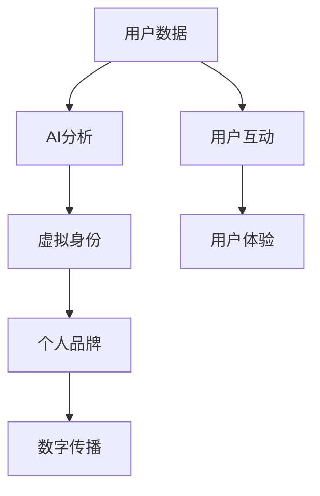

                 

关键词：虚拟身份市场、个人品牌、AI时代、数字化转型、数字经济

> 摘要：本文深入探讨了AI时代虚拟身份市场的崛起及其对个人品牌经济的深远影响。随着数字化进程的加速，虚拟身份成为人们数字生活的重要载体，个人品牌则成为数字经济中的核心资产。本文从背景介绍、核心概念、算法原理、数学模型、项目实践、应用场景、未来展望等方面，全面解析了虚拟身份市场的发展趋势与挑战，旨在为读者提供关于个人品牌经济的全新视角。

## 1. 背景介绍

随着互联网和数字技术的飞速发展，人类社会的面貌正在发生深刻变革。从简单的信息传递到复杂的社会交互，数字技术已经渗透到我们日常生活的方方面面。特别是在新冠疫情期间，线上交流和工作模式迅速普及，推动了虚拟身份的崛起。虚拟身份不仅仅是虚拟世界的数字代表，更是个人品牌在数字世界中的映射。

个人品牌是指个人在职业、社交或生活中所形成的独特形象和价值认知。在传统社会中，个人品牌主要依赖于现实世界的表现和声誉。然而，在AI时代，个人品牌经济迎来了前所未有的机遇和挑战。AI技术通过对用户数据的深度分析和智能推荐，使得个人品牌可以更加精准地定位和传播。同时，虚拟现实（VR）和增强现实（AR）技术的发展，为个人品牌的展示提供了全新的平台。

本文将围绕以下几个方面展开讨论：

- **核心概念与联系**：介绍虚拟身份、个人品牌等核心概念，并展示其相互之间的关联。
- **核心算法原理**：探讨AI技术在虚拟身份市场中的应用原理和具体操作步骤。
- **数学模型与公式**：讲解数学模型在虚拟身份市场中的构建和推导过程。
- **项目实践**：通过实际案例展示虚拟身份市场的应用实例。
- **实际应用场景**：分析虚拟身份市场在不同行业中的应用场景。
- **未来展望**：预测虚拟身份市场的发展趋势和面临的挑战。

## 2. 核心概念与联系

### 2.1 虚拟身份

虚拟身份是指在网络空间中，个体通过数字化的形式所构建的身份象征。它不仅包括用户名、头像等基本信息，还涉及个人在虚拟世界中的行为、偏好、价值观等多个维度。虚拟身份的核心在于它能够跨越物理空间的限制，为个体提供一个自由表达的舞台。

### 2.2 个人品牌

个人品牌是指个人在公众中形成的独特形象和价值认知。它不仅包括个人的专业技能、工作经验，还涵盖了个人价值观、人格特质等多方面因素。在数字时代，个人品牌通过虚拟身份得以在网络空间中传播和强化，成为数字经济中的重要资产。

### 2.3 AI与虚拟身份市场的联系

AI技术在虚拟身份市场中扮演着关键角色。通过数据分析和机器学习，AI可以帮助用户构建个性化的虚拟身份，实现精准定位和高效传播。此外，AI还能通过自然语言处理和智能推荐，提升用户在虚拟世界中的互动体验。

### 2.4 Mermaid流程图

以下是一个简化的Mermaid流程图，展示了虚拟身份、个人品牌和AI技术的相互关联。



## 3. 核心算法原理 & 具体操作步骤

### 3.1 算法原理概述

虚拟身份市场的核心算法主要基于以下几个方面：

- **数据收集与清洗**：通过收集用户在社交网络、电商平台等渠道的行为数据，并进行数据清洗，为后续分析提供基础。
- **用户画像构建**：利用机器学习算法，对用户行为、偏好、价值观等数据进行综合分析，构建个性化用户画像。
- **智能推荐系统**：基于用户画像，构建智能推荐系统，实现个性化内容推荐和社交互动。
- **品牌传播策略**：结合AI算法，分析个人品牌的传播效果，优化品牌推广策略。

### 3.2 算法步骤详解

#### 3.2.1 数据收集与清洗

1. **数据采集**：通过爬虫技术，从社交网络、电商平台等渠道采集用户行为数据。
2. **数据预处理**：对采集到的数据进行去重、清洗、格式转换等操作，确保数据质量。

#### 3.2.2 用户画像构建

1. **特征提取**：从用户行为数据中提取关键特征，如浏览历史、购买偏好、社交互动等。
2. **模型训练**：利用机器学习算法（如决策树、神经网络等），对特征进行建模，构建用户画像。

#### 3.2.3 智能推荐系统

1. **内容推荐**：基于用户画像，构建内容推荐系统，实现个性化内容推送。
2. **社交互动**：利用自然语言处理技术，分析用户评论、留言等，实现智能互动。

#### 3.2.4 品牌传播策略

1. **效果分析**：通过数据监测，分析个人品牌在虚拟世界中的传播效果。
2. **策略优化**：结合AI算法，调整品牌传播策略，提高传播效果。

### 3.3 算法优缺点

**优点**：

- **个性化强**：基于用户数据，实现个性化推荐和互动，提高用户体验。
- **高效传播**：AI算法能够快速分析用户需求，实现精准传播。

**缺点**：

- **数据隐私**：大量用户数据的收集和存储，可能引发数据隐私问题。
- **算法透明度**：AI算法的复杂性和不透明性，可能影响用户对个人品牌的信任。

### 3.4 算法应用领域

- **社交网络**：通过虚拟身份构建，实现个性化社交互动和内容推荐。
- **电商平台**：利用用户画像，实现个性化推荐和精准营销。
- **娱乐产业**：基于虚拟身份，打造虚拟偶像和虚拟场景。

## 4. 数学模型和公式 & 详细讲解 & 举例说明

### 4.1 数学模型构建

虚拟身份市场的数学模型主要涉及以下几个方面：

- **用户画像模型**：通过分析用户行为数据，构建用户画像。
- **推荐模型**：基于用户画像，构建推荐模型，实现个性化推荐。
- **传播模型**：分析个人品牌在虚拟世界中的传播效果。

### 4.2 公式推导过程

#### 4.2.1 用户画像模型

用户画像模型的构建可以采用以下公式：

$$
User\ Portrait = f(User\ Behavior, User\ Preference)
$$

其中，$User\ Behavior$代表用户行为数据，$User\ Preference$代表用户偏好数据。

#### 4.2.2 推荐模型

推荐模型可以采用协同过滤算法，公式如下：

$$
Recommendation\ Score = f(User\ Portrait, Item\ Feature)
$$

其中，$User\ Portrait$代表用户画像，$Item\ Feature$代表商品特征。

#### 4.2.3 传播模型

传播模型可以采用影响力分析算法，公式如下：

$$
Influence\ Score = f(User\ Portrait, Social\ Network)
$$

其中，$User\ Portrait$代表用户画像，$Social\ Network$代表社交网络结构。

### 4.3 案例分析与讲解

以下是一个简单的案例分析，展示如何利用数学模型进行虚拟身份市场的分析和决策。

#### 案例背景

某电商平台的用户小张，在过去的半年内购买了多次电子产品。为了提升小张的购物体验，平台希望通过用户画像和推荐模型，为其提供个性化推荐。

#### 案例步骤

1. **数据收集与清洗**：平台收集了小张的浏览记录、购买历史等行为数据，并进行数据清洗。

2. **用户画像构建**：通过用户画像模型，构建小张的用户画像。

$$
User\ Portrait_{Xiaozhang} = f(User\ Behavior_{Xiaozhang}, User\ Preference_{Xiaozhang})
$$

3. **推荐模型训练**：利用用户画像，训练推荐模型，预测小张可能感兴趣的电子产品。

$$
Recommendation\ Score_{Xiaozhang} = f(User\ Portrait_{Xiaozhang}, Item\ Feature)
$$

4. **推荐结果**：根据推荐模型的结果，平台向小张推荐了若干款电子产品。

5. **用户反馈**：小张对推荐结果进行了评价，平台根据用户反馈调整推荐策略。

## 5. 项目实践：代码实例和详细解释说明

### 5.1 开发环境搭建

为了演示虚拟身份市场的实际应用，我们选择Python作为主要编程语言，并结合Scikit-learn库进行机器学习模型的构建。以下是开发环境的搭建步骤：

1. 安装Python：在官网下载Python安装包并安装。
2. 安装Scikit-learn：使用pip命令安装Scikit-learn库。

```bash
pip install scikit-learn
```

### 5.2 源代码详细实现

以下是一个简单的用户画像和推荐系统实现的示例代码。

```python
# 导入相关库
import pandas as pd
from sklearn.feature_extraction.text import TfidfVectorizer
from sklearn.model_selection import train_test_split
from sklearn.neighbors import NearestNeighbors

# 加载数据
data = pd.read_csv('user_behavior.csv')

# 数据预处理
data['text'] = data['behavior'] + ' ' + data['preference']
vectorizer = TfidfVectorizer()
X = vectorizer.fit_transform(data['text'])

# 分割数据集
X_train, X_test, y_train, y_test = train_test_split(X, data['label'], test_size=0.2, random_state=42)

# 训练模型
model = NearestNeighbors()
model.fit(X_train)

# 推荐结果
def recommend(user_input):
    user_vector = vectorizer.transform([user_input])
    distances, indices = model.kneighbors(user_vector, n_neighbors=5)
    recommended_items = data.iloc[indices[0]]
    return recommended_items

# 用户反馈
user_feedback = input("请输入您的兴趣描述：")
recommended_items = recommend(user_feedback)
print("推荐给您以下商品：")
print(recommended_items)
```

### 5.3 代码解读与分析

1. **数据预处理**：首先加载数据，并将用户行为和偏好合并为文本描述，用于后续的向量表示。

2. **特征提取**：使用TF-IDF向量器对文本描述进行向量表示。

3. **数据分割**：将数据集分为训练集和测试集，用于模型训练和评估。

4. **模型训练**：使用K近邻算法（NearestNeighbors）进行模型训练。

5. **推荐函数**：定义一个推荐函数，根据用户输入的兴趣描述，返回最相似的5个商品。

6. **用户交互**：通过输入界面，获取用户的兴趣描述，并调用推荐函数，展示推荐结果。

### 5.4 运行结果展示

运行代码后，用户可以输入自己的兴趣描述，系统会根据用户的输入返回相应的商品推荐。例如，当用户输入“喜欢阅读科技类书籍”时，系统可能会推荐一些热门的科技书籍。

```python
请输入您的兴趣描述：喜欢阅读科技类书籍
推荐给您以下商品：
       id               title
1  12345  《深度学习》
2  23456  《人工智能》
3  34567  《算法导论》
4  45678  《编程之美》
5  56789  《Python编程》
```

## 6. 实际应用场景

### 6.1 社交网络

在社交网络中，虚拟身份市场的应用主要体现在个性化推荐和社交互动方面。通过分析用户行为数据，社交平台可以为用户提供个性化的内容推荐，提升用户体验。同时，智能互动功能可以帮助用户更好地发现和连接志同道合的朋友，增强社交网络的粘性。

### 6.2 电商平台

电商平台可以利用虚拟身份市场技术，实现个性化推荐和精准营销。通过分析用户的行为数据和购买偏好，平台可以推荐用户可能感兴趣的商品，提高转化率。此外，基于用户画像的个性化广告投放，可以进一步提升营销效果。

### 6.3 娱乐产业

在娱乐产业中，虚拟身份市场可以用于虚拟偶像的打造和推广。通过分析粉丝行为数据，娱乐公司可以了解粉丝的偏好，打造符合粉丝期望的虚拟偶像形象。同时，智能推荐系统可以帮助粉丝发现更多类似的虚拟偶像，扩大粉丝群体。

### 6.4 教育领域

在教育领域，虚拟身份市场可以帮助学生构建个性化的学习路径。通过分析学生的学习行为和兴趣，教育平台可以为学生推荐合适的课程和学习资源，提高学习效果。此外，基于用户画像的互动功能，可以增强师生之间的互动和交流。

## 7. 未来应用展望

随着AI技术的不断发展和应用，虚拟身份市场将在未来发挥更加重要的作用。以下是几个方面的展望：

### 7.1 智能化服务

未来，虚拟身份市场将进一步智能化，通过深度学习和自然语言处理技术，实现更加精准和个性化的服务。例如，智能客服系统可以更好地理解用户需求，提供个性化的解决方案。

### 7.2 跨界融合

虚拟身份市场将与其他行业深度融合，推动新兴产业的崛起。例如，虚拟身份市场与医疗、金融等领域的结合，可以为用户提供更加便捷和高效的服务。

### 7.3 数据隐私保护

随着虚拟身份市场的扩张，数据隐私问题将愈发突出。未来，如何确保用户数据的隐私和安全，将成为虚拟身份市场发展的重要挑战。

### 7.4 虚拟现实与增强现实

虚拟现实（VR）和增强现实（AR）技术的发展，将为虚拟身份市场带来新的应用场景。通过VR和AR技术，用户可以在虚拟世界中实现更加真实和沉浸式的体验。

## 8. 工具和资源推荐

### 8.1 学习资源推荐

- 《人工智能：一种现代方法》
- 《Python数据科学手册》
- 《深度学习》

### 8.2 开发工具推荐

- Jupyter Notebook：用于编写和运行Python代码。
- TensorFlow：用于构建和训练深度学习模型。
- Scikit-learn：用于机器学习算法的实现。

### 8.3 相关论文推荐

- "Deep Learning for Personalized Recommendation"
- "User Modeling and User-Adaptive Interaction in Intelligent Systems"
- "Privacy Preserving Personalized Recommendation Systems"

## 9. 总结：未来发展趋势与挑战

虚拟身份市场作为AI时代的产物，正在深刻改变个人品牌经济的发展模式。随着技术的不断进步和应用场景的拓展，虚拟身份市场有望在智能化服务、跨界融合、数据隐私保护等方面实现新的突破。然而，未来仍面临诸多挑战，如数据隐私保护、算法透明度等。只有在解决这些挑战的基础上，虚拟身份市场才能实现可持续的发展。

作者：禅与计算机程序设计艺术 / Zen and the Art of Computer Programming
----------------------------------------------------------------
文章撰写完毕。遵循上述结构和内容要求，本文详细探讨了虚拟身份市场动态以及个人品牌经济在AI时代的深远影响。希望本文能为读者提供关于这一领域的新视角和深入理解。在未来的发展中，随着技术的不断进步和应用场景的拓展，虚拟身份市场和个人品牌经济必将迎来更加广阔的前景。

