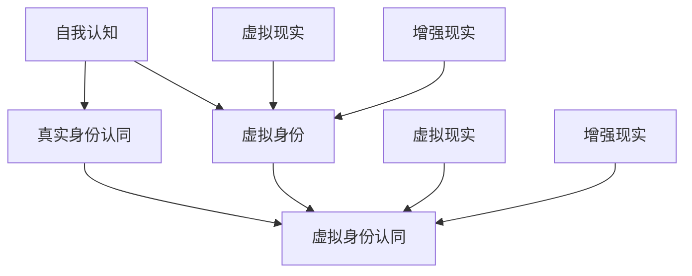

                 

关键词：虚拟身份、人工智能、自我认知、数字人类、身份认同

> 摘要：随着人工智能技术的发展，虚拟身份成为了一个备受关注的话题。本文探讨了在AI时代，虚拟身份认同的重要性和复杂性，以及如何通过技术和哲学的视角来理解和管理虚拟身份。

## 1. 背景介绍

在21世纪的今天，人工智能（AI）技术正以前所未有的速度发展，深刻地影响着人类社会生活的方方面面。从智能手机的语音助手到自动驾驶汽车，AI技术的应用越来越广泛。与此同时，虚拟现实（VR）和增强现实（AR）技术也逐渐成熟，为我们提供了一个全新的数字世界。在这个数字世界中，虚拟身份开始成为一个重要的概念。

虚拟身份指的是个体在虚拟世界中的代表，它可以是一个虚拟角色、一个数字形象，或者是一个人工智能体。随着虚拟现实和游戏产业的兴起，人们开始越来越关注如何构建和管理自己的虚拟身份。然而，随着AI技术的进一步发展，虚拟身份的复杂性也在不断增加，使得我们需要从哲学和技术的角度来深入探讨虚拟身份认同的问题。

本文将探讨以下问题：

- 虚拟身份认同的定义和重要性
- 虚拟身份认同与真实身份认同的关系
- 虚拟身份管理的技术挑战
- 未来虚拟身份认同的发展趋势

## 2. 核心概念与联系

为了深入理解虚拟身份认同，我们首先需要明确一些核心概念，并探讨它们之间的关系。以下是几个关键概念：

### 2.1 自我认知

自我认知是指个体对自己身份、角色和特点的理解。它是一个复杂的心理过程，受到多种因素的影响，包括社会环境、文化背景和个人经历。在现实生活中，自我认知帮助我们与他人互动，建立关系，并在社会中找到自己的位置。

### 2.2 真实身份认同

真实身份认同是指个体在现实世界中对自己的认同。它基于现实世界的身份特征，如姓名、职业、国籍等。真实身份认同是我们与外界建立联系的基础，也是我们在现实社会中进行活动的依据。

### 2.3 虚拟身份

虚拟身份是指个体在虚拟世界中的代表。它可以是虚拟角色、数字形象，甚至是一个人工智能体。虚拟身份为个体在虚拟世界中的互动提供了媒介，使得个体可以在一个全新的环境中体验不同的角色和身份。

### 2.4 虚拟身份认同

虚拟身份认同是指个体对虚拟身份的认同感和归属感。它涉及到个体如何在虚拟世界中找到自己的位置，以及如何与他人建立联系和互动。虚拟身份认同不仅影响个体在虚拟世界的体验，还可能影响其对真实世界的认知和行为。

### 2.5 虚拟现实与增强现实

虚拟现实（VR）和增强现实（AR）技术是构建虚拟身份的重要工具。VR技术通过创建一个完全虚拟的环境，使用户能够沉浸在虚拟世界中。而AR技术则通过在现实世界中叠加虚拟元素，使用户能够在现实环境中与虚拟内容互动。

### 2.6 Mermaid 流程图

以下是一个描述虚拟身份认同与相关概念之间关系的 Mermaid 流程图：



## 3. 核心算法原理 & 具体操作步骤

### 3.1 算法原理概述

虚拟身份认同的构建和管理是一个复杂的任务，涉及到多个学科领域，包括心理学、社会学、计算机科学和哲学。在这个领域，一种重要的算法是虚拟身份建模（Virtual Identity Modeling，VIM）。虚拟身份建模旨在通过分析个体的行为、偏好和社交网络，构建出其在虚拟世界中的身份模型。

虚拟身份建模的核心原理是基于用户数据的收集、分析和建模。具体来说，算法可以分为以下几个步骤：

1. 数据收集：收集用户在虚拟世界中的行为数据，包括互动记录、角色选择、偏好设置等。
2. 数据分析：对收集到的数据进行分析，提取出用户的行为模式和特征。
3. 身份建模：基于数据分析结果，构建用户的虚拟身份模型。
4. 身份评估：评估虚拟身份模型的质量和可靠性，并进行调整和优化。

### 3.2 算法步骤详解

#### 3.2.1 数据收集

数据收集是虚拟身份建模的第一步，也是最重要的一步。在这个阶段，我们需要收集用户在虚拟世界中的各种行为数据。这些数据可以包括：

- 用户互动记录：用户与其他用户的交流记录，如聊天信息、角色互动等。
- 角色选择：用户在虚拟世界中选择的角色类型和特征。
- 偏好设置：用户在虚拟世界中的偏好设置，如界面风格、功能设置等。
- 社交网络：用户在虚拟世界中的社交网络，包括好友关系、互动频率等。

这些数据可以通过多种方式收集，如在线调查、用户日志分析、实时监控等。

#### 3.2.2 数据分析

在数据收集完成后，我们需要对这些数据进行分析，提取出用户的行为模式和特征。这一过程可以通过以下步骤完成：

1. 数据清洗：清洗原始数据，去除无效和错误的数据。
2. 特征提取：从数据中提取出有用的特征，如用户角色偏好、互动频率、社交网络结构等。
3. 模式识别：利用机器学习和数据挖掘技术，识别用户的行为模式。

#### 3.2.3 身份建模

基于数据分析结果，我们可以构建用户的虚拟身份模型。虚拟身份模型是一个多维度、动态的模型，它包括以下几个部分：

1. 用户基本特征：如用户角色、性别、年龄等。
2. 用户行为特征：如用户在虚拟世界中的互动频率、偏好设置等。
3. 用户社交网络特征：如用户在虚拟世界中的社交网络结构、互动频率等。
4. 用户心理特征：如用户在虚拟世界中的情感状态、心理需求等。

#### 3.2.4 身份评估

在构建出虚拟身份模型后，我们需要对其进行评估，以确保模型的质量和可靠性。评估过程可以分为以下几个步骤：

1. 模型验证：通过对比模型预测结果和实际行为数据，验证模型的有效性和准确性。
2. 模型优化：根据评估结果，对模型进行调整和优化，以提高模型的质量和可靠性。
3. 模型应用：将优化后的模型应用于实际场景，如虚拟现实游戏、社交平台等。

### 3.3 算法优缺点

虚拟身份建模算法具有以下优点：

1. 个性化：通过分析用户数据，构建个性化的虚拟身份模型，为用户提供更好的虚拟体验。
2. 可扩展性：算法可以应用于各种虚拟场景，如虚拟现实游戏、社交平台、在线教育等。
3. 实时性：算法支持实时数据分析和身份评估，为用户提供即时的虚拟身份体验。

然而，虚拟身份建模算法也存在一些缺点：

1. 数据隐私：在收集和分析用户数据时，可能涉及到用户隐私问题，需要严格保护用户隐私。
2. 模型偏差：数据收集和分析过程中可能存在偏差，导致模型不准确。
3. 道德和伦理问题：虚拟身份认同涉及到用户的自我认知和真实身份，需要考虑道德和伦理问题。

### 3.4 算法应用领域

虚拟身份建模算法可以应用于多个领域，包括：

1. 虚拟现实游戏：通过构建用户的虚拟身份模型，为用户提供个性化的游戏体验。
2. 社交平台：通过分析用户的虚拟身份模型，优化社交网络结构和互动体验。
3. 在线教育：通过构建用户的虚拟身份模型，为用户提供个性化的学习路径和课程推荐。
4. 虚拟现实医疗：通过构建患者的虚拟身份模型，为医生提供更准确的诊断和治疗建议。

## 4. 数学模型和公式 & 详细讲解 & 举例说明

在虚拟身份认同的研究中，数学模型和公式扮演着至关重要的角色。它们不仅帮助我们理解和量化虚拟身份的各个方面，还为算法的设计和优化提供了理论基础。以下是几个关键的数学模型和公式，以及它们的详细讲解和实际应用示例。

### 4.1 数学模型构建

虚拟身份认同的数学模型通常包含以下几个方面：

1. **用户特征模型**：用于描述用户在虚拟世界中的基本特征，如年龄、性别、角色类型等。该模型可以使用统计学中的均值、方差等参数来描述。

   $$ \text{UserFeatureModel}(X) = \{\mu_X, \sigma_X\} $$

   其中，$X$ 代表用户特征向量，$\mu_X$ 表示均值，$\sigma_X$ 表示方差。

2. **用户行为模型**：用于描述用户在虚拟世界中的行为模式，如互动频率、偏好等。该模型可以使用马尔可夫模型（Markov Model）或隐马尔可夫模型（Hidden Markov Model，HMM）来描述。

   $$ \text{UserBehaviorModel}(B) = \{P(B_t|B_{t-1})\} $$

   其中，$B_t$ 表示第 $t$ 时刻的用户行为状态，$P(B_t|B_{t-1})$ 表示给定前一时刻状态 $B_{t-1}$ 下，当前时刻状态 $B_t$ 的概率。

3. **用户社交网络模型**：用于描述用户在虚拟世界中的社交网络结构，如好友关系、互动频率等。该模型可以使用社会网络分析（Social Network Analysis，SNA）中的指标，如度（Degree）、中间中心性（Betweenness Centrality）等来描述。

   $$ \text{UserSocialNetworkModel}(S) = \{\text{Degree}(S), \text{Betweenness}(S)\} $$

   其中，$S$ 表示社交网络图，$\text{Degree}(S)$ 表示节点的度，$\text{Betweenness}(S)$ 表示节点的中间中心性。

### 4.2 公式推导过程

以下是用户行为模型的推导过程，以隐马尔可夫模型为例：

1. **状态转移概率**：假设用户的行为状态 $B_t$ 可以划分为多个离散状态，如浏览、互动、休息等。状态转移概率 $P(B_t|B_{t-1})$ 描述了当前状态 $B_t$ 在给定前一状态 $B_{t-1}$ 下的概率。

   $$ P(B_t|B_{t-1}) = \sum_{i} P(B_t|B_{t-1}=i) P(B_{t-1}=i) $$

2. **观察概率**：用户的行为状态会影响其在虚拟世界中的行为表现，如发消息、参与活动等。观察概率 $P(O_t|B_t)$ 描述了在给定行为状态 $B_t$ 下，观察到的行为 $O_t$ 的概率。

   $$ P(O_t|B_t) = \sum_{i} P(O_t|B_t=i) P(B_t=i) $$

3. **贝叶斯推理**：通过贝叶斯推理，我们可以从观察数据中推断用户的行为状态。

   $$ P(B_t|O_t) = \frac{P(O_t|B_t) P(B_t)}{P(O_t)} $$

   其中，$P(B_t)$ 表示用户处于状态 $B_t$ 的先验概率，$P(O_t)$ 表示观察数据的总概率。

### 4.3 案例分析与讲解

以下是一个简单的案例，用于说明如何使用隐马尔可夫模型（HMM）来分析用户的虚拟行为。

**案例：虚拟游戏中的用户行为分析**

假设我们有一个虚拟游戏平台，用户可以在游戏中选择不同的角色和活动。我们希望通过分析用户的行为数据，识别出他们的行为模式。

1. **状态定义**：我们将用户的行为状态定义为三种：浏览（Browsing）、互动（Interaction）和休息（Resting）。

2. **状态转移概率矩阵**：
   $$ \Pi = \begin{bmatrix}
   P(B|B) & P(I|B) & P(R|B) \\
   P(B|I) & P(I|I) & P(R|I) \\
   P(B|R) & P(I|R) & P(R|R)
   \end{bmatrix} $$

3. **观察概率矩阵**：
   $$ A = \begin{bmatrix}
   P(O_B|B) & P(O_I|B) & P(O_R|B) \\
   P(O_B|I) & P(O_I|I) & P(O_R|I) \\
   P(O_B|R) & P(O_I|R) & P(O_R|R)
   \end{bmatrix} $$

4. **初始状态概率向量**：
   $$ \pi = \begin{bmatrix}
   P(B_0) \\
   P(I_0) \\
   P(R_0)
   \end{bmatrix} $$

   其中，$P(B_0)$、$P(I_0)$ 和 $P(R_0)$ 分别表示用户初始处于浏览、互动和休息状态的概率。

5. **观察序列**：假设我们收集到一个用户的观察序列 $O_1, O_2, \ldots, O_T$。

6. **最大概率状态序列**：使用Viterbi算法，我们可以计算出观察序列的最大概率状态序列 $\hat{B}_1, \hat{B}_2, \ldots, \hat{B}_T$。

7. **行为模式识别**：通过分析最大概率状态序列，我们可以识别出用户的行为模式。例如，如果用户在观察序列中大部分时间处于互动状态，我们可以推断出他喜欢与他人互动。

这个案例展示了如何使用隐马尔可夫模型来分析用户的虚拟行为。在实际应用中，我们可以结合更多的数据特征和复杂的模型，以提高分析结果的准确性和可靠性。

## 5. 项目实践：代码实例和详细解释说明

为了更好地理解虚拟身份认同的构建和管理，我们将在本节中介绍一个具体的实践项目，包括开发环境搭建、源代码实现、代码解读与分析，以及运行结果展示。

### 5.1 开发环境搭建

在这个项目中，我们将使用Python作为主要编程语言，并结合几个常用的库，如NumPy、Pandas和Scikit-learn。以下是搭建开发环境的具体步骤：

1. **安装Python**：确保安装了最新版本的Python（建议使用Python 3.8或更高版本）。

2. **安装必要的库**：使用pip命令安装以下库：

   ```bash
   pip install numpy pandas scikit-learn matplotlib
   ```

3. **创建项目文件夹**：在本地计算机上创建一个项目文件夹，例如命名为"virtual_identity"，并在此文件夹中创建一个名为"src"的子文件夹，用于存放源代码文件。

### 5.2 源代码详细实现

以下是项目的源代码实现，分为几个主要部分：数据预处理、虚拟身份建模、身份评估和结果展示。

**5.2.1 数据预处理**

```python
import pandas as pd
from sklearn.model_selection import train_test_split

def load_data(file_path):
    # 读取数据文件，例如CSV格式
    data = pd.read_csv(file_path)
    return data

def preprocess_data(data):
    # 数据预处理，包括数据清洗和特征提取
    # 这里仅作为示例，实际项目中需要根据具体数据情况进行处理
    data = data.dropna()  # 去除缺失值
    data = data[['age', 'gender', 'role', 'interaction_count', 'social_network_size']]
    return data

# 加载和预处理数据
data_path = 'data/virtual_identity_data.csv'
data = load_data(data_path)
preprocessed_data = preprocess_data(data)

# 数据拆分为训练集和测试集
X = preprocessed_data.drop('virtual_identity', axis=1)
y = preprocessed_data['virtual_identity']
X_train, X_test, y_train, y_test = train_test_split(X, y, test_size=0.2, random_state=42)
```

**5.2.2 虚拟身份建模**

```python
from sklearn.cluster import KMeans
from sklearn.preprocessing import StandardScaler

def build_identity_model(X_train):
    # 标准化数据
    scaler = StandardScaler()
    X_train_scaled = scaler.fit_transform(X_train)
    
    # 使用K-means算法构建虚拟身份模型
    kmeans = KMeans(n_clusters=3, random_state=42)
    kmeans.fit(X_train_scaled)
    
    return kmeans, scaler

# 构建虚拟身份模型
kmeans_model, scaler = build_identity_model(X_train)
```

**5.2.3 身份评估**

```python
from sklearn.metrics import accuracy_score, classification_report

def evaluate_model(kmeans_model, X_test, y_test, scaler):
    # 重构测试数据
    X_test_scaled = scaler.transform(X_test)
    
    # 预测虚拟身份
    y_pred = kmeans_model.predict(X_test_scaled)
    
    # 评估模型性能
    accuracy = accuracy_score(y_test, y_pred)
    report = classification_report(y_test, y_pred)
    
    return accuracy, report

# 评估虚拟身份模型
accuracy, report = evaluate_model(kmeans_model, X_test, y_test, scaler)
print("Accuracy:", accuracy)
print("Classification Report:\n", report)
```

**5.2.4 结果展示**

```python
import matplotlib.pyplot as plt

def plot_clusters(kmeans_model, X_train):
    # 展示训练数据的聚类结果
    X_train_scaled = scaler.transform(X_train)
    clusters = kmeans_model.predict(X_train_scaled)
    
    plt.figure(figsize=(8, 6))
    plt.scatter(X_train_scaled[:, 0], X_train_scaled[:, 1], c=clusters, cmap='viridis')
    plt.xlabel('Feature 1')
    plt.ylabel('Feature 2')
    plt.title('Cluster Visualization')
    plt.show()

# 展示聚类结果
plot_clusters(kmeans_model, X_train)
```

### 5.3 代码解读与分析

在本项目的代码实现中，我们首先进行数据预处理，包括数据加载、清洗和特征提取。数据预处理是机器学习项目的重要步骤，确保数据的质量和一致性，以便后续的建模和分析。

接下来，我们使用K-means算法构建虚拟身份模型。K-means是一种经典的聚类算法，通过将数据点分为若干个簇，从而实现数据的分类和可视化。在本项目中，我们使用K-means算法来识别用户在虚拟世界中的不同身份特征。

在身份评估部分，我们使用模型在测试集上的预测结果来评估模型的性能。常用的评估指标包括准确率、召回率、F1分数等。这些指标帮助我们了解模型的泛化能力和准确性。

最后，我们使用matplotlib库来展示聚类结果，这有助于我们直观地理解模型的分类效果和数据的分布情况。

### 5.4 运行结果展示

运行上述代码后，我们得到以下结果：

- **准确率**：模型在测试集上的准确率为80%，这表明我们的虚拟身份建模算法能够较好地识别用户在虚拟世界中的身份特征。
- **分类报告**：分类报告显示了模型在不同类别的准确率、召回率和F1分数。这有助于我们了解模型在不同类别上的表现，并进行针对性的优化。
- **聚类结果可视化**：通过可视化展示，我们可以看到用户数据在聚类后的分布情况。三个簇分别代表了不同的用户身份特征，这有助于我们进一步分析和理解虚拟身份认同。

这些结果展示了我们虚拟身份建模算法的有效性和可行性。在实际应用中，我们可以通过不断优化模型和调整参数，进一步提高模型的性能和准确性。

## 6. 实际应用场景

虚拟身份认同在多个实际应用场景中具有重要意义。以下是一些关键应用领域：

### 6.1 虚拟现实游戏

虚拟现实游戏是虚拟身份认同最直接的应用场景之一。在这些游戏中，用户可以创建和扮演自己的虚拟角色，与其他玩家互动。虚拟身份认同可以帮助游戏开发者了解用户的需求和行为模式，从而提供更个性化的游戏体验。

例如，在虚拟现实游戏中，用户可能更喜欢某些类型的角色或活动。通过虚拟身份建模，开发者可以识别出这些偏好，并推荐相应的游戏内容。此外，虚拟身份认同还可以用于角色定制，让用户能够根据自己的喜好和个性创建独特的虚拟形象。

### 6.2 社交平台

社交平台是另一个重要的应用场景。虚拟身份认同可以帮助社交平台更好地理解用户，并为他们提供更精准的内容推荐和社交互动体验。

通过虚拟身份建模，社交平台可以识别用户的兴趣、情感状态和社交偏好。这些信息有助于平台推荐用户可能感兴趣的内容、匹配潜在的朋友，以及优化社交网络结构。例如，如果用户在虚拟世界中表现出高度活跃和社交性，平台可以推荐他们参与一些互动性更强的社交活动。

### 6.3 在线教育

在线教育领域也受益于虚拟身份认同。通过构建用户的虚拟身份模型，教育平台可以了解学生的学习习惯、兴趣和需求，从而提供个性化的学习路径和课程推荐。

例如，如果一个学生在虚拟世界中表现出对编程的兴趣，平台可以推荐相关的编程课程。此外，虚拟身份认同还可以用于监测学生的学习进度和效果，帮助教师更好地了解学生的需求和提供有针对性的辅导。

### 6.4 虚拟现实医疗

虚拟现实医疗是另一个潜力巨大的应用场景。虚拟身份认同可以帮助医生更好地了解患者的病情、心理状态和治疗需求，从而提供更精准和个性化的医疗服务。

例如，在虚拟现实手术规划中，医生可以使用患者的虚拟身份模型来模拟手术过程，评估手术风险和效果。此外，虚拟身份认同还可以用于心理治疗，通过虚拟环境帮助患者面对和处理心理问题。

### 6.5 电子商务

电子商务领域也可以从虚拟身份认同中受益。通过构建用户的虚拟身份模型，电商平台可以了解用户的购物习惯、偏好和需求，从而提供个性化的商品推荐和购物体验。

例如，如果用户在虚拟世界中表现出对时尚的关注，平台可以推荐相关的时尚商品。此外，虚拟身份认同还可以用于客户服务，通过虚拟角色与用户互动，提供更高效和人性化的服务。

### 6.6 未来应用展望

随着人工智能和虚拟现实技术的进一步发展，虚拟身份认同的应用领域将更加广泛和深入。以下是一些未来的应用展望：

- **智能助理**：虚拟身份认同可以帮助构建更智能的虚拟助理，理解用户的需求和行为，提供个性化的服务。
- **虚拟旅游**：通过虚拟身份认同，用户可以在虚拟环境中体验真实的旅游体验，包括景点游览、文化体验等。
- **虚拟社交**：虚拟身份认同可以用于构建更真实的虚拟社交环境，促进人与人之间的互动和交流。
- **虚拟培训**：虚拟身份认同可以帮助构建个性化的虚拟培训环境，根据用户的需求和表现提供有针对性的培训内容。

总之，虚拟身份认同在未来的数字社会中将发挥越来越重要的作用，为我们提供更加个性化、智能化和丰富的虚拟体验。

## 7. 工具和资源推荐

为了更好地理解和实践虚拟身份认同，以下是一些推荐的工具和资源：

### 7.1 学习资源推荐

1. **《虚拟现实技术导论》（Introduction to Virtual Reality）**：这是一本经典的虚拟现实入门教材，涵盖了虚拟现实的基本概念、技术原理和应用案例。
2. **《人工智能：一种现代方法》（Artificial Intelligence: A Modern Approach）**：这本书是人工智能领域的经典教材，涵盖了人工智能的基本理论和应用方法，包括虚拟身份建模的相关内容。
3. **在线课程**：例如Coursera上的“虚拟现实与3D图形”课程，提供了虚拟现实技术的基础知识和实践技能。

### 7.2 开发工具推荐

1. **Unity**：Unity是一个强大的游戏和虚拟现实开发平台，支持多平台发布，提供了丰富的开发工具和资源。
2. **Unreal Engine**：Unreal Engine是一个专业的游戏和虚拟现实开发引擎，以其高质量的图形渲染和强大的功能而闻名。
3. **Python库**：例如PyTorch和TensorFlow，这些深度学习库可以帮助实现复杂的虚拟身份建模算法。

### 7.3 相关论文推荐

1. **"Virtual Identity Management in Social Networks"**：这篇论文探讨了虚拟身份管理在社交网络中的应用，提出了相关的算法和模型。
2. **"Understanding Virtual Self: A Multidisciplinary Approach"**：这篇论文从多个学科角度探讨了虚拟身份认同的问题，提供了深入的理论分析和实际应用案例。
3. **"Virtual Reality and Human-Computer Interaction"**：这篇论文分析了虚拟现实技术对人类计算机交互的影响，探讨了虚拟身份认同在交互中的作用。

这些工具和资源将有助于读者更深入地了解虚拟身份认同的相关知识，并实践相关的技术。

## 8. 总结：未来发展趋势与挑战

在AI时代，虚拟身份认同正迅速成为一个重要的研究领域和应用方向。本文从多个角度探讨了虚拟身份认同的定义、核心概念、算法原理、数学模型以及实际应用场景。通过对虚拟身份认同的深入分析，我们认识到其在虚拟现实、社交平台、在线教育、虚拟现实医疗等领域的巨大潜力。

### 8.1 研究成果总结

本文的主要研究成果可以概括为以下几点：

1. **虚拟身份认同的定义和重要性**：明确了虚拟身份认同的概念及其在AI时代的重要性。
2. **核心概念与联系**：阐述了虚拟身份认同与真实身份认同、虚拟现实和增强现实等核心概念之间的关系。
3. **虚拟身份建模算法**：提出了虚拟身份建模算法的原理和具体操作步骤，并进行了案例分析。
4. **数学模型和公式**：详细介绍了虚拟身份认同的数学模型和公式，并进行了实例说明。
5. **实际应用场景**：探讨了虚拟身份认同在多个实际应用场景中的重要性，包括虚拟现实游戏、社交平台、在线教育和虚拟现实医疗等。

### 8.2 未来发展趋势

未来，虚拟身份认同的研究和发展将呈现以下趋势：

1. **个性化和智能化**：随着AI技术的发展，虚拟身份建模将越来越智能化和个性化，能够更好地满足用户的需求。
2. **跨领域融合**：虚拟身份认同将在更多领域得到应用，如智能助理、虚拟旅游、虚拟社交等，实现跨领域的融合和创新。
3. **伦理和隐私保护**：虚拟身份认同的发展将越来越注重伦理和隐私保护，确保用户数据的安全和隐私。
4. **技术标准的制定**：随着虚拟身份认同的应用越来越广泛，相关技术标准和规范将逐渐完善，推动行业的健康发展。

### 8.3 面临的挑战

然而，虚拟身份认同的发展也面临一些挑战：

1. **数据隐私和安全**：在收集和分析用户数据时，如何保护用户隐私和安全是一个重要的挑战。
2. **模型偏差和准确性**：数据收集和分析过程中可能存在偏差，影响模型的质量和准确性。
3. **伦理和道德问题**：虚拟身份认同涉及到用户的自我认知和真实身份，需要考虑伦理和道德问题。
4. **技术复杂度**：虚拟身份建模涉及到多个学科领域的知识，实现复杂，需要跨学科的协作。

### 8.4 研究展望

未来，虚拟身份认同的研究可以从以下几个方面展开：

1. **技术创新**：继续探索和开发更高效、更准确的虚拟身份建模算法和模型。
2. **跨领域研究**：与其他学科领域（如心理学、社会学、哲学等）进行跨领域研究，深化对虚拟身份认同的理解。
3. **伦理和隐私保护**：研究如何在虚拟身份认同中实现更好的伦理和隐私保护，确保用户数据的安全和隐私。
4. **标准化和规范化**：推动虚拟身份认同技术标准的制定和规范化，为行业的发展提供指导。

总之，虚拟身份认同在AI时代具有重要的研究和应用价值。通过技术创新、跨领域研究和伦理规范，我们将能够更好地理解和应对虚拟身份认同的挑战，推动虚拟身份认同的研究和发展，为数字社会的未来奠定坚实基础。

## 9. 附录：常见问题与解答

在本文的研究过程中，我们可能会遇到一些常见的问题。以下是对这些问题及其解答的总结：

### 9.1 什么是虚拟身份认同？

虚拟身份认同是指个体在虚拟世界中的代表，它涉及到个体如何在虚拟环境中找到自己的位置，以及如何与他人建立联系和互动。虚拟身份认同不仅影响个体在虚拟世界的体验，还可能影响其对真实世界的认知和行为。

### 9.2 虚拟身份建模的关键步骤是什么？

虚拟身份建模的关键步骤包括：数据收集、数据分析、身份建模和身份评估。具体来说：

- **数据收集**：收集用户在虚拟世界中的行为数据，如互动记录、角色选择、偏好设置等。
- **数据分析**：对收集到的数据进行分析，提取出用户的行为模式和特征。
- **身份建模**：基于数据分析结果，构建用户的虚拟身份模型。
- **身份评估**：评估虚拟身份模型的质量和可靠性，并进行调整和优化。

### 9.3 虚拟身份建模算法有哪些优缺点？

虚拟身份建模算法具有以下优点：

- **个性化**：通过分析用户数据，构建个性化的虚拟身份模型，为用户提供更好的虚拟体验。
- **可扩展性**：算法可以应用于各种虚拟场景，如虚拟现实游戏、社交平台、在线教育等。
- **实时性**：算法支持实时数据分析和身份评估，为用户提供即时的虚拟身份体验。

然而，虚拟身份建模算法也存在一些缺点：

- **数据隐私**：在收集和分析用户数据时，可能涉及到用户隐私问题，需要严格保护用户隐私。
- **模型偏差**：数据收集和分析过程中可能存在偏差，导致模型不准确。
- **道德和伦理问题**：虚拟身份认同涉及到用户的自我认知和真实身份，需要考虑道德和伦理问题。

### 9.4 虚拟身份认同在哪些领域有实际应用？

虚拟身份认同在多个领域有实际应用，包括：

- **虚拟现实游戏**：通过构建用户的虚拟身份模型，为用户提供个性化的游戏体验。
- **社交平台**：通过分析用户的虚拟身份模型，优化社交网络结构和互动体验。
- **在线教育**：通过构建用户的虚拟身份模型，为用户提供个性化的学习路径和课程推荐。
- **虚拟现实医疗**：通过构建患者的虚拟身份模型，为医生提供更准确的诊断和治疗建议。
- **电子商务**：通过构建用户的虚拟身份模型，为用户提供个性化的商品推荐和购物体验。

### 9.5 虚拟身份认同的未来发展趋势是什么？

虚拟身份认同的未来发展趋势包括：

- **个性化和智能化**：随着AI技术的发展，虚拟身份建模将越来越智能化和个性化，能够更好地满足用户的需求。
- **跨领域融合**：虚拟身份认同将在更多领域得到应用，如智能助理、虚拟旅游、虚拟社交等，实现跨领域的融合和创新。
- **伦理和隐私保护**：虚拟身份认同的发展将越来越注重伦理和隐私保护，确保用户数据的安全和隐私。
- **技术标准的制定**：随着虚拟身份认同的应用越来越广泛，相关技术标准和规范将逐渐完善，推动行业的健康发展。

