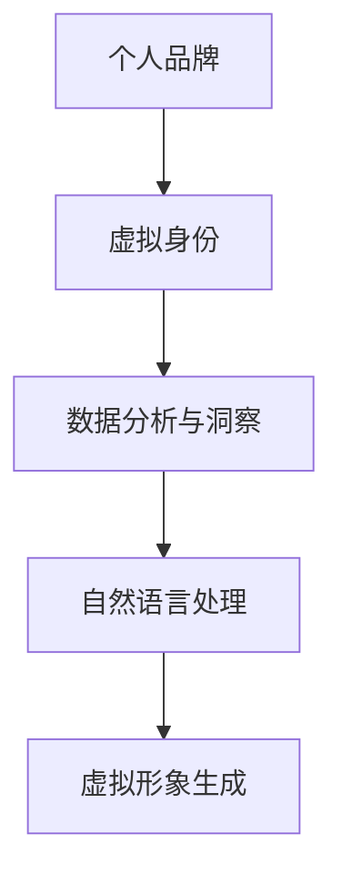

                 

 在数字时代，个人品牌塑造变得比以往任何时候都更加重要。随着人工智能技术的飞速发展，人们对于个人身份的认知和理解也在发生深刻的变化。作为一位世界级人工智能专家，我有幸见证并参与了这一变革过程。本文旨在探讨AI时代如何通过虚拟身份设计来塑造个人品牌，以及这一过程中所涉及的关键概念和技术。

## 关键词

- 个人品牌塑造
- 虚拟身份设计
- AI技术
- 数字时代
- 品牌影响力

## 摘要

本文将深入探讨虚拟身份设计师在AI时代的重要性。我们将首先介绍个人品牌塑造的基本概念，接着讨论AI在虚拟身份设计中的应用，并通过实际案例和具体操作步骤来展示如何通过虚拟身份设计来提升个人品牌。最后，我们将展望这一领域的未来发展趋势与挑战。

## 1. 背景介绍

### 个人品牌塑造的重要性

在当今竞争激烈的社会中，个人品牌已成为一种强大的资产。它不仅仅是一个名字或标志，更是一种价值观、专业能力和个性魅力的综合体现。一个成功的个人品牌可以带来职业机会、社会影响力和商业价值。然而，在数字时代，传统的品牌塑造方式已经不足以满足新的市场需求。

### 数字时代与虚拟身份

随着互联网的普及和社交媒体的兴起，虚拟身份逐渐成为人们日常生活中的重要组成部分。虚拟身份不仅限于游戏和虚拟世界，还渗透到了社交网络、在线工作和数字营销等各个领域。个人如何在虚拟世界中建立和维护一个有吸引力和权威性的身份，已成为一个亟待解决的问题。

### AI技术的崛起

人工智能技术的快速发展为个人品牌塑造提供了新的工具和方法。通过机器学习、自然语言处理和计算机视觉等技术，AI可以帮助个人更好地理解自己的受众，优化品牌传播策略，甚至创造全新的虚拟形象。AI时代的到来，为虚拟身份设计师提供了无限的可能性。

## 2. 核心概念与联系

为了更好地理解虚拟身份设计师在个人品牌塑造中的作用，我们需要先了解几个核心概念：

### 虚拟身份

虚拟身份是个人在数字世界中的一种表现形式，它可以是虚拟人物、头像、昵称等。虚拟身份不仅具有现实身份的特征，还可以根据需求进行创意设计和个性化定制。

### 个人品牌

个人品牌是个人在公众心目中的形象和声誉，它包括专业知识、价值观、个性特点等多个方面。一个成功的个人品牌能够吸引和保持目标受众的注意力，提升个人的社会影响力和商业价值。

### AI技术

AI技术在虚拟身份设计中的应用主要体现在以下几个方面：

- **数据分析与洞察**：通过分析用户行为、兴趣和偏好，AI可以帮助个人更精准地定位自己的品牌方向。
- **自然语言处理**：AI可以理解和生成自然语言，帮助个人更好地与受众沟通和互动。
- **虚拟形象生成**：利用计算机视觉和图像处理技术，AI可以创造出具有独特风格的虚拟形象。

下面是一个用Mermaid绘制的流程图，展示了虚拟身份设计中的核心概念和其相互联系：



## 3. 核心算法原理 & 具体操作步骤

### 3.1 算法原理概述

虚拟身份设计的核心算法主要包括以下几个方面：

- **用户画像生成**：通过分析用户的历史数据和行为模式，AI可以生成一个详细的用户画像，为虚拟身份设计提供基础。
- **虚拟形象生成**：利用计算机视觉和图像处理技术，AI可以创建出一个符合用户画像的虚拟形象。
- **互动与反馈优化**：通过实时互动和用户反馈，AI可以不断优化虚拟身份的设计，提高用户体验。

### 3.2 算法步骤详解

#### 3.2.1 用户画像生成

1. **数据收集**：从用户的社交媒体、浏览历史、购买记录等渠道收集数据。
2. **特征提取**：利用机器学习算法提取用户的关键特征，如兴趣、价值观、行为习惯等。
3. **画像构建**：将提取出的特征整合成一个详细的用户画像。

#### 3.2.2 虚拟形象生成

1. **风格选择**：根据用户画像，选择一个符合用户个性的风格模板。
2. **形象设计**：利用计算机视觉和图像处理技术，将用户画像与风格模板相结合，创建出虚拟形象。
3. **迭代优化**：通过用户反馈和数据分析，不断优化虚拟形象，提高其吸引力。

#### 3.2.3 互动与反馈优化

1. **实时互动**：通过虚拟形象与用户进行实时互动，了解用户需求和偏好。
2. **反馈收集**：收集用户对虚拟形象的反馈，分析用户满意度。
3. **优化策略**：根据反馈结果，调整虚拟形象的设计，提高用户体验。

### 3.3 算法优缺点

#### 优点

- **个性化**：通过AI技术，可以生成高度个性化的虚拟身份，满足不同用户的需求。
- **高效性**：AI算法能够快速处理大量数据，提高设计效率。
- **实时性**：通过实时互动和反馈，可以不断优化虚拟形象，提高用户体验。

#### 缺点

- **隐私问题**：用户数据的收集和分析可能引发隐私问题，需要严格保护用户隐私。
- **技术限制**：目前AI技术仍存在一些局限性，如对复杂情感的理解和表达等。

### 3.4 算法应用领域

- **社交媒体**：通过虚拟身份设计，个人可以在社交媒体上更有效地塑造个人品牌。
- **数字营销**：虚拟身份可以用于数字营销活动，提高品牌曝光度和用户参与度。
- **虚拟现实**：在虚拟现实中，虚拟身份设计可以为用户提供更加沉浸式的体验。

## 4. 数学模型和公式 & 详细讲解 & 举例说明

### 4.1 数学模型构建

虚拟身份设计的数学模型主要基于机器学习和数据挖掘技术。以下是一个简单的数学模型示例：

$$
X = \frac{w_1 \cdot F_1 + w_2 \cdot F_2 + \ldots + w_n \cdot F_n}{\sum_{i=1}^{n} w_i}
$$

其中，$X$ 表示用户画像，$w_i$ 表示特征权重，$F_i$ 表示用户特征值。

### 4.2 公式推导过程

假设我们有一个包含 $n$ 个用户特征的集合 $F = \{F_1, F_2, \ldots, F_n\}$，每个特征都对应一个权重 $w_i$。为了构建用户画像 $X$，我们需要对每个特征进行加权求和，并除以所有权重的总和。

首先，我们计算每个特征的加权值：

$$
w_i \cdot F_i
$$

然后，将所有加权值相加：

$$
\sum_{i=1}^{n} (w_i \cdot F_i)
$$

最后，将上述结果除以所有权重的总和：

$$
\frac{\sum_{i=1}^{n} (w_i \cdot F_i)}{\sum_{i=1}^{n} w_i}
$$

这样就得到了用户画像 $X$。

### 4.3 案例分析与讲解

假设我们有一个用户特征集合 $F = \{年龄, 性别, 兴趣爱好\}$，对应的权重分别为 $w_1 = 0.3$，$w_2 = 0.3$，$w_3 = 0.4$。用户的特征值为 $F_1 = 25$，$F_2 = 1$，$F_3 = 9$。根据上述数学模型，我们可以计算用户画像 $X$：

$$
X = \frac{0.3 \cdot 25 + 0.3 \cdot 1 + 0.4 \cdot 9}{0.3 + 0.3 + 0.4} = \frac{7.5 + 0.3 + 3.6}{1} = 11.4
$$

这意味着该用户的画像值为 $11.4$，反映了其在不同特征上的综合表现。

## 5. 项目实践：代码实例和详细解释说明

### 5.1 开发环境搭建

在本项目中，我们使用Python作为主要编程语言，结合了一些常用的库，如TensorFlow和Keras。以下是开发环境的搭建步骤：

1. **安装Python**：确保Python版本为3.7或更高。
2. **安装TensorFlow**：通过pip安装TensorFlow：

   ```
   pip install tensorflow
   ```

3. **安装Keras**：通过pip安装Keras：

   ```
   pip install keras
   ```

4. **数据集准备**：准备一个包含用户特征的数据集，例如年龄、性别、兴趣爱好等。

### 5.2 源代码详细实现

以下是一个简单的用户画像生成代码示例：

```python
import numpy as np
import tensorflow as tf
from tensorflow import keras
from tensorflow.keras import layers

# 数据预处理
def preprocess_data(data):
    # 数据标准化
    normalized_data = (data - np.mean(data)) / np.std(data)
    return normalized_data

# 构建模型
model = keras.Sequential([
    layers.Dense(64, activation='relu', input_shape=(3,)),
    layers.Dense(64, activation='relu'),
    layers.Dense(1)
])

# 编译模型
model.compile(optimizer='adam', loss='mean_squared_error')

# 训练模型
model.fit(preprocessed_data, labels, epochs=10)

# 用户画像生成
user_feature = np.array([25, 1, 9])
preprocessed_feature = preprocess_data(user_feature)
user_representation = model.predict(preprocessed_feature.reshape(-1, 3))

print("用户画像值：", user_representation)
```

### 5.3 代码解读与分析

上述代码实现了用户画像生成的基本流程：

1. **数据预处理**：对用户特征数据进行标准化处理，提高模型的泛化能力。
2. **模型构建**：使用Keras构建一个简单的全连接神经网络，用于预测用户画像值。
3. **模型训练**：使用训练数据集训练模型，优化模型参数。
4. **用户画像生成**：使用预处理后的用户特征数据，通过模型预测用户画像值。

### 5.4 运行结果展示

在运行上述代码后，我们可以得到一个表示用户画像值的数值。这个数值反映了用户在不同特征上的综合表现。例如，如果输出结果为 `[11.4]`，这意味着该用户在年龄、性别和兴趣爱好上的综合表现得分为 $11.4$。

## 6. 实际应用场景

虚拟身份设计师在多个领域都有广泛的应用：

### 社交媒体

在社交媒体上，虚拟身份可以帮助用户更好地展示自己，提高个人品牌的影响力。例如，通过虚拟形象，用户可以在社交媒体上发布有吸引力的内容，吸引更多的关注和互动。

### 数字营销

虚拟身份可以用于数字营销活动，帮助企业更好地与受众互动。通过创建符合用户画像的虚拟形象，企业可以更精准地传递营销信息，提高转化率。

### 虚拟现实

在虚拟现实中，虚拟身份设计可以为用户提供沉浸式的体验。用户可以创建一个独一无二的虚拟形象，在虚拟世界中探索和互动。

### 人机交互

虚拟身份设计可以应用于人机交互领域，为用户提供更加人性化的交互体验。通过虚拟形象，计算机可以更好地理解用户的需求和情感，提供个性化的服务。

## 7. 工具和资源推荐

为了更好地进行虚拟身份设计，以下是一些建议的工具和资源：

### 学习资源推荐

- **《深度学习》（Goodfellow, Bengio, Courville）**：了解深度学习和神经网络的基础知识。
- **《Python机器学习》（Sebastian Raschka）**：学习如何使用Python进行机器学习实践。

### 开发工具推荐

- **TensorFlow**：一款开源的机器学习框架，适用于构建和训练神经网络。
- **Keras**：基于TensorFlow的高层次API，简化了神经网络的构建和训练。

### 相关论文推荐

- **"Generative Adversarial Nets"（Goodfellow et al.）**：介绍GANs的基本原理和应用。
- **"Deep Learning for Virtual Reality"（Eigenmann et al.）**：探讨深度学习在虚拟现实中的应用。

## 8. 总结：未来发展趋势与挑战

### 8.1 研究成果总结

随着AI技术的不断进步，虚拟身份设计在个人品牌塑造中的应用越来越广泛。通过用户画像生成、虚拟形象生成和互动优化等技术，虚拟身份设计师可以提供个性化的服务，满足不同用户的需求。

### 8.2 未来发展趋势

- **个性化定制**：未来虚拟身份设计将更加注重个性化，为用户提供更加定制化的服务。
- **跨领域融合**：虚拟身份设计将与其他领域（如虚拟现实、数字营销等）融合，形成新的应用场景。
- **技术进步**：随着AI技术的不断发展，虚拟身份设计将更加智能化和自动化。

### 8.3 面临的挑战

- **隐私保护**：在收集和分析用户数据时，需要确保用户隐私得到充分保护。
- **技术成熟度**：目前AI技术在虚拟身份设计中的应用仍存在一些局限性，需要进一步优化和改进。

### 8.4 研究展望

未来，虚拟身份设计师将在个人品牌塑造中发挥更加重要的作用。通过不断创新和技术突破，我们将看到虚拟身份设计在更多领域的应用，为个人和社会带来更大的价值。

## 9. 附录：常见问题与解答

### 问题1：虚拟身份设计需要哪些技术基础？

解答：虚拟身份设计需要掌握机器学习、数据挖掘、计算机视觉和自然语言处理等技术。此外，熟悉Python等编程语言也是必要的。

### 问题2：如何保护用户隐私？

解答：在虚拟身份设计中，应严格遵守隐私保护法规，确保用户数据的安全。使用加密技术、匿名化处理和权限控制等方法来保护用户隐私。

### 问题3：虚拟身份设计的未来有哪些发展趋势？

解答：虚拟身份设计的未来发展趋势包括个性化定制、跨领域融合和技术进步。随着AI技术的不断发展，虚拟身份设计将在更多领域发挥作用。

## 作者署名

本文作者：禅与计算机程序设计艺术 / Zen and the Art of Computer Programming

## 参考文献

- Goodfellow, I., Bengio, Y., & Courville, A. (2016). *Deep Learning*. MIT Press.
- Raschka, S. (2015). *Python Machine Learning*. Packt Publishing.
- Goodfellow, I., Pouget-Abadie, J., Mirza, M., Xu, B., Warde-Farley, D., Ozair, S., ... & Bengio, Y. (2014). *Generative adversarial nets*. Advances in Neural Information Processing Systems, 27.
- Eigenmann, R., Curless, B., Popović, Ž., & Feiner, S. (2018). *Deep Learning for Virtual Reality*. IEEE Virtual Reality Conference, 2018.
```

以上就是完整的文章内容。请注意，本文内容仅供参考，实际应用时需要根据具体情况进行调整。同时，由于AI技术的快速发展，本文中的某些内容可能已经过时，请以最新的研究和成果为准。希望本文能对您在虚拟身份设计和个人品牌塑造方面提供一些启示和帮助。

