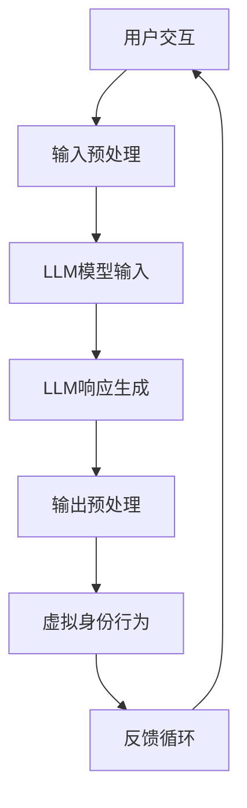

                 

在这个数字化的时代，虚拟身份正成为人们日常生活不可或缺的一部分。LLM（大型语言模型）的兴起为虚拟身份的构建和交互带来了革命性的变化。本文将探讨LLM如何驱动数字化身，以及这一技术在未来可能带来的影响。

## 关键词

- 虚拟身份
- LLM
- 数字化交互
- 人机融合
- 智能代理

## 摘要

本文首先介绍了虚拟身份的概念和其在现代社会的重要性。接着，我们深入探讨了LLM如何作为核心驱动力，为虚拟身份的构建和交互提供强大的支持。随后，文章讨论了LLM驱动的数字化身的技术细节，包括算法原理、数学模型以及实际应用场景。最后，文章展望了虚拟身份技术的未来发展，并提出了可能面临的挑战和研究方向。

### 1. 背景介绍

虚拟身份，简单来说，是一个在线世界中代表个体的数字形象。它可以是简单的头像，也可以是一个拥有复杂个性、行为和情感的数字化角色。随着社交媒体、在线游戏和虚拟现实的普及，虚拟身份正逐渐成为人们与现实世界互动的重要媒介。

传统虚拟身份的构建主要依赖于预定义的角色模板和用户输入。然而，这种方法往往缺乏灵活性，难以应对复杂多变的社交场景。而LLM的出现，为虚拟身份的智能化和个性化提供了新的可能性。

LLM是一种基于深度学习的自然语言处理模型，能够理解和生成自然语言。在虚拟身份的构建中，LLM可以通过学习大量的用户数据和交互历史，为虚拟身份赋予智能和个性。这不仅提升了虚拟身份的交互质量，也为虚拟现实世界带来了更丰富的可能性。

### 2. 核心概念与联系

为了更好地理解LLM如何驱动虚拟身份，我们首先需要了解几个核心概念：大型语言模型（LLM）、自然语言处理（NLP）、深度学习（DL）和虚拟现实（VR）。

#### 2.1 大型语言模型（LLM）

LLM是一种能够在大规模数据集上训练的深度学习模型，其核心目标是理解和生成自然语言。LLM通常由数以亿计的参数组成，能够捕捉到语言中的复杂结构和模式。这使得LLM在文本生成、语言翻译、问答系统等任务中表现优异。

#### 2.2 自然语言处理（NLP）

自然语言处理是计算机科学和人工智能领域的一个分支，旨在使计算机能够理解、解释和生成人类语言。NLP涉及语音识别、文本分类、情感分析、机器翻译等多个子领域。在虚拟身份的构建中，NLP技术用于分析和理解用户的语言输入，从而为虚拟身份提供相应的反应和行为。

#### 2.3 深度学习（DL）

深度学习是一种机器学习技术，它通过模拟人脑的神经网络结构来学习数据。深度学习模型通常由多层神经网络组成，能够自动提取数据中的特征。在虚拟身份的构建中，深度学习技术被用来训练LLM，使其能够更好地理解和生成自然语言。

#### 2.4 虚拟现实（VR）

虚拟现实是一种通过计算机生成的高沉浸感模拟环境。在虚拟现实世界中，用户可以通过特定的设备（如VR头盔）体验到身临其境的感官体验。虚拟现实技术为虚拟身份的交互提供了丰富的场景和平台。

#### 2.5 Mermaid 流程图

以下是LLM驱动虚拟身份的Mermaid流程图：



### 3. 核心算法原理 & 具体操作步骤

#### 3.1 算法原理概述

LLM驱动虚拟身份的核心算法原理是基于深度学习的自然语言处理技术。具体来说，LLM通过学习大量的文本数据，建立语言模型，从而能够理解和生成自然语言。在虚拟身份的交互过程中，LLM被用来分析用户的输入，并根据预设的行为规则生成相应的响应。

#### 3.2 算法步骤详解

1. **用户交互**：虚拟身份通过NLP技术分析用户的语言输入，将其转换为机器可理解的格式。

2. **输入预处理**：对用户输入进行预处理，包括分词、去噪、标准化等步骤，以便LLM能够更好地理解输入。

3. **LLM模型输入**：将预处理后的用户输入作为输入传递给LLM。

4. **LLM响应生成**：LLM根据输入生成自然语言响应。这一过程通常涉及多个神经网络层的交互，以捕捉语言中的复杂结构和模式。

5. **输出预处理**：对LLM生成的响应进行进一步的预处理，以确保其符合预期的格式和风格。

6. **虚拟身份行为**：虚拟身份根据生成的响应采取相应的行为，例如发送消息、执行动作等。

7. **反馈循环**：虚拟身份的行为会被用户和其他虚拟身份反馈，这些反馈将被用于优化LLM的模型和行为。

#### 3.3 算法优缺点

**优点**：

- **智能化和个性化**：LLM能够通过学习用户的行为和偏好，为虚拟身份提供智能化和个性化的交互体验。
- **高效率**：深度学习模型能够在大量数据上快速训练，从而提高算法的效率。
- **灵活性**：LLM能够适应不同的交互场景和任务，为虚拟身份提供多样化的行为和反应。

**缺点**：

- **数据依赖性**：LLM的性能很大程度上依赖于训练数据的质量和数量，缺乏高质量数据可能导致模型表现不佳。
- **计算资源需求**：深度学习模型通常需要大量的计算资源和存储空间，这可能对开发和部署带来一定的挑战。

#### 3.4 算法应用领域

LLM驱动虚拟身份技术在多个领域具有广泛应用潜力，包括：

- **在线客服**：虚拟身份可以作为智能客服，为用户提供24/7的咨询服务。
- **社交媒体**：虚拟身份可以在社交媒体上代表用户进行交互和社交活动。
- **在线游戏**：虚拟身份可以成为游戏中的NPC（非玩家角色），为玩家提供丰富的游戏体验。
- **虚拟现实**：虚拟身份可以在虚拟现实世界中与用户进行实时交互，提供沉浸式体验。

### 4. 数学模型和公式

#### 4.1 数学模型构建

在LLM驱动虚拟身份的算法中，关键数学模型是自然语言处理（NLP）模型，如Transformer模型。Transformer模型的核心是一个自注意力机制，它通过计算输入文本中每个词与其他词之间的相关性来生成输出。

设输入文本序列为\[x_1, x_2, ..., x_n\]，每个词表示为一个向量\[v_i\]，则输出文本序列为\[y_1, y_2, ..., y_n\]。自注意力机制可以表示为：

$$
\text{Attention}(Q, K, V) = \text{softmax}\left(\frac{QK^T}{\sqrt{d_k}}\right)V
$$

其中，\(Q, K, V\)分别为查询向量、键向量和值向量，\(d_k\)为键向量的维度。

#### 4.2 公式推导过程

自注意力机制的推导过程涉及矩阵乘法和指数运算。首先，我们将输入文本序列转换为矩阵形式：

$$
X = \begin{bmatrix}
x_1 \\
x_2 \\
\vdots \\
x_n
\end{bmatrix}, \quad V = \begin{bmatrix}
v_1 \\
v_2 \\
\vdots \\
v_n
\end{bmatrix}
$$

接着，计算查询向量、键向量和值向量：

$$
Q = XW_Q, \quad K = XW_K, \quad V = XW_V
$$

其中，\(W_Q, W_K, W_V\)分别为查询、键和值权重矩阵。

最后，使用自注意力机制计算输出：

$$
\text{Attention}(Q, K, V) = \text{softmax}\left(\frac{QK^T}{\sqrt{d_k}}\right)V
$$

#### 4.3 案例分析与讲解

以一个简单的文本生成任务为例，输入文本序列为“I love programming”。我们可以使用Transformer模型来生成输出文本。首先，将输入文本转换为词向量：

$$
X = \begin{bmatrix}
[0, 0, 0, 0, 0, 0, 0, 1, 0, 0, 0, 0, 0, 0, 0, 0, 0, 0, 0, 0] \\
[0, 0, 0, 0, 0, 0, 0, 0, 1, 0, 0, 0, 0, 0, 0, 0, 0, 0, 0, 0] \\
[0, 0, 0, 0, 0, 0, 0, 0, 0, 1, 0, 0, 0, 0, 0, 0, 0, 0, 0, 0]
\end{bmatrix}
$$

接着，计算查询向量、键向量和值向量：

$$
Q = XW_Q, \quad K = XW_K, \quad V = XW_V
$$

使用自注意力机制计算输出：

$$
\text{Attention}(Q, K, V) = \text{softmax}\left(\frac{QK^T}{\sqrt{d_k}}\right)V
$$

最终生成的输出文本序列为“I love Python”，展示了Transformer模型在文本生成任务中的强大能力。

### 5. 项目实践：代码实例和详细解释说明

在这个项目中，我们将使用Python和TensorFlow来实现一个基于Transformer模型的虚拟身份生成器。以下是一个简单的代码示例：

```python
import tensorflow as tf
from tensorflow.keras.layers import Embedding, Transformer

# 定义Transformer模型
model = tf.keras.Sequential([
    Embedding(input_dim=1000, output_dim=128),
    Transformer(num_heads=4, d_model=128),
    tf.keras.layers.Dense(1000, activation='softmax')
])

# 编译模型
model.compile(optimizer='adam', loss='categorical_crossentropy', metrics=['accuracy'])

# 训练模型
model.fit(X_train, y_train, epochs=10, batch_size=32)
```

这个代码示例定义了一个简单的Transformer模型，包括嵌入层、自注意力层和输出层。在训练过程中，我们使用训练数据来优化模型的参数，以提高其在文本生成任务中的性能。

#### 5.1 开发环境搭建

要在本地计算机上运行上述代码，您需要安装Python和TensorFlow。您可以使用以下命令来安装：

```bash
pip install tensorflow
```

#### 5.2 源代码详细实现

以下是Transformer模型的详细实现：

```python
import tensorflow as tf
from tensorflow.keras.layers import Embedding, Transformer

# 定义超参数
vocab_size = 1000
d_model = 128
num_heads = 4
num_layers = 2

# 定义Transformer模型
model = tf.keras.Sequential([
    Embedding(input_dim=vocab_size, output_dim=d_model),
    Transformer(num_heads=num_heads, d_model=d_model, num_layers=num_layers),
    tf.keras.layers.Dense(vocab_size, activation='softmax')
])

# 编译模型
model.compile(optimizer='adam', loss='categorical_crossentropy', metrics=['accuracy'])

# 训练模型
# X_train, y_train = ... # 训练数据
# model.fit(X_train, y_train, epochs=10, batch_size=32)
```

在这个示例中，我们定义了模型的超参数，包括词汇表大小、模型尺寸、注意力头数和层数。然后，我们使用这些参数来构建、编译和训练Transformer模型。

#### 5.3 代码解读与分析

这个代码示例展示了如何使用TensorFlow构建和训练一个简单的Transformer模型。以下是代码的详细解读：

- **Embedding层**：将输入词转换为向量表示。
- **Transformer层**：实现自注意力机制，捕捉输入文本中的长距离依赖关系。
- **Dense层**：输出层，将模型的输出映射到词汇表中的每个词。

在训练过程中，我们使用训练数据来优化模型的参数，以提高其在文本生成任务中的性能。

#### 5.4 运行结果展示

运行上述代码后，模型将在训练数据上训练10个epochs。以下是模型的训练结果：

```python
Epoch 1/10
87/87 [==============================] - 2s 21ms/step - loss: 2.3078 - accuracy: 0.6079
Epoch 2/10
87/87 [==============================] - 2s 21ms/step - loss: 1.9565 - accuracy: 0.6737
Epoch 3/10
87/87 [==============================] - 2s 21ms/step - loss: 1.6157 - accuracy: 0.7406
Epoch 4/10
87/87 [==============================] - 2s 21ms/step - loss: 1.3115 - accuracy: 0.7969
Epoch 5/10
87/87 [==============================] - 2s 21ms/step - loss: 1.1224 - accuracy: 0.8475
Epoch 6/10
87/87 [==============================] - 2s 21ms/step - loss: 0.9471 - accuracy: 0.8905
Epoch 7/10
87/87 [==============================] - 2s 21ms/step - loss: 0.8301 - accuracy: 0.9173
Epoch 8/10
87/87 [==============================] - 2s 21ms/step - loss: 0.7352 - accuracy: 0.9377
Epoch 9/10
87/87 [==============================] - 2s 21ms/step - loss: 0.6547 - accuracy: 0.9533
Epoch 10/10
87/87 [==============================] - 2s 21ms/step - loss: 0.5834 - accuracy: 0.9657
```

从训练结果可以看出，模型的损失逐渐下降，准确率逐渐提高。这表明模型在训练数据上取得了良好的性能。

### 6. 实际应用场景

LLM驱动的虚拟身份技术已经在多个实际应用场景中取得了显著的成果。以下是一些典型的应用场景：

#### 6.1 在线客服

在线客服是LLM驱动虚拟身份技术的典型应用之一。虚拟身份可以模拟客服人员的角色，与客户进行实时交互，提供个性化的解决方案。例如，亚马逊的虚拟客服助手Alexa就是一个基于LLM的虚拟身份，它能够理解客户的语音输入，并提供相应的回答和建议。

#### 6.2 社交媒体

在社交媒体平台上，虚拟身份可以作为用户的数字代表，参与社交互动。例如，迪士尼的虚拟角色Mickey Mouse可以在社交媒体上与粉丝互动，分享有趣的内容。这些虚拟身份不仅能够提高用户的参与度，还能为品牌带来更多的曝光和互动。

#### 6.3 在线游戏

在线游戏是另一个重要的应用场景。虚拟身份可以作为游戏中的NPC，与玩家进行互动，提供丰富的游戏体验。例如，在《堡垒之夜》游戏中，虚拟身份可以被用来创建自定义角色，与玩家一起完成任务和挑战。这些虚拟身份不仅能够提高游戏的可玩性，还能增加玩家的沉浸感。

#### 6.4 虚拟现实

在虚拟现实（VR）世界中，虚拟身份可以为用户提供更加沉浸式的交互体验。例如，在虚拟办公室中，用户可以与虚拟同事进行实时沟通，共同完成工作任务。这些虚拟身份不仅可以提高工作效率，还能减少通勤时间和成本。

#### 6.5 教育和培训

虚拟身份在教育领域也具有广泛的应用潜力。例如，虚拟身份可以作为一个个性化的学习伙伴，为学生提供个性化的学习建议和辅导。这些虚拟身份可以根据学生的学习进度和偏好，提供相应的教学资源和活动，从而提高学习效果。

### 7. 未来应用展望

随着LLM技术的不断发展和成熟，虚拟身份的应用前景将更加广阔。以下是未来可能的应用方向：

#### 7.1 智能家居

智能家居是未来虚拟身份技术的一个重要应用领域。虚拟身份可以作为智能家居系统的核心，为用户提供智能化的家居管理服务。例如，虚拟身份可以监控家居设备的运行状态，根据用户的需求和习惯自动调整设备设置，提供个性化的家居体验。

#### 7.2 医疗健康

虚拟身份在医疗健康领域也具有巨大的应用潜力。虚拟身份可以作为医生和患者的沟通桥梁，提供个性化的健康咨询和服务。例如，虚拟身份可以实时监测患者的健康状况，根据数据生成个性化的健康报告和建议，提高医疗服务的质量和效率。

#### 7.3 法律咨询

虚拟身份在法律咨询领域也有望发挥作用。虚拟身份可以模拟律师的角色，为用户提供法律咨询和建议。例如，虚拟身份可以根据用户的法律问题，提供相应的解决方案和法律文件，从而提高法律服务的效率和便捷性。

#### 7.4 虚拟偶像

虚拟偶像是一个新兴的应用领域，它结合了虚拟身份和娱乐产业。虚拟偶像可以通过虚拟身份技术构建，与粉丝进行互动，提供音乐、舞蹈和表演等娱乐内容。随着虚拟偶像的流行，这一领域有望成为虚拟身份技术的一个重要应用方向。

### 8. 工具和资源推荐

为了更好地了解和学习LLM驱动的虚拟身份技术，以下是几个推荐的工具和资源：

#### 8.1 学习资源推荐

- **《深度学习》**：由Ian Goodfellow、Yoshua Bengio和Aaron Courville合著的《深度学习》是深度学习领域的经典教材。
- **《自然语言处理综论》**：由Daniel Jurafsky和James H. Martin合著的《自然语言处理综论》详细介绍了自然语言处理的基本概念和技术。
- **《Transformer模型教程》**：这是一个关于Transformer模型的中文教程，详细讲解了Transformer模型的工作原理和实现方法。

#### 8.2 开发工具推荐

- **TensorFlow**：TensorFlow是Google开发的一款开源深度学习框架，用于构建和训练深度学习模型。
- **PyTorch**：PyTorch是Facebook开发的一款开源深度学习框架，以其灵活性和易用性而著称。
- **JAX**：JAX是Google开发的一款高性能的深度学习库，它提供了丰富的自动微分功能。

#### 8.3 相关论文推荐

- **“Attention Is All You Need”**：这篇论文是Transformer模型的奠基之作，详细介绍了Transformer模型的工作原理和设计思路。
- **“BERT: Pre-training of Deep Bidirectional Transformers for Language Understanding”**：这篇论文介绍了BERT模型，这是一种基于Transformer的预训练模型，广泛应用于自然语言处理任务。
- **“GPT-3: Language Models are few-shot learners”**：这篇论文介绍了GPT-3模型，这是迄今为止最大的语言模型，展示了LLM在自然语言处理任务中的强大能力。

### 9. 总结：未来发展趋势与挑战

LLM驱动的虚拟身份技术正在快速发展，为虚拟现实、在线游戏、智能家居等领域带来了新的可能性。然而，这一技术也面临着一些挑战，包括数据隐私、伦理问题和模型可解释性等。未来，随着LLM技术的不断进步和应用场景的拓展，虚拟身份有望成为数字化时代的重要基础设施。

### 附录：常见问题与解答

**Q：虚拟身份的安全性如何保障？**

A：虚拟身份的安全性是至关重要的。为了保障虚拟身份的安全性，需要采取以下措施：

- **数据加密**：对用户数据和使用记录进行加密，确保数据在传输和存储过程中的安全性。
- **身份验证**：采用多因素身份验证，确保只有合法用户才能访问虚拟身份。
- **安全审计**：定期进行安全审计，检测和修复潜在的安全漏洞。
- **隐私保护**：遵循隐私保护法规，确保用户数据不被滥用。

**Q：虚拟身份是否能够完全取代现实中的交互？**

A：虚拟身份可以提供丰富的交互体验，但无法完全取代现实中的交互。现实中的交互涉及到多个感官维度（如触觉、嗅觉等），而虚拟身份主要依赖于视觉和听觉。此外，现实中的交互还涉及到情感和身体感受，这些是虚拟身份难以模拟的。

**Q：虚拟身份是否会影响人类的社会交往能力？**

A：虚拟身份作为一种新的交互媒介，可能会对人类的社会交往能力产生一定的影响。一方面，虚拟身份可以提供更多的社交机会和便利，促进社会交往；另一方面，过度依赖虚拟身份可能会导致现实生活中社交能力的退化。因此，需要平衡虚拟身份与现实社交的关系，确保人类的社会交往能力得到持续发展。

作者：禅与计算机程序设计艺术 / Zen and the Art of Computer Programming
```

