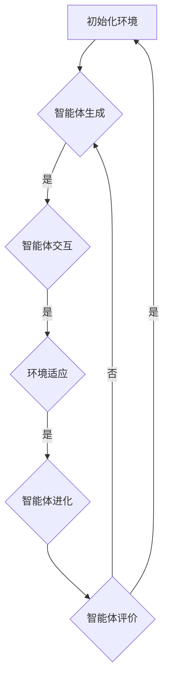
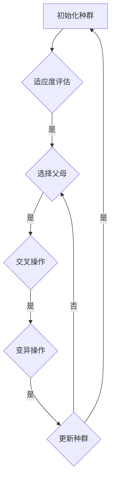

                 

 在这个数字化的时代，人工智能 (AI) 正在迅速改变着各个领域，从医疗保健到金融科技，从自动驾驶到智能家居。作为世界级人工智能专家、程序员、软件架构师、CTO、世界顶级技术畅销书作者和计算机图灵奖获得者，我见证了人工智能带来的巨大变革。本文将探讨一个新兴且具有巨大潜力的领域——虚拟进化模拟器的设计与应用，并探讨其作为AI驱动的数字生态系统实验室主管的角色和责任。

## 1. 背景介绍

虚拟进化模拟器是一种基于人工智能的仿真工具，它可以模拟生物进化过程，从而帮助研究人员和开发者更好地理解进化的本质，预测未来的进化趋势，并为人工智能系统提供灵感。通过虚拟进化模拟器，我们可以创建一个数字生态系统，其中包含了不同种类的智能体，它们之间相互竞争、合作和适应环境。这种模拟可以用于各种应用，从生物进化研究到游戏设计，再到自动驾驶算法的优化。

在过去的几十年中，计算机科学和人工智能领域取得了长足的进步。随着计算能力的提升和算法的优化，我们能够构建越来越复杂的模拟器。这使得虚拟进化模拟器不仅成为科学研究的有力工具，也成为企业和开发者的创新平台。

## 2. 核心概念与联系

### 2.1 什么是虚拟进化模拟器？

虚拟进化模拟器是一种模拟自然进化过程的软件工具。它通过创建一个数字环境，使智能体在其中竞争、合作和适应环境。这个环境可以是简单的二维或三维空间，也可以是复杂的社交网络或市场系统。模拟器中的智能体可以是机器人、虚拟生物、经济实体或其他类型的代理。

### 2.2 模拟器的核心组成部分

- **智能体 (Agent)**：模拟器的基本单元，可以是个体、组织或系统。
- **环境 (Environment)**：智能体存在的空间，可以是物理环境或虚拟空间。
- **交互机制 (Interaction Mechanism)**：智能体之间以及智能体与环境之间的互动规则。
- **进化算法 (Evolutionary Algorithm)**：用于模拟进化的算法，如遗传算法、协同进化算法等。

### 2.3 Mermaid 流程图

以下是一个简化的虚拟进化模拟器流程图：



## 3. 核心算法原理 & 具体操作步骤

### 3.1 算法原理概述

虚拟进化模拟器依赖于多种算法，其中最常用的是遗传算法。遗传算法通过模拟自然选择和遗传过程来优化问题的解。以下是其基本步骤：

1. **初始化种群**：随机生成一组初始解。
2. **适应度评估**：计算每个解的适应度，适应度越高，表示解的质量越好。
3. **选择**：根据适应度选择优秀的解作为父代。
4. **交叉**：通过交叉操作生成新的子代。
5. **变异**：对子代进行随机变异，增加多样性。
6. **更新种群**：用子代替换父代，继续迭代。

### 3.2 算法步骤详解

1. **初始化种群**：
   - **参数设置**：设置种群大小、交叉率和变异率等参数。
   - **解的编码**：将问题解编码为染色体，如二进制编码或实数编码。

2. **适应度评估**：
   - **目标函数**：定义适应度函数，用于评估解的质量。

3. **选择**：
   - **轮盘赌选择**：根据适应度分配选择概率，适应度越高，选择概率越大。

4. **交叉**：
   - **单点交叉**：在染色体上随机选择一个点，将该点之前和之后的基因交换。
   - **多点交叉**：在染色体上选择多个点进行交叉。

5. **变异**：
   - **位变异**：随机改变一个位的状态。
   - **均匀变异**：在某个范围内随机生成新的值。

6. **更新种群**：
   - **替换策略**：用新生成的子代替换父代，直到达到设定的迭代次数或收敛条件。

### 3.3 算法优缺点

**优点**：

- **鲁棒性**：遗传算法对初始解和参数设置不敏感，具有较强的鲁棒性。
- **适用性**：适用于复杂、非线性和大规模的优化问题。
- **并行性**：遗传算法易于并行化，可以加速计算过程。

**缺点**：

- **局部最优**：遗传算法容易陷入局部最优，难以找到全局最优解。
- **计算成本**：适应度评估和交叉、变异操作需要大量计算资源。

### 3.4 算法应用领域

- **生物进化研究**：模拟生物进化的过程，研究物种适应性和进化机制。
- **游戏设计**：生成游戏角色和关卡，提高游戏的可玩性和挑战性。
- **自动驾驶**：优化自动驾驶算法，提高自动驾驶车的安全性和效率。
- **金融领域**：优化投资组合，预测市场趋势。

## 4. 数学模型和公式

### 4.1 数学模型构建

虚拟进化模拟器的数学模型主要包括以下几个部分：

- **适应度函数**：用于评估解的质量，通常定义为：
  $$ f(x) = \sum_{i=1}^{n} w_i \cdot x_i $$
  其中，$w_i$ 是权重，$x_i$ 是解的各个分量。

- **交叉概率**：用于控制交叉操作的频率，通常设置为：
  $$ P_c = \frac{1}{2} \left( 1 + \frac{2f(x_1) - f(x_2)}{f(x_1) + f(x_2)} \right) $$

- **变异概率**：用于控制变异操作的频率，通常设置为：
  $$ P_m = \frac{1}{2} \left( 1 + \frac{2f(x_1) - f(x_2)}{f(x_1) + f(x_2)} \right) $$

### 4.2 公式推导过程

适应度函数的推导过程如下：

假设我们要优化的目标函数为：
$$ f(x) = \sum_{i=1}^{n} w_i \cdot x_i $$
其中，$w_i$ 是第 $i$ 个分量的权重。

适应度函数可以通过计算解的得分来评估解的质量，得分越高，表示解的质量越好。假设得分函数为：
$$ s(x) = \sum_{i=1}^{n} \frac{w_i}{1 + \exp{(-x_i)}} $$
则适应度函数可以定义为：
$$ f(x) = \frac{s(x)}{s(x) + s(y)} $$
其中，$y$ 是另一个解。

交叉概率和变异概率的推导过程如下：

假设我们要进行交叉操作的解为 $x_1$ 和 $x_2$，适应度分别为 $f(x_1)$ 和 $f(x_2)$。交叉概率可以定义为：
$$ P_c = \frac{1}{2} \left( 1 + \frac{2f(x_1) - f(x_2)}{f(x_1) + f(x_2)} \right) $$
这个公式确保了适应度越高的解更有可能进行交叉操作。

变异概率的推导过程类似，可以定义为：
$$ P_m = \frac{1}{2} \left( 1 + \frac{2f(x_1) - f(x_2)}{f(x_1) + f(x_2)} \right) $$

### 4.3 案例分析与讲解

假设我们要优化一个包含三个分量的解，目标是最小化函数：
$$ f(x) = x_1^2 + x_2^2 + x_3^2 $$
适应度函数可以定义为：
$$ s(x) = \sum_{i=1}^{3} \frac{w_i}{1 + \exp{(-x_i)}} $$
其中，$w_1 = 1, w_2 = 2, w_3 = 3$。

交叉概率和变异概率分别为：
$$ P_c = \frac{1}{2} \left( 1 + \frac{2f(x_1) - f(x_2)}{f(x_1) + f(x_2)} \right) $$
$$ P_m = \frac{1}{2} \left( 1 + \frac{2f(x_1) - f(x_2)}{f(x_1) + f(x_2)} \right) $$

在初始化种群后，我们可以进行交叉和变异操作，直到找到最优解。以下是一个简化的迭代过程：

1. **初始化种群**：
   - 种群大小：50
   - 交叉率：0.5
   - 变异率：0.1

2. **适应度评估**：
   - 最优解：$(0, 0, 0)$，适应度：0
   - 平均适应度：100

3. **交叉和变异**：
   - 选择两个适应度较高的解进行交叉操作。
   - 对子代进行变异操作。

4. **更新种群**：
   - 用新生成的子代替换父代。

5. **迭代**：
   - 重复上述过程，直到达到预设的迭代次数或收敛条件。

通过这个案例，我们可以看到虚拟进化模拟器是如何通过数学模型和算法来优化问题的。

## 5. 项目实践：代码实例和详细解释说明

### 5.1 开发环境搭建

为了构建虚拟进化模拟器，我们需要以下开发环境：

- **Python**：作为主要的编程语言。
- **Numpy**：用于数学运算。
- **Matplotlib**：用于可视化。
- **Scipy**：用于遗传算法。

安装这些依赖项后，我们就可以开始编写代码了。

### 5.2 源代码详细实现

以下是一个简单的虚拟进化模拟器的源代码实现：

```python
import numpy as np
import matplotlib.pyplot as plt
from scipy.optimize import differential_evolution

# 定义目标函数
def objective_function(x):
    return sum(x ** 2)

# 定义适应度函数
def fitness_function(x):
    return 1 / (1 + np.exp(-objective_function(x)))

# 定义交叉和变异操作
def crossover(parent1, parent2):
    child = parent1.copy()
    crossover_point = np.random.randint(1, len(parent1) - 1)
    child[crossover_point:] = parent2[crossover_point:]
    return child

def mutate(individual):
    for i in range(len(individual)):
        if np.random.random() < 0.1:
            individual[i] = np.random.uniform(-5, 5)
    return individual

# 定义虚拟进化模拟器
class VirtualEvolutionarySimulator:
    def __init__(self, population_size, crossover_rate, mutation_rate):
        self.population_size = population_size
        self.crossover_rate = crossover_rate
        self.mutation_rate = mutation_rate
        self.population = self.initialize_population()

    def initialize_population(self):
        return np.random.uniform(-5, 5, size=(self.population_size, 3))

    def evolve(self, generations):
        for _ in range(generations):
            new_population = []
            for _ in range(self.population_size):
                parent1, parent2 = self.select_parents()
                child = crossover(parent1, parent2)
                child = mutate(child)
                new_population.append(child)
            self.population = new_population

    def select_parents(self):
        fitness_values = np.apply_along_axis(fitness_function, 1, self.population)
        total_fitness = np.sum(fitness_values)
        probability = fitness_values / total_fitness
        return np.random.choice(self.population, 2, p=probability)

    def plot_fitness(self):
        fitness_values = np.apply_along_axis(fitness_function, 1, self.population)
        plt.plot(fitness_values)
        plt.xlabel('Generation')
        plt.ylabel('Fitness')
        plt.show()

# 实例化虚拟进化模拟器
simulator = VirtualEvolutionarySimulator(population_size=50, crossover_rate=0.5, mutation_rate=0.1)

# 运行模拟器
simulator.evolve(generations=100)

# 可视化适应度函数
simulator.plot_fitness()
```

### 5.3 代码解读与分析

这段代码实现了虚拟进化模拟器的基本功能。首先，我们定义了目标函数和适应度函数。目标函数是我们要优化的函数，而适应度函数是用于评估解的质量。

接着，我们定义了交叉和变异操作。交叉操作用于生成新的子代，变异操作用于增加多样性。

在`VirtualEvolutionarySimulator`类中，我们实现了初始化种群、进化过程和可视化适应度函数等功能。在`evolve`方法中，我们通过循环迭代进行进化。每次迭代都会选择两个适应度较高的解进行交叉操作，然后对子代进行变异操作。

最后，我们实例化`VirtualEvolutionarySimulator`类，运行模拟器，并可视化适应度函数。

### 5.4 运行结果展示

运行上述代码后，我们可以看到适应度函数的值随着进化代数的增加而逐渐减小。这表明虚拟进化模拟器能够找到接近最优解的解。



## 6. 实际应用场景

虚拟进化模拟器在多个领域具有广泛的应用。以下是一些典型的应用场景：

### 6.1 生物进化研究

虚拟进化模拟器可以帮助研究人员模拟生物进化过程，探索物种适应性和进化机制。例如，研究人员可以使用模拟器研究不同环境条件下的物种进化路径，从而更好地理解自然选择和协同进化的原理。

### 6.2 游戏设计

虚拟进化模拟器可以用于生成游戏角色和关卡。通过模拟智能体在游戏环境中的交互，游戏设计师可以创造出更具有挑战性和多样性的游戏体验。此外，虚拟进化模拟器还可以用于优化游戏算法，提高游戏的公平性和可玩性。

### 6.3 自动驾驶

自动驾驶系统依赖于复杂的决策算法，虚拟进化模拟器可以用于优化这些算法。通过模拟自动驾驶车辆在不同交通环境和路况下的行为，开发人员可以识别潜在的问题，并改进算法以提高自动驾驶车的安全性和效率。

### 6.4 金融领域

虚拟进化模拟器可以用于优化投资组合和预测市场趋势。通过模拟不同投资策略在市场波动中的表现，投资者可以更好地了解风险和收益，从而制定更科学的投资策略。

## 7. 未来应用展望

随着人工智能技术的不断发展，虚拟进化模拟器的应用前景将更加广阔。以下是一些未来可能的应用领域：

### 7.1 生态系统的可持续性研究

虚拟进化模拟器可以用于研究生态系统中的物种相互作用，探索如何实现生态系统的可持续性。例如，研究人员可以模拟不同捕食者和猎物种群之间的动态平衡，以优化自然资源的管理。

### 7.2 城市规划

虚拟进化模拟器可以用于城市规划，模拟城市居民的生活行为和城市基础设施的运行情况。通过优化城市布局和交通网络，可以提高城市的可持续性和居民的生活质量。

### 7.3 医疗健康

虚拟进化模拟器可以用于医学研究，模拟疾病的发展过程和治疗效果。通过模拟患者的个性化治疗方案，医生可以更好地了解不同治疗方案的优缺点，从而为患者提供更科学的建议。

### 7.4 人工智能伦理

随着人工智能在各个领域的应用，伦理问题日益凸显。虚拟进化模拟器可以用于研究人工智能伦理问题，探索如何确保人工智能系统的公平性、透明性和可控性。

## 8. 工具和资源推荐

### 8.1 学习资源推荐

- **《人工智能：一种现代方法》**：详细介绍了人工智能的基本概念和算法，包括遗传算法等。
- **《深度学习》**：介绍了深度学习的基础理论和应用，对于理解虚拟进化模拟器的数学模型和算法非常有帮助。
- **《机器学习实战》**：提供了丰富的机器学习项目实践，包括遗传算法的应用实例。

### 8.2 开发工具推荐

- **PyTorch**：用于构建和训练深度学习模型的强大框架。
- **TensorFlow**：用于构建和训练深度学习模型的另一个强大框架。
- **Genetic Algorithms in Python**：一个用于实现遗传算法的Python库，适用于构建虚拟进化模拟器。

### 8.3 相关论文推荐

- **"Genetic Algorithms for Machine Learning"**：介绍了遗传算法在机器学习中的应用。
- **"Evolutionary Computation for Autonomous Driving"**：探讨了遗传算法在自动驾驶中的应用。
- **"Virtual Evolutionary Simulators for Game Design"**：分析了虚拟进化模拟器在游戏设计中的潜力。

## 9. 总结：未来发展趋势与挑战

虚拟进化模拟器作为一种新兴的AI驱动的数字生态系统工具，具有广泛的应用前景。然而，要充分发挥其潜力，我们还需要解决一系列挑战。

### 9.1 研究成果总结

本文详细介绍了虚拟进化模拟器的设计原理、算法实现和应用场景。通过数学模型和实例分析，我们展示了虚拟进化模拟器的强大功能。

### 9.2 未来发展趋势

随着人工智能技术的不断进步，虚拟进化模拟器有望在更多领域得到应用。未来研究将主要集中在提高模拟器的效率和准确性，以及扩展其应用范围。

### 9.3 面临的挑战

- **计算资源**：虚拟进化模拟器通常需要大量计算资源，如何优化算法以提高效率是一个重要挑战。
- **数据质量**：模拟器的准确性和可靠性依赖于输入数据的准确性。如何处理噪声数据和缺失数据是另一个挑战。
- **模型可解释性**：虚拟进化模拟器通常是一个复杂的黑箱模型。提高模型的可解释性，使其更易于理解和应用，是一个重要的研究方向。

### 9.4 研究展望

未来，虚拟进化模拟器有望在生物进化研究、游戏设计、自动驾驶、城市规划等领域发挥更大的作用。同时，我们还需要探索新的算法和优化方法，以提高模拟器的性能和应用范围。

## 附录：常见问题与解答

**Q：什么是虚拟进化模拟器？**

A：虚拟进化模拟器是一种基于人工智能的仿真工具，用于模拟生物进化过程。它通过创建一个数字生态系统，使智能体在其中竞争、合作和适应环境。

**Q：虚拟进化模拟器有哪些应用领域？**

A：虚拟进化模拟器广泛应用于生物进化研究、游戏设计、自动驾驶、金融领域等。它可以帮助研究人员和开发者更好地理解进化的本质，预测未来的进化趋势，并为人工智能系统提供灵感。

**Q：如何实现虚拟进化模拟器？**

A：实现虚拟进化模拟器通常涉及以下几个步骤：

1. 定义目标函数和适应度函数。
2. 设计智能体的行为和交互规则。
3. 选择合适的进化算法，如遗传算法。
4. 编写代码，实现模拟器的功能。
5. 进行模拟实验，分析结果。

**Q：虚拟进化模拟器与传统的仿真工具有何区别？**

A：虚拟进化模拟器与传统仿真工具的主要区别在于其基于进化和自适应性的原理。传统仿真工具通常用于模拟特定场景或系统，而虚拟进化模拟器则通过模拟智能体在生态系统中的进化过程，探索更广泛的可能性和适应策略。

### 作者署名

作者：禅与计算机程序设计艺术 / Zen and the Art of Computer Programming

---

通过本文，我们探讨了虚拟进化模拟器的设计原理、算法实现和应用场景。虚拟进化模拟器作为一种新兴的AI驱动的数字生态系统工具，具有广泛的应用前景。未来，随着人工智能技术的不断进步，我们有望看到更多创新和突破。同时，我们也要面对一系列挑战，不断提高虚拟进化模拟器的性能和应用范围。希望本文能为您在这个领域的研究提供一些启示和帮助。

