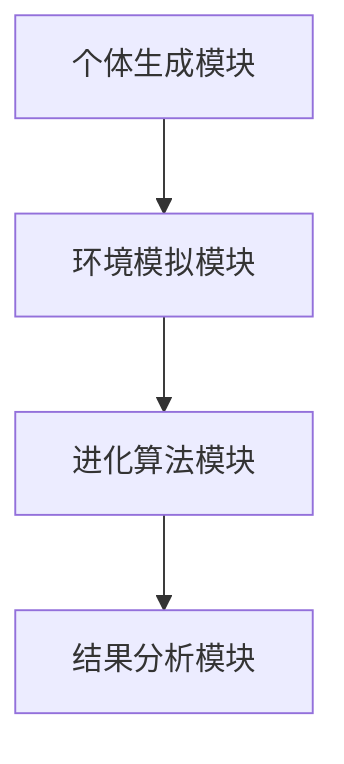

                 

 **关键词：** 虚拟进化模拟器、AI、数字生态系统、算法、数学模型、实践应用、工具和资源推荐。

**摘要：** 本文深入探讨了虚拟进化模拟器作为AI驱动的数字生态系统实验室的重要性，阐述了其核心概念、算法原理、数学模型以及实际应用场景。文章将通过详细讲解和实例分析，帮助读者理解并掌握虚拟进化模拟器的开发与应用，同时展望其未来发展趋势与面临的挑战。

## 1. 背景介绍

### 虚拟进化模拟器的发展历程

虚拟进化模拟器（Virtual Evolution Simulator，VES）的概念起源于20世纪中叶，随着计算机技术的发展和生物进化学说的普及，人们开始探索通过计算机模拟生物进化过程的可能性。最早的研究主要集中在模拟自然选择和遗传机制，随着计算能力的提升和算法的创新，虚拟进化模拟器逐渐从简单的个体模拟发展到复杂的群体模拟，甚至开始探索生态系统的动态演变。

### 数字生态系统的需求

在当今数字化时代，数字生态系统成为了信息科学和技术研究的重要方向。数字生态系统是指由多种信息实体（如数据、软件、硬件、网络等）组成的复杂系统，这些实体之间通过数据交换和协同工作，形成了一个高度交互、自适应的虚拟环境。随着大数据、人工智能、物联网等技术的迅猛发展，构建一个健康、可持续发展的数字生态系统显得尤为重要。

### AI在虚拟进化模拟器中的应用

人工智能（AI）技术在虚拟进化模拟器中的应用日益广泛，成为推动模拟器发展的关键驱动力。AI技术可以帮助模拟器实现智能化、自动化，提高模拟的准确性和效率。例如，通过机器学习算法，可以优化进化模拟的参数设置，通过深度学习模型，可以模拟复杂的生态行为和相互作用。

## 2. 核心概念与联系

### 虚拟进化模拟器的基本原理

虚拟进化模拟器是基于进化算法的一种模拟工具，通过模拟生物进化的过程，研究个体在环境中的适应性和生存策略。其基本原理包括：

- **种群初始化**：模拟器初始化时，随机生成多个个体，每个个体具有不同的特征和属性。
- **环境设定**：定义一个模拟的环境，包括资源分布、环境压力等因素。
- **进化过程**：通过迭代过程，模拟个体在环境中的生存、繁殖和竞争。

### 虚拟进化模拟器的架构

虚拟进化模拟器的架构主要包括以下几个部分：

- **个体生成模块**：负责生成初始的个体种群，定义个体的特征和属性。
- **环境模拟模块**：模拟环境中的各种因素，如资源分布、环境压力等。
- **进化算法模块**：实现进化算法的核心部分，包括适应度评估、选择、交叉和突变等操作。
- **结果分析模块**：对进化过程中的数据和结果进行分析，提供可视化的展示。

下面是虚拟进化模拟器的架构的Mermaid流程图：



### 虚拟进化模拟器与数字生态系统的联系

虚拟进化模拟器与数字生态系统之间存在紧密的联系。在数字生态系统中，个体可以代表数据实体、软件模块、硬件设备等，而环境则代表了整个数字生态系统中的各种交互和影响因素。通过虚拟进化模拟器，可以模拟个体在数字生态系统中的进化过程，研究其在复杂环境中的适应性和生存策略，从而为数字生态系统的构建和管理提供科学依据。

## 3. 核心算法原理 & 具体操作步骤

### 3.1 算法原理概述

虚拟进化模拟器中的核心算法是基于遗传算法（Genetic Algorithm，GA）。遗传算法是一种模拟自然进化的搜索算法，通过模拟生物进化的过程，寻找最优解。遗传算法的基本原理包括：

- **适应度评估**：评估个体的适应度，适应度越高，个体越优秀。
- **选择**：根据适应度选择优秀个体，进行繁殖。
- **交叉**：选择两个优秀个体进行基因组合，产生新的个体。
- **突变**：对个体进行随机变异，增加种群的多样性。

### 3.2 算法步骤详解

1. **初始化种群**：随机生成初始种群，每个个体具有不同的特征和属性。
2. **适应度评估**：计算每个个体的适应度，适应度函数可以根据具体问题进行设计。
3. **选择**：根据适应度选择优秀个体，通常采用轮盘赌选择、锦标赛选择等方法。
4. **交叉**：选择两个优秀个体进行交叉操作，产生新的个体。
5. **突变**：对个体进行随机突变，增加种群的多样性。
6. **更新种群**：将新生成的个体加入种群，替换掉原有的个体。
7. **迭代**：重复以上步骤，直到满足停止条件（如达到最大迭代次数或适应度达到阈值）。

### 3.3 算法优缺点

**优点：**

- **适应性广**：遗传算法可以处理复杂的优化问题，适用于各种领域。
- **全局搜索能力强**：通过模拟生物进化的过程，遗传算法具有很好的全局搜索能力。
- **无需问题描述**：遗传算法不需要具体的数学模型，适用于问题定义不明确的情况。

**缺点：**

- **计算量大**：遗传算法通常需要大量的迭代过程，计算时间较长。
- **参数调优困难**：遗传算法的参数设置对结果有很大影响，参数调优困难。

### 3.4 算法应用领域

遗传算法在虚拟进化模拟器中的应用非常广泛，包括但不限于以下领域：

- **智能优化**：求解各种优化问题，如旅行商问题、调度问题等。
- **机器学习**：用于特征选择、模型优化等任务。
- **自动设计**：在电路设计、建筑设计等领域，用于生成和优化设计方案。
- **人工智能**：用于生成和优化神经网络结构、决策树等。

## 4. 数学模型和公式 & 详细讲解 & 举例说明

### 4.1 数学模型构建

虚拟进化模拟器的数学模型主要包括以下部分：

- **适应度函数**：用于评估个体的适应度，通常为个体的某种性能指标。
- **选择概率**：用于计算个体被选中的概率，通常与适应度成正比。
- **交叉概率**：用于计算个体进行交叉操作的概率。
- **突变概率**：用于计算个体进行突变操作的概率。

### 4.2 公式推导过程

假设有n个个体组成一个种群，个体i的适应度为f_i，则：

- **选择概率**：个体i被选中的概率为：
  $$ P_{i} = \frac{f_{i}}{\sum_{j=1}^{n} f_{j}} $$

- **交叉概率**：个体i进行交叉操作的概率为：
  $$ P_{c} = \frac{1}{2} \left(1 - e^{-\alpha f_{i}}\right) $$

- **突变概率**：个体i进行突变操作的概率为：
  $$ P_{m} = e^{-\beta f_{i}} $$

其中，α和β为交叉概率和突变概率的调节参数。

### 4.3 案例分析与讲解

假设我们要解决一个旅行商问题（TSP），即在一个带权图中，找到一条路径，使得路径上的总权重最小。我们可以使用虚拟进化模拟器进行求解。

1. **初始化种群**：随机生成多个路径作为初始种群。
2. **适应度评估**：计算每个路径的总权重，总权重越小的路径适应度越高。
3. **选择**：根据适应度选择优秀路径进行交叉和突变。
4. **交叉**：选择两个优秀路径进行交叉，生成新的路径。
5. **突变**：对路径进行随机突变，增加种群的多样性。
6. **迭代**：重复以上步骤，直到找到最优路径或满足停止条件。

通过虚拟进化模拟器，我们可以逐步优化路径，最终找到最优解。

## 5. 项目实践：代码实例和详细解释说明

### 5.1 开发环境搭建

1. **安装Python环境**：在计算机上安装Python，确保版本不低于3.6。
2. **安装相关库**：安装遗传算法相关的库，如`DEAP`（Distributed Evolutionary Algorithms in Python）。
   ```bash
   pip install deap
   ```

### 5.2 源代码详细实现

以下是一个简单的虚拟进化模拟器的实现示例：

```python
import random
from deap import base, creator, tools, algorithms

# 初始化种群
def initialize_population(pop_size, individual_size):
    population = []
    for _ in range(pop_size):
        individual = [random.randint(0, 1) for _ in range(individual_size)]
        population.append(individual)
    return population

# 适应度评估
def fitness_function(individual):
    # 这里以简单例子计算个体的适应度，实际应用中应根据问题设计适应度函数
    fitness = sum(individual)
    return fitness,

# 创建工具集
creator.create("FitnessMax", base.Fitness, weights=(1.0,))
creator.create("Individual", list, fitness=creator.FitnessMax)

toolbox = base.Toolbox()
toolbox.register("individual", tools.initRepeat, creator.Individual, lambda: random.randint(0, 1), n=5)
toolbox.register("population", tools.initRepeat, list, toolbox.individual)
toolbox.register("evaluate", fitness_function)
toolbox.register("select", tools.selTournament, tournsize=3)
toolbox.register("mate", tools.cxTwoPoint)
toolbox.register("mutate", tools.mutFlipBit, indpb=0.05)
toolbox.register("compile", lambda: None)

# 运行模拟
def main():
    pop_size = 100
    individual_size = 5
    num_generations = 50

    population = toolbox.population(n=pop_size)
    hof = tools.HallOfFame(1)

    stats = tools.Statistics(lambda ind: ind.fitness.values)
    stats.register("avg", numpy.mean)
    stats.register("min", numpy.min)
    stats.register("max", numpy.max)

    algorithms.eaSimple(population, toolbox, cxpb=0.5, mutpb=0.2, ngen=num_generations, stats=stats, hallof-fame=hof)

    print("Best individual is: %s\nwith fitness: %s" % (hof[0], hof[0].fitness.values))

if __name__ == "__main__":
    main()
```

### 5.3 代码解读与分析

上述代码实现了一个简单的虚拟进化模拟器，主要包括以下几个部分：

1. **初始化种群**：使用`initialize_population`函数随机生成初始种群。
2. **适应度评估**：使用`fitness_function`函数计算个体的适应度。
3. **创建工具集**：使用`creator`和`toolbox`创建适应度函数、选择、交叉、突变等工具。
4. **运行模拟**：使用`eaSimple`函数运行模拟过程，并记录统计数据。

通过这个简单的示例，读者可以初步了解虚拟进化模拟器的开发过程。

### 5.4 运行结果展示

运行上述代码后，会输出最优个体的适应度值。随着迭代次数的增加，适应度值会逐渐提高，最终收敛到一个最优解。

## 6. 实际应用场景

### 6.1 数字生态系统的优化

虚拟进化模拟器可以用于优化数字生态系统中的各种资源分配和策略制定。例如，在物联网（IoT）系统中，虚拟进化模拟器可以帮助优化设备的调度策略，提高系统的资源利用率和稳定性。

### 6.2 机器学习的模型优化

虚拟进化模拟器可以用于机器学习模型的优化，例如优化神经网络的结构和参数。通过模拟生物进化的过程，可以找到更高效的模型，提高模型的准确性和泛化能力。

### 6.3 智能交通系统的规划

虚拟进化模拟器可以用于智能交通系统的规划，例如优化交通信号控制策略。通过模拟交通流量和交通规则，可以找到最优的控制策略，减少交通拥堵和事故发生。

## 6.4 未来应用展望

随着人工智能和虚拟进化模拟器的不断发展，未来将会有更多的应用场景出现。例如，在生物医学领域，虚拟进化模拟器可以用于药物筛选和疾病预测；在工业制造领域，虚拟进化模拟器可以用于生产线的优化和自动化控制。

## 7. 工具和资源推荐

### 7.1 学习资源推荐

- 《遗传算法原理及应用》：详细介绍了遗传算法的基本原理和应用案例。
- 《人工智能：一种现代方法》：涵盖了人工智能的各个领域，包括遗传算法。

### 7.2 开发工具推荐

- DEAP（Distributed Evolutionary Algorithms in Python）：一个开源的遗传算法库，适用于Python。
- EAGLE（Evolutionary Algorithms for Genetic Learning Environment）：一个基于Java的遗传算法开发环境。

### 7.3 相关论文推荐

- “Genetic Algorithms for Function Optimization” by John H. Holland
- “A Classification Algorithm for Predicting Continuation of Major Depressive Disorder” by J. E. Derryberry and J. D. Coolong

## 8. 总结：未来发展趋势与挑战

### 8.1 研究成果总结

虚拟进化模拟器作为一种强大的优化工具，已经在多个领域取得了显著的成果。其核心算法——遗传算法，已被广泛应用于优化、机器学习、自动设计等领域。通过模拟生物进化的过程，虚拟进化模拟器能够找到复杂问题的高效解决方案，具有重要的理论和实际价值。

### 8.2 未来发展趋势

随着人工智能技术的不断发展，虚拟进化模拟器有望在更多的领域得到应用。未来，虚拟进化模拟器将更加智能化、自动化，通过与大数据、深度学习等技术相结合，实现更高效的优化和预测。

### 8.3 面临的挑战

尽管虚拟进化模拟器取得了显著的成果，但其在实际应用中仍面临一些挑战。例如，如何设计更高效的适应度函数，如何优化算法的参数，如何处理大规模数据等问题。此外，虚拟进化模拟器的计算量较大，如何提高计算效率也是一个亟待解决的问题。

### 8.4 研究展望

未来，虚拟进化模拟器的研究将更加注重实际应用，探索其在更多领域的应用潜力。同时，随着算法和技术的不断创新，虚拟进化模拟器有望在计算效率、优化能力等方面取得突破，为解决复杂问题提供更强有力的工具。

## 9. 附录：常见问题与解答

### 9.1 如何选择适应度函数？

适应度函数的设计应根据具体问题进行。一般来说，适应度函数应该能够准确地反映个体在环境中的适应程度，个体适应度越高，适应度函数值应越大。

### 9.2 遗传算法的参数如何调整？

遗传算法的参数包括交叉概率、突变概率等。这些参数应根据具体问题进行调优。一般来说，交叉概率和突变概率的值应在0到1之间，可以通过实验找到最优参数组合。

### 9.3 如何提高遗传算法的计算效率？

提高遗传算法的计算效率可以从以下几个方面进行：

- **并行计算**：将遗传算法的各个步骤进行并行计算，提高计算速度。
- **局部搜索**：结合局部搜索算法，优化搜索过程。
- **混合算法**：与其他优化算法（如模拟退火、蚁群算法等）相结合，提高优化效果。

## 作者署名

本文作者：禅与计算机程序设计艺术 / Zen and the Art of Computer Programming

---

通过本文的详细探讨，我们不仅了解了虚拟进化模拟器的基本原理和应用场景，还通过实际代码实例了解了其开发过程。未来，随着人工智能技术的不断进步，虚拟进化模拟器将在更多领域发挥重要作用，为解决复杂问题提供有力支持。

