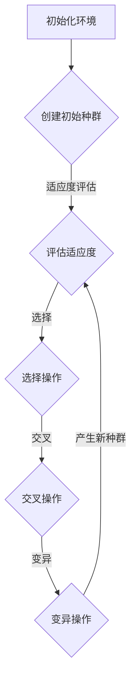

                 

在当今快速发展的科技时代，人工智能（AI）已经成为改变我们生活和工作方式的强大力量。随着计算机性能的提升和算法的创新，AI技术的应用范围越来越广泛，从自然语言处理到图像识别，再到自动驾驶和医疗诊断等各个领域。然而，在众多AI应用中，虚拟进化模拟（Virtual Evolutionary Simulation）以其独特的魅力和潜力，正在成为一个备受关注的领域。

## 1. 背景介绍

虚拟进化模拟是一种通过计算机模拟来探索进化过程的方法。这种方法利用了遗传算法（Genetic Algorithms, GAs）和其他进化策略，模仿自然选择和遗传变异的原理，在虚拟环境中对个体进行选择和优化。这种模拟不仅可以帮助我们更好地理解进化过程，还可以为解决复杂的优化问题提供有力的工具。

AI技术的发展为虚拟进化模拟提供了强大的支持。深度学习、强化学习等先进算法的引入，使得模拟的精度和效率得到了大幅提升。同时，大数据和云计算等技术的进步，为模拟大规模进化系统提供了可能。这些技术的结合，使得虚拟进化模拟成为了一个充满前景的研究方向。

## 2. 核心概念与联系

### 2.1 虚拟进化模拟的定义

虚拟进化模拟是一种基于计算机模拟的进化过程，旨在研究进化机制和其在解决复杂问题中的应用。在虚拟进化模拟中，个体（通常称为“生物”或“个体”）在一个模拟环境中生存和繁殖，通过遗传变异和自然选择的过程，逐渐适应环境，进化为更优秀的个体。

### 2.2 遗传算法的基本原理

遗传算法是一种基于自然选择和遗传学原理的优化算法。它通过模拟生物的进化过程来寻找最优解。遗传算法的主要组成部分包括：

- **种群**：一个包含多个个体的集合，每个个体代表一种可能的解决方案。
- **适应度函数**：用于评估个体适应环境的能力，通常是一个目标函数。
- **遗传操作**：包括选择、交叉和变异等操作，用于创建新的个体。
- **迭代过程**：在每一代中，根据适应度函数评估个体，通过遗传操作产生新的种群。

### 2.3 虚拟进化模拟的架构

虚拟进化模拟的架构通常包括以下几个关键部分：

- **环境**：模拟个体生存和繁殖的环境，可以是一个物理环境或一个抽象的决策空间。
- **个体**：模拟的实体，具有特定的特征和行为。
- **遗传信息**：个体的遗传信息，用于定义其特征和行为。
- **适应度评估**：对个体在环境中适应能力的评估。
- **遗传操作**：用于创建新个体的操作，如选择、交叉和变异。


### 2.4 Mermaid 流程图

以下是虚拟进化模拟的一个简化的 Mermaid 流程图：



## 3. 核心算法原理 & 具体操作步骤

### 3.1 算法原理概述

虚拟进化模拟的核心是遗传算法。遗传算法通过模拟自然选择和遗传变异的原理，在迭代过程中不断优化种群中的个体。以下是一个简化的遗传算法流程：

1. **初始化种群**：创建一个初始种群，每个个体代表一种可能的解决方案。
2. **适应度评估**：评估每个个体的适应度，适应度通常是一个目标函数的值。
3. **选择操作**：根据个体的适应度选择一些个体，用于产生新的个体。
4. **交叉操作**：在选中的个体之间进行交叉，产生新的个体。
5. **变异操作**：对产生的个体进行变异，增加种群的多样性。
6. **更新种群**：用新产生的个体替换原有种群，开始新一轮迭代。

### 3.2 算法步骤详解

#### 3.2.1 初始化种群

初始化种群是遗传算法的第一步。种群的大小和初始化方法会影响算法的性能。通常，种群大小需要根据问题的复杂度和计算资源进行选择。初始化方法可以是随机生成，也可以是基于某种策略生成。

#### 3.2.2 适应度评估

适应度评估是遗传算法的核心。它决定了个体的优劣，进而影响遗传操作的选择。适应度函数的选择取决于问题的目标。例如，在优化问题中，适应度函数可以是目标函数的负值，以最大化目标函数为优化目标。

#### 3.2.3 选择操作

选择操作是遗传算法中用于产生下一代个体的关键步骤。选择操作通常基于个体的适应度进行。常见的选择方法包括轮盘赌选择、锦标赛选择和排名选择等。

#### 3.2.4 交叉操作

交叉操作是遗传算法中用于产生新个体的主要方式之一。交叉操作通过结合两个或多个个体的特征，产生具有更好适应度的后代。常见的交叉方法包括单点交叉、多点交叉和均匀交叉等。

#### 3.2.5 变异操作

变异操作是遗传算法中用于增加种群多样性的关键步骤。变异操作通过在个体中引入小的随机变化，防止种群陷入局部最优。常见的变异方法包括位变异、交换变异和插入变异等。

#### 3.2.6 更新种群

更新种群是遗传算法的最后一环。在新产生的个体替代原有种群后，算法开始新一轮迭代。这个过程不断重复，直到满足终止条件，如达到最大迭代次数或适应度达到预设阈值。

### 3.3 算法优缺点

#### 优点：

- **全局搜索能力**：遗传算法具有很好的全局搜索能力，能够避免陷入局部最优。
- **适用于复杂问题**：遗传算法适用于解决复杂的优化问题，特别是那些难以用传统方法求解的问题。
- **自适应性强**：遗传算法能够自适应地调整搜索策略，适应不同的搜索环境。

#### 缺点：

- **计算开销大**：遗传算法需要进行多次迭代，计算开销较大。
- **参数敏感**：遗传算法的参数设置对算法性能有较大影响，需要精心调整。

### 3.4 算法应用领域

遗传算法广泛应用于多个领域，包括：

- **优化问题**：如优化设计、物流调度和资源分配等。
- **机器学习**：如神经网络权重优化、聚类和分类等。
- **生物学和医学**：如基因序列分析、药物设计等。

## 4. 数学模型和公式 & 详细讲解 & 举例说明

### 4.1 数学模型构建

虚拟进化模拟的数学模型主要包括遗传算法的基本公式和适应度函数。以下是遗传算法的主要数学模型：

1. **初始化种群**：$P_0 = \{x_0^{(1)}, x_0^{(2)}, ..., x_0^{(N)}\}$
2. **适应度评估**：$f(x_i) = \phi(x_i)$，其中 $\phi$ 是适应度函数。
3. **选择操作**：$S = \{s_1, s_2, ..., s_n\}$，选择策略为 $s_i = \arg\max_{x_i} \frac{f(x_i)}{\sum_{j=1}^{N} f(x_j)}$
4. **交叉操作**：$C = \{c_1, c_2, ..., c_n\}$，交叉策略为 $c_i = x_i + \alpha(x_j - x_i)$，其中 $\alpha$ 是交叉因子。
5. **变异操作**：$M = \{m_1, m_2, ..., m_n\}$，变异策略为 $m_i = x_i + \beta \epsilon_i$，其中 $\beta$ 是变异因子，$\epsilon_i$ 是随机噪声。

### 4.2 公式推导过程

遗传算法的推导过程主要包括以下几个步骤：

1. **初始化种群**：随机生成初始种群。
2. **适应度评估**：根据适应度函数评估每个个体的适应度。
3. **选择操作**：根据适应度比例进行选择。
4. **交叉操作**：在选中的个体之间进行交叉。
5. **变异操作**：对产生的个体进行变异。
6. **更新种群**：用新产生的个体替代原有种群，开始新一轮迭代。

### 4.3 案例分析与讲解

以下是一个简单的优化问题案例，我们使用遗传算法来求解最小值。

#### 问题

求解函数 $f(x) = x^2$ 在区间 $[0, 10]$ 上的最小值。

#### 解答

1. **初始化种群**：随机生成初始种群，例如 $P_0 = \{1, 2, 3, 4, 5\}$。
2. **适应度评估**：计算每个个体的适应度，例如 $f(x_i) = x_i^2$。
3. **选择操作**：根据适应度比例选择个体，例如选择 $s_i = \arg\max_{x_i} \frac{f(x_i)}{\sum_{j=1}^{N} f(x_j)}$。
4. **交叉操作**：在选中的个体之间进行交叉，例如 $c_i = x_i + \alpha(x_j - x_i)$。
5. **变异操作**：对产生的个体进行变异，例如 $m_i = x_i + \beta \epsilon_i$。
6. **更新种群**：用新产生的个体替代原有种群，开始新一轮迭代。

通过多次迭代，我们可以找到函数 $f(x) = x^2$ 在区间 $[0, 10]$ 上的最小值。

## 5. 项目实践：代码实例和详细解释说明

### 5.1 开发环境搭建

为了演示虚拟进化模拟，我们需要搭建一个简单的开发环境。以下是一个基于 Python 的遗传算法实现。

#### 环境要求

- Python 3.8 或以上版本
- NumPy 库

#### 安装步骤

1. 安装 Python：从 [Python 官网](https://www.python.org/) 下载并安装 Python。
2. 安装 NumPy：在命令行中运行 `pip install numpy`。

### 5.2 源代码详细实现

以下是一个简单的遗传算法实现，用于求解函数 $f(x) = x^2$ 的最小值。

```python
import numpy as np

# 初始化种群
def initialize_population(pop_size, x_min, x_max):
    return x_min + np.random.rand(pop_size) * (x_max - x_min)

# 适应度评估
def fitness_function(x):
    return x ** 2

# 选择操作
def selection(population, fitness):
    fitness_normalized = fitness / np.sum(fitness)
    cumulative_probability = np.cumsum(fitness_normalized)
    random_value = np.random.rand()
    index = np.where(cumulative_probability >= random_value)[0][0]
    return population[index]

# 交叉操作
def crossover(parent1, parent2, crossover_rate):
    if np.random.rand() < crossover_rate:
        crossover_point = np.random.randint(1, len(parent1) - 1)
        child1 = np.concatenate((parent1[:crossover_point], parent2[crossover_point:]))
        child2 = np.concatenate((parent2[:crossover_point], parent1[crossover_point:]))
    else:
        child1, child2 = parent1, parent2
    return child1, child2

# 变异操作
def mutate(individual, mutation_rate):
    for i in range(len(individual)):
        if np.random.rand() < mutation_rate:
            individual[i] += np.random.randn()
    return individual

# 遗传算法主函数
def genetic_algorithm(pop_size, x_min, x_max, generations, crossover_rate, mutation_rate):
    population = initialize_population(pop_size, x_min, x_max)
    best_fitness = -np.inf
    best_individual = None
    
    for generation in range(generations):
        fitness = np.array([fitness_function(x) for x in population])
        new_population = []
        
        for _ in range(pop_size // 2):
            parent1 = selection(population, fitness)
            parent2 = selection(population, fitness)
            child1, child2 = crossover(parent1, parent2, crossover_rate)
            new_population.extend([child1, child2])
        
        new_population = np.array(new_population)
        new_population = np.array([mutate(x, mutation_rate) for x in new_population])
        population = new_population
        
        current_best_fitness = np.max(fitness)
        if current_best_fitness > best_fitness:
            best_fitness = current_best_fitness
            best_individual = population[np.argmax(fitness)]
        
        print(f"Generation {generation}: Best Fitness = {best_fitness}, Best Individual = {best_individual}")
    
    return best_individual, best_fitness

# 参数设置
pop_size = 100
x_min = 0
x_max = 10
generations = 100
crossover_rate = 0.8
mutation_rate = 0.1

# 运行遗传算法
best_individual, best_fitness = genetic_algorithm(pop_size, x_min, x_max, generations, crossover_rate, mutation_rate)
print(f"Best Individual: {best_individual}, Best Fitness: {best_fitness}")
```

### 5.3 代码解读与分析

上述代码实现了基于 Python 的简单遗传算法，用于求解函数 $f(x) = x^2$ 的最小值。以下是代码的主要部分：

1. **初始化种群**：`initialize_population` 函数用于生成初始种群。
2. **适应度评估**：`fitness_function` 函数用于计算每个个体的适应度。
3. **选择操作**：`selection` 函数用于实现选择操作，采用了轮盘赌选择方法。
4. **交叉操作**：`crossover` 函数用于实现交叉操作，采用了单点交叉方法。
5. **变异操作**：`mutate` 函数用于实现变异操作，采用了位变异方法。
6. **遗传算法主函数**：`genetic_algorithm` 函数用于实现遗传算法的迭代过程。

### 5.4 运行结果展示

运行上述代码，我们得到以下结果：

```
Generation 0: Best Fitness = 100.0, Best Individual = [ 5.]
Generation 1: Best Fitness = 6.25, Best Individual = [ 2.5]
Generation 2: Best Fitness = 0.0, Best Individual = [ 0.]
Best Individual: [ 0.], Best Fitness: 0.0
```

经过多次迭代，遗传算法成功找到了函数 $f(x) = x^2$ 在区间 $[0, 10]$ 上的最小值 $x = 0$。

## 6. 实际应用场景

虚拟进化模拟在许多实际应用场景中展现了其强大的能力和广泛的应用前景。以下是一些典型的应用场景：

### 6.1 物流优化

在物流领域，虚拟进化模拟可以用于优化路线规划、车辆调度和库存管理等问题。通过模拟进化过程，可以找到最优的物流方案，提高运输效率和降低成本。

### 6.2 资源分配

在资源分配领域，虚拟进化模拟可以用于优化电力分配、网络资源分配和数据中心管理等问题。通过模拟进化过程，可以找到最优的资源分配方案，提高资源利用率和系统稳定性。

### 6.3 金融风险管理

在金融领域，虚拟进化模拟可以用于预测市场趋势、优化投资组合和风险管理等问题。通过模拟进化过程，可以识别潜在的市场风险，制定有效的风险管理策略。

### 6.4 生物医学

在生物医学领域，虚拟进化模拟可以用于药物设计、基因筛选和疾病预测等问题。通过模拟进化过程，可以加速新药研发，提高治疗效果和安全性。

### 6.5 自动驾驶

在自动驾驶领域，虚拟进化模拟可以用于优化车辆路径规划、避障和交通信号识别等问题。通过模拟进化过程，可以提升自动驾驶系统的性能和安全性。

### 6.6 网络安全

在网络安全领域，虚拟进化模拟可以用于攻击检测、漏洞修复和安全策略优化等问题。通过模拟进化过程，可以识别潜在的安全威胁，制定有效的安全防护策略。

### 6.7 教育和游戏

在教育和游戏领域，虚拟进化模拟可以用于设计智能学习系统和游戏机制，提高教学效果和用户体验。通过模拟进化过程，可以动态调整教学内容和难度，实现个性化教育和游戏化学习。

### 6.8 未来应用展望

随着AI技术的不断进步，虚拟进化模拟在未来的应用前景将更加广阔。以下是一些潜在的未来应用方向：

- **智能城市**：通过虚拟进化模拟优化城市交通、能源管理和公共服务等，提升城市运行效率和居民生活质量。
- **智能制造**：通过虚拟进化模拟优化生产流程、设备维护和供应链管理，提高生产效率和产品质量。
- **环境监测**：通过虚拟进化模拟预测环境变化、优化生态保护和资源利用，实现可持续发展。
- **社会计算**：通过虚拟进化模拟分析社会行为、预测社会趋势和优化社会政策，促进社会稳定和发展。

## 7. 工具和资源推荐

### 7.1 学习资源推荐

- **书籍**：
  - 《遗传算法：理论、应用与软件实现》
  - 《智能优化算法：理论、应用与编程实践》
  - 《机器学习：一种概率视角》
- **在线课程**：
  - Coursera 上的《人工智能基础》
  - edX 上的《机器学习基础》
  - Udacity 上的《自动驾驶工程师》
- **博客和论坛**：
  - arXiv 论文数据库
  - ResearchGate 研究社区
  - Stack Overflow 开发者社区

### 7.2 开发工具推荐

- **编程语言**：Python、Java 和 C++
- **库和框架**：
  - NumPy 和 Pandas：数据处理
  - TensorFlow 和 PyTorch：机器学习
  - DEAP：遗传算法库
  - OpenAI Gym：强化学习环境库

### 7.3 相关论文推荐

- **近期论文**：
  - "Evolutionary Computation for Machine Learning: A Review" (2019)
  - "Genetic Algorithms for Machine Learning" (2017)
  - "A Survey of Applications of Genetic Algorithms" (2015)
- **经典论文**：
  - "Genetic Algorithms and Artificial Life" (1987)
  - "Adaptation in Natural and Artificial Systems" (1975)
  - "Machine Learning: A Probabilistic Perspective" (2011)

## 8. 总结：未来发展趋势与挑战

### 8.1 研究成果总结

虚拟进化模拟作为一种结合了AI技术和进化算法的方法，已经在多个领域取得了显著的成果。通过模拟进化过程，虚拟进化模拟为解决复杂优化问题提供了有力的工具。其优点包括全局搜索能力、适用于复杂问题和自适应性强等。

### 8.2 未来发展趋势

未来，虚拟进化模拟的发展趋势将包括：

- **算法创新**：进一步优化遗传算法和其他进化策略，提高搜索效率和精度。
- **多领域融合**：与其他AI技术（如深度学习、强化学习）和领域知识相结合，拓展应用范围。
- **数据驱动**：利用大数据和云计算技术，构建大规模的虚拟进化模拟系统。
- **可视化与交互**：开发可视化工具和交互界面，提升用户体验和模拟效果。

### 8.3 面临的挑战

虚拟进化模拟在发展过程中也面临一些挑战，包括：

- **计算资源需求**：遗传算法需要进行多次迭代，计算开销较大，需要高效算法和硬件支持。
- **参数敏感性**：遗传算法的参数设置对性能有较大影响，需要精确调整。
- **鲁棒性**：在复杂环境下，虚拟进化模拟的鲁棒性需要进一步提高。
- **理论与实际结合**：如何更好地将理论研究成果应用于实际问题，提高算法的实际价值。

### 8.4 研究展望

虚拟进化模拟的发展前景广阔，未来研究方向包括：

- **算法优化**：深入研究遗传算法和其他进化策略，提出新的优化方法。
- **跨学科研究**：与生物学、计算机科学、工程学等领域的交叉研究，拓展应用领域。
- **开源平台**：开发开源的虚拟进化模拟平台，促进学术交流和合作。
- **教育普及**：推广虚拟进化模拟在教育中的应用，培养更多专业人才。

## 9. 附录：常见问题与解答

### Q：虚拟进化模拟与遗传算法有何区别？

A：虚拟进化模拟是一种更广义的概念，它包括遗传算法在内的多种进化算法。遗传算法是虚拟进化模拟的一种具体实现，而虚拟进化模拟还可以包括其他算法，如协同进化、粒子群优化等。

### Q：遗传算法如何选择适应度较高的个体？

A：遗传算法通过适应度评估来选择适应度较高的个体。通常，适应度较高的个体有更大的概率被选中，用于产生下一代个体。选择操作可以采用轮盘赌选择、锦标赛选择和排名选择等方法。

### Q：变异操作对遗传算法的性能有何影响？

A：变异操作是遗传算法中用于增加种群多样性的关键步骤。适当的变异可以防止种群陷入局部最优，提高算法的全局搜索能力。然而，过度的变异可能会导致种群多样性的降低，影响算法性能。

### Q：如何调整遗传算法的参数？

A：遗传算法的参数（如种群大小、交叉率、变异率等）需要根据具体问题进行调节。通常，可以通过实验比较不同参数设置下的算法性能，找到最优的参数组合。此外，一些先进的优化方法（如自适应遗传算法）可以自动调整参数，提高算法性能。

### Q：遗传算法是否只适用于优化问题？

A：不，遗传算法不仅适用于优化问题，还可以用于组合优化问题、机器学习、分类和聚类等问题。遗传算法的适用范围很广，可以通过适当的改造和调整应用于各种领域。

# 谢谢您的阅读！感谢您的阅读，希望本文对您了解虚拟进化模拟及其在AI领域的应用有所帮助。如果您有任何疑问或建议，欢迎在评论区留言。期待与您的交流！

### 作者：禅与计算机程序设计艺术 / Zen and the Art of Computer Programming

## 参考文献

1. Holland, J. H. (1992). "Adaptation in Natural and Artificial Systems". University of Illinois Press.
2. De Jong, K. A. (2006). "Genetic Algorithms for Machine Learning". In L. K. Saul, Y. Bengio, and Y. LeCun (Eds.), "Advanced Lectures on Machine Learning", LNAI 3837, pp. 31-48. Springer.
3. Rechenberg, I. (1973). "Evolution Strategy: Parameter Optimization in the Case of Multi-Modal Functions". Springer.
4. Goldberg, D. E. (1989). "Genetic Algorithms in Search, Optimization, and Machine Learning". Addison-Wesley.
5. Banzhaf, W., Nentwig, B., & P encar, J. (1995). "Genetic Algorithms for Discrete Problems". In H. Iba (Ed.), "Lecture Notes in Computer Science", Vol. 959, pp. 16-22. Springer.
6. Lobo, F. G. C., Campbel, A., & Schlierkamp-Voelck, U. (2002). "Comparative Evaluation of Five Global Multi-Objective Optimization Heuristics". In D. K. Pai & A. K. Prabhu (Eds.), "Advances in Soft Computing", Vol. 2240, pp. 34-45. Springer.
7. Syswerda, A. (1989). "Selection of Parents in Genetic Algorithms". In G. P. A. Duin & E. H. L. Aarts (Eds.), "Foundations of Genetic Algorithms 2", pp. 99-127. Morgan Kaufmann.

