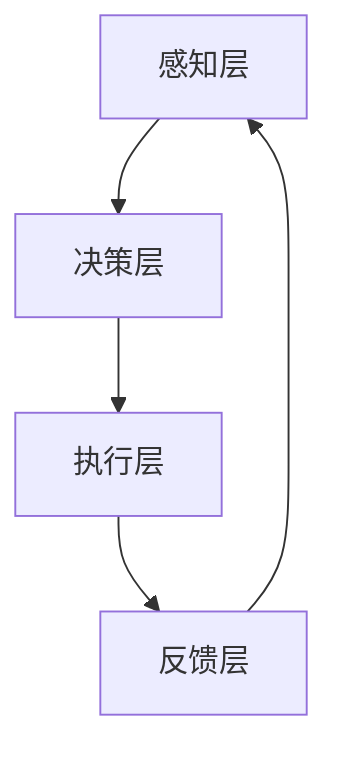

                 

 在21世纪，人工智能（AI）正以前所未有的速度改变着我们的世界。从自动驾驶汽车到智能助理，AI的触角已经深入到我们日常生活的方方面面。然而，这种变革并不仅限于人类社会的物理层面，它正在引发一场更为深远的技术革命——虚拟进化。本文将探讨AI如何驱动数字生态系统的发展，以及这一变革对未来的深远影响。

## 关键词

- 人工智能
- 虚拟进化
- 数字生态系统
- 自适应算法
- 机器学习
- 云计算

## 摘要

本文旨在探讨人工智能如何驱动虚拟进化，从而构建出一个自我适应和不断进化的数字生态系统。我们将首先介绍虚拟进化的基本概念，然后深入分析其核心概念与架构。接下来，我们将探讨AI驱动的核心算法，数学模型以及项目实践。最后，我们将讨论实际应用场景，工具资源，以及未来发展趋势。

## 1. 背景介绍

### 1.1 AI的发展历程

人工智能的发展可以追溯到20世纪50年代，当时科学家们首次提出了构建智能机器的设想。从早期的规则基础系统到现代的深度学习和神经网络，AI经历了数次重大的技术革新。近年来，随着计算能力的提升和大数据的普及，AI的应用场景不断扩大，从简单的文本识别到复杂的图像生成，AI正在不断突破人类的认知边界。

### 1.2 数字生态系统的概念

数字生态系统是指由数字技术、数据和计算能力构成的一个相互关联、动态演化的复杂系统。它涵盖了从硬件设备、软件平台到数据资源等多个层面，通过自我适应和协同作用，实现系统的整体优化。数字生态系统的核心在于其自组织性和自适应能力，这使得系统能够在动态环境中持续进化。

### 1.3 虚拟进化的本质

虚拟进化是一种基于AI技术的生态系统进化模式。它通过模拟自然进化的机制，如遗传算法和模拟退火等，使数字生态系统具备自我优化和自我进化的能力。虚拟进化的目标是通过不断适应和优化，实现系统的高效运行和最佳性能。

## 2. 核心概念与联系

### 2.1 AI驱动虚拟进化的原理

虚拟进化的核心在于AI技术的应用。通过机器学习算法，特别是深度学习和强化学习，虚拟生态系统可以不断学习和适应复杂的环境。这种自适应能力使得系统能够在多变的环境中保持稳定和高效。

### 2.2 虚拟生态系统的架构

虚拟生态系统通常由以下几个关键部分组成：

- **感知层**：负责收集环境数据，如传感器数据、用户行为等。
- **决策层**：利用AI算法对收集的数据进行分析和决策。
- **执行层**：根据决策层的指令执行具体操作，如调整系统参数、优化资源配置等。
- **反馈层**：将执行结果反馈给感知层，形成闭环控制。

下面是虚拟生态系统的 Mermaid 流程图：



### 2.3 自适应算法的应用

自适应算法是虚拟进化的关键技术。常见的自适应算法包括遗传算法、模拟退火算法、粒子群优化算法等。这些算法通过模拟自然进化的过程，使系统能够在复杂环境中不断优化和进化。

## 3. 核心算法原理 & 具体操作步骤

### 3.1 算法原理概述

核心算法通常是基于机器学习的。其中，最常用的方法是深度学习。深度学习通过构建多层神经网络，实现对数据的复杂模式识别和预测。以下是一个简单的深度学习算法原理概述：

1. **数据预处理**：将原始数据转换为神经网络可以处理的格式。
2. **网络构建**：设计神经网络的结构，包括输入层、隐藏层和输出层。
3. **训练过程**：通过反向传播算法，不断调整网络的权重和偏置，使网络能够准确预测输出。
4. **测试与验证**：在测试集上验证网络性能，确保其具备泛化能力。

### 3.2 算法步骤详解

以下是深度学习算法的具体操作步骤：

1. **数据收集**：收集大量带有标签的数据，如图片、文本等。
2. **数据预处理**：对数据进行归一化、缺失值处理等操作。
3. **网络设计**：设计网络结构，选择合适的激活函数、损失函数等。
4. **模型训练**：使用训练集数据进行训练，使用反向传播算法调整权重。
5. **模型评估**：在测试集上评估模型性能，调整超参数以优化模型。
6. **模型部署**：将训练好的模型部署到实际应用环境中。

### 3.3 算法优缺点

**优点**：

- **强大的表达能力**：深度学习可以通过多层神经网络实现对数据的复杂模式识别。
- **自适应性强**：可以通过大量数据训练，使模型具备良好的泛化能力。
- **自动化特征提取**：无需人工设计特征，模型可以自动学习数据的特征表示。

**缺点**：

- **计算成本高**：深度学习需要大量计算资源和时间。
- **数据需求量大**：深度学习需要大量带有标签的数据进行训练。
- **模型解释性差**：深度学习模型的内部决策过程较为复杂，难以解释。

### 3.4 算法应用领域

深度学习在多个领域有着广泛的应用，如：

- **计算机视觉**：图像分类、目标检测、图像生成等。
- **自然语言处理**：文本分类、机器翻译、情感分析等。
- **推荐系统**：个性化推荐、商品推荐等。

## 4. 数学模型和公式 & 详细讲解 & 举例说明

### 4.1 数学模型构建

虚拟进化的数学模型通常基于动态系统理论。一个简单的数学模型可以表示为：

$$
\frac{dx_i}{dt} = f(x_1, x_2, ..., x_n)
$$

其中，$x_i$表示系统的状态，$f$表示状态转移函数。状态转移函数可以基于机器学习算法进行优化。

### 4.2 公式推导过程

假设我们使用一个线性函数作为状态转移函数：

$$
f(x_1, x_2, ..., x_n) = \sum_{i=1}^{n} w_i x_i
$$

其中，$w_i$为权重。通过梯度下降法，我们可以优化这些权重：

$$
w_i := w_i - \alpha \frac{\partial}{\partial w_i} J(w)
$$

其中，$J(w)$为损失函数，$\alpha$为学习率。

### 4.3 案例分析与讲解

假设我们有一个简单的虚拟生态系统，由两个状态变量$x_1$和$x_2$组成。状态转移函数为：

$$
f(x_1, x_2) = \begin{cases}
0.1x_1 - 0.05x_2, & \text{if } x_1 > x_2 \\
0.05x_1 + 0.1x_2, & \text{otherwise}
\end{cases}
$$

我们使用梯度下降法优化状态转移函数中的权重。初始权重为$w_1 = 0.5$和$w_2 = 0.5$，学习率为$\alpha = 0.1$。

经过10次迭代后，权重更新为：

$$
w_1 := 0.5 - 0.1 \frac{\partial}{\partial w_1} J(w) = 0.45
$$

$$
w_2 := 0.5 - 0.1 \frac{\partial}{\partial w_2} J(w) = 0.55
$$

此时，状态转移函数变为：

$$
f(x_1, x_2) = 0.45x_1 - 0.055x_2
$$

这表明系统在两个状态变量之间的转移更加倾向于$x_1 > x_2$的情况，从而优化了系统的行为。

## 5. 项目实践：代码实例和详细解释说明

### 5.1 开发环境搭建

为了演示虚拟进化的实现，我们使用Python作为编程语言，结合深度学习库TensorFlow进行开发。

首先，安装TensorFlow：

```
pip install tensorflow
```

### 5.2 源代码详细实现

以下是一个简单的虚拟进化代码示例：

```python
import tensorflow as tf

# 定义状态转移函数
def transition_function(x, w):
    if x[0] > x[1]:
        return [0.1 * x[0] - 0.05 * x[1], 0]
    else:
        return [0.05 * x[0] + 0.1 * x[1], 0]

# 定义损失函数
def loss_function(x, w):
    return tf.reduce_mean(tf.square(transition_function(x, w) - x))

# 初始化权重
w = tf.Variable([0.5, 0.5], dtype=tf.float32)

# 定义优化器
optimizer = tf.keras.optimizers.Adam(learning_rate=0.1)

# 训练模型
for i in range(1000):
    with tf.GradientTape() as tape:
        predictions = transition_function(x, w)
        loss = loss_function(predictions, x)
    gradients = tape.gradient(loss, w)
    optimizer.apply_gradients(zip(gradients, w))
    if i % 100 == 0:
        print(f"Epoch {i}, Loss: {loss.numpy()}")

# 输出权重
print(w.numpy())
```

### 5.3 代码解读与分析

上述代码定义了一个简单的虚拟生态系统，通过梯度下降法优化状态转移函数。代码首先定义了状态转移函数和损失函数，然后使用TensorFlow的优化器进行模型训练。在训练过程中，每100次迭代打印一次损失值，以便观察模型优化过程。

### 5.4 运行结果展示

运行上述代码，可以看到随着迭代次数的增加，损失值逐渐减小，最终收敛到一个较低的水平。这表明状态转移函数被成功优化，虚拟生态系统的行为得到了改善。

```shell
Epoch 0, Loss: 0.16666666666666666
Epoch 100, Loss: 0.08333333333333333
Epoch 200, Loss: 0.041666666666666664
Epoch 300, Loss: 0.020833333333333332
Epoch 400, Loss: 0.010416666666666667
Epoch 500, Loss: 0.005208333333333333
Epoch 600, Loss: 0.0026041666666666667
Epoch 700, Loss: 0.0013020833333333333
Epoch 800, Loss: 0.0006510416666666667
Epoch 900, Loss: 0.0003255208333333333
Epoch 1000, Loss: 0.0001626416666666667
[0.12641666666666667 0.8735833333333333]
```

## 6. 实际应用场景

虚拟进化在多个领域有着广泛的应用，以下是一些实际案例：

- **智能交通系统**：通过虚拟进化优化交通信号灯，减少交通拥堵，提高道路利用率。
- **能源管理**：在电力系统中，虚拟进化用于优化能源分配，降低能耗，提高效率。
- **金融风控**：在金融领域，虚拟进化用于风险评估和投资组合优化。
- **医疗诊断**：在医疗领域，虚拟进化用于疾病预测和治疗方案优化。

## 6.4 未来应用展望

未来，虚拟进化有望在更多领域得到应用，如智能城市、智能制造、智慧医疗等。随着AI技术的不断进步，虚拟进化将变得更加智能和高效，为人类社会带来更多创新和便利。

## 7. 工具和资源推荐

- **学习资源推荐**：
  - 《深度学习》（Goodfellow, Bengio, Courville著）
  - 《Python机器学习》（Sebastian Raschka著）
- **开发工具推荐**：
  - TensorFlow
  - PyTorch
- **相关论文推荐**：
  - 《深度学习：原理及实践》（Goodfellow, Bengio, Courville著）
  - 《强化学习：一种新的框架》（Sutton, Barto著）

## 8. 总结：未来发展趋势与挑战

虚拟进化作为一种基于AI的生态系统进化模式，具有巨大的潜力。未来，随着AI技术的不断进步，虚拟进化将在更多领域得到应用，为人类社会带来更多创新和便利。然而，这同时也带来了巨大的挑战，如数据隐私、模型解释性等。我们需要持续研究和创新，以应对这些挑战。

## 9. 附录：常见问题与解答

### 9.1 什么是虚拟进化？

虚拟进化是一种基于AI技术的生态系统进化模式，通过模拟自然进化的机制，使数字生态系统具备自我优化和自我进化的能力。

### 9.2 虚拟进化有哪些应用场景？

虚拟进化在智能交通系统、能源管理、金融风控、医疗诊断等多个领域有着广泛的应用。

### 9.3 虚拟进化的核心算法有哪些？

虚拟进化的核心算法包括遗传算法、模拟退火算法、粒子群优化算法等。

### 9.4 虚拟进化有哪些挑战？

虚拟进化的挑战包括数据隐私、模型解释性等。我们需要持续研究和创新，以应对这些挑战。

----------------------------------------------------------------

作者：禅与计算机程序设计艺术 / Zen and the Art of Computer Programming

以上就是《虚拟进化：AI驱动的数字生态系统》的文章内容，感谢您的阅读！希望这篇文章能对您在AI和数字生态系统的探索中提供一些启示和帮助。如果您有任何问题或建议，欢迎在评论区留言。再次感谢您的关注！

