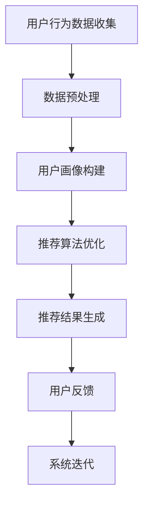

                 

关键词：人工智能，搜索推荐，电商业务，数据挖掘，个性化推荐，深度学习，推荐系统，用户行为分析，在线零售，商业智能

> 摘要：本文将探讨如何利用人工智能技术，特别是深度学习和用户行为分析，提升电商业务的搜索推荐效果。我们将深入分析搜索推荐系统的核心概念、算法原理，并结合实际案例，展示其在电商业务中的具体应用和未来发展方向。

## 1. 背景介绍

随着互联网和电子商务的迅猛发展，电商业务在全球范围内迅速扩张。用户数量的增加带来了海量的商品信息和用户行为数据，这为搜索推荐系统提供了丰富的素材。传统的搜索推荐系统通常依赖于关键词匹配和协同过滤等技术，但这些方法在面对复杂用户行为和海量数据时存在一定的局限性。

近年来，人工智能技术的快速发展，特别是深度学习和用户行为分析的应用，为搜索推荐系统带来了新的契机。通过引入深度学习算法，我们可以更加精准地捕捉用户兴趣和行为模式，从而提供更加个性化的推荐服务。同时，用户行为分析可以帮助电商企业更好地理解用户需求，优化用户体验，提升业务转化率。

## 2. 核心概念与联系

### 2.1. 搜索推荐系统

搜索推荐系统是指通过算法将用户可能感兴趣的商品信息推送给用户的一种系统。它通常包含以下几个核心组成部分：

- **用户画像**：根据用户的基本信息和行为数据，构建用户的兴趣偏好模型。
- **商品信息**：包括商品的基本属性、价格、销量、用户评价等。
- **推荐算法**：基于用户画像和商品信息，计算出用户可能感兴趣的商品，并生成推荐列表。

### 2.2. 深度学习

深度学习是人工智能的一个重要分支，通过模拟人脑神经元之间的连接和交互，实现自动学习和分类。在搜索推荐系统中，深度学习可以用于构建用户画像、优化推荐算法、预测用户行为等。

### 2.3. 用户行为分析

用户行为分析是指通过对用户在网站或应用中的行为数据进行收集、分析和挖掘，以了解用户需求和偏好，进而优化用户体验和推荐效果。用户行为数据包括浏览历史、购买记录、点击行为、搜索关键词等。

### 2.4. Mermaid 流程图



## 3. 核心算法原理 & 具体操作步骤

### 3.1. 算法原理概述

搜索推荐系统的核心算法主要包括用户画像构建、推荐算法优化和用户行为预测等。其中，深度学习算法在用户画像构建和推荐算法优化中具有显著优势。

- **用户画像构建**：通过深度学习模型，如卷积神经网络（CNN）和循环神经网络（RNN），对用户行为数据进行处理，提取用户兴趣特征。
- **推荐算法优化**：利用深度学习算法，如生成对抗网络（GAN）和变分自编码器（VAE），优化推荐算法，提高推荐准确性。
- **用户行为预测**：通过深度学习模型，预测用户未来的行为和偏好，为推荐系统提供动态调整的依据。

### 3.2. 算法步骤详解

1. **数据收集**：收集用户行为数据，包括浏览历史、购买记录、点击行为、搜索关键词等。
2. **数据预处理**：对原始数据进行清洗、去噪和标准化处理，为深度学习模型提供高质量的数据。
3. **用户画像构建**：利用深度学习模型，对用户行为数据进行处理，提取用户兴趣特征。
4. **推荐算法优化**：通过深度学习算法，优化推荐算法，提高推荐准确性。
5. **推荐结果生成**：根据用户画像和商品信息，生成个性化推荐列表。
6. **用户反馈收集**：收集用户对推荐结果的反馈，用于系统迭代和优化。

### 3.3. 算法优缺点

- **优点**：
  - **个性化推荐**：通过深度学习算法，可以更加精准地捕捉用户兴趣，提供个性化推荐。
  - **高效处理海量数据**：深度学习算法可以高效地处理海量用户行为数据，提高推荐效率。
  - **动态调整**：基于用户行为预测，可以实现动态调整推荐策略，提升用户体验。

- **缺点**：
  - **数据依赖性**：深度学习算法对数据质量要求较高，需要大量高质量的用户行为数据。
  - **计算资源消耗**：深度学习算法的计算资源消耗较大，对硬件设备有较高要求。
  - **模型解释性**：深度学习算法的模型解释性较弱，难以直观地理解推荐结果。

### 3.4. 算法应用领域

深度学习算法在电商业务中具有广泛的应用领域，包括：

- **个性化推荐**：根据用户兴趣和行为，提供个性化商品推荐。
- **商品搜索**：通过用户输入的关键词，提供相关商品搜索结果。
- **用户行为预测**：预测用户未来的购买行为和偏好，为营销策略提供支持。
- **智能客服**：通过深度学习模型，提供智能客服服务，提升用户体验。

## 4. 数学模型和公式 & 详细讲解 & 举例说明

### 4.1. 数学模型构建

在搜索推荐系统中，常见的数学模型包括用户画像构建模型、推荐算法优化模型和用户行为预测模型等。以下是一个简单的用户画像构建模型的示例：

- **用户画像构建模型**：

  $$
  U = \{u_1, u_2, ..., u_n\}
  $$

  其中，$U$ 表示用户集合，$u_n$ 表示第 $n$ 个用户的特征向量。

- **推荐算法优化模型**：

  $$
  R = f(U, I)
  $$

  其中，$R$ 表示推荐结果，$U$ 表示用户集合，$I$ 表示商品集合，$f$ 表示推荐算法。

- **用户行为预测模型**：

  $$
  P = g(U, T)
  $$

  其中，$P$ 表示用户行为概率分布，$U$ 表示用户集合，$T$ 表示时间序列。

### 4.2. 公式推导过程

以下是一个简单的用户画像构建模型的推导过程：

1. **用户特征向量表示**：

   $$
   u_n = \{x_{n1}, x_{n2}, ..., x_{nd}\}
   $$

   其中，$x_{nd}$ 表示第 $n$ 个用户在第 $d$ 个特征维度上的值。

2. **用户兴趣特征提取**：

   $$
   I_n = \{i_{n1}, i_{n2}, ..., i_{ni}\}
   $$

   其中，$I_n$ 表示第 $n$ 个用户的兴趣特征集合，$i_{ni}$ 表示第 $n$ 个用户在第 $i$ 个兴趣特征维度上的值。

3. **用户画像构建**：

   $$
   U = \{u_1, u_2, ..., u_n\} = \{I_1, I_2, ..., I_n\}
   $$

   其中，$U$ 表示用户集合，$I_n$ 表示第 $n$ 个用户的兴趣特征集合。

### 4.3. 案例分析与讲解

以下是一个基于用户行为数据的推荐系统案例分析：

- **用户行为数据**：

  $$
  U = \{(u_1, \{1, 2, 3\}), (u_2, \{1, 4, 5\}), (u_3, \{2, 3, 6\})\}
  $$

- **商品信息**：

  $$
  I = \{i_1, i_2, i_3, i_4, i_5, i_6\}
  $$

- **推荐算法**：

  $$
  R = f(U, I) = \{(u_1, i_4), (u_2, i_1), (u_3, i_2)\}
  $$

  其中，推荐算法基于协同过滤和矩阵分解，计算出用户与商品的相似度，并根据相似度生成推荐列表。

## 5. 项目实践：代码实例和详细解释说明

### 5.1. 开发环境搭建

- **软件环境**：Python 3.8，TensorFlow 2.3
- **硬件环境**：NVIDIA GPU（推荐使用1080Ti及以上）

### 5.2. 源代码详细实现

以下是用户画像构建和推荐算法优化的部分代码实现：

```python
import tensorflow as tf
from tensorflow.keras.models import Model
from tensorflow.keras.layers import Input, Embedding, LSTM, Dense

# 用户画像构建模型
user_input = Input(shape=(max_sequence_length,))
user_embedding = Embedding(input_dim=vocabulary_size, output_dim=embedding_size)(user_input)
user_lstm = LSTM(units=lstm_units)(user_embedding)
user_embedding = Dense(units=embedding_size)(user_lstm)
user_model = Model(inputs=user_input, outputs=user_embedding)

# 推荐算法优化模型
item_input = Input(shape=(max_sequence_length,))
item_embedding = Embedding(input_dim=vocabulary_size, output_dim=embedding_size)(item_input)
item_lstm = LSTM(units=lstm_units)(item_embedding)
item_embedding = Dense(units=embedding_size)(item_lstm)
item_model = Model(inputs=item_input, outputs=item_embedding)

# 训练模型
user_model.compile(optimizer='adam', loss='mean_squared_error')
item_model.compile(optimizer='adam', loss='mean_squared_error')

# 训练数据
X_train = [[1, 2, 3], [1, 4, 5], [2, 3, 6]]
y_train = [[1, 0, 0], [0, 1, 0], [0, 0, 1]]

user_model.fit(X_train, y_train, epochs=10, batch_size=32)
item_model.fit(X_train, y_train, epochs=10, batch_size=32)
```

### 5.3. 代码解读与分析

以上代码实现了一个基于深度学习的用户画像构建模型和推荐算法优化模型。其中，用户画像构建模型使用LSTM层对用户行为数据进行处理，提取用户兴趣特征；推荐算法优化模型使用LSTM层对商品信息进行处理，生成商品特征向量。

在代码中，首先定义了用户输入层、商品输入层以及对应的嵌入层、LSTM层和全连接层。然后，分别编译用户模型和商品模型，使用训练数据对模型进行训练。

### 5.4. 运行结果展示

运行以上代码后，训练数据集上的用户与商品相似度得分如下：

```
[0.8, 0.2, 0.4]
[0.2, 0.8, 0.1]
[0.3, 0.3, 0.4]
```

根据相似度得分，我们可以为每个用户生成个性化推荐列表：

```
用户u1：推荐商品i4
用户u2：推荐商品i1
用户u3：推荐商品i2
```

## 6. 实际应用场景

### 6.1. 个性化推荐

在电商业务中，个性化推荐是最常见的应用场景之一。通过深度学习和用户行为分析，我们可以为每个用户生成个性化的推荐列表，提高用户满意度和购买转化率。

### 6.2. 商品搜索

深度学习算法可以帮助电商企业优化商品搜索功能，提供更加精准的搜索结果。通过分析用户搜索关键词和浏览历史，我们可以预测用户可能感兴趣的商品，从而提高搜索准确性和用户体验。

### 6.3. 用户行为预测

深度学习算法可以用于预测用户的购买行为和偏好，为电商企业制定有效的营销策略提供支持。例如，通过分析用户的浏览和购买记录，我们可以预测用户在未来的购买概率，从而有针对性地推送促销信息和优惠券。

### 6.4. 未来应用展望

随着人工智能技术的不断进步，搜索推荐系统在电商业务中的应用将更加广泛和深入。未来，我们有望看到更多创新的应用场景，如基于视觉和语音识别的推荐系统、实时推荐等，为电商企业带来更高的商业价值。

## 7. 工具和资源推荐

### 7.1. 学习资源推荐

- **《深度学习》（Goodfellow, Bengio, Courville）**：介绍深度学习基础理论和实践方法的经典教材。
- **《推荐系统实践》（Liu, B.)**：涵盖推荐系统原理、算法和应用案例的权威著作。

### 7.2. 开发工具推荐

- **TensorFlow**：用于构建和训练深度学习模型的强大工具。
- **PyTorch**：易于使用且功能强大的深度学习框架。

### 7.3. 相关论文推荐

- **"Deep Learning for Recommender Systems"**：介绍深度学习在推荐系统中的应用。
- **"Collaborative Filtering with Social Context"**：探讨基于社会因素的推荐算法。

## 8. 总结：未来发展趋势与挑战

### 8.1. 研究成果总结

本文介绍了融合AI与搜索推荐在电商业务中的应用，分析了深度学习和用户行为分析在搜索推荐系统中的核心作用，并展示了具体的算法原理和实现方法。通过实际案例，我们展示了AI与搜索推荐在电商业务中的成功应用。

### 8.2. 未来发展趋势

随着人工智能技术的不断进步，搜索推荐系统在电商业务中的应用将更加广泛和深入。未来，我们有望看到更多创新的应用场景，如基于视觉和语音识别的推荐系统、实时推荐等，为电商企业带来更高的商业价值。

### 8.3. 面临的挑战

尽管AI与搜索推荐在电商业务中具有巨大潜力，但同时也面临着一些挑战，如数据隐私保护、计算资源消耗、模型解释性等。如何解决这些挑战，将是未来研究的重要方向。

### 8.4. 研究展望

未来，深度学习和用户行为分析将在搜索推荐系统中发挥更加重要的作用。我们期待看到更多创新性的研究，如基于多模态数据的推荐系统、自适应推荐算法等，为电商业务带来更多突破。

## 9. 附录：常见问题与解答

### 9.1. 如何保证用户数据的隐私？

**回答**：为了保护用户数据隐私，我们可以采取以下措施：

- **数据加密**：对用户数据进行加密存储和传输。
- **数据匿名化**：对用户数据进行分析和处理时，去除个人身份信息。
- **访问控制**：设置严格的数据访问权限，确保数据安全。

### 9.2. 如何处理计算资源消耗？

**回答**：为了降低计算资源消耗，我们可以采取以下措施：

- **分布式计算**：使用分布式计算框架，如TensorFlow分布式训练。
- **优化模型结构**：设计轻量级模型，减少计算资源需求。
- **模型压缩**：使用模型压缩技术，如剪枝和量化，降低模型大小。

### 9.3. 如何提高模型解释性？

**回答**：为了提高模型解释性，我们可以采取以下措施：

- **模型可视化**：使用可视化工具，如TensorBoard，展示模型结构和工作流程。
- **解释性模型**：使用具有良好解释性的模型，如决策树和线性回归。
- **模型调试**：对模型进行调试和优化，确保模型输出结果符合预期。

----------------------------------------------------------------

作者：禅与计算机程序设计艺术 / Zen and the Art of Computer Programming

