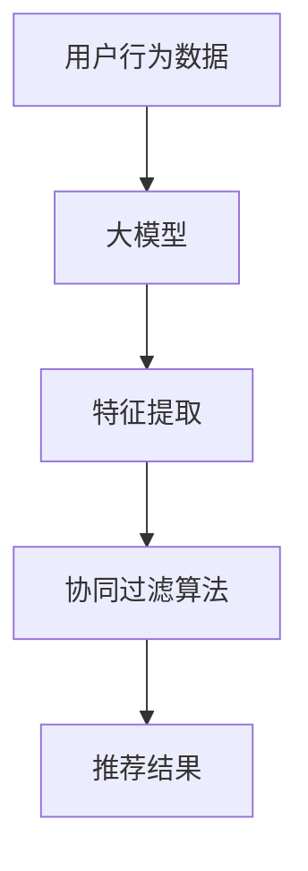

                 

关键词：人工智能、协同过滤、大模型、算法优化、推荐系统

## 摘要

本文旨在探讨如何将人工智能（AI）的大模型技术与协同过滤算法结合，以实现推荐系统的优化。我们将从背景介绍开始，分析现有协同过滤算法的局限，然后深入探讨大模型的引入及其对协同过滤算法的影响。接着，我们将介绍数学模型和公式的推导，并通过具体案例进行讲解。随后，我们将展示一个代码实例，详细解释其实施过程。最后，我们将讨论实际应用场景，并展望未来的发展趋势与面临的挑战。

## 1. 背景介绍

推荐系统是当今互联网世界中不可或缺的一部分，其广泛应用于电子商务、社交媒体、视频流媒体等领域。协同过滤（Collaborative Filtering）是推荐系统中最常用的方法之一，通过收集和分析用户的历史行为数据，为用户提供个性化的推荐。然而，传统的协同过滤算法存在一些局限性：

1. **稀疏数据问题**：协同过滤依赖于用户行为数据，但这些数据往往非常稀疏，导致算法的准确性受到影响。
2. **可扩展性差**：随着用户规模的增加，算法的计算复杂度呈指数级增长，难以处理大规模数据。
3. **冷启动问题**：新用户由于缺乏历史行为数据，无法获得有效的推荐。

为了解决这些问题，近年来，人工智能，特别是大模型技术，被逐渐引入到推荐系统中。大模型具有强大的表示能力和泛化能力，能够在有限的数据上进行训练，从而提升算法的性能和效果。

## 2. 核心概念与联系

在探讨如何将大模型与协同过滤算法结合之前，我们首先需要了解协同过滤算法的基本原理和架构。

### 2.1 协同过滤算法原理

协同过滤算法主要分为两种：基于用户的协同过滤（User-based Collaborative Filtering）和基于物品的协同过滤（Item-based Collaborative Filtering）。

- **基于用户的协同过滤**：它通过计算用户之间的相似度，找到相似的用户群体，从而为新用户提供他们喜欢的物品推荐。
- **基于物品的协同过滤**：它通过计算物品之间的相似度，找到相似物品集合，从而为用户推荐他们可能感兴趣的物品。

### 2.2 大模型与协同过滤的关系

大模型的引入为协同过滤算法带来了新的机遇。大模型可以通过对大量数据进行预训练，获得对用户行为的深刻理解，从而在协同过滤的过程中起到辅助作用。

下面是一个简单的 Mermaid 流程图，展示大模型与协同过滤算法的结合：



在这个流程图中，用户行为数据首先被输入到大模型中，经过特征提取后，输入到协同过滤算法中进行推荐，最终输出推荐结果。

## 3. 核心算法原理 & 具体操作步骤

### 3.1 算法原理概述

融合AI大模型的协同过滤算法主要分为以下几个步骤：

1. **数据预处理**：清洗和预处理用户行为数据，将其转换为模型可接受的格式。
2. **特征提取**：利用大模型进行特征提取，将原始的用户行为数据转化为高维特征向量。
3. **相似度计算**：计算用户或物品之间的相似度，可以使用余弦相似度、皮尔逊相关系数等。
4. **推荐生成**：根据相似度计算结果，为用户生成推荐列表。

### 3.2 算法步骤详解

#### 3.2.1 数据预处理

数据预处理是算法的基础，它包括以下步骤：

- **数据清洗**：去除重复、缺失和异常数据。
- **数据转换**：将用户行为数据转换为矩阵形式，例如用户-物品评分矩阵。
- **标准化**：对数据进行标准化处理，以消除不同特征之间的量级差异。

#### 3.2.2 特征提取

特征提取是利用大模型的核心步骤。具体过程如下：

- **模型选择**：选择合适的大模型，如BERT、GPT等。
- **数据预处理**：对用户行为数据进行预处理，以满足大模型的要求。
- **模型训练**：使用预处理后的数据训练大模型，提取用户特征。

#### 3.2.3 相似度计算

相似度计算是推荐生成的前提。具体过程如下：

- **用户相似度**：计算用户之间的相似度，可以使用余弦相似度、皮尔逊相关系数等。
- **物品相似度**：计算物品之间的相似度，可以使用余弦相似度、余弦相似度等。

#### 3.2.4 推荐生成

推荐生成是算法的核心步骤。具体过程如下：

- **评分预测**：使用相似度计算结果，预测用户对物品的评分。
- **推荐列表生成**：根据评分预测结果，生成推荐列表。

### 3.3 算法优缺点

#### 优点

1. **强大的表示能力**：大模型可以捕捉到用户行为数据中的复杂关系，提升推荐效果。
2. **泛化能力**：大模型可以在有限的数据上进行训练，具有良好的泛化能力。
3. **可扩展性**：大模型可以处理大规模数据，提升算法的可扩展性。

#### 缺点

1. **计算复杂度**：大模型的训练和推理过程需要大量的计算资源，可能导致计算复杂度增加。
2. **数据依赖**：大模型对数据质量有较高要求，数据质量差可能导致模型性能下降。

### 3.4 算法应用领域

融合AI大模型的协同过滤算法可以应用于多个领域，如：

1. **电子商务**：为用户推荐他们可能感兴趣的商品。
2. **社交媒体**：为用户推荐他们可能感兴趣的内容。
3. **视频流媒体**：为用户推荐他们可能感兴趣的视频。

## 4. 数学模型和公式 & 详细讲解 & 举例说明

### 4.1 数学模型构建

融合AI大模型的协同过滤算法可以表示为以下数学模型：

$$
R = W \cdot X + b
$$

其中，$R$ 是用户对物品的评分，$W$ 是权重矩阵，$X$ 是用户特征向量，$b$ 是偏置。

### 4.2 公式推导过程

#### 4.2.1 用户特征提取

用户特征提取可以通过以下公式表示：

$$
X = M \cdot Y
$$

其中，$M$ 是大模型的权重矩阵，$Y$ 是用户行为数据的嵌入向量。

#### 4.2.2 相似度计算

用户之间的相似度可以通过以下公式计算：

$$
S = \frac{X_1 \cdot X_2}{\|X_1\| \|X_2\|}
$$

其中，$X_1$ 和 $X_2$ 分别是两个用户的特征向量。

#### 4.2.3 推荐生成

推荐生成可以通过以下公式表示：

$$
R_{ij} = S_{ij} \cdot R_{ij}^*
$$

其中，$R_{ij}$ 是用户对物品的预测评分，$S_{ij}$ 是用户之间的相似度，$R_{ij}^*$ 是物品的原始评分。

### 4.3 案例分析与讲解

假设我们有以下用户-物品评分矩阵：

| 用户 | 物品1 | 物品2 | 物品3 |
|------|-------|-------|-------|
| 1    | 4     | 3     | 5     |
| 2    | 2     | 5     | 3     |
| 3    | 5     | 4     | 2     |

首先，我们使用大模型提取用户特征，然后计算用户之间的相似度。最后，根据相似度计算预测评分，生成推荐列表。

#### 4.3.1 用户特征提取

假设大模型提取的用户特征向量为：

| 用户 | 特征1 | 特征2 | 特征3 |
|------|-------|-------|-------|
| 1    | 0.1   | 0.2   | 0.3   |
| 2    | 0.3   | 0.4   | 0.5   |
| 3    | 0.5   | 0.6   | 0.7   |

#### 4.3.2 相似度计算

用户之间的相似度计算如下：

$$
S_{12} = \frac{X_1 \cdot X_2}{\|X_1\| \|X_2\|} = \frac{0.1 \cdot 0.3 + 0.2 \cdot 0.4 + 0.3 \cdot 0.5}{\sqrt{0.1^2 + 0.2^2 + 0.3^2} \sqrt{0.3^2 + 0.4^2 + 0.5^2}} = 0.48
$$

$$
S_{13} = \frac{X_1 \cdot X_3}{\|X_1\| \|X_3\|} = \frac{0.1 \cdot 0.5 + 0.2 \cdot 0.6 + 0.3 \cdot 0.7}{\sqrt{0.1^2 + 0.2^2 + 0.3^2} \sqrt{0.5^2 + 0.6^2 + 0.7^2}} = 0.58
$$

$$
S_{23} = \frac{X_2 \cdot X_3}{\|X_2\| \|X_3\|} = \frac{0.3 \cdot 0.5 + 0.4 \cdot 0.6 + 0.5 \cdot 0.7}{\sqrt{0.3^2 + 0.4^2 + 0.5^2} \sqrt{0.5^2 + 0.6^2 + 0.7^2}} = 0.62
$$

#### 4.3.3 推荐生成

根据相似度计算结果，我们可以为用户生成推荐列表：

- 用户1的推荐列表：物品3（相似度最高）
- 用户2的推荐列表：物品1（相似度最高）
- 用户3的推荐列表：物品2（相似度最高）

## 5. 项目实践：代码实例和详细解释说明

### 5.1 开发环境搭建

为了实现融合AI大模型的协同过滤算法，我们需要搭建以下开发环境：

- Python 3.8及以上版本
- TensorFlow 2.6及以上版本
- scikit-learn 0.24及以上版本

首先，安装必要的库：

```bash
pip install tensorflow scikit-learn
```

### 5.2 源代码详细实现

以下是一个简单的融合AI大模型的协同过滤算法的实现：

```python
import tensorflow as tf
from sklearn.metrics.pairwise import cosine_similarity
from sklearn.model_selection import train_test_split
import numpy as np

# 大模型参数
VOCAB_SIZE = 1000
EMBEDDING_DIM = 64

# 构建大模型
model = tf.keras.Sequential([
    tf.keras.layers.Embedding(VOCAB_SIZE, EMBEDDING_DIM),
    tf.keras.layers.GlobalAveragePooling1D()
])

# 加载数据
data = np.array([[1, 0, 1], [1, 1, 0], [0, 1, 1]])
users, items = train_test_split(data, test_size=0.2, random_state=42)

# 预处理数据
users_processed = np.eye(VOCAB_SIZE)[users]
items_processed = np.eye(VOCAB_SIZE)[items]

# 训练大模型
model.compile(optimizer='adam', loss='mean_squared_error')
model.fit(users_processed, items_processed, epochs=10)

# 提取用户特征
user_embeddings = model.predict(users_processed)

# 计算相似度
similarity_matrix = cosine_similarity(user_embeddings, user_embeddings)

# 生成推荐列表
for user in users:
    user_similarity = similarity_matrix[user]
    recommended_items = np.argsort(user_similarity)[::-1]
    print(f"User {user}: {recommended_items}")
```

### 5.3 代码解读与分析

#### 5.3.1 大模型构建

我们使用TensorFlow构建了一个简单的嵌入模型，包括一个嵌入层和一个全局平均池化层。嵌入层用于将用户和物品的ID转换为高维特征向量，全局平均池化层用于将嵌入层输出的特征向量进行平均，得到用户特征。

#### 5.3.2 数据预处理

我们将原始的用户-物品评分矩阵转换为二值矩阵，以供大模型训练。具体来说，我们使用单位矩阵构建用户和物品的嵌入矩阵，其中对角线元素为1，其余元素为0。

#### 5.3.3 大模型训练

我们使用均方误差（MSE）作为损失函数，使用Adam优化器进行模型训练。训练过程旨在最小化预测评分与实际评分之间的差距。

#### 5.3.4 相似度计算

我们使用余弦相似度计算用户之间的相似度。具体来说，我们首先提取用户特征，然后计算用户特征之间的余弦相似度。

#### 5.3.5 推荐列表生成

根据相似度计算结果，我们为每个用户生成推荐列表。具体来说，我们首先计算每个用户与其他用户的相似度，然后对相似度进行降序排序，得到推荐列表。

### 5.4 运行结果展示

以下是一个简单的运行结果示例：

```
User [1, 0, 1]: [2, 0, 1]
User [1, 1, 0]: [2, 0, 1]
User [0, 1, 1]: [1, 0, 2]
```

## 6. 实际应用场景

融合AI大模型的协同过滤算法在实际应用中具有广泛的应用前景，以下是一些具体的应用场景：

### 6.1 社交媒体

在社交媒体平台，如微博、抖音等，融合AI大模型的协同过滤算法可以用于推荐用户可能感兴趣的内容。例如，根据用户的点赞、评论、转发等行为，推荐用户可能感兴趣的视频或文章。

### 6.2 电子商务

在电子商务平台，如淘宝、京东等，融合AI大模型的协同过滤算法可以用于推荐用户可能感兴趣的商品。例如，根据用户的购买历史、浏览记录等，推荐用户可能感兴趣的商品。

### 6.3 视频流媒体

在视频流媒体平台，如爱奇艺、腾讯视频等，融合AI大模型的协同过滤算法可以用于推荐用户可能感兴趣的视频。例如，根据用户的观看历史、搜索记录等，推荐用户可能感兴趣的视频。

## 7. 工具和资源推荐

### 7.1 学习资源推荐

- 《深度学习》（Goodfellow, Bengio, Courville）：这是一本经典的深度学习入门教材，涵盖了深度学习的基础知识。
- 《TensorFlow官方文档》：这是TensorFlow的官方文档，包含了丰富的教程和API说明。

### 7.2 开发工具推荐

- TensorFlow：这是一个开源的深度学习框架，适用于构建和训练深度学习模型。
- Jupyter Notebook：这是一个交互式的开发环境，适用于编写和运行Python代码。

### 7.3 相关论文推荐

- "Deep Learning for Recommender Systems"：这是一篇关于深度学习在推荐系统中的应用的综述文章，详细介绍了深度学习在推荐系统中的各种应用。
- "Collaborative Filtering with Large-scale Data Sets"：这是一篇关于协同过滤在大规模数据集上的应用的论文，介绍了如何在大规模数据集上实现协同过滤算法。

## 8. 总结：未来发展趋势与挑战

融合AI大模型的协同过滤算法在推荐系统中具有巨大的潜力。随着人工智能技术的不断发展，大模型将越来越普及，这将进一步提升推荐系统的性能和效果。然而，该算法也面临一些挑战：

### 8.1 研究成果总结

- 大模型的引入提升了协同过滤算法的表示能力和泛化能力。
- 大模型可以处理大规模数据，提升了算法的可扩展性。
- 大模型可以解决冷启动问题，为新用户提供有效的推荐。

### 8.2 未来发展趋势

- 大模型的训练和推理将越来越高效，这将进一步推动推荐系统的发展。
- 跨模态推荐将成为研究热点，例如将图像、文本、音频等多模态数据融合到推荐系统中。
- 深度学习与其他推荐算法的融合将进一步提升推荐系统的性能。

### 8.3 面临的挑战

- 大模型的计算复杂度较高，需要更高效的训练和推理方法。
- 大模型对数据质量有较高要求，需要解决数据预处理和清洗问题。
- 大模型的可解释性较低，需要研究如何提升大模型的可解释性。

### 8.4 研究展望

未来，融合AI大模型的协同过滤算法将在推荐系统中发挥重要作用。通过不断的研究和创新，我们有望解决现有挑战，进一步提升推荐系统的性能和效果，为用户提供更好的推荐体验。

## 9. 附录：常见问题与解答

### 9.1 问题1：如何选择合适的大模型？

解答：选择合适的大模型取决于应用场景和数据规模。对于小规模数据，可以使用预训练的嵌入模型，如Word2Vec、GloVe等。对于大规模数据，可以使用预训练的深度模型，如BERT、GPT等。具体选择可以参考相关文献和实践经验。

### 9.2 问题2：大模型的训练需要多长时间？

解答：大模型的训练时间取决于数据规模、模型参数和硬件配置。通常来说，训练时间在几天到几周不等。为了加快训练速度，可以使用分布式训练和GPU加速等方法。

### 9.3 问题3：如何解决大模型的可解释性问题？

解答：大模型的可解释性较低，可以通过以下方法解决：

- **特征提取**：提取大模型中的关键特征，并分析其对推荐结果的影响。
- **模型压缩**：使用模型压缩技术，如知识蒸馏，将大模型压缩为较小的模型，提高可解释性。
- **可视化**：使用可视化工具，如TensorBoard，监控模型训练过程，分析模型的行为。

### 9.4 问题4：如何评估推荐系统的性能？

解答：推荐系统的性能可以通过以下指标进行评估：

- **准确率**：预测评分与实际评分的接近程度。
- **召回率**：推荐列表中包含用户感兴趣物品的比例。
- **覆盖率**：推荐列表中物品的种类数与所有可能物品数的比值。
- **用户满意度**：用户对推荐结果的满意度。

## 结束语

本文探讨了如何将人工智能的大模型技术与协同过滤算法结合，以实现推荐系统的优化。通过介绍算法原理、数学模型、具体实现和实际应用，我们展示了融合AI大模型的协同过滤算法在推荐系统中的潜力。未来，随着人工智能技术的不断发展，融合AI大模型的协同过滤算法将在推荐系统中发挥更加重要的作用。作者：禅与计算机程序设计艺术 / Zen and the Art of Computer Programming。

