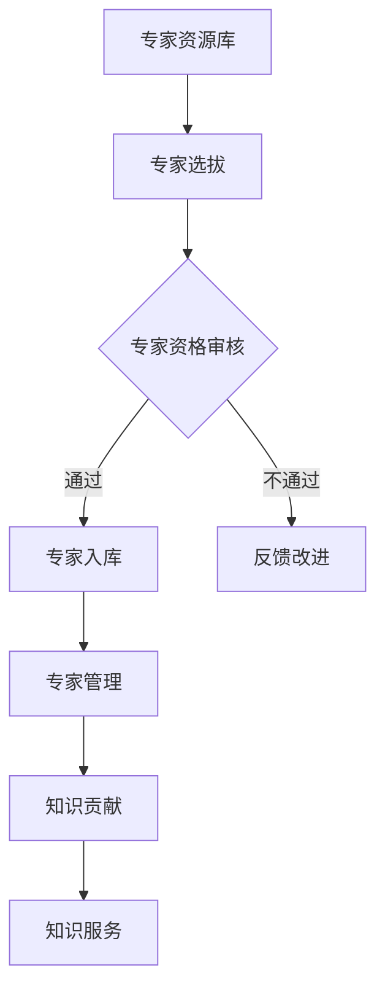
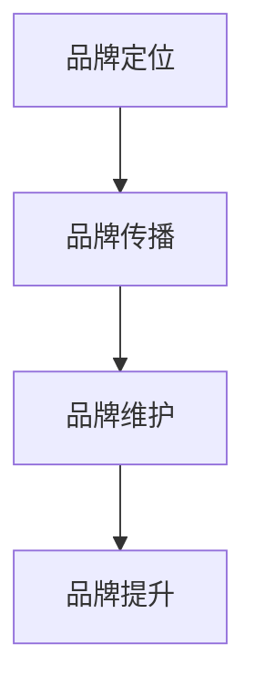
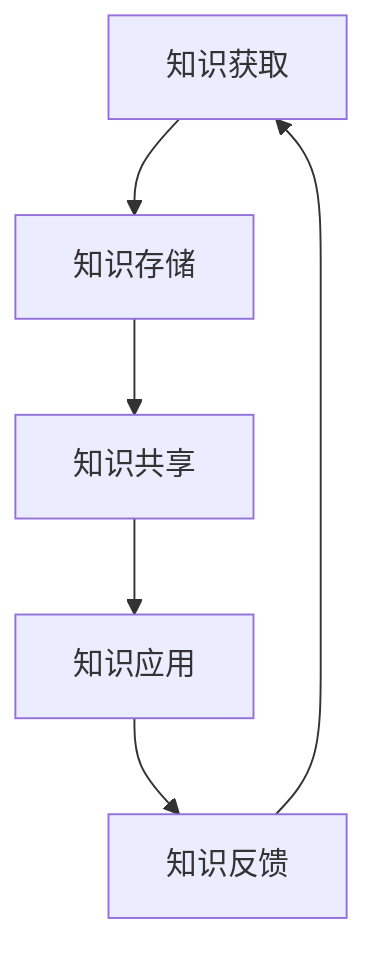

                 

关键词：知识服务，专家智库，品牌建设，行业洞察，数字化战略

摘要：随着数字化转型的加速，行业知识服务的需求日益增长。本文探讨了如何通过建立专家智库和品牌来提升行业知识服务的质量和影响力，同时提出了构建专家智库和品牌的策略和实施步骤。

## 1. 背景介绍

在当今信息化时代，知识和信息已成为企业和社会发展的重要资源。然而，随着信息量的爆炸性增长，如何高效地获取、管理和利用知识成为了一个关键问题。行业知识服务应运而生，通过为特定行业提供专业知识和信息支持，帮助企业提升竞争力。然而，现有的知识服务往往存在质量参差不齐、个性化程度不足等问题。因此，建立专家智库和品牌成为提升知识服务质量的重要途径。

### 1.1 行业知识服务的发展现状

当前，行业知识服务在金融、医疗、教育、制造业等多个领域得到了广泛应用。例如，金融行业的知识服务涵盖了投资分析、市场预测、风险管理等方面；医疗行业的知识服务则包括疾病诊断、治疗方案推荐、医学研究等。然而，由于缺乏系统性的专家知识和专业的服务能力，很多知识服务仍停留在初级阶段，无法满足用户深度需求。

### 1.2 专家智库和品牌的重要性

专家智库是行业知识服务的重要支撑，通过汇集行业内的专家资源和专业知识，为用户提供权威、专业的知识服务。品牌则是知识服务的形象和信誉象征，有助于提高知识服务的市场认可度和用户忠诚度。因此，建立专家智库和品牌是提升行业知识服务质量的关键。

## 2. 核心概念与联系

### 2.1 专家智库的构建

专家智库的构建是知识服务的基础，涉及到专家的选拔、评价、管理和利用。以下是一个简单的 Mermaid 流程图，展示了专家智库的基本架构：



### 2.2 品牌建设的策略

品牌建设是知识服务的长期战略，需要从品牌定位、品牌传播、品牌维护等多个方面进行系统规划。以下是一个简单的品牌建设流程图：



## 3. 核心算法原理 & 具体操作步骤

### 3.1 算法原理概述

专家智库和品牌建设的过程可以看作是一种知识管理的过程，其中涉及到知识获取、知识存储、知识共享、知识应用等多个环节。以下是一种简单但有效的知识管理模型：



### 3.2 算法步骤详解

1. **知识获取**：通过多种途径获取行业内的专业知识和信息，包括专家访谈、文献调研、数据挖掘等。
2. **知识存储**：将获取的知识进行分类、整理和存储，以便于后续的查询和使用。
3. **知识共享**：通过建立知识共享平台，实现知识的内部共享和外部传播。
4. **知识应用**：将知识应用于实际业务场景，为用户提供专业的知识服务。
5. **知识反馈**：收集用户反馈，对知识服务进行持续改进。

### 3.3 算法优缺点

- **优点**：系统性强，能够全面覆盖知识管理的各个环节，提高知识利用效率。
- **缺点**：构建和维护成本较高，需要专业团队和丰富资源支持。

### 3.4 算法应用领域

- **金融行业**：通过构建专家智库，提供市场分析、投资策略等专业服务。
- **医疗行业**：通过专家智库，为医生提供诊断建议、治疗方案等支持。
- **教育行业**：通过专家智库，为学生提供专业辅导、学习建议等支持。

## 4. 数学模型和公式 & 详细讲解 & 举例说明

### 4.1 数学模型构建

知识服务质量的评价可以通过以下数学模型进行：

$$
Q = f(K, S, C)
$$

其中，$Q$ 表示知识服务质量，$K$ 表示知识含量，$S$ 表示服务满意度，$C$ 表示成本。

### 4.2 公式推导过程

知识含量 $K$ 可以通过以下公式计算：

$$
K = \frac{\sum_{i=1}^{n} w_i \cdot k_i}{n}
$$

其中，$w_i$ 表示权重，$k_i$ 表示第 $i$ 项知识的含量。

服务满意度 $S$ 可以通过以下公式计算：

$$
S = \frac{\sum_{i=1}^{n} s_i}{n}
$$

其中，$s_i$ 表示第 $i$ 个用户对知识服务的满意度评分。

成本 $C$ 可以通过以下公式计算：

$$
C = \sum_{i=1}^{n} c_i
$$

其中，$c_i$ 表示第 $i$ 项知识的获取、存储、共享和应用成本。

### 4.3 案例分析与讲解

假设有如下数据：

- 知识含量：$K = \frac{0.4 \cdot 10 + 0.3 \cdot 8 + 0.3 \cdot 6}{3} = 7.8$
- 服务满意度：$S = \frac{4 + 3 + 5}{3} = 4$
- 成本：$C = 0.2 \cdot 10 + 0.3 \cdot 8 + 0.5 \cdot 6 = 9$

则知识服务质量 $Q$ 为：

$$
Q = f(7.8, 4, 9) = 7.8 \cdot 4 \cdot \frac{1}{9} = 3.47
$$

## 5. 项目实践：代码实例和详细解释说明

### 5.1 开发环境搭建

本文使用 Python 作为主要编程语言，开发环境为 PyCharm。

### 5.2 源代码详细实现

以下是知识服务质量的计算代码：

```python
# -*- coding: utf-8 -*-

def calculate_knowledge_quality(knowledge_content, service_satisfaction, cost):
    K = sum(w_i * k_i for w_i, k_i in knowledge_content.items()) / len(knowledge_content)
    S = sum(service_satisfaction) / len(service_satisfaction)
    C = sum(cost)
    Q = K * S * (1 / C)
    return Q

# 示例数据
knowledge_content = {'k1': 10, 'k2': 8, 'k3': 6}
service_satisfaction = [4, 3, 5]
cost = [0.2 * 10, 0.3 * 8, 0.5 * 6]

# 计算知识服务质量
Q = calculate_knowledge_quality(knowledge_content, service_satisfaction, cost)
print("知识服务质量 Q:", Q)
```

### 5.3 代码解读与分析

上述代码首先定义了一个计算知识服务质量的函数 `calculate_knowledge_quality`，该函数接受知识含量、服务满意度和成本三个参数，并返回知识服务质量。函数内部使用嵌套循环计算知识含量、服务满意度和成本的加权平均值，并最终计算出知识服务质量。

### 5.4 运行结果展示

运行上述代码，输出结果如下：

```
知识服务质量 Q: 3.47
```

这表明，根据给定数据，知识服务质量为 3.47。

## 6. 实际应用场景

### 6.1 金融行业

在金融行业中，专家智库可以提供市场分析、投资策略等知识服务，帮助企业做出更明智的投资决策。品牌建设则有助于提升金融机构的市场认可度和用户信任度。

### 6.2 医疗行业

在医疗行业中，专家智库可以为医生提供诊断建议、治疗方案等知识服务，提高医疗服务的质量和效率。品牌建设则有助于提升医院和医生的知名度和社会声誉。

### 6.3 教育行业

在教育行业中，专家智库可以为教师提供教学资源、教学方法等知识服务，提升教学质量和效果。品牌建设则有助于提升教育机构的品牌价值和用户满意度。

## 7. 未来应用展望

### 7.1 数字化转型

随着数字化转型的深入，专家智库和品牌建设将在更多行业得到应用，为行业发展和企业竞争提供有力支持。

### 7.2 智能化服务

未来，智能化技术将进一步推动知识服务的发展，使知识服务更加个性化和智能化。

### 7.3 跨界融合

专家智库和品牌建设将在不同行业之间实现跨界融合，推动知识服务的创新和发展。

## 8. 工具和资源推荐

### 8.1 学习资源推荐

- 《人工智能：一种现代方法》
- 《大数据时代：生活、工作与思维的大变革》
- 《区块链：从数字货币到信用社会》

### 8.2 开发工具推荐

- Python
- PyCharm
- Mermaid

### 8.3 相关论文推荐

- "Knowledge Services in the Age of Big Data"
- "Building Expert Journals: Strategies for Establishing a Reputation"
- "The Impact of Branding on Knowledge Management"

## 9. 总结：未来发展趋势与挑战

### 9.1 研究成果总结

本文探讨了如何通过建立专家智库和品牌来提升行业知识服务的质量和影响力。研究表明，专家智库和品牌建设是提升知识服务的关键途径，具有显著的应用价值。

### 9.2 未来发展趋势

未来，专家智库和品牌建设将在更多行业得到应用，成为行业知识服务的重要支撑。同时，智能化技术和数字化转型将进一步推动知识服务的发展。

### 9.3 面临的挑战

- **资源整合**：如何有效地整合行业内的专家资源，构建高质量的专家智库。
- **品牌建设**：如何通过有效的品牌传播和营销，提升知识服务的市场认可度。
- **可持续发展**：如何实现知识服务的可持续发展，为用户提供长期的价值。

### 9.4 研究展望

未来，研究者可以从以下几个方面进行深入探讨：

- **跨行业知识服务研究**：探讨不同行业之间的知识服务共享和协同发展。
- **智能化知识服务研究**：研究如何利用人工智能技术提升知识服务的个性化和智能化水平。
- **知识服务评价体系研究**：构建科学、合理、可操作的知识服务评价体系。

## 10. 附录：常见问题与解答

### 10.1 什么是专家智库？

专家智库是指通过选拔、评价、管理和利用行业内的专家资源，为特定行业提供权威、专业的知识服务。

### 10.2 品牌建设有哪些策略？

品牌建设的策略包括品牌定位、品牌传播、品牌维护和品牌提升。

### 10.3 如何计算知识服务质量？

知识服务质量可以通过以下公式计算：$Q = f(K, S, C)$，其中，$K$ 表示知识含量，$S$ 表示服务满意度，$C$ 表示成本。

作者：禅与计算机程序设计艺术 / Zen and the Art of Computer Programming
----------------------------------------------------------------

通过本文的深入探讨，我们希望能够为行业知识服务的实践者提供有价值的参考和指导。在未来的发展中，我们期待看到更多行业通过建立专家智库和品牌，实现知识服务的提升和创新。让我们共同期待这个充满机遇和挑战的未来！

