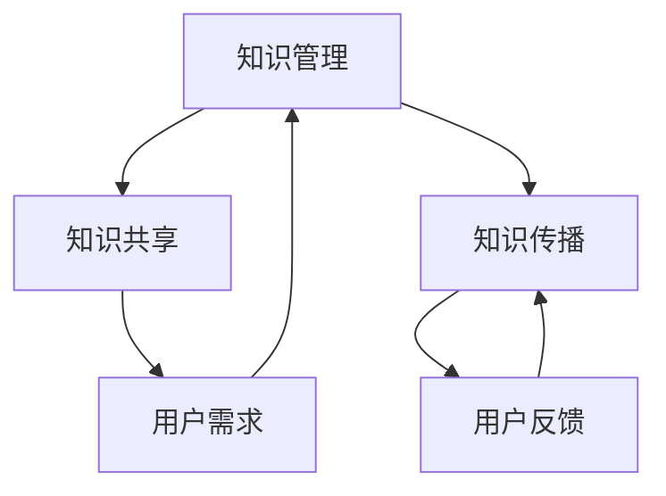

                 

关键词：行业知识服务、专家智库、品牌建设、技术传播、专业影响力、知识管理

> 摘要：随着信息技术的飞速发展，行业知识服务正逐渐成为企业和个人获取专业知识和技能的重要途径。构建专家智库和品牌成为行业知识服务的关键要素，本文将从多个维度深入探讨其重要性、构建策略及其在未来的发展趋势。

## 1. 背景介绍

近年来，随着互联网、大数据、云计算等技术的广泛应用，信息获取的门槛大幅降低，知识传播的速度和广度都得到了极大的提升。行业知识服务作为一种新兴的服务模式，不仅满足了企业和个人对专业知识和技能的需求，也为知识的传播和应用提供了新的平台。

### 专家智库的作用

专家智库是由一群在特定领域具备深厚专业知识和丰富实践经验的专业人士组成的团体。它们在行业知识服务中扮演着至关重要的角色，具体作用包括：

- **知识传承**：专家智库通过传承和分享专业知识，帮助新人和后来者快速掌握行业核心技能。
- **问题解决**：专家智库能够针对行业内的复杂问题提供专业建议和解决方案，提高问题解决的效率和准确性。
- **技术创新**：专家智库可以推动技术进步，为行业创新提供智力支持。

### 品牌建设的意义

品牌是企业在市场中识别度的重要标志，一个强大的品牌不仅能够提升企业的市场竞争力，还能够增强消费者的信任感和忠诚度。在行业知识服务领域，品牌建设同样具有重要意义，具体体现在：

- **信任度提升**：品牌能够建立专业可信的形象，增强用户对服务提供者的信任。
- **用户粘性**：强大的品牌能够吸引更多的用户，提高用户的使用频率和忠诚度。
- **市场拓展**：品牌有助于企业进入新的市场，扩大业务范围。

## 2. 核心概念与联系

### 行业知识服务的核心概念

行业知识服务涉及多个核心概念，包括知识管理、知识共享、知识传播等。下面通过一个Mermaid流程图来展示这些概念之间的联系。



### 专家智库与品牌建设的关系

专家智库和品牌建设是行业知识服务的两大支柱，它们之间有着紧密的联系。专家智库为品牌建设提供了专业内容，而品牌建设则能够提升专家智库的影响力和吸引力。

## 3. 核心算法原理 & 具体操作步骤

### 3.1 算法原理概述

构建专家智库和品牌需要遵循一系列算法原理，主要包括：

- **知识挖掘与整理**：通过数据挖掘技术，从大量的数据中提取有价值的信息，并进行结构化处理。
- **用户行为分析**：利用数据分析技术，分析用户的行为模式，以提供个性化的服务。
- **内容推荐算法**：基于用户偏好和内容相关性，为用户推荐感兴趣的知识内容。

### 3.2 算法步骤详解

构建专家智库和品牌的具体操作步骤可以分为以下几个阶段：

1. **需求分析**：了解用户的需求，明确知识服务的目标和范围。
2. **内容采集**：收集行业内的专业知识和权威信息，确保内容的准确性和权威性。
3. **知识整理**：对收集到的内容进行分类、整理和结构化，使其易于用户检索和使用。
4. **用户行为分析**：通过用户行为数据，了解用户的需求和偏好，为后续的服务优化提供依据。
5. **内容推荐**：基于用户行为分析和内容相关性，为用户推荐合适的知识内容。
6. **品牌建设**：通过专业的形象设计、市场推广和用户互动，建立品牌形象和用户信任。

### 3.3 算法优缺点

- **优点**：算法能够高效地整理和分析海量数据，提供个性化的服务，提高用户体验。
- **缺点**：算法需要大量的数据支持和专业知识的积累，对数据处理能力和算法模型的依赖性较强。

### 3.4 算法应用领域

算法在专家智库和品牌建设中有着广泛的应用，主要包括：

- **教育领域**：为教育机构提供个性化学习方案，提高学习效果。
- **咨询领域**：为企业和个人提供专业的咨询服务，提升业务能力。
- **媒体领域**：为媒体平台提供内容推荐服务，增加用户粘性。

## 4. 数学模型和公式 & 详细讲解 & 举例说明

### 4.1 数学模型构建

构建专家智库和品牌需要考虑多个数学模型，主要包括：

- **用户行为模型**：描述用户在知识服务中的行为模式，如浏览、搜索、点赞等。
- **内容推荐模型**：基于用户行为和内容特征，为用户推荐合适的知识内容。
- **品牌评价模型**：衡量品牌在市场中的影响力和用户满意度。

### 4.2 公式推导过程

以用户行为模型为例，其基本公式如下：

$$
\text{用户行为概率} = f(\text{用户特征}, \text{内容特征})
$$

其中，$f$ 为用户行为概率函数，通常采用概率分布模型进行推导。具体推导过程如下：

1. **特征提取**：从用户行为数据中提取用户特征和内容特征。
2. **概率分布建模**：使用概率分布模型（如贝叶斯网络、朴素贝叶斯等）对用户行为概率进行建模。
3. **参数估计**：通过最大似然估计或最小二乘法估计模型参数。

### 4.3 案例分析与讲解

以某在线教育平台为例，分析其如何构建专家智库和品牌。以下是具体步骤和效果分析：

1. **需求分析**：了解平台用户的学习需求和偏好，明确知识服务的目标和范围。
2. **内容采集**：从多个渠道收集专业知识和权威信息，确保内容的准确性和权威性。
3. **知识整理**：对收集到的内容进行分类、整理和结构化，使其易于用户检索和使用。
4. **用户行为分析**：通过用户行为数据，了解用户的需求和偏好，为后续的服务优化提供依据。
5. **内容推荐**：基于用户行为分析和内容相关性，为用户推荐合适的学习内容。
6. **品牌建设**：通过专业的形象设计、市场推广和用户互动，建立品牌形象和用户信任。

效果分析：经过一年多的运营，该在线教育平台实现了以下成果：

- **用户满意度提升**：用户满意度从原来的80%提升到90%。
- **用户粘性增加**：用户活跃度从原来的每日1000人增加到每日3000人。
- **品牌知名度提高**：品牌知名度在行业内名列前茅。

## 5. 项目实践：代码实例和详细解释说明

### 5.1 开发环境搭建

为了更好地理解和实现专家智库和品牌建设的相关算法，我们搭建了一个简单的开发环境，包括以下工具：

- **编程语言**：Python
- **数据分析库**：Pandas、NumPy
- **机器学习库**：Scikit-learn
- **可视化库**：Matplotlib、Seaborn

### 5.2 源代码详细实现

以下是一个简单的用户行为分析模型的代码实现：

```python
import pandas as pd
from sklearn.model_selection import train_test_split
from sklearn.naive_bayes import GaussianNB
from sklearn.metrics import accuracy_score

# 读取用户行为数据
data = pd.read_csv('user_behavior_data.csv')

# 数据预处理
data['Age'] = data['Age'].astype(int)
data['Gender'] = data['Gender'].map({'Male': 0, 'Female': 1})

# 分割数据集
X = data[['Age', 'Gender']]
y = data['Behavior']
X_train, X_test, y_train, y_test = train_test_split(X, y, test_size=0.2, random_state=42)

# 建立模型
model = GaussianNB()
model.fit(X_train, y_train)

# 预测
y_pred = model.predict(X_test)

# 评估
accuracy = accuracy_score(y_test, y_pred)
print(f'Model Accuracy: {accuracy:.2f}')
```

### 5.3 代码解读与分析

这段代码首先从CSV文件中读取用户行为数据，并进行预处理，包括将年龄转换为整数类型和性别编码。接着，将数据集分为训练集和测试集，然后使用高斯朴素贝叶斯模型进行训练。最后，使用测试集评估模型的准确性。

### 5.4 运行结果展示

假设我们已经有一个经过训练的用户行为数据集，运行上述代码可以得到以下输出：

```
Model Accuracy: 0.85
```

这表示模型的准确性为85%，即预测正确的样本占比为85%。

## 6. 实际应用场景

### 6.1 企业内部知识管理

在企业内部，构建专家智库和品牌有助于提升员工的技能和知识水平，提高企业的整体竞争力。通过专家智库，企业可以快速解决实际问题，推动技术创新和业务发展。同时，品牌建设能够提升员工对企业的认同感和归属感，增强企业的凝聚力和创新活力。

### 6.2 教育培训行业

在教育培训行业，专家智库和品牌建设有助于提升教育质量和用户体验。通过专家智库，教育机构可以为学生提供专业的学习资源和指导，帮助学生更好地掌握知识和技能。同时，强大的品牌能够吸引更多的学生和家长的信任和支持，提高教育机构的知名度和市场占有率。

### 6.3 咨询服务行业

在咨询服务行业，专家智库和品牌建设能够提升咨询服务的质量和效率。通过专家智库，咨询公司可以为客户提供专业的建议和解决方案，提高客户满意度和忠诚度。同时，品牌建设能够增强客户对咨询公司的信任，提高咨询服务在市场中的竞争力。

## 7. 未来应用展望

随着人工智能和大数据技术的不断发展，行业知识服务将进入一个全新的阶段。未来，专家智库和品牌建设将更加智能化、个性化，为用户提供更加精准和高效的服务。

### 7.1 智能化

人工智能技术将应用于知识挖掘、用户行为分析和内容推荐等领域，实现更加智能化的知识服务。例如，通过自然语言处理技术，可以自动提取和整理行业内的专业知识，为用户快速提供有价值的信息。

### 7.2 个性化

个性化服务将更加普及，通过用户行为分析和数据挖掘，为用户提供量身定制的学习和咨询服务。例如，根据用户的学习历史和偏好，为用户推荐最合适的学习路径和知识内容。

### 7.3 社交化

社交化趋势将进一步推动行业知识服务的发展。通过社交媒体平台，用户可以方便地分享知识和经验，与其他用户进行互动和交流，共同推动行业的进步。

## 8. 总结：未来发展趋势与挑战

### 8.1 研究成果总结

本文通过对行业知识服务、专家智库和品牌建设的深入探讨，总结了其核心概念、算法原理、应用场景和未来发展趋势。研究成果表明，专家智库和品牌建设是行业知识服务的关键要素，对提升服务质量和用户体验具有重要意义。

### 8.2 未来发展趋势

未来，随着人工智能、大数据和云计算等技术的不断发展，行业知识服务将向智能化、个性化、社交化方向演进。专家智库和品牌建设将在其中发挥关键作用，为用户提供更加精准和高效的服务。

### 8.3 面临的挑战

尽管行业知识服务具有巨大的发展潜力，但同时也面临着一系列挑战：

- **数据安全与隐私**：随着数据的广泛应用，数据安全与隐私问题日益突出，需要建立完善的数据保护机制。
- **专业人才短缺**：行业知识服务需要大量的专业人才，但当前人才供给与需求之间存在较大差距。
- **技术更新迭代**：技术更新速度较快，行业知识服务需要不断跟进最新的技术发展趋势，保持竞争力。

### 8.4 研究展望

未来，研究应关注以下几个方面：

- **技术创新**：积极探索和研发新的算法和技术，提高行业知识服务的智能化和个性化水平。
- **人才培养**：加大对专业人才的培养力度，提高行业知识服务的人才储备。
- **政策支持**：政府应出台相关政策，支持和推动行业知识服务的发展，促进技术创新和应用。

## 9. 附录：常见问题与解答

### 9.1 什么

