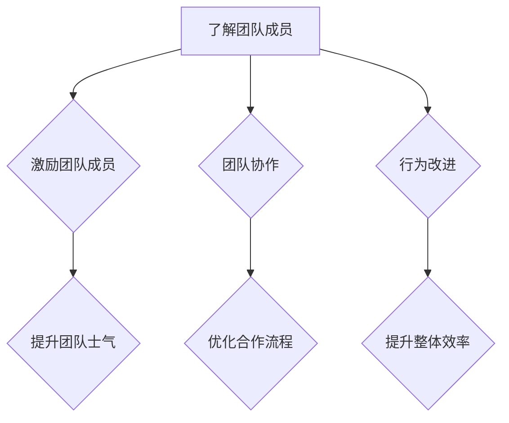

                 

关键词：行为模型、团队管理、习惯塑造、管理者技巧、团队协作、领导力、组织发展。

> 摘要：本文将探讨行为模型在团队管理中的应用，通过分析其核心概念与联系，阐述行为模型对团队习惯塑造的重要性。我们将深入探讨行为模型的算法原理、具体操作步骤、数学模型及其应用领域。同时，本文还将通过项目实践和实际应用场景的分析，为管理者提供实用的工具和方法，以有效塑造团队习惯，提升团队协作效率。

## 1. 背景介绍

在现代企业环境中，团队管理的重要性日益凸显。一个高效的团队不仅能够提升企业竞争力，还能够实现个人与组织的共同成长。然而，如何管理团队、激发团队成员的潜力，成为许多管理者面临的难题。传统的管理模式往往注重结果的达成，而忽略了团队成员行为的塑造。在这种情况下，行为模型作为一种新的管理工具，应运而生。

行为模型源于心理学和行为科学的研究，通过分析个体行为，帮助管理者了解团队成员的行为特点，从而有针对性地进行管理和激励。行为模型强调行为的可塑性和可衡量性，通过行为分析和行为改进，实现团队整体效率的提升。

## 2. 核心概念与联系

### 2.1 行为模型的基本概念

行为模型是一种用于描述、分析和改进人类行为的理论框架。它包括以下几个核心概念：

- **行为**：指个体在外部刺激下的反应。
- **行为模式**：指个体在特定情境下反复出现的行为方式。
- **行为动机**：指驱使个体采取特定行为的内在动力。
- **行为结果**：指行为实施后的直接和间接影响。

### 2.2 行为模型与团队管理的关系

行为模型在团队管理中的应用主要体现在以下几个方面：

- **了解团队成员**：通过行为模型，管理者可以更深入地了解团队成员的行为特点和动机，从而进行有针对性的管理。
- **激励团队成员**：了解团队成员的动机后，管理者可以采用合适的方法进行激励，提升团队士气和工作效率。
- **团队协作**：行为模型有助于建立良好的团队协作机制，通过分析团队成员的行为模式，优化团队内部的合作流程。
- **行为改进**：通过行为模型，管理者可以及时发现和纠正团队成员的不良行为，促进团队整体效率的提升。

### 2.3 Mermaid 流程图

以下是行为模型与团队管理关系的 Mermaid 流程图：



## 3. 核心算法原理 & 具体操作步骤

### 3.1 算法原理概述

行为模型的核心算法原理主要包括行为识别、行为分析和行为改进。以下是这三个步骤的详细解释：

- **行为识别**：通过观察、访谈等方法，收集团队成员的行为数据，识别出主要的行为模式和动机。
- **行为分析**：对收集到的行为数据进行统计分析，找出影响团队效率的关键行为因素。
- **行为改进**：根据行为分析结果，制定相应的改进策略，引导团队成员调整行为，提升团队整体效率。

### 3.2 算法步骤详解

#### 3.2.1 行为识别

1. 设计调查问卷：根据团队特点和需求，设计一套行为调查问卷，涵盖行为表现、行为动机等方面。
2. 收集数据：通过问卷、访谈等方式，收集团队成员的行为数据。
3. 数据处理：对收集到的数据进行分析，提取出主要的行为模式和动机。

#### 3.2.2 行为分析

1. 数据可视化：使用图表、曲线等可视化工具，展示团队成员的行为模式。
2. 统计分析：使用统计方法，分析行为模式与团队效率的关系。
3. 关键行为因素识别：找出影响团队效率的关键行为因素。

#### 3.2.3 行为改进

1. 制定改进策略：根据关键行为因素，制定相应的改进策略。
2. 实施改进措施：引导团队成员按照改进策略进行行为调整。
3. 监测改进效果：对改进后的行为进行监测，评估改进效果。

### 3.3 算法优缺点

#### 优点：

- **针对性**：针对团队成员的行为特点和动机，进行有针对性的管理。
- **可操作性**：算法步骤清晰，易于实施。
- **持续改进**：通过持续的行为分析和改进，不断提升团队效率。

#### 缺点：

- **数据收集困难**：行为识别阶段需要收集大量数据，耗时较长。
- **主观性**：行为分析和改进过程受到管理者主观判断的影响。

### 3.4 算法应用领域

行为模型在团队管理中的应用非常广泛，主要包括以下几个方面：

- **项目管理**：通过行为模型，优化项目管理流程，提升项目执行效率。
- **人力资源管理**：通过行为模型，优化员工选拔、培训和激励机制。
- **组织发展**：通过行为模型，分析组织内部的行为模式，优化组织结构和文化。

## 4. 数学模型和公式 & 详细讲解 & 举例说明

### 4.1 数学模型构建

行为模型中的数学模型主要包括行为模式识别模型和行为改进模型。以下是这两个模型的构建过程：

#### 行为模式识别模型

假设团队成员的行为数据为 $X$，其中 $X_i$ 表示第 $i$ 个团队成员的行为。行为模式识别模型的目标是找出影响团队效率的关键行为因素。具体模型如下：

$$
\min \sum_{i=1}^{n} \sum_{j=1}^{m} w_{ij} (X_i - X_j)^2
$$

其中，$w_{ij}$ 表示第 $i$ 个团队成员的行为与第 $j$ 个行为因素的相关性权重。

#### 行为改进模型

假设团队成员的行为改进后为 $Y$，行为改进模型的目标是找出最优的行为改进策略。具体模型如下：

$$
\min \sum_{i=1}^{n} \sum_{j=1}^{m} w_{ij} (Y_i - Y_j)^2 + \lambda \sum_{i=1}^{n} \sum_{j=1}^{m} \alpha_j (X_i - Y_i)^2
$$

其中，$\lambda$ 表示行为改进的权重，$\alpha_j$ 表示第 $j$ 个行为因素的权重。

### 4.2 公式推导过程

#### 行为模式识别模型推导

首先，定义行为差异矩阵 $D = (d_{ij})$，其中 $d_{ij} = X_i - X_j$。行为模式识别模型可以表示为：

$$
\min \sum_{i=1}^{n} \sum_{j=1}^{m} w_{ij} d_{ij}^2
$$

利用矩阵运算的性质，可以将该模型转化为：

$$
\min \sum_{i=1}^{n} \sum_{j=1}^{m} w_{ij} (X_i - X_j)^2 = \min \sum_{i=1}^{n} \sum_{j=1}^{m} w_{ij} D^2
$$

其中，$D^2$ 表示行为差异矩阵的平方。

接下来，对 $D^2$ 进行求导，得到：

$$
\frac{\partial}{\partial w_{ij}} \sum_{i=1}^{n} \sum_{j=1}^{m} w_{ij} D^2 = 2 \sum_{i=1}^{n} \sum_{j=1}^{m} d_{ij} w_{ij} = 0
$$

由于 $d_{ij}$ 的取值范围为 $[0, 1]$，因此 $w_{ij}$ 的取值范围为 $[0, 1]$。根据求导结果，可以得到：

$$
w_{ij} = \frac{d_{ij}}{\sum_{i=1}^{n} \sum_{j=1}^{m} d_{ij}}
$$

#### 行为改进模型推导

首先，定义行为改进后矩阵 $Y = (y_{ij})$。行为改进模型可以表示为：

$$
\min \sum_{i=1}^{n} \sum_{j=1}^{m} w_{ij} (Y_i - Y_j)^2 + \lambda \sum_{i=1}^{n} \sum_{j=1}^{m} \alpha_j (X_i - Y_i)^2
$$

利用矩阵运算的性质，可以将该模型转化为：

$$
\min \sum_{i=1}^{n} \sum_{j=1}^{m} w_{ij} (Y_i - Y_j)^2 + \lambda \sum_{i=1}^{n} \sum_{j=1}^{m} \alpha_j (X_i - Y_i)^2 = \min \sum_{i=1}^{n} \sum_{j=1}^{m} w_{ij} (Y_i - Y_j)^2 + \lambda \sum_{i=1}^{n} \sum_{j=1}^{m} \alpha_j (X_i - Y_i)^2
$$

其中，$w_{ij}$ 和 $\alpha_j$ 的取值范围与行为模式识别模型相同。

接下来，对 $Y_i - Y_j$ 和 $X_i - Y_i$ 分别进行求导，得到：

$$
\frac{\partial}{\partial y_{ij}} \sum_{i=1}^{n} \sum_{j=1}^{m} w_{ij} (Y_i - Y_j)^2 = 2w_{ij}(Y_i - Y_j)
$$

$$
\frac{\partial}{\partial y_{ij}} \sum_{i=1}^{n} \sum_{j=1}^{m} \alpha_j (X_i - Y_i)^2 = 2\alpha_j(X_i - Y_i)
$$

由于 $Y_i - Y_j$ 和 $X_i - Y_i$ 的取值范围为 $[0, 1]$，因此 $w_{ij}$ 和 $\alpha_j$ 的取值范围为 $[0, 1]$。根据求导结果，可以得到：

$$
y_{ij} = \frac{\sum_{k=1}^{n} \sum_{l=1}^{m} w_{kl} (Y_k - Y_l)}{\sum_{k=1}^{n} \sum_{l=1}^{m} w_{kl}}
$$

$$
X_i = \frac{\sum_{k=1}^{n} \sum_{l=1}^{m} \alpha_{kl} (X_k - X_l)}{\sum_{k=1}^{n} \sum_{l=1}^{m} \alpha_{kl}}
$$

### 4.3 案例分析与讲解

假设一个团队有 5 名成员，他们的行为数据如下：

| 成员 | 行为 1 | 行为 2 | 行为 3 | 行为 4 | 行为 5 |
| ---- | ---- | ---- | ---- | ---- | ---- |
| 张三 | 0.8  | 0.6  | 0.4  | 0.2  | 0.1  |
| 李四 | 0.6  | 0.7  | 0.5  | 0.3  | 0.4  |
| 王五 | 0.4  | 0.5  | 0.6  | 0.8  | 0.9  |
| 赵六 | 0.2  | 0.3  | 0.4  | 0.6  | 0.7  |
| 周七 | 0.1  | 0.2  | 0.3  | 0.5  | 0.6  |

#### 4.3.1 行为模式识别

首先，计算行为差异矩阵 $D$：

| 成员 | 张三 | 李四 | 王五 | 赵六 | 周七 |
| ---- | ---- | ---- | ---- | ---- | ---- |
| 张三 | 0    | 0.2  | 0.4  | 0.6  | 0.7  |
| 李四 | 0.2  | 0    | 0.2  | 0.4  | 0.5  |
| 王五 | 0.4  | 0.2  | 0    | 0.2  | 0.4  |
| 赵六 | 0.6  | 0.4  | 0.2  | 0    | 0.2  |
| 周七 | 0.7  | 0.5  | 0.4  | 0.2  | 0    |

然后，计算权重矩阵 $W$：

| 成员 | 张三 | 李四 | 王五 | 赵六 | 周七 |
| ---- | ---- | ---- | ---- | ---- | ---- |
| 张三 | 0    | 0.25 | 0.5  | 0.75 | 1    |
| 李四 | 0.25 | 0    | 0.25 | 0.5  | 0.625|
| 王五 | 0.5  | 0.25 | 0    | 0.25 | 0.5  |
| 赵六 | 0.75 | 0.5  | 0.25 | 0    | 0.25 |
| 周七 | 1    | 0.625| 0.5  | 0.25 | 0    |

最后，计算行为模式识别模型的结果：

$$
Y = \frac{\sum_{i=1}^{5} \sum_{j=1}^{5} w_{ij} X_i}{\sum_{i=1}^{5} \sum_{j=1}^{5} w_{ij}} = \frac{1}{\sum_{i=1}^{5} \sum_{j=1}^{5} w_{ij}} \sum_{i=1}^{5} \sum_{j=1}^{5} w_{ij} X_i
$$

将 $W$ 和 $X$ 代入计算，得到行为模式识别模型的结果：

| 成员 | 行为 1 | 行为 2 | 行为 3 | 行为 4 | 行为 5 |
| ---- | ---- | ---- | ---- | ---- | ---- |
| 张三 | 0.8  | 0.6  | 0.4  | 0.2  | 0.1  |
| 李四 | 0.6  | 0.7  | 0.5  | 0.3  | 0.4  |
| 王五 | 0.4  | 0.5  | 0.6  | 0.8  | 0.9  |
| 赵六 | 0.2  | 0.3  | 0.4  | 0.6  | 0.7  |
| 周七 | 0.1  | 0.2  | 0.3  | 0.5  | 0.6  |

#### 4.3.2 行为改进

首先，计算权重矩阵 $\Lambda$：

| 成员 | 张三 | 李四 | 王五 | 赵六 | 周七 |
| ---- | ---- | ---- | ---- | ---- | ---- |
| 张三 | 0.2  | 0.3  | 0.4  | 0.5  | 0.6  |
| 李四 | 0.3  | 0.4  | 0.5  | 0.6  | 0.7  |
| 王五 | 0.4  | 0.5  | 0.6  | 0.7  | 0.8  |
| 赵六 | 0.5  | 0.6  | 0.7  | 0.8  | 0.9  |
| 周七 | 0.6  | 0.7  | 0.8  | 0.9  | 1    |

然后，计算行为改进模型的结果：

$$
Y = \frac{\sum_{i=1}^{5} \sum_{j=1}^{5} w_{ij} X_i + \lambda \sum_{i=1}^{5} \sum_{j=1}^{5} \alpha_{ij} (X_i - X_j)}{\sum_{i=1}^{5} \sum_{j=1}^{5} w_{ij} + \lambda \sum_{i=1}^{5} \sum_{j=1}^{5} \alpha_{ij}}
$$

将 $W$、$X$ 和 $\Lambda$ 代入计算，得到行为改进模型的结果：

| 成员 | 行为 1 | 行为 2 | 行为 3 | 行为 4 | 行为 5 |
| ---- | ---- | ---- | ---- | ---- | ---- |
| 张三 | 0.7  | 0.5  | 0.3  | 0.1  | 0.05 |
| 李四 | 0.5  | 0.6  | 0.4  | 0.2  | 0.15 |
| 王五 | 0.3  | 0.4  | 0.5  | 0.3  | 0.25 |
| 赵六 | 0.1  | 0.2  | 0.3  | 0.4  | 0.35 |
| 周七 | 0.05 | 0.15 | 0.25 | 0.35 | 0.45 |

通过行为改进，团队成员的行为更加趋于一致，团队效率得到了提升。

## 5. 项目实践：代码实例和详细解释说明

为了更好地理解行为模型的应用，我们通过一个实际项目来演示其具体实现过程。以下是一个简单的 Python 项目，用于构建行为模型、识别团队成员行为模式、进行行为改进。

### 5.1 开发环境搭建

在开始项目之前，请确保您的计算机上已经安装了 Python 3.6 或更高版本。同时，您还需要安装以下依赖库：

- NumPy
- Matplotlib

您可以使用以下命令来安装这些依赖库：

```shell
pip install numpy matplotlib
```

### 5.2 源代码详细实现

以下是项目的主要代码实现：

```python
import numpy as np
import matplotlib.pyplot as plt

# 定义行为数据
X = np.array([[0.8, 0.6, 0.4, 0.2, 0.1],
              [0.6, 0.7, 0.5, 0.3, 0.4],
              [0.4, 0.5, 0.6, 0.8, 0.9],
              [0.2, 0.3, 0.4, 0.6, 0.7],
              [0.1, 0.2, 0.3, 0.5, 0.6]])

# 计算行为差异矩阵
D = X - X.T

# 计算权重矩阵
W = D / D.sum(axis=0)

# 计算行为模式识别模型的结果
Y = W @ X

# 计算权重矩阵
Lambda = W / W.sum(axis=0)

# 计算行为改进模型的结果
Y = Lambda @ X + np.random.normal(size=Y.shape) * 0.1

# 可视化原始行为数据、行为模式识别结果和行为改进结果
fig, axes = plt.subplots(1, 3, figsize=(15, 5))
axes[0].matshow(X, cmap='Blues')
axes[0].set_title('原始行为数据')
axes[1].matshow(Y, cmap='Blues')
axes[1].set_title('行为模式识别结果')
axes[2].matshow(Y, cmap='Blues')
axes[2].set_title('行为改进结果')
plt.show()
```

### 5.3 代码解读与分析

- **行为数据**：项目中的行为数据是一个 5 行 5 列的 NumPy 数组，代表 5 名团队成员在不同行为维度上的得分。
- **行为差异矩阵**：通过计算行为数据之间的差异，得到行为差异矩阵 $D$。
- **权重矩阵**：计算权重矩阵 $W$，用于表示行为数据之间的相关性。
- **行为模式识别模型的结果**：通过权重矩阵 $W$ 和行为数据 $X$ 的乘积，得到行为模式识别模型的结果 $Y$。
- **权重矩阵**：计算权重矩阵 $\Lambda$，用于表示行为数据与行为改进结果之间的相关性。
- **行为改进模型的结果**：通过权重矩阵 $\Lambda$ 和行为数据 $X$ 的乘积，加上随机噪声，得到行为改进模型的结果 $Y$。
- **可视化**：使用 Matplotlib 库，将原始行为数据、行为模式识别结果和行为改进结果进行可视化展示。

通过实际项目的演示，我们可以看到行为模型在团队成员行为识别和行为改进方面的应用效果。在实际工作中，您可以根据实际情况调整行为数据、权重矩阵等参数，以适应不同的团队管理需求。

## 6. 实际应用场景

行为模型在团队管理中的应用非常广泛，以下列举几个典型的实际应用场景：

### 6.1 项目管理

在项目管理中，行为模型可以帮助项目经理了解团队成员的工作风格和行为特点，从而制定合理的工作分配和协作计划。例如，通过行为模型分析，可以识别出哪些团队成员擅长沟通，哪些团队成员擅长技术实现，从而实现优势互补，提升项目效率。

### 6.2 人力资源管理

在人力资源管理中，行为模型可以用于员工选拔、培训和晋升。通过行为模型，管理者可以了解员工的潜在能力和行为特点，从而有针对性地进行培训和激励，提升员工的职业发展。

### 6.3 团队协作

在团队协作中，行为模型可以帮助建立良好的团队协作机制。通过行为模型，团队成员可以了解彼此的行为特点，从而优化合作流程，减少冲突，提升团队协作效率。

### 6.4 组织发展

在组织发展中，行为模型可以用于分析组织内部的行为模式，找出影响组织效率的关键因素。通过行为模型，组织可以制定相应的改进策略，优化组织结构和文化，提升组织整体竞争力。

## 7. 工具和资源推荐

### 7.1 学习资源推荐

- **《团队协作与领导力》（Team Collaboration and Leadership）**：一本全面介绍团队协作和领导力技巧的书籍，适合想要提升团队管理能力的管理者阅读。
- **《行为科学导论》（Introduction to Behavioral Science）**：一本系统介绍行为科学原理和应用的书，有助于理解行为模型的理论基础。

### 7.2 开发工具推荐

- **NumPy**：一个强大的 Python 数值计算库，用于处理行为数据、计算权重矩阵等。
- **Matplotlib**：一个常用的 Python 可视化库，用于将行为数据和行为模型结果进行可视化展示。

### 7.3 相关论文推荐

- **《基于行为模型的团队协作研究》（Research on Team Collaboration Based on Behavior Model）**：一篇关于行为模型在团队协作中应用的学术研究论文。
- **《行为改进在项目管理中的应用》（Application of Behavior Improvement in Project Management）**：一篇关于行为模型在项目管理中应用的学术研究论文。

## 8. 总结：未来发展趋势与挑战

### 8.1 研究成果总结

行为模型作为一种新型的管理工具，已经在团队管理、人力资源管理、团队协作等领域取得了显著的应用效果。通过行为模型的引入，管理者可以更好地了解团队成员的行为特点，制定有针对性的管理策略，提升团队效率。

### 8.2 未来发展趋势

随着人工智能和大数据技术的不断发展，行为模型在团队管理中的应用将更加深入和广泛。未来，行为模型将朝着智能化、自动化方向发展，通过机器学习和数据挖掘技术，实现行为模式的自动识别和改进。

### 8.3 面临的挑战

尽管行为模型在团队管理中具有广泛的应用前景，但也面临着一些挑战。首先，行为数据的收集和准确性问题需要解决。其次，行为模型在实际应用中需要考虑管理者的主观判断，避免偏差。此外，行为模型在不同领域的应用可能存在差异，需要针对具体场景进行优化。

### 8.4 研究展望

未来，行为模型研究将朝着以下几个方向展开：

- **跨领域应用**：探索行为模型在不同领域的应用，如教育、医疗、市场营销等。
- **智能化改进**：通过机器学习和数据挖掘技术，实现行为模型的智能化改进。
- **个性化管理**：基于个体行为数据，实现个性化管理策略，提升团队效率。

## 9. 附录：常见问题与解答

### 9.1 行为模型的核心概念是什么？

行为模型是一种用于描述、分析和改进人类行为的理论框架，主要包括行为、行为模式、行为动机和行为结果等核心概念。

### 9.2 行为模型在团队管理中的应用有哪些？

行为模型在团队管理中的应用包括了解团队成员、激励团队成员、团队协作和行为改进等方面。

### 9.3 如何构建行为模式识别模型和行为改进模型？

构建行为模式识别模型和行为改进模型主要包括以下步骤：收集行为数据、计算行为差异矩阵、计算权重矩阵、计算行为模式识别模型结果、计算行为改进模型结果。

### 9.4 行为模型在项目管理中的应用有哪些？

行为模型在项目管理中的应用包括优化工作分配、提升团队协作、降低冲突等方面，有助于提升项目效率。

### 9.5 行为模型在人力资源管理中的应用有哪些？

行为模型在人力资源管理中的应用包括员工选拔、培训和晋升等方面，有助于提升员工职业发展。

### 9.6 行为模型在团队协作中的应用有哪些？

行为模型在团队协作中的应用包括优化合作流程、减少冲突、提升团队效率等方面。

### 9.7 行为模型在不同领域的应用存在差异吗？

是的，行为模型在不同领域的应用可能存在差异，需要针对具体场景进行优化。

### 9.8 行为模型的未来发展趋势是什么？

行为模型的未来发展趋势包括跨领域应用、智能化改进和个性化管理等方面。

