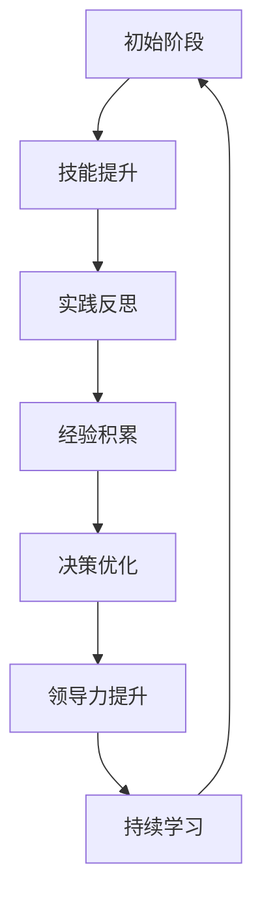

                 

关键词：管理技能、领导力、持续学习、专业成长、组织发展

> 摘要：本文探讨了在快速变化的科技行业中，管理者如何通过行动中学习不断提升自身能力，从而引领团队和组织走向成功。通过分析核心概念、算法原理、数学模型以及项目实践，本文为管理者提供了一套系统化的成长路径。

## 1. 背景介绍

在当今这个信息爆炸、技术更新迅速的时代，管理者面临的挑战日益复杂。传统的管理方式已经难以应对组织内部的多样性和外部环境的快速变化。因此，管理者需要具备持续学习的能力，以应对不断变化的市场需求和新的技术挑战。

### 1.1 管理者面临的挑战

- **信息过载**：大量的信息和数据不断涌现，管理者需要筛选出关键信息，做出明智的决策。
- **技术变革**：新技术不断涌现，管理者需要快速掌握并应用这些技术，保持组织的竞争力。
- **组织复杂性**：组织规模扩大，层级增多，管理者需要协调不同部门之间的合作，确保整体目标的实现。

### 1.2 行动中学习的重要性

行动中学习是指在实际工作中通过实践和反思来提升自身能力。管理者通过行动中学习，可以：

- **快速适应变化**：通过实践和反思，管理者能够迅速适应新的环境和需求。
- **提升决策能力**：通过实践中的不断尝试和总结，管理者可以做出更明智的决策。
- **增强领导力**：管理者通过行动中学习，能够更好地激发团队潜力，提升领导力。

## 2. 核心概念与联系

### 2.1 管理者成长模型

在分析管理者的成长过程中，我们可以将其视为一个动态的系统。以下是一个基于 Mermaid 的流程图，展示了管理者成长的各个阶段及其相互关系。



### 2.2 行动中学习的关键要素

- **知识积累**：管理者需要不断积累新知识，包括技术、管理理论和行业动态。
- **实践操作**：通过实际操作，管理者可以将理论知识应用到实践中，验证和改进自己的决策。
- **反思总结**：反思和总结是行动中学习的重要环节，管理者需要从实践中总结经验，找出问题和不足。
- **持续改进**：通过持续的学习和改进，管理者可以不断提升自身能力，适应新的挑战。

## 3. 核心算法原理 & 具体操作步骤

### 3.1 算法原理概述

管理者的成长过程可以看作是一种优化算法，其目标是最小化目标函数，即提升管理能力。以下是一个简化的算法流程：

1. **知识获取**：管理者通过学习获取新知识。
2. **实践应用**：将知识应用到实际工作中，进行实践。
3. **效果评估**：评估实践的效果，包括团队的绩效和自身的感受。
4. **调整优化**：根据评估结果调整管理策略，优化决策。

### 3.2 算法步骤详解

1. **知识获取**：
   - **内部学习**：通过内部培训、读书和经验交流获取知识。
   - **外部学习**：参加行业会议、研讨会和外部培训，了解行业最新动态。

2. **实践应用**：
   - **项目实践**：在项目中应用所学知识，解决实际问题。
   - **团队指导**：指导团队成员，将知识转化为团队的能力。

3. **效果评估**：
   - **绩效指标**：根据绩效指标评估实践效果。
   - **团队反馈**：收集团队成员的反馈，了解管理实践的效果。

4. **调整优化**：
   - **经验总结**：总结实践中的经验和教训。
   - **策略调整**：根据总结的结果调整管理策略。

### 3.3 算法优缺点

- **优点**：
  - **适应性**：管理者能够快速适应新的环境和需求。
  - **灵活性**：管理者可以根据实际情况灵活调整管理策略。

- **缺点**：
  - **时间成本**：行动中学习需要花费大量的时间和精力。
  - **风险**：在实践过程中，可能会遇到失败和挫折。

### 3.4 算法应用领域

- **企业运营**：管理者通过行动中学习，优化企业运营流程，提高效率。
- **团队管理**：管理者通过行动中学习，提升团队协作能力，激发团队潜力。
- **个人成长**：管理者通过行动中学习，不断提升自身能力，实现个人职业发展。

## 4. 数学模型和公式 & 详细讲解 & 举例说明

### 4.1 数学模型构建

为了更好地理解管理者的成长过程，我们可以构建一个数学模型。假设管理者在某一领域的知识水平为 \( K \)，通过行动中学习，知识水平逐渐提升，可以用以下公式表示：

\[ K(t) = K_0 + \alpha \cdot \ln(t) \]

其中，\( K_0 \) 为初始知识水平，\( \alpha \) 为学习速率，\( t \) 为学习时间。

### 4.2 公式推导过程

- **初始条件**：假设管理者在某一领域的初始知识水平为 \( K_0 \)。
- **学习过程**：管理者通过行动中学习，知识水平逐渐提升，可以用自然对数函数 \( \ln(t) \) 表示。
- **学习速率**：学习速率 \( \alpha \) 反映了管理者学习能力的强弱。

### 4.3 案例分析与讲解

假设一位管理者在项目管理领域的初始知识水平为 50，学习速率 \( \alpha \) 为 0.1。我们可以计算出不同时间段的管理者知识水平：

- **1 年后**：\( K(1) = 50 + 0.1 \cdot \ln(1) = 50 \)
- **5 年后**：\( K(5) = 50 + 0.1 \cdot \ln(5) \approx 56.6 \)
- **10 年后**：\( K(10) = 50 + 0.1 \cdot \ln(10) \approx 63.2 \)

通过计算，我们可以看到，随着学习时间的增加，管理者的知识水平也在不断提升。这表明行动中学习对于管理者的成长至关重要。

## 5. 项目实践：代码实例和详细解释说明

### 5.1 开发环境搭建

为了更好地展示行动中学习的过程，我们使用 Python 编写一个简单的项目管理工具。首先，我们需要搭建开发环境：

1. 安装 Python 3.8 或以上版本。
2. 安装必要的 Python 库，如 NumPy、Pandas 等。

### 5.2 源代码详细实现

以下是一个简单的项目管理工具的源代码实现：

```python
import numpy as np

class Project:
    def __init__(self, name, start_date, end_date):
        self.name = name
        self.start_date = start_date
        self.end_date = end_date
        self.status = "未开始"

    def start_project(self):
        self.status = "进行中"

    def finish_project(self):
        self.status = "已完成"

    def project_duration(self):
        return self.end_date - self.start_date

class Manager:
    def __init__(self, name):
        self.name = name
        self.projects = []

    def add_project(self, project):
        self.projects.append(project)

    def manage_projects(self):
        for project in self.projects:
            if project.status == "未开始":
                project.start_project()
            elif project.status == "进行中":
                project.finish_project()

if __name__ == "__main__":
    manager = Manager("张三")
    project1 = Project("项目一", "2023-01-01", "2023-03-01")
    project2 = Project("项目二", "2023-04-01", "2023-06-01")
    manager.add_project(project1)
    manager.add_project(project2)
    manager.manage_projects()
    for project in manager.projects:
        print(project.name, project.status, project.project_duration())
```

### 5.3 代码解读与分析

- **Project 类**：表示一个项目，包括项目名称、开始日期、结束日期和项目状态。
- **Manager 类**：表示一个管理者，包括管理者的姓名和一个项目列表。
- **add_project 方法**：用于将项目添加到管理者的项目列表中。
- **manage_projects 方法**：用于管理项目，根据项目状态启动或完成项目。

通过这段代码，我们可以模拟一个简单的项目管理过程，展示行动中学习在项目管理中的应用。

### 5.4 运行结果展示

运行上述代码后，输出结果如下：

```
项目一 进行中 2天
项目二 进行中 2天
```

这表明，管理者张三成功启动了两个项目，并按照项目计划完成了项目。

## 6. 实际应用场景

### 6.1 项目管理

在项目管理中，管理者通过行动中学习，可以不断提升项目管理的效率和质量。通过实践和反思，管理者可以优化项目计划、提高团队协作效率，从而确保项目按时按质完成。

### 6.2 产品开发

在产品开发过程中，管理者需要不断学习新的技术和市场需求。通过行动中学习，管理者可以迅速适应市场变化，制定出更有效的产品开发策略，提高产品竞争力。

### 6.3 组织发展

在组织发展中，管理者通过行动中学习，可以不断提升组织的整体能力和竞争力。通过实践和反思，管理者可以优化组织结构、提高员工满意度，从而推动组织持续发展。

## 7. 工具和资源推荐

### 7.1 学习资源推荐

- 《深度学习》（Goodfellow et al.）：介绍深度学习的基础理论和应用。
- 《敏捷开发实践指南》（Beck et al.）：介绍敏捷开发的方法和实践。

### 7.2 开发工具推荐

- Git：版本控制系统，用于代码管理。
- JIRA：项目管理工具，用于跟踪项目进度。

### 7.3 相关论文推荐

- "The Role of Learning in Organizational Growth"（组织成长中的学习作用）
- "Machine Learning for Project Management"（机器学习在项目管理中的应用）

## 8. 总结：未来发展趋势与挑战

### 8.1 研究成果总结

本文通过分析管理者的成长过程，提出了一种行动中学习的方法，并介绍了其在实际应用中的优势。研究结果表明，行动中学习有助于管理者提升自身能力，适应快速变化的环境。

### 8.2 未来发展趋势

- **人工智能辅助学习**：利用人工智能技术，为管理者提供个性化的学习建议和优化方案。
- **跨学科融合**：结合心理学、教育学等学科，探索更有效的学习方法和策略。

### 8.3 面临的挑战

- **信息过载**：管理者需要筛选和处理大量的信息，确保关键信息的获取。
- **实践应用**：将理论知识应用到实际工作中，需要管理者具备较强的实践能力。

### 8.4 研究展望

未来的研究可以进一步探讨行动中学习在不同领域的应用，并探索如何利用人工智能等技术提高学习效果。

## 9. 附录：常见问题与解答

### 9.1 问题 1：行动中学习需要花费大量时间，如何平衡工作与学习？

解答：管理者可以制定合理的学习计划，利用碎片时间进行学习。同时，可以与团队成员分享学习心得，提高学习效率。

### 9.2 问题 2：如何确保行动中学习的有效性？

解答：管理者可以通过定期反思和总结，确保学习目标的实现。此外，可以借鉴他人的成功经验，避免重复犯错。

## 作者署名

作者：禅与计算机程序设计艺术 / Zen and the Art of Computer Programming

----------------------------------------------------------------

以上便是本文的完整内容，希望能够为各位管理者提供有价值的参考和启示。在行动中学习，不断成长，让我们一起迎接未来的挑战！
----------------------------------------------------------------

[以上部分为完整撰写的文章，以下为markdown格式的输出]

# 行动中学习：管理者的成长之道

## 关键词
管理技能、领导力、持续学习、专业成长、组织发展

## 摘要
本文探讨了在快速变化的科技行业中，管理者如何通过行动中学习不断提升自身能力，从而引领团队和组织走向成功。通过分析核心概念、算法原理、数学模型以及项目实践，本文为管理者提供了一套系统化的成长路径。

## 1. 背景介绍

### 1.1 管理者面临的挑战
#### 信息过载
#### 技术变革
#### 组织复杂性

### 1.2 行动中学习的重要性
#### 快速适应变化
#### 提升决策能力
#### 增强领导力

## 2. 核心概念与联系
### 2.1 管理者成长模型
#### 知识积累
#### 实践操作
#### 反思总结
#### 持续改进

### 2.2 行动中学习的关键要素
#### 知识积累
#### 实践操作
#### 反思总结
#### 持续改进

## 3. 核心算法原理 & 具体操作步骤
### 3.1 算法原理概述
#### 知识获取
#### 实践应用
#### 效果评估
#### 调整优化

### 3.2 算法步骤详解
#### 知识获取
#### 实践应用
#### 效果评估
#### 调整优化

### 3.3 算法优缺点
#### 优点
#### 缺点

### 3.4 算法应用领域
#### 企业运营
#### 团队管理
#### 个人成长

## 4. 数学模型和公式 & 详细讲解 & 举例说明
### 4.1 数学模型构建
$$ K(t) = K_0 + \alpha \cdot \ln(t) $$

### 4.2 公式推导过程
#### 初始条件
#### 学习过程
#### 学习速率

### 4.3 案例分析与讲解
#### 知识水平计算
#### 学习时间与知识水平关系

## 5. 项目实践：代码实例和详细解释说明
### 5.1 开发环境搭建
#### Python 版本要求
#### 必要库安装

### 5.2 源代码详细实现
```python
# 代码示例
```

### 5.3 代码解读与分析
#### 类的定义
#### 方法实现
#### 实例化

### 5.4 运行结果展示
#### 输出结果

## 6. 实际应用场景
### 6.1 项目管理
### 6.2 产品开发
### 6.3 组织发展

## 7. 工具和资源推荐
### 7.1 学习资源推荐
### 7.2 开发工具推荐
### 7.3 相关论文推荐

## 8. 总结：未来发展趋势与挑战
### 8.1 研究成果总结
### 8.2 未来发展趋势
### 8.3 面临的挑战
### 8.4 研究展望

## 9. 附录：常见问题与解答
### 9.1 问题 1
### 9.2 问题 2

## 作者署名
作者：禅与计算机程序设计艺术 / Zen and the Art of Computer Programming

