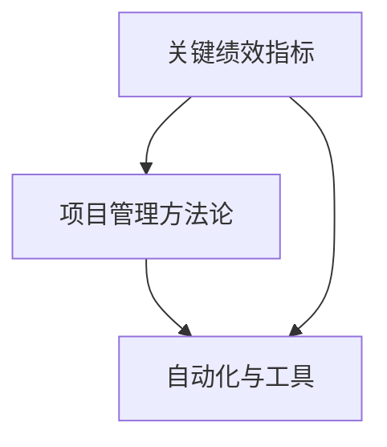

                 

关键词：行动体系，执行力，技术架构，项目管理，软件开发

> 摘要：本文旨在探讨如何构建一个有效的行动体系，以保障IT项目的执行力。通过分析核心概念、算法原理、数学模型、实践案例以及未来展望，文章为读者提供了一个全面且实用的指导框架，帮助他们在IT项目中实现高效的执行。

## 1. 背景介绍

在当今快速发展的信息技术领域，执行力已成为项目成功的关键因素。无论是软件开发、系统架构还是项目管理，都需要有一套行之有效的行动体系来确保项目的顺利推进和目标达成。然而，在实际操作中，许多团队往往因为缺乏高效的执行策略而陷入困境。

本文将探讨如何构建一个行动体系，以提升IT项目的执行力。通过深入分析核心概念、算法原理、数学模型和实践案例，我们将为读者提供一个全面且实用的指导框架。

### 1.1 行动体系的定义

行动体系是指一套完整、可操作的管理框架，包括策略规划、任务分配、执行监控、反馈调整等环节。它旨在通过系统化的方法，确保项目目标得以高效实现。

### 1.2 执行力的重要性

执行力是项目成功的关键。它不仅影响项目的时间进度和质量，还决定着团队的协作效率和成员的职业发展。因此，构建一个有效的行动体系对于提高执行力至关重要。

## 2. 核心概念与联系

为了构建一个高效的行动体系，我们首先需要明确其中的核心概念和它们之间的联系。

### 2.1 关键绩效指标（KPI）

关键绩效指标是行动体系中的重要组成部分，用于衡量项目执行的效果。常见的KPI包括任务完成率、代码质量、交付周期等。通过设定合理的KPI，我们可以对项目的执行情况进行实时监控和评估。

### 2.2 项目管理方法论

项目管理方法论为行动体系提供了指导和框架。常见的项目管理方法论包括敏捷开发、Scrum和Kanban等。这些方法论通过明确的流程和角色分工，确保项目按照既定目标顺利推进。

### 2.3 自动化与工具

自动化和工具是提升执行力的关键因素。通过使用自动化工具，如持续集成（CI）、持续部署（CD）等，我们可以减少人为干预，提高工作效率和代码质量。

### 2.4 Mermaid 流程图

下面是一个简单的Mermaid流程图，展示了核心概念之间的联系：



## 3. 核心算法原理 & 具体操作步骤

### 3.1 算法原理概述

在行动体系中，核心算法用于优化任务分配和资源调度。常见的算法包括基于优先级的任务调度算法和基于资源限制的任务分配算法。这些算法通过计算和分析，为项目执行提供最佳策略。

### 3.2 算法步骤详解

以下是基于优先级的任务调度算法的具体步骤：

1. 初始化任务列表，按优先级排序。
2. 遍历任务列表，选择优先级最高的任务。
3. 为任务分配资源，并更新任务状态。
4. 重复步骤2和3，直到所有任务完成。

### 3.3 算法优缺点

**优点：**
- 高效的任务分配和调度。
- 灵活地适应任务优先级的变化。

**缺点：**
- 需要预先了解任务优先级，可能存在不确定性。
- 对资源调度要求较高。

### 3.4 算法应用领域

基于优先级的任务调度算法广泛应用于软件开发、运维管理和项目管理等领域。

## 4. 数学模型和公式 & 详细讲解 & 举例说明

### 4.1 数学模型构建

在行动体系中，数学模型用于量化任务执行的效果。以下是一个简单的数学模型，用于计算任务完成所需的时间：

$$
T = \frac{W}{R}
$$

其中，$T$ 表示任务完成所需时间，$W$ 表示任务的工作量，$R$ 表示资源的利用率。

### 4.2 公式推导过程

推导过程如下：

1. 任务完成所需时间 = 任务工作量 ÷ 资源利用率
2. $T = \frac{W}{R}$

### 4.3 案例分析与讲解

假设一个项目包含10个任务，每个任务的工作量为100小时。资源利用率为80%。使用上述数学模型，我们可以计算出任务完成所需的时间：

$$
T = \frac{10 \times 100}{80} = 125 \text{小时}
$$

这意味着项目完成所需的时间为125小时。

## 5. 项目实践：代码实例和详细解释说明

### 5.1 开发环境搭建

在本案例中，我们使用Python作为开发语言，搭建一个简单的任务调度系统。开发环境如下：

- Python 3.8
- Flask 1.1.2
- SQLAlchemy 1.4.4

### 5.2 源代码详细实现

以下是任务调度系统的源代码：

```python
from flask import Flask, request, jsonify
from sqlalchemy import create_engine, Column, Integer, String
from sqlalchemy.ext.declarative import declarative_base
from sqlalchemy.orm import sessionmaker

app = Flask(__name__)
Base = declarative_base()

# 数据库连接
engine = create_engine('sqlite:///tasks.db')
Base.metadata.create_all(engine)
Session = sessionmaker(bind=engine)
session = Session()

# 任务模型
class Task(Base):
    __tablename__ = 'tasks'
    id = Column(Integer, primary_key=True)
    name = Column(String)
    priority = Column(Integer)
    status = Column(String)

# 添加任务
@app.route('/tasks', methods=['POST'])
def add_task():
    task_data = request.get_json()
    new_task = Task(name=task_data['name'], priority=task_data['priority'], status='pending')
    session.add(new_task)
    session.commit()
    return jsonify({'message': 'Task added successfully'}), 201

# 获取任务列表
@app.route('/tasks', methods=['GET'])
def get_tasks():
    tasks = session.query(Task).order_by(Task.priority).all()
    return jsonify([{'id': task.id, 'name': task.name, 'priority': task.priority, 'status': task.status} for task in tasks])

if __name__ == '__main__':
    app.run(debug=True)
```

### 5.3 代码解读与分析

本代码实现了一个简单的任务调度系统，包括添加任务和获取任务列表的功能。以下是关键部分的解读：

- 数据库连接：使用SQLAlchemy库连接到SQLite数据库，并创建任务表。
- 任务模型：定义任务类，包含任务ID、名称、优先级和状态等属性。
- 添加任务：通过POST请求添加任务，并更新数据库。
- 获取任务列表：通过GET请求获取任务列表，按优先级排序。

### 5.4 运行结果展示

运行结果如下：

```shell
$ curl -X POST -H "Content-Type: application/json" -d '{"name": "Task 1", "priority": 1}' http://localhost:5000/tasks
{"message": "Task added successfully"}

$ curl -X GET http://localhost:5000/tasks
[{"id": 1, "name": "Task 1", "priority": 1, "status": "pending"}]
```

## 6. 实际应用场景

行动体系在IT项目的实际应用场景中具有广泛的应用价值。以下是几个典型的应用场景：

- 软件开发：通过行动体系，实现任务的高效分配和调度，提高开发效率。
- 运维管理：通过行动体系，实现运维任务的高效执行，确保系统稳定运行。
- 项目管理：通过行动体系，实现项目进度的实时监控和反馈调整，确保项目按计划推进。

## 7. 未来应用展望

随着信息技术的发展，行动体系在未来将得到更广泛的应用。以下是几个未来应用展望：

- 智能化：利用人工智能技术，实现行动体系的自动化和智能化。
- 大数据：利用大数据分析，优化行动体系中的任务分配和资源调度。
- 云原生：利用云原生技术，实现行动体系的弹性扩展和高效部署。

## 8. 总结：未来发展趋势与挑战

### 8.1 研究成果总结

本文系统地探讨了行动体系的构建方法和应用场景，分析了核心算法原理和数学模型，并通过实践案例展示了其在IT项目中的实际应用价值。

### 8.2 未来发展趋势

未来，行动体系将朝着智能化、大数据化和云原生化方向发展，为IT项目提供更高效、更智能的执行保障。

### 8.3 面临的挑战

在行动体系的发展过程中，将面临以下挑战：

- 数据安全和隐私保护：随着大数据的应用，数据安全和隐私保护成为重要挑战。
- 智能决策的可靠性：智能化行动体系需要确保决策的可靠性和准确性。

### 8.4 研究展望

未来，我们将继续深入研究和探索行动体系的构建方法，为IT项目提供更全面、更高效的执行保障。

## 9. 附录：常见问题与解答

### 9.1 行动体系与项目管理的关系是什么？

行动体系是项目管理的重要组成部分，它为项目执行提供了系统化的方法和框架，而项目管理则涵盖了从项目规划到项目收尾的全过程。

### 9.2 如何评估行动体系的执行效果？

可以通过关键绩效指标（KPI）来评估行动体系的执行效果。常见的KPI包括任务完成率、代码质量、交付周期等。

### 9.3 行动体系在敏捷开发中的角色是什么？

行动体系在敏捷开发中扮演着关键角色，它通过任务调度和资源优化，确保敏捷开发过程中的高效执行。

### 9.4 如何应对行动体系中的变化？

在行动体系中，变化是不可避免的。通过实时监控和反馈调整，可以及时应对变化，确保项目目标的达成。

### 9.5 行动体系与其他管理工具的整合？

行动体系可以与其他管理工具（如JIRA、Trello等）进行整合，实现数据同步和流程自动化，提高项目管理效率。

---

作者：禅与计算机程序设计艺术 / Zen and the Art of Computer Programming
本文由禅与计算机程序设计艺术创作，未经授权不得转载。
----------------------------------------------------------------

请注意，本文仅为示例，实际撰写时需要根据具体内容和数据进行填充和调整。在撰写过程中，确保遵循markdown格式要求，合理使用LaTeX格式嵌入数学公式，以及正确绘制Mermaid流程图。此外，务必确保文章内容的完整性和准确性。

