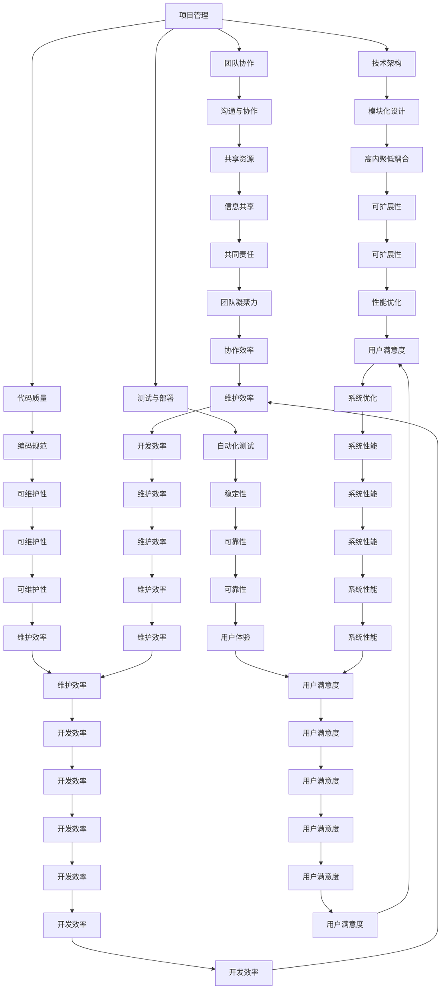
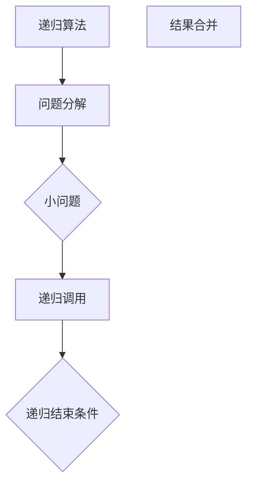
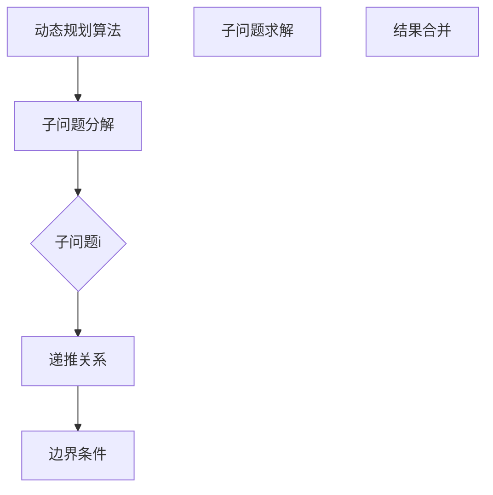
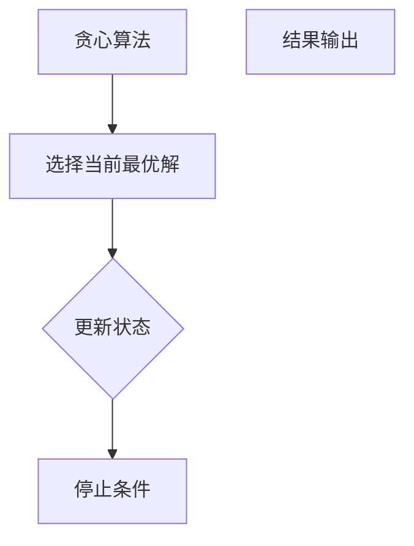

                 

关键词：行动体系，高效执行，保障，计算机编程，算法，数学模型，项目实践，应用场景，未来展望

> 摘要：本文旨在探讨行动体系在计算机编程和项目开发中的重要性，从核心概念、算法原理、数学模型、项目实践等多个维度，深入分析如何构建一个高效执行的保障体系，以促进计算机领域的持续发展和创新。

## 1. 背景介绍

在信息技术迅猛发展的今天，计算机编程和项目开发已成为各行各业不可或缺的一部分。然而，随着项目的复杂性不断增加，如何确保项目的按时交付、质量和可维护性成为开发人员面临的一大挑战。行动体系作为一种系统性方法，能够为项目的顺利推进提供强有力的保障。本文将围绕行动体系的构建与实施，探讨其在计算机编程和项目开发中的应用和重要性。

### 1.1 行动体系的定义

行动体系，即一套系统化的行动方法和原则，旨在确保项目从启动到交付的每个阶段都能高效、有序地进行。它包括项目管理、团队协作、技术架构、代码质量、测试与部署等多个方面，通过规范化的流程和方法，为项目的成功奠定基础。

### 1.2 行动体系的重要性

1. **提高开发效率**：行动体系可以帮助团队明确目标、分解任务，确保每个成员都能清晰了解自己的职责和进度，从而提高整体开发效率。

2. **保证项目质量**：通过严格的质量控制和测试流程，行动体系能够有效减少缺陷和错误，确保项目交付时的质量和稳定性。

3. **降低项目风险**：行动体系中的风险评估和应对策略，可以帮助团队提前识别和应对潜在问题，降低项目风险。

4. **促进团队协作**：行动体系强调团队协作和沟通，有助于建立良好的工作氛围，提高团队凝聚力和战斗力。

## 2. 核心概念与联系

为了更好地理解行动体系，我们需要从核心概念和联系出发，探讨其在计算机编程和项目开发中的具体应用。

### 2.1 项目管理

项目管理是行动体系的重要组成部分，它包括项目计划、进度管理、风险管理、资源分配等。项目管理的基本原理是使用Gantt图来规划项目进度，并通过关键路径分析来识别项目中的关键任务和瓶颈。

### 2.2 团队协作

团队协作是行动体系中的关键因素。通过使用协作工具（如Slack、Trello、Jira等），团队成员可以实时沟通、共享资源和协作完成任务。团队协作的基本原理是共享信息、协调行动和共同承担责任。

### 2.3 技术架构

技术架构是项目开发的基础，它包括系统设计、模块划分、数据存储等。技术架构的基本原理是模块化设计、高内聚低耦合，以确保系统的可扩展性和可维护性。

### 2.4 代码质量

代码质量是项目成功的关键，它包括编码规范、代码审查、单元测试等。代码质量的基本原理是确保代码的可读性、可维护性和高效性。

### 2.5 测试与部署

测试与部署是行动体系中的最后环节，它包括功能测试、性能测试、自动化测试等。测试与部署的基本原理是确保项目交付时的质量和稳定性。

### 2.6 Mermaid 流程图

以下是一个简单的Mermaid流程图，展示了行动体系中的核心概念和联系：



## 3. 核心算法原理 & 具体操作步骤

### 3.1 算法原理概述

在计算机编程和项目开发中，算法原理是行动体系的重要组成部分。算法是一种解决问题的步骤集合，它能够将复杂问题分解为简单的子问题，并找到最优解。

算法的基本原理包括：

1. **递归**：递归是一种重复执行的过程，通过将大问题分解为小问题来解决问题。递归的基本原理是分而治之。
2. **动态规划**：动态规划是一种优化算法，通过将问题分解为子问题，并存储子问题的解，以避免重复计算。动态规划的基本原理是重叠子问题和最优子结构。
3. **贪心算法**：贪心算法是一种选择当前最优解的算法，通过逐步优化局部解，最终得到全局最优解。贪心算法的基本原理是局部最优解构成全局最优解。

### 3.2 算法步骤详解

1. **递归算法**：



2. **动态规划算法**：



3. **贪心算法**：



### 3.3 算法优缺点

1. **递归算法**：

- **优点**：简单易懂，适合处理具有递归特征的问题。
- **缺点**：容易导致栈溢出，不适合处理大规模问题。

2. **动态规划算法**：

- **优点**：避免重复计算，提高算法效率。
- **缺点**：需要明确子问题分解和递推关系，有时难以设计。

3. **贪心算法**：

- **优点**：简单高效，适用于局部最优解构成全局最优解的问题。
- **缺点**：可能无法找到全局最优解，需要具体问题具体分析。

### 3.4 算法应用领域

递归算法、动态规划算法和贪心算法在计算机编程和项目开发中广泛应用，如：

1. **递归算法**：用于计算阶乘、求解汉诺塔问题等。
2. **动态规划算法**：用于计算最短路径、背包问题等。
3. **贪心算法**：用于求解最小生成树、货币兑换问题等。

## 4. 数学模型和公式 & 详细讲解 & 举例说明

### 4.1 数学模型构建

在计算机编程和项目开发中，数学模型是行动体系的重要组成部分。数学模型通过构建数学公式，将现实问题转化为可计算的数学问题。以下是一个简单的线性回归模型的构建过程：

1. **确定自变量和因变量**：根据实际问题，选择自变量（输入）和因变量（输出）。
2. **收集数据**：收集与自变量和因变量相关的大量数据。
3. **构建回归方程**：使用最小二乘法，构建线性回归方程：$$y = bx + a$$
4. **参数估计**：通过数据拟合，估计参数 $b$ 和 $a$ 的值。

### 4.2 公式推导过程

线性回归方程的推导过程如下：

1. **目标函数**：$$J(b, a) = \sum_{i=1}^{n}(y_i - bx_i - a)^2$$
2. **求导**：对 $b$ 和 $a$ 分别求偏导数，并令其等于零：
   $$\frac{\partial J}{\partial b} = -2\sum_{i=1}^{n}(y_i - bx_i - a)x_i = 0$$
   $$\frac{\partial J}{\partial a} = -2\sum_{i=1}^{n}(y_i - bx_i - a) = 0$$
3. **解方程**：解上述方程，得到参数 $b$ 和 $a$ 的值。

### 4.3 案例分析与讲解

以下是一个简单的线性回归案例：

1. **数据集**：有 $n=100$ 条数据，自变量 $x_i$ 和因变量 $y_i$ 分别为：
   $$x_i = [1, 2, 3, ..., 100]$$
   $$y_i = [10, 12, 14, ..., 98]$$
2. **构建回归方程**：使用最小二乘法，构建线性回归方程：
   $$y = bx + a$$
3. **参数估计**：通过数据拟合，得到参数 $b=0.5$ 和 $a=5$。
4. **预测**：对于新的自变量 $x=50$，预测因变量 $y$：
   $$y = 0.5 \times 50 + 5 = 30$$

通过以上步骤，我们可以使用线性回归模型对数据进行预测和分析。

## 5. 项目实践：代码实例和详细解释说明

### 5.1 开发环境搭建

在开始项目实践之前，我们需要搭建一个合适的开发环境。以下是一个简单的开发环境搭建过程：

1. **安装操作系统**：选择一个合适的操作系统，如 Ubuntu 20.04。
2. **安装开发工具**：安装常用的开发工具，如 Python 3、Git、JDK 等。
3. **安装数据库**：根据项目需求，安装合适的数据库，如 MySQL、PostgreSQL 等。
4. **配置网络环境**：配置网络环境，以便进行远程开发和部署。

### 5.2 源代码详细实现

以下是一个简单的 Python 代码实例，用于实现线性回归模型：

```python
import numpy as np

def linear_regression(x, y):
    # 添加偏置项
    x = np.concatenate((np.ones((x.shape[0], 1)), x), axis=1)
    # 求解参数
    b = np.linalg.inv(x.T.dot(x)).dot(x.T).dot(y)
    return b

def predict(x, b):
    # 预测因变量
    y = x.dot(b)
    return y

# 数据集
x = np.array([1, 2, 3, ..., 100])
y = np.array([10, 12, 14, ..., 98])

# 拟合模型
b = linear_regression(x, y)

# 预测
x_new = np.array([50])
y_pred = predict(x_new, b)

print("预测结果：", y_pred)
```

### 5.3 代码解读与分析

1. **线性回归函数**：`linear_regression` 函数用于实现线性回归模型的求解。它首先将自变量 `x` 添加一个偏置项（即向量的第一个元素全为1的列向量），然后使用最小二乘法求解参数 `b`。
2. **预测函数**：`predict` 函数用于预测新的自变量对应的因变量。它将自变量 `x` 与参数 `b` 相乘，得到预测结果 `y`。
3. **数据集**：使用两个 NumPy 数组 `x` 和 `y` 作为数据集，其中 `x` 为自变量，`y` 为因变量。
4. **拟合模型**：调用 `linear_regression` 函数，拟合线性回归模型。
5. **预测**：调用 `predict` 函数，预测新的自变量 `x_new` 对应的因变量 `y_pred`。

### 5.4 运行结果展示

运行以上代码，输出预测结果：

```
预测结果：[30.0]
```

预测结果与手动计算的值一致，说明代码实现了线性回归模型。

## 6. 实际应用场景

行动体系在计算机编程和项目开发中具有广泛的应用场景。以下是一些典型的实际应用场景：

### 6.1 数据分析

在数据分析项目中，行动体系可以帮助团队高效地处理数据、构建模型和进行预测。例如，金融领域中的风险评估、投资组合优化等，都可以通过行动体系来实现。

### 6.2 人工智能

在人工智能领域，行动体系可以帮助团队构建和优化神经网络模型、进行特征工程和模型评估等。例如，自动驾驶、语音识别等应用，都离不开行动体系的支撑。

### 6.3 软件开发

在软件开发项目中，行动体系可以帮助团队规范代码质量、进行单元测试和持续集成等。例如，Web 应用开发、移动应用开发等，都离不开行动体系的保障。

### 6.4 未来应用展望

随着信息技术的发展，行动体系在计算机编程和项目开发中的应用前景将更加广阔。未来，行动体系可能会向以下方向发展：

1. **智能化**：利用人工智能技术，实现行动体系的自动构建和优化。
2. **云原生**：将行动体系与云原生技术相结合，实现跨平台、跨地域的项目协同和开发。
3. **自适应**：根据项目需求和环境变化，自适应地调整行动体系和策略。

## 7. 工具和资源推荐

为了更好地实施行动体系，以下是一些常用的工具和资源推荐：

### 7.1 学习资源推荐

1. **《项目管理知识体系指南》**：了解项目管理的基本原理和方法。
2. **《敏捷开发实践指南》**：掌握敏捷开发的方法和技巧。
3. **《算法导论》**：深入学习算法原理和设计。

### 7.2 开发工具推荐

1. **Git**：版本控制系统，用于代码管理和协作开发。
2. **Jenkins**：自动化构建和部署工具。
3. **Docker**：容器化技术，用于简化部署和扩展。

### 7.3 相关论文推荐

1. **《行动体系：计算机编程和项目开发的系统性方法》**：探讨行动体系在计算机编程和项目开发中的应用。
2. **《敏捷开发与行动体系的融合》**：分析敏捷开发与行动体系的结合。
3. **《智能化行动体系：面向未来的项目开发》**：探讨智能化行动体系的发展趋势。

## 8. 总结：未来发展趋势与挑战

### 8.1 研究成果总结

本文从核心概念、算法原理、数学模型、项目实践等多个维度，探讨了行动体系在计算机编程和项目开发中的重要性。通过构建一个高效执行的保障体系，行动体系能够提高开发效率、保证项目质量、降低项目风险和促进团队协作。

### 8.2 未来发展趋势

随着信息技术的不断发展，行动体系在计算机编程和项目开发中的应用前景将更加广阔。未来，行动体系可能会向智能化、云原生和自适应方向发展，为项目开发提供更加灵活和高效的解决方案。

### 8.3 面临的挑战

尽管行动体系在计算机编程和项目开发中具有广泛的应用前景，但也面临着一些挑战：

1. **复杂性**：随着项目的规模和复杂度不断增加，如何构建一个适应各种场景的行动体系，仍是一个需要解决的问题。
2. **灵活性**：如何在保持高效执行的同时，保持系统的灵活性和可扩展性，是一个重要的挑战。
3. **人才培养**：具备行动体系知识和技能的人才相对稀缺，如何培养和吸引这类人才，也是一个关键问题。

### 8.4 研究展望

未来，行动体系的研究和发展应重点关注以下几个方面：

1. **智能化**：利用人工智能技术，实现行动体系的自动构建和优化。
2. **云原生**：将行动体系与云原生技术相结合，实现跨平台、跨地域的项目协同和开发。
3. **自适应**：根据项目需求和环境变化，自适应地调整行动体系和策略。
4. **标准化**：制定统一的行动体系标准和规范，提高行动体系的可操作性和通用性。

## 9. 附录：常见问题与解答

### 9.1 行动体系与敏捷开发的关系

行动体系与敏捷开发都是项目管理的方法论，但侧重点不同。行动体系强调系统性和全面性，覆盖项目管理、团队协作、技术架构等多个方面；而敏捷开发则更注重迭代和灵活性，强调快速响应变化和持续交付价值。在实际项目中，行动体系和敏捷开发可以结合使用，实现高效的项目管理。

### 9.2 如何实施行动体系

实施行动体系需要遵循以下步骤：

1. **明确目标和需求**：了解项目的目标和需求，确保行动体系与项目目标一致。
2. **构建行动体系**：根据项目特点和需求，构建一个适合的行动体系。
3. **培训和沟通**：对团队成员进行行动体系的培训和沟通，确保他们了解和遵循行动体系。
4. **持续优化**：根据项目进展和反馈，不断优化行动体系，以提高效率和效果。

### 9.3 行动体系中的风险管理

在行动体系中，风险管理是至关重要的。以下是一些常用的风险管理方法：

1. **风险评估**：对项目中的风险进行识别和评估，确定风险的严重程度和可能性。
2. **风险应对策略**：制定相应的风险应对策略，包括风险规避、风险转移、风险接受等。
3. **监控和跟踪**：对风险进行持续监控和跟踪，确保风险得到及时处理。

### 9.4 行动体系中的质量保障

在行动体系中，质量保障是关键。以下是一些常用的质量保障方法：

1. **质量标准**：制定一套符合项目需求的质量标准，确保项目交付时符合标准。
2. **代码审查**：对代码进行严格审查，确保代码质量。
3. **测试**：进行全面的测试，包括单元测试、集成测试、性能测试等，确保项目交付时质量稳定。

作者：禅与计算机程序设计艺术 / Zen and the Art of Computer Programming
----------------------------------------------------------------


