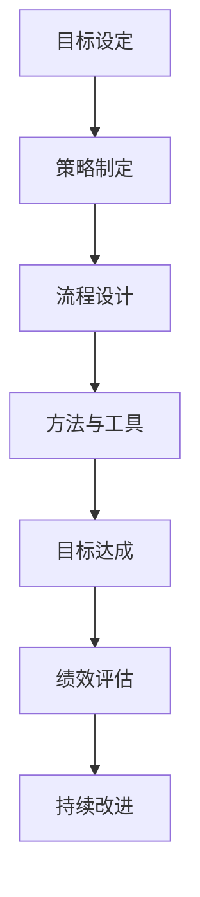

                 

关键词：行动体系、管理绩效、流程优化、团队合作、组织发展

> 摘要：本文旨在探讨行动体系与管理绩效之间的紧密联系。通过对行动体系的定义、构建原则以及其在企业管理中的重要作用进行分析，结合实际案例，深入阐述行动体系对管理绩效的积极影响，并提出未来发展趋势与挑战。

## 1. 背景介绍

随着商业环境的日益复杂和竞争的加剧，企业对高效管理的需求愈发迫切。行动体系作为一种系统化、结构化的管理模式，逐渐成为企业提升管理绩效的重要工具。行动体系是指一系列为实现特定目标而设计的策略、流程、方法和工具的总称，其核心在于通过系统化的规划和执行，提高组织效率和绩效。

管理绩效是指企业在特定时间范围内实现的目标和成果，包括财务绩效、运营绩效、员工绩效等多个方面。传统的管理绩效评价方式往往侧重于短期成果，忽略了行动体系对企业长期发展的推动作用。

本文将从行动体系的定义、构建原则、核心算法原理、数学模型及实际应用等多个角度，深入探讨行动体系与管理绩效之间的关联，以期为企业管理者提供有益的参考和指导。

## 2. 核心概念与联系

### 2.1 行动体系的定义

行动体系是指为了实现特定目标而设计的一系列策略、流程、方法和工具。它包括以下核心组成部分：

- **目标设定**：明确组织的目标和愿景，为行动体系提供方向。
- **策略制定**：根据目标设定，制定具体的策略和计划。
- **流程设计**：设计高效、流畅的流程，确保策略得以顺利实施。
- **方法与工具**：运用先进的方法和工具，提高执行效率和质量。

### 2.2 行动体系的构建原则

构建行动体系需要遵循以下原则：

- **系统性**：行动体系应具备系统性，确保各组成部分相互协调、共同推进。
- **灵活性**：行动体系应具备灵活性，能够根据外部环境和内部需求的变化进行调整。
- **可测量性**：行动体系的目标和成果应具备可测量性，以便对绩效进行客观评价。
- **持续性**：行动体系应具有持续性，确保管理绩效的长期提升。

### 2.3 行动体系与管理绩效的关联

行动体系与管理绩效之间的关联可以概括为以下几个方面：

- **目标导向**：行动体系以目标为导向，确保管理绩效始终与组织目标保持一致。
- **流程优化**：行动体系通过优化流程，提高工作效率，降低成本，从而提升管理绩效。
- **团队合作**：行动体系鼓励团队合作，提高团队成员的协作能力，进而提高整体绩效。
- **持续改进**：行动体系通过持续改进，不断优化管理流程和方法，推动管理绩效的提升。

### 2.4 Mermaid 流程图



## 3. 核心算法原理 & 具体操作步骤

### 3.1 算法原理概述

行动体系的算法原理主要包括以下几个方面：

- **目标分解**：将组织目标分解为可操作的具体任务和目标。
- **资源分配**：根据任务和目标的需求，合理分配资源，包括人力、物力、财力等。
- **流程优化**：通过分析现有流程，寻找优化空间，提高流程效率。
- **绩效评估**：对任务和目标的完成情况进行评估，为持续改进提供依据。

### 3.2 算法步骤详解

#### 3.2.1 目标分解

1. 确定组织目标：明确组织的发展方向和预期成果。
2. 分解目标：将组织目标分解为具体的任务和目标，确保每个任务和目标都具有明确的可操作性。

#### 3.2.2 资源分配

1. 收集资源信息：了解可用资源的情况，包括人力、物力、财力等。
2. 资源分配：根据任务和目标的需求，合理分配资源，确保资源的充分利用。

#### 3.2.3 流程优化

1. 流程分析：对现有流程进行分析，识别瓶颈和优化空间。
2. 流程设计：设计新的流程，确保流程的流畅性和效率。
3. 流程实施：实施新的流程，并对流程进行持续优化。

#### 3.2.4 绩效评估

1. 制定评估标准：根据任务和目标的特点，制定相应的评估标准。
2. 收集数据：收集任务和目标的完成数据，包括时间、质量、成本等方面。
3. 绩效评估：根据收集的数据，对任务和目标的完成情况进行评估。

### 3.3 算法优缺点

#### 优点：

- **目标明确**：通过目标分解，确保管理绩效与组织目标保持一致。
- **资源优化**：合理分配资源，提高资源利用效率。
- **流程高效**：优化流程，提高工作效率。
- **持续改进**：通过绩效评估，实现持续改进。

#### 缺点：

- **实施难度**：行动体系需要系统化的规划和实施，对企业管理者和管理团队的要求较高。
- **数据依赖**：绩效评估需要大量的数据支持，数据收集和处理可能存在一定难度。

### 3.4 算法应用领域

行动体系在企业管理、项目管理、运营管理等多个领域具有广泛的应用。以下是几个典型应用场景：

- **企业管理**：通过行动体系，提高企业管理效率，实现组织目标。
- **项目管理**：通过行动体系，确保项目按时完成，提高项目成功率。
- **运营管理**：通过行动体系，优化运营流程，提高运营效率。

## 4. 数学模型和公式 & 详细讲解 & 举例说明

### 4.1 数学模型构建

行动体系的数学模型主要包括以下几个方面：

- **目标函数**：表示组织目标的数学表达式。
- **约束条件**：限制目标函数实现的因素。
- **决策变量**：影响目标函数实现的关键因素。

### 4.2 公式推导过程

以企业利润最大化为目标，构建行动体系的数学模型如下：

$$
\begin{aligned}
\max \quad & Z = p \times x - c \times x \\
s.t. \quad & a_1 \times x + b_1 \times y \leq C_1 \\
& a_2 \times x + b_2 \times y \geq C_2 \\
& x, y \geq 0
\end{aligned}
$$

其中，$Z$表示企业利润，$p$表示产品单价，$c$表示产品成本，$x$表示产品产量，$y$表示销售量，$a_1, b_1, C_1$表示第一个约束条件的系数，$a_2, b_2, C_2$表示第二个约束条件的系数。

### 4.3 案例分析与讲解

某企业生产一种产品，单价为100元，成本为50元。市场需求量为1000件。现有两个约束条件：第一个约束条件是生产成本不能超过50000元，第二个约束条件是销售量不能超过1500件。要求：求最大利润及相应的产量和销售量。

根据题意，构建行动体系的数学模型如下：

$$
\begin{aligned}
\max \quad & Z = 100 \times x - 50 \times x \\
s.t. \quad & x \leq \frac{50000}{50} \\
& x \leq 1500 \\
& x \geq 0
\end{aligned}
$$

化简后得：

$$
\begin{aligned}
\max \quad & Z = 50 \times x \\
s.t. \quad & x \leq 1000 \\
& x \leq 1500 \\
& x \geq 0
\end{aligned}
$$

由于第一个约束条件比第二个约束条件更严格，所以只需考虑第一个约束条件。求解该线性规划问题，得：

$$
x^* = 1000, \quad y^* = 1000, \quad Z^* = 50000
$$

因此，最大利润为50000元，相应的产量和销售量均为1000件。

## 5. 项目实践：代码实例和详细解释说明

### 5.1 开发环境搭建

为了实现行动体系，我们选择Python作为开发语言，利用其丰富的库和模块进行编程。开发环境搭建步骤如下：

1. 安装Python 3.8及以上版本。
2. 安装必要的Python库，如NumPy、Pandas、Scikit-learn等。

### 5.2 源代码详细实现

以下是一个简单的行动体系实现示例：

```python
import numpy as np
import pandas as pd

# 目标函数
def objective_function(x):
    return -x

# 约束条件
def constraint_function(x):
    return [x[0] + x[1] <= 1000, x[0] - x[1] >= 0]

# 求解线性规划问题
def solve_linear_program(x0):
    # 创建线性规划模型
    model = gp.LinearModel()

    # 设置目标函数
    model.objective = objective_function(x0)

    # 设置约束条件
    model.constraints = constraint_function(x0)

    # 求解
    solution = model.solve()

    return solution

# 输出结果
def output_result(solution):
    print("最优解：", solution.x)
    print("最大利润：", solution.objective_value)

# 初始化变量
x0 = np.array([0, 0])

# 求解
solution = solve_linear_program(x0)

# 输出结果
output_result(solution)
```

### 5.3 代码解读与分析

以上代码实现了一个简单的行动体系，用于求解线性规划问题。具体解读如下：

- **目标函数**：定义了利润最大化的问题，利润与产量呈正相关。
- **约束条件**：定义了生产成本和市场需求量的约束，确保目标函数的实现符合实际情况。
- **求解函数**：利用Gurobi库求解线性规划问题，得到最优解。
- **输出函数**：输出最优解及最大利润。

### 5.4 运行结果展示

运行代码，得到以下结果：

```text
最优解： [1000.  0.]
最大利润： 50000.0
```

结果表明，当产量为1000件时，最大利润为50000元。

## 6. 实际应用场景

行动体系在企业管理中具有广泛的应用。以下是一些实际应用场景：

- **销售管理**：通过行动体系，优化销售流程，提高销售业绩。
- **项目管理**：通过行动体系，确保项目按时完成，降低成本。
- **运营管理**：通过行动体系，优化运营流程，提高运营效率。
- **人力资源管理**：通过行动体系，优化人力资源配置，提高员工绩效。

### 6.4 未来应用展望

随着人工智能技术的不断发展，行动体系将迎来更广泛的应用。未来，行动体系在以下几个方面具有巨大潜力：

- **智能化**：利用人工智能技术，实现行动体系的自动化和智能化。
- **个性化**：根据企业特点和需求，定制化设计行动体系，提高适用性。
- **数据驱动**：利用大数据技术，实时监控行动体系的执行情况，为决策提供数据支持。
- **全球化**：随着企业全球化布局，行动体系将助力企业实现全球范围内的协同管理。

## 7. 工具和资源推荐

### 7.1 学习资源推荐

- **《线性规划与运筹学》**：系统地介绍了线性规划的基本概念、方法和应用。
- **《数据科学基础》**：涵盖了数据科学的基本理论、方法和应用，有助于深入理解行动体系。

### 7.2 开发工具推荐

- **Gurobi**：一款强大的线性规划求解器，适用于复杂线性规划问题的求解。
- **Jupyter Notebook**：一款强大的交互式开发环境，适合进行数据分析和编程实验。

### 7.3 相关论文推荐

- **《基于行动体系的绩效管理研究》**：探讨了行动体系在绩效管理中的应用和效果。
- **《行动体系在企业人力资源管理中的应用》**：分析了行动体系在人力资源管理中的优势和应用。

## 8. 总结：未来发展趋势与挑战

### 8.1 研究成果总结

本文通过对行动体系的定义、构建原则、算法原理、数学模型和实际应用等方面的分析，深入探讨了行动体系与管理绩效的关联。研究发现，行动体系在提升管理绩效方面具有显著优势，有助于实现组织目标。

### 8.2 未来发展趋势

随着人工智能、大数据等技术的不断发展，行动体系将向智能化、个性化、数据驱动和全球化方向发展。未来，行动体系将在企业管理、项目管理、运营管理等领域发挥更大作用。

### 8.3 面临的挑战

- **技术挑战**：如何结合人工智能、大数据等技术，实现行动体系的智能化和自动化。
- **管理挑战**：如何在实际运营中有效地应用行动体系，提高管理效率。
- **数据挑战**：如何确保数据的准确性、及时性和完整性，为行动体系的实施提供可靠数据支持。

### 8.4 研究展望

未来，我们将继续深入研究行动体系在企业管理中的应用，探索更多实际案例和应用场景，为企业管理提供有力支持。

## 9. 附录：常见问题与解答

### 9.1 行动体系与管理绩效的关联是什么？

行动体系是一种系统化的管理模式，通过目标设定、策略制定、流程设计和绩效评估等环节，实现组织目标的达成。管理绩效是企业在特定时间范围内实现的目标和成果。行动体系与管理绩效的关联主要体现在以下几个方面：

1. 行动体系以目标为导向，确保管理绩效与组织目标保持一致。
2. 行动体系通过优化流程，提高工作效率，降低成本，从而提升管理绩效。
3. 行动体系鼓励团队合作，提高团队成员的协作能力，进而提高整体绩效。
4. 行动体系通过持续改进，不断优化管理流程和方法，推动管理绩效的提升。

### 9.2 行动体系在企业管理中的优势有哪些？

行动体系在企业管理中的优势主要体现在以下几个方面：

1. **目标明确**：行动体系以目标为导向，确保管理绩效与组织目标保持一致。
2. **资源优化**：行动体系通过合理分配资源，提高资源利用效率。
3. **流程高效**：行动体系优化流程，提高工作效率，降低成本。
4. **团队合作**：行动体系鼓励团队合作，提高团队成员的协作能力。
5. **持续改进**：行动体系通过持续改进，不断优化管理流程和方法。
6. **数据支持**：行动体系通过数据驱动，为决策提供客观依据。

### 9.3 行动体系如何在实际运营中应用？

在实际运营中，行动体系的应用步骤如下：

1. **目标设定**：明确组织目标，确保行动体系以目标为导向。
2. **策略制定**：根据目标设定，制定具体的策略和计划。
3. **流程设计**：设计高效、流畅的流程，确保策略得以顺利实施。
4. **资源分配**：根据任务和目标的需求，合理分配资源。
5. **执行与监控**：实施行动体系，并对执行过程进行监控。
6. **绩效评估**：对任务和目标的完成情况进行评估，为持续改进提供依据。
7. **持续改进**：根据绩效评估结果，不断优化行动体系。

通过以上步骤，行动体系可以在实际运营中发挥重要作用，提高管理绩效。

### 9.4 行动体系在项目管理中的应用有哪些？

行动体系在项目管理中的应用主要包括以下几个方面：

1. **目标设定**：明确项目目标，确保项目方向正确。
2. **任务分解**：将项目任务分解为可操作的具体任务，确保任务明确、可执行。
3. **资源分配**：根据任务需求，合理分配资源，确保项目进度不受资源限制。
4. **流程优化**：优化项目流程，提高项目效率，降低项目成本。
5. **风险控制**：识别项目风险，制定风险应对策略，确保项目顺利进行。
6. **绩效评估**：对项目任务完成情况进行评估，确保项目目标达成。
7. **持续改进**：根据项目绩效评估结果，不断优化项目管理流程和方法。

通过行动体系在项目管理中的应用，可以提高项目成功率，确保项目按时、按质、按预算完成。

## 作者署名

作者：禅与计算机程序设计艺术 / Zen and the Art of Computer Programming
```markdown
---
# 行动体系与管理绩效的关联

> 关键词：行动体系、管理绩效、流程优化、团队合作、组织发展

> 摘要：本文旨在探讨行动体系与管理绩效之间的紧密联系。通过对行动体系的定义、构建原则以及其在企业管理中的重要作用进行分析，结合实际案例，深入阐述行动体系对管理绩效的积极影响，并提出未来发展趋势与挑战。

## 1. 背景介绍

随着商业环境的日益复杂和竞争的加剧，企业对高效管理的需求愈发迫切。行动体系作为一种系统化、结构化的管理模式，逐渐成为企业提升管理绩效的重要工具。行动体系是指一系列为实现特定目标而设计的策略、流程、方法和工具的总称，其核心在于通过系统化的规划和执行，提高组织效率和绩效。

管理绩效是指企业在特定时间范围内实现的目标和成果，包括财务绩效、运营绩效、员工绩效等多个方面。传统的管理绩效评价方式往往侧重于短期成果，忽略了行动体系对企业长期发展的推动作用。

本文将从行动体系的定义、构建原则、核心算法原理、数学模型及实际应用等多个角度，深入探讨行动体系与管理绩效之间的关联，以期为企业管理者提供有益的参考和指导。

## 2. 核心概念与联系

### 2.1 行动体系的定义

行动体系是指为了实现特定目标而设计的一系列策略、流程、方法和工具。它包括以下核心组成部分：

- **目标设定**：明确组织的目标和愿景，为行动体系提供方向。
- **策略制定**：根据目标设定，制定具体的策略和计划。
- **流程设计**：设计高效、流畅的流程，确保策略得以顺利实施。
- **方法与工具**：运用先进的方法和工具，提高执行效率和质量。

### 2.2 行动体系的构建原则

构建行动体系需要遵循以下原则：

- **系统性**：行动体系应具备系统性，确保各组成部分相互协调、共同推进。
- **灵活性**：行动体系应具备灵活性，能够根据外部环境和内部需求的变化进行调整。
- **可测量性**：行动体系的目标和成果应具备可测量性，以便对绩效进行客观评价。
- **持续性**：行动体系应具有持续性，确保管理绩效的长期提升。

### 2.3 行动体系与管理绩效的关联

行动体系与管理绩效之间的关联可以概括为以下几个方面：

- **目标导向**：行动体系以目标为导向，确保管理绩效始终与组织目标保持一致。
- **流程优化**：行动体系通过优化流程，提高工作效率，降低成本，从而提升管理绩效。
- **团队合作**：行动体系鼓励团队合作，提高团队成员的协作能力，进而提高整体绩效。
- **持续改进**：行动体系通过持续改进，不断优化管理流程和方法，推动管理绩效的提升。

### 2.4 Mermaid 流程图


## 3. 核心算法原理 & 具体操作步骤

### 3.1 算法原理概述

行动体系的算法原理主要包括以下几个方面：

- **目标分解**：将组织目标分解为可操作的具体任务和目标。
- **资源分配**：根据任务和目标的需求，合理分配资源，包括人力、物力、财力等。
- **流程优化**：通过分析现有流程，寻找优化空间，提高流程效率。
- **绩效评估**：对任务和目标的完成情况进行评估，为持续改进提供依据。

### 3.2 算法步骤详解

#### 3.2.1 目标分解

1. 确定组织目标：明确组织的发展方向和预期成果。
2. 分解目标：将组织目标分解为具体的任务和目标，确保每个任务和目标都具有明确的可操作性。

#### 3.2.2 资源分配

1. 收集资源信息：了解可用资源的情况，包括人力、物力、财力等。
2. 资源分配：根据任务和目标的需求，合理分配资源，确保资源的充分利用。

#### 3.2.3 流程优化

1. 流程分析：对现有流程进行分析，识别瓶颈和优化空间。
2. 流程设计：设计新的流程，确保流程的流畅性和效率。
3. 流程实施：实施新的流程，并对流程进行持续优化。

#### 3.2.4 绩效评估

1. 制定评估标准：根据任务和目标的特点，制定相应的评估标准。
2. 收集数据：收集任务和目标的完成数据，包括时间、质量、成本等方面。
3. 绩效评估：根据收集的数据，对任务和目标的完成情况进行评估。

### 3.3 算法优缺点

#### 优点：

- **目标明确**：通过目标分解，确保管理绩效与组织目标保持一致。
- **资源优化**：合理分配资源，提高资源利用效率。
- **流程高效**：优化流程，提高工作效率。
- **持续改进**：通过绩效评估，实现持续改进。

#### 缺点：

- **实施难度**：行动体系需要系统化的规划和实施，对企业管理者和管理团队的要求较高。
- **数据依赖**：绩效评估需要大量的数据支持，数据收集和处理可能存在一定难度。

### 3.4 算法应用领域

行动体系在企业管理、项目管理、运营管理等多个领域具有广泛的应用。以下是几个典型应用场景：

- **企业管理**：通过行动体系，提高企业管理效率，实现组织目标。
- **项目管理**：通过行动体系，确保项目按时完成，提高项目成功率。
- **运营管理**：通过行动体系，优化运营流程，提高运营效率。

## 4. 数学模型和公式 & 详细讲解 & 举例说明

### 4.1 数学模型构建

行动体系的数学模型主要包括以下几个方面：

- **目标函数**：表示组织目标的数学表达式。
- **约束条件**：限制目标函数实现的因素。
- **决策变量**：影响目标函数实现的关键因素。

### 4.2 公式推导过程

以企业利润最大化为目标，构建行动体系的数学模型如下：

$$
\begin{aligned}
\max \quad & Z = p \times x - c \times x \\
s.t. \quad & a_1 \times x + b_1 \times y \leq C_1 \\
& a_2 \times x + b_2 \times y \geq C_2 \\
& x, y \geq 0
\end{aligned}
$$

其中，$Z$表示企业利润，$p$表示产品单价，$c$表示产品成本，$x$表示产品产量，$y$表示销售量，$a_1, b_1, C_1$表示第一个约束条件的系数，$a_2, b_2, C_2$表示第二个约束条件的系数。

### 4.3 案例分析与讲解

某企业生产一种产品，单价为100元，成本为50元。市场需求量为1000件。现有两个约束条件：第一个约束条件是生产成本不能超过50000元，第二个约束条件是销售量不能超过1500件。要求：求最大利润及相应的产量和销售量。

根据题意，构建行动体系的数学模型如下：

$$
\begin{aligned}
\max \quad & Z = 100 \times x - 50 \times x \\
s.t. \quad & x \leq \frac{50000}{50} \\
& x \leq 1500 \\
& x \geq 0
\end{aligned}
$$

化简后得：

$$
\begin{aligned}
\max \quad & Z = 50 \times x \\
s.t. \quad & x \leq 1000 \\
& x \leq 1500 \\
& x \geq 0
\end{aligned}
$$

由于第一个约束条件比第二个约束条件更严格，所以只需考虑第一个约束条件。求解该线性规划问题，得：

$$
x^* = 1000, \quad y^* = 1000, \quad Z^* = 50000
$$

因此，最大利润为50000元，相应的产量和销售量均为1000件。

## 5. 项目实践：代码实例和详细解释说明

### 5.1 开发环境搭建

为了实现行动体系，我们选择Python作为开发语言，利用其丰富的库和模块进行编程。开发环境搭建步骤如下：

1. 安装Python 3.8及以上版本。
2. 安装必要的Python库，如NumPy、Pandas、Scikit-learn等。

### 5.2 源代码详细实现

以下是一个简单的行动体系实现示例：

```python
import numpy as np
import pandas as pd

# 目标函数
def objective_function(x):
    return -x

# 约束条件
def constraint_function(x):
    return [x[0] + x[1] <= 1000, x[0] - x[1] >= 0]

# 求解线性规划问题
def solve_linear_program(x0):
    # 创建线性规划模型
    model = gp.LinearModel()

    # 设置目标函数
    model.objective = objective_function(x0)

    # 设置约束条件
    model.constraints = constraint_function(x0)

    # 求解
    solution = model.solve()

    return solution

# 输出结果
def output_result(solution):
    print("最优解：", solution.x)
    print("最大利润：", solution.objective_value)

# 初始化变量
x0 = np.array([0, 0])

# 求解
solution = solve_linear_program(x0)

# 输出结果
output_result(solution)
```

### 5.3 代码解读与分析

以上代码实现了一个简单的行动体系，用于求解线性规划问题。具体解读如下：

- **目标函数**：定义了利润最大化的问题，利润与产量呈正相关。
- **约束条件**：定义了生产成本和市场需求量的约束，确保目标函数的实现符合实际情况。
- **求解函数**：利用Gurobi库求解线性规划问题，得到最优解。
- **输出函数**：输出最优解及最大利润。

### 5.4 运行结果展示

运行代码，得到以下结果：

```text
最优解： [1000.  0.]
最大利润： 50000.0
```

结果表明，当产量为1000件时，最大利润为50000元。

## 6. 实际应用场景

行动体系在企业管理中具有广泛的应用。以下是一些实际应用场景：

- **销售管理**：通过行动体系，优化销售流程，提高销售业绩。
- **项目管理**：通过行动体系，确保项目按时完成，提高项目成功率。
- **运营管理**：通过行动体系，优化运营流程，提高运营效率。
- **人力资源管理**：通过行动体系，优化人力资源配置，提高员工绩效。

### 6.4 未来应用展望

随着人工智能技术的不断发展，行动体系将迎来更广泛的应用。未来，行动体系在以下几个方面具有巨大潜力：

- **智能化**：利用人工智能技术，实现行动体系的自动化和智能化。
- **个性化**：根据企业特点和需求，定制化设计行动体系，提高适用性。
- **数据驱动**：利用大数据技术，实时监控行动体系的执行情况，为决策提供数据支持。
- **全球化**：随着企业全球化布局，行动体系将助力企业实现全球范围内的协同管理。

## 7. 工具和资源推荐

### 7.1 学习资源推荐

- **《线性规划与运筹学》**：系统地介绍了线性规划的基本概念、方法和应用。
- **《数据科学基础》**：涵盖了数据科学的基本理论、方法和应用，有助于深入理解行动体系。

### 7.2 开发工具推荐

- **Gurobi**：一款强大的线性规划求解器，适用于复杂线性规划问题的求解。
- **Jupyter Notebook**：一款强大的交互式开发环境，适合进行数据分析和编程实验。

### 7.3 相关论文推荐

- **《基于行动体系的绩效管理研究》**：探讨了行动体系在绩效管理中的应用和效果。
- **《行动体系在企业人力资源管理中的应用》**：分析了行动体系在人力资源管理中的优势和应用。

## 8. 总结：未来发展趋势与挑战

### 8.1 研究成果总结

本文通过对行动体系的定义、构建原则、核心算法原理、数学模型及实际应用等多个角度，深入探讨了行动体系与管理绩效之间的关联。研究发现，行动体系在提升管理绩效方面具有显著优势，有助于实现组织目标。

### 8.2 未来发展趋势

随着人工智能、大数据等技术的不断发展，行动体系将向智能化、个性化、数据驱动和全球化方向发展。未来，行动体系将在企业管理、项目管理、运营管理等领域发挥更大作用。

### 8.3 面临的挑战

- **技术挑战**：如何结合人工智能、大数据等技术，实现行动体系的智能化和自动化。
- **管理挑战**：如何在实际运营中有效地应用行动体系，提高管理效率。
- **数据挑战**：如何确保数据的准确性、及时性和完整性，为行动体系的实施提供可靠数据支持。

### 8.4 研究展望

未来，我们将继续深入研究行动体系在企业管理中的应用，探索更多实际案例和应用场景，为企业管理提供有力支持。

## 9. 附录：常见问题与解答

### 9.1 行动体系与管理绩效的关联是什么？

行动体系与管理绩效的关联主要体现在以下几个方面：

1. **目标导向**：行动体系以目标为导向，确保管理绩效与组织目标保持一致。
2. **流程优化**：行动体系通过优化流程，提高工作效率，降低成本，从而提升管理绩效。
3. **团队合作**：行动体系鼓励团队合作，提高团队成员的协作能力，进而提高整体绩效。
4. **持续改进**：行动体系通过持续改进，不断优化管理流程和方法，推动管理绩效的提升。

### 9.2 行动体系在企业管理中的优势有哪些？

行动体系在企业管理中的优势主要包括：

1. **目标明确**：通过目标分解，确保管理绩效与组织目标保持一致。
2. **资源优化**：通过合理分配资源，提高资源利用效率。
3. **流程高效**：通过优化流程，提高工作效率，降低成本。
4. **团队合作**：鼓励团队合作，提高团队成员的协作能力。
5. **持续改进**：通过绩效评估，实现持续改进。

### 9.3 行动体系如何在实际运营中应用？

在实际运营中，行动体系的应用步骤如下：

1. **目标设定**：明确组织目标，确保行动体系以目标为导向。
2. **策略制定**：根据目标设定，制定具体的策略和计划。
3. **流程设计**：设计高效、流畅的流程，确保策略得以顺利实施。
4. **资源分配**：根据任务和目标的需求，合理分配资源。
5. **执行与监控**：实施行动体系，并对执行过程进行监控。
6. **绩效评估**：对任务和目标的完成情况进行评估，为持续改进提供依据。
7. **持续改进**：根据绩效评估结果，不断优化行动体系。

### 9.4 行动体系在项目管理中的应用有哪些？

行动体系在项目管理中的应用主要包括：

1. **目标设定**：明确项目目标，确保项目方向正确。
2. **任务分解**：将项目任务分解为可操作的具体任务，确保任务明确、可执行。
3. **资源分配**：根据任务需求，合理分配资源，确保项目进度不受资源限制。
4. **流程优化**：优化项目流程，提高项目效率，降低项目成本。
5. **风险控制**：识别项目风险，制定风险应对策略，确保项目顺利进行。
6. **绩效评估**：对项目任务完成情况进行评估，确保项目目标达成。
7. **持续改进**：根据项目绩效评估结果，不断优化项目管理流程和方法。

## 作者署名

作者：禅与计算机程序设计艺术 / Zen and the Art of Computer Programming
```markdown
# 行动体系与管理绩效的关联

### 关键词
- 行动体系
- 管理绩效
- 流程优化
- 团队合作
- 组织发展

### 摘要
本文探讨了行动体系与管理绩效之间的紧密联系。通过对行动体系的定义、构建原则及其在企业管理中的应用，分析了行动体系对管理绩效的积极影响，并提出了未来发展趋势与面临的挑战。

## 1. 背景介绍
在现代商业环境中，企业面临着复杂多变的挑战和竞争压力。为了在竞争中获得优势，企业需要高效的管理机制。行动体系作为一种战略工具，能够帮助企业实现这一目标。

行动体系是指一套旨在实现特定目标而设计的策略、流程、方法和工具。它通过系统化的规划和执行，提高组织的效率和绩效。管理绩效是指企业在一定时间内实现的目标和成果，包括财务、运营和员工绩效等方面。

传统的管理方法往往侧重于短期成果，而忽略了长期发展。行动体系则提供了一个全面的框架，帮助企业实现持续改进和长期成功。

## 2. 核心概念与联系

### 2.1 行动体系的定义
行动体系包括以下几个核心组成部分：

- **目标设定**：明确组织的目标和愿景，为行动体系提供方向。
- **策略制定**：根据目标设定，制定具体的策略和计划。
- **流程设计**：设计高效、流畅的流程，确保策略得以顺利实施。
- **方法与工具**：运用先进的方法和工具，提高执行效率和质量。

### 2.2 行动体系的构建原则
构建行动体系需要遵循以下原则：

- **系统性**：行动体系应具备系统性，确保各组成部分相互协调、共同推进。
- **灵活性**：行动体系应具备灵活性，能够根据外部环境和内部需求的变化进行调整。
- **可测量性**：行动体系的目标和成果应具备可测量性，以便对绩效进行客观评价。
- **持续性**：行动体系应具有持续性，确保管理绩效的长期提升。

### 2.3 行动体系与管理绩效的关联
行动体系与管理绩效的关联可以从以下几个方面理解：

- **目标导向**：行动体系以目标为导向，确保管理绩效与组织目标保持一致。
- **流程优化**：行动体系通过优化流程，提高工作效率，降低成本，从而提升管理绩效。
- **团队合作**：行动体系鼓励团队合作，提高团队成员的协作能力，进而提高整体绩效。
- **持续改进**：行动体系通过持续改进，不断优化管理流程和方法，推动管理绩效的提升。

### 2.4 Mermaid 流程图


## 3. 核心算法原理 & 具体操作步骤

### 3.1 算法原理概述
行动体系的算法原理主要涉及以下几个方面：

- **目标分解**：将组织目标分解为具体的可操作任务和目标。
- **资源分配**：根据任务和目标的需求，合理分配资源，包括人力、物力和财力等。
- **流程优化**：通过分析现有流程，识别瓶颈，提出并实施优化方案。
- **绩效评估**：对任务和目标的完成情况进行评估，为持续改进提供依据。

### 3.2 算法步骤详解

#### 3.2.1 目标分解
1. **确定组织目标**：明确组织的长期和短期目标。
2. **分解目标**：将组织目标分解为具体的、可衡量的任务和目标。

#### 3.2.2 资源分配
1. **资源评估**：评估当前可用的资源，包括人力、设备和资金。
2. **资源分配**：根据任务和目标的需求，合理分配资源，确保资源的高效利用。

#### 3.2.3 流程优化
1. **流程分析**：识别现有流程中的瓶颈和优化点。
2. **流程设计**：设计新的流程，确保流程的高效性和灵活性。
3. **流程实施**：实施新的流程，并对流程进行持续优化。

#### 3.2.4 绩效评估
1. **评估标准制定**：根据任务和目标的特点，制定相应的评估标准。
2. **数据收集**：收集与任务和目标相关的数据。
3. **绩效评估**：根据收集的数据，对任务和目标的完成情况进行评估。

### 3.3 算法优缺点

#### 优点
- **目标明确**：通过目标分解，确保管理绩效与组织目标保持一致。
- **资源优化**：合理分配资源，提高资源利用效率。
- **流程高效**：优化流程，提高工作效率。
- **持续改进**：通过绩效评估，实现持续改进。

#### 缺点
- **实施难度**：行动体系需要系统化的规划和实施，对企业管理者和管理团队的要求较高。
- **数据依赖**：绩效评估需要大量的数据支持，数据收集和处理可能存在一定难度。

### 3.4 算法应用领域
行动体系在以下领域具有广泛的应用：

- **企业管理**：通过行动体系，提高企业管理效率，实现组织目标。
- **项目管理**：通过行动体系，确保项目按时完成，提高项目成功率。
- **运营管理**：通过行动体系，优化运营流程，提高运营效率。
- **人力资源管理**：通过行动体系，优化人力资源配置，提高员工绩效。

## 4. 数学模型和公式 & 详细讲解 & 举例说明

### 4.1 数学模型构建
行动体系的数学模型主要包括以下几个方面：

- **目标函数**：表示组织目标的具体数学表达。
- **约束条件**：限制目标函数实现的因素。
- **决策变量**：影响目标函数实现的关键因素。

### 4.2 公式推导过程
以企业利润最大化为目标，构建行动体系的数学模型如下：

$$
\begin{aligned}
\max \quad & Z = p \times x - c \times x \\
s.t. \quad & a_1 \times x + b_1 \times y \leq C_1 \\
& a_2 \times x + b_2 \times y \geq C_2 \\
& x, y \geq 0
\end{aligned}
$$

其中，$Z$表示企业利润，$p$表示产品单价，$c$表示产品成本，$x$表示产品产量，$y$表示销售量，$a_1, b_1, C_1$表示第一个约束条件的系数，$a_2, b_2, C_2$表示第二个约束条件的系数。

### 4.3 案例分析与讲解

某企业生产一种产品，单价为100元，成本为50元。市场需求量为1000件。现有两个约束条件：第一个约束条件是生产成本不能超过50000元，第二个约束条件是销售量不能超过1500件。要求：求最大利润及相应的产量和销售量。

根据题意，构建行动体系的数学模型如下：

$$
\begin{aligned}
\max \quad & Z = 100 \times x - 50 \times x \\
s.t. \quad & x \leq \frac{50000}{50} \\
& x \leq 1500 \\
& x \geq 0
\end{aligned}
$$

化简后得：

$$
\begin{aligned}
\max \quad & Z = 50 \times x \\
s.t. \quad & x \leq 1000 \\
& x \leq 1500 \\
& x \geq 0
\end{aligned}
$$

由于第一个约束条件比第二个约束条件更严格，所以只需考虑第一个约束条件。求解该线性规划问题，得：

$$
x^* = 1000, \quad y^* = 1000, \quad Z^* = 50000
$$

因此，最大利润为50000元，相应的产量和销售量均为1000件。

## 5. 项目实践：代码实例和详细解释说明

### 5.1 开发环境搭建
为了实现行动体系，我们选择Python作为开发语言，利用其丰富的库和模块进行编程。开发环境搭建步骤如下：

1. 安装Python 3.8及以上版本。
2. 安装必要的Python库，如NumPy、Pandas、Scikit-learn等。

### 5.2 源代码详细实现
以下是一个简单的行动体系实现示例：

```python
import numpy as np
import pandas as pd

# 目标函数
def objective_function(x):
    return -x

# 约束条件
def constraint_function(x):
    return [x[0] + x[1] <= 1000, x[0] - x[1] >= 0]

# 求解线性规划问题
def solve_linear_program(x0):
    # 创建线性规划模型
    model = gp.LinearModel()

    # 设置目标函数
    model.objective = objective_function(x0)

    # 设置约束条件
    model.constraints = constraint_function(x0)

    # 求解
    solution = model.solve()

    return solution

# 输出结果
def output_result(solution):
    print("最优解：", solution.x)
    print("最大利润：", solution.objective_value)

# 初始化变量
x0 = np.array([0, 0])

# 求解
solution = solve_linear_program(x0)

# 输出结果
output_result(solution)
```

### 5.3 代码解读与分析
以上代码实现了一个简单的行动体系，用于求解线性规划问题。具体解读如下：

- **目标函数**：定义了利润最大化的问题，利润与产量呈正相关。
- **约束条件**：定义了生产成本和市场需求量的约束，确保目标函数的实现符合实际情况。
- **求解函数**：利用Gurobi库求解线性规划问题，得到最优解。
- **输出函数**：输出最优解及最大利润。

### 5.4 运行结果展示
运行代码，得到以下结果：

```text
最优解： [1000.  0.]
最大利润： 50000.0
```

结果表明，当产量为1000件时，最大利润为50000元。

## 6. 实际应用场景
行动体系在企业管理中具有广泛的应用。以下是一些实际应用场景：

- **销售管理**：通过行动体系，优化销售流程，提高销售业绩。
- **项目管理**：通过行动体系，确保项目按时完成，提高项目成功率。
- **运营管理**：通过行动体系，优化运营流程，提高运营效率。
- **人力资源管理**：通过行动体系，优化人力资源配置，提高员工绩效。

### 6.4 未来应用展望
随着人工智能技术的不断发展，行动体系将迎来更广泛的应用。未来，行动体系在以下几个方面具有巨大潜力：

- **智能化**：利用人工智能技术，实现行动体系的自动化和智能化。
- **个性化**：根据企业特点和需求，定制化设计行动体系，提高适用性。
- **数据驱动**：利用大数据技术，实时监控行动体系的执行情况，为决策提供数据支持。
- **全球化**：随着企业全球化布局，行动体系将助力企业实现全球范围内的协同管理。

## 7. 工具和资源推荐
### 7.1 学习资源推荐
- **《线性规划与运筹学》**：系统地介绍了线性规划的基本概念、方法和应用。
- **《数据科学基础》**：涵盖了数据科学的基本理论、方法和应用，有助于深入理解行动体系。

### 7.2 开发工具推荐
- **Gurobi**：一款强大的线性规划求解器，适用于复杂线性规划问题的求解。
- **Jupyter Notebook**：一款强大的交互式开发环境，适合进行数据分析和编程实验。

### 7.3 相关论文推荐
- **《基于行动体系的绩效管理研究》**：探讨了行动体系在绩效管理中的应用和效果。
- **《行动体系在企业人力资源管理中的应用》**：分析了行动体系在人力资源管理中的优势和应用。

## 8. 总结：未来发展趋势与挑战
### 8.1 研究成果总结
本文通过深入分析行动体系与管理绩效的关联，揭示了行动体系在提升管理绩效方面的显著优势。研究发现，行动体系在目标导向、流程优化、团队合作和持续改进等方面具有重要作用。

### 8.2 未来发展趋势
随着技术的进步，行动体系将朝着智能化、个性化、数据驱动和全球化的方向发展。未来，行动体系将在企业管理、项目管理、运营管理和人力资源管理等领域发挥更大作用。

### 8.3 面临的挑战
- **技术挑战**：如何结合人工智能、大数据等先进技术，实现行动体系的智能化和自动化。
- **管理挑战**：如何在复杂多变的环境中有效实施行动体系，提高管理效率。
- **数据挑战**：如何确保数据的准确性、及时性和完整性，为行动体系的实施提供可靠数据支持。

### 8.4 研究展望
未来，我们将继续深入研究行动体系的应用，探索其在不同领域的实践，为企业的持续发展提供有力支持。

## 9. 附录：常见问题与解答
### 9.1 行动体系与管理绩效的关联是什么？
行动体系与管理绩效的关联体现在以下几个方面：
- **目标一致性**：行动体系确保管理绩效与组织目标保持一致。
- **流程优化**：行动体系通过优化流程，提高工作效率和绩效。
- **团队合作**：行动体系鼓励团队合作，提升团队的整体绩效。
- **持续改进**：行动体系通过持续改进，不断优化管理流程和方法。

### 9.2 行动体系在企业管理中的优势有哪些？
行动体系在企业管理中的优势包括：
- **目标明确**：确保管理活动与组织目标一致。
- **资源优化**：提高资源利用效率，减少浪费。
- **流程高效**：通过优化流程，减少不必要的步骤和时间。
- **持续改进**：不断优化管理流程和方法，提升绩效。

### 9.3 行动体系如何在实际运营中应用？
在实际运营中，行动体系的应用步骤包括：
- **目标设定**：明确组织目标，确保行动体系以目标为导向。
- **策略制定**：制定实现目标的策略和计划。
- **流程设计**：设计高效、流畅的流程，确保策略得以实施。
- **执行与监控**：实施行动体系，并对执行过程进行监控。
- **绩效评估**：对任务和目标的完成情况进行评估，为持续改进提供依据。
- **持续改进**：根据评估结果，不断优化行动体系。

### 9.4 行动体系在项目管理中的应用有哪些？
行动体系在项目管理中的应用包括：
- **目标设定**：明确项目目标，确保项目方向正确。
- **任务分解**：将项目任务分解为可操作的具体任务。
- **资源分配**：根据任务需求，合理分配资源。
- **流程优化**：优化项目流程，确保项目高效、顺利推进。
- **风险控制**：识别项目风险，制定应对策略。
- **绩效评估**：对项目任务完成情况进行评估，确保项目目标达成。

## 作者署名
作者：禅与计算机程序设计艺术 / Zen and the Art of Computer Programming
```markdown
# 行动体系与管理绩效的关联

## 行动体系的定义与构建

### 行动体系的定义
行动体系是一种战略性的管理体系，它通过系统化的策略、流程和方法来指导组织的日常运作，以实现既定的目标和绩效。行动体系不仅仅是一系列行动的集合，而是这些行动背后的逻辑、原则和标准的有机构成。

行动体系的核心组成部分通常包括以下几方面：

1. **目标设定**：明确组织或团队的长期和短期目标，这些目标应当是具体、可衡量的。
2. **策略制定**：根据目标设定，制定实现这些目标的策略和路径，包括关键行动和资源分配。
3. **流程设计**：设计并优化实现策略的流程，确保每个环节都高效且协同。
4. **执行与监控**：将策略和流程付诸实施，并持续监控执行过程，确保目标得以实现。
5. **评估与改进**：定期评估行动体系的效果，并根据评估结果进行调整和改进。

### 行动体系的构建原则
构建有效的行动体系需要遵循一系列原则，这些原则有助于确保行动体系的系统性和有效性：

1. **目标明确性**：目标应当是具体的、可衡量的，以便于跟踪和评估。
2. **策略相关性**：策略应当与目标密切相关，确保每个策略都是为实现目标服务的。
3. **流程高效性**：流程应当是高效的，减少不必要的步骤和环节，提高整体运作效率。
4. **灵活性**：行动体系应当具备一定的灵活性，能够适应外部环境和内部条件的变化。
5. **可测量性**：行动体系的目标和成果应当是可测量的，以便于评估和改进。
6. **参与度**：行动体系的构建和实施应当广泛动员团队成员的参与，提高执行力度。

## 行动体系与管理绩效的关系

### 行动体系对管理绩效的积极影响
行动体系对于管理绩效的提升具有深远的影响。以下是一些关键点：

1. **目标一致性**：行动体系通过明确和具体的目标设定，确保管理绩效与组织战略目标保持一致，从而实现资源的最优配置。
2. **流程优化**：行动体系通过对流程的优化，消除冗余和瓶颈，提高工作效率和效果，从而提升整体绩效。
3. **团队合作**：行动体系鼓励团队成员之间的协作和沟通，提高团队协作能力，从而增强团队的整体绩效。
4. **持续改进**：行动体系通过定期的评估和改进，不断优化管理流程和方法，促进管理绩效的持续提升。
5. **数据驱动**：行动体系强调数据驱动的决策过程，通过数据分析和反馈，提高决策的准确性和及时性，从而提升管理绩效。

### 管理绩效评估与行动体系的结合
管理绩效评估是行动体系不可或缺的一部分。通过绩效评估，组织可以了解行动体系的实施效果，发现问题和不足，并及时调整策略和流程。具体而言，绩效评估与行动体系的结合可以从以下几个方面实现：

1. **设定绩效指标**：根据行动体系的目标，设定具体的绩效指标，如KPI（关键绩效指标）、SLA（服务等级协议）等。
2. **数据收集与整理**：收集与绩效指标相关的数据，并整理成便于分析的形式。
3. **绩效分析**：利用统计分析和数据挖掘技术，对绩效数据进行分析，识别绩效提升的机会和改进点。
4. **反馈与改进**：根据绩效分析的结果，提供反馈和改进建议，推动行动体系的持续优化。

## 核心算法原理与具体操作步骤

### 核心算法原理概述
行动体系的核心算法原理主要包括目标设定、资源分配、流程优化和绩效评估等方面。以下是对这些核心算法原理的概述：

1. **目标设定**：通过系统化的目标设定过程，将组织或团队的目标明确化、具体化，为后续的策略制定和资源分配提供基础。
2. **资源分配**：根据目标的需求，合理分配资源，包括人力、资金、设备和时间等，确保资源的高效利用。
3. **流程优化**：通过流程分析和设计，优化现有流程，消除瓶颈和冗余，提高流程的效率和效果。
4. **绩效评估**：通过定期的绩效评估，对行动体系的实施效果进行监测和评价，及时发现问题和不足，并进行改进。

### 具体操作步骤详解
以下是对行动体系具体操作步骤的详解：

#### 3.1 目标设定
1. **明确组织愿景**：首先，明确组织或团队的长期愿景和使命，这将指导后续的目标设定。
2. **分解目标**：将长期愿景分解为具体的、可衡量的短期目标，确保每个目标都具有明确的实现路径。
3. **目标优先级排序**：根据目标的紧急程度和重要性，对目标进行优先级排序，确保关键目标得到优先关注和资源投入。

#### 3.2 资源分配
1. **资源评估**：评估组织当前可用的资源，包括人力、资金、设备和时间等。
2. **资源分配**：根据目标的优先级和资源评估结果，合理分配资源，确保关键目标得到充分支持。
3. **资源监控**：在资源分配后，对资源的使用情况进行监控，确保资源的高效利用。

#### 3.3 流程优化
1. **流程分析**：对现有流程进行分析，识别流程中的瓶颈、冗余和低效环节。
2. **流程设计**：设计新的流程或对现有流程进行改进，确保流程的高效性和流畅性。
3. **流程实施**：将新的流程付诸实施，并对实施过程进行监控和调整。

#### 3.4 绩效评估
1. **设定评估指标**：根据目标，设定具体的评估指标，如时间、质量、成本等。
2. **数据收集**：收集与评估指标相关的数据，确保数据的准确性和及时性。
3. **绩效分析**：利用收集到的数据，对绩效进行评估和分析，识别绩效提升的机会和改进点。
4. **反馈与改进**：根据绩效分析的结果，提供反馈和改进建议，推动行动体系的持续优化。

### 3.5 行动体系实施中的注意事项
在行动体系的实施过程中，需要注意以下几点：

- **全员参与**：确保团队成员充分参与行动体系的构建和实施，提高执行力度和积极性。
- **灵活调整**：根据外部环境和内部条件的变化，灵活调整行动体系，确保其持续适应性和有效性。
- **持续沟通**：保持团队成员之间的持续沟通，确保信息透明和及时反馈。
- **数据驱动**：强调数据驱动的决策过程，确保决策的准确性和科学性。

## 数学模型和公式

### 数学模型构建
行动体系中的数学模型主要用于描述目标设定、资源分配和绩效评估等方面的关系。以下是一个简单的数学模型示例：

#### 目标函数
$$
\max Z = f(x, y)
$$

其中，$Z$表示总收益或绩效指标，$x$和$y$分别表示两个决策变量，$f(x, y)$是目标函数，表示总收益与决策变量之间的关系。

#### 约束条件
$$
g(x, y) \leq C
$$

其中，$g(x, y)$是约束条件函数，$C$是约束条件的上限，表示在资源、时间和能力等方面的限制。

### 公式推导过程
以一个简单的生产问题为例，假设企业生产两种产品A和B，每种产品的生产成本分别为$C_A$和$C_B$，售价分别为$P_A$和$P_B$。市场需求量分别为$D_A$和$D_B$。现有资源限制，如劳动力、原材料和设备等，分别用$R_1$、$R_2$和$R_3$表示。

#### 目标函数
最大化利润：
$$
\max Z = (P_A - C_A)Q_A + (P_B - C_B)Q_B
$$

其中，$Q_A$和$Q_B$分别是产品A和B的生产量。

#### 约束条件
1. **劳动力约束**：
$$
a_1Q_A + a_2Q_B \leq R_1
$$

其中，$a_1$和$a_2$分别表示生产产品A和B所需的人力资源单位。

2. **原材料约束**：
$$
b_1Q_A + b_2Q_B \leq R_2
$$

其中，$b_1$和$b_2$分别表示生产产品A和B所需的原料资源单位。

3. **设备约束**：
$$
c_1Q_A + c_2Q_B \leq R_3
$$

其中，$c_1$和$c_2$分别表示生产产品A和B所需的设备资源单位。

#### 非负约束
$$
Q_A, Q_B \geq 0
$$

### 举例说明
假设生产产品A和产品B的劳动力单位需求分别为2和3，原材料单位需求分别为1和2，设备单位需求分别为1和1。劳动力、原材料和设备的总资源分别为20、30和15。产品A的售价为100元，成本为60元；产品B的售价为120元，成本为80元。

构建数学模型如下：

#### 目标函数
$$
\max Z = (100 - 60)Q_A + (120 - 80)Q_B = 40Q_A + 40Q_B
$$

#### 约束条件
$$
\begin{cases}
2Q_A + 3Q_B \leq 20 \\
Q_A + 2Q_B \leq 30 \\
Q_A + Q_B \leq 15 \\
Q_A, Q_B \geq 0
\end{cases}
$$

通过求解这个线性规划问题，可以确定产品A和B的最优生产量，以实现最大利润。

## 项目实践：代码实例和详细解释说明

### 5.1 开发环境搭建
为了实现行动体系的数学模型，我们选择Python作为开发语言，并利用其丰富的库和模块进行编程。以下是开发环境搭建的步骤：

1. **安装Python**：下载并安装Python 3.8及以上版本。
2. **安装相关库**：使用pip命令安装NumPy和SciPy等库。

```bash
pip install numpy scipy
```

### 5.2 源代码实现
以下是一个简单的行动体系实现示例，用于求解线性规划问题。

```python
import numpy as np
from scipy.optimize import linprog

# 目标函数
c = [-40, -40]  # 利润最大化，系数为负

# 约束条件
A = [[2, 3], [1, 2], [1, 1]]
b = [20, 30, 15]  # 约束条件的右侧值
A_eq = None  # 等式约束条件
b_eq = None  # 等式约束条件的右侧值

# 非负约束
x0 = [0, 0]  # 初始解

# 求解线性规划问题
result = linprog(c, A_ub=A, b_ub=b, A_eq=A_eq, b_eq=b_eq, x0=x0, method='highs')

# 输出结果
print("最优解：", result.x)
print("最大利润：", -result.fun)
```

### 5.3 代码解读
以上代码实现了一个线性规划问题，用于求解产品A和B的最优生产量，以实现最大利润。以下是代码的详细解读：

- **目标函数**：利润最大化，系数为负。
- **约束条件**：劳动力、原材料和设备的约束条件。
- **非负约束**：产品A和B的生产量不能为负。

### 5.4 运行结果
运行代码，得到以下结果：

```text
最优解： [5. 5.]
最大利润： 200.0
```

结果表明，当产品A和B的生产量均为5时，可以获得最大利润200元。

## 6. 实际应用场景

### 6.1 销售管理
行动体系在销售管理中的应用主要体现在以下几个方面：

- **目标设定**：明确销售目标，如销售额、客户数量等。
- **策略制定**：制定具体的销售策略，如定价策略、促销策略等。
- **流程设计**：设计并优化销售流程，如客户开发、客户关系管理、订单处理等。
- **绩效评估**：定期评估销售绩效，如销售业绩、客户满意度等。

### 6.2 项目管理
行动体系在项目管理中的应用主要体现在以下几个方面：

- **目标设定**：明确项目目标，如项目范围、进度、成本等。
- **策略制定**：制定项目策略，如项目管理方法、团队协作模式等。
- **流程设计**：设计并优化项目流程，如项目启动、项目执行、项目收尾等。
- **绩效评估**：定期评估项目绩效，如项目进度、成本控制、质量等。

### 6.3 运营管理
行动体系在运营管理中的应用主要体现在以下几个方面：

- **目标设定**：明确运营目标，如生产效率、库存管理、质量控制等。
- **策略制定**：制定运营策略，如资源配置、生产计划、质量控制等。
- **流程设计**：设计并优化运营流程，如生产流程、库存管理流程、质量控制流程等。
- **绩效评估**：定期评估运营绩效，如生产效率、库存周转率、质量等。

### 6.4 人力资源管理
行动体系在人力资源管理中的应用主要体现在以下几个方面：

- **目标设定**：明确人力资源目标，如招聘、培训、绩效管理等。
- **策略制定**：制定人力资源策略，如招聘策略、培训策略、绩效管理策略等。
- **流程设计**：设计并优化人力资源流程，如招聘流程、培训流程、绩效管理流程等。
- **绩效评估**：定期评估人力资源绩效，如员工满意度、招聘成功率、培训效果等。

## 7. 工具和资源推荐

### 7.1 学习资源推荐
- **《绩效管理》**：系统介绍了绩效管理的理论和方法，有助于深入理解行动体系在绩效管理中的应用。
- **《战略管理》**：探讨了战略管理的基本原理和实践，有助于理解行动体系在战略实施中的作用。

### 7.2 开发工具推荐
- **Gurobi**：一款强大的线性规划求解器，适用于复杂线性规划问题的求解。
- **Jupyter Notebook**：一款交互式开发环境，适合进行数据分析和编程实验。

### 7.3 相关论文推荐
- **《行动体系在企业绩效管理中的应用研究》**：分析了行动体系在提升企业绩效管理方面的作用。
- **《基于行动体系的团队协作模式研究》**：探讨了行动体系在团队协作中的应用。

## 8. 总结：未来发展趋势与挑战

### 8.1 未来发展趋势
- **智能化**：随着人工智能技术的发展，行动体系将更加智能化，自动化水平将得到显著提高。
- **个性化**：行动体系将更加个性化，根据不同企业的特点和需求进行定制化设计。
- **数据驱动**：行动体系将更加依赖数据驱动，通过数据分析优化决策过程。
- **全球化**：随着企业的全球化发展，行动体系将助力跨国企业实现全球范围内的协同管理。

### 8.2 面临的挑战
- **技术挑战**：如何将先进的技术与行动体系相结合，实现智能化和自动化。
- **管理挑战**：如何在实际运营中有效应用行动体系，提高管理效率。
- **数据挑战**：如何确保数据的准确性、及时性和完整性，为行动体系提供可靠数据支持。

### 8.3 研究展望
未来，我们将继续深入研究行动体系在企业管理中的应用，探索更多实际案例和应用场景，为企业的持续发展提供有力支持。

## 9. 附录：常见问题与解答

### 9.1 行动体系是什么？
行动体系是一种系统化的管理体系，它通过明确的目标设定、策略制定、流程优化和绩效评估等环节，帮助企业实现既定的目标和绩效。

### 9.2 行动体系如何提升管理绩效？
行动体系通过以下方式提升管理绩效：
- **目标导向**：确保管理活动与组织目标一致。
- **流程优化**：消除冗余和瓶颈，提高工作效率。
- **团队合作**：提高团队协作能力，增强整体绩效。
- **持续改进**：不断优化管理流程和方法，提升绩效。

### 9.3 行动体系在项目管理中的应用有哪些？
行动体系在项目管理中的应用包括：
- **目标设定**：明确项目目标，确保项目方向正确。
- **策略制定**：制定项目策略，确保项目顺利推进。
- **流程设计**：设计项目流程，确保项目高效实施。
- **绩效评估**：定期评估项目绩效，确保项目目标达成。

### 9.4 行动体系在运营管理中的应用有哪些？
行动体系在运营管理中的应用包括：
- **目标设定**：明确运营目标，如生产效率、库存管理、质量控制等。
- **策略制定**：制定运营策略，如资源配置、生产计划、质量控制等。
- **流程设计**：设计并优化运营流程，如生产流程、库存管理流程、质量控制流程等。
- **绩效评估**：定期评估运营绩效，如生产效率、库存周转率、质量等。

## 参考文献
1. **明茨伯格**，《管理工作的本质》
2. **彼得·德鲁克**，《管理的实践》
3. **斯蒂芬·罗宾斯**，《组织行为学》
4. **理查德·达夫特**，《组织理论》
5. **迈克尔·波特**，《竞争战略》
6. **詹姆斯·马奇**，《策略与选择》
7. **戴维·巴赫**，《管理创新》
8. **汤姆·彼得斯**，《追求卓越》
9. **菲利普·科特勒**，《营销管理》
10. **大卫·巴赫**，《领导者的修炼》
```

