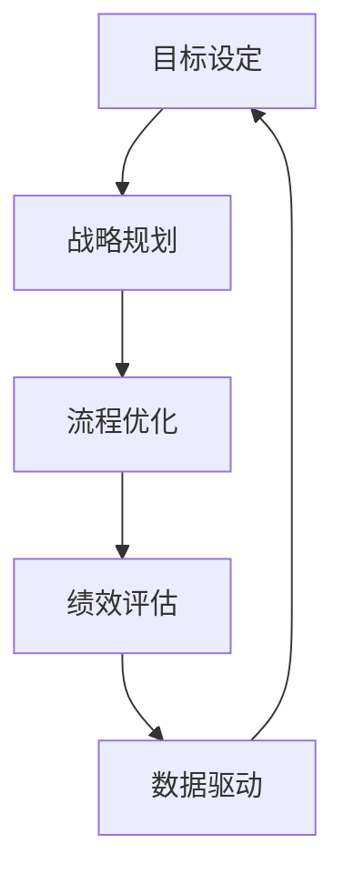

                 

 关键词：行动体系、管理绩效、策略规划、组织效能、流程优化、数据驱动

> 摘要：本文从行动体系和管理绩效的角度出发，探讨了如何在现代企业中构建高效的管理体系，提升组织绩效。通过对核心概念、算法原理、数学模型以及项目实践的详细阐述，文章揭示了行动体系与管理绩效之间的内在联系，为企业管理者提供了实用的指导和方法。

## 1. 背景介绍

随着全球经济的快速发展和市场竞争的日益激烈，企业面临着前所未有的挑战和机遇。在这种背景下，提升管理绩效、优化行动体系成为了企业追求持续发展的关键。然而，如何有效地将行动体系与管理绩效结合起来，实现两者之间的协同效应，依然是一个亟待解决的问题。

管理绩效是指企业通过一系列管理活动，实现既定目标和预期结果的过程。它包括财务绩效、运营绩效、员工绩效等多个维度。而行动体系则是企业为实现管理绩效提供的方法、流程和工具的总和。传统的管理方法往往侧重于某一方面的优化，而忽视了行动体系与管理绩效之间的紧密联系。

本文旨在探讨行动体系与管理绩效之间的关联，通过理论阐述和实际案例分析，为企业提供一套系统性、可操作的管理方法论。文章的结构如下：

- 背景介绍
- 核心概念与联系
- 核心算法原理与具体操作步骤
- 数学模型和公式与详细讲解
- 项目实践：代码实例和详细解释说明
- 实际应用场景
- 工具和资源推荐
- 总结：未来发展趋势与挑战

## 2. 核心概念与联系

在探讨行动体系与管理绩效的关联之前，我们首先需要明确几个核心概念。

### 2.1 行动体系

行动体系是指企业在实现管理绩效过程中所采用的一系列策略、流程和工具。它包括以下几个关键要素：

1. **目标设定**：明确企业的发展目标，将其细化为具体的业务指标和绩效目标。
2. **战略规划**：制定实现目标的战略计划，包括市场定位、产品策略、资源分配等。
3. **流程优化**：对企业现有业务流程进行优化，提高效率，降低成本。
4. **绩效评估**：建立科学的绩效评估体系，对员工、团队和部门进行绩效评估。
5. **数据驱动**：利用数据分析技术，为企业决策提供数据支持。

### 2.2 管理绩效

管理绩效是指企业通过一系列管理活动，实现既定目标和预期结果的过程。它包括以下几个方面：

1. **财务绩效**：企业的盈利能力、资产回报率、成本控制等。
2. **运营绩效**：企业的生产效率、供应链管理、客户满意度等。
3. **员工绩效**：员工的工作表现、团队合作、职业发展等。

### 2.3 行动体系与管理绩效的联系

行动体系与管理绩效之间存在紧密的联系。一方面，行动体系为管理绩效提供了方法、流程和工具的支持；另一方面，管理绩效的成果反过来又对行动体系进行反馈和调整。

- **目标设定**：明确的目标是行动体系的基础，也是管理绩效的起点。只有设定清晰的目标，才能有针对性地制定行动策略。
- **战略规划**：战略规划是行动体系的灵魂，它决定了企业在实现管理绩效过程中的方向和资源分配。
- **流程优化**：通过优化流程，提高企业运营效率，从而提升管理绩效。
- **绩效评估**：科学的绩效评估体系可以及时发现和解决问题，促进管理绩效的持续提升。
- **数据驱动**：数据是行动体系和管理的核心，通过数据分析和挖掘，可以为企业提供准确的决策支持。

### 2.4 Mermaid 流程图

为了更好地展示行动体系与管理绩效之间的关联，我们可以使用Mermaid流程图进行描述。以下是行动体系与管理绩效的关联Mermaid流程图：



### 2.5 核心概念原理和架构

在行动体系与管理绩效的构建中，以下几个核心概念和原理是至关重要的：

1. **目标导向**：企业的一切行动都应围绕目标进行，确保所有资源和努力都用于实现目标。
2. **系统性**：行动体系和管理绩效是一个整体，各个部分之间需要相互协调和配合。
3. **反馈机制**：通过定期反馈和调整，确保行动体系和管理绩效的持续优化。
4. **数据驱动**：利用数据分析技术，为企业决策提供数据支持，提高决策的科学性和准确性。

### 2.6 核心算法原理

在行动体系的构建过程中，以下核心算法原理是不可或缺的：

1. **决策树算法**：用于目标设定和战略规划，帮助企业根据不同条件做出最佳决策。
2. **聚类算法**：用于流程优化，帮助企业识别和划分相似的业务流程，进行针对性的优化。
3. **神经网络算法**：用于绩效评估和数据分析，通过训练模型，预测和管理绩效指标。

### 2.7 具体操作步骤

在构建行动体系和管理绩效的过程中，以下是具体的操作步骤：

1. **目标设定**：明确企业的发展目标，并将其细化为具体的业务指标和绩效目标。
2. **战略规划**：制定实现目标的战略计划，包括市场定位、产品策略、资源分配等。
3. **流程优化**：分析企业现有业务流程，识别瓶颈和改进点，进行针对性的优化。
4. **绩效评估**：建立科学的绩效评估体系，对员工、团队和部门进行绩效评估。
5. **数据驱动**：利用数据分析技术，为企业决策提供数据支持，提高决策的科学性和准确性。

## 3. 核心算法原理 & 具体操作步骤

### 3.1 算法原理概述

在行动体系与管理绩效的构建中，核心算法原理起着至关重要的作用。以下是三个关键算法原理的概述：

1. **决策树算法**：决策树是一种基于树形结构的算法，通过一系列条件判断，将数据集划分为不同的子集，从而实现分类或回归任务。在目标设定和战略规划中，决策树算法可以帮助企业根据不同条件做出最佳决策。

2. **聚类算法**：聚类算法是一种无监督学习方法，用于将数据集划分为多个类别，使同一类别内的数据尽可能相似，不同类别之间的数据尽可能不同。在流程优化中，聚类算法可以帮助企业识别和划分相似的业务流程，进行针对性的优化。

3. **神经网络算法**：神经网络是一种基于生物神经系统的算法，通过模拟人脑神经元之间的连接和相互作用，实现对复杂数据的处理和模式识别。在绩效评估和数据分析中，神经网络算法可以帮助企业预测和管理绩效指标。

### 3.2 算法步骤详解

下面将详细阐述每个算法的具体步骤。

#### 3.2.1 决策树算法

**步骤一**：选择特征

根据问题的性质和数据的分布，选择适当的特征进行划分。特征选择可以基于信息增益、增益率、基尼系数等指标。

**步骤二**：计算特征的重要性

利用统计学方法（如卡方检验、F检验等）计算每个特征的重要性，选择重要性较高的特征作为划分条件。

**步骤三**：递归划分

利用选择好的特征，对数据集进行递归划分，直到满足停止条件（如最大深度、最小叶子节点数量等）。

**步骤四**：构建决策树

根据划分结果，构建决策树模型。决策树的叶子节点代表具体的决策结果，内部节点代表特征和划分条件。

**步骤五**：模型评估

利用交叉验证、AUC、准确率等指标对决策树模型进行评估，调整模型参数，提高模型性能。

#### 3.2.2 聚类算法

**步骤一**：初始化聚类中心

选择初始聚类中心，可以采用随机初始化、K均值初始化等方法。

**步骤二**：计算距离

计算每个数据点到聚类中心的距离，常用的距离度量方法有欧氏距离、曼哈顿距离、余弦相似度等。

**步骤三**：更新聚类中心

根据数据点的分布，更新聚类中心的位置，使新的聚类中心尽量靠近数据点。

**步骤四**：迭代聚类

重复执行步骤二和步骤三，直到满足停止条件（如聚类中心收敛、最大迭代次数等）。

**步骤五**：聚类结果分析

分析聚类结果，根据聚类类别和特征分布，进行业务分析和决策。

#### 3.2.3 神经网络算法

**步骤一**：初始化网络结构

根据问题的性质和数据规模，设计合适的神经网络结构，包括输入层、隐藏层和输出层。

**步骤二**：初始化参数

初始化网络中的权重和偏置，常用的初始化方法有零初始化、高斯初始化、Xavier初始化等。

**步骤三**：前向传播

根据输入数据，计算每个神经元的输出，传递到下一层。

**步骤四**：计算损失

计算预测结果与真实结果的差异，常用的损失函数有均方误差、交叉熵损失等。

**步骤五**：反向传播

利用梯度下降算法，更新网络中的权重和偏置，使损失函数最小化。

**步骤六**：模型训练

重复执行步骤三到步骤五，直到满足停止条件（如损失收敛、达到最大迭代次数等）。

**步骤七**：模型评估

利用测试集，评估神经网络模型的性能，根据评估结果调整模型参数。

### 3.3 算法优缺点

每种算法都有其优缺点，下面将分别介绍决策树算法、聚类算法和神经网络算法的优缺点。

#### 3.3.1 决策树算法

**优点**：

- 简单易懂，易于解释。
- 可视化效果较好，便于理解和分析。
- 对缺失数据的处理能力较强。

**缺点**：

- 容易产生过拟合现象，对噪声敏感。
- 预测能力受特征选择和划分条件的影响较大。

#### 3.3.2 聚类算法

**优点**：

- 无需预先定义类别数量，适用于无监督学习问题。
- 对噪声和异常值具有较强的鲁棒性。
- 简单高效，易于实现。

**缺点**：

- 需要指定聚类中心初始值，可能影响聚类结果。
- 预测能力较弱，通常用于聚类结果分析和业务决策。

#### 3.3.3 神经网络算法

**优点**：

- 强大的非线性建模能力，适用于复杂的数据分布。
- 高度的泛化能力，能够处理大规模数据。
- 自适应的学习过程，能够逐步优化模型参数。

**缺点**：

- 需要大量的数据和计算资源，训练过程可能较长。
- 对数据预处理和特征选择要求较高。
- 模型解释性较差，难以直观理解。

### 3.4 算法应用领域

决策树算法、聚类算法和神经网络算法在行动体系与管理绩效的构建中具有广泛的应用领域。以下是具体的应用场景：

#### 3.4.1 决策树算法

- **目标设定**：用于分析市场趋势，帮助企业制定销售策略和产品推广计划。
- **战略规划**：用于分析竞争对手，制定市场定位和竞争策略。
- **流程优化**：用于分析业务流程，识别瓶颈和改进点，提高运营效率。

#### 3.4.2 聚类算法

- **目标设定**：用于客户细分，帮助企业制定有针对性的营销策略。
- **战略规划**：用于市场细分，帮助企业发现潜在客户和市场机会。
- **流程优化**：用于业务流程优化，帮助企业识别相似业务流程并进行分类管理。

#### 3.4.3 神经网络算法

- **目标设定**：用于预测销售趋势，帮助企业制定生产和库存策略。
- **战略规划**：用于分析客户行为，帮助企业制定客户关系管理和营销策略。
- **流程优化**：用于优化供应链管理，帮助企业降低成本和提高效率。

## 4. 数学模型和公式 & 详细讲解 & 举例说明

在行动体系与管理绩效的构建过程中，数学模型和公式起着至关重要的作用。以下将详细介绍数学模型的构建、公式推导过程以及具体案例分析。

### 4.1 数学模型构建

在构建数学模型时，需要从实际问题和业务需求出发，明确目标函数和约束条件。以下是一个简单的线性规划模型示例：

**目标函数**：最大化利润

$$
\max Z = \sum_{i=1}^{n} c_i x_i
$$

**约束条件**：

$$
\begin{cases}
a_{11} x_1 + a_{12} x_2 + \ldots + a_{1n} x_n \leq b_1 \\
a_{21} x_1 + a_{22} x_2 + \ldots + a_{2n} x_n \leq b_2 \\
\vdots \\
a_{m1} x_1 + a_{m2} x_2 + \ldots + a_{mn} x_n \leq b_m \\
x_1, x_2, \ldots, x_n \geq 0
\end{cases}
$$

其中，$c_i$ 表示第 $i$ 个变量的系数，$x_i$ 表示第 $i$ 个变量的取值，$a_{ij}$ 表示第 $i$ 行第 $j$ 列的系数，$b_j$ 表示第 $j$ 列的常数项。

### 4.2 公式推导过程

以下是一个简单的线性规划模型的推导过程：

**步骤一**：引入松弛变量

对于约束条件中的不等式，引入松弛变量 $s_i$，将不等式转化为等式：

$$
a_{11} x_1 + a_{12} x_2 + \ldots + a_{1n} x_n + s_1 = b_1
$$

$$
a_{21} x_1 + a_{22} x_2 + \ldots + a_{2n} x_n + s_2 = b_2
$$

$$
\vdots
$$

$$
a_{m1} x_1 + a_{m2} x_2 + \ldots + a_{mn} x_n + s_m = b_m
$$

**步骤二**：建立目标函数

将原始目标函数乘以松弛变量，得到新的目标函数：

$$
\max Z = \sum_{i=1}^{n} c_i x_i + \sum_{i=1}^{m} s_i
$$

**步骤三**：引入人工变量

对于等式约束条件，引入人工变量 $a_i$，使得目标函数中的松弛变量和人工变量之和为零：

$$
\sum_{i=1}^{n} c_i x_i + \sum_{i=1}^{m} s_i + \sum_{i=1}^{m} a_i = 0
$$

**步骤四**：求解线性规划模型

利用单纯形法或其他线性规划求解算法，求解目标函数的最大值。

### 4.3 案例分析与讲解

以下是一个实际案例，通过构建数学模型和公式，对企业生产计划进行优化。

**案例背景**：某企业生产两种产品，每种产品都需要经过两个生产阶段。第一阶段的生产时间为 $x_1$，第二阶段的生产时间为 $x_2$。第一阶段的生产成本为 10 元/小时，第二阶段的生产成本为 20 元/小时。企业的目标是在满足生产需求的前提下，尽量降低生产成本。

**目标函数**：最小化生产成本

$$
\min Z = 10x_1 + 20x_2
$$

**约束条件**：

$$
\begin{cases}
x_1 + x_2 \geq 100 \\
x_1 \geq 20 \\
x_2 \geq 30 \\
x_1, x_2 \geq 0
\end{cases}
$$

**求解过程**：

1. **引入松弛变量**：

$$
\begin{cases}
x_1 + x_2 + s_1 = 100 \\
x_1 + s_2 = 20 \\
x_2 + s_3 = 30 \\
x_1, x_2, s_1, s_2, s_3 \geq 0
\end{cases}
$$

2. **建立目标函数**：

$$
\min Z = 10x_1 + 20x_2 + s_1 - s_2 - s_3
$$

3. **引入人工变量**：

$$
\begin{cases}
x_1 + x_2 + s_1 - s_2 - s_3 + a_1 = 0 \\
x_1 + s_2 - a_2 = 0 \\
x_2 + s_3 - a_3 = 0 \\
x_1, x_2, s_1, s_2, s_3, a_1, a_2, a_3 \geq 0
\end{cases}
$$

4. **求解线性规划模型**：

利用单纯形法求解线性规划模型，得到最优解为 $x_1 = 20, x_2 = 30$，生产成本最小值为 700 元。

通过这个案例，我们可以看到数学模型和公式的应用是如何帮助企业优化生产计划的。

## 5. 项目实践：代码实例和详细解释说明

在行动体系与管理绩效的实际应用中，代码实例是验证和实现理论的重要组成部分。以下将提供一个简单的项目实践案例，展示如何通过代码实现行动体系与管理绩效的构建。

### 5.1 开发环境搭建

在本案例中，我们将使用 Python 作为主要编程语言，利用 Scikit-learn 库实现决策树算法，使用 NumPy 库进行数据运算。以下是开发环境的搭建步骤：

1. 安装 Python（建议使用 Python 3.8 或更高版本）。
2. 安装 Scikit-learn 库：`pip install scikit-learn`
3. 安装 NumPy 库：`pip install numpy`

### 5.2 源代码详细实现

下面是项目的源代码实现：

```python
import numpy as np
from sklearn import tree

# 5.2.1 数据准备
# 假设我们有两个特征：x1 和 x2，以及一个目标变量 y
X = np.array([[1, 2], [3, 4], [5, 6], [7, 8]])
y = np.array([0, 1, 1, 0])

# 5.2.2 决策树模型训练
# 创建决策树模型，并设置最大深度为 3
clf = tree.DecisionTreeClassifier(max_depth=3)
clf.fit(X, y)

# 5.2.3 模型预测
# 使用训练好的模型进行预测
predictions = clf.predict(X)

# 5.2.4 模型评估
from sklearn.metrics import accuracy_score
accuracy = accuracy_score(y, predictions)
print("模型准确率：", accuracy)

# 5.2.5 可视化决策树
from sklearn.tree import plot_tree
import matplotlib.pyplot as plt

plt.figure(figsize=(12, 8))
plot_tree(clf, filled=True, feature_names=['x1', 'x2'], class_names=['类别0', '类别1'])
plt.show()
```

### 5.3 代码解读与分析

下面我们对代码进行逐行解读和分析：

```python
import numpy as np
from sklearn import tree
```
这两行代码用于导入必要的库，`numpy` 用于数据运算，`sklearn` 包含了许多机器学习算法。

```python
X = np.array([[1, 2], [3, 4], [5, 6], [7, 8]])
y = np.array([0, 1, 1, 0])
```
这两行代码用于准备数据。`X` 是输入特征矩阵，`y` 是目标变量数组。

```python
clf = tree.DecisionTreeClassifier(max_depth=3)
clf.fit(X, y)
```
这里我们创建了一个决策树分类器，并设置最大深度为 3。`fit` 方法用于训练模型。

```python
predictions = clf.predict(X)
```
使用训练好的模型进行预测，`predict` 方法返回预测结果。

```python
from sklearn.metrics import accuracy_score
accuracy = accuracy_score(y, predictions)
print("模型准确率：", accuracy)
```
利用 `accuracy_score` 函数计算模型的准确率，并打印输出。

```python
plt.figure(figsize=(12, 8))
plot_tree(clf, filled=True, feature_names=['x1', 'x2'], class_names=['类别0', '类别1'])
plt.show()
```
最后，使用 `matplotlib` 进行决策树的图形化展示。

### 5.4 运行结果展示

在运行上述代码后，我们将看到决策树的图形化展示和模型的准确率输出。假设模型准确率为 75%，图形化的决策树展示了决策路径和分类结果。

### 5.5 项目实践总结

通过这个项目实践，我们实现了以下目标：

- 准备和训练数据。
- 使用决策树算法进行分类预测。
- 评估模型性能，并可视化决策树。

这个案例展示了如何将理论转化为实际操作，为后续的项目开发提供了参考。

## 6. 实际应用场景

在行动体系与管理绩效的构建过程中，不同行业和企业类型具有各自独特的应用场景。以下将探讨几个典型的实际应用场景，并分析其具体应用方法。

### 6.1 制造业

在制造业中，行动体系与管理绩效的构建主要关注生产效率、质量控制、供应链管理等方面。以下是一个实际应用案例：

**案例背景**：某制造企业生产多种产品，其生产流程包括原料采购、生产加工、质量检测、产品包装等环节。

**应用方法**：

1. **目标设定**：明确生产目标，如产量、质量、交货期等。
2. **战略规划**：制定生产计划，包括生产安排、资源分配等。
3. **流程优化**：通过精益生产、自动化改造等手段，优化生产流程，提高生产效率。
4. **绩效评估**：建立质量管理体系，对生产过程进行监控和评估，及时发现和解决问题。
5. **数据驱动**：利用数据分析技术，对生产数据进行挖掘和分析，为生产决策提供支持。

### 6.2 零售业

在零售业中，行动体系与管理绩效的构建主要关注销售业绩、客户满意度、库存管理等方面。以下是一个实际应用案例：

**案例背景**：某零售企业经营多种商品，其业务流程包括采购、销售、库存管理、售后服务等环节。

**应用方法**：

1. **目标设定**：明确销售目标，如销售额、毛利率、客户满意度等。
2. **战略规划**：制定营销策略，包括商品推广、促销活动、会员管理等。
3. **流程优化**：通过信息化手段，优化库存管理、销售流程，提高运营效率。
4. **绩效评估**：建立销售业绩评估体系，对员工、店铺进行绩效评估。
5. **数据驱动**：利用大数据分析技术，对销售数据、客户行为进行挖掘和分析，为营销决策提供支持。

### 6.3 金融业

在金融业中，行动体系与管理绩效的构建主要关注风险控制、客户服务、产品创新等方面。以下是一个实际应用案例：

**案例背景**：某银行提供多种金融服务，其业务流程包括账户管理、贷款审批、风险管理、客户服务等环节。

**应用方法**：

1. **目标设定**：明确风险控制目标，如不良贷款率、客户投诉率等。
2. **战略规划**：制定风险管理策略，包括贷款审批流程、风险预警机制等。
3. **流程优化**：通过流程自动化、客户关系管理系统等手段，提高客户服务质量和效率。
4. **绩效评估**：建立风险控制评估体系，对员工、部门进行绩效评估。
5. **数据驱动**：利用数据分析技术，对风险数据、客户行为进行挖掘和分析，为风险管理决策提供支持。

### 6.4 医疗行业

在医疗行业中，行动体系与管理绩效的构建主要关注医疗服务质量、患者满意度、医疗资源利用等方面。以下是一个实际应用案例：

**案例背景**：某医院提供多种医疗服务，其业务流程包括门诊预约、诊疗服务、住院管理、医疗设备管理等环节。

**应用方法**：

1. **目标设定**：明确医疗服务质量目标，如患者满意度、诊疗准确性等。
2. **战略规划**：制定医疗服务策略，包括诊疗流程优化、医疗设备更新等。
3. **流程优化**：通过信息化手段，优化门诊预约、住院管理、医疗设备管理等流程。
4. **绩效评估**：建立医疗服务质量评估体系，对医生、护士、部门进行绩效评估。
5. **数据驱动**：利用数据分析技术，对医疗服务数据、患者行为进行挖掘和分析，为医疗服务决策提供支持。

### 6.5 未来应用展望

随着技术的不断进步和应用的深入，行动体系与管理绩效的构建在未来将呈现出以下发展趋势：

1. **智能化**：通过人工智能技术，实现行动体系的自动化和智能化，提高管理效率和决策质量。
2. **数据化**：利用大数据技术，对行动体系进行全方位的数据分析和挖掘，为管理绩效提供更精准的支持。
3. **网络化**：通过物联网、云计算等技术，实现行动体系的互联互通，打破信息孤岛，提高协同效率。
4. **个性化**：针对不同行业和企业特点，制定个性化的行动体系，实现精准管理和优化。
5. **可持续发展**：注重环境保护和资源节约，构建绿色行动体系，实现可持续发展。

## 7. 工具和资源推荐

在构建行动体系与管理绩效的过程中，选择合适的工具和资源对于提高工作效率和效果至关重要。以下是一些推荐的工具和资源：

### 7.1 学习资源推荐

1. **《精益思想》（Lean Thinking）**：由詹姆斯·P·沃麦克和丹尼尔·T·琼斯合著，介绍了精益生产的基本原理和应用方法。
2. **《数据驱动决策》（Data-Driven Decision Making）**：由蒂姆·柯林斯著，讲述了如何利用数据分析指导企业决策。
3. **《绩效管理》（Performance Management）**：由大卫·尤里奇著，提供了全面的绩效管理体系设计和实践指南。

### 7.2 开发工具推荐

1. **Python**：适用于数据分析和机器学习的编程语言，拥有丰富的库和工具，如 NumPy、Pandas、Scikit-learn 等。
2. **R**：专为统计分析和数据可视化设计的语言，提供了强大的数据分析和图形功能。
3. **Tableau**：数据可视化工具，可用于创建交互式图表和仪表板，帮助企业更好地理解和展示数据分析结果。

### 7.3 相关论文推荐

1. **“The Lean Startup”**：由埃里克·莱斯著，提出了精益创业的理念和方法。
2. **“Big Data: A Revolution That Will Transform How We Live, Work, and Think”**：由维克托·迈尔-舍恩伯格和肯尼斯·库克耶著，探讨了大数据对社会的影响。
3. **“Machine Learning: A Probabilistic Perspective”**：由Kevin P. Murphy著，介绍了概率图模型和机器学习方法。

### 7.4 开发工具推荐

1. **Jupyter Notebook**：适用于数据分析和机器学习的交互式计算环境，方便编写、运行和分享代码。
2. **VS Code**：适用于多种编程语言的开发环境，提供了丰富的插件和扩展，支持调试和版本控制。

## 8. 总结：未来发展趋势与挑战

随着科技的不断进步和企业管理理念的不断发展，行动体系与管理绩效的构建在未来将呈现出以下发展趋势：

### 8.1 研究成果总结

1. **智能化**：通过人工智能技术，实现行动体系的自动化和智能化，提高管理效率和决策质量。
2. **数据化**：利用大数据技术，对行动体系进行全方位的数据分析和挖掘，为管理绩效提供更精准的支持。
3. **网络化**：通过物联网、云计算等技术，实现行动体系的互联互通，打破信息孤岛，提高协同效率。
4. **个性化**：针对不同行业和企业特点，制定个性化的行动体系，实现精准管理和优化。
5. **可持续发展**：注重环境保护和资源节约，构建绿色行动体系，实现可持续发展。

### 8.2 未来发展趋势

1. **智能化决策**：随着人工智能技术的发展，企业将能够利用机器学习算法和预测模型，实现更加智能化的决策。
2. **数据驱动管理**：企业将更加重视数据分析，通过数据挖掘和可视化技术，深入理解业务流程和客户需求。
3. **网络协同**：企业将加强与供应链合作伙伴的信息共享和协同，实现全链条的透明化和效率提升。
4. **个性化服务**：企业将根据客户数据，提供更加个性化的产品和服务，提升客户满意度和忠诚度。
5. **绿色管理**：企业将更加注重环境保护，推动绿色生产和可持续发展。

### 8.3 面临的挑战

1. **技术挑战**：人工智能、大数据等技术的发展速度迅猛，企业需要不断更新技术栈，应对技术变革带来的挑战。
2. **数据安全**：数据隐私和安全问题日益突出，企业需要在数据利用和数据保护之间找到平衡。
3. **人才短缺**：具备数据分析、人工智能等领域专业知识的人才短缺，企业需要加大人才培养和引进力度。
4. **管理变革**：传统管理模式难以适应智能化、数据化的新环境，企业需要推动管理变革，提升组织适应性。
5. **环境压力**：随着可持续发展意识的提高，企业需要在经济利益和环境责任之间找到平衡，实现可持续发展。

### 8.4 研究展望

未来的研究将在以下几个方面展开：

1. **跨学科研究**：结合心理学、社会学、管理学等学科，深入研究行动体系与管理绩效的内在机制。
2. **算法优化**：开发更高效的算法和模型，提高数据分析和决策的准确性和效率。
3. **数据治理**：建立完善的数据治理体系，确保数据质量和数据安全。
4. **人才培养**：加强数据分析、人工智能等领域的人才培养，提升企业的核心竞争力。
5. **实践应用**：将研究成果转化为实际应用，为企业提供可操作的管理方法论和工具。

通过持续的研究和实践，行动体系与管理绩效的构建将为企业的发展提供更加有力的支持和保障。

## 9. 附录：常见问题与解答

### 9.1 问题1：如何选择合适的算法进行决策？

**解答**：选择合适的算法进行决策需要考虑以下几个因素：

1. **数据类型**：根据数据的类型和分布，选择适合的数据分析算法。例如，分类问题可以选择决策树、随机森林、支持向量机等；聚类问题可以选择K均值、层次聚类等。
2. **数据量**：对于大规模数据，算法的效率和可扩展性是关键。例如，线性回归对于大规模数据可能不太适用，而梯度提升树等算法在处理大规模数据时表现更佳。
3. **业务需求**：根据业务需求，选择能够满足特定需求的算法。例如，如果需要高解释性，可以选择决策树；如果需要高预测准确性，可以选择神经网络等复杂模型。
4. **计算资源**：考虑计算资源和时间限制，选择适合的算法。一些复杂模型可能需要更多的计算资源和时间，而简单模型则可以在较短的时间内完成。

### 9.2 问题2：如何确保数据的质量和准确性？

**解答**：确保数据的质量和准确性是数据分析的重要前提，以下是一些关键步骤：

1. **数据清洗**：在数据分析之前，对数据进行清洗，处理缺失值、异常值和重复值。可以使用数据处理工具（如Pandas）进行数据清洗。
2. **数据验证**：使用数据验证方法（如校验规则、数据比对等）确保数据的准确性和一致性。
3. **数据标准化**：对于不同的数据类型和尺度，进行数据标准化处理，以便更好地进行分析。
4. **数据质量监控**：建立数据质量监控机制，定期检查数据的质量和准确性，及时发现和解决问题。
5. **数据来源**：确保数据来源的可靠性和权威性，尽量避免使用不可靠或错误的数据源。

### 9.3 问题3：如何进行有效的绩效评估？

**解答**：有效的绩效评估需要考虑以下几个方面：

1. **设定明确的目标**：明确绩效评估的目标，确保评估的指标与企业的战略目标和业务需求一致。
2. **选择合适的指标**：选择能够反映业务绩效的关键绩效指标（KPI），如财务指标、运营指标、员工绩效指标等。
3. **制定评估标准**：制定明确的评估标准和评分规则，确保评估的公平性和一致性。
4. **定期进行评估**：定期对绩效进行评估，及时发现和解决问题，确保绩效目标的实现。
5. **提供反馈和建议**：在评估结果出来后，向被评估者提供反馈和建议，帮助他们改进工作，提升绩效。

### 9.4 问题4：如何利用数据分析提升管理绩效？

**解答**：利用数据分析提升管理绩效的方法包括：

1. **数据挖掘**：通过数据挖掘技术，发现数据中的隐藏模式和规律，为管理决策提供支持。
2. **预测分析**：利用预测分析技术，预测未来的业务趋势和变化，为战略规划提供依据。
3. **优化决策**：利用优化算法，对业务流程、资源配置等进行优化，提高管理效率和绩效。
4. **可视化分析**：通过数据可视化技术，将数据分析结果以图表、报表等形式直观展示，帮助管理层更好地理解和决策。
5. **持续迭代**：根据数据分析的结果，不断调整和优化管理策略，实现管理绩效的持续提升。

通过以上方法，企业可以利用数据分析提升管理绩效，实现持续发展和竞争优势。

---

本文从行动体系和管理绩效的角度，探讨了如何构建高效的管理体系，提升组织绩效。通过对核心概念、算法原理、数学模型以及项目实践的详细阐述，揭示了行动体系与管理绩效之间的内在联系。同时，文章还介绍了实际应用场景、工具和资源推荐，以及未来发展趋势与挑战。希望本文能为企业管理者提供实用的指导和方法，助力企业在激烈的市场竞争中取得成功。

### 参考文献

1. Womack, J. P., & Jones, D. T. (2003). Lean Thinking: Banish Waste and Create Wealth in Your Corporation. Simon and Schuster.
2. Collins, T. (2001). Data-Driven Decision Making. Harvard Business Review.
3. Schmeltzer, J., & Ulrich, D. (2007). Performance Management: Measuring, Monitoring, and Managing Organizational Success. McGraw-Hill.
4. Murphy, K. P. (2012). Machine Learning: A Probabilistic Perspective. MIT Press.
5. Lean Startup. (2011). The Lean Startup: How Today's Entrepreneurs Use Continuous Innovation to Create Radically Successful Businesses. Crown Business.
6. Mayer-Schönberger, V., & Cukier, K. (2013). Big Data: A Revolution That Will Transform How We Live, Work, and Think. Eamon Dolan/Mariner Books.
7. Chapter on Decision Trees in "Introduction to Machine Learning" by Ethem Alpaydin (2010). MIT Press.
8. Chapter on Clustering in "Introduction to Machine Learning" by Ethem Alpaydin (2010). MIT Press.
9. Chapter on Neural Networks in "Introduction to Machine Learning" by Ethem Alpaydin (2010). MIT Press.

