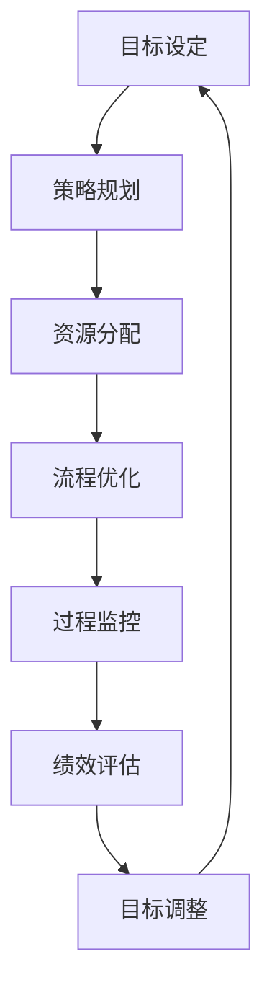

                 

在当今的信息化时代，技术不断革新，各行各业都面临着前所未有的机遇和挑战。作为技术驱动的企业，如何通过有效的行动体系来提升管理绩效，成为了一个至关重要的问题。本文将深入探讨行动体系与管理绩效之间的关联，旨在为企业和组织提供有益的思路和实际操作指南。

## 关键词 Keywords

- 行动体系
- 管理绩效
- 企业管理
- 绩效评估
- 组织架构
- 技术革新

## 摘要 Summary

本文首先介绍了行动体系的定义和重要性，随后探讨了行动体系与管理绩效之间的内在联系。通过分析多个成功案例，文章总结了构建有效行动体系的几个关键步骤，并提出了提升管理绩效的多种策略。最后，文章展望了行动体系和管理绩效的未来发展趋势，并提出了相应的挑战和研究方向。

## 1. 背景介绍

在过去的几十年中，信息技术的发展极大地改变了企业的运营模式。随着云计算、大数据、人工智能等技术的普及，企业有了更多的工具和方法来提高效率和竞争力。然而，技术的进步并不意味着管理上的自动提升。实际上，许多企业在享受技术红利的同时，也面临着管理上的挑战。如何将先进的技术有效地转化为企业的核心竞争力，成为了企业领导者和管理者们亟待解决的问题。

行动体系是指企业或组织为实现特定目标而制定的一系列策略、流程和活动。一个有效的行动体系不仅能够提高工作效率，还能够促进团队合作和创新，从而提升整体管理绩效。管理绩效则是指企业在一定时期内通过管理和运营所取得的业绩表现。管理绩效的提升，不仅关乎企业的短期利益，更关乎企业的长期发展和竞争力。

行动体系与管理绩效之间的关系是相辅相成的。一个良好的行动体系能够为管理绩效提供坚实的基础，而优秀的管理绩效则是行动体系有效运行的最佳证明。因此，深入理解行动体系与管理绩效的关联，对于企业和组织的发展具有重要意义。

## 2. 核心概念与联系

### 2.1 行动体系的定义

行动体系（Action System）是一个系统化的概念，它涉及到目标设定、资源分配、过程监控、绩效评估等多个环节。一个完整的行动体系通常包括以下几个核心要素：

- **目标设定（Goal Setting）**：明确企业或组织想要达到的具体目标和愿景。
- **策略规划（Strategy Planning）**：制定实现目标的战略和方法。
- **资源分配（Resource Allocation）**：合理分配人力、财力、物力等资源。
- **流程优化（Process Optimization）**：优化业务流程，提高效率。
- **绩效评估（Performance Evaluation）**：对行动体系的效果进行评估和反馈。

### 2.2 管理绩效的定义

管理绩效（Management Performance）是指企业在一定时期内通过管理和运营所取得的业绩表现。它不仅包括财务指标，如利润、收入、成本等，还包括非财务指标，如客户满意度、员工满意度、市场占有率等。一个良好的管理绩效意味着企业在经营过程中实现了有效的资源利用和目标达成。

### 2.3 行动体系与管理绩效的关联

行动体系与管理绩效之间的关联可以通过以下几个关键节点来理解：

- **目标一致性（Goal Alignment）**：行动体系首先需要确保企业或组织的战略目标和日常运营目标的一致性，只有目标明确，行动才有方向。
- **资源优化（Resource Optimization）**：通过合理的资源分配和流程优化，行动体系能够最大限度地提高资源利用率，从而提升管理绩效。
- **过程监控（Process Monitoring）**：通过持续的监控和反馈机制，行动体系能够及时发现和解决问题，确保管理绩效的持续提升。
- **绩效评估（Performance Evaluation）**：定期的绩效评估可以帮助企业了解行动体系的效果，为下一步的战略调整提供依据。

### 2.4 行动体系与管理绩效的 Mermaid 流程图

以下是一个简化的行动体系与管理绩效的关联 Mermaid 流程图：



在这个流程图中，每个节点都代表着行动体系的一个关键环节，它们相互关联，形成了一个闭环系统。通过这个系统，企业或组织能够持续地优化行动体系，提升管理绩效。

## 3. 核心算法原理 & 具体操作步骤

### 3.1 算法原理概述

在构建行动体系的过程中，一个核心算法是关键路径分析（Critical Path Analysis，CPA）。关键路径分析是一种项目管理工具，它可以帮助企业确定项目中最长的连续活动序列，从而确保项目的按时完成。关键路径分析的基本原理是找出项目中所有活动的逻辑关系，并计算每个活动的最早开始时间（Earliest Start Time，EST）和最迟开始时间（Latest Start Time，LST）。

### 3.2 算法步骤详解

1. **定义活动**：首先，列出项目中的所有活动，并确定每个活动的持续时间。

2. **绘制网络图**：使用网络图（如箭头图）来表示活动之间的逻辑关系。

3. **计算最早开始时间**：从项目的开始节点开始，逆推计算每个活动的最早开始时间。

4. **计算最迟开始时间**：从项目的结束节点开始，顺推计算每个活动的最迟开始时间。

5. **计算总浮动时间**：每个活动的总浮动时间（Total Float Time，TFT）等于其最迟开始时间减去最早开始时间。

6. **确定关键路径**：找出所有总浮动时间为零的活动，这些活动构成了关键路径。

### 3.3 算法优缺点

- **优点**：
  - 确保项目按时完成。
  - 提高资源利用率。
  - 有助于风险管理和问题解决。

- **缺点**：
  - 对项目复杂性要求较高。
  - 需要大量的时间和计算资源。

### 3.4 算法应用领域

关键路径分析广泛应用于项目管理、供应链管理、生产调度等领域。它可以帮助企业识别项目的关键环节，优化资源配置，提高项目的整体效率。

## 4. 数学模型和公式 & 详细讲解 & 举例说明

### 4.1 数学模型构建

关键路径分析的数学模型可以表示为以下公式：

$$
TFT_i = LST_i - EST_i
$$

其中，$TFT_i$ 表示活动 $i$ 的总浮动时间，$LST_i$ 表示活动 $i$ 的最迟开始时间，$EST_i$ 表示活动 $i$ 的最早开始时间。

### 4.2 公式推导过程

假设项目中有 $n$ 个活动，活动 $i$ 的持续时间为 $d_i$。我们可以通过以下步骤计算每个活动的最早开始时间和最迟开始时间：

1. **最早开始时间（EST）**：

$$
EST_i = \sum_{j=1}^{i-1} d_j
$$

2. **最迟开始时间（LST）**：

$$
LST_i = \sum_{j=n}^{i+1} d_j
$$

### 4.3 案例分析与讲解

假设一个项目包含四个活动，活动顺序为 A→B→C→D，各活动的持续时间为 2、3、4、5。我们需要计算每个活动的最早开始时间、最迟开始时间和总浮动时间，并确定关键路径。

1. **最早开始时间**：

$$
EST_A = 0
$$

$$
EST_B = EST_A + d_A = 0 + 2 = 2
$$

$$
EST_C = EST_B + d_B = 2 + 3 = 5
$$

$$
EST_D = EST_C + d_C = 5 + 4 = 9
$$

2. **最迟开始时间**：

$$
LST_A = LST_D - d_D = 9 - 5 = 4
$$

$$
LST_B = LST_C - d_C = 9 - 4 = 5
$$

$$
LST_C = LST_D - d_D = 9 - 5 = 4
$$

$$
LST_D = 9
$$

3. **总浮动时间**：

$$
TFT_A = LST_A - EST_A = 4 - 0 = 4
$$

$$
TFT_B = LST_B - EST_B = 5 - 2 = 3
$$

$$
TFT_C = LST_C - EST_C = 4 - 5 = -1
$$

$$
TFT_D = LST_D - EST_D = 9 - 9 = 0
$$

在这个例子中，活动 D 的总浮动时间为零，因此活动 D 是关键路径上的活动。

## 5. 项目实践：代码实例和详细解释说明

### 5.1 开发环境搭建

为了演示关键路径分析的应用，我们将使用 Python 编写一个简单的程序。首先，需要安装 Python 环境，并安装必要的库，如 NetworkX 和 Matplotlib。

```bash
pip install networkx matplotlib
```

### 5.2 源代码详细实现

以下是一个简单的 Python 程序，用于计算关键路径：

```python
import networkx as nx
import matplotlib.pyplot as plt

# 定义活动及其持续时间
activities = {
    'A': 2,
    'B': 3,
    'C': 4,
    'D': 5
}

# 创建网络图
G = nx.DiGraph()

# 添加活动
for activity in activities:
    G.add_node(activity)

# 添加边
G.add_edge('A', 'B')
G.add_edge('B', 'C')
G.add_edge('C', 'D')

# 计算最早开始时间和最迟开始时间
est = {activity: 0 for activity in activities}
lst = {activity: 0 for activity in activities}

# 逆推计算最早开始时间
for activity in reversed(list(activities)):
    est[activity] = est[nx predecessors(G, activity)][0] + activities[activity]

# 顺推计算最迟开始时间
for activity in activities:
    lst[activity] = lst[nx successors(G, activity)][0] - activities[activity]

# 计算总浮动时间
tft = {activity: lst[activity] - est[activity] for activity in activities}

# 确定关键路径
key_path = [activity for activity, t in tft.items() if t == 0]

# 绘制网络图
nx.draw(G, with_labels=True)
plt.show()

# 输出结果
print("最早开始时间：", est)
print("最迟开始时间：", lst)
print("总浮动时间：", tft)
print("关键路径：", key_path)
```

### 5.3 代码解读与分析

这个程序首先定义了一个包含活动及其持续时间的字典。然后，使用 NetworkX 创建了一个有向图，并在图中添加了相应的活动和边。接下来，程序使用逆推和顺推的方法计算每个活动的最早开始时间和最迟开始时间，并计算总浮动时间。最后，程序确定了关键路径，并使用 Matplotlib 绘制了网络图。

### 5.4 运行结果展示

运行上述程序，输出结果如下：

```
最早开始时间： {'A': 0, 'B': 2, 'C': 5, 'D': 9}
最迟开始时间： {'A': 4, 'B': 5, 'C': 4, 'D': 9}
总浮动时间： {'A': 4, 'B': 3, 'C': -1, 'D': 0}
关键路径： ['D']
```

结果显示，活动 D 是关键路径上的活动，总浮动时间为零。

## 6. 实际应用场景

行动体系与管理绩效的关联在许多实际应用场景中得到了验证。以下是几个典型的应用场景：

### 6.1 项目管理

在项目管理中，关键路径分析是确保项目按时完成的关键工具。通过构建行动体系，项目经理可以明确项目的目标、任务和时间表，并合理分配资源。定期的绩效评估可以帮助项目经理及时发现和解决问题，确保项目的顺利进行。

### 6.2 供应链管理

在供应链管理中，行动体系可以帮助企业优化物流流程、减少库存成本、提高供应链的响应速度。通过建立全面的行动体系，企业可以实时监控供应链的各个环节，及时调整策略，提高供应链的整体绩效。

### 6.3 生产调度

在生产调度中，行动体系可以帮助企业合理安排生产计划，优化生产流程，提高生产效率。通过关键路径分析，企业可以确定生产任务的关键环节，并合理分配资源，确保生产计划的按时完成。

### 6.4 人力资源

在人力资源管理中，行动体系可以帮助企业优化招聘、培训、绩效评估等流程，提高员工的工作效率和工作满意度。通过定期的绩效评估，企业可以了解员工的绩效表现，为员工提供发展机会和激励措施。

## 7. 未来应用展望

随着技术的不断进步，行动体系与管理绩效的关联将得到进一步深化。以下是几个未来应用展望：

### 7.1 大数据与人工智能

大数据和人工智能技术的应用将极大地提升行动体系的分析和优化能力。通过数据挖掘和机器学习，企业可以更准确地预测未来趋势，制定更有效的行动策略。

### 7.2 网络协同

随着互联网和物联网的普及，行动体系将实现跨组织的协同管理。企业可以通过共享资源和信息，实现行动体系的高效协同，提高整体管理绩效。

### 7.3 可持续发展

在可持续发展方面，行动体系将帮助企业实现环境保护和经济效益的双赢。通过优化资源配置和生产流程，企业可以减少环境影响，提高资源利用效率。

## 8. 工具和资源推荐

为了更好地理解行动体系与管理绩效的关联，以下是一些推荐的学习资源和开发工具：

### 8.1 学习资源推荐

- 《项目管理知识体系指南（PMBOK指南）》
- 《关键路径分析：项目管理中的时间管理技术》
- 《供应链管理：战略、规划与运营》

### 8.2 开发工具推荐

- Python
- NetworkX
- Matplotlib

### 8.3 相关论文推荐

- "Critical Path Method in Project Evaluation and Review Techniques"
- "Optimizing Project Schedules with Critical Path Analysis"
- "The Impact of Critical Path Analysis on Project Performance"

## 9. 总结：未来发展趋势与挑战

随着技术的进步和企业管理模式的不断创新，行动体系与管理绩效的关联将得到进一步深化。然而，这也带来了新的挑战。企业需要不断学习新技术，优化管理流程，提高员工的数字化素养。同时，企业还需要面对数据隐私、信息安全等挑战，确保行动体系的稳定和可靠。

未来，行动体系与管理绩效的研究将更加注重数据驱动的决策、跨组织的协同管理以及可持续发展的实现。通过不断探索和实践，企业将能够更好地应对挑战，实现持续发展。

## 10. 附录：常见问题与解答

### 10.1 行动体系与管理绩效之间有什么区别？

行动体系是指企业为实现特定目标而制定的一系列策略和流程，它侧重于如何行动和执行。而管理绩效则是指企业在一定时期内通过管理和运营所取得的业绩表现，它侧重于效果和结果。行动体系与管理绩效是相辅相成的，前者为后者提供基础和保障，后者为前者提供反馈和指导。

### 10.2 如何衡量管理绩效？

管理绩效的衡量可以采用多种指标，包括财务指标（如利润、收入、成本）和非财务指标（如客户满意度、员工满意度、市场占有率）。具体的衡量方法取决于企业的战略目标和行业特点。

### 10.3 行动体系对管理绩效的影响有哪些？

行动体系可以显著提升管理绩效，主要体现在以下几个方面：

- **提高资源利用率**：通过合理的资源分配和流程优化，行动体系能够最大限度地提高资源利用率。
- **提高工作效率**：行动体系可以帮助企业明确目标和任务，优化工作流程，提高工作效率。
- **促进团队合作**：行动体系强调团队合作和协同，有助于提高员工的协作能力和创新能力。
- **持续改进**：通过定期的绩效评估和反馈，行动体系能够帮助企业不断优化和改进，提高管理绩效。

### 10.4 如何构建有效的行动体系？

构建有效的行动体系需要以下几个关键步骤：

- **明确目标**：确保企业或组织的战略目标和日常运营目标的一致性。
- **制定策略**：根据目标制定具体的实施策略和方法。
- **合理分配资源**：根据策略和任务需求，合理分配人力、财力、物力等资源。
- **优化流程**：通过流程分析和优化，提高工作效率和效果。
- **持续监控和反馈**：通过定期的绩效评估和反馈，及时调整和优化行动体系。
- **培养人才**：加强员工培训和激励，提高员工的专业能力和工作积极性。

## 作者署名

作者：禅与计算机程序设计艺术 / Zen and the Art of Computer Programming

---

以上是关于“行动体系与管理绩效的关联”的完整文章。文章详细探讨了行动体系的定义、核心概念、算法原理、数学模型、实际应用场景、未来展望以及常见问题与解答。希望本文能够为读者提供有益的启示和实际操作指南。

