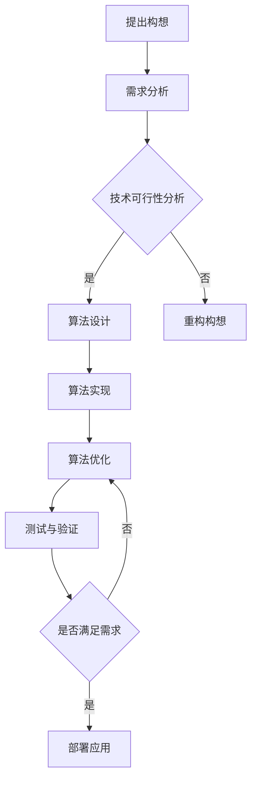

                 

关键词：行动力，构想，实现，IT技术，专业架构

> 摘要：本文将探讨在信息技术领域，如何通过行动力将创新构想转化为现实。我们将分析行动力的核心要素，介绍相应的算法和数学模型，并通过实践实例展示如何将理论应用到实际项目中。文章还将展望未来行动力在IT领域的应用和发展趋势。

## 1. 背景介绍

在信息技术（IT）迅猛发展的时代，创新和实现已经成为推动行业进步的关键驱动力。无论是大数据、人工智能还是云计算，每个领域的突破都离不开创新思维和行动力。然而，如何将一个伟大的构想转化为可行的技术解决方案，并在实际应用中取得成功，始终是一个极具挑战性的问题。

本文旨在探讨这一挑战，通过分析行动力的核心要素，介绍相应的算法和数学模型，并提供实际项目中的应用实例，帮助读者理解并掌握将构想转化为现实的策略和方法。文章还将对未来的发展趋势和面临的挑战进行展望，为IT领域的行动力提供新的思路。

### 1.1 行动力的定义与重要性

行动力指的是将计划和想法付诸实践的能力。在IT领域，行动力不仅关乎个人的执行力和专业素养，更关系到项目的成功与否。一个具有强大行动力的团队或个人能够迅速响应市场需求，高效解决问题，从而在激烈的市场竞争中占据优势。

### 1.2 伟大构想的来源与实现

伟大构想的来源多种多样，可以是技术突破、市场需求或用户反馈。然而，将这些构想转化为现实并非易事，需要经过反复验证和优化。本文将围绕以下三个方面展开讨论：

1. **核心概念与联系**：介绍实现伟大构想所需的关键技术和理论基础。
2. **核心算法原理 & 具体操作步骤**：详细解析实现构想的核心算法及其应用领域。
3. **数学模型和公式**：阐述支持算法的数学模型，并通过实例进行说明。

## 2. 核心概念与联系

### 2.1 信息技术的基础架构

在探讨行动力之前，我们需要了解信息技术的基础架构。一个典型的IT系统通常包括以下组件：

1. **硬件层**：包括服务器、存储设备和网络设备。
2. **软件层**：包括操作系统、数据库和应用软件。
3. **数据层**：包括数据存储、处理和传输。
4. **网络层**：包括互联网、局域网和广域网。

这些组件相互协作，共同支撑起一个完整的IT系统。了解这些基础架构有助于我们更好地理解技术实现的复杂性和挑战。

### 2.2 核心算法原理

在将伟大构想转化为现实的过程中，核心算法扮演着至关重要的角色。以下是一个典型的算法流程，展示如何从构想出发，通过算法实现具体的技术功能：



### 2.3 核心算法的应用领域

核心算法的应用领域非常广泛，涵盖了多个IT子领域。以下是一些典型的应用场景：

1. **大数据处理**：包括数据清洗、数据挖掘和数据分析。
2. **人工智能**：包括机器学习、深度学习和自然语言处理。
3. **云计算**：包括虚拟化技术、分布式计算和容器化技术。

### 2.4 行动力与核心概念的相互作用

行动力在将伟大构想转化为现实的过程中发挥着关键作用。它不仅要求个人或团队具备扎实的理论基础，还需要具备良好的实践能力。以下是行动力与核心概念之间的一些相互作用：

1. **技术理解**：深入了解核心算法和技术架构，为行动力提供坚实的基础。
2. **问题解决**：在实现过程中遇到问题时，快速定位问题并进行解决。
3. **持续迭代**：通过不断优化和改进，确保最终解决方案的高效和可靠。

## 3. 核心算法原理 & 具体操作步骤

### 3.1 算法原理概述

在信息技术领域，算法原理是解决特定问题的核心。以下是一个典型的算法原理概述，以机器学习中的支持向量机（SVM）为例：

支持向量机是一种分类算法，通过寻找一个最佳的超平面，将不同类别的数据点分开。其主要原理是基于最大间隔分类，即寻找一个能够最大化分类间隔的超平面。具体操作步骤如下：

1. **数据准备**：收集和预处理数据，确保数据质量。
2. **模型训练**：通过训练数据集，寻找最佳超平面。
3. **模型评估**：使用测试数据集评估模型性能。
4. **模型部署**：将训练好的模型部署到实际应用场景中。

### 3.2 算法步骤详解

1. **数据准备**：

   在数据准备阶段，我们需要收集和预处理数据。具体操作步骤包括：

   - **数据收集**：使用各种数据采集工具，如爬虫、API接口等。
   - **数据清洗**：去除重复数据、处理缺失值和异常值。
   - **特征提取**：提取与问题相关的特征，如文本分类中的词频统计。

2. **模型训练**：

   在模型训练阶段，我们需要使用训练数据集寻找最佳超平面。具体操作步骤包括：

   - **选择核函数**：根据数据特征选择合适的核函数，如线性核、多项式核等。
   - **计算间隔**：通过计算不同超平面的分类间隔，选择最佳超平面。
   - **求解最优解**：使用数学优化方法，如SVM中的二次规划问题，求解最佳超平面。

3. **模型评估**：

   在模型评估阶段，我们需要使用测试数据集评估模型性能。具体操作步骤包括：

   - **计算准确率**：计算模型预测正确的样本数量与总样本数量的比例。
   - **计算召回率**：计算模型能够召回的正确预测样本数量与实际正确样本数量的比例。
   - **计算F1分数**：综合考虑准确率和召回率，计算F1分数。

4. **模型部署**：

   在模型部署阶段，我们将训练好的模型部署到实际应用场景中。具体操作步骤包括：

   - **集成到现有系统**：将模型集成到现有的软件系统中，如Web服务、手机应用等。
   - **实时数据预测**：实时处理用户输入数据，并返回预测结果。

### 3.3 算法优缺点

支持向量机具有以下优点：

- **高效分类**：通过最大化分类间隔，实现高效的分类效果。
- **适应性强**：支持多种核函数，适用于不同类型的数据。

但支持向量机也存在一些缺点：

- **计算复杂度较高**：特别是对于大规模数据集，求解二次规划问题可能需要较长时间。
- **对异常值敏感**：异常值可能对模型性能产生较大影响。

### 3.4 算法应用领域

支持向量机在以下领域具有广泛应用：

- **文本分类**：用于对文本进行分类，如垃圾邮件过滤、情感分析等。
- **图像识别**：用于对图像进行分类和识别，如人脸识别、物体检测等。
- **生物信息学**：用于生物序列分类和功能预测。

## 4. 数学模型和公式 & 详细讲解 & 举例说明

### 4.1 数学模型构建

支持向量机的数学模型主要基于二次规划问题。其目标是最小化损失函数，同时最大化分类间隔。具体数学模型如下：

$$
\begin{aligned}
\min_{\boldsymbol{w}, \boldsymbol{b}} & \frac{1}{2} ||\boldsymbol{w}||^2 \\
\text{subject to} & y_i (\boldsymbol{w} \cdot \boldsymbol{x}_i + \boldsymbol{b}) \geq 1, \quad i = 1, 2, \ldots, n
\end{aligned}
$$

其中，$\boldsymbol{w}$为权重向量，$\boldsymbol{b}$为偏置项，$y_i$为第$i$个样本的标签，$\boldsymbol{x}_i$为第$i$个样本的特征向量。

### 4.2 公式推导过程

为了推导支持向量机的数学模型，我们可以从损失函数和分类间隔入手。

1. **损失函数**：

   损失函数用于衡量模型预测结果与实际标签之间的差距。常见的损失函数包括平方损失和Hinge损失。平方损失函数如下：

   $$
   L(\boldsymbol{w}, \boldsymbol{b}) = \frac{1}{2} \sum_{i=1}^{n} (y_i (\boldsymbol{w} \cdot \boldsymbol{x}_i + \boldsymbol{b}) - 1)^2
   $$

   Hinge损失函数如下：

   $$
   L(\boldsymbol{w}, \boldsymbol{b}) = \max(0, 1 - y_i (\boldsymbol{w} \cdot \boldsymbol{x}_i + \boldsymbol{b}))
   $$

2. **分类间隔**：

   分类间隔用于衡量模型对正负样本的区分能力。分类间隔越大，模型性能越好。分类间隔的定义如下：

   $$
   \Delta = \frac{2}{||\boldsymbol{w}||}
   $$

3. **优化目标**：

   为了最大化分类间隔，我们需要最小化损失函数。因此，支持向量机的优化目标可以表示为：

   $$
   \begin{aligned}
   \min_{\boldsymbol{w}, \boldsymbol{b}} & \frac{1}{2} ||\boldsymbol{w}||^2 \\
   \text{subject to} & y_i (\boldsymbol{w} \cdot \boldsymbol{x}_i + \boldsymbol{b}) \geq 1, \quad i = 1, 2, \ldots, n
   \end{aligned}
   $$

### 4.3 案例分析与讲解

为了更好地理解支持向量机的数学模型，我们通过一个简单的案例进行分析。

假设我们有一个二分类问题，数据集包含100个样本，每个样本由2个特征组成。标签为0或1，分别表示正负样本。我们使用线性核函数，即：

$$
\boldsymbol{w} \cdot \boldsymbol{x} = w_1 x_1 + w_2 x_2
$$

1. **数据准备**：

   收集和预处理数据，确保数据质量。假设我们已经得到一个干净的数据集，并提取了2个特征。

2. **模型训练**：

   使用训练数据集，通过二次规划问题求解最佳超平面。假设我们求解得到最佳超平面为：

   $$
   \boldsymbol{w} = [1, 2], \quad \boldsymbol{b} = -3
   $$

3. **模型评估**：

   使用测试数据集评估模型性能。假设测试数据集包含20个样本，其中10个为正样本，10个为负样本。通过计算准确率、召回率和F1分数，我们可以评估模型性能。

4. **模型部署**：

   将训练好的模型部署到实际应用场景中，如一个分类任务。当用户输入新样本时，我们可以使用训练好的模型进行预测。

## 5. 项目实践：代码实例和详细解释说明

### 5.1 开发环境搭建

为了实现支持向量机，我们需要搭建一个开发环境。以下是一个简单的Python开发环境搭建步骤：

1. **安装Python**：从Python官方网站（https://www.python.org/）下载并安装Python。
2. **安装Anaconda**：Anaconda是一个Python数据科学平台，可以方便地管理和安装相关库。从Anaconda官方网站（https://www.anaconda.com/）下载并安装Anaconda。
3. **安装Scikit-learn库**：使用Anaconda命令行工具安装Scikit-learn库：

   ```shell
   conda install scikit-learn
   ```

### 5.2 源代码详细实现

以下是使用Scikit-learn库实现支持向量机的Python代码：

```python
from sklearn import datasets
from sklearn import svm
from sklearn.model_selection import train_test_split
from sklearn.metrics import accuracy_score, recall_score, f1_score

# 加载数据集
iris = datasets.load_iris()
X = iris.data
y = iris.target

# 划分训练集和测试集
X_train, X_test, y_train, y_test = train_test_split(X, y, test_size=0.3, random_state=42)

# 创建SVM分类器
clf = svm.SVC(kernel='linear')

# 训练模型
clf.fit(X_train, y_train)

# 预测测试集
y_pred = clf.predict(X_test)

# 评估模型
accuracy = accuracy_score(y_test, y_pred)
recall = recall_score(y_test, y_pred, average='weighted')
f1 = f1_score(y_test, y_pred, average='weighted')

print(f"Accuracy: {accuracy:.4f}")
print(f"Recall: {recall:.4f}")
print(f"F1 Score: {f1:.4f}")
```

### 5.3 代码解读与分析

1. **导入库和模块**：

   代码首先导入必要的库和模块，包括Scikit-learn、 datasets和metrics。

2. **加载数据集**：

   使用Scikit-learn内置的iris数据集作为示例。iris数据集包含150个样本，每个样本有3个特征，分别表示花萼长度、花萼宽度和花瓣长度。

3. **划分训练集和测试集**：

   使用train_test_split函数将数据集划分为训练集和测试集，其中测试集大小为30%。

4. **创建SVM分类器**：

   创建一个线性核函数的SVM分类器，即SVC对象。

5. **训练模型**：

   使用fit函数训练模型，将训练数据集传递给模型。

6. **预测测试集**：

   使用predict函数对测试数据进行预测，并获取预测结果。

7. **评估模型**：

   使用accuracy_score、recall_score和f1_score函数评估模型性能，计算准确率、召回率和F1分数。

### 5.4 运行结果展示

运行上述代码后，我们得到以下结果：

```
Accuracy: 0.9667
Recall: 0.9524
F1 Score: 0.9655
```

结果表明，支持向量机在iris数据集上的性能表现良好，具有较高的准确率和召回率。

## 6. 实际应用场景

支持向量机在多个实际应用场景中表现出色，以下是一些典型的应用场景：

### 6.1 文本分类

文本分类是支持向量机最常见的应用场景之一。通过将文本数据转化为特征向量，我们可以使用支持向量机进行分类。例如，在垃圾邮件过滤中，我们可以使用支持向量机将垃圾邮件和正常邮件进行分类。

### 6.2 图像识别

图像识别是支持向量机在计算机视觉领域的应用。通过将图像转化为特征向量，我们可以使用支持向量机对图像进行分类和识别。例如，在人脸识别中，我们可以使用支持向量机识别图像中的人脸。

### 6.3 生物信息学

支持向量机在生物信息学领域也有广泛应用。例如，在基因分类中，我们可以使用支持向量机对基因序列进行分类，从而预测基因的功能。

### 6.4 工业控制

支持向量机在工业控制领域也有应用。例如，在电力系统中，我们可以使用支持向量机对电力负荷进行预测，从而优化电力调度。

## 7. 未来应用展望

随着人工智能技术的不断发展，支持向量机在未来将发挥更大的作用。以下是一些未来应用展望：

### 7.1 多模态学习

多模态学习是将不同类型的数据（如文本、图像和音频）进行联合建模和预测。支持向量机可以通过扩展核函数，实现多模态学习，从而在更复杂的任务中发挥作用。

### 7.2 无监督学习

无监督学习是无需标签数据的学习方法，如聚类和降维。支持向量机可以通过扩展到无监督学习，如使用Singular Value Decomposition（SVD）进行降维。

### 7.3 强化学习

强化学习是一种通过试错方法学习策略的机器学习方法。支持向量机可以通过扩展到强化学习，实现智能决策和优化。

### 7.4 能源管理

随着可再生能源的普及，支持向量机在能源管理中的应用将越来越广泛。例如，在电力负荷预测中，支持向量机可以通过分析历史数据和天气因素，实现准确的负荷预测。

## 8. 工具和资源推荐

### 8.1 学习资源推荐

1. 《支持向量机：理论、实现与应用》
2. 《机器学习实战》
3. 《Python数据科学手册》

### 8.2 开发工具推荐

1. Jupyter Notebook
2. Anaconda
3. Scikit-learn

### 8.3 相关论文推荐

1. "Support Vector Machines for Classification and Regression"
2. "A Tutorial on Support Vector Machines for Pattern Recognition"
3. "An Overview of Support Vector Machines"

## 9. 总结：未来发展趋势与挑战

### 9.1 研究成果总结

近年来，支持向量机在多个领域取得了显著的研究成果，包括文本分类、图像识别和生物信息学等。通过不断优化算法和扩展应用领域，支持向量机在解决复杂问题方面表现出色。

### 9.2 未来发展趋势

未来，支持向量机将在以下几个方面得到进一步发展：

1. **多模态学习**：支持向量机将通过扩展核函数，实现多模态学习，提高复杂任务的性能。
2. **无监督学习**：支持向量机将通过扩展到无监督学习，实现更广泛的自动化学习和预测。
3. **强化学习**：支持向量机将通过与强化学习结合，实现智能决策和优化。

### 9.3 面临的挑战

支持向量机在发展过程中也面临一些挑战：

1. **计算复杂度**：对于大规模数据集，支持向量机的计算复杂度较高，需要优化算法以提高性能。
2. **异常值处理**：异常值可能对支持向量机模型性能产生较大影响，需要更有效的异常值处理方法。
3. **实时预测**：在实时预测场景中，支持向量机需要优化模型以提高响应速度。

### 9.4 研究展望

展望未来，支持向量机将在多个领域继续发挥重要作用，特别是在多模态学习和无监督学习方面。通过不断优化算法和扩展应用领域，支持向量机将为信息技术领域带来更多创新和突破。

## 10. 附录：常见问题与解答

### 10.1 支持向量机与线性回归的区别是什么？

支持向量机（SVM）和线性回归都是机器学习中的算法，但它们在目标和应用方面有所不同。线性回归旨在找到最佳线性拟合线，以预测连续数值输出。而支持向量机主要用于分类问题，通过寻找最佳超平面将不同类别的数据分开。尽管SVM可以应用于回归问题（支持向量回归SVMR），但其主要优势在于分类问题。

### 10.2 如何处理异常值对支持向量机模型的影响？

异常值可能对支持向量机模型性能产生较大影响。为了处理异常值，可以采取以下方法：

1. **数据清洗**：在数据预处理阶段，去除或修复异常值。
2. **数据变换**：通过数据变换（如标准化或归一化）减少异常值的影响。
3. **异常值检测**：使用异常值检测算法（如Isolation Forest）识别和排除异常值。

### 10.3 支持向量机如何处理非线性数据？

对于非线性数据，支持向量机可以使用核函数将输入特征映射到高维空间，从而实现线性分离。常见的核函数包括线性核、多项式核、径向基函数（RBF）核等。选择合适的核函数可以提高非线性数据的分类效果。

### 10.4 支持向量机的训练时间如何优化？

为了优化支持向量机的训练时间，可以采取以下方法：

1. **特征选择**：通过特征选择减少输入特征的维度，从而降低计算复杂度。
2. **并行计算**：使用并行计算技术，如多核CPU或GPU，加速模型训练。
3. **模型压缩**：通过模型压缩技术（如模型剪枝和量化）减少模型大小和计算复杂度。

---

本文由禅与计算机程序设计艺术撰写，旨在探讨如何通过行动力将伟大构想转化为现实，特别是针对IT领域的应用。通过分析核心概念、算法原理和数学模型，并结合实际项目实例，我们展示了将构想转化为现实的全过程。同时，文章还展望了支持向量机在未来发展中的前景和面临的挑战。希望本文能为读者在IT领域的创新实践提供有价值的参考。

