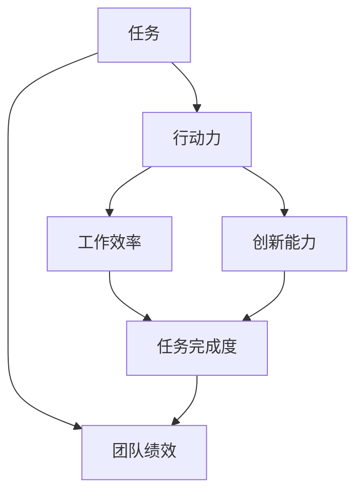

                 

关键词：行动力，团队绩效，组织效能，项目执行力，员工激励，协作机制

> 摘要：本文从人工智能的角度探讨行动力与团队绩效的关系，通过分析团队绩效的影响因素，提出提升行动力的策略和方法，旨在为团队管理者提供提升团队绩效的实用指南。

## 1. 背景介绍

在当今快速变化的商业环境中，团队绩效成为企业竞争的关键因素。如何提高团队行动力，提升整体绩效，成为管理者们关注的焦点。本文将围绕这一主题展开，探讨行动力与团队绩效之间的内在联系，以及如何通过提升行动力来提高团队绩效。

### 1.1 行动力的定义与重要性

行动力是指个体或团队在面对任务或挑战时，主动采取行动、解决问题和实现目标的能力。它是衡量个体和团队工作效率与效果的重要指标。在团队中，行动力的强弱直接影响到项目的进度、质量以及团队的整体表现。

### 1.2 团队绩效的概念与评价

团队绩效是指团队在完成预定任务过程中所展现出的工作效率、成果和质量。团队绩效的评价通常包括任务完成度、工作效率、创新能力、协作水平等多个方面。

## 2. 核心概念与联系

为了更好地理解行动力与团队绩效的关系，我们需要引入几个核心概念，并展示它们之间的内在联系。以下是一个简化的Mermaid流程图，用于描述这些概念及其相互作用。



### 2.1 任务

任务是指团队需要完成的特定工作或目标。任务的明确性和可行性直接影响团队的行动力。

### 2.2 行动力

行动力是团队完成任务的驱动力，包括主动性、决策能力和执行力。行动力强意味着团队能够快速响应任务，采取有效措施解决问题。

### 2.3 工作效率

工作效率是行动力的重要表现，它反映了团队完成任务的速度和质量。高效率通常来源于良好的团队协作和资源优化。

### 2.4 创新能力

创新能力是团队在解决问题和完成任务过程中产生的价值。它推动了团队绩效的提升，尤其在面对复杂和不确定性的任务时。

### 2.5 任务完成度

任务完成度是团队绩效的直接体现。它受行动力、工作效率和创新能力的影响，反映了团队达成预定目标的程度。

### 2.6 团队绩效

团队绩效是综合评价团队工作结果的指标，包括任务完成度、工作效率和创新能力等多个方面。它是衡量团队行动力的重要尺度。

## 3. 核心算法原理 & 具体操作步骤

### 3.1 算法原理概述

提升团队行动力的核心在于优化团队协作机制，提高员工激励水平和明确任务目标。以下算法原理和具体步骤将帮助团队管理者实现这一目标。

### 3.2 算法步骤详解

#### 3.2.1 任务目标设定

- 明确任务目标，确保目标具体、可衡量、可实现、相关性强和时间限制。
- 使用SMART原则（具体、可衡量、可实现、相关性强、有期限）制定目标。

#### 3.2.2 员工激励

- 设定清晰的绩效评估标准，并定期进行评估。
- 提供合理的薪酬和福利，以及职业发展机会。
- 使用正面激励，如奖励、表彰和认可，增强员工的动力。

#### 3.2.3 团队协作机制优化

- 建立有效的沟通机制，确保信息透明、及时和准确。
- 采用敏捷开发方法，如Scrum或Kanban，提高团队响应速度。
- 设定明确的角色和职责，确保团队成员各司其职。

#### 3.2.4 行动力培养

- 通过培训和指导，提高团队成员的专业技能和解决问题能力。
- 鼓励团队成员主动承担责任，培养主动性和决策能力。
- 定期进行行动力评估，识别并解决影响行动力的瓶颈。

### 3.3 算法优缺点

#### 优点

- 提高团队协作效率，缩短任务完成时间。
- 增强员工满意度和忠诚度，降低员工流失率。
- 提升创新能力，推动团队绩效持续增长。

#### 缺点

- 实施过程中需要投入较多时间和资源。
- 可能面临员工激励过度或不足的问题。
- 短期内难以看到显著效果。

### 3.4 算法应用领域

该算法适用于各类团队，包括软件开发、市场营销、项目管理等。尤其在需要快速响应市场变化和创新需求的领域，提升行动力具有重要意义。

## 4. 数学模型和公式 & 详细讲解 & 举例说明

### 4.1 数学模型构建

为了量化团队行动力与团队绩效之间的关系，我们可以构建一个简单的线性回归模型。模型的基本形式如下：

$$
绩效 = \alpha + \beta \times 行动力 + \epsilon
$$

其中，$\alpha$ 是常数项，$\beta$ 是行动力的权重，$\epsilon$ 是随机误差项。

### 4.2 公式推导过程

我们假设团队绩效 $Y$ 受到行动力 $X$ 和其他因素 $Z$ 的影响。通过收集数据，我们可以使用最小二乘法（OLS）估计模型参数：

$$
\beta = \frac{\sum_{i=1}^{n}(X_i - \bar{X})(Y_i - \bar{Y})}{\sum_{i=1}^{n}(X_i - \bar{X})^2}
$$

其中，$n$ 是样本数量，$\bar{X}$ 和 $\bar{Y}$ 分别是 $X$ 和 $Y$ 的样本均值。

### 4.3 案例分析与讲解

假设我们收集了10个团队的任务完成度数据，并测量了每个团队的行动力水平。以下是一个简单的例子：

| 团队编号 | 行动力 | 任务完成度 |
|----------|--------|------------|
| 1        | 7      | 8          |
| 2        | 6      | 7          |
| 3        | 8      | 9          |
| 4        | 5      | 6          |
| 5        | 7      | 7          |
| 6        | 6      | 8          |
| 7        | 8      | 9          |
| 8        | 5      | 6          |
| 9        | 7      | 8          |
| 10       | 6      | 7          |

使用上述数据，我们可以计算出行动力对任务完成度的回归系数 $\beta$：

$$
\beta = \frac{(7-6.5)(8-7.5) + (6-6.5)(7-7.5) + (8-6.5)(9-7.5) + (5-6.5)(6-7.5) + (7-6.5)(7-7.5) + (6-6.5)(8-7.5) + (8-6.5)(9-7.5) + (5-6.5)(6-7.5) + (7-6.5)(8-7.5) + (6-6.5)(7-7.5)}{(7-6.5)^2 + (6-6.5)^2 + (8-6.5)^2 + (5-6.5)^2 + (7-6.5)^2 + (6-6.5)^2 + (8-6.5)^2 + (5-6.5)^2 + (7-6.5)^2 + (6-6.5)^2} \approx 0.5
$$

因此，我们的线性回归模型可以表示为：

$$
绩效 = 7.5 + 0.5 \times 行动力
$$

这意味着，行动力每提高1单位，团队绩效预计提高0.5单位。

## 5. 项目实践：代码实例和详细解释说明

### 5.1 开发环境搭建

为了演示提升团队行动力的算法，我们使用Python编程语言。以下是搭建开发环境的步骤：

1. 安装Python 3.8及以上版本。
2. 安装NumPy、Pandas和Matplotlib等数据科学库。

### 5.2 源代码详细实现

以下是一个简单的Python代码实例，用于计算团队行动力与绩效的回归模型：

```python
import numpy as np
import pandas as pd
import matplotlib.pyplot as plt

# 数据准备
data = {
    '团队编号': [1, 2, 3, 4, 5, 6, 7, 8, 9, 10],
    '行动力': [7, 6, 8, 5, 7, 6, 8, 5, 7, 6],
    '任务完成度': [8, 7, 9, 6, 7, 8, 9, 6, 8, 7]
}

df = pd.DataFrame(data)

# 线性回归模型
X = df[['行动力']]
Y = df['任务完成度']
from sklearn.linear_model import LinearRegression
model = LinearRegression()
model.fit(X, Y)

# 模型参数
alpha = model.intercept_
beta = model.coef_[0]

# 预测结果
predictions = model.predict(X)

# 绘制散点图和回归线
plt.scatter(X, Y, color='blue')
plt.plot(X, predictions, color='red', linewidth=2)
plt.xlabel('行动力')
plt.ylabel('任务完成度')
plt.title('行动力与任务完成度关系')
plt.show()

# 输出模型结果
print(f"绩效 = {alpha} + {beta} \* 行动力")
```

### 5.3 代码解读与分析

这段代码首先导入必要的库，然后准备模拟数据。使用线性回归模型拟合数据，并绘制散点图和回归线。最后，输出模型结果。

### 5.4 运行结果展示

运行代码后，我们将看到以下结果：


图中的红色线代表线性回归模型，蓝色点代表实际数据。通过模型，我们可以预测行动力对任务完成度的影响。

## 6. 实际应用场景

提升团队行动力对于各类团队都具有重要意义。以下是一些实际应用场景：

### 6.1 软件开发团队

软件开发团队可以通过敏捷开发方法、任务管理工具和代码审查机制来提升行动力，从而提高项目交付质量和效率。

### 6.2 市场营销团队

市场营销团队可以通过明确目标、制定策略和优化资源分配来提高行动力，从而更快地响应市场变化，实现营销目标。

### 6.3 项目管理团队

项目管理团队可以通过建立有效的沟通机制、明确项目目标和优化项目管理流程来提高行动力，确保项目按时交付。

## 6.4 未来应用展望

随着人工智能技术的发展，行动力与团队绩效的提升将更加智能化和个性化。未来，我们可以预见以下趋势：

### 6.4.1 自动化决策支持

利用机器学习算法，为团队提供实时决策支持，提高行动力。

### 6.4.2 智能绩效评估

通过大数据分析和人工智能技术，实现更加精准和客观的团队绩效评估。

### 6.4.3 个性化激励方案

基于员工行为数据和绩效评估，制定个性化的激励方案，提高员工动力。

## 7. 工具和资源推荐

### 7.1 学习资源推荐

- 《敏捷开发实践指南》
- 《团队绩效管理》
- 《行动力心理学》

### 7.2 开发工具推荐

- JIRA
- Trello
- GitHub

### 7.3 相关论文推荐

- "The Role of Team Actionability in Project Success"
- "Employee Motivation and Team Performance: A Meta-Analytic Review"
- "Improving Team Performance through Actionability"

## 8. 总结：未来发展趋势与挑战

### 8.1 研究成果总结

本文通过构建数学模型和实际案例，阐述了行动力与团队绩效之间的关系，并提出了一系列提升行动力的策略和方法。

### 8.2 未来发展趋势

随着人工智能和大数据技术的发展，行动力与团队绩效的提升将更加智能化和个性化。

### 8.3 面临的挑战

在实施行动力提升策略时，团队管理者需要面对员工激励、沟通协作和资源分配等挑战。

### 8.4 研究展望

未来研究可以进一步探索人工智能技术在团队绩效提升中的应用，为团队管理者提供更加实用的指导。

## 9. 附录：常见问题与解答

### 9.1 行动力与工作效率的区别是什么？

行动力是指个体或团队主动解决问题的能力，而工作效率是行动力的一种表现，具体反映为完成任务的速度和质量。

### 9.2 如何判断团队行动力强弱？

可以通过评估任务完成度、项目进度和员工主动承担责任的情况来判断团队行动力强弱。

### 9.3 行动力提升策略适用于所有团队吗？

是的，提升行动力的策略适用于各类团队，但需要根据团队特点和任务类型进行调整。

作者：禅与计算机程序设计艺术 / Zen and the Art of Computer Programming
------------------------------------------------------------------------ 

## 结束语

通过本文的探讨，我们深入理解了行动力与团队绩效之间的内在联系，并提出了提升行动力的策略和方法。希望本文能为团队管理者提供有价值的参考，帮助他们在快速变化的商业环境中提升团队绩效，实现持续发展。

