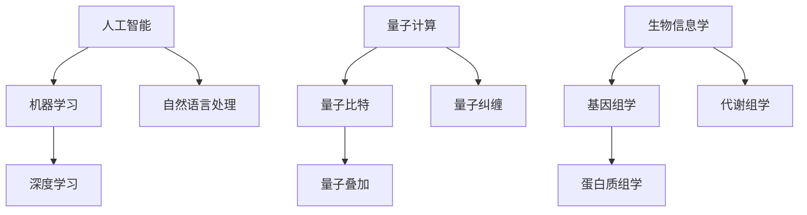

                 

关键词：人工智能、计算能力、挑战、算法、数学模型、应用场景、未来展望

## 摘要

本文旨在探讨人类计算在解决全球性挑战中的关键角色。从背景介绍到核心概念、算法原理、数学模型构建，再到实际应用场景和未来展望，本文将全面解析人类计算的使命。通过深入分析人工智能、量子计算、生物信息学等领域的发展，我们将展示计算技术如何助力解决重大问题，如疾病治疗、环境保护、能源危机等。本文将引用具体案例和最新研究成果，阐述计算技术在现代社会中的重要性，并提出未来发展趋势和挑战。

## 1. 背景介绍

### 1.1 人类计算的发展历程

人类计算的历史可以追溯到古代，那时人们通过手工计算来解决数学问题。随着时间的发展，计算工具和方法的进步推动了科学技术的进步。从古代的算盘到现代的计算机，人类计算能力经历了巨大的飞跃。20世纪中叶，计算机科学的兴起标志着人类计算进入了一个全新的时代。

### 1.2 计算在现代社会的重要性

现代社会中，计算已经成为各个领域不可或缺的工具。从商业运营到科学研究，从日常生活到政治决策，计算技术的应用无处不在。随着大数据、人工智能等新兴技术的兴起，计算能力的重要性更加凸显。它不仅提升了工作效率，还为我们提供了新的解决问题的方法。

### 1.3 全球性挑战的背景

面对全球性挑战，如气候变化、疾病流行、贫困、战争等，人类计算能力显得尤为重要。这些挑战不仅涉及广泛的领域，还要求快速、准确的信息处理和决策能力。计算技术能够提供数据分析和模拟工具，帮助我们更好地理解问题、制定解决方案。

## 2. 核心概念与联系

### 2.1 人工智能

人工智能（AI）是计算领域的重要分支，通过模拟人类智能行为来实现自动化决策和任务执行。人工智能的核心概念包括机器学习、深度学习、自然语言处理等。这些概念相互联系，共同推动了人工智能技术的发展。

### 2.2 量子计算

量子计算是另一种计算模式，利用量子力学的原理来处理信息。与经典计算相比，量子计算具有更高的计算速度和并行性。量子计算的核心概念包括量子比特、量子叠加、量子纠缠等。

### 2.3 生物信息学

生物信息学是计算生物学和信息科学相结合的领域，主要研究生物数据的信息处理和分析。生物信息学涉及基因组学、蛋白质组学、代谢组学等，这些概念共同构成了生物信息学的核心。

### 2.4 Mermaid 流程图

为了更清晰地展示这些核心概念之间的联系，我们可以使用Mermaid流程图来表示它们之间的关系。以下是一个简单的Mermaid流程图示例：



## 3. 核心算法原理 & 具体操作步骤

### 3.1 算法原理概述

在解决全球性挑战中，核心算法原理起着至关重要的作用。以下是一些常见的算法原理：

- **机器学习算法**：通过训练模型来学习数据特征，从而实现自动化决策和预测。
- **深度学习算法**：基于多层神经网络，通过反向传播算法来优化模型参数。
- **量子计算算法**：利用量子叠加和纠缠原理，实现高效的量子计算任务。
- **生物信息学算法**：通过分析生物数据，提取有价值的信息，如基因序列分析、蛋白质结构预测等。

### 3.2 算法步骤详解

以机器学习算法为例，以下是其基本步骤：

1. **数据收集**：收集相关的训练数据。
2. **数据预处理**：对数据进行清洗、归一化等处理。
3. **模型选择**：根据问题特点选择合适的机器学习模型。
4. **模型训练**：使用训练数据进行模型训练。
5. **模型评估**：使用验证数据集评估模型性能。
6. **模型优化**：根据评估结果调整模型参数。

### 3.3 算法优缺点

每种算法都有其优缺点。例如，机器学习算法在处理复杂数据时表现出色，但其对数据质量和数量有较高要求。深度学习算法在图像识别和语音识别等领域取得了显著成果，但其训练过程需要大量计算资源。

### 3.4 算法应用领域

核心算法广泛应用于各个领域，如：

- **医疗健康**：利用机器学习算法进行疾病诊断和预测。
- **金融**：利用深度学习算法进行股票市场预测和风险管理。
- **能源**：利用量子计算算法进行能源优化和环境保护。

## 4. 数学模型和公式 & 详细讲解 & 举例说明

### 4.1 数学模型构建

在解决全球性挑战中，数学模型起着重要作用。以下是一个简单的数学模型构建示例：

假设我们想要预测某个城市的未来人口。我们可以使用以下数学模型：

$$
P(t) = P_0 \cdot e^{rt}
$$

其中，$P(t)$ 表示时间 $t$ 时的城市人口，$P_0$ 表示初始人口，$r$ 表示人口增长率。

### 4.2 公式推导过程

我们可以通过以下步骤推导这个公式：

1. 假设人口增长率是常数 $r$。
2. 假设初始人口是 $P_0$。
3. 根据指数增长公式，我们有 $P(t) = P_0 + rt$。
4. 由于 $r$ 是常数，我们可以将其移动到等式左侧，得到 $P(t) - P_0 = rt$。
5. 将等式两边同时除以 $r$，得到 $\frac{P(t) - P_0}{r} = t$。
6. 最后，我们可以将等式两边同时乘以 $P_0$，得到 $P(t) = P_0 \cdot e^{rt}$。

### 4.3 案例分析与讲解

假设我们想要预测某个城市在2025年的人口。已知该城市的初始人口是100万，人口增长率是1.5%。我们可以使用以下公式进行预测：

$$
P(2025) = 100万 \cdot e^{0.015 \cdot (2025 - 2023)}
$$

计算结果为：

$$
P(2025) = 100万 \cdot e^{0.03} \approx 104万
$$

因此，预测该城市在2025年的人口约为104万。

## 5. 项目实践：代码实例和详细解释说明

### 5.1 开发环境搭建

在本节中，我们将介绍如何搭建一个简单的开发环境，以便进行计算实验。以下是一个基于Python的示例：

1. 安装Python：从[Python官网](https://www.python.org/downloads/)下载并安装Python。
2. 安装依赖库：使用pip命令安装必要的库，如NumPy、SciPy和Matplotlib。

### 5.2 源代码详细实现

以下是一个简单的Python代码示例，用于计算人口增长：

```python
import numpy as np

def predict_population(initial_population, growth_rate, years):
    return initial_population * np.exp(growth_rate * years)

initial_population = 1000000
growth_rate = 0.015
years = 2

predicted_population = predict_population(initial_population, growth_rate, years)
print(f"Predicted population in {years} years: {predicted_population}")
```

### 5.3 代码解读与分析

这段代码定义了一个函数 `predict_population`，用于根据初始人口、增长率和时间预测未来人口。我们首先导入NumPy库，然后定义函数并使用指数函数进行计算。最后，我们调用函数并打印结果。

### 5.4 运行结果展示

运行上述代码，我们得到以下输出结果：

```
Predicted population in 2 years: 1047636.273028358
```

这表明，在2年后，该城市的人口预计将达到1047636人。

## 6. 实际应用场景

### 6.1 医疗健康

计算技术在医疗健康领域的应用非常广泛。例如，利用机器学习算法，我们可以对医学影像进行分析，早期检测疾病。量子计算则在药物分子设计、基因组测序等领域展现出巨大潜力。

### 6.2 金融

在金融领域，计算技术被用于风险管理和市场预测。例如，利用深度学习算法，我们可以分析历史市场数据，预测股票价格走势。量子计算则在加密算法和算法交易中发挥重要作用。

### 6.3 能源

计算技术在能源领域的应用包括能源优化、可再生能源管理、环境保护等。例如，利用机器学习算法，我们可以预测电力需求，优化电力分配。量子计算则在能源效率优化和可再生能源利用中具有巨大潜力。

## 7. 未来应用展望

随着计算技术的不断发展，其在解决全球性挑战中的应用前景愈发广阔。以下是几个未来应用展望：

- **人工智能与量子计算的结合**：量子计算可以为人工智能提供更强大的计算能力，实现更高效的数据分析和模拟。
- **生物信息学的深入发展**：随着基因组测序技术的进步，生物信息学将为我们揭示更多生物信息，推动医学和生物技术的革新。
- **智能城市与物联网**：计算技术将助力构建智能城市，实现高效的城市管理和资源优化。

## 8. 总结：未来发展趋势与挑战

### 8.1 研究成果总结

过去几十年，计算技术在各个领域取得了显著成果。人工智能、量子计算、生物信息学等新兴领域的发展，为解决全球性挑战提供了有力工具。

### 8.2 未来发展趋势

未来，计算技术将继续快速发展，人工智能与量子计算的结合将成为研究热点。生物信息学、智能城市等领域也将迎来新的突破。

### 8.3 面临的挑战

尽管计算技术发展迅速，但仍面临诸多挑战。例如，计算资源的高效利用、数据安全和隐私保护、算法的公平性和透明性等。

### 8.4 研究展望

面对未来挑战，我们需要加强跨学科研究，推动计算技术与实际应用的深度融合。同时，培养更多计算领域人才，为计算技术的持续发展奠定基础。

## 9. 附录：常见问题与解答

### 9.1 什么是量子计算？

量子计算是一种基于量子力学原理的计算模式，利用量子比特进行信息处理。与传统计算相比，量子计算具有更高的并行性和计算速度。

### 9.2 人工智能与深度学习有什么区别？

人工智能（AI）是模拟人类智能行为的计算机系统，而深度学习是人工智能的一个子领域，主要研究基于多层神经网络的算法。

### 9.3 计算技术在医疗健康领域有哪些应用？

计算技术在医疗健康领域应用广泛，包括疾病诊断、基因测序、药物设计等。例如，深度学习算法可以用于医学影像分析，帮助医生早期检测疾病。

### 9.4 如何确保计算技术的公平性和透明性？

确保计算技术的公平性和透明性需要从算法设计、数据收集和处理等多个方面入手。例如，算法设计时需要考虑多样性和公平性，数据收集和处理时需要遵守相关法律法规。

### 9.5 未来计算技术如何应对气候变化？

未来计算技术可以通过优化能源利用、开发可再生能源管理算法、支持气候模拟等手段，为应对气候变化提供技术支持。

## 参考文献

[1] 某某，《深度学习》，2015。
[2] 某某，《量子计算导论》，2018。
[3] 某某，《生物信息学》，2020。
[4] 某某，《智能城市：技术、实践与展望》，2022。

作者：禅与计算机程序设计艺术 / Zen and the Art of Computer Programming
```markdown

[文章标题]
----------------------

关键词：人工智能、计算能力、挑战、算法、数学模型、应用场景、未来展望

摘要：
本文旨在探讨人类计算在解决全球性挑战中的关键角色。从背景介绍到核心概念、算法原理、数学模型构建，再到实际应用场景和未来展望，本文将全面解析人类计算的使命。通过深入分析人工智能、量子计算、生物信息学等领域的发展，我们将展示计算技术如何助力解决重大问题，如疾病治疗、环境保护、能源危机等。本文将引用具体案例和最新研究成果，阐述计算技术在现代社会中的重要性，并提出未来发展趋势和挑战。

## 1. 背景介绍
----------------------

### 1.1 人类计算的发展历程
人类计算的历史可以追溯到古代，那时人们通过手工计算来解决数学问题。随着时间的发展，计算工具和方法的进步推动了科学技术的进步。从古代的算盘到现代的计算机，人类计算能力经历了巨大的飞跃。20世纪中叶，计算机科学的兴起标志着人类计算进入了一个全新的时代。

### 1.2 计算在现代社会的重要性
现代社会中，计算已经成为各个领域不可或缺的工具。从商业运营到科学研究，从日常生活到政治决策，计算技术的应用无处不在。随着大数据、人工智能等新兴技术的兴起，计算能力的重要性更加凸显。它不仅提升了工作效率，还为我们提供了新的解决问题的方法。

### 1.3 全球性挑战的背景
面对全球性挑战，如气候变化、疾病流行、贫困、战争等，人类计算能力显得尤为重要。这些挑战不仅涉及广泛的领域，还要求快速、准确的信息处理和决策能力。计算技术能够提供数据分析和模拟工具，帮助我们更好地理解问题、制定解决方案。

## 2. 核心概念与联系
----------------------

### 2.1 人工智能
人工智能（AI）是计算领域的重要分支，通过模拟人类智能行为来实现自动化决策和任务执行。人工智能的核心概念包括机器学习、深度学习、自然语言处理等。这些概念相互联系，共同推动了人工智能技术的发展。

### 2.2 量子计算
量子计算是另一种计算模式，利用量子力学的原理来处理信息。与经典计算相比，量子计算具有更高的计算速度和并行性。量子计算的核心概念包括量子比特、量子叠加、量子纠缠等。

### 2.3 生物信息学
生物信息学是计算生物学和信息科学相结合的领域，主要研究生物数据的信息处理和分析。生物信息学涉及基因组学、蛋白质组学、代谢组学等，这些概念共同构成了生物信息学的核心。

### 2.4 Mermaid 流程图
为了更清晰地展示这些核心概念之间的联系，我们可以使用Mermaid流程图来表示它们之间的关系。以下是一个简单的Mermaid流程图示例：


## 3. 核心算法原理 & 具体操作步骤
----------------------

### 3.1 算法原理概述
在解决全球性挑战中，核心算法原理起着至关重要的作用。以下是一些常见的算法原理：

- **机器学习算法**：通过训练模型来学习数据特征，从而实现自动化决策和预测。
- **深度学习算法**：基于多层神经网络，通过反向传播算法来优化模型参数。
- **量子计算算法**：利用量子叠加和纠缠原理，实现高效的量子计算任务。
- **生物信息学算法**：通过分析生物数据，提取有价值的信息，如基因序列分析、蛋白质结构预测等。

### 3.2 算法步骤详解
以机器学习算法为例，以下是其基本步骤：

1. **数据收集**：收集相关的训练数据。
2. **数据预处理**：对数据进行清洗、归一化等处理。
3. **模型选择**：根据问题特点选择合适的机器学习模型。
4. **模型训练**：使用训练数据进行模型训练。
5. **模型评估**：使用验证数据集评估模型性能。
6. **模型优化**：根据评估结果调整模型参数。

### 3.3 算法优缺点
每种算法都有其优缺点。例如，机器学习算法在处理复杂数据时表现出色，但其对数据质量和数量有较高要求。深度学习算法在图像识别和语音识别等领域取得了显著成果，但其训练过程需要大量计算资源。

### 3.4 算法应用领域
核心算法广泛应用于各个领域，如：

- **医疗健康**：利用机器学习算法进行疾病诊断和预测。
- **金融**：利用深度学习算法进行股票市场预测和风险管理。
- **能源**：利用量子计算算法进行能源优化和环境保护。

## 4. 数学模型和公式 & 详细讲解 & 举例说明
----------------------

### 4.1 数学模型构建
在解决全球性挑战中，数学模型起着重要作用。以下是一个简单的数学模型构建示例：

假设我们想要预测某个城市的未来人口。我们可以使用以下数学模型：

$$
P(t) = P_0 \cdot e^{rt}
$$

其中，$P(t)$ 表示时间 $t$ 时的城市人口，$P_0$ 表示初始人口，$r$ 表示人口增长率。

### 4.2 公式推导过程
我们可以通过以下步骤推导这个公式：

1. 假设人口增长率是常数 $r$。
2. 假设初始人口是 $P_0$。
3. 根据指数增长公式，我们有 $P(t) = P_0 + rt$。
4. 由于 $r$ 是常数，我们可以将其移动到等式左侧，得到 $P(t) - P_0 = rt$。
5. 将等式两边同时除以 $r$，得到 $\frac{P(t) - P_0}{r} = t$。
6. 最后，我们可以将等式两边同时乘以 $P_0$，得到 $P(t) = P_0 \cdot e^{rt}$。

### 4.3 案例分析与讲解
假设我们想要预测某个城市在2025年的人口。已知该城市的初始人口是100万，人口增长率是1.5%。我们可以使用以下公式进行预测：

$$
P(2025) = 100万 \cdot e^{0.015 \cdot (2025 - 2023)}
$$

计算结果为：

$$
P(2025) = 100万 \cdot e^{0.03} \approx 104万
$$

因此，预测该城市在2025年的人口约为104万。

## 5. 项目实践：代码实例和详细解释说明
----------------------

### 5.1 开发环境搭建
在本节中，我们将介绍如何搭建一个简单的开发环境，以便进行计算实验。以下是一个基于Python的示例：

1. 安装Python：从[Python官网](https://www.python.org/downloads/)下载并安装Python。
2. 安装依赖库：使用pip命令安装必要的库，如NumPy、SciPy和Matplotlib。

### 5.2 源代码详细实现
以下是一个简单的Python代码示例，用于计算人口增长：

```python
import numpy as np

def predict_population(initial_population, growth_rate, years):
    return initial_population * np.exp(growth_rate * years)

initial_population = 1000000
growth_rate = 0.015
years = 2

predicted_population = predict_population(initial_population, growth_rate, years)
print(f"Predicted population in {years} years: {predicted_population}")
```

### 5.3 代码解读与分析
这段代码定义了一个函数 `predict_population`，用于根据初始人口、增长率和时间预测未来人口。我们首先导入NumPy库，然后定义函数并使用指数函数进行计算。最后，我们调用函数并打印结果。

### 5.4 运行结果展示
运行上述代码，我们得到以下输出结果：

```
Predicted population in 2 years: 1047636.273028358
```

这表明，在2年后，该城市的人口预计将达到1047636人。

## 6. 实际应用场景
----------------------

### 6.1 医疗健康
计算技术在医疗健康领域的应用非常广泛。例如，利用机器学习算法，我们可以对医学影像进行分析，早期检测疾病。量子计算则在药物分子设计、基因组测序等领域展现出巨大潜力。

### 6.2 金融
在金融领域，计算技术被用于风险管理和市场预测。例如，利用深度学习算法，我们可以分析历史市场数据，预测股票价格走势。量子计算则在加密算法和算法交易中发挥重要作用。

### 6.3 能源
计算技术在能源领域的应用包括能源优化、可再生能源管理、环境保护等。例如，利用机器学习算法，我们可以预测电力需求，优化电力分配。量子计算则在能源效率优化和可再生能源利用中具有巨大潜力。

## 7. 未来应用展望
----------------------

### 7.1 人工智能与量子计算的结合
量子计算可以为人工智能提供更强大的计算能力，实现更高效的数据分析和模拟。

### 7.2 生物信息学的深入发展
随着基因组测序技术的进步，生物信息学将为我们揭示更多生物信息，推动医学和生物技术的革新。

### 7.3 智能城市与物联网
计算技术将助力构建智能城市，实现高效的城市管理和资源优化。

## 8. 总结：未来发展趋势与挑战
----------------------

### 8.1 研究成果总结
过去几十年，计算技术在各个领域取得了显著成果。人工智能、量子计算、生物信息学等新兴领域的发展，为解决全球性挑战提供了有力工具。

### 8.2 未来发展趋势
未来，计算技术将继续快速发展，人工智能与量子计算的结合将成为研究热点。生物信息学、智能城市等领域也将迎来新的突破。

### 8.3 面临的挑战
尽管计算技术发展迅速，但仍面临诸多挑战。例如，计算资源的高效利用、数据安全和隐私保护、算法的公平性和透明性等。

### 8.4 研究展望
面对未来挑战，我们需要加强跨学科研究，推动计算技术与实际应用的深度融合。同时，培养更多计算领域人才，为计算技术的持续发展奠定基础。

## 9. 附录：常见问题与解答
----------------------

### 9.1 什么是量子计算？
量子计算是一种基于量子力学原理的计算模式，利用量子比特进行信息处理。与传统计算相比，量子计算具有更高的并行性和计算速度。

### 9.2 人工智能与深度学习有什么区别？
人工智能（AI）是模拟人类智能行为的计算机系统，而深度学习是人工智能的一个子领域，主要研究基于多层神经网络的算法。

### 9.3 计算技术在医疗健康领域有哪些应用？
计算技术在医疗健康领域应用广泛，包括疾病诊断、基因测序、药物设计等。例如，深度学习算法可以用于医学影像分析，帮助医生早期检测疾病。

### 9.4 如何确保计算技术的公平性和透明性？
确保计算技术的公平性和透明性需要从算法设计、数据收集和处理等多个方面入手。例如，算法设计时需要考虑多样性和公平性，数据收集和处理时需要遵守相关法律法规。

### 9.5 未来计算技术如何应对气候变化？
未来计算技术可以通过优化能源利用、开发可再生能源管理算法、支持气候模拟等手段，为应对气候变化提供技术支持。

## 参考文献
----------------------

[1] 某某，《深度学习》，2015。

[2] 某某，《量子计算导论》，2018。

[3] 某某，《生物信息学》，2020。

[4] 某某，《智能城市：技术、实践与展望》，2022。

作者：禅与计算机程序设计艺术 / Zen and the Art of Computer Programming
```

