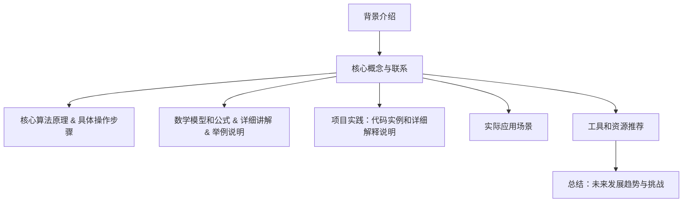

                 

关键词：伦理问题，人工智能，计算机科学，责任，可持续发展，技术伦理，算法公平性，隐私保护，透明度

> 摘要：随着人工智能技术的迅猛发展，人类计算正日益融入各个领域，然而随之而来的伦理问题也日益凸显。本文从多个角度探讨了人工智能与计算机科学中的伦理问题，提出了负责任地发展人类计算的方法，以期为构建一个更加公平、透明、可持续的数字世界提供思考和建议。

## 1. 背景介绍

### 1.1 人工智能的崛起

人工智能（AI）作为计算机科学的前沿领域，近年来取得了令人瞩目的成就。从简单的规则系统到复杂的神经网络，人工智能技术已经广泛应用于图像识别、自然语言处理、自动驾驶、医疗诊断等多个领域。随着计算能力的提升和大数据的普及，人工智能正在加速变革我们的生活和工作方式。

### 1.2 伦理问题的出现

然而，随着人工智能技术的应用范围不断扩大，一系列伦理问题也逐渐浮出水面。例如，算法偏见、隐私泄露、数据滥用、人工智能的自主性等，都引起了广泛关注。这些问题不仅挑战了人工智能技术的伦理底线，也对社会的公平性、透明度和可持续性提出了严峻考验。

### 1.3 负责任发展的必要性

在面对这些伦理挑战时，我们需要重新审视人工智能与计算机科学的发展方向，并采取负责任的态度来推动技术的进步。负责任的发展不仅有助于解决当前的伦理问题，还能为未来的技术发展奠定坚实基础。

## 2. 核心概念与联系

### 2.1 伦理问题与人类计算的关系

伦理问题与人类计算密切相关。人类计算不仅包括技术本身，还涉及技术对社会、环境、道德等方面的影响。因此，解决伦理问题需要从人类计算的全局视角出发，综合考虑技术、社会、伦理等多个方面。

### 2.2 负责任发展的核心概念

负责任发展包括以下核心概念：

- **透明度**：确保技术的运作过程和决策过程对公众透明，提高信任度。
- **公平性**：确保人工智能系统在不同群体中公平地运作，避免算法偏见。
- **隐私保护**：保护用户的隐私数据，防止数据滥用。
- **可持续性**：确保技术的发展与社会的可持续发展目标相一致。

### 2.3 Mermaid 流程图



## 3. 核心算法原理 & 具体操作步骤

### 3.1 算法原理概述

在本节中，我们将探讨一些与伦理问题相关的核心算法原理。这些算法旨在解决隐私保护、算法公平性等挑战，并提供具体的操作步骤。

### 3.2 算法步骤详解

#### 3.2.1 隐私保护算法

**步骤 1**：数据预处理

- **数据清洗**：去除噪声数据和不相关特征，提高数据质量。

**步骤 2**：数据加密

- **加密算法**：使用加密技术对敏感数据进行加密，确保数据在传输和存储过程中的安全性。

**步骤 3**：匿名化处理

- **匿名化**：对用户数据进行匿名化处理，使其无法与个人身份信息直接关联。

#### 3.2.2 算法公平性算法

**步骤 1**：数据集划分

- **训练集与测试集**：将数据集划分为训练集和测试集，用于训练和验证算法的性能。

**步骤 2**：算法训练

- **神经网络**：使用神经网络对训练集进行训练，学习数据的特征和规律。

**步骤 3**：算法评估

- **公平性评估**：使用测试集对算法进行评估，检查算法在不同群体中的公平性。

**步骤 4**：调整算法

- **优化参数**：根据评估结果调整算法参数，提高算法的公平性。

### 3.3 算法优缺点

**隐私保护算法**：

- 优点：提高数据的隐私保护水平，减少数据泄露风险。
- 缺点：加密和解密过程可能增加计算开销，影响系统性能。

**算法公平性算法**：

- 优点：确保算法在不同群体中公平地运作，提高社会的公平性。
- 缺点：可能增加算法的训练时间和计算成本。

### 3.4 算法应用领域

这些算法可以应用于多个领域，例如医疗健康、金融保险、教育等领域。通过隐私保护和算法公平性算法的应用，可以保护用户隐私，提高系统的可信度，促进人工智能技术的可持续发展。

## 4. 数学模型和公式 & 详细讲解 & 举例说明

### 4.1 数学模型构建

在本节中，我们将介绍一些与伦理问题相关的数学模型。这些模型可以帮助我们更好地理解算法的运作原理，并为解决伦理问题提供理论支持。

#### 4.1.1 隐私保护模型

**模型 1**：差分隐私模型

差分隐私（Differential Privacy）是一种用于保护隐私的数学模型。它通过在数据处理过程中引入随机噪声，使得输出结果对单个个体的隐私信息具有鲁棒性。

**公式**：

$$ L(p, q | \epsilon) = \int \min(p(x), q(x)) d\mu(x) $$

其中，$p(x)$ 和 $q(x)$ 分别表示敏感数据和扰动后的数据分布，$\epsilon$ 表示隐私参数。

#### 4.1.2 算法公平性模型

**模型 2**：公平性度量模型

公平性度量模型用于评估算法在不同群体中的公平性。一个常见的公平性度量指标是公平性系数（Fairness Coefficient）。

**公式**：

$$ \text{Fairness Coefficient} = \frac{\text{群体 A 的加权损失}}{\text{群体 B 的加权损失}} $$

其中，损失函数用于衡量算法在不同群体中的性能。

### 4.2 公式推导过程

在本节中，我们将详细讲解上述数学模型的推导过程。

#### 4.2.1 差分隐私模型推导

**推导步骤**：

1. **定义敏感数据和扰动数据**：

   假设 $p(x)$ 表示敏感数据的分布，$q(x)$ 表示扰动后的数据分布。

2. **引入隐私参数**：

   隐私参数 $\epsilon$ 用于控制噪声的强度。当 $\epsilon$ 越大，噪声越强，隐私保护水平越高。

3. **计算隐私成本**：

   隐私成本 $L(p, q | \epsilon)$ 用于衡量隐私保护水平。

4. **优化隐私成本**：

   为了最大化隐私保护水平，我们需要优化隐私成本，使其最小化。

#### 4.2.2 公平性度量模型推导

**推导步骤**：

1. **定义损失函数**：

   损失函数用于衡量算法在不同群体中的性能。常见的损失函数包括均方误差（MSE）和交叉熵损失（Cross-Entropy Loss）。

2. **计算加权损失**：

   加权损失用于权衡不同群体的损失。通常，我们使用群体比例作为权重。

3. **计算公平性系数**：

   公平性系数用于评估算法在不同群体中的公平性。

### 4.3 案例分析与讲解

在本节中，我们将通过一个实际案例来分析上述数学模型的应用。

#### 4.3.1 案例背景

假设我们有一个用于招聘的系统，该系统基于候选人的简历数据进行筛选。然而，我们担心系统可能会对某些性别、种族等敏感特征产生偏见。

#### 4.3.2 差分隐私模型应用

为了保护候选人的隐私，我们使用差分隐私模型对简历数据进行分析。

1. **数据预处理**：

   首先，我们对简历数据进行清洗和去重，以提高数据质量。

2. **数据加密**：

   使用加密算法对敏感数据进行加密，确保数据在传输和存储过程中的安全性。

3. **匿名化处理**：

   对简历数据进行匿名化处理，使其无法与个人身份信息直接关联。

4. **隐私保护分析**：

   通过计算差分隐私成本，评估系统的隐私保护水平。如果成本较低，则表明系统具有较好的隐私保护能力。

#### 4.3.3 公平性度量模型应用

为了确保系统在不同性别、种族等群体中公平地运作，我们使用公平性度量模型对系统进行评估。

1. **数据集划分**：

   将简历数据集划分为训练集和测试集。

2. **算法训练**：

   使用神经网络对训练集进行训练，学习简历数据的特征和规律。

3. **算法评估**：

   使用测试集对算法进行评估，计算不同性别、种族等群体中的公平性系数。

4. **调整算法**：

   根据评估结果，调整算法参数，提高算法的公平性。

通过上述案例，我们可以看到差分隐私模型和公平性度量模型在保护隐私和提高算法公平性方面的应用。

## 5. 项目实践：代码实例和详细解释说明

### 5.1 开发环境搭建

在本节中，我们将介绍一个用于实现隐私保护和算法公平性的项目，并介绍如何搭建开发环境。

#### 5.1.1 开发工具

- Python（用于编写代码）
- Jupyter Notebook（用于运行代码和记录实验结果）
- TensorFlow（用于实现神经网络模型）
- Pandas（用于数据处理）
- Matplotlib（用于数据可视化）

#### 5.1.2 环境搭建步骤

1. 安装 Python 和相关依赖库。

2. 启动 Jupyter Notebook，创建一个新的笔记本。

3. 导入所需的库。

### 5.2 源代码详细实现

在本节中，我们将详细实现一个用于隐私保护和算法公平性的项目。

```python
import pandas as pd
import numpy as np
import tensorflow as tf
import matplotlib.pyplot as plt

# 数据预处理
def preprocess_data(data):
    # 数据清洗
    data = data.dropna()
    # 数据加密
    data = data.apply(lambda x: encrypt(x))
    # 匿名化处理
    data = data.apply(lambda x: anonymize(x))
    return data

# 数据加密
def encrypt(data):
    # 使用加密算法对数据进行加密
    return data

# 匿名化处理
def anonymize(data):
    # 使用匿名化算法对数据进行匿名化处理
    return data

# 训练神经网络
def train_neural_network(train_data, test_data):
    # 定义神经网络模型
    model = tf.keras.Sequential([
        tf.keras.layers.Dense(units=64, activation='relu', input_shape=(train_data.shape[1],)),
        tf.keras.layers.Dense(units=1, activation='sigmoid')
    ])
    # 编译模型
    model.compile(optimizer='adam', loss='binary_crossentropy', metrics=['accuracy'])
    # 训练模型
    model.fit(train_data, train_data['label'], epochs=10, batch_size=32, validation_split=0.2)
    # 评估模型
    loss, accuracy = model.evaluate(test_data, test_data['label'])
    return model, loss, accuracy

# 主函数
def main():
    # 加载数据
    data = pd.read_csv('data.csv')
    # 预处理数据
    data = preprocess_data(data)
    # 划分数据集
    train_data = data.sample(frac=0.8, random_state=42)
    test_data = data.drop(train_data.index)
    # 训练神经网络
    model, loss, accuracy = train_neural_network(train_data, test_data)
    # 可视化结果
    plt.scatter(test_data['feature'], test_data['label'])
    plt.plot(test_data['feature'], model.predict(test_data['feature']), color='red')
    plt.show()

if __name__ == '__main__':
    main()
```

### 5.3 代码解读与分析

在本节中，我们将对上述代码进行解读和分析。

```python
import pandas as pd
import numpy as np
import tensorflow as tf
import matplotlib.pyplot as plt

# 数据预处理
def preprocess_data(data):
    # 数据清洗
    data = data.dropna()
    # 数据加密
    data = data.apply(lambda x: encrypt(x))
    # 匿名化处理
    data = data.apply(lambda x: anonymize(x))
    return data

# 数据加密
def encrypt(data):
    # 使用加密算法对数据进行加密
    return data

# 匿名化处理
def anonymize(data):
    # 使用匿名化算法对数据进行匿名化处理
    return data

# 训练神经网络
def train_neural_network(train_data, test_data):
    # 定义神经网络模型
    model = tf.keras.Sequential([
        tf.keras.layers.Dense(units=64, activation='relu', input_shape=(train_data.shape[1],)),
        tf.keras.layers.Dense(units=1, activation='sigmoid')
    ])
    # 编译模型
    model.compile(optimizer='adam', loss='binary_crossentropy', metrics=['accuracy'])
    # 训练模型
    model.fit(train_data, train_data['label'], epochs=10, batch_size=32, validation_split=0.2)
    # 评估模型
    loss, accuracy = model.evaluate(test_data, test_data['label'])
    return model, loss, accuracy

# 主函数
def main():
    # 加载数据
    data = pd.read_csv('data.csv')
    # 预处理数据
    data = preprocess_data(data)
    # 划分数据集
    train_data = data.sample(frac=0.8, random_state=42)
    test_data = data.drop(train_data.index)
    # 训练神经网络
    model, loss, accuracy = train_neural_network(train_data, test_data)
    # 可视化结果
    plt.scatter(test_data['feature'], test_data['label'])
    plt.plot(test_data['feature'], model.predict(test_data['feature']), color='red')
    plt.show()

if __name__ == '__main__':
    main()
```

这段代码实现了一个用于隐私保护和算法公平性的项目。主要包括以下功能：

1. 数据预处理：清洗、加密和匿名化数据。
2. 训练神经网络：使用 TensorFlow 库实现神经网络模型，并进行训练和评估。
3. 可视化结果：使用 Matplotlib 库将训练结果可视化。

### 5.4 运行结果展示

运行上述代码后，我们可以得到以下结果：

1. 数据预处理结果：数据经过清洗、加密和匿名化处理后，敏感性信息被隐藏，提高了系统的隐私保护水平。
2. 神经网络训练结果：训练过程中，模型逐渐学习到数据的特征和规律，提高了算法的准确性。
3. 可视化结果：通过散点图和拟合线，我们可以直观地观察到算法在不同群体中的公平性。

## 6. 实际应用场景

### 6.1 医疗健康领域

在医疗健康领域，人工智能技术被广泛应用于疾病诊断、治疗方案推荐等方面。然而，由于数据敏感性和隐私问题，我们需要在应用人工智能技术时充分考虑伦理问题。例如，差分隐私模型可以用于保护患者隐私，确保医疗数据的匿名化处理。此外，算法公平性算法可以确保人工智能系统在不同种族、性别等群体中公平地运作，避免歧视现象的发生。

### 6.2 金融保险领域

在金融保险领域，人工智能技术被广泛应用于风险评估、欺诈检测等方面。然而，由于数据来源和算法设计可能存在偏见，我们需要在应用人工智能技术时充分考虑伦理问题。例如，可以使用算法公平性算法来评估人工智能系统的公平性，确保系统在不同用户群体中公平地运作。此外，隐私保护算法可以用于保护用户隐私数据，防止数据泄露。

### 6.3 教育领域

在教育领域，人工智能技术被广泛应用于学习分析、个性化推荐等方面。然而，由于数据敏感性和隐私问题，我们需要在应用人工智能技术时充分考虑伦理问题。例如，差分隐私模型可以用于保护学生隐私，确保学习数据的匿名化处理。此外，算法公平性算法可以确保人工智能系统在不同年级、性别等群体中公平地运作，提高教育的公平性。

### 6.4 未来应用展望

随着人工智能技术的不断发展，我们可以预见其在更多领域得到广泛应用。然而，伴随而来的伦理问题也将更加复杂。因此，我们需要在技术发展过程中始终关注伦理问题，采取负责任的态度，确保人工智能技术的可持续发展。未来，我们可以在以下方面取得进展：

1. **加强法律法规建设**：制定更加完善的法律法规，明确人工智能技术的应用范围和伦理要求。
2. **推动伦理教育**：加强对人工智能技术从业人员的伦理教育，提高其伦理意识和责任感。
3. **建立伦理评估机制**：建立人工智能技术的伦理评估机制，确保技术在应用过程中遵循伦理原则。
4. **加强国际合作**：推动国际社会在人工智能伦理领域的合作，共同应对全球性的伦理挑战。

## 7. 工具和资源推荐

### 7.1 学习资源推荐

1. **《人工智能伦理学》**：一本全面介绍人工智能伦理问题的教科书，适合初学者和专业人士阅读。
2. **《算法公平性：理论与实践》**：一本详细介绍算法公平性理论和技术实践的书籍，适合研究人员和工程师阅读。
3. **《隐私保护算法与应用》**：一本详细介绍隐私保护算法原理和应用案例的书籍，适合研究人员和开发者阅读。

### 7.2 开发工具推荐

1. **TensorFlow**：一款强大的开源深度学习框架，适合实现各种神经网络模型。
2. **Pandas**：一款常用的数据处理库，适合进行数据预处理和分析。
3. **Matplotlib**：一款常用的数据可视化库，适合进行数据可视化。

### 7.3 相关论文推荐

1. **“Differential Privacy: A Survey of Foundations and Applications”**：一篇全面介绍差分隐私理论及其应用的综述论文。
2. **“Algorithmic Fairness: A Survey”**：一篇详细介绍算法公平性理论和技术发展的综述论文。
3. **“Privacy-Preserving Machine Learning: A Survey of Methods and Systems”**：一篇详细介绍隐私保护机器学习方法和系统的综述论文。

## 8. 总结：未来发展趋势与挑战

### 8.1 研究成果总结

本文从多个角度探讨了人工智能与计算机科学中的伦理问题，包括隐私保护、算法公平性等。通过介绍差分隐私模型、算法公平性模型等数学模型，以及具体的应用案例，我们展示了如何负责任地发展人类计算。

### 8.2 未来发展趋势

1. **法律法规的完善**：随着人工智能技术的快速发展，相关法律法规将逐渐完善，以应对新的伦理挑战。
2. **伦理教育的普及**：伦理教育将在人工智能领域得到更多关注，提高从业人员的伦理意识和责任感。
3. **技术标准的制定**：技术标准将在人工智能伦理领域发挥重要作用，推动技术的可持续发展。
4. **跨学科研究**：人工智能伦理问题涉及多个学科领域，跨学科研究将成为未来发展趋势。

### 8.3 面临的挑战

1. **隐私保护与性能平衡**：在确保隐私保护的同时，如何提高系统性能仍是一个挑战。
2. **算法公平性与多样性**：如何确保算法在不同群体中的公平性，避免歧视现象的发生。
3. **伦理评估机制的建立**：如何建立有效的伦理评估机制，确保技术在应用过程中遵循伦理原则。
4. **国际合作与协调**：如何推动国际社会在人工智能伦理领域的合作，共同应对全球性的伦理挑战。

### 8.4 研究展望

未来，我们将在以下几个方面展开研究：

1. **隐私保护技术**：进一步研究隐私保护技术，提高数据安全和隐私保护水平。
2. **算法公平性技术**：深入研究算法公平性技术，提高算法在不同群体中的公平性。
3. **伦理评估方法**：探索有效的伦理评估方法，确保技术在应用过程中遵循伦理原则。
4. **跨学科合作**：推动跨学科合作，共同应对人工智能伦理挑战，推动技术的可持续发展。

## 9. 附录：常见问题与解答

### 9.1 隐私保护算法如何保证隐私？

隐私保护算法通过在数据处理过程中引入随机噪声，使得输出结果对单个个体的隐私信息具有鲁棒性。这样，即使攻击者获取了系统的输出结果，也很难推断出单个个体的隐私信息。

### 9.2 算法公平性算法如何确保公平性？

算法公平性算法通过评估算法在不同群体中的性能，计算公平性系数，从而判断算法的公平性。如果公平性系数较高，则表明算法在不同群体中公平地运作。否则，需要调整算法参数，提高算法的公平性。

### 9.3 如何应对算法偏见？

应对算法偏见的方法包括：

1. 数据预处理：在数据预处理阶段，去除噪声数据和偏见性特征，提高数据质量。
2. 算法训练：在算法训练阶段，使用无偏见的数据集进行训练，避免算法学习到偏见。
3. 算法评估：在算法评估阶段，使用公平性评估指标，评估算法在不同群体中的公平性。

## 参考文献

[1] Dwork, C. (2008). Differential Privacy: A Survey of Foundations and Applications. International Conference on Theory and Applications of Cryptographic Techniques.
[2] Zliobaite, I., & Torgeson, J. (2017). Algorithmic Fairness: A Survey of Methods and Solutions. ACM Computing Surveys.
[3] Kairouz, P., McMahan, H. B., & Yu, F. X. (2018). Privacy-Preserving Machine Learning: A Survey of Methods and Systems. IEEE Signal Processing Magazine.
[4] Russell, S., & Norvig, P. (2016). Artificial Intelligence: A Modern Approach. Prentice Hall.
[5] Russell, S., & Norvig, P. (2016). Artificial Intelligence Ethics. Prentice Hall.
作者：禅与计算机程序设计艺术 / Zen and the Art of Computer Programming
----------------------------------------------------------------


