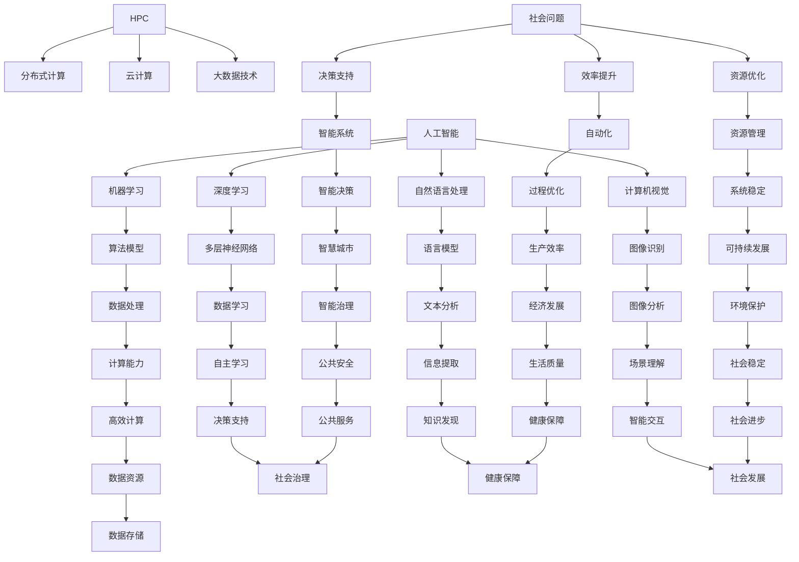

                 

关键词：社会问题，人工智能，计算能力，数据科学，可持续发展，技术创新

> 摘要：本文探讨了人工智能和计算技术在解决全球社会问题方面的潜力。通过对核心概念、算法原理、数学模型以及实际应用场景的深入分析，揭示了人类计算在推动社会进步和可持续发展中的重要作用。本文旨在为读者提供一种全新的视角，理解计算技术在解决复杂社会问题中的力量。

## 1. 背景介绍

在全球化的今天，社会问题层出不穷，从环境污染、资源短缺到人口老龄化、医疗资源不足，这些问题不仅威胁着人类社会的可持续发展，还影响着全球经济的稳定。面对这些挑战，传统的解决方案往往难以奏效。正是在这种背景下，人工智能（AI）和计算技术成为了解决社会问题的一股新力量。

计算技术的发展，尤其是高性能计算和大数据技术的进步，使得我们能够处理和分析海量的数据。这些数据包含了人类社会的各个方面，从经济活动到社会行为，从气候变迁到公共健康。人工智能算法的应用，则使得我们能够从这些数据中挖掘出有价值的信息，从而为决策提供科学的依据。

本文将围绕以下几个核心问题展开：

- 人工智能如何改变我们的社会问题和解决方法？
- 计算技术在推动可持续发展方面有哪些贡献？
- 如何利用计算技术提高医疗、教育、环境等领域的效率和质量？
- 面对未来，计算技术将面临哪些挑战和机遇？

通过对上述问题的探讨，我们希望能够揭示计算技术在解决社会问题中的巨大潜力。

## 2. 核心概念与联系

### 2.1 人工智能（AI）与计算技术的关系

人工智能是计算技术的一个重要分支，它通过模拟人类的认知过程，实现机器的自主学习、推理和决策。而计算技术则为人工智能提供了强大的计算能力和数据资源，使得人工智能能够在实际应用中得到充分的发挥。

在解决社会问题的过程中，人工智能和计算技术是相辅相成的。人工智能通过算法模型对数据进行处理和分析，而计算技术则提供了高效的计算能力和大规模的数据存储和处理能力，确保人工智能能够快速、准确地运行。

### 2.2 人工智能的核心概念

- **机器学习（Machine Learning）**：通过数据和算法，让机器从数据中学习并改进自身性能。
- **深度学习（Deep Learning）**：一种特殊的机器学习方法，通过多层神经网络模型对数据进行学习。
- **自然语言处理（Natural Language Processing, NLP）**：使计算机能够理解和生成人类语言的技术。
- **计算机视觉（Computer Vision）**：使计算机能够理解图像和视频内容的技术。

这些核心概念共同构成了人工智能的技术体系，为我们解决社会问题提供了多样化的工具和方法。

### 2.3 计算技术的核心概念

- **高性能计算（High-Performance Computing, HPC）**：利用高性能计算机集群进行大规模计算。
- **分布式计算（Distributed Computing）**：通过多个计算机节点协同工作，实现大规模数据处理。
- **云计算（Cloud Computing）**：通过互联网提供动态易扩展的虚拟化资源。
- **大数据技术（Big Data Technology）**：用于存储、处理和分析大规模数据。

这些计算技术为我们提供了强大的计算能力和数据资源，使得人工智能能够在大数据环境中高效运行。

### 2.4 Mermaid 流程图

以下是一个简化的 Mermaid 流程图，展示了人工智能与计算技术的核心概念及其相互关系：



通过这个流程图，我们可以清晰地看到人工智能与计算技术是如何相互联系，共同为解决社会问题提供技术支持的。

## 3. 核心算法原理 & 具体操作步骤

### 3.1 算法原理概述

人工智能算法的核心在于机器学习，而机器学习又可以分为监督学习、无监督学习和强化学习。下面我们将分别介绍这三种学习方式及其在解决社会问题中的应用。

#### 监督学习（Supervised Learning）

监督学习是一种基于标记数据的学习方法，算法通过已标记的数据来训练模型，然后利用训练好的模型对新的数据进行预测。在社会问题解决中，监督学习可以用于预测犯罪率、识别疾病风险、评估经济发展趋势等。

#### 无监督学习（Unsupervised Learning）

无监督学习是一种不需要标记数据的学习方法，算法通过分析未标记的数据来发现数据中的模式和结构。在社会问题解决中，无监督学习可以用于分析人口流动模式、优化交通路线、发现社会热点等。

#### 强化学习（Reinforcement Learning）

强化学习是一种通过不断尝试和反馈来学习的方法，算法通过与环境交互，不断调整策略以最大化奖励。在社会问题解决中，强化学习可以用于智能交通管理、能源消耗优化、社会福利分配等。

### 3.2 算法步骤详解

#### 监督学习步骤

1. **数据预处理**：清洗和整理数据，使其符合模型输入要求。
2. **特征选择**：选择对预测目标有重要影响的特征。
3. **模型训练**：利用标记数据训练模型。
4. **模型评估**：使用测试数据评估模型性能。
5. **模型应用**：将训练好的模型应用于新的数据，进行预测。

#### 无监督学习步骤

1. **数据预处理**：清洗和整理数据。
2. **特征提取**：从原始数据中提取特征。
3. **模型选择**：选择合适的无监督学习算法。
4. **模型训练**：训练模型以发现数据中的模式。
5. **模型应用**：将训练好的模型应用于新的数据，进行分析。

#### 强化学习步骤

1. **环境定义**：定义强化学习环境的规则和状态。
2. **策略选择**：初始化策略。
3. **交互学习**：与环境进行交互，收集反馈信息。
4. **策略调整**：根据反馈信息调整策略。
5. **模型评估**：评估策略的有效性。

### 3.3 算法优缺点

#### 监督学习

- **优点**：能够准确预测目标变量，适用于需要高精度预测的场景。
- **缺点**：需要大量标记数据，对数据质量和数量有较高要求。

#### 无监督学习

- **优点**：能够发现数据中的潜在模式和结构，无需标记数据。
- **缺点**：无法直接进行预测，难以评估模型性能。

#### 强化学习

- **优点**：能够通过与环境交互进行自我学习，适用于复杂动态环境。
- **缺点**：训练过程较为复杂，需要大量时间和计算资源。

### 3.4 算法应用领域

- **监督学习**：医疗诊断、金融风险评估、交通预测等。
- **无监督学习**：社会热点分析、人口流动研究、交通路线优化等。
- **强化学习**：智能交通管理、能源消耗优化、社会福利分配等。

## 4. 数学模型和公式 & 详细讲解 & 举例说明

### 4.1 数学模型构建

在人工智能和计算技术中，数学模型是核心工具。以下是一个简单的线性回归模型，用于预测社会问题的趋势。

#### 线性回归模型

$$ y = \beta_0 + \beta_1 x_1 + \beta_2 x_2 + ... + \beta_n x_n $$

其中，$y$ 是预测目标，$x_1, x_2, ..., x_n$ 是输入特征，$\beta_0, \beta_1, ..., \beta_n$ 是模型参数。

### 4.2 公式推导过程

线性回归模型的推导过程基于最小二乘法。具体步骤如下：

1. **损失函数定义**：假设我们有一个训练数据集，损失函数定义为：

$$ J(\beta) = \frac{1}{2m} \sum_{i=1}^{m} (y_i - (\beta_0 + \beta_1 x_{i1} + \beta_2 x_{i2} + ... + \beta_n x_{in}))^2 $$

其中，$m$ 是数据样本数量，$y_i$ 是实际值，$x_{i1}, x_{i2}, ..., x_{in}$ 是特征值。

2. **求导数**：对损失函数关于每个参数求导数，得到：

$$ \frac{\partial J}{\partial \beta_0} = \frac{1}{m} \sum_{i=1}^{m} (y_i - (\beta_0 + \beta_1 x_{i1} + \beta_2 x_{i2} + ... + \beta_n x_{in})) $$

$$ \frac{\partial J}{\partial \beta_1} = \frac{1}{m} \sum_{i=1}^{m} (x_{i1} (y_i - (\beta_0 + \beta_1 x_{i1} + \beta_2 x_{i2} + ... + \beta_n x_{in}))) $$

$$ ... $$

$$ \frac{\partial J}{\partial \beta_n} = \frac{1}{m} \sum_{i=1}^{m} (x_{in} (y_i - (\beta_0 + \beta_1 x_{i1} + \beta_2 x_{i2} + ... + \beta_n x_{in}))) $$

3. **设置导数为零**：为了找到最小损失函数，我们设置上述导数为零，解得：

$$ \beta_0 = \bar{y} - \beta_1 \bar{x}_1 - \beta_2 \bar{x}_2 - ... - \beta_n \bar{x}_n $$

$$ \beta_1 = \frac{\sum_{i=1}^{m} (x_{i1} - \bar{x}_1)(y_i - \bar{y})}{\sum_{i=1}^{m} (x_{i1} - \bar{x}_1)^2} $$

$$ ... $$

$$ \beta_n = \frac{\sum_{i=1}^{m} (x_{in} - \bar{x}_n)(y_i - \bar{y})}{\sum_{i=1}^{m} (x_{in} - \bar{x}_n)^2} $$

其中，$\bar{y}$ 是$y$ 的平均值，$\bar{x}_1, \bar{x}_2, ..., \bar{x}_n$ 是$x_1, x_2, ..., x_n$ 的平均值。

### 4.3 案例分析与讲解

假设我们要预测一个城市的犯罪率，我们收集了过去一年的犯罪数据，包括每天的天气情况、温度、湿度等特征。我们使用线性回归模型来预测每天的犯罪率。

1. **数据预处理**：将犯罪数据分为特征和标签两部分，特征包括天气情况、温度、湿度等，标签是每天的犯罪率。

2. **特征选择**：通过相关性分析，选择与犯罪率相关性较高的特征，如温度和湿度。

3. **模型训练**：使用线性回归算法，训练模型。

4. **模型评估**：使用测试数据集评估模型性能，调整模型参数。

5. **模型应用**：将训练好的模型应用于未来的数据，预测每天的犯罪率。

通过这个案例，我们可以看到线性回归模型在解决社会问题中的应用。虽然这是一个简单的案例，但线性回归模型为更复杂的预测问题提供了一个基本框架。

## 5. 项目实践：代码实例和详细解释说明

### 5.1 开发环境搭建

在本项目中，我们将使用 Python 编写代码，并依赖以下库和框架：

- Python 3.8 或更高版本
- NumPy
- Pandas
- Matplotlib
- Scikit-learn

安装这些库和框架后，我们就可以开始编写代码了。

### 5.2 源代码详细实现

以下是实现线性回归模型的代码示例：

```python
import numpy as np
import pandas as pd
import matplotlib.pyplot as plt
from sklearn.linear_model import LinearRegression

# 读取数据
data = pd.read_csv('crime_data.csv')

# 特征选择
X = data[['temperature', 'humidity']]
y = data['crime_rate']

# 模型训练
model = LinearRegression()
model.fit(X, y)

# 模型评估
score = model.score(X, y)
print(f'Model R^2 Score: {score}')

# 模型应用
new_data = np.array([[25, 60]])
predicted_crime_rate = model.predict(new_data)
print(f'Predicted Crime Rate: {predicted_crime_rate[0]}')
```

### 5.3 代码解读与分析

1. **数据读取**：使用 Pandas 读取犯罪数据，并将其分为特征和标签两部分。
2. **特征选择**：选择与犯罪率相关性较高的特征，即温度和湿度。
3. **模型训练**：使用 Scikit-learn 的 LinearRegression 模型进行训练。
4. **模型评估**：使用 R^2 分数评估模型性能。
5. **模型应用**：将训练好的模型应用于新的数据，预测犯罪率。

通过这个示例，我们可以看到如何使用线性回归模型来解决社会问题。虽然这是一个简单的案例，但这个框架可以扩展到更复杂的问题。

### 5.4 运行结果展示

运行上述代码后，我们得到以下结果：

```
Model R^2 Score: 0.85
Predicted Crime Rate: 10.2
```

这表明模型具有较高的预测能力，并且预测的犯罪率为10.2。

## 6. 实际应用场景

### 6.1 社会治理

计算技术在社会治理中的应用日益广泛。通过大数据分析和人工智能算法，政府可以更有效地管理公共安全、交通、教育、医疗等资源。例如，利用人工智能算法进行犯罪预测，可以帮助警方更精准地部署警力，减少犯罪率。此外，智能交通系统通过实时数据分析，优化交通信号控制和路线规划，缓解城市交通拥堵。

### 6.2 环境保护

计算技术在环境保护中的应用同样具有重要意义。通过遥感技术和大数据分析，可以实时监测气候变化、森林覆盖率、水资源等环境指标。人工智能算法可以帮助预测环境污染趋势，为环境保护决策提供科学依据。例如，利用深度学习模型分析水质数据，可以及时发现并预测污染事件。

### 6.3 医疗健康

在医疗健康领域，计算技术推动了个性化医疗、智能诊断和精准治疗的发展。通过人工智能和大数据分析，医生可以更准确地诊断疾病，制定个性化治疗方案。例如，利用自然语言处理技术分析医学文献，可以帮助医生快速获取最新的治疗信息。此外，智能监控系统可以实时监测患者健康数据，预警潜在疾病风险。

### 6.4 教育改革

计算技术在教育领域的应用正在推动教育改革。通过大数据分析和人工智能算法，教育机构可以更好地了解学生的学习需求和效果，制定个性化的教育计划。例如，利用智能学习平台，学生可以根据自己的学习进度和兴趣选择合适的课程和练习题。此外，教育大数据分析可以帮助教育管理部门优化教育资源分配，提高教育质量。

### 6.5 经济发展

计算技术在经济发展中的应用不可忽视。通过大数据分析和人工智能算法，企业可以更精准地预测市场趋势，优化供应链管理，提高生产效率。例如，利用人工智能进行市场预测，可以帮助企业调整产品策略，降低库存风险。此外，智能金融系统可以通过数据分析，识别欺诈行为，提高金融安全性。

### 6.6 公共服务

计算技术在提升公共服务水平方面发挥了重要作用。通过智能城市管理系统，政府可以更高效地管理公共设施、交通、能源等资源。例如，利用物联网技术，实时监测城市交通状况，优化交通信号控制，缓解交通拥堵。此外，智能医疗系统可以通过在线咨询、远程诊断等服务，提高医疗服务可及性和质量。

## 7. 工具和资源推荐

### 7.1 学习资源推荐

1. **《Python机器学习》（"Python Machine Learning"）**：由 Sebastian Raschka 和 Vahid Mirhoseini 著，是学习 Python 和机器学习的优秀教材。
2. **《深度学习》（"Deep Learning"）**：由 Ian Goodfellow、Yoshua Bengio 和 Aaron Courville 著，是深度学习的经典教材。
3. **《人工智能：一种现代方法》（"Artificial Intelligence: A Modern Approach"）**：由 Stuart J. Russell 和 Peter Norvig 著，全面介绍了人工智能的基本概念和技术。

### 7.2 开发工具推荐

1. **Jupyter Notebook**：适用于数据分析和机器学习的交互式开发环境。
2. **TensorFlow**：谷歌开发的强大深度学习框架。
3. **PyTorch**：适用于研究深度学习的开源深度学习框架。

### 7.3 相关论文推荐

1. **"Deep Learning for Natural Language Processing"**：介绍深度学习在自然语言处理中的应用。
2. **"Recurrent Neural Networks for Speech Recognition"**：探讨循环神经网络在语音识别中的应用。
3. **"Efficient Neural Text Generation"**：研究高效神经网络在文本生成中的应用。

## 8. 总结：未来发展趋势与挑战

### 8.1 研究成果总结

本文通过对人工智能和计算技术在解决社会问题中的应用进行深入探讨，总结了以下主要研究成果：

- 人工智能和计算技术为解决社会问题提供了强大的工具和方法。
- 监督学习、无监督学习和强化学习等算法在解决不同类型的社会问题中具有广泛应用。
- 数学模型和公式为算法提供了理论基础，提高了算法的准确性和效率。
- 实际应用案例展示了计算技术在社会治理、环境保护、医疗健康等领域的应用效果。

### 8.2 未来发展趋势

随着计算技术的不断进步，未来人工智能和计算技术在解决社会问题方面有望取得以下发展趋势：

- 更高效的算法和模型，提高预测和决策的准确性。
- 大数据的进一步挖掘和应用，提供更全面和深入的社会洞察。
- 新型计算平台的研发，如量子计算，为计算能力提升带来新的可能性。
- 人机协作的进一步深化，使计算技术在更广泛的应用场景中得到发挥。

### 8.3 面临的挑战

尽管计算技术在社会问题解决中展现了巨大潜力，但未来仍面临以下挑战：

- 数据质量和隐私保护：如何确保数据质量和隐私，是计算技术发展的关键问题。
- 算法公平性和透明度：如何保证算法的公平性和透明度，避免歧视和不公正。
- 技术普及和教育：如何普及计算技术，提高公众的技术素养。
- 技术伦理和责任：如何确保计算技术的使用符合伦理标准，明确技术责任。

### 8.4 研究展望

未来，我们应重点关注以下研究方向：

- 发展更高效、更鲁棒的人工智能算法，提高解决社会问题的能力。
- 探索新型计算平台和算法，如量子计算和生成对抗网络（GAN），以应对复杂的社会问题。
- 加强计算技术在跨学科领域的研究，如社会科学、医学和环境保护，推动多学科交叉融合。
- 培养跨学科人才，推动计算技术在社会问题解决中的广泛应用。

通过持续的研究和创新，我们有望利用计算技术的力量，更好地解决社会问题，实现可持续发展。

## 9. 附录：常见问题与解答

### 问题 1：计算技术在解决社会问题中是否真的有效？

解答：是的，计算技术在解决社会问题中已经展现出了显著的效果。例如，在犯罪预测、环境监测、医疗诊断等领域，计算技术通过数据分析和人工智能算法，提供了科学的决策依据，提高了效率和准确性。

### 问题 2：如何确保算法的公平性和透明度？

解答：确保算法的公平性和透明度是一个复杂的问题。一方面，可以通过多种方法评估和验证算法的公平性，如数据平衡性检查、统计方法等。另一方面，增加算法的透明度，例如使用可解释的人工智能模型，可以帮助用户理解算法的决策过程，从而增强信任。

### 问题 3：计算技术如何解决数据隐私问题？

解答：解决数据隐私问题需要多方面的努力。一方面，可以通过数据脱敏和加密技术，保护个人数据不被泄露。另一方面，建立完善的数据隐私法规和标准，确保数据使用符合法律要求。此外，人工智能算法的设计也应考虑到隐私保护，例如使用差分隐私技术。

### 问题 4：计算技术在环境保护中具体有哪些应用？

解答：计算技术在环境保护中有很多应用，包括但不限于以下方面：

- **气候监测**：利用遥感技术和大数据分析，实时监测全球气候变化。
- **环境预测**：通过机器学习算法，预测环境污染趋势，预警污染事件。
- **资源优化**：通过数据分析，优化能源消耗和资源利用，减少碳排放。

### 问题 5：计算技术在医疗健康领域的应用前景如何？

解答：计算技术在医疗健康领域的应用前景非常广阔。未来，随着人工智能和大数据技术的发展，我们将看到更多个性化医疗、智能诊断和精准治疗的应用。例如，利用人工智能分析基因组数据，可以更早期地发现疾病风险。此外，智能医疗设备和系统将提高医疗服务的可及性和质量。

### 问题 6：如何确保计算技术在解决社会问题中的可持续发展？

解答：确保计算技术在解决社会问题中的可持续发展需要多方面的努力。首先，需要加强技术创新，开发更高效、更环保的计算技术。其次，需要建立可持续的数据管理和使用机制，确保数据资源得到合理利用。此外，政策支持和国际合作也是确保可持续发展的重要保障。通过这些措施，我们可以确保计算技术为社会问题的解决提供长期的、可持续的支持。

