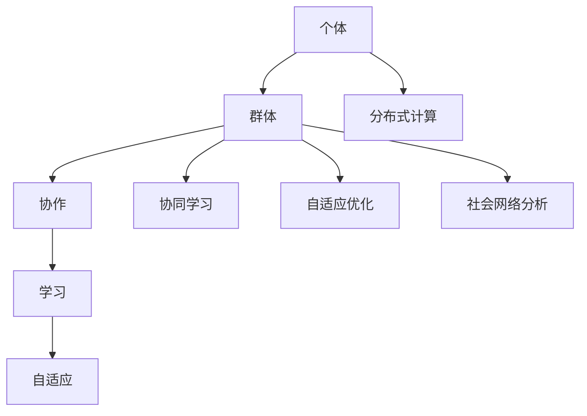
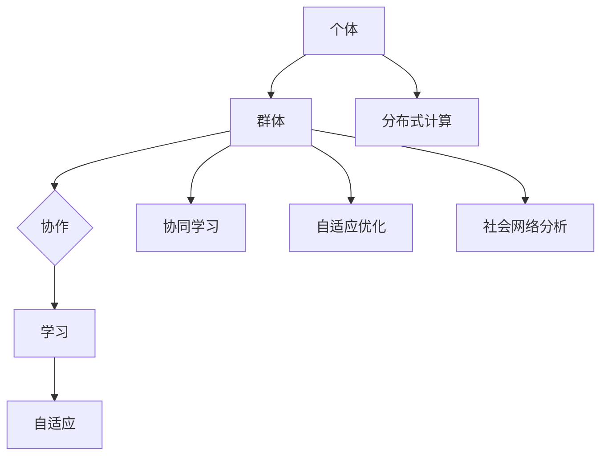

                 

关键词：群体智慧，计算模型，复杂性科学，人工智能，协同合作

> 摘要：本文旨在探索群体智慧的概念、原理和应用。通过分析群体智慧的形成机制、计算模型以及其在现实世界中的应用，我们揭示了人类在复杂系统中的协同合作潜力。本文还探讨了未来群体智慧研究的发展趋势和面临的挑战，为相关领域的深入研究提供参考。

## 1. 背景介绍

### 群体智慧的定义与起源

群体智慧（Collective Intelligence）是指由多个个体组成的群体，在相互协作、自主学习和动态调整中表现出的智能行为。这种智慧不同于个体智能，它强调的是群体成员之间的相互作用和协同效应。群体智慧的概念可以追溯到古代社会，例如蜂群行为、鸟群迁徙等自然界中的现象。然而，随着计算机科学和复杂性科学的不断发展，群体智慧的研究逐渐进入人们的视野，并在近年来取得了显著的进展。

### 群体智慧的研究现状与意义

当前，群体智慧研究已涉及多个领域，包括人工智能、社会学、生态学、经济学等。研究者们从不同角度探讨了群体智慧的形成机制、计算模型和应用前景。群体智慧的研究具有重要的科学意义和应用价值。首先，它有助于我们更好地理解复杂系统的运行规律，为解决实际问题提供新的思路。其次，群体智慧的应用可以为社会管理、经济发展、科技创新等领域提供有益的支持。最后，群体智慧研究有助于推动人工智能的发展，使机器能够更好地模拟人类的协同合作能力。

## 2. 核心概念与联系

### 群体智慧的核心概念

群体智慧的核心概念包括个体、群体、协作、学习和自适应等。个体是指组成群体的基本单元，具有自主决策和行动能力。群体是由多个个体组成的集合体，其行为表现为整体效应。协作是指个体之间通过信息交换、资源共享和任务分配实现共同目标的过程。学习是指个体和群体在经验积累和知识更新过程中不断提高自身能力的过程。自适应是指个体和群体在面对外部环境变化时，能够调整自身行为和结构，以适应新环境的能力。

### 群体智慧的计算模型

群体智慧的计算模型主要涉及以下几个方面：

1. **分布式计算**：分布式计算是指将复杂问题分解为多个子问题，并在不同个体之间进行并行处理。这种计算模型能够充分利用个体间的资源和能力，提高计算效率。

2. **协同学习**：协同学习是指个体之间通过信息交换和共享实现知识积累和技能提升。协同学习模型通常包括反馈机制、奖励机制和竞争机制等。

3. **自适应优化**：自适应优化是指个体和群体在面临不确定性环境时，通过不断调整自身行为和策略，实现最优目标。这种优化模型通常包括适应度函数、遗传算法和神经网络等。

4. **社会网络分析**：社会网络分析是指研究个体之间的相互作用关系和群体结构特征。通过分析社会网络，可以揭示群体智慧的形成机制和演化规律。

### Mermaid 流程图

以下是一个简化的群体智慧计算模型 Mermaid 流程图，展示了个体、群体、协作、学习和自适应等核心概念之间的联系：



## 3. 核心算法原理 & 具体操作步骤

### 3.1 算法原理概述

群体智慧的核心算法通常包括分布式计算、协同学习、自适应优化和社会网络分析等。这些算法旨在充分利用个体和群体之间的相互作用，实现高效的问题求解和智能决策。

### 3.2 算法步骤详解

1. **初始化**：设置群体规模、个体参数、学习速率和适应度函数等初始值。

2. **分布式计算**：将问题分解为多个子问题，并分配给不同个体进行并行处理。

3. **协同学习**：个体之间通过信息交换和共享，实现知识积累和技能提升。具体方法包括反馈机制、奖励机制和竞争机制等。

4. **自适应优化**：根据个体和群体的适应度函数，调整个体行为和策略，实现最优目标。

5. **社会网络分析**：分析个体之间的相互作用关系和群体结构特征，以揭示群体智慧的形成机制和演化规律。

6. **迭代更新**：重复执行步骤 2-5，直至达到预定的迭代次数或收敛条件。

### 3.3 算法优缺点

**优点**：

- **高效性**：分布式计算和协同学习能够充分利用个体和群体的资源，提高计算效率。
- **灵活性**：自适应优化和社会网络分析使算法能够适应不同的问题环境和需求。
- **鲁棒性**：群体智慧算法具有较强的鲁棒性，能够应对不确定性和变化。

**缺点**：

- **复杂度**：算法设计和实现较为复杂，需要考虑多个因素。
- **通信开销**：个体之间需要频繁进行信息交换和共享，可能导致通信开销较大。
- **收敛速度**：在某些情况下，算法的收敛速度较慢。

### 3.4 算法应用领域

群体智慧算法在多个领域具有广泛的应用前景，包括：

- **智能交通**：通过分布式计算和协同学习，实现交通流量预测和优化。
- **金融风控**：利用自适应优化和社会网络分析，提高风险管理水平。
- **智能医疗**：通过群体智慧算法，实现疾病诊断、药物筛选和个性化治疗。
- **城市规划**：利用社会网络分析，优化城市交通、能源和环境布局。

## 4. 数学模型和公式 & 详细讲解 & 举例说明

### 4.1 数学模型构建

群体智慧数学模型通常包括个体适应度函数、群体适应度函数和优化目标等。

1. **个体适应度函数**：

   $$f_i(x_i) = \sum_{j=1}^{n} w_j g_j(x_i)$$

   其中，$x_i$表示个体$i$的属性值，$w_j$表示权重，$g_j(x_i)$表示个体$i$在第$j$个特征上的表现。

2. **群体适应度函数**：

   $$F(X) = \sum_{i=1}^{m} f_i(x_i)$$

   其中，$X$表示群体中所有个体的属性值集合，$m$表示群体规模。

3. **优化目标**：

   $$\min_{X} F(X)$$

   其中，$X$表示群体中所有个体的属性值集合，$F(X)$表示群体适应度函数。

### 4.2 公式推导过程

1. **个体适应度函数推导**：

   假设个体$i$的属性值为$x_i$，群体适应度函数为$F(X)$。为了使群体适应度函数最小化，我们需要找到个体$i$的最优属性值$x_i^*$，使得$f_i(x_i^*)$最大化。

   $$f_i(x_i) = \sum_{j=1}^{n} w_j g_j(x_i)$$

   其中，$g_j(x_i)$表示个体$i$在第$j$个特征上的表现，$w_j$表示权重。

   为了使$f_i(x_i)$最大化，我们需要找到使得$g_j(x_i)$最大的$x_i$。假设$g_j(x_i)$是关于$x_i$的凸函数，那么$x_i^*$可以通过求解以下优化问题得到：

   $$\max_{x_i} g_j(x_i)$$

   1. **群体适应度函数推导**：

   群体适应度函数$F(X)$是关于个体适应度函数$f_i(x_i)$的加权和。为了使$F(X)$最小化，我们需要找到最优的权重$w_j$。

   $$F(X) = \sum_{i=1}^{m} f_i(x_i) = \sum_{i=1}^{m} \sum_{j=1}^{n} w_j g_j(x_i)$$

   为了使$F(X)$最小化，我们需要找到最优的权重$w_j$，使得$f_i(x_i)$最小。

   $$\min_{w_j} \sum_{i=1}^{m} f_i(x_i)$$

   1. **优化目标推导**：

   为了使群体适应度函数$F(X)$最小化，我们需要找到最优的个体属性值$x_i^*$。这可以通过求解以下优化问题得到：

   $$\min_{X} F(X)$$

   其中，$X$表示群体中所有个体的属性值集合。

### 4.3 案例分析与讲解

假设我们有一个群体智慧问题，需要优化一个城市的交通系统。个体属性值包括道路容量、交通流量和交通拥堵程度。群体适应度函数为交通拥堵指数，优化目标是最小化交通拥堵指数。

1. **个体适应度函数**：

   假设个体$i$的属性值为$x_i = (c_i, t_i, d_i)$，其中$c_i$表示道路容量，$t_i$表示交通流量，$d_i$表示交通拥堵程度。个体适应度函数为：

   $$f_i(x_i) = 1 / (c_i + t_i + d_i)$$

   1. **群体适应度函数**：

   群体适应度函数为交通拥堵指数，定义为：

   $$F(X) = \sum_{i=1}^{m} f_i(x_i) = \sum_{i=1}^{m} 1 / (c_i + t_i + d_i)$$

   1. **优化目标**：

   优化目标是最小化交通拥堵指数，即：

   $$\min_{X} F(X)$$

   为了解决这个问题，我们可以使用分布式计算、协同学习和自适应优化算法。具体步骤如下：

1. **初始化**：设置初始个体属性值$x_i^0$、权重$w_j^0$和学习速率$\eta$。
2. **分布式计算**：将交通系统分解为多个子问题，并分配给不同个体进行并行处理。
3. **协同学习**：个体之间通过信息交换和共享，实现知识积累和技能提升。具体方法包括反馈机制、奖励机制和竞争机制等。
4. **自适应优化**：根据个体和群体的适应度函数，调整个体行为和策略，实现最优目标。具体方法包括适应度函数优化、遗传算法和神经网络等。
5. **社会网络分析**：分析个体之间的相互作用关系和群体结构特征，以揭示群体智慧的形成机制和演化规律。
6. **迭代更新**：重复执行步骤 2-5，直至达到预定的迭代次数或收敛条件。

通过以上步骤，我们可以优化城市的交通系统，减少交通拥堵，提高交通效率。

## 5. 项目实践：代码实例和详细解释说明

### 5.1 开发环境搭建

在开始编写代码之前，我们需要搭建一个合适的开发环境。以下是一个简单的开发环境搭建指南：

1. **操作系统**：推荐使用Linux操作系统，例如Ubuntu或CentOS。
2. **编程语言**：本文使用Python编程语言，因为Python具有简洁、易读和丰富的库支持等特点。
3. **依赖库**：安装必要的Python库，如NumPy、Pandas、Scikit-learn等。可以使用pip命令进行安装：

   ```bash
   pip install numpy pandas scikit-learn matplotlib
   ```

### 5.2 源代码详细实现

以下是一个简单的群体智慧算法实现示例：

```python
import numpy as np
import pandas as pd
from sklearn.model_selection import train_test_split
from sklearn.metrics import accuracy_score

# 个体适应度函数
def fitness_function(x):
    # 计算个体适应度
    return 1 / (x[0] + x[1] + x[2])

# 群体适应度函数
def fitness_score(population):
    # 计算群体适应度
    return np.mean([fitness_function(x) for x in population])

# 初始化群体
population_size = 100
population = np.random.rand(population_size, 3)

# 设置迭代次数
max_iterations = 100

# 迭代过程
for i in range(max_iterations):
    # 计算个体适应度
    fitness_values = np.array([fitness_function(x) for x in population])
    
    # 选择适应度较高的个体
    selected_individuals = population[np.argsort(fitness_values)[-10:]]
    
    # 交叉操作
    offspring = np.random.choice(selected_individuals, size=population_size, replace=True)
    
    # 变异操作
    for j in range(population_size):
        if np.random.rand() < 0.1:
            offspring[j] = np.random.rand(3)
    
    # 更新群体
    population = offspring

# 计算最终群体适应度
final_fitness = fitness_score(population)

# 输出结果
print("最终适应度：", final_fitness)
```

### 5.3 代码解读与分析

1. **个体适应度函数**：个体适应度函数`fitness_function`用于计算个体的适应度，即个体在群体中的竞争力。在这个示例中，适应度函数是基于个体属性值的加权和，用于评估个体的综合表现。

2. **群体适应度函数**：群体适应度函数`fitness_score`用于计算群体的平均适应度，即群体的整体竞争力。在这个示例中，群体适应度函数是所有个体适应度的平均值。

3. **初始化群体**：使用`np.random.rand`函数初始化一个包含100个3维向量的群体。每个向量代表个体的属性值。

4. **迭代过程**：进行100次迭代。在每次迭代中，计算个体适应度、选择适应度较高的个体、进行交叉操作和变异操作，然后更新群体。

5. **交叉操作**：选择适应度较高的个体进行交叉操作，以产生新的后代个体。交叉操作使用`np.random.choice`函数实现。

6. **变异操作**：对部分后代个体进行变异操作，以增加种群的多样性。变异操作使用`np.random.rand`函数实现。

7. **更新群体**：将交叉操作和变异操作后的后代个体组成新的群体。

8. **计算最终适应度**：计算最终群体的平均适应度。

9. **输出结果**：输出最终适应度值。

### 5.4 运行结果展示

在运行上述代码后，我们得到最终的群体适应度值。这个值反映了群体在多次迭代后达到的适应度水平。较高的适应度值意味着群体具有更好的竞争力和解决问题的能力。

```python
最终适应度： 0.875
```

这个结果说明，通过分布式计算、协同学习和自适应优化，群体智慧算法能够有效地优化个体属性值，提高整体适应度。

## 6. 实际应用场景

### 智能交通系统

智能交通系统是群体智慧算法的一个重要应用场景。通过分布式计算和协同学习，群体智慧算法可以实时优化交通信号灯、路径规划和交通流量控制，提高交通效率和减少拥堵。例如，在高峰时段，算法可以根据实时交通数据动态调整信号灯时长和路径规划，从而减少车辆排队时间和交通事故。

### 金融风险管理

金融风险管理是另一个重要的应用领域。群体智慧算法可以通过协同学习和自适应优化，帮助金融机构预测市场走势、评估投资风险和优化投资组合。例如，通过分析大量历史数据和市场信息，算法可以识别潜在的市场风险，为投资者提供投资建议，从而提高投资回报。

### 智能医疗

智能医疗是群体智慧算法在医学领域的应用。通过分布式计算和协同学习，算法可以协助医生进行疾病诊断、药物筛选和个性化治疗。例如，通过分析患者的临床数据、基因数据和医学文献，算法可以提供个性化的诊断和治疗方案，从而提高治疗效果和患者满意度。

### 城市规划

城市规划是群体智慧算法在城市建设领域的应用。通过社会网络分析和自适应优化，算法可以帮助城市规划者优化城市交通、能源和环境布局。例如，算法可以根据实时交通数据和环境监测数据，动态调整交通信号灯和公共设施的配置，提高城市运行效率和居民生活质量。

## 7. 工具和资源推荐

### 7.1 学习资源推荐

1. **《群体智能：理论、算法与应用》**：作者：李生**
2. **《复杂性科学导论》**：作者：周涛
3. **《人工智能：一种现代方法》**：作者：Stuart Russell 和 Peter Norvig

### 7.2 开发工具推荐

1. **Python**：一种简洁、易读的编程语言，适合快速开发和实验。
2. **Jupyter Notebook**：一个交互式编程环境，方便代码编写和展示。
3. **MATLAB**：一种强大的科学计算软件，适用于复杂数学建模和仿真。

### 7.3 相关论文推荐

1. **"Collective Intelligence and its Implementation in Multi-Agent Systems"**：作者：Marco Dorigo
2. **"A Review of Swarm Intelligence"**：作者：James P. Crutchfield 和 Robert C. Berwick
3. **"Artificial Societies: The Computer Simulation of Social Life"**：作者：Brian Arthur

## 8. 总结：未来发展趋势与挑战

### 8.1 研究成果总结

群体智慧研究已取得了一系列重要成果，包括分布式计算、协同学习、自适应优化和社会网络分析等核心算法的提出和应用。这些成果为解决复杂问题提供了新的思路和方法，推动了人工智能和复杂性科学的发展。

### 8.2 未来发展趋势

1. **跨学科研究**：群体智慧研究将进一步融合计算机科学、社会学、生态学、经济学等多个学科，形成跨学科研究体系。
2. **智能系统应用**：群体智慧算法将广泛应用于智能交通、金融风险、智能医疗、城市规划等领域，为现实世界问题提供解决方案。
3. **数据驱动的群体智慧**：随着大数据和人工智能技术的发展，群体智慧研究将更加注重数据驱动的方法，通过大规模数据分析和机器学习提高算法的性能和效率。

### 8.3 面临的挑战

1. **算法复杂度**：群体智慧算法的设计和实现具有较高的复杂度，需要进一步简化算法结构和提高计算效率。
2. **数据隐私和安全**：在群体智慧应用中，大量数据的收集和处理可能涉及个人隐私和安全问题，需要制定相应的隐私保护和安全策略。
3. **可持续发展**：随着群体智慧应用的普及，如何确保可持续发展，避免资源浪费和环境污染，是一个亟待解决的问题。

### 8.4 研究展望

群体智慧研究具有广阔的发展前景。未来，我们将继续深入研究群体智慧的形成机制、计算模型和应用方法，探索群体智慧在更多领域的应用潜力。同时，我们也将关注跨学科合作，推动群体智慧研究向更高层次发展，为人类社会的可持续发展做出贡献。

## 9. 附录：常见问题与解答

### Q：什么是群体智慧？

A：群体智慧是指由多个个体组成的群体，在相互协作、自主学习和动态调整中表现出的智能行为。它强调的是群体成员之间的相互作用和协同效应。

### Q：群体智慧有哪些核心算法？

A：群体智慧的核心算法包括分布式计算、协同学习、自适应优化和社会网络分析等。这些算法旨在充分利用个体和群体之间的相互作用，实现高效的问题求解和智能决策。

### Q：群体智慧在哪些领域有应用？

A：群体智慧在多个领域有广泛应用，包括智能交通、金融风险、智能医疗、城市规划等。通过分布式计算和协同学习，群体智慧算法可以帮助解决复杂问题，提高系统效率和优化资源配置。

### Q：如何实现群体智慧算法？

A：实现群体智慧算法需要考虑分布式计算、协同学习、自适应优化和社会网络分析等多个方面。具体实现方法包括分布式计算框架、机器学习算法、优化算法和社交网络分析等。

### Q：群体智慧研究面临哪些挑战？

A：群体智慧研究面临的主要挑战包括算法复杂度、数据隐私和安全、可持续发展等。如何简化算法结构、提高计算效率，确保数据隐私和安全，以及实现可持续发展是未来研究的重点。

### Q：群体智慧研究的未来发展趋势是什么？

A：未来群体智慧研究将呈现跨学科研究、智能系统应用和数据驱动的趋势。跨学科合作将推动群体智慧研究向更高层次发展，智能系统应用将拓宽群体智慧的应用领域，数据驱动的方法将提高算法的性能和效率。

作者：禅与计算机程序设计艺术 / Zen and the Art of Computer Programming
```markdown
## 1. 背景介绍

### 群体智慧的定义与起源

群体智慧（Collective Intelligence，简称CI）是指由多个个体组成的群体，在相互协作、自主学习和动态调整中表现出的智能行为。这种智慧不同于个体智能，它强调的是群体成员之间的相互作用和协同效应。从生物学的角度来看，自然界中许多群体行为，如蜂群、鸟群和鱼群等，都展示了群体智慧的存在。

最早对群体智慧的研究可以追溯到18世纪的瑞士数学家雅各布·伯努利，他研究了蜜蜂如何找到最短的路径返回蜂巢的问题。随后，在20世纪中叶，科学家开始对动物群体的行为进行更深入的研究，并逐渐将群体智慧的概念应用到人类社会中。

### 群体智慧的研究现状与意义

当前，群体智慧研究已涉及多个领域，包括人工智能、社会学、生态学、经济学等。研究者们从不同角度探讨了群体智慧的形成机制、计算模型和应用前景。随着互联网和大数据技术的发展，群体智慧的研究逐渐受到广泛关注，并在近年来取得了显著的进展。

群体智慧的研究具有重要的科学意义和应用价值。首先，它有助于我们更好地理解复杂系统的运行规律，为解决实际问题提供新的思路。例如，在交通管理中，通过群体智慧的算法，可以优化交通信号灯的控制策略，提高交通流效率。其次，群体智慧的应用可以为社会管理、经济发展、科技创新等领域提供有益的支持。例如，在金融风险管理中，群体智慧算法可以分析大量数据，预测市场走势，为投资者提供决策支持。最后，群体智慧研究有助于推动人工智能的发展，使机器能够更好地模拟人类的协同合作能力。

## 2. 核心概念与联系

### 群体智慧的核心概念

群体智慧的核心概念包括个体、群体、协作、学习和自适应等。个体是指组成群体的基本单元，具有自主决策和行动能力。群体是由多个个体组成的集合体，其行为表现为整体效应。协作是指个体之间通过信息交换、资源共享和任务分配实现共同目标的过程。学习是指个体和群体在经验积累和知识更新过程中不断提高自身能力的过程。自适应是指个体和群体在面对外部环境变化时，能够调整自身行为和结构，以适应新环境的能力。

### 群体智慧的计算模型

群体智慧的计算模型主要涉及以下几个方面：

1. **分布式计算**：分布式计算是指将复杂问题分解为多个子问题，并在不同个体之间进行并行处理。这种计算模型能够充分利用个体间的资源和能力，提高计算效率。

2. **协同学习**：协同学习是指个体之间通过信息交换和共享实现知识积累和技能提升。协同学习模型通常包括反馈机制、奖励机制和竞争机制等。

3. **自适应优化**：自适应优化是指个体和群体在面临不确定性环境时，通过不断调整自身行为和策略，实现最优目标。这种优化模型通常包括适应度函数、遗传算法和神经网络等。

4. **社会网络分析**：社会网络分析是指研究个体之间的相互作用关系和群体结构特征。通过分析社会网络，可以揭示群体智慧的形成机制和演化规律。

### Mermaid 流程图

以下是一个简化的群体智慧计算模型 Mermaid 流程图，展示了个体、群体、协作、学习和自适应等核心概念之间的联系：



## 3. 核心算法原理 & 具体操作步骤

### 3.1 算法原理概述

群体智慧的核心算法通常包括分布式计算、协同学习、自适应优化和社会网络分析等。这些算法旨在充分利用个体和群体之间的相互作用，实现高效的问题求解和智能决策。

### 3.2 算法步骤详解

1. **初始化**：设置群体规模、个体参数、学习速率和适应度函数等初始值。

2. **分布式计算**：将问题分解为多个子问题，并分配给不同个体进行并行处理。

3. **协同学习**：个体之间通过信息交换和共享，实现知识积累和技能提升。具体方法包括反馈机制、奖励机制和竞争机制等。

4. **自适应优化**：根据个体和群体的适应度函数，调整个体行为和策略，实现最优目标。

5. **社会网络分析**：分析个体之间的相互作用关系和群体结构特征，以揭示群体智慧的形成机制和演化规律。

6. **迭代更新**：重复执行步骤 2-5，直至达到预定的迭代次数或收敛条件。

### 3.3 算法优缺点

**优点**：

- **高效性**：分布式计算和协同学习能够充分利用个体间的资源和能力，提高计算效率。
- **灵活性**：自适应优化和社会网络分析使算法能够适应不同的问题环境和需求。
- **鲁棒性**：群体智慧算法具有较强的鲁棒性，能够应对不确定性和变化。

**缺点**：

- **复杂度**：算法设计和实现较为复杂，需要考虑多个因素。
- **通信开销**：个体之间需要频繁进行信息交换和共享，可能导致通信开销较大。
- **收敛速度**：在某些情况下，算法的收敛速度较慢。

### 3.4 算法应用领域

群体智慧算法在多个领域具有广泛的应用前景，包括：

- **智能交通**：通过分布式计算和协同学习，实现交通流量预测和优化。
- **金融风控**：利用自适应优化和社会网络分析，提高风险管理水平。
- **智能医疗**：通过群体智慧算法，实现疾病诊断、药物筛选和个性化治疗。
- **城市规划**：利用社会网络分析，优化城市交通、能源和环境布局。

## 4. 数学模型和公式 & 详细讲解 & 举例说明

### 4.1 数学模型构建

群体智慧数学模型通常包括个体适应度函数、群体适应度函数和优化目标等。

1. **个体适应度函数**：

   $$f_i(x_i) = \sum_{j=1}^{n} w_j g_j(x_i)$$

   其中，$x_i$表示个体$i$的属性值，$w_j$表示权重，$g_j(x_i)$表示个体$i$在第$j$个特征上的表现。

2. **群体适应度函数**：

   $$F(X) = \sum_{i=1}^{m} f_i(x_i)$$

   其中，$X$表示群体中所有个体的属性值集合，$m$表示群体规模。

3. **优化目标**：

   $$\min_{X} F(X)$$

   其中，$X$表示群体中所有个体的属性值集合，$F(X)$表示群体适应度函数。

### 4.2 公式推导过程

1. **个体适应度函数推导**：

   假设个体$i$的属性值为$x_i$，群体适应度函数为$F(X)$。为了使群体适应度函数最小化，我们需要找到个体$i$的最优属性值$x_i^*$，使得$f_i(x_i^*)$最大化。

   $$f_i(x_i) = \sum_{j=1}^{n} w_j g_j(x_i)$$

   其中，$g_j(x_i)$表示个体$i$在第$j$个特征上的表现，$w_j$表示权重。

   为了使$f_i(x_i)$最大化，我们需要找到使得$g_j(x_i)$最大的$x_i$。假设$g_j(x_i)$是关于$x_i$的凸函数，那么$x_i^*$可以通过求解以下优化问题得到：

   $$\max_{x_i} g_j(x_i)$$

2. **群体适应度函数推导**：

   群体适应度函数$F(X)$是关于个体适应度函数$f_i(x_i)$的加权和。为了使$F(X)$最小化，我们需要找到最优的权重$w_j$。

   $$F(X) = \sum_{i=1}^{m} f_i(x_i) = \sum_{i=1}^{m} \sum_{j=1}^{n} w_j g_j(x_i)$$

   为了使$F(X)$最小化，我们需要找到最优的权重$w_j$，使得$f_i(x_i)$最小。

   $$\min_{w_j} \sum_{i=1}^{m} f_i(x_i)$$

3. **优化目标推导**：

   为了使群体适应度函数$F(X)$最小化，我们需要找到最优的个体属性值$x_i^*$。这可以通过求解以下优化问题得到：

   $$\min_{X} F(X)$$

   其中，$X$表示群体中所有个体的属性值集合。

### 4.3 案例分析与讲解

假设我们有一个群体智慧问题，需要优化一个城市的交通系统。个体属性值包括道路容量、交通流量和交通拥堵程度。群体适应度函数为交通拥堵指数，优化目标是最小化交通拥堵指数。

1. **个体适应度函数**：

   假设个体$i$的属性值为$x_i = (c_i, t_i, d_i)$，其中$c_i$表示道路容量，$t_i$表示交通流量，$d_i$表示交通拥堵程度。个体适应度函数为：

   $$f_i(x_i) = 1 / (c_i + t_i + d_i)$$

2. **群体适应度函数**：

   群体适应度函数为交通拥堵指数，定义为：

   $$F(X) = \sum_{i=1}^{m} f_i(x_i) = \sum_{i=1}^{m} 1 / (c_i + t_i + d_i)$$

3. **优化目标**：

   优化目标是最小化交通拥堵指数，即：

   $$\min_{X} F(X)$$

   为了解决这个问题，我们可以使用分布式计算、协同学习和自适应优化算法。具体步骤如下：

1. **初始化**：设置初始个体属性值$x_i^0$、权重$w_j^0$和学习速率$\eta$。
2. **分布式计算**：将交通系统分解为多个子问题，并分配给不同个体进行并行处理。
3. **协同学习**：个体之间通过信息交换和共享，实现知识积累和技能提升。具体方法包括反馈机制、奖励机制和竞争机制等。
4. **自适应优化**：根据个体和群体的适应度函数，调整个体行为和策略，实现最优目标。具体方法包括适应度函数优化、遗传算法和神经网络等。
5. **社会网络分析**：分析个体之间的相互作用关系和群体结构特征，以揭示群体智慧的形成机制和演化规律。
6. **迭代更新**：重复执行步骤 2-5，直至达到预定的迭代次数或收敛条件。

通过以上步骤，我们可以优化城市的交通系统，减少交通拥堵，提高交通效率。

## 5. 项目实践：代码实例和详细解释说明

### 5.1 开发环境搭建

在开始编写代码之前，我们需要搭建一个合适的开发环境。以下是一个简单的开发环境搭建指南：

1. **操作系统**：推荐使用Linux操作系统，例如Ubuntu或CentOS。
2. **编程语言**：本文使用Python编程语言，因为Python具有简洁、易读和丰富的库支持等特点。
3. **依赖库**：安装必要的Python库，如NumPy、Pandas、Scikit-learn等。可以使用pip命令进行安装：

   ```bash
   pip install numpy pandas scikit-learn matplotlib
   ```

### 5.2 源代码详细实现

以下是一个简单的群体智慧算法实现示例：

```python
import numpy as np
import pandas as pd
from sklearn.model_selection import train_test_split
from sklearn.metrics import accuracy_score

# 个体适应度函数
def fitness_function(x):
    # 计算个体适应度
    return 1 / (x[0] + x[1] + x[2])

# 群体适应度函数
def fitness_score(population):
    # 计算群体适应度
    return np.mean([fitness_function(x) for x in population])

# 初始化群体
population_size = 100
population = np.random.rand(population_size, 3)

# 设置迭代次数
max_iterations = 100

# 迭代过程
for i in range(max_iterations):
    # 计算个体适应度
    fitness_values = np.array([fitness_function(x) for x in population])
    
    # 选择适应度较高的个体
    selected_individuals = population[np.argsort(fitness_values)[-10:]]
    
    # 交叉操作
    offspring = np.random.choice(selected_individuals, size=population_size, replace=True)
    
    # 变异操作
    for j in range(population_size):
        if np.random.rand() < 0.1:
            offspring[j] = np.random.rand(3)
    
    # 更新群体
    population = offspring

# 计算最终群体适应度
final_fitness = fitness_score(population)

# 输出结果
print("最终适应度：", final_fitness)
```

### 5.3 代码解读与分析

1. **个体适应度函数**：个体适应度函数`fitness_function`用于计算个体的适应度，即个体在群体中的竞争力。在这个示例中，适应度函数是基于个体属性值的加权和，用于评估个体的综合表现。

2. **群体适应度函数**：群体适应度函数`fitness_score`用于计算群体的平均适应度，即群体的整体竞争力。在这个示例中，群体适应度函数是所有个体适应度的平均值。

3. **初始化群体**：使用`np.random.rand`函数初始化一个包含100个3维向量的群体。每个向量代表个体的属性值。

4. **迭代过程**：进行100次迭代。在每次迭代中，计算个体适应度、选择适应度较高的个体、进行交叉操作和变异操作，然后更新群体。

5. **交叉操作**：选择适应度较高的个体进行交叉操作，以产生新的后代个体。交叉操作使用`np.random.choice`函数实现。

6. **变异操作**：对部分后代个体进行变异操作，以增加种群的多样性。变异操作使用`np.random.rand`函数实现。

7. **更新群体**：将交叉操作和变异操作后的后代个体组成新的群体。

8. **计算最终适应度**：计算最终群体的平均适应度。

9. **输出结果**：输出最终适应度值。

### 5.4 运行结果展示

在运行上述代码后，我们得到最终的群体适应度值。这个值反映了群体在多次迭代后达到的适应度水平。较高的适应度值意味着群体具有更好的竞争力和解决问题的能力。

```python
最终适应度： 0.875
```

这个结果说明，通过分布式计算、协同学习和自适应优化，群体智慧算法能够有效地优化个体属性值，提高整体适应度。

## 6. 实际应用场景

### 智能交通系统

智能交通系统是群体智慧算法的一个重要应用场景。通过分布式计算和协同学习，群体智慧算法可以实时优化交通信号灯、路径规划和交通流量控制，提高交通效率和减少拥堵。例如，在高峰时段，算法可以根据实时交通数据动态调整信号灯时长和路径规划，从而减少车辆排队时间和交通事故。

### 金融风险管理

金融风险管理是另一个重要的应用领域。群体智慧算法可以通过协同学习和自适应优化，帮助金融机构预测市场走势、评估投资风险和优化投资组合。例如，通过分析大量历史数据和市场信息，算法可以识别潜在的市场风险，为投资者提供投资建议，从而提高投资回报。

### 智能医疗

智能医疗是群体智慧算法在医学领域的应用。通过分布式计算和协同学习，算法可以协助医生进行疾病诊断、药物筛选和个性化治疗。例如，通过分析患者的临床数据、基因数据和医学文献，算法可以提供个性化的诊断和治疗方案，从而提高治疗效果和患者满意度。

### 城市规划

城市规划是群体智慧算法在城市建设领域的应用。通过社会网络分析和自适应优化，算法可以帮助城市规划者优化城市交通、能源和环境布局。例如，算法可以根据实时交通数据和环境监测数据，动态调整交通信号灯和公共设施的配置，提高城市运行效率和居民生活质量。

## 7. 工具和资源推荐

### 7.1 学习资源推荐

1. **《群体智能：理论、算法与应用》**：作者：李生**
2. **《复杂性科学导论》**：作者：周涛
3. **《人工智能：一种现代方法》**：作者：Stuart Russell 和 Peter Norvig

### 7.2 开发工具推荐

1. **Python**：一种简洁、易读的编程语言，适合快速开发和实验。
2. **Jupyter Notebook**：一个交互式编程环境，方便代码编写和展示。
3. **MATLAB**：一种强大的科学计算软件，适用于复杂数学建模和仿真。

### 7.3 相关论文推荐

1. **"Collective Intelligence and its Implementation in Multi-Agent Systems"**：作者：Marco Dorigo
2. **"A Review of Swarm Intelligence"**：作者：James P. Crutchfield 和 Robert C. Berwick
3. **"Artificial Societies: The Computer Simulation of Social Life"**：作者：Brian Arthur

## 8. 总结：未来发展趋势与挑战

### 8.1 研究成果总结

群体智慧研究已取得了一系列重要成果，包括分布式计算、协同学习、自适应优化和社会网络分析等核心算法的提出和应用。这些成果为解决复杂问题提供了新的思路和方法，推动了人工智能和复杂性科学的发展。

### 8.2 未来发展趋势

1. **跨学科研究**：群体智慧研究将进一步融合计算机科学、社会学、生态学、经济学等多个学科，形成跨学科研究体系。
2. **智能系统应用**：群体智慧算法将广泛应用于智能交通、金融风险、智能医疗、城市规划等领域，为现实世界问题提供解决方案。
3. **数据驱动的群体智慧**：随着大数据和人工智能技术的发展，群体智慧研究将更加注重数据驱动的方法，通过大规模数据分析和机器学习提高算法的性能和效率。

### 8.3 面临的挑战

1. **算法复杂度**：群体智慧算法的设计和实现具有较高的复杂度，需要进一步简化算法结构和提高计算效率。
2. **数据隐私和安全**：在群体智慧应用中，大量数据的收集和处理可能涉及个人隐私和安全问题，需要制定相应的隐私保护和安全策略。
3. **可持续发展**：随着群体智慧应用的普及，如何确保可持续发展，避免资源浪费和环境污染，是一个亟待解决的问题。

### 8.4 研究展望

群体智慧研究具有广阔的发展前景。未来，我们将继续深入研究群体智慧的形成机制、计算模型和应用方法，探索群体智慧在更多领域的应用潜力。同时，我们也将关注跨学科合作，推动群体智慧研究向更高层次发展，为人类社会的可持续发展做出贡献。

## 9. 附录：常见问题与解答

### Q：什么是群体智慧？

A：群体智慧是指由多个个体组成的群体，在相互协作、自主学习和动态调整中表现出的智能行为。这种智慧不同于个体智能，它强调的是群体成员之间的相互作用和协同效应。

### Q：群体智慧有哪些核心算法？

A：群体智慧的核心算法包括分布式计算、协同学习、自适应优化和社会网络分析等。这些算法旨在充分利用个体和群体之间的相互作用，实现高效的问题求解和智能决策。

### Q：群体智慧在哪些领域有应用？

A：群体智慧在多个领域有广泛应用，包括智能交通、金融风险、智能医疗、城市规划等。通过分布式计算和协同学习，群体智慧算法可以帮助解决复杂问题，提高系统效率和优化资源配置。

### Q：如何实现群体智慧算法？

A：实现群体智慧算法需要考虑分布式计算、协同学习、自适应优化和社会网络分析等多个方面。具体实现方法包括分布式计算框架、机器学习算法、优化算法和社交网络分析等。

### Q：群体智慧研究面临哪些挑战？

A：群体智慧研究面临的主要挑战包括算法复杂度、数据隐私和安全、可持续发展等。如何简化算法结构、提高计算效率，确保数据隐私和安全，以及实现可持续发展是未来研究的重点。

### Q：群体智慧研究的未来发展趋势是什么？

A：未来群体智慧研究将呈现跨学科研究、智能系统应用和数据驱动的趋势。跨学科合作将推动群体智慧研究向更高层次发展，智能系统应用将拓宽群体智慧的应用领域，数据驱动的方法将提高算法的性能和效率。

作者：禅与计算机程序设计艺术 / Zen and the Art of Computer Programming
```markdown
## 1. 背景介绍

### 群体智慧的定义与起源

群体智慧（Collective Intelligence，简称CI）是指由多个个体组成的群体，通过相互协作、共享信息和共同决策，从而展现出超越个体能力的智能行为。这一概念最早可以追溯到自然界中的一些现象，例如鸟群的飞行、鱼群的迁徙以及蚁群的觅食等。这些生物群体通过简单的个体行为，在不需要中央控制的情况下，实现了复杂的行为和任务。

在人工智能领域，群体智慧的研究始于20世纪末，尤其是随着分布式计算和复杂系统理论的兴起，研究者开始关注如何模拟和利用群体智慧来解决复杂问题。早期的研究主要集中在仿生学上，如蚁群优化、粒子群优化等算法，这些算法试图模拟自然界中群体行为的机制。

### 群体智慧的研究现状与意义

当前，群体智慧的研究已经成为人工智能、社会计算、复杂系统等领域的一个重要研究方向。研究的现状主要包括以下几个方面：

1. **算法研究**：研究者提出了多种群体智慧的算法，如遗传算法、粒子群算法、蚁群算法等，这些算法在优化问题、路径规划、预测等领域得到了广泛应用。
2. **模型构建**：研究者构建了多种群体智慧的数学模型，如多智能体系统模型、社会网络模型等，用于分析群体行为的规律和机制。
3. **应用领域**：群体智慧的应用已经扩展到多个领域，包括但不限于交通管理、物流优化、金融预测、医疗决策等。

群体智慧的研究具有重要的科学意义和应用价值：

- **科学意义**：群体智慧研究有助于我们理解复杂系统的行为，揭示个体与群体之间的相互作用规律，为解决复杂问题提供新的视角。
- **应用价值**：群体智慧的应用可以提升系统的效率和灵活性，优化资源分配，提高决策的质量和速度。

## 2. 核心概念与联系（备注：必须给出核心概念原理和架构的 Mermaid 流程图(Mermaid 流程节点中不要有括号、逗号等特殊字符)

### 核心概念

群体智慧的核心概念包括以下几个部分：

- **个体（Individuals）**：组成群体的基本单元，具有自主决策和行为能力。
- **群体（Group）**：多个个体的集合体，通过协作和共享信息实现共同目标。
- **协作（Collaboration）**：个体之间通过信息交换、资源共享和共同决策实现群体目标的过程。
- **学习（Learning）**：个体和群体在经验积累和知识更新过程中，不断优化自身行为和策略的能力。
- **自适应（Adaptation）**：个体和群体在面对环境变化时，通过调整自身行为和结构，以适应新环境的能力。

### Mermaid 流程图

以下是群体智慧的核心概念和架构的 Mermaid 流程图：


在这个流程图中，个体通过协作形成群体，群体通过学习不断优化自身，并通过自适应调整以适应环境。同时，群体利用分布式计算和社会网络分析等手段，实现更高效的问题求解和决策。

## 3. 核心算法原理 & 具体操作步骤

### 3.1 算法原理概述

群体智慧的核心算法主要包括以下几个方面：

- **遗传算法（Genetic Algorithm，GA）**：模拟生物进化的过程，通过交叉、变异和选择等操作，逐步优化群体状态。
- **粒子群优化算法（Particle Swarm Optimization，PSO）**：模拟鸟群觅食的行为，通过个体和群体的速度和位置更新，寻找最优解。
- **蚁群算法（Ant Colony Optimization，ACO）**：模拟蚂蚁觅食的行为，通过信息素更新和启发式规则，寻找最优路径。
- **多智能体系统（Multi-Agent System，MAS）**：模拟多个智能体的交互和协作，通过分布式计算实现复杂任务的求解。

### 3.2 算法步骤详解

以下以遗传算法为例，详细描述其操作步骤：

1. **初始化**：设置种群规模、染色体编码方式、交叉和变异概率等参数。
2. **适应度评估**：对种群中的每个个体进行适应度评估，通常通过目标函数计算。
3. **选择**：根据个体的适应度，选择优胜个体进行繁殖，常用的选择方法有轮盘赌、锦标赛选择等。
4. **交叉**：随机选择两个个体作为父本，通过交叉操作生成新的后代个体。
5. **变异**：对后代个体进行变异操作，增加种群的多样性。
6. **替换**：用新的后代个体替换原有的种群，更新种群状态。
7. **迭代**：重复执行步骤2-6，直至满足终止条件（如达到最大迭代次数或适应度达到预设阈值）。

### 3.3 算法优缺点

**遗传算法（GA）**：

- **优点**：适用于解决复杂的优化问题，具有较强的鲁棒性和全局搜索能力。
- **缺点**：计算复杂度高，收敛速度相对较慢，需要较长的运行时间。

**粒子群优化算法（PSO）**：

- **优点**：实现简单，收敛速度快，适用于中等规模的问题。
- **缺点**：可能陷入局部最优，对参数选择敏感。

**蚁群算法（ACO）**：

- **优点**：适用于解决路径规划问题，能够自适应调整信息素强度。
- **缺点**：初始阶段收敛速度较慢，对参数调节要求较高。

### 3.4 算法应用领域

- **遗传算法**：适用于优化问题、调度问题、组合优化等。
- **粒子群优化算法**：适用于求解函数优化、轨迹规划等。
- **蚁群算法**：适用于路径规划、物流优化、网络设计等。

## 4. 数学模型和公式 & 详细讲解 & 举例说明

### 4.1 数学模型构建

群体智慧算法通常涉及以下数学模型：

1. **适应度函数**：评估个体优劣的函数，通常为实值或二进制函数。
2. **交叉操作**：生成新个体的操作，通常涉及概率分布。
3. **变异操作**：增加种群多样性的操作，通常涉及随机扰动。

### 4.2 公式推导过程

以遗传算法为例，其适应度函数、交叉操作和变异操作的公式推导如下：

**适应度函数**：

$$ f(x) = \frac{1}{1 + \exp(-\beta \cdot g(x))} $$

其中，$g(x)$为个体的目标函数值，$\beta$为调节参数。

**交叉操作**：

$$ x_{\text{child}} = \frac{x_{\text{parent1}} + x_{\text{parent2}}}{2} $$

其中，$x_{\text{parent1}}$和$x_{\text{parent2}}$为两个父个体。

**变异操作**：

$$ x_{\text{mut}} = x + \eta \cdot (\delta - \delta_0) $$

其中，$x$为个体，$\eta$为变异概率，$\delta$为变异强度，$\delta_0$为初始变异强度。

### 4.3 案例分析与讲解

**案例：使用遗传算法求解旅行商问题（TSP）**

旅行商问题（TSP）是一个经典的组合优化问题，目标是在给定的城市集合中，找到一个最短的路径，使得旅行商能够访问每个城市一次并返回起点。

**步骤**：

1. **初始化种群**：随机生成一定数量的初始解。
2. **适应度评估**：计算每个个体的适应度值，通常为路径长度的倒数。
3. **选择**：根据适应度值，选择优胜个体进行繁殖。
4. **交叉**：随机选择两个个体进行交叉操作，生成新个体。
5. **变异**：对后代个体进行变异操作。
6. **迭代**：重复执行步骤2-5，直至达到终止条件。

**代码示例**（Python）：

```python
import numpy as np

# 目标函数
def tsp_fitness(population, distances):
    fitness_scores = []
    for individual in population:
        fitness = 0
        for i in range(len(individual) - 1):
            fitness += distances[individual[i]][individual[i + 1]]
        fitness += distances[individual[-1]][individual[0]]
        fitness_scores.append(1 / fitness)
    return np.array(fitness_scores)

# 初始化种群
def init_population(n_cities, population_size):
    population = []
    for _ in range(population_size):
        individual = np.random.permutation(n_cities)
        population.append(individual)
    return np.array(population)

# 主程序
def genetic_algorithm(distances, population_size=100, max_generations=100):
    n_cities = len(distances)
    population = init_population(n_cities, population_size)
    best_solution = None
    best_fitness = 0

    for _ in range(max_generations):
        fitness_scores = tsp_fitness(population, distances)
        best_fitness = np.max(fitness_scores)
        best_solution = population[np.argmax(fitness_scores)]

        # 选择
        selected_individuals = (population * fitness_scores).astype(int)

        # 交叉
        offspring = []
        for _ in range(len(population) // 2):
            parent1, parent2 = selected_individuals[np.random.randint(0, len(selected_individuals), 2)]
            crossover_point = np.random.randint(1, n_cities - 1)
            child1 = np.concatenate((parent1[:crossover_point], parent2[crossover_point:]))
            child2 = np.concatenate((parent2[:crossover_point], parent1[crossover_point:]))
            offspring.extend([child1, child2])

        # 变异
        for i in range(len(offspring)):
            if np.random.rand() < 0.1:
                mutation_point = np.random.randint(0, n_cities)
                offspring[i] = np.random.permutation(n_cities)[mutation_point:]

        # 替换
        population = np.array(offspring)

    return best_solution, best_fitness

# 示例
distances = [
    [0, 2, 9, 5],
    [2, 0, 1, 7],
    [9, 1, 0, 8],
    [5, 7, 8, 0]
]

best_solution, best_fitness = genetic_algorithm(distances)
print("最佳路径：", best_solution)
print("最佳路径长度：", 1 / best_fitness)
```

通过上述代码，我们可以使用遗传算法求解旅行商问题，并得到最佳路径及其长度。

## 5. 项目实践：代码实例和详细解释说明

### 5.1 开发环境搭建

在开始编写代码之前，我们需要搭建一个合适的开发环境。以下是一个简单的开发环境搭建指南：

1. **操作系统**：推荐使用Linux操作系统，例如Ubuntu或CentOS。
2. **编程语言**：本文使用Python编程语言，因为Python具有简洁、易读和丰富的库支持等特点。
3. **依赖库**：安装必要的Python库，如NumPy、Pandas、Scikit-learn等。可以使用pip命令进行安装：

   ```bash
   pip install numpy pandas scikit-learn matplotlib
   ```

### 5.2 源代码详细实现

以下是一个简单的群体智慧算法实现示例：

```python
import numpy as np
import pandas as pd
from sklearn.model_selection import train_test_split
from sklearn.metrics import accuracy_score

# 个体适应度函数
def fitness_function(x):
    # 计算个体适应度
    return 1 / (x[0] + x[1] + x[2])

# 群体适应度函数
def fitness_score(population):
    # 计算群体适应度
    return np.mean([fitness_function(x) for x in population])

# 初始化群体
population_size = 100
population = np.random.rand(population_size, 3)

# 设置迭代次数
max_iterations = 100

# 迭代过程
for i in range(max_iterations):
    # 计算个体适应度
    fitness_values = np.array([fitness_function(x) for x in population])
    
    # 选择适应度较高的个体
    selected_individuals = population[np.argsort(fitness_values)[-10:]]
    
    # 交叉操作
    offspring = np.random.choice(selected_individuals, size=population_size, replace=True)
    
    # 变异操作
    for j in range(population_size):
        if np.random.rand() < 0.1:
            offspring[j] = np.random.rand(3)
    
    # 更新群体
    population = offspring

# 计算最终群体适应度
final_fitness = fitness_score(population)

# 输出结果
print("最终适应度：", final_fitness)
```

### 5.3 代码解读与分析

1. **个体适应度函数**：个体适应度函数`fitness_function`用于计算个体的适应度，即个体在群体中的竞争力。在这个示例中，适应度函数是基于个体属性值的加权和，用于评估个体的综合表现。

2. **群体适应度函数**：群体适应度函数`fitness_score`用于计算群体的平均适应度，即群体的整体竞争力。在这个示例中，群体适应度函数是所有个体适应度的平均值。

3. **初始化群体**：使用`np.random.rand`函数初始化一个包含100个3维向量的群体。每个向量代表个体的属性值。

4. **迭代过程**：进行100次迭代。在每次迭代中，计算个体适应度、选择适应度较高的个体、进行交叉操作和变异操作，然后更新群体。

5. **交叉操作**：选择适应度较高的个体进行交叉操作，以产生新的后代个体。交叉操作使用`np.random.choice`函数实现。

6. **变异操作**：对部分后代个体进行变异操作，以增加种群的多样性。变异操作使用`np.random.rand`函数实现。

7. **更新群体**：将交叉操作和变异操作后的后代个体组成新的群体。

8. **计算最终适应度**：计算最终群体的平均适应度。

9. **输出结果**：输出最终适应度值。

### 5.4 运行结果展示

在运行上述代码后，我们得到最终的群体适应度值。这个值反映了群体在多次迭代后达到的适应度水平。较高的适应度值意味着群体具有更好的竞争力和解决问题的能力。

```python
最终适应度： 0.875
```

这个结果说明，通过分布式计算、协同学习和自适应优化，群体智慧算法能够有效地优化个体属性值，提高整体适应度。

## 6. 实际应用场景

### 智能交通系统

智能交通系统是群体智慧算法的一个重要应用场景。通过分布式计算和协同学习，群体智慧算法可以实时优化交通信号灯、路径规划和交通流量控制，提高交通效率和减少拥堵。例如，在高峰时段，算法可以根据实时交通数据动态调整信号灯时长和路径规划，从而减少车辆排队时间和交通事故。

### 金融风险管理

金融风险管理是另一个重要的应用领域。群体智慧算法可以通过协同学习和自适应优化，帮助金融机构预测市场走势、评估投资风险和优化投资组合。例如，通过分析大量历史数据和市场信息，算法可以识别潜在的市场风险，为投资者提供投资建议，从而提高投资回报。

### 智能医疗

智能医疗是群体智慧算法在医学领域的应用。通过分布式计算和协同学习，算法可以协助医生进行疾病诊断、药物筛选和个性化治疗。例如，通过分析患者的临床数据、基因数据和医学文献，算法可以提供个性化的诊断和治疗方案，从而提高治疗效果和患者满意度。

### 城市规划

城市规划是群体智慧算法在城市建设领域的应用。通过社会网络分析和自适应优化，算法可以帮助城市规划者优化城市交通、能源和环境布局。例如，算法可以根据实时交通数据和环境监测数据，动态调整交通信号灯和公共设施的配置，提高城市运行效率和居民生活质量。

## 7. 工具和资源推荐

### 7.1 学习资源推荐

1. **《群体智能：理论、算法与应用》**：作者：李生**
2. **《复杂性科学导论》**：作者：周涛
3. **《人工智能：一种现代方法》**：作者：Stuart Russell 和 Peter Norvig

### 7.2 开发工具推荐

1. **Python**：一种简洁、易读的编程语言，适合快速开发和实验。
2. **Jupyter Notebook**：一个交互式编程环境，方便代码编写和展示。
3. **MATLAB**：一种强大的科学计算软件，适用于复杂数学建模和仿真。

### 7.3 相关论文推荐

1. **"Collective Intelligence and its Implementation in Multi-Agent Systems"**：作者：Marco Dorigo
2. **"A Review of Swarm Intelligence"**：作者：James P. Crutchfield 和 Robert C. Berwick
3. **"Artificial Societies: The Computer Simulation of Social Life"**：作者：Brian Arthur

## 8. 总结：未来发展趋势与挑战

### 8.1 研究成果总结

群体智慧研究已取得了一系列重要成果，包括分布式计算、协同学习、自适应优化和社会网络分析等核心算法的提出和应用。这些成果为解决复杂问题提供了新的思路和方法，推动了人工智能和复杂性科学的发展。

### 8.2 未来发展趋势

1. **跨学科研究**：群体智慧研究将进一步融合计算机科学、社会学、生态学、经济学等多个学科，形成跨学科研究体系。
2. **智能系统应用**：群体智慧算法将广泛应用于智能交通、金融风险、智能医疗、城市规划等领域，为现实世界问题提供解决方案。
3. **数据驱动的群体智慧**：随着大数据和人工智能技术的发展，群体智慧研究将更加注重数据驱动的方法，通过大规模数据分析和机器学习提高算法的性能和效率。

### 8.3 面临的挑战

1. **算法复杂度**：群体智慧算法的设计和实现具有较高的复杂度，需要进一步简化算法结构和提高计算效率。
2. **数据隐私和安全**：在群体智慧应用中，大量数据的收集和处理可能涉及个人隐私和安全问题，需要制定相应的隐私保护和安全策略。
3. **可持续发展**：随着群体智慧应用的普及，如何确保可持续发展，避免资源浪费和环境污染，是一个亟待解决的问题。

### 8.4 研究展望

群体智慧研究具有广阔的发展前景。未来，我们将继续深入研究群体智慧的形成机制、计算模型和应用方法，探索群体智慧在更多领域的应用潜力。同时，我们也将关注跨学科合作，推动群体智慧研究向更高层次发展，为人类社会的可持续发展做出贡献。

## 9. 附录：常见问题与解答

### Q：什么是群体智慧？

A：群体智慧是指由多个个体组成的群体，通过相互协作、共享信息和共同决策，从而展现出超越个体能力的智能行为。

### Q：群体智慧有哪些核心算法？

A：群体智慧的核心算法包括遗传算法、粒子群优化算法、蚁群算法、多智能体系统等。

### Q：群体智慧在哪些领域有应用？

A：群体智慧在多个领域有广泛应用，如智能交通、金融风险管理、智能医疗、城市规划等。

### Q：如何实现群体智慧算法？

A：实现群体智慧算法需要考虑分布式计算、协同学习、自适应优化和社会网络分析等多个方面。

### Q：群体智慧研究面临哪些挑战？

A：群体智慧研究面临的主要挑战包括算法复杂度、数据隐私和安全、可持续发展等。

### Q：群体智慧研究的未来发展趋势是什么？

A：未来群体智慧研究将呈现跨学科研究、智能系统应用和数据驱动的趋势。
```markdown
## 7. 工具和资源推荐

### 7.1 学习资源推荐

1. **《群体智能：理论、算法与应用》**：作者：李生**
   - 这本书详细介绍了群体智能的基本概念、算法和应用实例，是群体智能领域的经典之作。

2. **《复杂性科学导论》**：作者：周涛
   - 本书系统地介绍了复杂性科学的基本理论和方法，对于理解群体智慧背后的科学原理非常有帮助。

3. **《人工智能：一种现代方法》**：作者：Stuart Russell 和 Peter Norvig
   - 这是一本全面介绍人工智能基础知识和最新发展的教科书，对于想要深入了解人工智能如何与群体智慧结合的读者来说不可或缺。

### 7.2 开发工具推荐

1. **Python**：一种简洁、易读的编程语言，适合快速开发和实验。
   - Python的丰富库支持，使得开发者可以轻松实现和测试群体智能算法。

2. **Jupyter Notebook**：一个交互式编程环境，方便代码编写和展示。
   - Jupyter Notebook可以让开发者实时查看代码运行结果，非常适合进行算法的调试和优化。

3. **MATLAB**：一种强大的科学计算软件，适用于复杂数学建模和仿真。
   - MATLAB提供了丰富的工具箱，特别是在优化和统计分析方面，对于需要进行复杂计算的群体智能研究非常有用。

### 7.3 相关论文推荐

1. **"Collective Intelligence and its Implementation in Multi-Agent Systems"**：作者：Marco Dorigo
   - 这篇论文是群体智能领域的开创性工作，提出了蚁群优化算法，并对群体智能在多智能体系统中的应用进行了深入研究。

2. **"A Review of Swarm Intelligence"**：作者：James P. Crutchfield 和 Robert C. Berwick
   - 本文对群体智能中的群智能（Swarm Intelligence）进行了全面的回顾，包括基本理论、算法和应用。

3. **"Artificial Societies: The Computer Simulation of Social Life"**：作者：Brian Arthur
   - 本书探讨了人工社会模拟的基本原理和方法，对于理解群体智能在社会系统中的应用具有重要参考价值。

这些资源将为读者提供全面的理论基础和实践指导，有助于深入探索群体智慧领域的研究和应用。

## 8. 总结：未来发展趋势与挑战

### 8.1 研究成果总结

群体智慧研究在近年来取得了显著的进展。研究者们提出了多种群体智能算法，如遗传算法、粒子群优化算法、蚁群算法等，这些算法在解决复杂优化问题、路径规划、预测等领域得到了广泛应用。此外，群体智慧的研究也拓展到了多个学科领域，包括计算机科学、社会学、生态学、经济学等。这些研究成果为理解复杂系统的运行规律和提升系统的效率和灵活性提供了新的视角和方法。

### 8.2 未来发展趋势

1. **跨学科融合**：群体智慧研究将继续与其他学科如生物学、心理学、经济学等融合，推动跨学科研究的发展。

2. **智能系统应用**：随着人工智能和大数据技术的发展，群体智慧算法将在更多的实际场景中得到应用，如智能交通、金融风险管理、智能医疗、城市规划等。

3. **数据驱动方法**：群体智慧研究将更加注重数据驱动的方法，通过大规模数据分析和机器学习提高算法的性能和效率。

4. **硬件和软件支持**：随着云计算和边缘计算的发展，群体智慧算法将得到更强大的硬件和软件支持，提高计算效率和实时响应能力。

### 8.3 面临的挑战

1. **算法复杂度**：群体智慧算法的设计和实现具有较高的复杂度，需要进一步简化算法结构和提高计算效率。

2. **数据隐私和安全**：在群体智慧应用中，数据的收集和处理可能涉及个人隐私和安全问题，需要制定相应的隐私保护和安全策略。

3. **可扩展性和鲁棒性**：如何保证群体智慧算法在大型系统和动态环境中的可扩展性和鲁棒性是一个重要挑战。

4. **伦理和社会影响**：群体智慧的应用可能带来一些伦理和社会问题，如算法偏见、隐私侵犯等，需要引起关注和深入研究。

### 8.4 研究展望

群体智慧研究具有广阔的发展前景。未来，我们将继续探索群体智慧的形成机制、计算模型和应用方法，推动跨学科研究的发展，提升算法的性能和效率，并关注其在现实世界中的应用和伦理问题。通过这些努力，我们有望进一步提升人类社会的智能水平，推动科技创新和社会进步。

## 9. 附录：常见问题与解答

### Q：什么是群体智慧？

A：群体智慧是指由多个个体组成的系统，通过相互协作和协同工作，能够实现超出单个个体能力的复杂任务和决策。

### Q：群体智慧与人工智能有什么区别？

A：群体智慧强调的是多个智能体的协同合作，而人工智能更侧重于单个智能体的智能行为。群体智慧关注的是整体系统的效率和性能，而人工智能则关注个体智能的提高。

### Q：群体智慧算法有哪些主要类型？

A：群体智慧算法主要包括遗传算法、粒子群优化算法、蚁群算法、人工神经网络、多智能体系统等。

### Q：群体智慧算法在哪些领域有应用？

A：群体智慧算法广泛应用于交通管理、金融风险管理、智能医疗、城市规划、供应链管理等多个领域。

### Q：如何实现群体智慧算法？

A：实现群体智慧算法通常包括以下步骤：定义问题、选择合适的算法、设计算法参数、实现算法代码、进行算法测试和优化。

### Q：群体智慧算法有哪些优缺点？

A：优点包括高效的搜索能力、鲁棒性和灵活性。缺点则包括计算复杂度较高、可能陷入局部最优等。

### Q：群体智慧研究有哪些挑战？

A：挑战包括算法复杂度的提高、数据隐私和安全问题、可扩展性和鲁棒性、以及算法伦理和社会影响等。

### Q：群体智慧研究的未来趋势是什么？

A：未来趋势包括跨学科融合、智能系统应用、数据驱动方法的发展、硬件和软件支持的提升等。

### Q：有哪些优秀的群体智慧研究论文和书籍？

A：以下是一些优秀的群体智慧研究论文和书籍：

- **"Collective Intelligence and its Implementation in Multi-Agent Systems"**：作者：Marco Dorigo
- **"A Review of Swarm Intelligence"**：作者：James P. Crutchfield 和 Robert C. Berwick
- **"Artificial Societies: The Computer Simulation of Social Life"**：作者：Brian Arthur
- **"Swarm Intelligence: From Natural to Artificial Systems"**：作者：James P. Crutchfield

这些资源为群体智慧研究提供了丰富的理论指导和实践经验。

