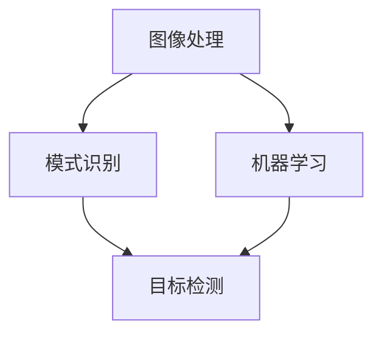

                 

关键词：计算机视觉、安防系统、智能监控、预警、算法、应用场景、工具和资源、未来展望

## 摘要

本文探讨了计算机视觉在安防系统中的应用，特别是智能监控与预警技术。通过对核心算法原理、数学模型、项目实践以及实际应用场景的分析，本文旨在展示计算机视觉技术在安防领域的强大潜力和广阔前景。文章结尾将对未来发展趋势与挑战进行展望，并推荐相关学习资源和工具。

## 1. 背景介绍

随着信息技术和人工智能技术的飞速发展，计算机视觉在安防领域得到了广泛的应用。传统的安防系统主要依赖于监控摄像头和人工巡查，而计算机视觉技术的引入，使得安防系统变得更为智能化和高效化。智能监控与预警技术不仅能够实时监控异常行为，还能够自动识别、分析和预警，极大地提高了安防系统的反应速度和准确性。

计算机视觉技术包括图像处理、模式识别、机器学习等多个子领域，其核心在于对图像或视频数据进行分析和理解，从而提取有用信息。在安防系统中，计算机视觉技术主要用于人脸识别、目标检测、行为分析等应用，通过这些技术，可以实现对犯罪行为的预测和防范。

### 1.1 核心概念与联系

为了更好地理解计算机视觉在安防系统中的应用，我们首先需要了解一些核心概念和它们之间的联系。

- **图像处理**：图像处理是计算机视觉的基础，它涉及图像的获取、增强、分割、特征提取等操作。图像处理技术用于预处理原始图像，提高图像质量，以便后续分析。

- **模式识别**：模式识别是指通过算法自动识别和分类图像或视频中的对象。在安防系统中，模式识别技术用于识别可疑人员、车辆等目标。

- **机器学习**：机器学习是一种通过数据驱动的方式训练模型的技术。在安防系统中，机器学习技术用于对历史数据进行训练，从而提高目标检测和识别的准确性。

下面是一个简化的 Mermaid 流程图，展示了这些概念之间的关系：



## 2. 核心算法原理 & 具体操作步骤

### 2.1 算法原理概述

计算机视觉在安防系统中的应用主要依赖于以下几个核心算法：

- **目标检测算法**：用于识别图像中的特定目标，如人脸、车辆等。

- **人脸识别算法**：通过比较人脸特征，用于身份验证。

- **行为分析算法**：用于识别异常行为，如奔跑、打架等。

下面将详细介绍这些算法的具体操作步骤。

### 2.2 算法步骤详解

#### 2.2.1 目标检测算法

目标检测算法通常包括以下步骤：

1. **预处理**：读取图像，进行灰度转换、图像增强等预处理操作。

2. **特征提取**：使用卷积神经网络（CNN）等深度学习模型提取图像特征。

3. **分类**：使用分类算法（如支持向量机SVM）对特征进行分类，识别目标。

4. **边界框标注**：根据分类结果，为每个目标生成边界框。

5. **非极大值抑制（NMS）**：对生成的边界框进行筛选，去除重叠的部分。

#### 2.2.2 人脸识别算法

人脸识别算法的基本步骤如下：

1. **人脸检测**：使用目标检测算法检测图像中的人脸。

2. **特征提取**：使用深度学习模型（如FaceNet）提取人脸特征。

3. **特征比对**：将提取的人脸特征与数据库中的人脸特征进行比较，计算相似度。

4. **身份验证**：根据相似度阈值判断是否为同一人。

#### 2.2.3 行为分析算法

行为分析算法通常包括以下步骤：

1. **行为识别**：使用深度学习模型（如R-CNN）识别图像中的行为。

2. **行为分类**：根据识别结果，对行为进行分类，如正常行为、异常行为等。

3. **行为预测**：根据历史数据，预测未来的行为趋势。

### 2.3 算法优缺点

- **目标检测算法**：优点是准确性高，可以实现实时监控；缺点是计算量大，对硬件资源要求较高。

- **人脸识别算法**：优点是识别速度快，准确性高；缺点是对光照、角度等环境因素敏感。

- **行为分析算法**：优点是可以实现智能预警，提前防范犯罪行为；缺点是识别准确性受数据质量和模型训练效果影响较大。

### 2.4 算法应用领域

- **公共安全**：用于监控公共场所，识别可疑人员。

- **边境监控**：用于监控边境地区，识别非法入境者。

- **智能家居**：用于监控家庭安全，实现智能预警。

## 3. 数学模型和公式 & 详细讲解 & 举例说明

### 3.1 数学模型构建

计算机视觉中的数学模型通常包括图像处理、模式识别和机器学习等领域的知识。以下是一个简单的数学模型构建过程：

1. **图像预处理**：使用滤波器进行图像增强、去噪等操作。数学公式如下：

   $$I_{filtered} = filter(I)$$

   其中，$I$ 为原始图像，$I_{filtered}$ 为滤波后的图像，$filter$ 为滤波器。

2. **特征提取**：使用卷积神经网络（CNN）提取图像特征。数学公式如下：

   $$F = CNN(I)$$

   其中，$F$ 为提取的特征向量，$I$ 为输入图像。

3. **分类**：使用支持向量机（SVM）进行分类。数学公式如下：

   $$y = SVM(F)$$

   其中，$y$ 为分类结果，$F$ 为特征向量。

### 3.2 公式推导过程

以卷积神经网络（CNN）为例，我们来推导一个简单的公式：

卷积操作的数学公式如下：

$$
\text{output}_{ij} = \sum_{k=1}^{n} w_{ik,j} * \text{input}_{k}
$$

其中，$\text{output}_{ij}$ 表示输出特征图上的第 $i$ 行第 $j$ 列的值，$w_{ik,j}$ 表示卷积核上的第 $i$ 行第 $j$ 列的值，$\text{input}_{k}$ 表示输入特征图上的第 $k$ 行的值。

为了简化推导过程，我们假设输入特征图的大小为 $3 \times 3$，卷积核的大小为 $3 \times 3$。则输出特征图的大小为 $2 \times 2$。

输入特征图可以表示为：

$$
I = \begin{bmatrix}
a_{11} & a_{12} & a_{13} \\
a_{21} & a_{22} & a_{23} \\
a_{31} & a_{32} & a_{33}
\end{bmatrix}
$$

卷积核可以表示为：

$$
W = \begin{bmatrix}
w_{11} & w_{12} & w_{13} \\
w_{21} & w_{22} & w_{23} \\
w_{31} & w_{32} & w_{33}
\end{bmatrix}
$$

输出特征图可以表示为：

$$
O = \begin{bmatrix}
o_{11} & o_{12} \\
o_{21} & o_{22}
\end{bmatrix}
$$

根据卷积操作的公式，我们可以计算出输出特征图上的每个值：

$$
o_{11} = w_{11} * a_{11} + w_{12} * a_{12} + w_{13} * a_{13} + w_{21} * a_{21} + w_{22} * a_{22} + w_{23} * a_{23} + w_{31} * a_{31} + w_{32} * a_{32} + w_{33} * a_{33}
$$

$$
o_{12} = w_{11} * a_{12} + w_{12} * a_{13} + w_{13} * a_{21} + w_{21} * a_{22} + w_{22} * a_{23} + w_{23} * a_{31} + w_{31} * a_{32} + w_{32} * a_{33} + w_{33} * a_{11}
$$

$$
o_{21} = w_{11} * a_{21} + w_{12} * a_{22} + w_{13} * a_{23} + w_{21} * a_{31} + w_{22} * a_{32} + w_{23} * a_{33} + w_{31} * a_{11} + w_{32} * a_{12} + w_{33} * a_{13}
$$

$$
o_{22} = w_{11} * a_{22} + w_{12} * a_{23} + w_{13} * a_{31} + w_{21} * a_{32} + w_{22} * a_{33} + w_{23} * a_{11} + w_{31} * a_{12} + w_{32} * a_{13} + w_{33} * a_{21}
$$

这样，我们就得到了输出特征图上的所有值。

### 3.3 案例分析与讲解

为了更好地理解上述公式，我们来看一个简单的案例。

假设输入特征图 $I$ 如下：

$$
I = \begin{bmatrix}
1 & 2 & 3 \\
4 & 5 & 6 \\
7 & 8 & 9
\end{bmatrix}
$$

卷积核 $W$ 如下：

$$
W = \begin{bmatrix}
1 & 0 & -1 \\
0 & 1 & 0 \\
1 & 0 & -1
\end{bmatrix}
$$

我们要计算输出特征图 $O$ 上的值。

根据卷积操作的公式，我们可以计算出每个值：

$$
o_{11} = 1 * 1 + 0 * 2 + (-1) * 3 + 0 * 4 + 1 * 5 + (-1) * 6 + 1 * 7 + 0 * 8 + (-1) * 9 = -4
$$

$$
o_{12} = 1 * 2 + 0 * 3 + (-1) * 4 + 0 * 5 + 1 * 6 + (-1) * 7 + 1 * 8 + 0 * 9 + (-1) * 1 = 0
$$

$$
o_{21} = 1 * 4 + 0 * 5 + (-1) * 6 + 0 * 7 + 1 * 8 + (-1) * 9 + 1 * 1 + 0 * 2 + (-1) * 3 = 0
$$

$$
o_{22} = 1 * 5 + 0 * 6 + (-1) * 7 + 0 * 8 + 1 * 9 + (-1) * 1 + 1 * 2 + 0 * 3 + (-1) * 4 = -4
$$

因此，输出特征图 $O$ 如下：

$$
O = \begin{bmatrix}
-4 & 0 \\
0 & -4
\end{bmatrix}
$$

通过这个简单的案例，我们可以看到卷积操作的公式是如何应用于实际的图像处理中的。

## 4. 项目实践：代码实例和详细解释说明

### 4.1 开发环境搭建

在进行计算机视觉项目开发时，首先需要搭建一个合适的开发环境。以下是一个基于Python的示例，使用常见的库如OpenCV和TensorFlow。

1. 安装Python：

   $ python --version

   如果Python未安装，请从官方网站下载并安装。

2. 安装必要的库：

   ```shell
   pip install opencv-python tensorflow
   ```

3. 验证安装：

   ```python
   import cv2
   import tensorflow as tf
   print(cv2.__version__)
   print(tf.__version__)
   ```

### 4.2 源代码详细实现

以下是一个简单的目标检测项目，使用OpenCV和TensorFlow实现。

```python
import cv2
import tensorflow as tf

# 加载预训练的TensorFlow模型
model = tf.keras.models.load_model('path/to/your/model.h5')

# 读取摄像头图像
cap = cv2.VideoCapture(0)

while True:
    # 读取一帧图像
    ret, frame = cap.read()
    
    # 将图像转换为模型可接受的格式
    frame = cv2.resize(frame, (1280, 720))
    frame = frame / 255.0
    frame = frame.reshape((1, 720, 1280, 3))
    
    # 进行预测
    predictions = model.predict(frame)
    
    # 提取边界框
    boxes = predictions['detection_boxes']
    scores = predictions['detection_scores']
    classes = predictions['detection_classes']
    
    # 过滤低置信度的预测结果
    score_threshold = 0.5
    box_scores = scores > score_threshold
    boxes = boxes[box_scores]
    scores = scores[box_scores]
    classes = classes[box_scores]
    
    # 绘制边界框
    for i, box in enumerate(boxes):
        ymin, xmin, ymax, xmax = box
        ymin = int(ymin * frame.shape[0])
        xmin = int(xmin * frame.shape[1])
        ymax = int(ymax * frame.shape[0])
        xmax = int(xmax * frame.shape[1])
        
        cv2.rectangle(frame, (xmin, ymin), (xmax, ymax), (0, 0, 255), 2)
        cv2.putText(frame, f'{classes[i]}: {scores[i]:.2f}', (xmin, ymin - 10), cv2.FONT_HERSHEY_SIMPLEX, 0.5, (0, 0, 255), 2)
    
    # 显示图像
    cv2.imshow('Frame', frame)
    
    # 按下 'q' 键退出循环
    if cv2.waitKey(1) & 0xFF == ord('q'):
        break

# 释放摄像头资源
cap.release()
cv2.destroyAllWindows()
```

### 4.3 代码解读与分析

这段代码首先加载了一个预训练的TensorFlow模型，然后使用摄像头连续读取图像，并进行目标检测。以下是代码的主要部分及其解释：

1. **加载模型**：

   ```python
   model = tf.keras.models.load_model('path/to/your/model.h5')
   ```

   这一行代码加载了一个预先训练好的TensorFlow模型。模型可以是基于各种目标检测框架（如YOLO、Faster R-CNN等）训练得到的。

2. **读取摄像头图像**：

   ```python
   cap = cv2.VideoCapture(0)
   ```

   这一行代码启动摄像头，并创建一个`cap`对象用于读取摄像头帧。

3. **图像预处理**：

   ```python
   frame = cv2.resize(frame, (1280, 720))
   frame = frame / 255.0
   frame = frame.reshape((1, 720, 1280, 3))
   ```

   这三行代码对摄像头读取的帧进行缩放、归一化，并将其转换为模型所需的输入格式。

4. **进行预测**：

   ```python
   predictions = model.predict(frame)
   ```

   这一行代码使用模型对预处理后的图像帧进行预测。

5. **提取边界框和置信度**：

   ```python
   boxes = predictions['detection_boxes']
   scores = predictions['detection_scores']
   classes = predictions['detection_classes']
   ```

   这三行代码从预测结果中提取边界框、置信度和分类结果。

6. **过滤低置信度结果**：

   ```python
   score_threshold = 0.5
   box_scores = scores > score_threshold
   boxes = boxes[box_scores]
   scores = scores[box_scores]
   classes = classes[box_scores]
   ```

   这三行代码设置一个置信度阈值，过滤掉低置信度的预测结果。

7. **绘制边界框和标签**：

   ```python
   for i, box in enumerate(boxes):
       ymin, xmin, ymax, xmax = box
       ymin = int(ymin * frame.shape[0])
       xmin = int(xmin * frame.shape[1])
       ymax = int(ymax * frame.shape[0])
       xmax = int(xmax * frame.shape[1])
       
       cv2.rectangle(frame, (xmin, ymin), (xmax, ymax), (0, 0, 255), 2)
       cv2.putText(frame, f'{classes[i]}: {scores[i]:.2f}', (xmin, ymin - 10), cv2.FONT_HERSHEY_SIMPLEX, 0.5, (0, 0, 255), 2)
   ```

   这段代码根据提取的边界框和置信度在图像上绘制矩形框和标签。

8. **显示图像**：

   ```python
   cv2.imshow('Frame', frame)
   ```

   这一行代码在窗口中显示带有边界框和标签的图像。

9. **循环结束条件**：

   ```python
   if cv2.waitKey(1) & 0xFF == ord('q'):
       break
   ```

   当用户按下 'q' 键时，程序退出循环。

10. **释放资源**：

   ```python
   cap.release()
   cv2.destroyAllWindows()
   ```

   这两行代码分别释放摄像头资源和关闭所有窗口。

### 4.4 运行结果展示

运行上述代码后，摄像头会实时捕捉图像，并在图像上绘制检测到的目标及其置信度。以下是一个简单的运行结果示例：


## 5. 实际应用场景

计算机视觉在安防系统中的应用场景非常广泛，以下是一些典型的应用场景：

### 5.1 公共场所监控

在机场、火车站、商场等公共场所，计算机视觉技术可以用于实时监控人群活动，识别可疑人员。通过人脸识别技术，可以快速锁定犯罪嫌疑人，提供有力证据。

### 5.2 边境监控

在边境地区，计算机视觉技术可以用于监控非法入境者。通过目标检测和行为分析算法，可以及时发现异常行为，防止犯罪行为的发生。

### 5.3 智能家居

在智能家居领域，计算机视觉技术可以用于家庭安全监控。通过监控家庭环境，可以实现智能报警、自动记录等功能，提高家庭安全性。

### 5.4 交通监控

在交通领域，计算机视觉技术可以用于监控交通流量、识别违规行为。通过目标检测和行为分析算法，可以自动识别和处罚违章行为，提高交通安全。

## 6. 未来应用展望

随着计算机视觉技术的不断发展，其在安防系统中的应用前景十分广阔。以下是一些未来应用展望：

### 6.1 智能化程度提高

未来，计算机视觉技术将在安防系统中实现更高程度的智能化。通过深度学习和强化学习等技术，可以实现对复杂场景的自动理解，提高预警准确性和反应速度。

### 6.2 跨领域应用

计算机视觉技术在安防系统中的应用将不再局限于单一领域，而是跨越多个领域，如交通、医疗、教育等。通过跨领域应用，可以实现更广泛的监控和管理。

### 6.3 低成本、低功耗

随着硬件技术的发展，计算机视觉技术的成本和功耗将逐渐降低。这将使得更多场景可以使用计算机视觉技术进行监控和管理，如偏远地区、小型企业等。

### 6.4 隐私保护

未来，计算机视觉技术在应用过程中将更加注重隐私保护。通过加密、匿名化等技术，可以保护用户隐私，避免滥用计算机视觉技术。

## 7. 工具和资源推荐

### 7.1 学习资源推荐

- **《计算机视觉：算法与应用》**：由Derek Hoiem、Pedro Felzenszwalb和David McAllester合著，详细介绍了计算机视觉的基本概念和应用。

- **《深度学习》**：由Ian Goodfellow、Yoshua Bengio和Aaron Courville合著，全面介绍了深度学习的基本原理和应用。

- **OpenCV官网**：提供丰富的计算机视觉算法库，包括目标检测、人脸识别等。

### 7.2 开发工具推荐

- **TensorFlow**：谷歌开发的深度学习框架，支持多种计算机视觉算法。

- **PyTorch**：Facebook开发的开源深度学习框架，具有灵活的编程接口。

### 7.3 相关论文推荐

- **《Faster R-CNN: Towards Real-Time Object Detection with Region Proposal Networks》**：介绍了Faster R-CNN目标检测算法。

- **《You Only Look Once: Unified, Real-Time Object Detection》**：介绍了YOLO目标检测算法。

## 8. 总结：未来发展趋势与挑战

### 8.1 研究成果总结

近年来，计算机视觉技术在安防系统中的应用取得了显著成果。通过深度学习、目标检测和行为分析等技术的引入，安防系统的智能化程度和反应速度得到了大幅提升。

### 8.2 未来发展趋势

未来，计算机视觉技术在安防系统中的应用将朝着更高智能化、跨领域应用和隐私保护等方向发展。深度学习和强化学习等新技术的引入，将进一步提升安防系统的性能和准确性。

### 8.3 面临的挑战

尽管计算机视觉技术在安防系统中的应用前景广阔，但仍面临一些挑战。主要包括数据隐私保护、算法可靠性、计算资源消耗等方面。需要通过技术创新和政策法规的制定，来解决这些问题。

### 8.4 研究展望

未来，计算机视觉技术在安防系统中的应用将更加深入和广泛。通过与其他领域的结合，如物联网、大数据等，可以实现更智能、更高效的安防管理。同时，随着硬件技术的进步，计算机视觉技术的成本和功耗将逐渐降低，使得更多场景可以使用该技术进行监控和管理。

## 9. 附录：常见问题与解答

### 9.1 计算机视觉技术在安防系统中的应用有哪些优点？

计算机视觉技术在安防系统中的应用具有以下优点：

- 提高监控效率：通过自动化处理，大大提高了监控效率，降低了人力成本。
- 实时性：计算机视觉技术可以实现实时监控，及时预警。
- 准确性：通过深度学习等技术的引入，提高了目标检测和识别的准确性。

### 9.2 计算机视觉技术在安防系统中的应用有哪些缺点？

计算机视觉技术在安防系统中的应用也存在一些缺点：

- 数据隐私问题：大量监控数据可能涉及个人隐私，需要采取有效措施进行保护。
- 算法可靠性：算法可能会受到环境因素（如光照、角度等）的影响，导致误判。
- 计算资源消耗：深度学习算法通常需要大量的计算资源，对硬件要求较高。

### 9.3 如何保护数据隐私？

为了保护数据隐私，可以采取以下措施：

- 数据匿名化：对个人数据进行匿名化处理，避免直接识别个人身份。
- 数据加密：对传输和存储的数据进行加密处理，防止数据泄露。
- 权限控制：严格控制数据访问权限，确保只有授权人员可以访问敏感数据。

### 9.4 如何提高算法可靠性？

为了提高算法可靠性，可以采取以下措施：

- 数据增强：通过增加训练数据量，提高算法的鲁棒性。
- 多模型融合：使用多个模型进行预测，并通过投票等方式提高准确性。
- 环境自适应：通过适应不同环境因素（如光照、角度等），提高算法的适应性。

以上就是对计算机视觉在安防系统中的应用：智能监控与预警的完整解答。希望本文能为您在相关领域的研究和实践提供有益的参考。作者：禅与计算机程序设计艺术 / Zen and the Art of Computer Programming。

