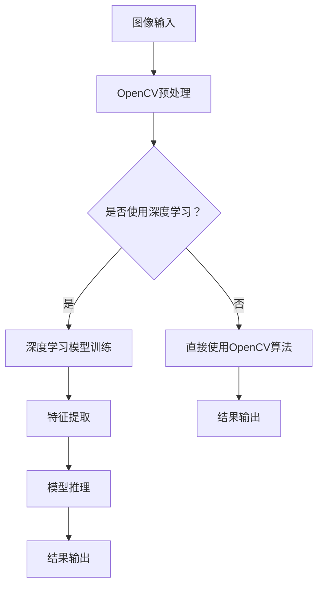

                 

关键词：计算机视觉，OpenCV，深度学习，图像处理，算法实现，实践应用，未来展望

摘要：本文旨在探讨计算机视觉领域中的重要技术——OpenCV与深度学习的结合。我们将深入了解这两种技术的背景、核心概念以及它们的互动关系。本文还将详细阐述核心算法原理、数学模型和公式，并通过项目实践和实际应用场景来展示它们的具体应用。最后，我们将展望未来发展趋势与面临的挑战，并提供相关的学习资源和工具推荐。

## 1. 背景介绍

计算机视觉是一门研究如何使计算机能够像人一样识别和理解图像的学科。它涉及图像处理、计算机视觉算法、机器学习等多个领域。随着人工智能技术的发展，计算机视觉在众多行业中得到了广泛应用，如自动驾驶、人脸识别、医疗图像分析等。

OpenCV（Open Source Computer Vision Library）是一个开源的计算机视觉库，它提供了丰富的图像处理和计算机视觉算法。它支持多种编程语言，如C++、Python、Java等，使得开发者可以轻松地实现复杂的视觉任务。

深度学习是一种基于神经网络的学习方法，它在图像识别、语音识别、自然语言处理等领域取得了显著的成果。深度学习模型通常由多个层级组成，通过逐层提取特征来学习数据的内在结构。

## 2. 核心概念与联系

为了更好地理解OpenCV与深度学习的结合，我们需要先了解它们的核心概念和架构。

### 2.1 OpenCV核心概念

OpenCV主要包括以下几个核心概念：

- **图像处理**：图像滤波、边缘检测、形态学操作等。
- **特征检测**：SIFT、SURF、Harris角点检测等。
- **目标跟踪**：光流、背景减除、粒子滤波等。
- **机器学习**：K近邻、支持向量机、随机森林等。

### 2.2 深度学习核心概念

深度学习主要包括以下几个核心概念：

- **神经网络**：前向传播、反向传播、激活函数等。
- **卷积神经网络（CNN）**：卷积层、池化层、全连接层等。
- **递归神经网络（RNN）**：循环层、长短时记忆（LSTM）等。

### 2.3 OpenCV与深度学习的关系

OpenCV与深度学习之间的关系可以看作是工具与算法的结合。深度学习算法通常需要大量的数据来进行训练，而OpenCV提供了强大的图像处理和特征提取功能，可以帮助我们更好地准备这些数据。同时，深度学习模型可以通过OpenCV进行部署和优化，以提高其性能和实时性。

### 2.4 Mermaid 流程图

以下是OpenCV与深度学习结合的Mermaid流程图：



## 3. 核心算法原理 & 具体操作步骤

### 3.1 算法原理概述

深度学习算法的核心在于通过多层神经网络来提取图像特征，从而实现图像分类、目标检测等任务。OpenCV则提供了丰富的图像处理和特征提取工具，可以帮助我们优化深度学习模型的性能。

### 3.2 算法步骤详解

- **数据预处理**：使用OpenCV对图像进行缩放、裁剪、旋转等操作，以增强数据多样性。
- **特征提取**：使用OpenCV中的SIFT、SURF等算法提取图像特征。
- **模型训练**：使用提取的特征和深度学习框架（如TensorFlow、PyTorch）来训练模型。
- **模型推理**：使用训练好的模型对新的图像进行分类或目标检测。
- **结果输出**：将模型推理结果通过OpenCV进行可视化展示。

### 3.3 算法优缺点

- **优点**：结合了OpenCV的图像处理优势和深度学习的高效性，可以实现更准确和高效的图像识别。
- **缺点**：训练过程可能需要大量的计算资源和时间，且需要对深度学习和图像处理都有深入的了解。

### 3.4 算法应用领域

深度学习与OpenCV的结合在多个领域都有广泛应用，如：

- **自动驾驶**：通过深度学习进行目标检测和场景理解，结合OpenCV进行实时图像处理。
- **人脸识别**：使用深度学习进行人脸特征提取，结合OpenCV进行人脸检测和跟踪。
- **医疗图像分析**：使用深度学习进行病变区域的检测和分类，结合OpenCV进行图像增强和预处理。

## 4. 数学模型和公式 & 详细讲解 & 举例说明

### 4.1 数学模型构建

深度学习中的数学模型主要涉及神经网络和卷积神经网络。以下是神经网络的基本公式：

$$
\begin{aligned}
    Z &= W \cdot X + b \\
    A &= \sigma(Z)
\end{aligned}
$$

其中，\(Z\) 表示网络的输入，\(W\) 表示权重，\(b\) 表示偏置，\(A\) 表示网络的输出，\(\sigma\) 表示激活函数。

### 4.2 公式推导过程

卷积神经网络的推导过程较为复杂，涉及到卷积操作、池化操作、反向传播等。以下是卷积操作的推导：

$$
\begin{aligned}
    (f \star g)(x) &= \int_{-\infty}^{+\infty} f(y)g(x-y)dy \\
    &= \int_{-\infty}^{+\infty} f(y)g(y)dy \\
    &= \int_{-\infty}^{+\infty} f(y) \cdot \sum_{i=-\infty}^{+\infty} g(y-i)dy \\
    &= \sum_{i=-\infty}^{+\infty} \int_{-\infty}^{+\infty} f(y)g(y-i)dy
\end{aligned}
$$

### 4.3 案例分析与讲解

以图像分类任务为例，假设我们有一个二分类问题，使用卷积神经网络进行模型训练。以下是具体的案例分析和讲解：

1. **数据集准备**：使用OpenCV读取图像数据，并进行预处理，如归一化、缩放等。
2. **模型构建**：使用TensorFlow或PyTorch构建卷积神经网络模型，包括卷积层、池化层、全连接层等。
3. **模型训练**：使用预处理后的图像数据对模型进行训练，通过反向传播更新模型参数。
4. **模型评估**：使用验证集对模型进行评估，计算准确率、召回率等指标。
5. **模型部署**：将训练好的模型部署到OpenCV中，进行实时图像分类。

## 5. 项目实践：代码实例和详细解释说明

### 5.1 开发环境搭建

在开始项目实践之前，我们需要搭建一个合适的开发环境。以下是具体的步骤：

1. **安装Python**：下载并安装Python 3.x版本。
2. **安装OpenCV**：使用pip命令安装OpenCV库。
3. **安装深度学习框架**：例如，安装TensorFlow或PyTorch。
4. **配置开发环境**：配置Python环境变量，确保各个库可以正常使用。

### 5.2 源代码详细实现

以下是使用OpenCV和深度学习框架进行图像分类的示例代码：

```python
import cv2
import tensorflow as tf

# 加载预训练的深度学习模型
model = tf.keras.models.load_model('model.h5')

# 读取图像数据
image = cv2.imread('image.jpg')

# 对图像进行预处理
processed_image = preprocess_image(image)

# 使用深度学习模型进行分类
prediction = model.predict(processed_image)

# 输出分类结果
print(prediction)

# 使用OpenCV进行图像可视化
cv2.imshow('image', image)
cv2.waitKey(0)
cv2.destroyAllWindows()
```

### 5.3 代码解读与分析

以上代码首先加载了一个预训练的深度学习模型，然后读取一张图像并进行预处理，最后使用模型进行分类并输出结果。代码中涉及的主要步骤如下：

- **图像读取**：使用OpenCV的`imread`函数读取图像。
- **图像预处理**：根据深度学习模型的要求对图像进行缩放、归一化等处理。
- **模型加载**：使用TensorFlow的`load_model`函数加载预训练模型。
- **模型预测**：使用模型对预处理后的图像进行分类预测。
- **图像可视化**：使用OpenCV的`imshow`函数将分类结果可视化展示。

### 5.4 运行结果展示

运行以上代码后，我们会在控制台输出分类结果，并在图像窗口中展示原始图像和分类结果。具体结果取决于图像内容和深度学习模型的准确性。

## 6. 实际应用场景

深度学习与OpenCV的结合在实际应用中具有广泛的应用场景。以下是几个典型的应用案例：

1. **自动驾驶**：通过深度学习进行目标检测和场景理解，结合OpenCV进行实时图像处理，实现自动驾驶功能。
2. **人脸识别**：使用深度学习进行人脸特征提取，结合OpenCV进行人脸检测和跟踪，实现人脸识别系统。
3. **医疗图像分析**：使用深度学习进行病变区域的检测和分类，结合OpenCV进行图像增强和预处理，帮助医生进行诊断。
4. **工业检测**：使用深度学习进行缺陷检测和分类，结合OpenCV进行图像处理和识别，提高生产效率。

## 7. 工具和资源推荐

为了更好地学习和实践深度学习与OpenCV的结合，我们推荐以下工具和资源：

### 7.1 学习资源推荐

- **《深度学习》（Goodfellow, Bengio, Courville著）**：深度学习的基础教材，适合初学者。
- **《计算机视觉：算法与应用》（Richard S.zelinski著）**：计算机视觉的全面介绍，包括OpenCV和深度学习。
- **《OpenCV官方文档》**：OpenCV的官方文档，包含详细的API和使用示例。
- **《TensorFlow官方文档》**：TensorFlow的官方文档，包含深度学习模型的构建和训练方法。

### 7.2 开发工具推荐

- **Visual Studio Code**：一款功能强大的代码编辑器，支持Python、C++等多种编程语言。
- **PyCharm**：一款专业的Python开发工具，支持多种深度学习框架。
- **Jupyter Notebook**：一款交互式的计算环境，适合进行实验和文档编写。

### 7.3 相关论文推荐

- **"Deep Learning for Computer Vision: A Comprehensive Review"**：一篇关于深度学习在计算机视觉领域的综述论文。
- **"Learning Representations for Visual Recognition"**：一篇关于深度学习模型在图像识别任务的论文。
- **"OpenCV 4.x Handbook"**：一篇关于OpenCV 4.x版本的详细使用手册。

## 8. 总结：未来发展趋势与挑战

深度学习与OpenCV的结合在计算机视觉领域具有巨大的潜力。随着技术的不断发展，我们可以预见以下发展趋势和挑战：

### 8.1 研究成果总结

- **算法性能提升**：通过不断优化深度学习模型和图像处理算法，我们可以实现更高的准确率和效率。
- **多模态数据融合**：将深度学习与音频、视频等多模态数据进行融合，实现更全面的图像理解。
- **实时性提升**：通过优化模型结构和算法实现，提高深度学习模型在实时应用中的性能。

### 8.2 未来发展趋势

- **自动驾驶技术**：深度学习与OpenCV的结合将推动自动驾驶技术的发展，实现更安全、更智能的自动驾驶系统。
- **医疗诊断辅助**：深度学习与OpenCV的结合将提高医疗诊断的准确性和效率，助力医疗领域的进步。
- **工业检测优化**：通过深度学习和图像处理技术的结合，实现更高效、更精确的工业检测。

### 8.3 面临的挑战

- **数据隐私与安全**：随着深度学习和图像处理技术的广泛应用，数据隐私和安全成为重要的挑战。
- **算法可解释性**：深度学习模型通常被视为“黑箱”，提高算法的可解释性是一个重要的研究方向。
- **计算资源消耗**：深度学习模型的训练和推理需要大量的计算资源，如何在有限的资源下实现高效的计算是一个挑战。

### 8.4 研究展望

未来，深度学习与OpenCV的结合将继续在计算机视觉领域发挥重要作用。我们期待看到更多创新性的应用场景和突破性的研究成果，为人类社会带来更多的便利和进步。

## 9. 附录：常见问题与解答

### 9.1 如何选择深度学习框架？

选择深度学习框架主要取决于项目需求和个人熟悉程度。以下是几个常用的深度学习框架：

- **TensorFlow**：适合大规模分布式计算，具有丰富的API和工具。
- **PyTorch**：具有简洁的API和动态计算图，适合快速原型开发和实验。
- **Keras**：基于TensorFlow和Theano的简单易用的深度学习框架。

### 9.2 如何优化深度学习模型？

优化深度学习模型可以从以下几个方面进行：

- **数据增强**：通过缩放、旋转、翻转等操作增加数据的多样性，提高模型的泛化能力。
- **模型剪枝**：通过减少模型参数数量来降低计算复杂度和模型大小。
- **混合精度训练**：使用混合精度训练来提高计算速度和降低内存消耗。

### 9.3 如何部署深度学习模型？

部署深度学习模型通常有以下几种方法：

- **服务器部署**：将训练好的模型部署到服务器上，通过API进行调用。
- **边缘设备部署**：将模型部署到边缘设备（如智能手机、机器人等），实现实时推理。
- **集成到现有系统**：将模型集成到现有的软件系统中，实现自动化功能。

---

本文从背景介绍、核心概念、算法原理、数学模型、项目实践、实际应用场景、工具推荐、总结展望和常见问题与解答等多个方面详细探讨了计算机视觉领域中的重要技术——OpenCV与深度学习的结合。希望本文能够为读者提供有价值的参考和启示，助力大家在计算机视觉领域取得更好的成果。作者：禅与计算机程序设计艺术 / Zen and the Art of Computer Programming。

