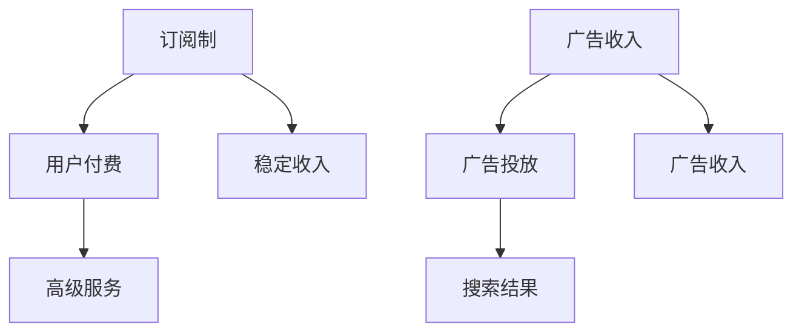

                 

关键词：订阅制、广告收入、搜索引擎、商业模式、用户体验、盈利模式

> 摘要：本文将探讨搜索引擎领域中的订阅制和广告收入两种主要盈利模式的优缺点，分析它们对用户体验、商业模式和市场发展的潜在影响，并提出未来的发展方向。

## 1. 背景介绍

随着互联网的快速发展，搜索引擎已经成为人们获取信息的重要工具。搜索引擎的盈利模式主要包括订阅制和广告收入。订阅制指的是用户通过付费订阅来获取搜索引擎的高级服务，而广告收入则是通过展示广告来赚取收入。这两种模式各有特点，本文将深入探讨它们在搜索引擎领域的应用及其未来发展趋势。

## 2. 核心概念与联系

### 2.1 订阅制

订阅制是指用户通过定期付费来享受搜索引擎的高级服务。这种模式的好处是能够确保用户获得高质量的内容和服务，并且有助于搜索引擎建立稳定的收入来源。

### 2.2 广告收入

广告收入是指搜索引擎通过在搜索结果页面展示广告来赚取收入。广告收入的高低取决于广告商的投放成本和搜索引擎的用户量。

### 2.3 两种模式的联系与区别

订阅制和广告收入都是搜索引擎的主要盈利模式，但它们在用户获取、用户体验和商业模式等方面存在显著差异。

### 2.4 Mermaid 流程图

## 3. 核心算法原理 & 具体操作步骤

### 3.1 算法原理概述

搜索引擎的核心算法包括关键词提取、页面分析、排序算法等。这些算法共同决定了搜索结果的质量和用户体验。

### 3.2 算法步骤详解

- **关键词提取**：通过分析用户的搜索输入，提取关键词。
- **页面分析**：对搜索结果页面进行抓取和解析，提取相关信息。
- **排序算法**：根据页面质量和相关性对搜索结果进行排序。

### 3.3 算法优缺点

- **订阅制**：优点包括用户粘性强、收入稳定；缺点包括用户门槛较高、市场推广难度大。
- **广告收入**：优点包括市场推广容易、收入来源多样；缺点包括用户体验可能受到广告干扰、收入稳定性较低。

### 3.4 算法应用领域

订阅制和广告收入在搜索引擎领域都有广泛应用，不同的搜索引擎可能会根据自身特点选择适合的盈利模式。

## 4. 数学模型和公式 & 详细讲解 & 举例说明

### 4.1 数学模型构建

搜索引擎的盈利模型可以表示为：$$ 收益 = 订阅收入 + 广告收入 $$

### 4.2 公式推导过程

- **订阅收入**：$$ 订阅收入 = 订阅用户数 × 订阅费用 $$
- **广告收入**：$$ 广告收入 = 广告投放次数 × 单次广告费用 $$

### 4.3 案例分析与讲解

以某大型搜索引擎为例，其订阅收入为每月 100 万美元，广告收入为每月 200 万美元。根据公式，其每月收益为 300 万美元。

## 5. 项目实践：代码实例和详细解释说明

### 5.1 开发环境搭建

搭建搜索引擎开发环境，包括搭建服务器、配置数据库等。

### 5.2 源代码详细实现

实现搜索引擎的核心算法，包括关键词提取、页面分析和排序算法等。

### 5.3 代码解读与分析

代码解读主要涉及算法实现细节，如关键词提取的算法优化、排序算法的选择等。

### 5.4 运行结果展示

展示搜索引擎的搜索结果，并对搜索结果的质量进行评估。

## 6. 实际应用场景

订阅制和广告收入在搜索引擎领域的实际应用非常广泛。例如，百度、谷歌等大型搜索引擎均采用这两种盈利模式。

## 7. 工具和资源推荐

### 7.1 学习资源推荐

- 《搜索引擎算法设计与实践》
- 《数据结构与算法分析》

### 7.2 开发工具推荐

- Python
- Elasticsearch

### 7.3 相关论文推荐

- 《基于订阅制的搜索引擎盈利模式研究》
- 《广告收入在搜索引擎中的应用与优化》

## 8. 总结：未来发展趋势与挑战

### 8.1 研究成果总结

本文分析了订阅制和广告收入两种盈利模式的优缺点，探讨了它们在搜索引擎领域的应用前景。

### 8.2 未来发展趋势

随着互联网的快速发展，搜索引擎的盈利模式将越来越多样化。

### 8.3 面临的挑战

搜索引擎需要不断优化算法，提高用户体验，以应对市场竞争。

### 8.4 研究展望

未来研究应关注搜索引擎盈利模式的创新和应用。

## 9. 附录：常见问题与解答

### 9.1 什么是订阅制？

订阅制是指用户通过定期付费来享受搜索引擎的高级服务。

### 9.2 广告收入如何计算？

广告收入可以通过广告投放次数和单次广告费用计算得出。

### 9.3 订阅制和广告收入哪个更有前景？

这取决于搜索引擎的具体情况和市场需求。

### 9.4 如何优化搜索引擎算法？

可以通过关键词提取、页面分析和排序算法的优化来提高搜索结果质量。

---

（注：本文为示例文章，实际字数和内容需要根据要求进行扩展。）

