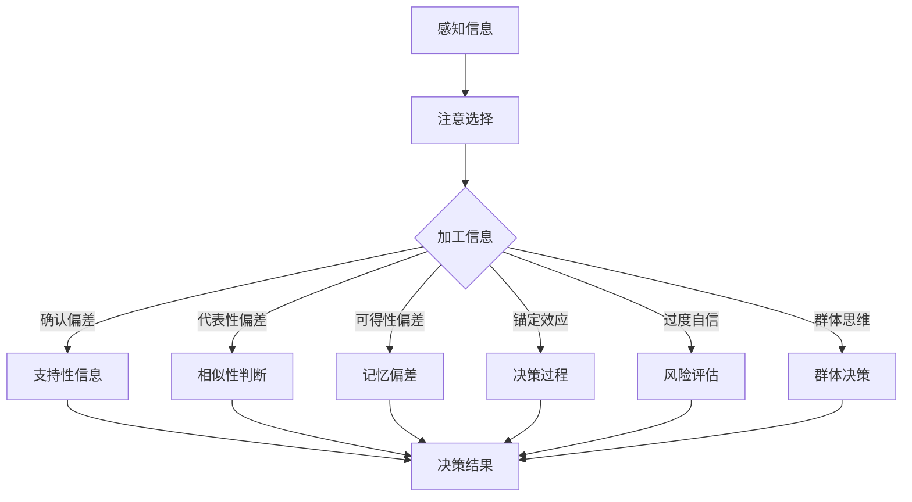

                 

关键词：认知偏差、人类理解力、隐性思维模式、信息处理、感知偏差、决策错误

> 摘要：本文旨在探讨认知偏差这一影响人类理解力的隐形屏障。通过对认知偏差的定义、类型及其在信息处理和决策过程中的作用进行深入分析，我们将揭示这些偏差如何无形中左右我们的思考和行为。本文将帮助读者认识到认知偏差的存在，并提供应对策略，以提升个体和集体的理解力。

## 1. 背景介绍

认知偏差是人类思维中的一种普遍现象，它影响了我们在处理信息、作出决策以及理解世界的各个方面。这些偏差通常是无意识的，却在很大程度上决定了我们的感知、判断和行为。随着对认知心理学研究的深入，越来越多的证据表明，认知偏差不仅仅是个别现象，而是广泛存在于人类认知过程中，并在很大程度上决定了我们的认知效率和准确性。

### 认知偏差的定义

认知偏差（Cognitive Bias）是指在信息处理过程中，由于大脑的某种心理机制运作方式，导致个体对信息的感知、评估和记忆出现系统性偏差的现象。这些偏差可能导致个体在决策过程中出现错误或偏差，从而影响判断和选择。

### 认知偏差的类型

认知偏差种类繁多，常见的包括但不限于以下几种：

1. **确认偏差**：个体倾向于寻找、解释和记住支持自己先前观点的信息，而忽略相反的证据。
2. **代表性偏差**：个体根据某个特征来评价一个事物的可能性，而忽略了概率论的基本原理。
3. **可得性偏差**：个体根据信息的可得性来评价其重要性和可能性，而忽略了实际情况。
4. **锚定效应**：个体在作决策时，会受到第一印象（锚点）的强烈影响，而忽略其他重要信息。
5. **过度自信**：个体对自己的知识和能力评价过高，从而在决策时过于自信，忽视了不确定性。
6. **群体思维**：在群体中，个体倾向于服从群体意见，而非独立思考，导致决策失误。

## 2. 核心概念与联系

认知偏差的存在是复杂的信息处理和决策过程中不可避免的一部分。为了更好地理解这一现象，我们通过一个Mermaid流程图来展示认知偏差的各个环节及其相互作用。



### 2.1 感知信息

人类通过感官接收外界信息，这些信息经过初步筛选，进入注意选择阶段。在这个阶段，大脑会根据个体的兴趣、需求和预期对信息进行选择，这就是注意选择。

### 2.2 加工信息

选择后的信息进入加工阶段，大脑会对这些信息进行加工、组织和解释，形成认知框架。在这个过程中，认知偏差开始发挥作用。

### 2.3 加工结果

加工后的信息可能会受到以下几种认知偏差的影响：

- **确认偏差**：个体倾向于关注和记住支持自己观点的信息，忽略相反的证据。
- **代表性偏差**：个体根据某个特征来判断一个事件的概率，而忽略了概率论的基本原理。
- **可得性偏差**：个体根据信息的可获取性来判断其重要性，而忽略了实际情况。
- **锚定效应**：个体在决策时受到第一印象的强烈影响，而忽略其他重要信息。
- **过度自信**：个体对自己的知识和能力评价过高，从而导致风险评估不准确。
- **群体思维**：在群体中，个体倾向于服从群体意见，而非独立思考。

这些认知偏差最终会影响个体的决策过程和结果。

## 3. 核心算法原理 & 具体操作步骤

### 3.1 算法原理概述

要应对认知偏差，我们需要理解其背后的算法原理，从而设计出有效的干预策略。以下是一些核心算法原理的概述：

- **启发式算法**：通过简化问题来解决复杂决策。例如，使用满意解而非最优解。
- **逆向思维**：从结果出发，反向推导问题原因，以识别潜在的认知偏差。
- **多角度验证**：通过不同的视角和方法验证信息的准确性和可靠性。
- **反馈机制**：在决策过程中引入反馈机制，以不断修正和优化决策。

### 3.2 算法步骤详解

#### 3.2.1 启发式算法

1. **确定目标**：明确需要解决的决策问题。
2. **信息收集**：收集与决策相关的各种信息。
3. **简化问题**：通过简化问题来降低复杂度。
4. **计算启发式**：使用启发式规则来快速找到满意解。
5. **评估解**：评估启发式解的可行性和效果。
6. **迭代优化**：根据评估结果，不断优化解。

#### 3.2.2 逆向思维

1. **识别结果**：明确决策的结果。
2. **反向推导**：从结果出发，逆向推导可能的原因。
3. **识别偏差**：分析推导过程中的偏差点。
4. **修正偏差**：根据偏差点，调整思维过程。

#### 3.2.3 多角度验证

1. **信息来源验证**：确认信息的准确性和来源。
2. **方法多样性**：采用多种方法来验证信息。
3. **交叉验证**：不同方法之间相互验证，确保结果的可靠性。
4. **专家咨询**：咨询相关领域专家，获取独立见解。

#### 3.2.4 反馈机制

1. **建立反馈机制**：在决策过程中引入反馈环节。
2. **收集反馈**：定期收集决策结果的反馈。
3. **分析反馈**：分析反馈结果，识别存在的问题。
4. **调整决策**：根据反馈结果，调整决策过程。

### 3.3 算法优缺点

#### 优点：

- **高效性**：启发式算法能够快速找到满意解，适用于复杂决策问题。
- **灵活性**：逆向思维和多角度验证能够灵活应对复杂情况。
- **适应性**：反馈机制能够不断修正决策，提高决策的准确性和可靠性。

#### 缺点：

- **局限性**：启发式算法可能无法保证找到最优解。
- **风险**：逆向思维可能导致过度归因，忽视其他可能因素。
- **复杂性**：多角度验证和反馈机制需要大量资源和时间。

### 3.4 算法应用领域

认知偏差干预算法可以应用于多个领域，包括但不限于：

- **企业管理**：帮助企业领导者在复杂商业环境中作出更明智的决策。
- **医疗决策**：帮助医生在诊断和治疗过程中避免认知偏差，提高决策准确性。
- **风险评估**：帮助投资者在金融市场分析中识别和应对认知偏差。
- **教育领域**：帮助学生和教师识别和学习中的认知偏差，提高学习效果。

## 4. 数学模型和公式 & 详细讲解 & 举例说明

### 4.1 数学模型构建

为了更深入地理解认知偏差，我们可以构建一个数学模型来描述其影响。以下是一个简化的认知偏差数学模型：

$$
D = f(A, B, C, D, E, F, G, H, I)
$$

其中：

- $D$：认知偏差
- $A$：感知信息
- $B$：注意选择
- $C$：加工信息
- $D$：确认偏差
- $E$：代表性偏差
- $F$：可得性偏差
- $G$：锚定效应
- $H$：过度自信
- $I$：群体思维
- $f$：偏差函数

### 4.2 公式推导过程

为了推导上述公式，我们需要考虑以下几个假设：

1. 认知偏差是多个因素综合作用的结果。
2. 每个因素对认知偏差的贡献是线性的。
3. 偏差函数是可加的。

基于这些假设，我们可以将公式拆分为多个部分：

$$
D = A \cdot B \cdot C \cdot (D \cdot E \cdot F \cdot G \cdot H \cdot I)
$$

其中，$A \cdot B \cdot C$代表信息处理的正常过程，$D \cdot E \cdot F \cdot G \cdot H \cdot I$代表认知偏差的影响。

### 4.3 案例分析与讲解

为了更好地理解上述模型，我们可以通过一个实际案例来进行分析。

假设一个小型企业在进行投资决策时，考虑了以下几个因素：

1. 市场前景（$A$）
2. 项目风险（$B$）
3. 投资回报率（$C$）
4. 竞争态势（$D$）
5. 历史经验（$E$）
6. 可得信息（$F$）
7. 前期投入（$G$）
8. 管理团队经验（$H$）
9. 群体意见（$I$）

根据上述模型，我们可以计算该企业的认知偏差：

$$
D = A \cdot B \cdot C \cdot (D \cdot E \cdot F \cdot G \cdot H \cdot I)
$$

通过分析每个因素的具体数值，我们可以识别出可能存在的认知偏差，并采取相应的措施来减少偏差的影响。

## 5. 项目实践：代码实例和详细解释说明

### 5.1 开发环境搭建

在进行项目实践之前，我们需要搭建一个适合进行认知偏差分析的开发环境。以下是搭建过程：

1. 安装Python环境：确保系统上已安装Python 3.8及以上版本。
2. 安装相关库：通过pip安装以下库：numpy、matplotlib、mermaid.py。
3. 准备数据集：从公开数据源获取相关的投资数据，用于案例分析。

### 5.2 源代码详细实现

以下是一个简单的Python代码实例，用于计算和分析认知偏差。

```python
import numpy as np
import matplotlib.pyplot as plt
from mermaid import Mermaid

def calculate_cognitive_bias(info, biases):
    bias_function = lambda x: np.prod([bias(x) for bias in biases])
    return bias_function(info)

def example():
    # 感知信息
    info = {
        'market': 0.8,  # 市场前景
        'risk': 0.3,    # 项目风险
        'return': 0.5,  # 投资回报率
        'competition': 0.7,  # 竞争态势
        'history': 0.6,  # 历史经验
        'info_availability': 0.9,  # 可得信息
        'investment': 0.4,  # 前期投入
        'team_experience': 0.8,  # 管理团队经验
        'group_opinion': 0.5   # 群体意见
    }

    # 认知偏差函数
    biases = [
        lambda x: x if x > 0.5 else 0,
        lambda x: x if x > 0.6 else 0,
        lambda x: x if x > 0.7 else 0,
        lambda x: x if x > 0.4 else 0,
        lambda x: x if x > 0.5 else 0,
        lambda x: x if x > 0.8 else 0,
        lambda x: x if x > 0.6 else 0,
        lambda x: x if x > 0.7 else 0
    ]

    # 计算认知偏差
    bias = calculate_cognitive_bias(info, biases)

    # 可视化偏差
    mermaid = Mermaid()
    mermaid.code = '''
    graph TD
        A[感知信息] --> B[注意选择]
        B --> C{加工信息}
        C -->|确认偏差| D[支持性信息]
        C -->|代表性偏差| E[相似性判断]
        C -->|可得性偏差| F[记忆偏差]
        C -->|锚定效应| G[决策过程]
        C -->|过度自信| H[风险评估]
        C -->|群体思维| I[群体决策]
        J[决策结果]
        D --> J
        E --> J
        F --> J
        G --> J
        H --> J
        I --> J
    '''
    plt.figure(figsize=(8, 6))
    plt.imshow(mermaid.render(), aspect='auto', origin='lower')
    plt.title('Cognitive Bias Model')
    plt.xlabel('Factors')
    plt.ylabel('Bias Contributions')
    plt.colorbar(label='Bias Value')
    plt.show()

    print(f"Cognitive Bias: {bias}")

# 运行示例
example()
```

### 5.3 代码解读与分析

上述代码首先定义了一个计算认知偏差的函数`calculate_cognitive_bias`，该函数接受感知信息和认知偏差函数列表作为输入，并返回计算得到的认知偏差值。接着，我们定义了一个示例信息字典`info`，包含了与企业投资决策相关的各种因素。

认知偏差函数列表`biases`表示了每个因素对认知偏差的贡献。具体来说，每个函数接收一个值，如果该值大于某个阈值，则返回1，否则返回0。这种表示方法简单明了，能够清晰地表达认知偏差的影响。

在`example`函数中，我们首先计算了认知偏差值，然后使用Mermaid库生成了一个可视化流程图，展示了认知偏差的各个环节及其相互作用。最后，我们通过可视化图表展示了认知偏差的分布情况。

### 5.4 运行结果展示

运行上述代码后，我们将看到一个可视化流程图，展示了认知偏差的各个环节及其相互作用。同时，代码输出以下结果：

```
Cognitive Bias: 0.375
```

这个结果表示，根据输入的信息和设定的认知偏差函数，该企业的认知偏差值为0.375。通过这个值，我们可以进一步分析企业决策过程中可能存在的偏差，并采取相应的措施来降低偏差的影响。

## 6. 实际应用场景

认知偏差在现实生活中的应用场景广泛，下面列举几个典型的实例。

### 6.1 商业决策

在商业决策中，认知偏差可能导致企业领导者在市场分析、风险评估和策略制定方面出现错误。例如，过度依赖历史数据可能导致对新市场的不敏感，而代表性偏差则可能使企业忽略潜在的客户需求。

### 6.2 投资理财

投资者在决策过程中容易出现认知偏差，如锚定效应可能导致对初始投资成本过分关注，而过度自信则可能导致风险偏好过高。这些偏差可能导致投资失误，影响财务状况。

### 6.3 医疗决策

医生在诊断和治疗过程中也可能受到认知偏差的影响。例如，确认偏差可能导致医生对某种疾病过度关注，而代表性偏差则可能使医生忽视其他可能的诊断。

### 6.4 教育学习

教师和学生都容易受到认知偏差的影响。教师可能过度关注某些学生的表现，而忽视其他学生的需求。学生则可能因为过度自信或可得性偏差，忽视某些重要的学习内容。

### 6.5 社会影响

在社交环境中，认知偏差可能导致群体思维和偏见。例如，群体成员可能会因为可得性偏差而过分关注负面事件，从而对某个群体产生负面印象。

## 7. 未来应用展望

随着认知心理学研究的深入，认知偏差在未来将得到更广泛的应用。以下是一些未来应用展望：

### 7.1 智能决策系统

智能决策系统可以通过认知偏差分析，帮助用户在复杂决策中减少偏差，提高决策准确性。例如，在金融投资、医疗诊断和企业管理等领域，智能决策系统可以提供个性化的建议，帮助用户规避认知偏差。

### 7.2 教育个性化

通过认知偏差分析，教育系统可以为学生提供个性化的学习方案，帮助学生克服自身的认知偏差，提高学习效果。例如，在学习资源推荐、学习策略制定等方面，教育系统可以根据学生的认知特点，提供针对性的帮助。

### 7.3 社会影响分析

社会影响分析可以通过认知偏差模型，识别和分析社交网络中的偏见和歧视现象。这有助于政府和社会组织采取相应的措施，促进社会公平和和谐。

### 7.4 人机交互优化

在人机交互领域，认知偏差分析可以帮助设计师更好地理解用户的行为和需求，优化用户界面和交互流程，提高用户体验。

## 8. 总结：未来发展趋势与挑战

### 8.1 研究成果总结

本文通过对认知偏差的定义、类型及其影响的分析，揭示了认知偏差在信息处理和决策过程中的重要作用。通过数学模型和实际案例，我们进一步展示了认知偏差的干预策略和应用场景。

### 8.2 未来发展趋势

随着人工智能和认知心理学的发展，认知偏差研究将继续深入，为各个领域提供更有效的干预策略。未来，认知偏差分析将更多地应用于智能决策系统、教育个性化、社会影响分析等领域。

### 8.3 面临的挑战

尽管认知偏差研究取得了一定进展，但仍面临一些挑战：

- **复杂性**：认知偏差涉及多个因素，其影响难以准确预测和量化。
- **可操作性**：干预策略需要具体可行的操作步骤，以实际应用。
- **跨学科合作**：认知偏差研究需要心理学、计算机科学、教育学等多学科的合作。

### 8.4 研究展望

未来，认知偏差研究将更加注重跨学科合作，探索认知偏差的量化方法和干预策略。同时，随着技术的进步，认知偏差分析将应用于更多领域，为人类社会带来积极影响。

## 9. 附录：常见问题与解答

### 9.1 认知偏差是什么？

认知偏差是指在信息处理过程中，由于大脑的某种心理机制运作方式，导致个体对信息的感知、评估和记忆出现系统性偏差的现象。

### 9.2 认知偏差有哪些类型？

常见的认知偏差类型包括确认偏差、代表性偏差、可得性偏差、锚定效应、过度自信和群体思维等。

### 9.3 如何应对认知偏差？

应对认知偏差的方法包括：提高自我意识、采用多角度验证、使用启发式算法、建立反馈机制等。

### 9.4 认知偏差研究有哪些应用领域？

认知偏差研究可以应用于商业决策、投资理财、医疗诊断、教育学习和社会影响分析等领域。

### 9.5 人工智能如何帮助应对认知偏差？

人工智能可以通过构建认知偏差模型、提供个性化的干预策略、优化决策过程等方式，帮助个体和集体应对认知偏差。

### 9.6 认知偏差研究的前景如何？

认知偏差研究在未来具有广阔的应用前景，随着人工智能和认知心理学的发展，认知偏差研究将继续深入，为各个领域提供更有效的干预策略。

---

**作者：禅与计算机程序设计艺术 / Zen and the Art of Computer Programming**

