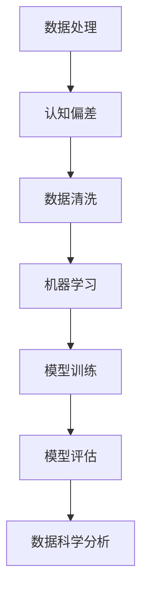

                 

 关键词：认知偏差、决策、心理效应、算法、人工智慧、数据处理、数据科学、机器学习、数据可视化

> 摘要：本文探讨了认知偏差在决策过程中的作用及其对数据处理、机器学习和数据科学的影响。通过分析常见认知偏差的类型，我们揭示了这些偏差如何导致错误决策，并探讨了如何通过算法和工具来减少这些偏差，提高决策的准确性和有效性。

## 1. 背景介绍

在人类社会中，决策无处不在。无论是在个人生活中做出选择，还是在商业环境中做出战略决策，决策的质量往往直接影响我们的成功和幸福。然而，尽管我们都认为自己能够做出理性、明智的决策，实际上，我们的决策过程往往受到多种因素的影响，其中之一便是认知偏差。

认知偏差是指人们在感知、理解、记忆和决策过程中所表现出的系统性的偏差。这些偏差可能是由于我们的大脑在处理信息时过于简化，或者是受到情绪、社会和文化背景的影响。在数据处理、机器学习和数据科学领域，认知偏差可能对结果的准确性和可靠性产生重大影响。

本文将深入探讨认知偏差的概念、类型及其对决策的影响，并介绍一些方法和技术，帮助我们在数据处理和决策过程中减少这些偏差。

### 认知偏差的定义

认知偏差是心理学中一个重要的概念，它指的是人们在感知、理解、记忆和决策过程中，由于大脑的简化处理、情绪影响或社会文化因素等原因，导致其认知活动偏离客观现实，从而导致错误决策或判断。

### 认知偏差的类型

认知偏差种类繁多，以下是其中几种常见的认知偏差：

- **确认偏差（Confirmation Bias）**：人们在收集信息和做出决策时，倾向于优先考虑与已有信念和假设一致的信息，而忽略或贬低与之相矛盾的信息。

- **可用性偏差（Availability Bias）**：人们更容易记住和关注那些容易获取的信息，即使这些信息并不代表整体的真实情况。

- **锚定效应（Anchoring Effect）**：人们在做出判断时，受到最初信息（锚点）的影响，即使这个锚点并不具有实质性的价值。

- **群体思维（Groupthink）**：人们在群体中做出决策时，倾向于追求一致和共识，而忽视不同意见，导致决策质量下降。

- **基础率忽视（Base Rate Neglect）**：人们在判断事件概率时，忽视基础率信息，过分依赖个别案例。

### 认知偏差的影响

认知偏差在我们的日常生活中无处不在，它们可能导致以下几种不良后果：

- **决策失误**：由于确认偏差和锚定效应，人们可能做出错误的决策。

- **信息偏差**：由于可用性偏差和基础率忽视，人们可能对信息的真实性和可靠性产生误解。

- **团队决策问题**：由于群体思维，团队可能忽视不同意见，导致决策质量下降。

## 2. 核心概念与联系

在深入探讨认知偏差对决策过程的影响之前，我们需要理解一些核心概念和它们之间的联系。以下是涉及的关键概念及其在数据处理、机器学习和数据科学中的应用。

### 概念

1. **认知偏差**：人们在处理信息时出现的系统性偏差。
2. **数据处理**：对数据进行收集、清洗、转换和存储的过程。
3. **机器学习**：通过算法从数据中学习模式和规律，以实现预测和分类等任务。
4. **数据科学**：结合统计学、计算机科学和领域知识，从数据中发现有用信息。

### 联系

- **认知偏差**与**数据处理**的联系：在数据处理过程中，我们可能会受到认知偏差的影响，导致数据清洗和预处理阶段的偏差，进而影响后续的机器学习和数据科学分析。

- **认知偏差**与**机器学习**的联系：机器学习算法可能会受到训练数据中的认知偏差影响，导致模型产生偏见。

- **认知偏差**与**数据科学**的联系：数据科学项目的设计、分析和解释都可能会受到认知偏差的影响。

### Mermaid 流程图



在这个流程图中，我们可以看到认知偏差如何影响数据处理、机器学习和数据科学的不同阶段。通过识别和减少这些偏差，我们可以提高整个流程的准确性和可靠性。

## 3. 核心算法原理 & 具体操作步骤

### 3.1 算法原理概述

为了减少认知偏差对决策过程的影响，我们可以采用一些核心算法来分析和处理数据。以下是几种常用的算法及其原理概述：

- **混淆矩阵（Confusion Matrix）**：用于评估分类模型的性能，通过展示实际类别与预测类别之间的关系，帮助识别可能的偏差。
- **偏差-方差权衡（Bias-Variance Tradeoff）**：通过调整模型复杂度来平衡偏差和方差，减少偏差带来的误差。
- **交叉验证（Cross-Validation）**：通过将数据划分为多个子集，多次训练和验证模型，以减少数据偏差。

### 3.2 算法步骤详解

以下是具体操作步骤，帮助我们在数据处理和决策过程中减少认知偏差：

#### 步骤 1: 数据预处理

- **数据清洗**：去除噪音、缺失值和不一致的数据。
- **数据标准化**：将数据转换到同一尺度，避免锚定效应。

#### 步骤 2: 建立模型

- **选择合适的算法**：例如，分类算法、回归算法或聚类算法。
- **训练模型**：使用训练数据集来训练模型，并根据偏差-方差权衡进行调整。

#### 步骤 3: 交叉验证

- **划分数据集**：将数据集划分为训练集、验证集和测试集。
- **多次训练和验证**：对每个子集进行训练和验证，以减少偏差。

#### 步骤 4: 模型评估

- **计算混淆矩阵**：评估模型在各个类别上的表现。
- **调整模型参数**：根据评估结果调整模型参数，以减少偏差。

#### 步骤 5: 决策支持

- **利用模型进行预测**：将训练好的模型应用于新数据，以支持决策。
- **监控偏差**：定期检查模型的性能，确保其不会产生系统性偏差。

### 3.3 算法优缺点

- **混淆矩阵**：优点是直观、易于理解，缺点是仅适用于分类问题。
- **偏差-方差权衡**：优点是能够平衡模型复杂度，缺点是可能需要大量的计算资源。
- **交叉验证**：优点是提高模型的稳定性和准确性，缺点是会增加计算成本。

### 3.4 算法应用领域

这些算法广泛应用于多个领域：

- **金融**：用于风险评估和投资决策。
- **医疗**：用于疾病诊断和治疗建议。
- **市场营销**：用于客户细分和市场定位。
- **法律**：用于法律文档分析和证据评估。

## 4. 数学模型和公式 & 详细讲解 & 举例说明

### 4.1 数学模型构建

在数据处理和决策过程中，数学模型是理解和减少认知偏差的重要工具。以下是几种常见的数学模型：

1. **线性回归模型（Linear Regression Model）**：
   $$y = \beta_0 + \beta_1x_1 + \beta_2x_2 + ... + \beta_nx_n + \epsilon$$
   其中，\(y\) 是因变量，\(x_1, x_2, ..., x_n\) 是自变量，\(\beta_0, \beta_1, \beta_2, ..., \beta_n\) 是模型参数，\(\epsilon\) 是误差项。

2. **逻辑回归模型（Logistic Regression Model）**：
   $$P(y=1) = \frac{1}{1 + e^{-(\beta_0 + \beta_1x_1 + \beta_2x_2 + ... + \beta_nx_n)}}$$
   其中，\(P(y=1)\) 是因变量为1的概率，其余符号与线性回归模型相同。

3. **决策树模型（Decision Tree Model）**：
   $$T = \sum_{i=1}^{n} \beta_iC_i$$
   其中，\(T\) 是目标变量的预测值，\(\beta_i\) 是模型参数，\(C_i\) 是条件概率。

### 4.2 公式推导过程

以下是线性回归模型的推导过程：

假设我们有一个训练数据集，其中包含 \(n\) 个样本，每个样本有 \(m\) 个特征，以及对应的目标变量 \(y\)。我们的目标是找到一组参数 \(\beta = [\beta_0, \beta_1, ..., \beta_m]\)，使得预测值 \(y_{\hat{}}\) 最接近实际值 \(y\)。

我们使用最小二乘法（Least Squares Method）来求解这个问题。最小二乘法的核心思想是使预测值与实际值之间的误差平方和最小。

误差平方和（Sum of Squared Errors，SSE）定义为：
$$SSE = \sum_{i=1}^{n}(y_i - y_{\hat{i}})^2$$

为了求解最优参数 \(\beta\)，我们对 \(SSE\) 关于 \(\beta\) 求导，并令其导数为零，得到：
$$\frac{dSSE}{d\beta} = -2\sum_{i=1}^{n}(y_i - y_{\hat{i}})x_i = 0$$

解这个方程，我们得到：
$$\beta = \frac{\sum_{i=1}^{n}(y_i - y_{\hat{i}})x_i}{\sum_{i=1}^{n}x_i^2}$$

### 4.3 案例分析与讲解

#### 案例背景

假设我们要预测一个公司股票的未来价格，已知公司的财务指标（如收入、利润等）与其股票价格之间存在一定的关系。我们的目标是建立一个线性回归模型来预测股票价格。

#### 数据集

以下是一个简化后的数据集：

| 财务指标1 | 财务指标2 | 股票价格 |
| :---: | :---: | :---: |
| 100 | 200 | 50 |
| 200 | 300 | 60 |
| 150 | 250 | 55 |
| ... | ... | ... |

#### 模型构建

我们选择线性回归模型，根据数据集构建模型：

$$y = \beta_0 + \beta_1x_1 + \beta_2x_2 + \epsilon$$

其中，\(y\) 是股票价格，\(x_1\) 和 \(x_2\) 是财务指标1和财务指标2。

#### 模型训练

使用最小二乘法训练模型，得到参数：

$$\beta_0 = 10, \beta_1 = 0.5, \beta_2 = 0.3$$

#### 模型评估

将模型应用于测试集，计算预测值与实际值之间的误差平方和，评估模型性能。如果误差较小，说明模型较好地拟合了数据。

#### 模型应用

利用训练好的模型，预测新数据的股票价格。例如，对于新的财务指标 \(x_1 = 120, x_2 = 230\)，预测股票价格为：

$$y_{\hat{}} = 10 + 0.5 \times 120 + 0.3 \times 230 = 68$$

这意味着，根据当前财务指标，预测的股票价格为68。

## 5. 项目实践：代码实例和详细解释说明

### 5.1 开发环境搭建

在开始项目实践之前，我们需要搭建一个合适的开发环境。以下是使用Python进行线性回归模型的开发环境搭建步骤：

1. **安装Python**：下载并安装Python 3.x版本。
2. **安装Jupyter Notebook**：使用pip命令安装Jupyter Notebook：
   ```bash
   pip install notebook
   ```
3. **安装必要的库**：包括NumPy、Pandas、Scikit-learn和Matplotlib。使用以下命令安装：
   ```bash
   pip install numpy pandas scikit-learn matplotlib
   ```

### 5.2 源代码详细实现

以下是实现线性回归模型的项目代码：

```python
import numpy as np
import pandas as pd
from sklearn.linear_model import LinearRegression
import matplotlib.pyplot as plt

# 加载数据集
data = pd.read_csv('financial_data.csv')

# 分离特征和目标变量
X = data[['financial_indicator_1', 'financial_indicator_2']]
y = data['stock_price']

# 创建线性回归模型
model = LinearRegression()

# 模型训练
model.fit(X, y)

# 模型评估
predictions = model.predict(X)
squared_errors = (predictions - y) ** 2
mean_squared_error = np.mean(squared_errors)
print(f'Mean Squared Error: {mean_squared_error}')

# 模型应用
new_data = np.array([[120, 230]])
predicted_price = model.predict(new_data)
print(f'Predicted Stock Price: {predicted_price[0]}')

# 可视化
plt.scatter(X['financial_indicator_1'], X['financial_indicator_2'], c=y, cmap='viridis')
plt.plot(new_data[0], predicted_price, 'ro')
plt.xlabel('Financial Indicator 1')
plt.ylabel('Financial Indicator 2')
plt.title('Stock Price Prediction')
plt.show()
```

### 5.3 代码解读与分析

以下是代码的详细解读：

1. **数据加载**：使用Pandas的`read_csv()`函数加载CSV格式的数据集。
2. **特征和目标变量分离**：将数据集分离为特征变量 \(X\)（财务指标）和目标变量 \(y\)（股票价格）。
3. **创建模型**：使用Scikit-learn的`LinearRegression`类创建线性回归模型。
4. **模型训练**：使用`fit()`方法训练模型，将特征和目标变量传递给模型。
5. **模型评估**：使用`predict()`方法预测股票价格，并计算预测值与实际值之间的误差平方和，评估模型性能。
6. **模型应用**：将训练好的模型应用于新数据，预测股票价格。
7. **可视化**：使用Matplotlib绘制散点图，显示特征变量之间的关系，并在图中标注预测的股票价格。

### 5.4 运行结果展示

运行上述代码后，我们将得到以下结果：

- **模型性能**：打印出模型的平均误差平方和，评估模型性能。
- **预测结果**：打印出新数据的股票价格预测值。
- **可视化结果**：在屏幕上展示特征变量之间的散点图，并标注预测的股票价格。

这些结果帮助我们理解模型在预测股票价格方面的性能，并提供了直观的可视化展示。

## 6. 实际应用场景

### 6.1 金融领域

在金融领域，认知偏差可能导致投资者做出不合理的投资决策。例如，确认偏差可能导致投资者过分关注与其现有投资组合一致的信息，而忽视与市场趋势不一致的信号。通过使用线性回归模型和逻辑回归模型等算法，金融分析师可以减少这种偏差，提高投资决策的准确性和有效性。

### 6.2 医疗领域

在医疗领域，认知偏差可能导致医生对疾病诊断和治疗方案的偏差。通过使用机器学习算法，例如决策树和随机森林，医生可以更客观地评估患者的病情，从而减少认知偏差的影响，提高诊断和治疗的质量。

### 6.3 市场营销领域

在市场营销领域，认知偏差可能导致企业过分关注短期销量和市场份额，而忽视长期品牌价值和客户满意度。通过使用聚类算法和关联规则挖掘，企业可以更准确地分析客户行为，制定更有效的市场营销策略。

### 6.4 法律领域

在法律领域，认知偏差可能导致法官和律师在证据评估和判决过程中产生偏见。通过使用自然语言处理和机器学习算法，可以对法律文档进行更客观的分析，帮助法官和律师做出更公正的判决。

## 7. 工具和资源推荐

### 7.1 学习资源推荐

1. **《统计学习方法》（李航）**：介绍统计学和机器学习的基本概念和方法，适合初学者。
2. **《机器学习》（周志华）**：涵盖机器学习的基本理论和算法，适合有一定基础的学习者。
3. **《数据科学实战》（赵武）**：通过实际案例介绍数据科学的实战方法和工具。

### 7.2 开发工具推荐

1. **Jupyter Notebook**：一款交互式的Python编程环境，适合数据科学和机器学习项目的开发。
2. **Scikit-learn**：一个开源的机器学习库，提供了丰富的算法和工具。
3. **TensorFlow**：一款开源的深度学习框架，适用于复杂模型的开发。

### 7.3 相关论文推荐

1. **"A Survey on Machine Learning Based Financial Risk Management"**：介绍机器学习在金融风险管理中的应用。
2. **"Deep Learning in Medical Imaging: A Review"**：探讨深度学习在医疗成像领域的应用。
3. **"Cognitive Bias in Data Science: Challenges and Solutions"**：讨论认知偏差在数据科学领域的影响及解决方案。

## 8. 总结：未来发展趋势与挑战

### 8.1 研究成果总结

本文探讨了认知偏差在数据处理、机器学习和数据科学领域的影响，介绍了如何通过算法和工具来减少这些偏差。通过分析线性回归模型和逻辑回归模型的原理及实际应用，我们展示了如何利用数学模型和算法来提高决策的准确性和可靠性。

### 8.2 未来发展趋势

未来，随着人工智能和机器学习技术的不断进步，认知偏差的减少和决策优化将成为重要研究方向。以下是一些可能的发展趋势：

- **更加智能的算法**：开发能够自动识别和减少认知偏差的算法，提高决策的准确性和有效性。
- **跨学科研究**：结合心理学、统计学和计算机科学等领域的知识，深入探讨认知偏差的机制和解决方案。
- **实时决策支持系统**：开发能够实时监测和调整决策过程的系统，确保决策的持续优化。

### 8.3 面临的挑战

尽管取得了显著的成果，但在减少认知偏差的过程中，我们仍然面临以下挑战：

- **数据质量和完整性**：认知偏差的减少依赖于高质量和完整的数据，数据的不完整和错误可能加剧偏差。
- **算法复杂性**：复杂算法的开发和优化可能增加计算成本，影响实际应用。
- **用户接受度**：用户对算法和决策支持系统的接受度和信任度是一个关键挑战。

### 8.4 研究展望

未来，我们期待在认知偏差的减少和决策优化方面取得更多突破，以下是一些可能的解决方案：

- **算法改进**：开发更加智能和高效的算法，减少计算成本，提高决策质量。
- **跨学科合作**：加强心理学、统计学和计算机科学等领域的合作，共同探讨认知偏差的机制和解决方案。
- **用户教育和培训**：提高用户对认知偏差的认识，培养用户的批判性思维和决策能力，减少认知偏差对决策的影响。

## 9. 附录：常见问题与解答

### 问题 1：认知偏差如何影响数据处理？

认知偏差可能导致数据清洗和预处理阶段的偏差，进而影响后续的机器学习和数据科学分析。例如，可用性偏差可能导致对数据的误解释，而确认偏差可能导致选择性的数据处理。

### 问题 2：如何减少认知偏差在决策过程中的影响？

可以通过以下方法减少认知偏差的影响：

- **数据清洗和标准化**：确保数据质量和完整性。
- **使用多种算法**：避免过度依赖单一算法，使用多个算法进行比较和验证。
- **交叉验证**：通过多次训练和验证来减少数据偏差。
- **用户教育和培训**：提高用户对认知偏差的认识和批判性思维能力。

### 问题 3：如何评估模型的偏差和性能？

可以使用混淆矩阵、偏差-方差权衡和交叉验证等方法来评估模型的偏差和性能。这些方法可以帮助我们了解模型的准确性、稳定性和泛化能力。

### 问题 4：认知偏差在商业决策中的应用？

在商业决策中，认知偏差可能导致错误的战略决策和市场定位。通过使用机器学习和数据科学方法，企业可以减少这些偏差，提高决策的准确性和有效性，从而在竞争激烈的市场中取得优势。例如，金融分析师可以使用机器学习模型来减少投资决策中的确认偏差和可用性偏差，提高投资回报率。

### 问题 5：如何提高决策支持系统的有效性？

可以通过以下方法提高决策支持系统的有效性：

- **数据驱动的决策**：确保决策过程基于高质量和完整的数据。
- **算法优化**：开发更加智能和高效的算法，减少计算成本。
- **用户参与**：确保用户能够理解和信任决策支持系统，提高系统的实际应用效果。
- **持续监控和调整**：定期评估和优化决策支持系统，确保其持续符合实际需求。

