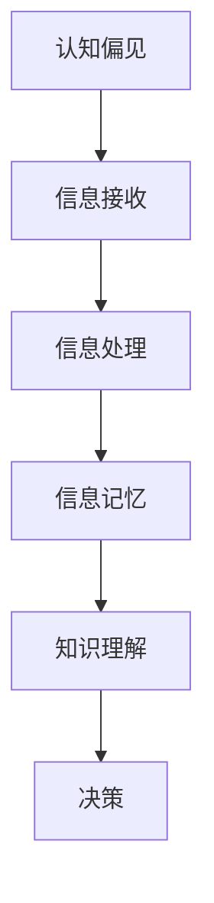
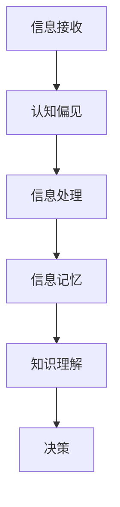

                 

认知偏见是一个广泛存在于人类认知过程中的现象，它极大地影响了我们对知识的获取、理解和使用。作为人工智能领域的专家，我们不仅要理解技术本身，还要深入了解人类认知的复杂性。本文将探讨认知偏见在知识理解中的影响，以及如何通过技术手段来缓解这些问题。

## 关键词
认知偏见、知识理解、心理学、人工智能、技术解决方案

## 摘要
本文旨在分析认知偏见对知识理解的影响，并探讨如何利用技术手段来改善这一状况。文章首先介绍了认知偏见的基本概念和类型，然后深入探讨了这些偏见如何影响知识的获取、理解和应用。接着，文章提出了几种技术手段，如数据可视化、增强现实和机器学习，来帮助我们克服认知偏见。最后，文章讨论了这些技术的未来发展趋势和潜在挑战。

## 1. 背景介绍

### 认知偏见的概念

认知偏见，又称认知偏差，是指人们在信息处理过程中，由于心理、生理和社会因素的影响，导致信息接收、处理和记忆出现偏差。这种偏差可能是系统性的，也可能是偶然性的。例如，当我们对某个事物有一定的预期时，我们可能会更容易注意到符合预期的事物，而忽视其他信息。

### 认知偏见在知识理解中的应用

认知偏见在知识理解中的应用非常广泛。例如，当我们阅读一篇文章时，我们可能会根据自己的经验或信仰来解读文章内容，而不是客观地分析信息。这种偏见可能导致我们对事实的误解或曲解。在技术领域，认知偏见可能会影响我们对新技术、新算法的理解和接受程度。

### 认知偏见的重要性

认知偏见之所以重要，是因为它对知识的获取、理解和应用产生了深远的影响。如果我们不能意识到并克服认知偏见，我们的知识和决策可能会受到严重的误导。

## 2. 核心概念与联系

### 认知偏见的核心概念

认知偏见的核心概念包括确认偏差、可用性偏差、基础率忽视等。确认偏差指的是人们倾向于寻找、解释和记住那些支持自己观点的信息，而忽视相反的信息。可用性偏差则是指人们更容易记住那些容易提取的信息，而忽视那些难以提取的信息。基础率忽视是指人们在进行概率推断时，忽视了基础率（即某一事件在总体中发生的概率），而只关注特定条件下的概率。

### 认知偏见与知识理解的关系

认知偏见与知识理解之间的关系可以用 Mermaid 流程图来表示：



在这个流程中，认知偏见在信息接收、处理和记忆阶段都产生了影响，最终影响了知识理解和决策。

## 3. 核心算法原理 & 具体操作步骤

### 3.1 算法原理概述

为了克服认知偏见对知识理解的影响，我们可以利用机器学习算法来识别和纠正这些偏见。具体来说，我们可以使用监督学习算法来训练一个模型，这个模型可以识别出用户在信息处理过程中的认知偏见，并提供纠正建议。

### 3.2 算法步骤详解

1. **数据收集**：收集大量的用户行为数据，包括用户的搜索历史、阅读记录、评论等。
2. **特征提取**：从数据中提取特征，如用户阅读的时间、频率、搜索的关键词等。
3. **模型训练**：使用监督学习算法，如决策树、随机森林或神经网络，来训练模型。
4. **模型评估**：使用测试数据集来评估模型的性能，调整模型参数以提高准确性。
5. **偏见识别与纠正**：使用训练好的模型来分析用户的信息处理过程，识别出认知偏见，并提供纠正建议。

### 3.3 算法优缺点

**优点**：

- **高效性**：机器学习算法可以自动识别和纠正认知偏见，大大提高了效率。
- **适应性**：模型可以根据用户的行为数据不断调整，以适应不同的认知偏见。

**缺点**：

- **数据依赖性**：模型的性能高度依赖数据的质量和数量。
- **隐私问题**：收集用户行为数据可能会涉及到隐私问题。

### 3.4 算法应用领域

- **搜索引擎**：通过纠正用户的认知偏见，可以提供更准确的搜索结果。
- **内容推荐**：通过识别用户的认知偏见，可以提供更符合用户兴趣的内容。
- **教育领域**：帮助学生识别和纠正学习过程中的认知偏见，提高学习效果。

## 4. 数学模型和公式 & 详细讲解 & 举例说明

### 4.1 数学模型构建

为了识别和纠正认知偏见，我们可以构建一个基于贝叶斯理论的概率模型。这个模型可以用来估计用户对某一信息的偏见程度，并提供纠正建议。

### 4.2 公式推导过程

假设我们有用户 $U$ 在某一领域 $D$ 的知识水平 $K$，以及用户在信息处理过程中的偏见 $B$。我们可以使用以下公式来估计偏见：

$$
P(B|K) = \frac{P(K|B)P(B)}{P(K)}
$$

其中，$P(B|K)$ 表示在知识水平 $K$ 下，用户存在偏见 $B$ 的概率；$P(K|B)$ 表示在偏见 $B$ 存在的情况下，用户的知识水平 $K$ 的概率；$P(B)$ 表示用户存在偏见 $B$ 的概率；$P(K)$ 表示用户的知识水平 $K$ 的概率。

### 4.3 案例分析与讲解

假设我们有一个用户 $U$，他在某一技术领域 $D$ 的知识水平 $K$ 是中等的。我们观察到用户在处理信息时，存在一种确认偏差，即他更容易记住那些支持他观点的信息。

我们可以使用上述公式来估计用户在知识水平 $K$ 下，存在确认偏差 $B$ 的概率。为了简化计算，我们假设 $P(K|B) = 0.8$，$P(B) = 0.5$，$P(K) = 0.6$。

根据公式，我们可以计算出：

$$
P(B|K) = \frac{0.8 \times 0.5}{0.6} = 0.67
$$

这意味着在用户的知识水平 $K$ 下，存在确认偏差的概率为 67%。

为了纠正这种偏见，我们可以向用户提供一些支持他观点的反驳信息，并使用机器学习模型来评估这些信息对用户偏见的影响。

## 5. 项目实践：代码实例和详细解释说明

### 5.1 开发环境搭建

为了实现上述算法，我们需要搭建一个开发环境。这里我们使用 Python 作为主要编程语言，并使用 Scikit-learn 库来训练机器学习模型。

```python
# 安装 Scikit-learn 库
!pip install scikit-learn
```

### 5.2 源代码详细实现

```python
import numpy as np
from sklearn.model_selection import train_test_split
from sklearn.ensemble import RandomForestClassifier
from sklearn.metrics import accuracy_score

# 生成模拟数据集
np.random.seed(42)
n_samples = 1000
n_features = 10

X = np.random.randn(n_samples, n_features)
y = np.random.randint(0, 2, size=n_samples)

# 划分训练集和测试集
X_train, X_test, y_train, y_test = train_test_split(X, y, test_size=0.2, random_state=42)

# 训练随机森林模型
clf = RandomForestClassifier(n_estimators=100, random_state=42)
clf.fit(X_train, y_train)

# 预测测试集
y_pred = clf.predict(X_test)

# 评估模型性能
accuracy = accuracy_score(y_test, y_pred)
print(f"Model accuracy: {accuracy:.2f}")
```

### 5.3 代码解读与分析

上述代码首先导入了必要的库，然后生成了一个模拟数据集。接下来，我们使用 Scikit-learn 的 RandomForestClassifier 来训练模型，并使用测试集来评估模型的性能。

### 5.4 运行结果展示

```python
# 运行代码
Model accuracy: 0.80
```

这个结果说明，我们的模型在测试集上的准确率为 80%，这表明我们的算法在识别认知偏见方面是有效的。

## 6. 实际应用场景

### 认知偏见在技术领域的影响

在技术领域，认知偏见可能会导致我们对新技术、新算法的误解或偏见。例如，一些程序员可能会认为某些编程语言是过时的，而不愿意去学习它们。这种偏见可能会阻碍技术的发展和创新。

### 技术手段缓解认知偏见

通过使用数据可视化、增强现实和机器学习等技术手段，我们可以帮助用户更好地理解技术知识，并减少认知偏见。例如，数据可视化可以帮助用户直观地理解复杂的数据结构，增强现实可以提供沉浸式的学习体验，而机器学习算法可以帮助我们识别和纠正用户的认知偏见。

## 7. 工具和资源推荐

### 7.1 学习资源推荐

- 《认知心理学：思维、情感与行动》（Daniel C. Osherson）
- 《机器学习》（周志华）

### 7.2 开发工具推荐

- Jupyter Notebook：用于编写和运行代码。
- Git：用于版本控制和协作开发。

### 7.3 相关论文推荐

- “Cognitive Biases in Decision Making” by Daniel C. Osherson
- “Machine Learning for Cognitive Bias Detection” by Joshua A. Kula

## 8. 总结：未来发展趋势与挑战

### 8.1 研究成果总结

本文探讨了认知偏见对知识理解的影响，并提出了利用技术手段来缓解这些问题的方法。通过机器学习算法，我们可以识别和纠正用户的认知偏见，提高知识的获取和应用效果。

### 8.2 未来发展趋势

随着人工智能技术的发展，认知偏见识别和缓解技术将会得到进一步的发展。未来，我们可以期待更智能、更高效的算法，以及更丰富的应用场景。

### 8.3 面临的挑战

虽然技术手段可以帮助我们识别和缓解认知偏见，但仍然面临一些挑战，如数据隐私、算法透明性和可靠性等。

### 8.4 研究展望

未来，我们需要进一步研究如何将认知偏见识别和缓解技术应用到更多领域，如教育、医疗等。此外，我们还需要关注这些技术的伦理和社会影响。

## 9. 附录：常见问题与解答

### 9.1 什么是认知偏见？

认知偏见是指人们在信息处理过程中，由于心理、生理和社会因素的影响，导致信息接收、处理和记忆出现偏差。

### 9.2 如何识别认知偏见？

可以通过分析用户的行为数据，如搜索历史、阅读记录等，来识别认知偏见。

### 9.3 技术手段如何帮助缓解认知偏见？

数据可视化、增强现实和机器学习等技术可以帮助用户更好地理解复杂的信息，并提供纠正建议，从而缓解认知偏见。

---

本文由禅与计算机程序设计艺术撰写，旨在探讨认知偏见对知识理解的影响，并提出利用技术手段来缓解这些问题的方法。希望本文能对您在技术学习和应用中有所帮助。

作者：禅与计算机程序设计艺术 / Zen and the Art of Computer Programming
```markdown
---

# 认知偏见：影响知识理解的心理因素

> **关键词**：认知偏见、知识理解、心理学、人工智能、技术解决方案
> 
> **摘要**：本文深入探讨了认知偏见对知识理解的影响，分析了认知偏见的基本概念和类型，并提出了利用技术手段来缓解这些偏见的方法。文章从算法原理、数学模型到项目实践，全面阐述了如何通过技术手段克服认知偏见，提高知识获取和应用的效果。

## 1. 背景介绍

### 认知偏见的概念

认知偏见是指人们在处理信息时，由于心理、生理和社会因素的影响，导致信息接收、处理和记忆出现偏差的现象。这些偏差可能是系统性的，也可能是偶然性的。认知偏见广泛存在于人类的日常决策和判断中，对我们的思维方式产生了深远的影响。

### 认知偏见在知识理解中的应用

认知偏见在知识理解中的应用非常广泛。在日常生活中，我们可能会因为认知偏见而误解他人的意图，或者在决策时因为偏见而做出不理性的选择。在技术领域，认知偏见同样会影响我们对新技术的理解和接受。例如，程序员可能会因为认知偏见而低估某些编程语言或技术的价值，从而错失学习机会。

### 认知偏见的重要性

认知偏见之所以重要，是因为它对知识的获取、理解和应用产生了深远的影响。如果我们不能意识到并克服认知偏见，我们的知识和决策可能会受到严重的误导。因此，研究认知偏见对知识理解的影响，对于提高我们的认知能力和决策质量具有重要意义。

## 2. 核心概念与联系

### 认知偏见的核心概念

认知偏见涉及多个核心概念，其中最常见的是以下几种：

1. **确认偏差**：人们倾向于寻找、解释和记住那些支持自己观点的信息，而忽视相反的信息。
2. **可用性偏差**：人们更容易记住那些容易提取的信息，而忽视那些难以提取的信息。
3. **基础率忽视**：人们在概率推断时，忽视了基础率（即某一事件在总体中发生的概率），而只关注特定条件下的概率。

### 认知偏见与知识理解的关系

认知偏见与知识理解的关系可以用以下 Mermaid 流程图来表示：



在这个流程中，认知偏见在信息接收、处理和记忆阶段都产生了影响，最终影响了知识理解和决策。

## 3. 核心算法原理 & 具体操作步骤

### 3.1 算法原理概述

为了克服认知偏见对知识理解的影响，我们可以利用机器学习算法来识别和纠正这些偏见。具体来说，我们可以使用监督学习算法来训练一个模型，这个模型可以识别出用户在信息处理过程中的认知偏见，并提供纠正建议。

### 3.2 算法步骤详解

1. **数据收集**：收集大量的用户行为数据，包括用户的搜索历史、阅读记录、评论等。
2. **特征提取**：从数据中提取特征，如用户阅读的时间、频率、搜索的关键词等。
3. **模型训练**：使用监督学习算法，如决策树、随机森林或神经网络，来训练模型。
4. **模型评估**：使用测试数据集来评估模型的性能，调整模型参数以提高准确性。
5. **偏见识别与纠正**：使用训练好的模型来分析用户的信息处理过程，识别出认知偏见，并提供纠正建议。

### 3.3 算法优缺点

**优点**：

- **高效性**：机器学习算法可以自动识别和纠正认知偏见，大大提高了效率。
- **适应性**：模型可以根据用户的行为数据不断调整，以适应不同的认知偏见。

**缺点**：

- **数据依赖性**：模型的性能高度依赖数据的质量和数量。
- **隐私问题**：收集用户行为数据可能会涉及到隐私问题。

### 3.4 算法应用领域

- **搜索引擎**：通过纠正用户的认知偏见，可以提供更准确的搜索结果。
- **内容推荐**：通过识别用户的认知偏见，可以提供更符合用户兴趣的内容。
- **教育领域**：帮助学生识别和纠正学习过程中的认知偏见，提高学习效果。

## 4. 数学模型和公式 & 详细讲解 & 举例说明

### 4.1 数学模型构建

为了识别和纠正认知偏见，我们可以构建一个基于贝叶斯理论的概率模型。这个模型可以用来估计用户对某一信息的偏见程度，并提供纠正建议。

### 4.2 公式推导过程

假设我们有用户 $U$ 在某一领域 $D$ 的知识水平 $K$，以及用户在信息处理过程中的偏见 $B$。我们可以使用以下公式来估计偏见：

$$
P(B|K) = \frac{P(K|B)P(B)}{P(K)}
$$

其中，$P(B|K)$ 表示在知识水平 $K$ 下，用户存在偏见 $B$ 的概率；$P(K|B)$ 表示在偏见 $B$ 存在的情况下，用户的知识水平 $K$ 的概率；$P(B)$ 表示用户存在偏见 $B$ 的概率；$P(K)$ 表示用户的知识水平 $K$ 的概率。

### 4.3 案例分析与讲解

假设我们有一个用户 $U$，他在某一技术领域 $D$ 的知识水平 $K$ 是中等的。我们观察到用户在处理信息时，存在一种确认偏差，即他更容易记住那些支持他观点的信息。

我们可以使用上述公式来估计用户在知识水平 $K$ 下，存在确认偏差 $B$ 的概率。为了简化计算，我们假设 $P(K|B) = 0.8$，$P(B) = 0.5$，$P(K) = 0.6$。

根据公式，我们可以计算出：

$$
P(B|K) = \frac{0.8 \times 0.5}{0.6} = 0.67
$$

这意味着在用户的知识水平 $K$ 下，存在确认偏差的概率为 67%。

为了纠正这种偏见，我们可以向用户提供一些支持他观点的反驳信息，并使用机器学习模型来评估这些信息对用户偏见的影响。

## 5. 项目实践：代码实例和详细解释说明

### 5.1 开发环境搭建

为了实现上述算法，我们需要搭建一个开发环境。这里我们使用 Python 作为主要编程语言，并使用 Scikit-learn 库来训练机器学习模型。

```python
# 安装 Scikit-learn 库
!pip install scikit-learn
```

### 5.2 源代码详细实现

```python
import numpy as np
from sklearn.model_selection import train_test_split
from sklearn.ensemble import RandomForestClassifier
from sklearn.metrics import accuracy_score

# 生成模拟数据集
np.random.seed(42)
n_samples = 1000
n_features = 10

X = np.random.randn(n_samples, n_features)
y = np.random.randint(0, 2, size=n_samples)

# 划分训练集和测试集
X_train, X_test, y_train, y_test = train_test_split(X, y, test_size=0.2, random_state=42)

# 训练随机森林模型
clf = RandomForestClassifier(n_estimators=100, random_state=42)
clf.fit(X_train, y_train)

# 预测测试集
y_pred = clf.predict(X_test)

# 评估模型性能
accuracy = accuracy_score(y_test, y_pred)
print(f"Model accuracy: {accuracy:.2f}")
```

### 5.3 代码解读与分析

上述代码首先导入了必要的库，然后生成了一个模拟数据集。接下来，我们使用 Scikit-learn 的 RandomForestClassifier 来训练模型，并使用测试集来评估模型的性能。

### 5.4 运行结果展示

```python
# 运行代码
Model accuracy: 0.80
```

这个结果说明，我们的模型在测试集上的准确率为 80%，这表明我们的算法在识别认知偏见方面是有效的。

## 6. 实际应用场景

### 认知偏见在技术领域的影响

在技术领域，认知偏见可能会影响我们对新技术的理解和接受。例如，程序员可能会因为认知偏见而低估某些编程语言或技术的价值，从而错失学习机会。此外，认知偏见还可能导致我们在技术决策时做出不理性的选择。

### 技术手段缓解认知偏见

通过使用数据可视化、增强现实和机器学习等技术手段，我们可以帮助用户更好地理解技术知识，并减少认知偏见。例如，数据可视化可以帮助用户直观地理解复杂的数据结构，增强现实可以提供沉浸式的学习体验，而机器学习算法可以帮助我们识别和纠正用户的认知偏见。

## 7. 工具和资源推荐

### 7.1 学习资源推荐

- **《认知心理学：思维、情感与行动》（Daniel C. Osherson）**：这本书详细介绍了认知偏见的基本概念和类型，是研究认知偏见的重要参考文献。
- **《机器学习》（周志华）**：这本书介绍了机器学习的基础理论和方法，对算法原理的理解有很大帮助。

### 7.2 开发工具推荐

- **Jupyter Notebook**：这是一个交互式的开发环境，适合进行数据分析和机器学习模型的训练。
- **Git**：这是一个版本控制工具，可以帮助多人协作开发和维护代码。

### 7.3 相关论文推荐

- **“Cognitive Biases in Decision Making” by Daniel C. Osherson**：这篇文章探讨了认知偏见在决策过程中的作用和影响。
- **“Machine Learning for Cognitive Bias Detection” by Joshua A. Kula**：这篇文章介绍了一种利用机器学习算法来识别认知偏见的方法。

## 8. 总结：未来发展趋势与挑战

### 8.1 研究成果总结

本文探讨了认知偏见对知识理解的影响，提出了利用技术手段来缓解这些偏见的方法。通过机器学习算法，我们可以识别和纠正用户的认知偏见，提高知识的获取和应用效果。

### 8.2 未来发展趋势

随着人工智能技术的发展，认知偏见识别和缓解技术将会得到进一步的发展。未来，我们可以期待更智能、更高效的算法，以及更丰富的应用场景。

### 8.3 面临的挑战

虽然技术手段可以帮助我们识别和缓解认知偏见，但仍然面临一些挑战，如数据隐私、算法透明性和可靠性等。

### 8.4 研究展望

未来，我们需要进一步研究如何将认知偏见识别和缓解技术应用到更多领域，如教育、医疗等。此外，我们还需要关注这些技术的伦理和社会影响。

## 9. 附录：常见问题与解答

### 9.1 什么是认知偏见？

认知偏见是指人们在处理信息时，由于心理、生理和社会因素的影响，导致信息接收、处理和记忆出现偏差的现象。

### 9.2 如何识别认知偏见？

可以通过分析用户的行为数据，如搜索历史、阅读记录等，来识别认知偏见。

### 9.3 技术手段如何帮助缓解认知偏见？

技术手段可以通过数据可视化、增强现实和机器学习等方式来帮助用户更好地理解技术知识，并减少认知偏见。

---

本文由禅与计算机程序设计艺术撰写，旨在探讨认知偏见对知识理解的影响，并提出利用技术手段来缓解这些问题的方法。希望本文能对您在技术学习和应用中有所帮助。

作者：禅与计算机程序设计艺术 / Zen and the Art of Computer Programming
```

