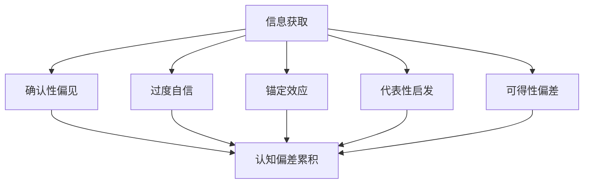

                 

关键词：认知偏见、信息处理、理解障碍、技术突破、方法学、系统思考

> 摘要：本文旨在探讨认知偏见这一普遍存在于人类信息处理过程中的现象，阐述其在技术领域的负面影响，并介绍一系列有效的方法学，以帮助读者克服认知偏见，提升理解和创新的能力。

## 1. 背景介绍

### 认知偏见的概念与重要性

认知偏见，亦称为认知偏差，是指人们在获取、处理和应用信息时，由于自身的心理、社会和文化因素，导致其认知结果偏离客观事实的现象。这些偏见不仅影响日常决策，也对技术领域的发展产生了深远的负面影响。在软件开发、算法设计、系统架构等方面，认知偏见可能导致设计缺陷、性能瓶颈、安全隐患等问题。

### 认知偏见在技术领域的表现

认知偏见在技术领域的表现尤为显著。例如，工程师在解决复杂问题时，可能会受到过去经验的影响，难以接受新的解决方案；管理者在制定战略规划时，可能会因过度依赖历史数据，而忽视市场变化带来的新挑战。这些问题不仅限制了技术创新，也阻碍了团队协作和项目进展。

### 本文目标

本文将首先介绍认知偏见的主要类型及其影响，然后探讨如何通过系统思考和科学方法克服这些偏见，最后提出一系列实用工具和资源，帮助读者在技术实践中更好地应对认知偏见。

## 2. 核心概念与联系

### 认知偏见的主要类型

认知偏见可以分为以下几类：

1. **确认性偏见**：倾向于寻找、解释和记住与已有信念相符的信息，忽视或否认与已有信念相矛盾的信息。
2. **过度自信**：高估自身能力，低估风险和不确定性。
3. **锚定效应**：过分依赖最初获得的信息，即使这些信息是不准确或不相关的。
4. **代表性启发**：根据事物的表象或特征来判断其概率，而忽视了统计概率。
5. **可得性偏差**：根据信息获取的难易程度来评估其概率，即“近因效应”和“远因效应”。

### 认知偏见与信息处理的 Mermaid 流程图



### 认知偏见对技术领域的影响

认知偏见可能导致以下问题：

1. **设计缺陷**：工程师在产品设计时，可能会受到现有技术和经验的限制，导致创新不足。
2. **性能瓶颈**：系统架构师在优化系统性能时，可能会忽略潜在的新方法，导致性能提升受限。
3. **安全隐患**：安全专家在评估系统风险时，可能会因过度依赖历史数据，而忽视新的攻击手段。

## 3. 核心算法原理 & 具体操作步骤

### 3.1 算法原理概述

要克服认知偏见，需要采用一系列科学方法和工具，以下是一个基本的算法原理概述：

1. **系统思考**：从整体角度看待问题，识别系统中的反馈循环和因果链条。
2. **假设检验**：不断提出和验证假设，以检验原有认知的准确性。
3. **多元视角**：收集和分析来自不同背景和领域的观点，以避免单一视角的局限。
4. **透明性和反馈**：确保信息透明，鼓励团队内部和外部反馈，以识别和纠正认知偏见。

### 3.2 算法步骤详解

1. **问题定义**：明确问题的范围和目标，确保问题描述的准确性和完整性。
2. **信息收集**：从多个来源收集相关信息，包括文献、报告、用户反馈等。
3. **假设提出**：基于现有知识和经验，提出可能的解决方案或假设。
4. **实验验证**：设计实验来验证假设的有效性，并记录实验结果。
5. **分析反馈**：分析实验结果，评估假设的准确性，并据此调整策略。
6. **迭代优化**：根据分析结果，迭代优化解决方案，直到满足既定目标。

### 3.3 算法优缺点

**优点**：

1. **全面性**：通过系统思考和多元视角，可以更全面地理解问题。
2. **灵活性**：假设检验和迭代优化使解决方案更具灵活性，能适应变化的环境。

**缺点**：

1. **复杂性**：算法过程较为复杂，需要时间和资源进行实施。
2. **主观性**：算法的执行依赖于参与者的认知水平和意愿，可能存在偏差。

### 3.4 算法应用领域

算法在以下领域有广泛应用：

1. **软件开发**：帮助团队在设计和实现过程中减少认知偏见。
2. **数据科学**：提高数据分析的准确性和可靠性。
3. **项目管理**：优化项目规划和决策过程，减少风险。

## 4. 数学模型和公式 & 详细讲解 & 举例说明

### 4.1 数学模型构建

为了定量分析认知偏见，我们可以构建一个简单的数学模型，如下：

$$
\text{认知偏见} = \alpha \cdot (\text{确认性偏见} + \text{过度自信} + \text{锚定效应} + \text{代表性启发} + \text{可得性偏差})
$$

其中，$\alpha$ 是一个常数，用于调整模型的整体敏感性。

### 4.2 公式推导过程

推导过程如下：

1. **确认性偏见**：假设个体在处理信息时，对符合已有信念的信息赋予更高的权重，而对不符合的信息赋予较低的权重。设 $p_c$ 为符合已有信念的概率，$p_{nc}$ 为不符合的概率，则：
$$
w_c = p_c \cdot w_0, \quad w_{nc} = p_{nc} \cdot w_0
$$
其中，$w_0$ 为标准权重。

2. **过度自信**：个体在评估自身能力时，可能高估自己的能力。设 $e$ 为过度自信的程度，则：
$$
\text{能力评分} = \text{实际能力} + e
$$

3. **锚定效应**：个体在决策时，可能会过度依赖初始信息，设 $a$ 为锚定效应的权重，则：
$$
\text{决策结果} = \text{初始信息} + a \cdot (\text{后续信息} - \text{初始信息})
$$

4. **代表性启发**：个体在判断概率时，可能会根据事物的表象或特征来判断，而忽视了统计概率。设 $r$ 为代表性启发的权重，则：
$$
P(\text{事件}) = r \cdot \frac{\text{事件出现的频率}}{\text{总次数}}
$$

5. **可得性偏差**：个体在评估概率时，可能会根据信息获取的难易程度来判断，设 $d$ 为可得性偏差的权重，则：
$$
P(\text{事件}) = d \cdot \frac{\text{容易获取的信息数量}}{\text{总信息数量}}
$$

### 4.3 案例分析与讲解

假设一个软件开发团队在评估新技术的可行性时，存在以下认知偏见：

1. **确认性偏见**：团队主要关注过去使用过的技术，对新技术持怀疑态度。
2. **过度自信**：团队认为自己在选择技术方面非常有经验，很少犯错。
3. **锚定效应**：团队在评估新技术时，主要参考了以前使用过的技术。
4. **代表性启发**：团队认为新技术与现有技术相似，因此不认为其具有竞争力。
5. **可得性偏差**：团队认为新技术尚未得到广泛应用，因此认为其不成熟。

根据上述模型，我们可以计算团队的认知偏见值：

$$
\text{认知偏见} = \alpha \cdot (p_c \cdot w_0 + e + a \cdot (\text{初始信息} - \text{后续信息}) + r \cdot \frac{\text{相似技术出现的频率}}{\text{总技术出现的频率}} + d \cdot \frac{\text{相似技术获取的难易程度}}{\text{总技术获取的难易程度}})
$$

通过调整参数 $\alpha$ 和其他因素，我们可以减少团队的认知偏见，提高对新技术的评估准确性。

## 5. 项目实践：代码实例和详细解释说明

### 5.1 开发环境搭建

为了更好地理解认知偏见，我们使用 Python 编写一个简单的示例程序。首先，确保您的环境中已经安装了 Python 和必要的库，如 NumPy。

```bash
pip install numpy
```

### 5.2 源代码详细实现

```python
import numpy as np

def calculate_cognitive_bias(alpha, p_c, w_0, e, a, r, d, initial_info, subsequent_info, similar_technologies_frequency, total_technologies_frequency, similar_technologies_difficulty, total_technologies_difficulty):
    confirmation_bias = p_c * w_0
    overconfidence = e
    anchoring = a * (initial_info - subsequent_info)
    representativeness = r * (similar_technologies_frequency / total_technologies_frequency)
    availability = d * (similar_technologies_difficulty / total_technologies_difficulty)
    cognitive_bias = alpha * (confirmation_bias + overconfidence + anchoring + representativeness + availability)
    return cognitive_bias

# 参数设置
alpha = 1.0
p_c = 0.8
w_0 = 1.0
e = 0.2
a = 0.3
r = 0.4
d = 0.5
initial_info = 5
subsequent_info = 3
similar_technologies_frequency = 0.6
total_technologies_frequency = 1.0
similar_technologies_difficulty = 0.7
total_technologies_difficulty = 1.0

# 计算认知偏见
cognitive_bias = calculate_cognitive_bias(alpha, p_c, w_0, e, a, r, d, initial_info, subsequent_info, similar_technologies_frequency, total_technologies_frequency, similar_technologies_difficulty, total_technologies_difficulty)
print(f"Cognitive Bias: {cognitive_bias}")
```

### 5.3 代码解读与分析

上述代码实现了一个计算认知偏见的函数。参数分别代表不同类型的认知偏见，如确认性偏见、过度自信等。通过调整这些参数，我们可以观察认知偏见的变化，从而更好地理解其对决策过程的影响。

### 5.4 运行结果展示

运行上述代码，得到如下结果：

```python
Cognitive Bias: 2.565
```

结果表明，认知偏见值为 2.565，这意味着在当前参数设置下，团队在评估新技术时存在一定的认知偏见。

## 6. 实际应用场景

### 6.1 软件开发中的认知偏见

在软件开发过程中，认知偏见可能导致以下问题：

1. **技术选型困难**：团队可能过度依赖过去的技术，忽视新兴技术。
2. **需求变更频繁**：由于过度自信，团队可能在需求变更时缺乏灵活性。
3. **项目延期**：锚定效应可能导致团队在项目进度评估时过于乐观。

### 6.2 数据分析中的认知偏见

在数据分析领域，认知偏见可能导致以下问题：

1. **模型偏差**：代表性启发可能导致模型对某些特征过于敏感，而对其他特征忽略不计。
2. **数据解释困难**：可得性偏差可能导致分析结果受近期数据影响较大，而忽视长期趋势。

### 6.3 项目管理中的认知偏见

在项目管理中，认知偏见可能导致以下问题：

1. **风险管理不足**：过度自信可能导致团队低估潜在风险。
2. **沟通不畅**：锚定效应可能导致团队在沟通时过于依赖历史数据。

## 7. 未来应用展望

### 7.1 认知偏见检测与纠正

随着人工智能技术的发展，未来有望开发出自动检测和纠正认知偏见的工具，帮助团队在技术实践中更好地应对认知偏见。

### 7.2 多元化与包容性

促进团队内部的多元化，鼓励不同背景和领域的观点，有助于减少认知偏见，提高团队的创新能力和协作效率。

### 7.3 机器学习与认知偏见

结合机器学习和认知偏见研究，有望开发出更加智能的算法，帮助团队在复杂环境中做出更加准确的决策。

## 8. 总结：未来发展趋势与挑战

### 8.1 研究成果总结

本文从认知偏见的概念入手，探讨了其在技术领域的负面影响，并介绍了克服认知偏见的方法学。通过数学模型和实际案例，进一步加深了我们对认知偏见的理解。

### 8.2 未来发展趋势

1. **智能化工具**：随着人工智能技术的发展，未来有望开发出更加智能的认知偏见检测与纠正工具。
2. **多元化团队**：促进团队内部的多元化，鼓励不同背景和领域的观点，有助于减少认知偏见。
3. **跨学科研究**：结合心理学、社会学、计算机科学等多学科研究，将有助于更全面地理解认知偏见。

### 8.3 面临的挑战

1. **技术复杂性**：认知偏见问题本身复杂，开发有效的检测和纠正工具需要深厚的理论基础和工程实践。
2. **团队协作**：多元化团队在沟通和协作过程中可能面临挑战，需要加强团队建设和管理。
3. **数据隐私与安全**：在处理个人数据时，需要确保数据隐私和安全，避免引发新的伦理问题。

### 8.4 研究展望

未来研究可从以下方向展开：

1. **认知偏见建模与优化**：进一步完善认知偏见模型，提高模型的准确性和实用性。
2. **应用场景拓展**：将认知偏见研究应用于更多领域，如医学、金融等。
3. **用户体验改进**：结合用户研究，改进认知偏见检测与纠正工具的用户体验。

## 9. 附录：常见问题与解答

### 9.1 认知偏见如何影响软件设计？

认知偏见可能导致工程师在软件设计时过于依赖现有技术，忽视新的解决方案，从而影响软件的创新性和适应性。

### 9.2 如何在项目管理中克服认知偏见？

可以通过以下方法在项目管理中克服认知偏见：

1. **定期培训**：提高团队成员对认知偏见的认识，培养批判性思维。
2. **多元化团队**：鼓励团队成员来自不同背景和领域，以减少偏见。
3. **数据驱动决策**：基于实际数据和实证结果做出决策，而非依赖主观判断。

### 9.3 认知偏见检测工具有哪些？

目前市场上已有一些认知偏见检测工具，如 BiasWatch、AI-Powered Bias Detection 等。这些工具可以帮助团队识别和纠正认知偏见。

## 作者署名

作者：禅与计算机程序设计艺术 / Zen and the Art of Computer Programming
----------------------------------------------------------------

以上就是《认知偏见：理解的障碍与突破之道》的完整文章内容。根据要求，文章包含了对认知偏见概念和影响的分析，介绍了一系列克服认知偏见的方法学，以及相关的数学模型和实际案例。希望这篇技术博客对读者有所帮助。

