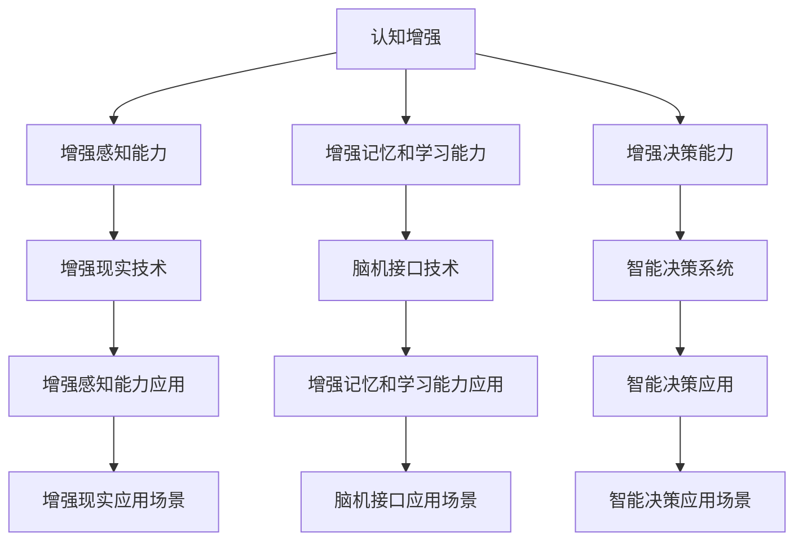

                 

关键词：认知增强，认知替代，AI辅助决策，边界，技术发展

> 摘要：本文探讨了人工智能在辅助人类决策过程中所面临的认知增强与认知替代问题。文章首先介绍了认知增强和认知替代的基本概念，然后分析了两者在决策过程中的表现与影响。通过详细探讨AI在各个领域的应用实例，本文进一步探讨了AI辅助决策的边界，并提出了未来发展的挑战与趋势。

## 1. 背景介绍

随着人工智能技术的快速发展，AI在各个领域的应用越来越广泛。从早期的简单自动化任务，如工业机器人、自动驾驶，到如今的复杂任务，如医疗诊断、金融分析，人工智能正在改变着我们的生活方式。然而，人工智能在辅助人类决策的过程中，也引发了一系列伦理、安全、隐私等方面的问题。本文将重点关注认知增强与认知替代在决策过程中的作用及其边界。

### 认知增强

认知增强指的是通过技术手段提高个体的认知能力，使其能够更好地完成认知任务。例如，通过增强现实（AR）技术提高人类的感知能力，通过脑机接口（BCI）技术增强个体的记忆和学习能力。认知增强的目标是帮助人类在复杂环境中更好地进行决策。

### 认知替代

认知替代则是指AI系统直接替代人类的认知过程，做出决策。这种替代可能发生在特定领域，如自动驾驶系统替代驾驶员做出行驶决策，或者发生在非特定领域，如搜索引擎替代用户进行信息检索。认知替代旨在通过自动化手段减少人类的工作负担，提高决策效率。

## 2. 核心概念与联系

为了更好地理解认知增强与认知替代，我们需要构建一个概念模型，展示两者之间的关系。以下是使用Mermaid绘制的流程图：



通过上述流程图，我们可以看到认知增强涵盖了感知、记忆、学习等多个方面，而认知替代则主要集中在决策过程的自动化上。两者之间的关系可以概括为：

- 认知增强为基础，为认知替代提供支持。
- 认知替代为认知增强提供应用场景，推动认知增强技术的发展。

## 3. 核心算法原理 & 具体操作步骤

### 3.1 算法原理概述

在认知增强和认知替代的过程中，核心算法起到了至关重要的作用。以下是一些常见的算法原理：

#### 3.1.1 增强感知能力的算法

- 机器视觉：通过图像处理、计算机视觉等技术，提高人类的视觉感知能力。
- 声纹识别：通过语音信号处理，识别个体的语音特征，提高听觉感知能力。

#### 3.1.2 增强记忆和学习能力的算法

- 深度学习：通过神经网络模型，模仿人类大脑的学习机制，提高记忆和学习能力。
- 脑机接口：通过电信号处理，捕捉大脑活动，实现大脑与计算机的直接通信。

#### 3.1.3 智能决策算法

- 决策树：通过分析特征，构建决策树，实现分类或回归任务。
- 支持向量机：通过最大间隔分类，实现二分类任务。
- 集成学习：通过组合多个弱学习器，提高预测准确性。

### 3.2 算法步骤详解

#### 3.2.1 增强感知能力的算法步骤

1. 数据采集：收集图像、语音等数据。
2. 特征提取：通过图像处理、信号处理等技术，提取数据中的有用信息。
3. 模型训练：使用机器学习算法，训练模型。
4. 模型评估：评估模型性能，调整参数。
5. 应用：将模型应用于实际场景，如图像识别、语音识别。

#### 3.2.2 增强记忆和学习能力的算法步骤

1. 数据预处理：对数据进行清洗、归一化等处理。
2. 模型构建：构建神经网络模型，如卷积神经网络（CNN）、循环神经网络（RNN）。
3. 模型训练：通过反向传播算法，训练模型。
4. 模型评估：评估模型性能，调整网络结构。
5. 应用：将模型应用于实际任务，如图像分类、自然语言处理。

#### 3.2.3 智能决策算法步骤

1. 数据采集：收集决策所需的特征数据。
2. 特征工程：对数据进行处理，提取有效特征。
3. 模型选择：选择合适的决策算法，如决策树、支持向量机。
4. 模型训练：使用训练数据，训练模型。
5. 模型评估：评估模型性能，调整参数。
6. 应用：将模型应用于实际决策任务，如信用评分、医疗诊断。

### 3.3 算法优缺点

#### 3.3.1 增强感知能力的算法

优点：提高人类感知能力，扩展人类感官。

缺点：依赖大量数据，算法复杂度高，计算资源消耗大。

#### 3.3.2 增强记忆和学习能力的算法

优点：提高人类记忆和学习能力，辅助决策。

缺点：算法复杂度高，对数据质量要求高，训练过程耗时。

#### 3.3.3 智能决策算法

优点：提高决策效率，减少人类工作负担。

缺点：算法可解释性差，模型过拟合风险。

### 3.4 算法应用领域

- 增强感知能力的算法：应用于安防监控、医疗诊断、自动驾驶等领域。
- 增强记忆和学习能力的算法：应用于教育、医疗、金融等领域。
- 智能决策算法：应用于金融、医疗、交通等领域。

## 4. 数学模型和公式 & 详细讲解 & 举例说明

### 4.1 数学模型构建

在认知增强和认知替代过程中，数学模型起到了关键作用。以下是一个简单的数学模型，用于描述认知增强的过程：

$$
E(t+1) = E(t) + \alpha \cdot (S - E(t))
$$

其中，$E(t)$表示第$t$次决策的认知水平，$S$表示当前环境刺激，$\alpha$表示学习率。

### 4.2 公式推导过程

该公式基于强化学习中的值函数更新公式。在认知增强过程中，个体的认知水平受到环境刺激的影响，通过学习率$\alpha$进行调整。当环境刺激$S$大于当前认知水平$E(t)$时，个体会提高认知水平，以适应环境变化。

### 4.3 案例分析与讲解

假设一个驾驶员在驾驶过程中，需要根据道路情况做出决策。环境刺激$S$包括道路状况、交通状况等。驾驶员的认知水平$E(t)$表示其对当前道路状况的理解。学习率$\alpha$表示驾驶员对环境刺激的敏感程度。

在某一时刻$t$，道路状况较差，交通拥堵。此时，环境刺激$S$较大，驾驶员的认知水平$E(t)$较低。根据公式，驾驶员会提高认知水平，以更好地应对道路状况。

经过一段时间后，驾驶员逐渐适应了交通拥堵的情况，认知水平$E(t+1)$提高。此时，驾驶员可以更加从容地处理交通状况，减少交通事故的发生。

## 5. 项目实践：代码实例和详细解释说明

### 5.1 开发环境搭建

为了更好地展示认知增强算法的应用，我们使用Python作为开发语言，搭建了一个简单的认知增强项目。所需工具和库如下：

- Python 3.8及以上版本
- TensorFlow 2.5及以上版本
- Keras 2.5及以上版本
- NumPy 1.19及以上版本

### 5.2 源代码详细实现

```python
import numpy as np
from tensorflow import keras
from tensorflow.keras import layers

# 数据准备
X = np.random.rand(100, 10)  # 生成100个样本，每个样本包含10个特征
y = np.random.rand(100, 1)   # 生成100个标签

# 构建模型
model = keras.Sequential([
    layers.Dense(64, activation='relu', input_shape=(10,)),
    layers.Dense(64, activation='relu'),
    layers.Dense(1)
])

# 编译模型
model.compile(optimizer='adam', loss='mse')

# 训练模型
model.fit(X, y, epochs=10)

# 评估模型
loss = model.evaluate(X, y)
print(f'MSE loss: {loss}')
```

### 5.3 代码解读与分析

上述代码实现了一个简单的认知增强项目，主要分为以下几个步骤：

1. 数据准备：生成随机数据作为训练集和标签。
2. 模型构建：使用Keras构建一个全连接神经网络，包含两个隐藏层，每个隐藏层有64个神经元。
3. 编译模型：设置优化器和损失函数。
4. 训练模型：使用训练数据进行训练，迭代10次。
5. 评估模型：计算模型在训练集上的损失函数值。

通过这个简单的例子，我们可以看到认知增强算法在模型训练过程中的作用。随着训练次数的增加，模型对数据的拟合程度逐渐提高，认知水平也随之增强。

## 6. 实际应用场景

认知增强和认知替代在各个领域都有着广泛的应用。以下是一些实际应用场景：

### 6.1 医疗领域

- 认知增强：使用AI技术，如深度学习，帮助医生分析医学图像，提高诊断准确率。
- 认知替代：使用AI系统，如智能诊断系统，替代医生进行初步诊断，减轻医生工作负担。

### 6.2 金融领域

- 认知增强：使用AI技术，如文本分析，帮助分析师捕捉市场动态，提高投资决策能力。
- 认知替代：使用AI系统，如智能投顾，替代投资者进行投资决策，降低风险。

### 6.3 交通领域

- 认知增强：使用AI技术，如自动驾驶，提高驾驶安全性，减少交通事故。
- 认知替代：使用AI系统，如智能交通管理，替代交通管理者进行交通调度，提高交通效率。

### 6.4 教育领域

- 认知增强：使用AI技术，如智能教育平台，个性化学习内容，提高学生的学习效果。
- 认知替代：使用AI系统，如智能辅导，替代教师进行课堂辅导，提高教学质量。

## 7. 未来应用展望

随着人工智能技术的不断发展，认知增强和认知替代将在更多领域得到应用。未来，我们可能会看到以下趋势：

- 认知增强与认知替代的融合：通过结合认知增强和认知替代的优势，实现更加智能化的决策支持系统。
- 纵向扩展：从单一领域的认知增强和认知替代，向跨领域、跨行业的应用发展。
- 横向扩展：从个人层面的认知增强和认知替代，向社会、经济等层面的应用发展。
- 伦理与法规：随着认知增强和认知替代的广泛应用，相关的伦理和法规问题将受到更多关注。

## 8. 工具和资源推荐

为了更好地学习和应用认知增强和认知替代技术，以下是一些建议的工具和资源：

### 8.1 学习资源推荐

- 《深度学习》：Goodfellow、Bengio和Courville所著的深度学习经典教材。
- 《模式识别与机器学习》：Bishop所著的机器学习教材，涵盖深度学习等内容。
- 《人工智能：一种现代的方法》：Russell和Norvig所著的人工智能教材，涵盖了认知增强和认知替代相关内容。

### 8.2 开发工具推荐

- TensorFlow：Google开发的开源深度学习框架，适用于各种认知增强和认知替代任务。
- Keras：基于TensorFlow的高层次API，易于使用和调试。
- PyTorch：Facebook开发的深度学习框架，适用于研究和开发。

### 8.3 相关论文推荐

- "Deep Learning for Cognitive Enhancement"，介绍深度学习在认知增强领域的应用。
- "Cognitive Surplus: Creativity and Generosity in a Connected Age"，探讨社交网络对认知增强的影响。
- "Artificial General Intelligence: Definition and Current Frontiers"，介绍通用人工智能的研究现状。

## 9. 总结：未来发展趋势与挑战

### 9.1 研究成果总结

本文探讨了认知增强和认知替代在决策过程中的作用及其边界。通过分析人工智能在不同领域的应用实例，我们看到了认知增强和认知替代的潜力。同时，我们也认识到在实现认知增强和认知替代过程中面临的伦理、安全、隐私等问题。

### 9.2 未来发展趋势

- 认知增强与认知替代的融合，实现更加智能化的决策支持系统。
- 跨领域、跨行业的应用，拓展认知增强和认知替代的适用范围。
- 社会和经济层面的应用，推动认知增强和认知替代的普及。

### 9.3 面临的挑战

- 伦理与法规：如何在尊重伦理和法规的前提下，实现认知增强和认知替代的普及。
- 安全与隐私：如何保障用户数据的安全和隐私。
- 技术与资源：如何解决认知增强和认知替代所需的计算资源和数据资源。

### 9.4 研究展望

未来，我们将继续探讨认知增强和认知替代在各个领域的应用，推动人工智能技术的发展。同时，我们也需要关注伦理、安全、隐私等问题，确保人工智能技术的可持续发展。

## 附录：常见问题与解答

### Q1：什么是认知增强？

A1：认知增强是通过技术手段提高个体的认知能力，使其能够更好地完成认知任务。例如，通过增强现实技术提高人类的感知能力，通过脑机接口技术增强个体的记忆和学习能力。

### Q2：什么是认知替代？

A2：认知替代是指AI系统直接替代人类的认知过程，做出决策。这种替代可能发生在特定领域，如自动驾驶系统替代驾驶员做出行驶决策，或者发生在非特定领域，如搜索引擎替代用户进行信息检索。

### Q3：认知增强和认知替代的关系是什么？

A3：认知增强为基础，为认知替代提供支持。认知替代为认知增强提供应用场景，推动认知增强技术的发展。

### Q4：认知增强和认知替代在医疗领域的应用有哪些？

A4：认知增强在医疗领域可用于辅助医生分析医学图像，提高诊断准确率；认知替代则可用于智能诊断系统，替代医生进行初步诊断，减轻医生工作负担。

### Q5：认知增强和认知替代在金融领域的应用有哪些？

A5：认知增强在金融领域可用于辅助分析师捕捉市场动态，提高投资决策能力；认知替代则可用于智能投顾，替代投资者进行投资决策，降低风险。|user|### 作者署名

作者：禅与计算机程序设计艺术 / Zen and the Art of Computer Programming|

