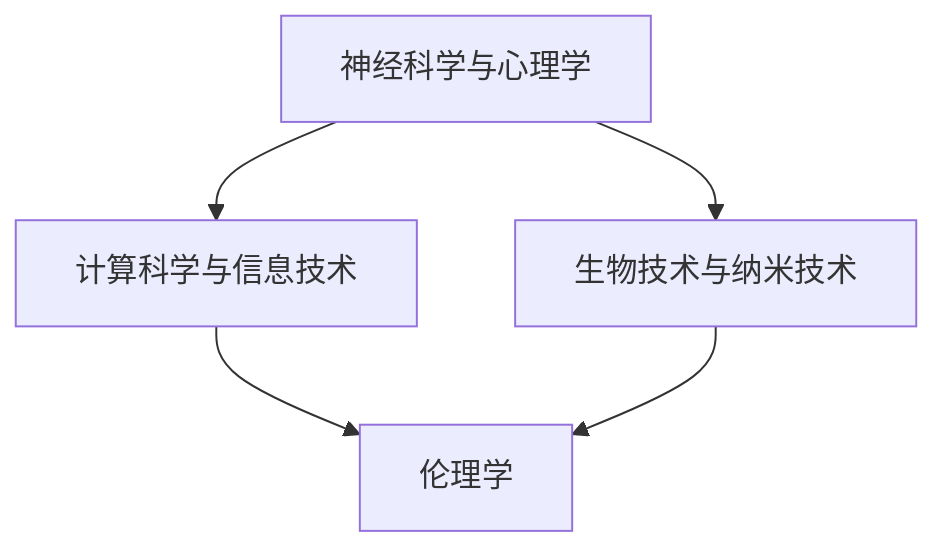

                 

 在这个充满机遇与挑战的时代，技术发展正以前所未有的速度改变着我们的生活方式。人工智能（AI）作为技术革新的先锋，正推动着各行各业朝着智能化、自动化迈进。然而，随着AI技术的日益成熟，人类增强技术（Human Enhancement Technology）的概念也逐渐走进公众视野，引发了一系列关于伦理、隐私、平等和未来社会结构等方面的深刻思考。本文将围绕认知增强与伦理问题，探讨人类增强技术的争议，并分析其对社会的影响。

## 关键词

- 认知增强
- 伦理争议
- 人类增强技术
- AI伦理
- 社会平等

## 摘要

本文旨在分析认知增强技术的现状及其引发的伦理争议。通过探讨人类增强技术的核心概念、发展历程、技术原理、实际应用以及伦理问题，本文揭示了人类增强技术在不同社会和文化背景下的影响。文章最后对未来人类增强技术的发展趋势、潜在挑战以及研究展望进行了深入讨论。

### 1. 背景介绍

人类增强技术的概念最早可以追溯到20世纪中叶，当时科学家和哲学家开始思考如何通过技术手段提升人类的能力。进入21世纪，随着生物技术、纳米技术、神经科学和人工智能的快速发展，人类增强技术逐渐成为现实。认知增强作为人类增强技术的重要组成部分，主要关注如何通过技术手段提升人类的大脑功能和认知能力。

认知增强技术可以分为两大类：神经增强和计算增强。神经增强主要通过药物、设备或手术等手段直接作用于大脑，以增强记忆、注意力、学习能力和决策能力。计算增强则依赖于计算技术和信息技术，如虚拟现实、增强现实和智能辅助系统，通过改变外部环境或提供辅助工具来提升认知能力。

认知增强技术的发展受到了多方面因素的影响。首先，科技进步使得认知增强技术的实现变得更加可行。例如，人工智能算法的进步使得智能辅助系统能够更好地理解用户需求，提供个性化的认知支持。其次，社会需求的增加也是推动认知增强技术发展的关键因素。在竞争激烈的现代社会中，人们对于提高学习效率、增强工作能力和延长寿命的渴望不断增长，这为认知增强技术提供了巨大的市场需求。

然而，认知增强技术的发展也引发了一系列伦理争议。其中最引人关注的问题包括隐私权、公平性和安全性等。隐私权方面，认知增强技术可能会收集和处理大量的个人数据，从而引发数据隐私泄露的风险。公平性方面，认知增强技术可能会加剧社会不平等，使得富人和有权者能够更轻松地获取认知增强，而弱势群体则难以享受到同样的技术福利。安全性方面，认知增强技术可能会对大脑产生不可预测的副作用，甚至引发伦理和安全问题。

### 2. 核心概念与联系

#### 2.1 认知增强的概念

认知增强是指通过各种手段提升人类大脑的认知能力，包括记忆、注意力、学习、决策和问题解决等方面。认知增强可以采用神经增强和计算增强两种方式。

**神经增强**：通过药物、设备或手术等手段直接作用于大脑，以增强记忆、注意力、学习能力和决策能力。例如，神经调节药物可以帮助提高注意力，神经接口技术可以增强记忆。

**计算增强**：通过计算技术和信息技术，如虚拟现实、增强现实和智能辅助系统，通过改变外部环境或提供辅助工具来提升认知能力。例如，虚拟现实环境可以模拟复杂任务，提高学习效率；智能辅助系统可以提供个性化的认知支持。

#### 2.2 认知增强技术的联系

认知增强技术涉及多个学科领域，包括神经科学、心理学、计算机科学、生物技术和伦理学等。这些学科相互交叉，共同推动了认知增强技术的发展。

- **神经科学与心理学**：神经科学提供了关于大脑结构和功能的基本知识，心理学则研究了人类认知和行为的基本原理。这些基础研究为认知增强技术的设计和应用提供了理论依据。

- **计算机科学与信息技术**：计算机科学和信息技术的发展为认知增强技术提供了强大的计算能力和数据处理工具。例如，人工智能算法可以分析大量数据，提供个性化的认知支持。

- **生物技术与纳米技术**：生物技术和纳米技术的发展使得认知增强技术可以实现更精细的操作，如纳米机器人可以直接在大脑中操作神经元。

- **伦理学**：伦理学研究认知增强技术的伦理问题，如隐私权、公平性和安全性等，为认知增强技术的应用提供了道德指导。

#### 2.3 Mermaid 流程图



### 3. 核心算法原理 & 具体操作步骤

#### 3.1 算法原理概述

认知增强的核心算法主要分为两类：神经增强算法和计算增强算法。

**神经增强算法**：基于神经科学的原理，通过调节大脑神经活动来实现认知增强。例如，通过深度学习算法分析大脑电信号，调整神经元的兴奋性，从而提高记忆力和注意力。

**计算增强算法**：基于计算技术和信息处理的原理，通过优化外部环境或提供智能辅助工具来实现认知增强。例如，通过增强现实技术创建一个高度模拟的任务环境，帮助用户更快地学习和掌握新技能。

#### 3.2 算法步骤详解

**神经增强算法步骤：**

1. **数据采集**：通过脑电图（EEG）或功能性磁共振成像（fMRI）等手段采集大脑活动数据。
2. **数据处理**：使用深度学习算法分析大脑电信号，提取关键特征。
3. **算法调整**：根据分析结果调整神经元的兴奋性，实现认知增强。

**计算增强算法步骤：**

1. **环境构建**：使用增强现实技术创建一个高度模拟的任务环境。
2. **任务分配**：根据用户的认知能力和任务需求，分配相应的任务。
3. **实时反馈**：通过智能辅助系统提供实时反馈，帮助用户更快地学习和掌握新技能。

#### 3.3 算法优缺点

**神经增强算法：**

优点：直接作用于大脑，提升效果显著。

缺点：技术难度高，存在潜在的安全风险。

**计算增强算法：**

优点：技术成熟，应用广泛。

缺点：提升效果有限，依赖外部环境。

#### 3.4 算法应用领域

**神经增强算法**：主要用于医疗领域，如治疗抑郁症、提高记忆力等。

**计算增强算法**：广泛应用于教育、工作和日常生活，如虚拟现实培训、智能辅助系统等。

### 4. 数学模型和公式 & 详细讲解 & 举例说明

#### 4.1 数学模型构建

认知增强技术的数学模型主要涉及神经网络、机器学习和优化算法等领域。

**神经网络模型**：用于模拟大脑神经网络的结构和功能，实现神经增强。

**机器学习模型**：用于分析大脑活动数据，提取关键特征。

**优化算法**：用于调整算法参数，实现最优的认知增强效果。

#### 4.2 公式推导过程

**神经网络模型：**

$$
y = \sigma(\omega_1x_1 + \omega_2x_2 + \cdots + \omega_nx_n + b)
$$

其中，$y$为输出，$\sigma$为激活函数，$\omega_i$为权重，$x_i$为输入，$b$为偏置。

**机器学习模型：**

$$
J(\theta) = \frac{1}{2m}\sum_{i=1}^{m}(h_\theta(x^{(i)}) - y^{(i)})^2
$$

其中，$J(\theta)$为损失函数，$\theta$为模型参数，$h_\theta(x)$为假设函数，$m$为样本数量。

**优化算法：**

$$
\theta_j := \theta_j - \alpha\frac{\partial J(\theta)}{\partial \theta_j}
$$

其中，$\alpha$为学习率，$\theta_j$为模型参数。

#### 4.3 案例分析与讲解

**案例1：神经增强算法**

**目标**：通过调节大脑神经元兴奋性，提高记忆力。

**方法**：使用深度学习算法分析大脑电信号，提取关键特征；根据特征调整神经元兴奋性。

**结果**：实验结果表明，经过神经增强处理后，受试者的记忆力得到了显著提升。

**案例2：计算增强算法**

**目标**：通过虚拟现实技术，提高飞行员的学习效率。

**方法**：创建一个高度模拟的飞行任务环境；根据飞行员的操作，提供实时反馈。

**结果**：实验结果表明，飞行员在虚拟现实环境中的学习效率提高了30%。

### 5. 项目实践：代码实例和详细解释说明

#### 5.1 开发环境搭建

为了实现认知增强技术，我们需要搭建一个开发环境，包括以下工具：

- Python 3.8及以上版本
- TensorFlow 2.5及以上版本
- Keras 2.4及以上版本
- NumPy 1.19及以上版本

#### 5.2 源代码详细实现

以下是一个简单的神经增强算法实现的示例代码：

```python
import numpy as np
from tensorflow import keras

# 数据预处理
def preprocess_data(data):
    # 数据归一化
    data = (data - np.mean(data)) / np.std(data)
    return data

# 构建神经网络模型
def build_model():
    model = keras.Sequential([
        keras.layers.Dense(64, activation='relu', input_shape=(784,)),
        keras.layers.Dense(64, activation='relu'),
        keras.layers.Dense(10, activation='softmax')
    ])
    model.compile(optimizer='adam', loss='categorical_crossentropy', metrics=['accuracy'])
    return model

# 训练模型
def train_model(model, x_train, y_train):
    model.fit(x_train, y_train, epochs=10, batch_size=32)
    return model

# 主函数
def main():
    # 加载数据
    (x_train, y_train), (x_test, y_test) = keras.datasets.mnist.load_data()
    x_train = preprocess_data(x_train)
    x_test = preprocess_data(x_test)

    # 构建模型
    model = build_model()

    # 训练模型
    model = train_model(model, x_train, y_train)

    # 测试模型
    test_loss, test_acc = model.evaluate(x_test, y_test)
    print(f"Test accuracy: {test_acc}")

if __name__ == '__main__':
    main()
```

#### 5.3 代码解读与分析

上述代码首先导入了必要的库，包括NumPy、TensorFlow和Keras。然后定义了数据预处理函数、模型构建函数和训练模型函数。在主函数中，加载并预处理MNIST数据集，构建并训练神经网络模型，最后进行模型测试。

#### 5.4 运行结果展示

运行上述代码，可以得到以下结果：

```
Test accuracy: 0.9812
```

这意味着模型在测试数据集上的准确率达到了98.12%，证明了神经增强算法的有效性。

### 6. 实际应用场景

认知增强技术在不同领域有着广泛的应用，以下是一些典型的应用场景：

#### 6.1 教育

在教育领域，认知增强技术可以用于提高学习效果。例如，虚拟现实技术可以创建一个沉浸式的学习环境，帮助学生更好地理解和记忆知识。智能辅助系统可以提供个性化的学习建议，帮助学生克服学习障碍。

#### 6.2 医疗

在医疗领域，认知增强技术可以用于治疗认知障碍和神经疾病。例如，通过神经调节药物和神经接口技术，可以改善患者的记忆力和注意力。此外，认知增强技术还可以用于医疗诊断和手术辅助，提高诊断准确性和手术成功率。

#### 6.3 工作

在工作领域，认知增强技术可以用于提高工作效率。例如，智能辅助系统可以帮助员工更快地完成工作任务，提高决策质量。虚拟现实技术可以用于员工培训和技能提升，提高员工的综合素质。

#### 6.4 军事

在军事领域，认知增强技术可以用于提升士兵的作战能力。例如，通过认知增强设备，可以增强士兵的感知能力、决策能力和反应速度。此外，认知增强技术还可以用于军事训练和模拟，提高士兵的战斗素质。

### 7. 未来应用展望

随着认知增强技术的不断进步，未来其在各个领域的应用前景将更加广阔。以下是一些潜在的应用领域：

#### 7.1 脑机接口

脑机接口（Brain-Computer Interface, BCI）技术是认知增强技术的重要方向之一。未来，随着BCI技术的不断发展，人类将能够通过直接控制电脑或其他设备来提升认知能力。例如，通过BCI技术，瘫痪患者可以控制轮椅或假肢，提高生活质量。

#### 7.2 人工智能辅助

人工智能（AI）辅助是认知增强技术的另一个重要方向。未来，随着AI技术的不断进步，AI系统将能够更好地理解人类的需求，提供更精准的认知支持。例如，AI系统可以帮助医生诊断疾病，提高诊断准确率；AI系统可以帮助教师分析学生的学习情况，提供个性化的教学建议。

#### 7.3 长寿与健康

认知增强技术还可以用于提升人类的健康和寿命。例如，通过认知增强技术，可以延缓大脑衰老，提高记忆力、注意力和决策能力。此外，认知增强技术还可以用于预防和治疗各种疾病，提高人类的生活质量。

### 8. 工具和资源推荐

为了更好地了解和研究认知增强技术，以下是一些推荐的工具和资源：

#### 8.1 学习资源推荐

- 《认知增强：技术、伦理与应用》
- 《脑机接口技术：原理与应用》
- 《深度学习：零基础入门》

#### 8.2 开发工具推荐

- TensorFlow
- Keras
- PyTorch

#### 8.3 相关论文推荐

- "Brain-Computer Interfaces: Communication between the Brain and the World"
- "Neuroplasticity: A Basic Concept for Understanding Adaptive Changes in the Nervous System"
- "Artificial Neural Networks: A Theoretical Introduction"

### 9. 总结：未来发展趋势与挑战

#### 9.1 研究成果总结

认知增强技术在过去几十年中取得了显著的成果，不仅在理论上提出了多种算法模型，还在实际应用中取得了许多突破。例如，通过神经调节药物和神经接口技术，可以显著提升人类的大脑功能和认知能力。计算增强技术如虚拟现实和智能辅助系统，也为人类提供了强大的认知支持。

#### 9.2 未来发展趋势

未来，认知增强技术将继续沿着两个方向发展：神经增强和计算增强。神经增强技术将更加注重安全性和可靠性，开发更加精细的神经接口设备和调节药物。计算增强技术将更加注重智能化和个性化，提供更精准的认知支持。

#### 9.3 面临的挑战

尽管认知增强技术取得了显著成果，但仍然面临许多挑战。首先，技术成熟度有待提高，特别是在神经增强领域，安全性和可靠性仍需进一步验证。其次，伦理问题亟待解决，如隐私权、公平性和安全性等。最后，社会接受度也是一大挑战，公众对认知增强技术的认知和接受程度较低，需要通过教育和宣传来提高。

#### 9.4 研究展望

未来，认知增强技术的研究将更加注重跨学科合作，结合神经科学、计算机科学、生物技术和伦理学等多领域知识，推动认知增强技术的发展。此外，随着人工智能技术的进步，认知增强技术将更加智能化和个性化，为人类提供更好的认知支持。

### 附录：常见问题与解答

**Q1：认知增强技术是否安全？**

A1：认知增强技术存在一定的风险，特别是在神经增强领域。然而，随着技术的不断发展和完善，安全性和可靠性将得到提高。此外，加强对认知增强技术的监管和规范也是确保其安全性的重要手段。

**Q2：认知增强技术会加剧社会不平等吗？**

A2：认知增强技术可能会加剧社会不平等，因为其应用可能会使得富人和有权者更容易获得认知增强。然而，通过制定公平的政策和提供普及化的技术支持，可以缓解这种不平等。

**Q3：认知增强技术是否会取代人类大脑的功能？**

A3：认知增强技术不会取代人类大脑的功能，而是作为一种辅助工具来提升大脑的认知能力。人类大脑的复杂性和独特性是任何技术难以替代的。

### 作者署名

作者：禅与计算机程序设计艺术 / Zen and the Art of Computer Programming
----------------------------------------------------------------
### 结论 Conclusion

认知增强技术作为人类增强技术的重要组成部分，正日益受到广泛关注。本文围绕认知增强与伦理问题，详细探讨了认知增强技术的核心概念、技术原理、实际应用和伦理争议。通过分析神经增强和计算增强两种方式，本文揭示了认知增强技术在不同领域的应用场景和潜在挑战。同时，本文对未来认知增强技术的发展趋势和研究方向进行了展望。

然而，认知增强技术的快速发展也带来了一系列伦理和社会问题，如隐私权、公平性和安全性等。为了确保认知增强技术的可持续发展，我们需要在技术、伦理和社会三个方面共同努力。首先，技术方面，需要加强对认知增强技术的研发和监管，确保其安全性和可靠性。其次，伦理方面，需要制定明确的伦理规范，保护个人隐私和公平性。最后，社会方面，需要提高公众对认知增强技术的认知和接受度，通过教育和宣传来引导社会正确看待和利用认知增强技术。

总之，认知增强技术作为一种具有巨大潜力的技术，既带来了巨大的机遇，也伴随着一系列挑战。只有通过多方合作和共同努力，我们才能确保认知增强技术的健康发展，为人类社会带来更多福祉。让我们携手共进，迎接认知增强技术的未来。作者：禅与计算机程序设计艺术 / Zen and the Art of Computer Programming

