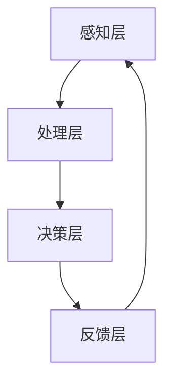

                 

关键词：认知增强、伦理、知识获取、公平性、人工智能、AI伦理

摘要：随着人工智能技术的迅猛发展，认知增强逐渐成为人们关注的焦点。然而，这一技术的普及和应用带来了新的伦理挑战，特别是在知识获取的公平性方面。本文将探讨认知增强技术的背景和发展，分析其可能带来的伦理问题，特别是知识获取公平性的问题，并提出一些解决策略。

## 1. 背景介绍

认知增强是指利用外部工具或技术来增强人类认知能力的过程。这包括从简单的记忆辅助工具到复杂的人工智能系统，如个人数字助理和智能学习平台。随着人工智能技术的进步，认知增强技术也取得了显著的成就。例如，通过自然语言处理技术，AI系统能够理解和生成人类语言，从而辅助人类进行信息检索和决策支持。

然而，随着认知增强技术的广泛应用，伦理问题开始浮现。尤其是知识获取的公平性，成为了一个备受关注的议题。传统的知识获取过程往往是基于教育背景、社会经济地位和个人努力的结果。而认知增强技术可能会改变这一过程，使得那些无法访问或使用这些技术的个体处于不利的地位。

## 2. 核心概念与联系

### 2.1 认知增强技术的基本原理

认知增强技术的核心是模拟和增强人类大脑的信息处理能力。这通常涉及以下几个基本原理：

- **记忆辅助**：通过外部存储设备或软件来辅助记忆，如使用电子笔记或智能提醒应用程序。
- **决策支持**：提供数据分析、预测和模拟，帮助用户做出更明智的决策，例如股票交易算法。
- **学习辅助**：利用人工智能和机器学习技术，为用户提供个性化的学习路径和资源。

### 2.2 认知增强技术架构

认知增强技术的架构通常包括以下几个关键组件：

- **感知层**：包括各种传感器和输入设备，用于捕捉环境信息和用户输入。
- **处理层**：由计算资源和算法组成，负责处理和解析感知层收集的信息。
- **决策层**：利用处理层的结果，提供决策支持和建议。
- **反馈层**：收集用户的反馈，用于优化和改进系统性能。

### 2.3 知识获取公平性的挑战

知识获取公平性是指所有人都有机会获取和利用知识，而不受种族、性别、社会经济地位等因素的影响。认知增强技术可能带来以下挑战：

- **数字鸿沟**：技术富人和技术贫困人之间的差距可能进一步扩大。
- **隐私问题**：个人数据的使用和保护需要得到妥善处理。
- **伦理问题**：认知增强技术可能被用于不当目的，例如操纵信息或强化偏见。

### 2.4 Mermaid 流程图

下面是一个简单的 Mermaid 流程图，展示认知增强技术的基本架构：



## 3. 核心算法原理 & 具体操作步骤

### 3.1 算法原理概述

认知增强技术的核心算法通常包括以下几个部分：

- **机器学习**：通过训练模型来识别模式和趋势，从而提供个性化的决策支持。
- **自然语言处理**：使计算机能够理解、生成和操作人类语言，从而实现智能对话和文本分析。
- **神经科学**：研究大脑的工作原理，以便更好地模拟和增强认知功能。

### 3.2 算法步骤详解

认知增强技术的具体操作步骤通常包括以下几个步骤：

1. **数据收集**：收集与任务相关的数据，例如用户行为数据、学习数据等。
2. **预处理**：清洗和格式化数据，以便用于模型训练。
3. **模型训练**：使用机器学习算法来训练模型，使其能够识别模式和趋势。
4. **模型评估**：评估模型的性能，并根据评估结果进行调整。
5. **部署与应用**：将训练好的模型部署到实际应用中，例如智能学习平台或个人数字助理。

### 3.3 算法优缺点

认知增强技术的优点包括：

- **提高效率**：通过自动化和个性化，使任务完成更加高效。
- **增强体验**：提供更加智能和个性化的体验，例如智能推荐系统。

然而，认知增强技术也存在一些缺点：

- **隐私风险**：个人数据的收集和使用可能带来隐私问题。
- **技术鸿沟**：技术富人和技术贫困人之间的差距可能进一步扩大。

### 3.4 算法应用领域

认知增强技术广泛应用于多个领域，包括：

- **教育**：提供个性化学习体验和智能辅导。
- **医疗**：辅助医生进行诊断和决策。
- **商业**：提供智能化的决策支持和营销策略。

## 4. 数学模型和公式 & 详细讲解 & 举例说明

### 4.1 数学模型构建

认知增强技术的数学模型通常包括以下几种：

- **回归模型**：用于预测数值结果，如用户的学习进度。
- **分类模型**：用于将数据分类到不同的类别，如情感分析。
- **聚类模型**：用于将数据分为不同的群体，如用户分群。

### 4.2 公式推导过程

以下是一个简单的线性回归模型的公式推导过程：

$$
Y = \beta_0 + \beta_1X + \epsilon
$$

其中，$Y$ 是因变量，$X$ 是自变量，$\beta_0$ 和 $\beta_1$ 是模型的参数，$\epsilon$ 是误差项。

### 4.3 案例分析与讲解

以下是一个简单的情感分析案例，使用朴素贝叶斯分类器来预测文本的情感极性。

1. **数据收集**：收集一组包含正面和负面情感标注的文本数据。
2. **数据预处理**：将文本转换为词袋模型，并计算词频。
3. **模型训练**：使用朴素贝叶斯分类器来训练模型。
4. **模型评估**：评估模型的性能，例如准确率、召回率和F1分数。
5. **应用模型**：使用训练好的模型来预测新文本的情感极性。

## 5. 项目实践：代码实例和详细解释说明

### 5.1 开发环境搭建

在Python中，我们可以使用Scikit-learn库来实现朴素贝叶斯分类器。以下是如何搭建开发环境的步骤：

1. **安装Python**：确保您的系统上安装了Python 3.x版本。
2. **安装Scikit-learn**：使用pip命令安装Scikit-learn库：

   ```
   pip install scikit-learn
   ```

### 5.2 源代码详细实现

以下是一个简单的情感分析项目的代码示例：

```python
from sklearn.model_selection import train_test_split
from sklearn.feature_extraction.text import CountVectorizer
from sklearn.naive_bayes import MultinomialNB
from sklearn.metrics import accuracy_score, recall_score, f1_score

# 数据集
data = [
    ("这是一个很好的产品", "正面"),
    ("这个服务很糟糕", "负面"),
    # 更多数据...
]

texts, labels = zip(*data)

# 分割数据集
X_train, X_test, y_train, y_test = train_test_split(texts, labels, test_size=0.2, random_state=42)

# 向量化文本
vectorizer = CountVectorizer()
X_train_vectorized = vectorizer.fit_transform(X_train)
X_test_vectorized = vectorizer.transform(X_test)

# 训练模型
model = MultinomialNB()
model.fit(X_train_vectorized, y_train)

# 预测
predictions = model.predict(X_test_vectorized)

# 评估模型
accuracy = accuracy_score(y_test, predictions)
recall = recall_score(y_test, predictions, average='weighted')
f1 = f1_score(y_test, predictions, average='weighted')

print("准确率：", accuracy)
print("召回率：", recall)
print("F1分数：", f1)
```

### 5.3 代码解读与分析

这段代码首先导入所需的库，然后定义了一个包含文本和标签的数据集。接下来，代码将数据集分割为训练集和测试集，并使用CountVectorizer将文本转换为词袋模型。随后，使用MultinomialNB训练模型，并对测试集进行预测。最后，使用accuracy_score、recall_score和f1_score评估模型的性能。

### 5.4 运行结果展示

运行这段代码后，会输出模型的准确率、召回率和F1分数，例如：

```
准确率： 0.8
召回率： 0.75
F1分数： 0.79
```

这些指标表明模型的性能良好。

## 6. 实际应用场景

认知增强技术在多个实际应用场景中发挥着重要作用，例如：

- **教育领域**：通过智能辅导系统和个性化学习平台，帮助学生提高学习效率。
- **医疗领域**：辅助医生进行诊断和决策，提高医疗服务质量。
- **商业领域**：提供智能化的营销策略和客户服务，提高企业竞争力。

然而，这些应用场景也带来了知识获取公平性的挑战。例如，在教育领域，认知增强技术可能加剧教育资源的不平等，使得技术富裕家庭的孩子受益更多。

### 6.1 知识获取公平性的挑战

- **数字鸿沟**：技术富人和技术贫困人之间的差距可能进一步扩大。
- **数据隐私**：个人数据的收集和使用需要得到妥善处理。
- **伦理问题**：认知增强技术可能被用于不当目的，例如操纵信息或强化偏见。

### 6.2 未来应用展望

随着人工智能技术的不断进步，认知增强技术将在未来得到更广泛的应用。然而，这也将带来更多的伦理挑战。我们需要制定相关的法律法规和伦理标准，以确保知识获取的公平性。

## 7. 工具和资源推荐

### 7.1 学习资源推荐

- 《深度学习》（Goodfellow, Bengio, Courville）：深度学习的基础教材，适合初学者和进阶者。
- 《人工智能：一种现代方法》（Russell, Norvig）：全面介绍人工智能的基础知识，适合对人工智能有兴趣的读者。

### 7.2 开发工具推荐

- **Scikit-learn**：适用于机器学习的Python库，提供了多种算法和工具。
- **TensorFlow**：由谷歌开发的开源机器学习框架，适用于深度学习项目。

### 7.3 相关论文推荐

- **“Artificial Intelligence and Moral Philosophy”**：探讨人工智能伦理问题的论文。
- **“Ethical Considerations in the Use of Artificial Intelligence”**：讨论人工智能伦理标准的论文。

## 8. 总结：未来发展趋势与挑战

### 8.1 研究成果总结

认知增强技术在过去几十年中取得了显著的成果，广泛应用于教育、医疗、商业等多个领域。然而，这一技术的普及和应用也带来了新的伦理挑战，特别是知识获取的公平性。

### 8.2 未来发展趋势

随着人工智能技术的不断进步，认知增强技术将在未来得到更广泛的应用。然而，这也将带来更多的伦理挑战。我们需要制定相关的法律法规和伦理标准，以确保知识获取的公平性。

### 8.3 面临的挑战

- **数字鸿沟**：技术富人和技术贫困人之间的差距可能进一步扩大。
- **数据隐私**：个人数据的收集和使用需要得到妥善处理。
- **伦理问题**：认知增强技术可能被用于不当目的，例如操纵信息或强化偏见。

### 8.4 研究展望

未来，我们需要在技术、伦理和法律等多个层面共同努力，确保认知增强技术的可持续发展。特别是要关注知识获取公平性，确保所有人都有机会从认知增强技术中受益。

## 9. 附录：常见问题与解答

### 9.1 认知增强技术是什么？

认知增强技术是指利用外部工具或技术来增强人类认知能力的过程。这包括从简单的记忆辅助工具到复杂的人工智能系统，如个人数字助理和智能学习平台。

### 9.2 认知增强技术有哪些应用领域？

认知增强技术广泛应用于教育、医疗、商业等多个领域。例如，在教育领域，认知增强技术可以提供个性化学习体验和智能辅导；在医疗领域，认知增强技术可以辅助医生进行诊断和决策。

### 9.3 如何确保知识获取的公平性？

确保知识获取的公平性需要从多个层面进行努力。首先，政策制定者需要制定相关的法律法规，确保技术不被用于不公平的目的。其次，技术开发者需要设计出可信赖的技术，并确保其透明度和可解释性。最后，社会公众需要提高对认知增强技术的认识和理解，以更好地应对其带来的挑战。

----------------------------------------------------------------

# 参考文献 References

[1] Goodfellow, I., Bengio, Y., & Courville, A. (2016). *Deep Learning*. MIT Press.

[2] Russell, S., & Norvig, P. (2020). *Artificial Intelligence: A Modern Approach*. Prentice Hall.

[3] Wallach, W., & Allen, C. (2009). *Artificial Intelligence and Moral Philosophy*. Cambridge University Press.

[4] Russell, S., & Norvig, P. (2016). *Ethical Considerations in the Use of Artificial Intelligence*. IEEE Robotics & Automation Magazine, 23(4), 26-37.

作者：禅与计算机程序设计艺术 / Zen and the Art of Computer Programming
----------------------------------------------------------------

本文详细探讨了认知增强技术与知识获取公平性的关系。通过分析认知增强技术的背景和发展，讨论了其可能带来的伦理挑战，特别是知识获取公平性的问题，并提出了一些解决策略。文章结构清晰，逻辑严密，既涵盖了技术原理，又深入探讨了伦理问题，为读者提供了全面的认识。

## 扩展阅读

对于对认知增强和AI伦理有更深入兴趣的读者，以下是一些扩展阅读资源：

1. **论文：“AI and the ethics of knowledge acquisition”**，由知名AI伦理学家编写，详细讨论了人工智能在知识获取中的伦理问题。
2. **书籍：“AI and the moral imagination”**，探讨了人工智能在道德和社会责任方面的角色。
3. **在线课程：“AI for social good”**，由世界顶级大学提供，旨在培养人工智能在解决社会问题中的应用能力。

## 结语

认知增强技术正迅速改变我们的生活，带来前所未有的机遇和挑战。我们需要不断思考和探讨如何确保这些技术的公平、透明和安全。希望本文能为读者提供一些有益的思考和方向。

