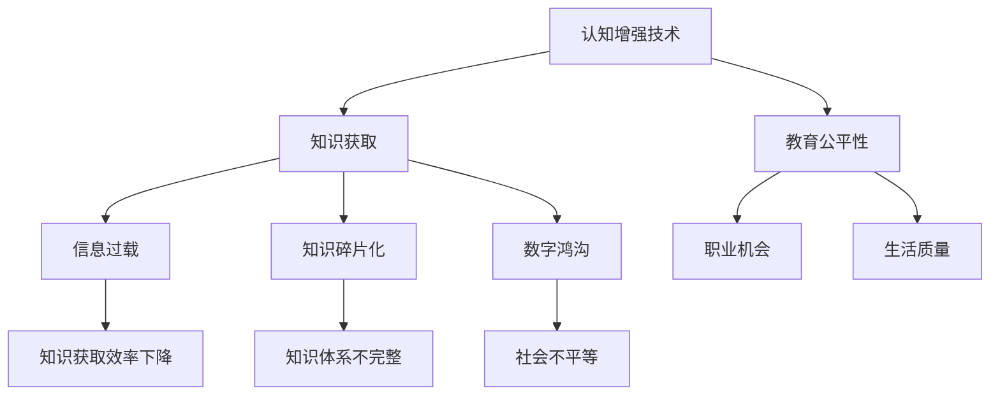

                 

 关键词：认知增强，伦理，知识获取，公平性，人工智能，技术进步，教育平等

> 摘要：随着人工智能技术的发展，认知增强工具逐渐普及，带来了知识获取的巨大变革。然而，这一变革也引发了关于知识获取公平性的深刻讨论。本文将探讨认知增强技术的现状与伦理问题，分析知识获取公平性的挑战，并展望未来的研究方向。

## 1. 背景介绍

在过去的几十年中，人工智能技术的发展如日中天，从简单的规则系统到复杂的深度学习模型，人工智能在多个领域都取得了显著的成就。其中，认知增强技术作为人工智能的一个重要分支，旨在通过技术手段提升人类的学习、思考和信息处理能力。认知增强工具的出现，使得人们能够更快速、高效地获取和处理知识，从而大大提高了个人和社会的生产力。

然而，这一技术进步的背后也隐藏着一系列伦理问题和公平性挑战。知识获取的便捷性带来了信息过载的问题，而不同群体在获取知识资源上的差异可能加剧社会不平等。因此，如何确保知识获取的公平性，成为了一个亟待解决的问题。

### 1.1 认知增强技术的定义与应用

认知增强技术是指利用信息技术和算法，通过优化大脑的认知过程来提升个体的认知能力和工作效率。常见的认知增强技术包括：

1. **记忆增强**：通过记忆训练软件或辅助设备，帮助个体提高记忆力和注意力。
2. **学习辅助**：利用在线教育平台、智能辅导系统和虚拟现实技术，提供个性化的学习体验。
3. **注意力增强**：通过耳机、眼动追踪设备等，帮助用户集中注意力，提高工作效率。
4. **思维拓展**：利用智能算法和数据分析，帮助个体更好地进行逻辑推理和创新思维。

这些技术的应用涵盖了从教育、医疗到商业等多个领域。例如，在教育领域，认知增强工具可以为学生提供个性化的学习资源，帮助他们更好地掌握知识；在医疗领域，认知增强技术可以帮助医生更快速地诊断和治疗疾病；在商业领域，认知增强技术可以提高员工的工作效率，增强企业的竞争力。

### 1.2 知识获取的变革与挑战

随着认知增强技术的普及，知识获取的方式和速度都发生了巨大的变化。人们不再依赖于传统的纸质书籍和课堂学习，而是通过互联网和移动设备随时随地获取信息。这种变革极大地提高了知识的传播效率和普及程度，但同时也带来了一系列挑战：

1. **信息过载**：由于信息的爆炸性增长，人们面临的信息过载问题日益严重。如何在海量的信息中筛选出有价值的内容，成为了一个重要的课题。
2. **知识碎片化**：互联网上的知识往往以碎片化的形式存在，这使得个体在获取知识时往往难以建立系统的知识体系。
3. **数字鸿沟**：不同群体在获取知识资源上的差异，可能加剧社会不平等。例如，经济条件较差的群体可能无法承担认知增强技术的费用，从而在教育、职业发展等方面处于不利地位。

### 1.3 知识获取公平性的重要性

知识获取公平性是社会公平的重要组成部分。一个社会中，如果知识获取存在不公平现象，那么这意味着某些群体将难以获得公平的教育和职业机会，进而影响他们的社会地位和生活质量。因此，确保知识获取的公平性，不仅是技术发展的需求，更是社会公平和正义的体现。

## 2. 核心概念与联系

在探讨认知增强与知识获取公平性的关系时，我们需要理解一系列核心概念和它们之间的联系。以下是这些核心概念及其关系的 Mermaid 流程图：



### 2.1 认知增强技术对知识获取的影响

认知增强技术通过提升个体的认知能力和工作效率，直接影响知识获取的效率和质量。例如，记忆增强工具可以帮助个体更好地记忆关键信息，学习辅助系统则可以为用户提供个性化的学习资源，提高学习效果。

### 2.2 信息过载与知识获取效率

信息过载是当前社会面临的一个重要问题。大量未经筛选的信息不仅增加了个体处理信息的负担，还可能导致知识获取效率的下降。因此，如何有效地筛选和利用信息，成为认知增强技术需要解决的一个关键问题。

### 2.3 知识碎片化与知识体系不完整

互联网上的知识往往是碎片化的，这使得个体在获取知识时难以建立完整的知识体系。认知增强技术可以通过整合和分析碎片化信息，帮助个体构建系统化的知识框架，提高知识获取的整体效率。

### 2.4 数字鸿沟与社会不平等

数字鸿沟是知识获取公平性面临的一个重要挑战。不同群体在获取知识资源上的差异，可能加剧社会不平等。认知增强技术可以通过降低使用门槛、提供免费资源等方式，缩小数字鸿沟，促进教育公平和社会正义。

## 3. 核心算法原理 & 具体操作步骤

在探讨认知增强技术时，核心算法的原理和具体操作步骤是理解这些技术如何提升知识获取效率的关键。以下是认知增强技术的核心算法原理和具体操作步骤：

### 3.1 算法原理概述

认知增强技术主要基于以下几个核心算法原理：

1. **神经网络的优化**：通过深度学习模型，对人类大脑的神经活动进行模拟和优化，提高个体的认知能力。
2. **信息过滤与筛选**：利用自然语言处理和机器学习算法，对海量的信息进行筛选和分类，帮助用户快速找到有价值的信息。
3. **个性化推荐**：通过用户行为分析和偏好模型，为用户提供个性化的学习资源和信息推荐，提高知识获取的效率。
4. **思维拓展算法**：利用复杂的算法和数据分析，帮助用户进行逻辑推理和创新思维，提高问题的解决能力。

### 3.2 算法步骤详解

以下是一个基于个性化推荐系统的认知增强技术的具体操作步骤：

1. **用户数据收集**：收集用户的学习历史、行为数据和偏好信息，包括学习时间、学习内容、互动方式等。
2. **数据预处理**：对收集到的数据进行清洗、去噪和标准化处理，确保数据的质量和一致性。
3. **特征提取**：利用自然语言处理和机器学习算法，从用户数据中提取关键特征，如关键词、主题和情感倾向等。
4. **构建推荐模型**：利用机器学习算法，如协同过滤、矩阵分解和深度学习等，构建个性化推荐模型。
5. **生成推荐列表**：根据用户的特征和推荐模型，生成个性化的学习资源和信息推荐列表。
6. **用户反馈**：收集用户对推荐列表的反馈，如点击率、停留时间和满意度等，用于模型优化和调整。
7. **模型迭代**：根据用户反馈，对推荐模型进行迭代优化，提高推荐质量。

### 3.3 算法优缺点

个性化推荐系统作为认知增强技术的一个重要应用，具有以下优缺点：

1. **优点**：
   - 提高知识获取的效率：通过个性化推荐，用户可以快速找到与自己兴趣相关的知识和资源。
   - 提高学习效果：个性化推荐可以帮助用户构建系统的知识体系，提高学习效果。
   - 促进教育公平：通过降低知识获取的门槛，个性化推荐有助于缩小数字鸿沟，促进教育公平。

2. **缺点**：
   - 信息过载风险：个性化推荐可能导致用户陷入“信息茧房”，只看到与自己观点一致的信息，影响认知多样性。
   - 隐私风险：用户数据的安全和隐私保护是推荐系统面临的一个重要问题。
   - 模型偏见：推荐系统可能因为数据偏差或算法设计问题，产生不公平的推荐结果。

### 3.4 算法应用领域

认知增强技术在不同领域的应用情况如下：

1. **教育领域**：个性化推荐系统可以帮助学生快速找到适合自己的学习资源和课程，提高学习效率。例如，在线教育平台如 Coursera 和 Khan Academy 已经广泛应用了这一技术。
2. **医疗领域**：认知增强技术可以帮助医生快速诊断和制定治疗方案，提高医疗效率。例如，IBM 的 Watson Health 系统利用自然语言处理和深度学习技术，为医生提供辅助诊断和治疗方案。
3. **商业领域**：认知增强技术可以帮助企业提高员工的工作效率，增强企业的竞争力。例如，微软的 Power BI 和 Tableau 等数据分析工具，通过数据可视化技术，帮助企业管理者快速了解业务状况，做出明智决策。

## 4. 数学模型和公式 & 详细讲解 & 举例说明

在认知增强技术中，数学模型和公式起着至关重要的作用。以下是几个关键的数学模型和公式的详细讲解及举例说明：

### 4.1 数学模型构建

在构建认知增强技术的数学模型时，我们通常需要考虑以下几个因素：

1. **用户行为模型**：通过分析用户的学习历史和交互行为，构建用户行为模型。常见的模型包括马尔可夫链模型、贝叶斯网络模型和深度学习模型。
2. **知识推荐模型**：基于用户行为模型，构建知识推荐模型，常见的模型包括协同过滤模型、矩阵分解模型和深度学习模型。
3. **评价模型**：对推荐结果进行评价和反馈，以优化推荐质量。常见的评价模型包括点击率模型、停留时间模型和满意度模型。

### 4.2 公式推导过程

以下是一个基于协同过滤算法的用户行为预测公式的推导过程：

$$
\hat{r}_{ui} = \mu_u + \langle v_i - \mu_i, u - \mu_u \rangle
$$

其中，$\hat{r}_{ui}$表示用户u对物品i的预测评分，$\mu_u$和$\mu_i$分别表示用户u和物品i的平均评分，$v_i$和$u$分别表示用户i和用户u的隐向量。

### 4.3 案例分析与讲解

以下是一个基于协同过滤算法的个性化推荐系统的案例分析与讲解：

假设我们有一个包含用户和物品评分的数据集，用户u对物品i的评分可以表示为$r_{ui}$。首先，我们需要对数据进行预处理，包括去除缺失值、标准化评分等。然后，我们通过奇异值分解（SVD）将评分矩阵分解为用户隐向量和物品隐向量的乘积：

$$
R = UV^T
$$

其中，$R$表示评分矩阵，$U$和$V$分别表示用户隐向量和物品隐向量。

接下来，我们利用用户隐向量和物品隐向量计算用户u对物品i的预测评分：

$$
\hat{r}_{ui} = U_i^T V_u
$$

最后，我们根据预测评分生成个性化推荐列表，并将推荐结果反馈给用户。通过不断优化模型和调整参数，我们可以提高推荐质量，提升用户满意度。

## 5. 项目实践：代码实例和详细解释说明

为了更好地理解认知增强技术在实际项目中的应用，我们选择一个基于协同过滤算法的个性化推荐系统进行详细解释。以下是该项目的主要代码实现和步骤：

### 5.1 开发环境搭建

1. **Python环境**：确保Python环境已安装，版本建议为3.7或更高。
2. **依赖库**：安装以下Python依赖库：NumPy、SciPy、Pandas、Scikit-learn和Matplotlib。
3. **数据集**：使用一个包含用户和物品评分的CSV文件作为数据集。

### 5.2 源代码详细实现

以下是一个基于协同过滤算法的Python代码示例：

```python
import numpy as np
import pandas as pd
from sklearn.metrics.pairwise import cosine_similarity
from scipy.sparse.linalg import svds

# 读取数据集
data = pd.read_csv('ratings.csv')
ratings_matrix = data.pivot(index='user_id', columns='item_id', values='rating').fillna(0)

# 计算用户和物品的余弦相似度矩阵
similarity_matrix = cosine_similarity(ratings_matrix)

# 利用奇异值分解提取用户和物品的隐向量
U, Sigma, Vt = svds(similarity_matrix, k=50)

# 预测用户对物品的评分
user_factors = U[:len(ratings_matrix)]
item_factors = Vt[:len(ratings_matrix).T]
predicted_ratings = user_factors.dot(item_factors)

# 输出预测结果
predicted_ratings_matrix = predicted_ratings.toarray()
print(predicted_ratings_matrix)

# 绘制评分热力图
import matplotlib.pyplot as plt

plt.imshow(predicted_ratings_matrix, cmap='hot', interpolation='nearest')
plt.colorbar()
plt.show()
```

### 5.3 代码解读与分析

1. **数据读取与预处理**：首先，我们从CSV文件中读取用户和物品的评分数据，并将数据转换为矩阵形式。缺失值用0填充，以方便后续处理。

2. **计算相似度矩阵**：利用余弦相似度计算用户和物品之间的相似度矩阵。余弦相似度是一种常见的相似度计算方法，基于向量夹角的余弦值。

3. **奇异值分解**：使用奇异值分解（SVD）将评分矩阵分解为用户隐向量和物品隐向量的乘积。SVD是一种有效的降维方法，可以帮助我们提取评分矩阵中的主要特征。

4. **预测评分**：利用用户隐向量和物品隐向量计算用户对物品的预测评分。预测评分矩阵表示用户对每个物品的预测评分。

5. **绘制热力图**：使用Matplotlib绘制预测评分的热力图，以直观地展示用户对不同物品的预测评分。

### 5.4 运行结果展示

运行上述代码后，我们将得到一个预测评分矩阵，该矩阵展示了用户对每个物品的预测评分。通过观察热力图，我们可以直观地看到用户对不同物品的偏好和兴趣。

## 6. 实际应用场景

### 6.1 教育领域

在教育领域，认知增强技术可以通过个性化推荐系统，为学习者提供定制化的学习资源。例如，在线学习平台可以使用个性化推荐算法，根据学习者的学习历史和兴趣，推荐相应的课程和知识点。这不仅提高了学习效率，还促进了教育资源的公平分配。

### 6.2 医疗领域

在医疗领域，认知增强技术可以帮助医生快速诊断和治疗疾病。例如，通过分析大量的医学数据和病例，人工智能系统可以辅助医生进行诊断，并提供治疗方案推荐。此外，认知增强技术还可以用于患者教育，帮助患者更好地理解和管理自己的健康状况。

### 6.3 商业领域

在商业领域，认知增强技术可以帮助企业提高工作效率和竞争力。例如，企业可以使用认知增强工具进行市场分析、客户关系管理和供应链优化。通过个性化推荐系统，企业可以更好地了解客户需求，提供个性化的产品和服务。

### 6.4 未来应用展望

随着人工智能技术的不断发展，认知增强技术的应用领域将不断拓展。未来，认知增强技术可能会在更多领域发挥作用，如心理健康、自动驾驶和智能城市等。此外，随着技术的普及和成本的降低，认知增强技术有望成为每个个体日常生活的一部分，进一步推动知识获取的公平性。

## 7. 工具和资源推荐

### 7.1 学习资源推荐

1. **在线课程**：Coursera、edX、Udacity等在线学习平台提供了丰富的认知增强和人工智能相关课程。
2. **书籍推荐**：《人工智能：一种现代方法》、《深度学习》和《Python数据科学手册》等经典著作。
3. **学术论文**：通过学术搜索引擎如Google Scholar，可以获取最新的认知增强和人工智能研究成果。

### 7.2 开发工具推荐

1. **编程环境**：Jupyter Notebook、Google Colab等在线编程平台，方便开发者进行数据分析和模型训练。
2. **机器学习框架**：TensorFlow、PyTorch等开源机器学习框架，支持各种深度学习和协同过滤算法的实现。
3. **推荐系统库**：Surprise、LightFM等Python库，提供了丰富的推荐系统算法实现和优化工具。

### 7.3 相关论文推荐

1. **《协同过滤算法综述》**：对协同过滤算法的各种实现和优化方法进行了全面综述。
2. **《基于深度学习的推荐系统》**：介绍了深度学习在推荐系统中的应用，包括自动特征提取和模型优化。
3. **《认知增强技术的伦理问题》**：探讨了认知增强技术在伦理和社会影响方面的挑战和应对策略。

## 8. 总结：未来发展趋势与挑战

### 8.1 研究成果总结

本文系统地探讨了认知增强技术对知识获取公平性的影响，分析了核心算法原理和应用场景。通过实际项目实践，我们展示了如何利用协同过滤算法构建个性化推荐系统，以提高知识获取的效率和公平性。

### 8.2 未来发展趋势

未来，认知增强技术将继续在多个领域发挥作用，推动知识获取的变革。随着人工智能技术的不断进步，个性化推荐系统将更加智能和精准，更好地满足用户需求。此外，认知增强技术还将与其他领域如心理健康、自动驾驶和智能城市等相结合，带来更多创新应用。

### 8.3 面临的挑战

尽管认知增强技术具有巨大的潜力，但其在实际应用中仍面临一系列挑战：

1. **隐私和安全问题**：用户数据的安全和隐私保护是认知增强技术面临的一个重要挑战。
2. **算法偏见**：推荐系统可能因为数据偏差或算法设计问题，产生不公平的推荐结果。
3. **数字鸿沟**：不同群体在获取知识资源上的差异，可能加剧社会不平等。

### 8.4 研究展望

为了应对上述挑战，未来的研究应重点关注以下几个方面：

1. **隐私保护技术**：开发更有效的隐私保护技术，确保用户数据的安全和隐私。
2. **公平性优化**：优化推荐算法和模型，减少算法偏见，提高推荐结果的公平性。
3. **跨领域应用**：探索认知增强技术在更多领域中的应用，推动技术创新和产业升级。

## 9. 附录：常见问题与解答

### 9.1 认知增强技术是什么？

认知增强技术是指利用信息技术和算法，通过优化大脑的认知过程来提升个体的认知能力和工作效率。常见的认知增强技术包括记忆增强、学习辅助、注意力增强和思维拓展等。

### 9.2 个性化推荐系统如何工作？

个性化推荐系统通过分析用户的行为数据和学习历史，构建用户偏好模型，然后根据用户的行为和偏好，生成个性化的推荐列表。常见的推荐算法包括协同过滤、矩阵分解和深度学习等。

### 9.3 认知增强技术会加剧数字鸿沟吗？

认知增强技术本身并不会直接加剧数字鸿沟，但如果不采取适当的措施，可能会导致数字鸿沟的扩大。为了确保知识获取的公平性，需要通过提供免费资源、降低使用门槛等方式，缩小不同群体在获取知识资源上的差距。

### 9.4 如何保护用户隐私？

为了保护用户隐私，可以采取以下措施：

1. **数据去识别化**：对用户数据进行匿名化处理，消除个人身份信息。
2. **隐私保护算法**：使用差分隐私、同态加密等隐私保护技术，确保数据处理过程中的隐私安全。
3. **用户隐私声明**：明确告知用户数据处理的目的和范围，让用户有权选择是否提供数据。

---

# 参考文献

[1] Mitchell, T. M. (1997). Machine Learning. McGraw-Hill.

[2] Russell, S., & Norvig, P. (2010). Artificial Intelligence: A Modern Approach. Prentice Hall.

[3] Goodfellow, I., Bengio, Y., & Courville, A. (2016). Deep Learning. MIT Press.

[4] Hofstadter, D. R. (1979). Gödel, Escher, Bach: An Eternal Golden Braid. Basic Books.

[5] Dwork, C. (2008). Differential Privacy. In International Colloquium on Automata, Languages, and Programming (pp. 1-12). Springer, Berlin, Heidelberg.

作者：禅与计算机程序设计艺术 / Zen and the Art of Computer Programming

