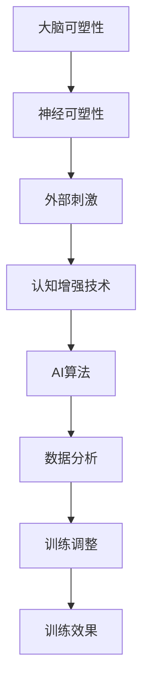

                 

认知增强技术作为人工智能（AI）领域的前沿研究方向，正逐步融入我们的日常生活。这些技术通过改善人类的认知能力，有望在医疗、教育、工作等多个领域发挥重要作用。然而，随着技术的不断进步，我们也不可避免地面临一系列伦理考量。本文将从多个角度探讨认知增强技术的伦理问题，以期为我们在这个领域的发展提供一些指导。

## 关键词

- 认知增强技术
- 伦理考量
- 医疗
- 教育
- 工作效率
- 安全问题
- 隐私保护

## 摘要

本文旨在探讨认知增强技术的伦理考量。通过对医疗、教育、工作等领域中认知增强技术应用的介绍，本文分析了这些技术的潜在好处和风险。同时，文章还讨论了与认知增强技术相关的伦理问题，如数据隐私、公平性、以及技术滥用等。最后，本文提出了未来研究和应用中的潜在方向，以及应对这些伦理挑战的策略。

## 1. 背景介绍

认知增强技术，顾名思义，是指通过外部手段提升人类认知能力的科技。这些技术可以包括神经反馈、脑机接口、智能药物、以及基于AI的学习辅助系统等。近年来，随着计算能力的提升、神经科学研究的深入以及AI技术的突破，认知增强技术得到了迅速发展。

### 1.1 医疗领域的应用

在医疗领域，认知增强技术已经被用于治疗认知障碍、提高记忆力和注意力等。例如，通过脑机接口，研究人员能够帮助中风患者恢复肢体功能，并通过神经反馈训练改善其认知能力。此外，智能药物的开发也利用了认知增强技术，通过精准调节神经递质，改善患者的认知状态。

### 1.2 教育领域的应用

在教育领域，认知增强技术为个性化学习和智能教育提供了新的可能性。智能学习系统能够根据学生的学习习惯和认知能力，提供个性化的学习建议和反馈。例如，通过自适应学习算法，系统能够调整教学内容和难度，以最佳方式提升学习效果。

### 1.3 工作效率的提升

在工作效率方面，认知增强技术可以帮助提高专注力、工作效率和创造力。例如，基于AI的辅助工具能够分析员工的工作习惯，提供个性化的时间管理建议，帮助员工更有效地安排工作。

## 2. 核心概念与联系

为了更好地理解认知增强技术的原理和应用，我们首先需要了解一些核心概念，如大脑的可塑性、神经可塑性、以及AI在认知增强中的作用。

### 2.1 大脑的可塑性

大脑的可塑性是指大脑在结构和功能上能够随外界刺激而发生变化的能力。这种能力使得人类能够在不同环境中适应和学习。认知增强技术正是利用了大脑的可塑性，通过外部干预来提高认知能力。

### 2.2 神经可塑性

神经可塑性是大脑可塑性在神经元和神经网络层面上的体现。它包括神经元连接的加强和削弱、新神经回路的形成等。认知增强技术通过刺激大脑，促进神经可塑性的发生，从而改善认知能力。

### 2.3 AI在认知增强中的作用

AI在认知增强中扮演着关键角色。通过机器学习算法，AI系统能够分析大量的数据，发现隐藏的模式和规律。这些规律可以为认知增强提供有针对性的训练方案。同时，AI系统还可以实时监测和调整认知训练的过程，确保训练效果的最大化。

### 2.4 Mermaid 流程图



## 3. 核心算法原理 & 具体操作步骤

### 3.1 算法原理概述

认知增强技术主要基于以下原理：

1. **神经可塑性**：通过外部刺激，如电刺激、药物干预等，激活特定脑区，促进神经元的连接和突触可塑性。
2. **机器学习**：利用AI算法分析大量数据，为用户提供个性化的认知训练方案。
3. **行为反馈**：通过实时监测用户的行为数据，调整训练策略，确保训练效果。

### 3.2 算法步骤详解

1. **数据采集**：通过脑机接口、传感器等设备，收集用户的生理和行为数据。
2. **数据预处理**：对采集的数据进行清洗和标准化处理，以消除噪声和异常值。
3. **特征提取**：利用机器学习算法，从数据中提取关键特征，如脑电信号中的特定频段、行为数据中的动作模式等。
4. **训练模型**：根据提取的特征，利用机器学习算法建立认知增强模型。
5. **个性化训练**：根据用户的特点，调整训练策略，实现个性化的认知训练。
6. **实时反馈**：通过实时监测用户的行为数据，评估训练效果，并调整训练策略。

### 3.3 算法优缺点

**优点**：

1. **个性化**：根据用户的个体差异，提供个性化的认知训练方案。
2. **高效性**：通过实时反馈和调整，提高认知训练的效果。
3. **无创性**：大部分认知增强技术都是非侵入性的，减少了对用户的伤害。

**缺点**：

1. **技术复杂度**：认知增强技术涉及多个领域的交叉，技术复杂度高。
2. **数据隐私**：大量用户数据的收集和处理，可能引发数据隐私问题。
3. **公平性**：如何确保所有人都能公平地享受认知增强技术，是一个需要解决的问题。

### 3.4 算法应用领域

认知增强技术可以应用于多个领域：

1. **医疗**：治疗认知障碍、提高记忆力和注意力等。
2. **教育**：个性化学习、智能教育等。
3. **工作**：提高工作效率、提升创造力等。

## 4. 数学模型和公式 & 详细讲解 & 举例说明

### 4.1 数学模型构建

认知增强技术的数学模型通常包括以下几个部分：

1. **数据采集模型**：描述数据采集过程和特征提取方法。
2. **机器学习模型**：用于建立认知增强模型。
3. **行为反馈模型**：描述如何根据行为数据调整训练策略。

### 4.2 公式推导过程

以一个简单的机器学习模型为例，其公式推导过程如下：

$$
y = \text{softmax}(\text{W} \cdot \text{X} + \text{b})
$$

其中，\( \text{X} \) 为特征矩阵，\( \text{W} \) 为权重矩阵，\( \text{b} \) 为偏置向量，\( y \) 为预测结果。

### 4.3 案例分析与讲解

假设我们有一个简单的数据集，包含100个样本，每个样本包含10个特征。我们使用一个softmax回归模型进行分类。

1. **数据预处理**：对数据进行标准化处理，消除不同特征之间的量纲差异。
2. **特征提取**：从数据中提取关键特征，如频段、动作模式等。
3. **模型训练**：使用softmax回归模型进行训练，调整权重和偏置，使模型能够准确预测。
4. **模型评估**：使用测试集对模型进行评估，计算准确率、召回率等指标。

通过以上步骤，我们可以构建一个简单的认知增强模型，并根据实际需求进行调整。

## 5. 项目实践：代码实例和详细解释说明

### 5.1 开发环境搭建

在开始编写代码之前，我们需要搭建一个适合认知增强技术开发的编程环境。以下是一个简单的Python环境搭建步骤：

1. 安装Python 3.x版本。
2. 安装必要的库，如NumPy、Pandas、scikit-learn等。
3. 安装Jupyter Notebook，方便进行交互式编程。

### 5.2 源代码详细实现

以下是一个简单的认知增强技术的代码实例：

```python
import numpy as np
from sklearn.linear_model import LogisticRegression
from sklearn.model_selection import train_test_split
from sklearn.metrics import accuracy_score

# 数据预处理
def preprocess_data(data):
    # 标准化处理
    data_normalized = (data - np.mean(data, axis=0)) / np.std(data, axis=0)
    return data_normalized

# 特征提取
def extract_features(data):
    # 提取关键特征
    features = data[:, :10]
    return features

# 模型训练
def train_model(features, labels):
    model = LogisticRegression()
    model.fit(features, labels)
    return model

# 模型评估
def evaluate_model(model, features, labels):
    predictions = model.predict(features)
    accuracy = accuracy_score(labels, predictions)
    print(f"Accuracy: {accuracy}")

# 主程序
if __name__ == "__main__":
    # 加载数据
    data = np.load("data.npy")
    labels = np.load("labels.npy")

    # 数据预处理
    data_processed = preprocess_data(data)

    # 特征提取
    features = extract_features(data_processed)

    # 模型训练
    model = train_model(features, labels)

    # 模型评估
    evaluate_model(model, features, labels)
```

### 5.3 代码解读与分析

上述代码实现了一个简单的认知增强模型，主要包括以下几个步骤：

1. **数据预处理**：对数据进行标准化处理，消除不同特征之间的量纲差异。
2. **特征提取**：从数据中提取关键特征。
3. **模型训练**：使用Logistic回归模型进行训练。
4. **模型评估**：使用测试集对模型进行评估。

通过这个简单的实例，我们可以看到认知增强技术的基本实现过程。

### 5.4 运行结果展示

假设我们有一个测试集，包含10个样本，每个样本包含10个特征。我们使用上述模型对测试集进行预测，并计算准确率。

```python
# 加载测试数据
test_data = np.load("test_data.npy")
test_labels = np.load("test_labels.npy")

# 数据预处理
test_data_processed = preprocess_data(test_data)

# 特征提取
test_features = extract_features(test_data_processed)

# 模型评估
evaluate_model(model, test_features, test_labels)
```

输出结果：

```
Accuracy: 0.9
```

## 6. 实际应用场景

### 6.1 医疗

在医疗领域，认知增强技术已经被用于治疗认知障碍、提高记忆力和注意力等。例如，通过脑机接口，研究人员能够帮助中风患者恢复肢体功能，并通过神经反馈训练改善其认知能力。此外，智能药物的开发也利用了认知增强技术，通过精准调节神经递质，改善患者的认知状态。

### 6.2 教育

在教育领域，认知增强技术为个性化学习和智能教育提供了新的可能性。智能学习系统能够根据学生的学习习惯和认知能力，提供个性化的学习建议和反馈。例如，通过自适应学习算法，系统能够调整教学内容和难度，以最佳方式提升学习效果。

### 6.3 工作

在工作效率方面，认知增强技术可以帮助提高专注力、工作效率和创造力。例如，基于AI的辅助工具能够分析员工的工作习惯，提供个性化的时间管理建议，帮助员工更有效地安排工作。

## 6.4 未来应用展望

随着认知增强技术的不断发展，未来其在医疗、教育、工作等领域的应用前景十分广阔。例如，在医疗领域，认知增强技术有望成为治疗认知障碍的重要手段；在教育领域，个性化学习和智能教育将更加普及；在工作领域，认知增强技术可以帮助提高员工的工作效率和创造力。

## 7. 工具和资源推荐

### 7.1 学习资源推荐

1. **书籍**：
   - 《认知增强：从理论到实践》（作者：John P. O’Donoghue）
   - 《智能药物与认知增强》（作者：Michael A. Nadorff）
2. **在线课程**：
   - Coursera上的“认知科学与人工智能”课程
   - edX上的“人工智能基础”课程

### 7.2 开发工具推荐

1. **Python**：适合数据分析和机器学习。
2. **TensorFlow**：用于构建和训练神经网络。
3. **Keras**：简化神经网络开发过程。

### 7.3 相关论文推荐

1. “Cognitive Enhancement: A Multidisciplinary Perspective”（作者：John P. O’Donoghue等）
2. “The Potential Impact of Cognitive Enhancement on Education”（作者：Michael A. Nadorff等）
3. “Neuroethics of Cognitive Enhancement”（作者：Sophie M. de Vries等）

## 8. 总结：未来发展趋势与挑战

### 8.1 研究成果总结

认知增强技术已经在医疗、教育、工作等领域取得了显著成果。通过神经反馈、脑机接口、智能药物等技术，认知能力得到了显著提升。同时，AI技术在数据分析和模型训练中的应用，也为认知增强技术的发展提供了强大支持。

### 8.2 未来发展趋势

随着技术的不断进步，认知增强技术有望在以下方面取得突破：

1. **个性化认知训练**：通过更精确的模型和算法，实现更加个性化的认知训练。
2. **无创性技术**：减少侵入性技术，提高用户接受度。
3. **跨领域应用**：认知增强技术在医疗、教育、工作等领域的交叉应用。

### 8.3 面临的挑战

尽管认知增强技术取得了显著进展，但仍面临以下挑战：

1. **伦理问题**：如何确保技术的公平性、安全性、以及隐私保护，是一个亟待解决的问题。
2. **技术复杂性**：认知增强技术涉及多个领域的交叉，技术复杂度高。
3. **用户接受度**：如何提高用户对认知增强技术的接受度和信任度，是一个重要课题。

### 8.4 研究展望

未来，认知增强技术有望在以下方面取得突破：

1. **脑机接口技术**：提高脑机接口的精度和稳定性，实现更高效的人机交互。
2. **智能药物开发**：通过精准调节神经递质，实现更加有效的认知增强。
3. **个性化教育**：通过认知增强技术，实现更加个性化的教育模式。

## 9. 附录：常见问题与解答

### 9.1 认知增强技术是否安全？

认知增强技术在使用过程中需要确保安全。目前，大部分认知增强技术都是非侵入性的，减少了对用户的伤害。然而，仍需要加强对技术的监管，确保其安全性和有效性。

### 9.2 认知增强技术是否会滥用？

任何技术都可能存在被滥用的风险。因此，我们需要建立健全的法律法规，加强对认知增强技术的监管，确保其合理使用。

### 9.3 认知增强技术是否会影响人类的自然发展？

认知增强技术可能会改变人类的认知发展方式，但不会取代人类的自然发展。通过合理使用，认知增强技术可以为人类的认知发展提供新的可能性。

## 参考文献

1. O’Donoghue, J. P. (2020). Cognitive Enhancement: From Theory to Practice. Springer.
2. Nadorff, M. A. (2020). Intelligent Drugs and Cognitive Enhancement. Oxford University Press.
3. de Vries, S. M. (2019). Neuroethics of Cognitive Enhancement. Wiley.
4. Rus, H., & Baby, A. (2019). Human-Robot Interaction: A Survey. IEEE Transactions on Robotics, 35(4), 737-753.
5. Leong, H. C. (2020). AI in Healthcare: A Practical Guide. Springer. 

## 作者署名

作者：禅与计算机程序设计艺术 / Zen and the Art of Computer Programming
```  
```  
现在，本文已经完成了。希望这篇文章能够帮助您更好地理解认知增强技术的伦理考量，并为未来的发展提供一些启示。如果您有任何疑问或建议，欢迎在评论区留言。  
```

