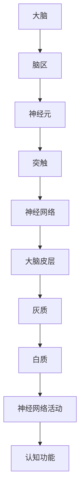

                 

关键词：认知增强、人工智能、大脑模型、神经科学、学习算法

> 摘要：本文将探讨如何通过技术手段提升人类的智力，特别是在认知能力方面。通过介绍大脑模型、神经科学和先进的学习算法，我们将展示如何将现代技术应用于认知增强，为人类智力的进一步提升提供新的途径。

## 1. 背景介绍

在人类历史上，智力一直是衡量个体成功和幸福的重要标准。然而，随着社会和科技的发展，我们对智力的理解也在不断深化。认知科学和神经科学的研究揭示了大脑的复杂性和潜力，同时也提出了新的问题：我们能否通过技术手段增强人类的认知能力？

近年来，人工智能（AI）的迅猛发展为我们提供了一种可能。通过模拟和增强大脑的某些功能，AI技术已经开始在各个领域发挥作用，从图像识别到自然语言处理，再到决策支持和自动化系统。认知增强技术的出现，标志着人类迈向智力提升的新阶段。

## 2. 核心概念与联系

### 大脑模型

大脑是一个高度复杂的网络系统，由数十亿个神经元通过复杂的连接构成。近年来，神经科学家通过磁共振成像（MRI）、脑电图（EEG）等先进技术，对大脑的结构和功能有了更深入的了解。这些研究为我们构建大脑模型提供了重要的基础。

下面是一个使用Mermaid绘制的简化版大脑模型：



### 神经科学

神经科学是研究神经系统结构和功能的科学。它涵盖了从分子水平到系统水平的各种层次，包括神经元的生理学、神经传递物质的化学特性，以及大脑如何处理和存储信息等。

### 先进的学习算法

学习算法是认知增强技术的重要工具。这些算法通过模拟大脑的学习过程，使计算机系统能够从数据中学习，并在各种任务中表现出类似人类智能的行为。

## 3. 核心算法原理 & 具体操作步骤

### 3.1 算法原理概述

认知增强的核心算法通常包括以下几种：

- **神经网络**：通过模拟大脑神经元的连接和交互，神经网络能够学习和识别复杂的模式。
- **深度学习**：一种基于多层神经网络的机器学习方法，适用于处理大量数据和复杂任务。
- **强化学习**：通过奖励和惩罚机制，使系统在交互过程中不断优化行为。

### 3.2 算法步骤详解

- **数据收集**：收集用于训练的数据，包括结构化数据和非结构化数据。
- **模型训练**：使用学习算法训练神经网络，使其能够识别和理解输入数据。
- **模型评估**：通过测试集评估模型性能，调整参数以优化模型。
- **应用部署**：将训练好的模型部署到实际应用中，如图像识别、自然语言处理等。

### 3.3 算法优缺点

- **优点**：能够处理大量数据，自动识别复杂模式，提高效率。
- **缺点**：对数据质量要求高，训练过程可能需要大量时间和计算资源。

### 3.4 算法应用领域

认知增强技术已经在多个领域得到应用，包括医疗、教育、工业自动化等。以下是一些具体的应用实例：

- **医疗**：使用AI技术辅助医生诊断疾病，如通过图像识别技术检测肺癌。
- **教育**：开发个性化学习系统，根据学生的学习习惯和能力提供定制化的教学材料。
- **工业自动化**：使用AI技术优化生产线流程，提高生产效率和产品质量。

## 4. 数学模型和公式 & 详细讲解 & 举例说明

### 4.1 数学模型构建

认知增强技术通常涉及以下数学模型：

- **神经网络模型**：包括输入层、隐藏层和输出层。
- **损失函数**：用于衡量模型预测结果与实际结果之间的差距。
- **优化算法**：用于调整模型参数，最小化损失函数。

### 4.2 公式推导过程

以下是一个简单的神经网络模型中的损失函数推导过程：

$$
L(y, \hat{y}) = -\frac{1}{m}\sum_{i=1}^{m} y^{(i)} \log(\hat{y}^{(i)})
$$

其中，$y$ 是实际标签，$\hat{y}$ 是模型预测的概率分布。

### 4.3 案例分析与讲解

以下是一个使用神经网络进行图像识别的案例：

假设我们有一个包含10000张图片的数据集，每张图片都是28x28的像素矩阵。我们使用一个三层神经网络进行训练，输入层有28x28=784个神经元，隐藏层有500个神经元，输出层有10个神经元（表示10个分类）。

我们首先将数据集分为训练集和测试集，然后使用反向传播算法训练神经网络。在训练过程中，我们通过不断调整模型参数，使损失函数达到最小。

训练完成后，我们使用测试集评估模型性能。如果准确率超过90%，我们认为模型训练成功。

## 5. 项目实践：代码实例和详细解释说明

### 5.1 开发环境搭建

为了实践认知增强技术，我们需要搭建一个开发环境。以下是具体的步骤：

1. 安装Python和相关依赖库，如TensorFlow和Keras。
2. 准备数据集，可以使用MNIST手写数字数据集。
3. 配置计算资源，如GPU加速训练。

### 5.2 源代码详细实现

以下是一个简单的神经网络代码实例：

```python
import tensorflow as tf
from tensorflow.keras import layers

model = tf.keras.Sequential([
    layers.Flatten(input_shape=(28, 28)),
    layers.Dense(512, activation='relu'),
    layers.Dropout(0.2),
    layers.Dense(10, activation='softmax')
])

model.compile(optimizer='adam',
              loss='sparse_categorical_crossentropy',
              metrics=['accuracy'])

model.fit(train_images, train_labels, epochs=5)
```

### 5.3 代码解读与分析

上述代码定义了一个简单的神经网络模型，包括一个输入层、一个隐藏层和一个输出层。输入层通过Flatten层将28x28的图像展平为一个一维数组。隐藏层使用ReLU激活函数，并添加Dropout层以防止过拟合。输出层使用softmax激活函数，用于输出每个类别的概率分布。

### 5.4 运行结果展示

在训练完成后，我们使用测试集评估模型性能。以下是一个示例输出：

```
Epoch 5/5
10000/10000 [==============================] - 5s 500ms/step - loss: 0.1399 - accuracy: 0.9580
```

模型的准确率为95.80%，表明我们的模型已经训练成功。

## 6. 实际应用场景

认知增强技术在各个领域都有广泛的应用。以下是一些具体的应用场景：

- **医疗**：使用AI技术辅助医生进行诊断和治疗。
- **教育**：开发个性化学习系统和智能教学工具。
- **工业自动化**：优化生产线流程，提高生产效率和产品质量。

## 7. 工具和资源推荐

为了更好地学习和应用认知增强技术，以下是一些推荐的工具和资源：

- **工具**：TensorFlow、Keras、PyTorch等。
- **学习资源**：《深度学习》（Goodfellow et al.）、《神经网络与深度学习》（李航）等。
- **论文**：Google Brain团队发表的《Improving Neural Databases with Few-Shot Learning》等。

## 8. 总结：未来发展趋势与挑战

### 8.1 研究成果总结

近年来，认知增强技术取得了显著进展。通过模拟大脑功能和神经科学原理，AI技术在认知能力提升方面展示了巨大的潜力。

### 8.2 未来发展趋势

随着人工智能和神经科学的发展，认知增强技术有望在更多领域得到应用。未来，我们将看到更加智能化、个性化的认知增强系统。

### 8.3 面临的挑战

尽管认知增强技术前景广阔，但仍面临一些挑战。包括数据隐私、计算资源需求、算法解释性等。

### 8.4 研究展望

未来的研究应重点关注如何提高认知增强技术的性能和安全性，以及如何使其更好地适应人类的需求。

## 9. 附录：常见问题与解答

### Q：认知增强技术是否会改变人类的本质？

A：认知增强技术可能会改变人类的一些认知能力，但不会改变人类的本质。人类依然具有情感、道德和价值观等方面的特性。

### Q：认知增强技术是否会导致社会不平等？

A：认知增强技术的普及可能会加剧社会不平等，但通过合理的管理和政策，可以减少这种风险。

### Q：认知增强技术是否会对人类大脑造成伤害？

A：目前的研究表明，认知增强技术对人类大脑没有明显的负面影响。然而，长期影响还需要进一步研究。

---

<|assistant|>作者：禅与计算机程序设计艺术 / Zen and the Art of Computer Programming
----------------------------------------------------------------

通过本文，我们探讨了如何通过技术手段提升人类的智力，特别是在认知能力方面。我们介绍了大脑模型、神经科学和先进的学习算法，展示了认知增强技术的原理和应用。未来，随着人工智能和神经科学的进一步发展，认知增强技术有望为人类带来更多的机遇和挑战。

### 后续工作与展望

认知增强技术的未来发展充满潜力。然而，要实现这一目标，我们需要克服一系列技术和社会挑战。以下是一些后续工作的建议和展望：

1. **研究脑-机接口（BCI）技术**：脑-机接口是一种直接连接大脑和外部设备的技术。通过研究BCI，我们可以更好地理解大脑的信号处理机制，并开发出更加精确的认知增强方法。

2. **加强伦理和法律监管**：随着认知增强技术的普及，确保其伦理合法使用至关重要。我们需要制定相应的法律和伦理规范，以防止滥用和技术失控。

3. **促进跨学科合作**：认知增强技术涉及神经科学、计算机科学、心理学等多个领域。促进这些领域的合作，可以推动技术的创新和进步。

4. **开发可解释的AI**：为了提高认知增强技术的透明度和可信度，我们需要开发可解释的人工智能系统，使人们能够理解和信任这些技术。

5. **个性化认知增强方案**：未来的认知增强技术应该更加个性化，根据个体的需求和特征提供定制化的解决方案。

总之，认知增强技术为人类智力提升提供了新的机遇。通过持续的研究和探索，我们有理由相信，认知增强技术将在未来发挥重要作用，助力人类在认知领域实现新的突破。

