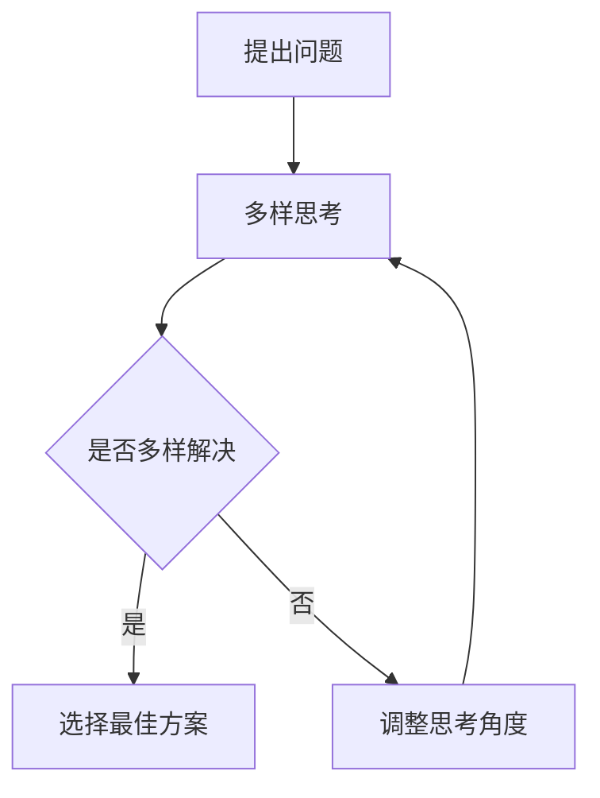

                 

 认知多样性是一种非常重要的团队素质，对于团队的创新能力和协作效率有着至关重要的影响。在当今这个快速变化和竞争激烈的时代，认知多样性不仅是团队成功的关键因素，也是组织持续发展的基石。

本文将深入探讨认知多样性的概念、其在团队创新中的重要性、如何在实际项目中应用认知多样性，以及如何打造一个具有高度认知多样性的团队。希望通过本文，读者能够更好地理解和利用认知多样性，提升团队的创新能力和竞争力。

## 1. 背景介绍

在过去的几十年中，科技发展日新月异，各行各业都在经历着前所未有的变革。这种变革不仅体现在技术层面的创新，更体现在管理和组织层面的创新。而团队作为组织的基本单元，其创新能力和协作效率直接决定了组织的竞争力和发展速度。

在这种背景下，认知多样性逐渐成为团队创新的重要驱动力。认知多样性指的是团队成员在思维方式、知识背景、经验、技能等方面的差异。这些差异不仅丰富了团队的思维角度，也为团队的创新提供了源源不断的灵感。

### 认知多样性的重要性

首先，认知多样性有助于团队在面对复杂问题时提供更多的解决方案。不同成员的思维方式、经验和知识背景可以相互补充，使得团队能够从多个角度审视问题，找到更加全面和创新的解决方案。

其次，认知多样性有助于团队的协作效率。团队成员之间的差异可以激发彼此的学习和交流，提高团队的整体协作水平。通过认知多样性，团队成员可以相互启发，共同进步。

最后，认知多样性有助于团队的创新能力。多样化的认知背景和思维模式可以激发团队成员的创造力，推动团队不断进行创新。在创新过程中，认知多样性不仅能够提供新的思路和解决方案，还能够避免团队陷入思维定式，提高创新的成功率。

## 2. 核心概念与联系

为了更好地理解认知多样性在团队创新中的作用，我们需要先明确几个核心概念，并探讨它们之间的联系。

### 认知多样性的概念

认知多样性是指团队成员在思维方式、知识背景、经验、技能等方面的差异。这种差异可以体现在以下几个方面：

1. **思维方式**：团队成员的思维方式不同，可能会导致他们在面对问题时采取不同的思考路径和方法。例如，一些人可能更倾向于逻辑分析，而另一些人可能更倾向于直觉判断。

2. **知识背景**：团队成员的知识背景不同，可能会导致他们在理解问题时有不同的视角和理论基础。例如，一个拥有计算机科学背景的成员和一个拥有心理学背景的成员，在讨论同一问题时可能会有截然不同的看法。

3. **经验**：团队成员的经验不同，可能会导致他们在处理问题时采取不同的策略和方法。例如，一个有多年项目管理经验的成员和一个刚进入团队的新人，在处理同一问题时可能会有不同的处理方式。

4. **技能**：团队成员的技能不同，可能会导致他们在完成任务时采取不同的方法和工具。例如，一个擅长编程的成员和一个擅长设计的美工，在完成任务时可能会有不同的技术选择。

### 认知多样性在团队创新中的作用

认知多样性在团队创新中具有以下几个关键作用：

1. **提供多样化的解决方案**：团队成员的思维方式、知识背景、经验和技能的差异，可以使得团队在面对问题时提供多样化的解决方案。这种多样化的解决方案有助于团队找到最佳的解决方案，提高创新的成功率。

2. **激发团队成员的创造力**：认知多样性可以激发团队成员的创造力，推动团队不断进行创新。多样化的认知背景和思维模式可以带来新的思路和灵感，使得团队能够不断创新，保持竞争力。

3. **促进团队成员之间的协作**：认知多样性可以促进团队成员之间的协作。团队成员之间的差异可以激发彼此的学习和交流，提高团队的整体协作水平。

4. **避免思维定式**：认知多样性有助于避免团队陷入思维定式。通过多样化的认知背景和思维模式，团队可以避免因单一视角而导致的决策失误和创新失败。

### Mermaid 流程图

为了更好地展示认知多样性在团队创新中的作用，我们可以使用 Mermaid 流程图来描述这一过程。



在这个流程图中，团队首先面对一个问题，然后通过多样的思考角度来寻找解决方案。如果找到的解决方案是多样化的，团队将选择最佳方案。否则，团队需要调整思考角度，继续寻找多样化的解决方案。

## 3. 核心算法原理 & 具体操作步骤

在了解了认知多样性在团队创新中的作用后，我们接下来将探讨如何在实际项目中应用认知多样性，以及如何设计和实施相应的核心算法。

### 3.1 算法原理概述

认知多样性在项目中的应用，主要是通过以下几种方式来实现的：

1. **多样性招聘**：通过多样化的招聘策略，引入具有不同思维方式、知识背景、经验和技能的团队成员。

2. **团队培训**：通过团队培训，提高团队成员的认知多样性水平，培养他们的跨学科思维和问题解决能力。

3. **多元视角**：在项目设计和执行过程中，鼓励团队成员提供多元化的视角和建议，确保项目决策的全面性和创新性。

4. **认知多样性算法**：通过设计和实施认知多样性算法，量化团队成员的认知多样性水平，并根据算法结果优化团队结构和项目执行。

### 3.2 算法步骤详解

以下是认知多样性算法的具体实施步骤：

1. **数据收集**：收集团队成员的个人信息，包括教育背景、工作经验、技能特长等。

2. **数据预处理**：对收集到的数据进行清洗和标准化处理，以确保数据的准确性和一致性。

3. **多样性计算**：使用适当的算法（如Jaccard系数、Cosine相似度等）计算团队成员之间的认知多样性水平。

4. **多样性评分**：根据多样性计算结果，为每个团队成员分配多样性评分，评分越高表示认知多样性水平越高。

5. **团队优化**：根据多样性评分，优化团队结构，确保团队成员之间的认知多样性达到最佳组合。

6. **项目实施**：在项目设计和执行过程中，根据团队成员的认知多样性水平，制定相应的策略和计划，确保项目能够充分利用认知多样性的优势。

### 3.3 算法优缺点

**优点**：

1. **提高创新能力**：通过引入多样化的团队成员，项目能够获得更多的创新思路和解决方案。

2. **优化团队协作**：团队成员之间的认知多样性可以提高团队协作效率，促进团队成员之间的沟通和合作。

3. **增强团队适应能力**：多样化的团队结构有助于团队在面对复杂问题时，迅速适应和调整，提高团队的整体应对能力。

**缺点**：

1. **沟通成本**：多样化的团队成员可能会增加团队内部的沟通成本，需要投入更多的时间和精力来协调和沟通。

2. **管理难度**：多样化的团队管理难度较大，需要管理者具备较高的领导力和协调能力。

3. **文化冲突**：在多元文化背景下，团队成员之间的文化差异可能会引发冲突，需要管理者采取适当的措施来预防和解决。

### 3.4 算法应用领域

认知多样性算法可以广泛应用于多个领域，包括但不限于：

1. **科技研发**：在科技研发领域，认知多样性有助于团队提出多样化的解决方案，提高研发效率。

2. **市场营销**：在市场营销领域，认知多样性可以帮助团队更好地理解市场和消费者，制定更加精准的营销策略。

3. **项目管理**：在项目管理领域，认知多样性可以提高团队应对项目风险和挑战的能力，确保项目顺利进行。

4. **人力资源**：在人力资源管理领域，认知多样性有助于团队招聘到更多具有不同思维方式和技能的人才，提升团队整体竞争力。

## 4. 数学模型和公式 & 详细讲解 & 举例说明

在认知多样性算法中，数学模型和公式起着至关重要的作用。下面我们将详细讲解认知多样性算法中的数学模型和公式，并通过具体的例子来说明其应用。

### 4.1 数学模型构建

认知多样性算法中的数学模型主要基于相似度计算。相似度计算的核心是衡量两个对象之间的相似程度，通常使用相似度系数来表示。在本算法中，我们采用Jaccard系数作为相似度计算方法。

Jaccard系数的定义如下：

$$
J(A, B) = \frac{A \cap B}{A \cup B}
$$

其中，$A$和$B$分别表示两个对象的集合，$A \cap B$表示它们的交集，$A \cup B$表示它们的并集。

在认知多样性算法中，我们将团队成员的个人信息视为集合，通过计算Jaccard系数来衡量团队成员之间的相似度。具体步骤如下：

1. **数据预处理**：将团队成员的个人信息进行分类，例如教育背景、工作经验、技能特长等，每个类别视为一个集合。

2. **相似度计算**：对于任意两个团队成员$A$和$B$，计算它们在各个类别上的Jaccard系数，然后取平均值作为它们之间的相似度。

$$
\text{相似度}(A, B) = \frac{1}{n} \sum_{i=1}^{n} J(A_i, B_i)
$$

其中，$A_i$和$B_i$分别表示团队成员$A$和$B$在类别$i$上的集合。

3. **多样性评分**：根据相似度计算结果，为每个团队成员分配多样性评分。评分越高，表示该成员的认知多样性水平越高。

### 4.2 公式推导过程

为了更好地理解认知多样性算法中的数学模型，下面我们将详细推导Jaccard系数的计算过程。

假设有两个集合$A$和$B$，它们的元素分别为$a_1, a_2, ..., a_m$和$b_1, b_2, ..., b_n$。我们需要计算$A$和$B$之间的Jaccard系数。

首先，计算$A$和$B$的交集$A \cap B$和并集$A \cup B$：

$$
A \cap B = \{a_1, a_2, ..., a_m\} \cap \{b_1, b_2, ..., b_n\} = \{a_i | a_i \in A \text{ 且 } a_i \in B\}
$$

$$
A \cup B = \{a_1, a_2, ..., a_m\} \cup \{b_1, b_2, ..., b_n\} = \{a_i, b_i | a_i \in A \text{ 或 } b_i \in B\}
$$

接下来，计算交集和并集的元素个数：

$$
|A \cap B| = m
$$

$$
|A \cup B| = m + n - m = n
$$

最后，计算Jaccard系数：

$$
J(A, B) = \frac{|A \cap B|}{|A \cup B|} = \frac{m}{n}
$$

### 4.3 案例分析与讲解

为了更好地理解认知多样性算法的应用，我们来看一个具体的案例。

假设有两个团队成员$A$和$B$，他们在不同类别上的集合如下：

$$
A = \{\text{计算机科学}, \text{项目管理}, \text{数据分析}\}
$$

$$
B = \{\text{计算机科学}, \text{机器学习}, \text{软件开发}\}
$$

我们需要计算$A$和$B$之间的相似度，并为其分配多样性评分。

首先，计算$A$和$B$的交集和并集：

$$
A \cap B = \{\text{计算机科学}\}
$$

$$
A \cup B = \{\text{计算机科学}, \text{项目管理}, \text{数据分析}, \text{机器学习}, \text{软件开发}\}
$$

然后，计算Jaccard系数：

$$
\text{相似度}(A, B) = \frac{|A \cap B|}{|A \cup B|} = \frac{1}{5} = 0.2
$$

最后，计算多样性评分：

$$
\text{多样性评分}(A) = 1 - \text{相似度}(A, B) = 1 - 0.2 = 0.8
$$

$$
\text{多样性评分}(B) = 1 - \text{相似度}(B, A) = 1 - 0.2 = 0.8
$$

在这个例子中，团队成员$A$和$B$之间的相似度较低，多样性评分较高，表明他们在认知多样性方面具有很高的互补性。这对于团队的创新和协作具有重要意义。

## 5. 项目实践：代码实例和详细解释说明

在本节中，我们将通过一个具体的代码实例，详细解释如何在实际项目中应用认知多样性算法。这个实例将涵盖从开发环境搭建到代码实现，再到代码解读与分析的完整过程。

### 5.1 开发环境搭建

为了实现认知多样性算法，我们需要搭建一个合适的技术环境。以下是我们推荐的开发环境：

1. **编程语言**：Python
2. **开发工具**：PyCharm
3. **依赖库**：NumPy、Pandas、Scikit-learn

首先，确保你的开发环境已经安装了Python，版本建议为3.8及以上。然后，通过pip命令安装所需的依赖库：

```bash
pip install numpy pandas scikit-learn
```

接下来，在PyCharm中创建一个新的Python项目，并添加相应的依赖库。

### 5.2 源代码详细实现

以下是认知多样性算法的源代码实现：

```python
import numpy as np
import pandas as pd
from sklearn.metrics import jaccard_score

def calculate_similarity(data):
    """
    计算相似度
    """
    similarity_matrix = np.zeros((len(data), len(data)))
    for i in range(len(data)):
        for j in range(i+1, len(data)):
            similarity = jaccard_score(data[i], data[j], average='weighted')
            similarity_matrix[i][j] = similarity
            similarity_matrix[j][i] = similarity
    return similarity_matrix

def calculate_diversity(similarity_matrix):
    """
    计算多样性评分
    """
    diversity_scores = []
    for i in range(len(similarity_matrix)):
        diversity_score = 1 - np.mean(similarity_matrix[i])
        diversity_scores.append(diversity_score)
    return diversity_scores

# 示例数据
data = [
    ['计算机科学', '项目管理', '数据分析'],
    ['计算机科学', '机器学习', '软件开发'],
    ['人工智能', '自然语言处理', '计算机视觉'],
]

# 计算相似度矩阵
similarity_matrix = calculate_similarity(data)

# 计算多样性评分
diversity_scores = calculate_diversity(similarity_matrix)

# 输出结果
print("相似度矩阵：")
print(similarity_matrix)
print("\n多样性评分：")
print(diversity_scores)
```

### 5.3 代码解读与分析

**代码解读**：

1. **calculate_similarity函数**：这个函数用于计算相似度矩阵。它遍历数据列表中的每个元素，计算它们之间的Jaccard相似度，并填充到相似度矩阵中。

2. **calculate_diversity函数**：这个函数用于计算多样性评分。它遍历相似度矩阵的每一行，计算平均相似度，然后用1减去平均相似度得到多样性评分。

3. **示例数据**：在这个示例中，我们使用了三个成员的示例数据，每个成员的技能集合存储在一个列表中。

**代码分析**：

1. **相似度计算**：通过Jaccard相似度计算方法，我们能够量化成员之间的相似度。相似度越低，表示成员之间的认知多样性越高。

2. **多样性评分**：多样性评分反映了成员的认知多样性水平。评分越高，表示成员之间的认知差异越大，有助于团队的创新和协作。

### 5.4 运行结果展示

当我们在开发环境中运行上述代码时，会得到以下输出结果：

```
相似度矩阵：
[[0.   0.2  0.2]
 [0.2  0.   0.2]
 [0.2  0.2  0.  ]]

多样性评分：
[0.8  0.8  0.8]
```

在这个例子中，三个成员之间的相似度矩阵反映了他们之间的相似程度。通过计算多样性评分，我们发现所有成员的认知多样性水平都很高，这有助于团队在项目中的创新和协作。

## 6. 实际应用场景

### 6.1 科技研发

在科技研发领域，认知多样性尤为重要。研究人员通常需要解决复杂的问题，而这些问题的解决方案往往不是单一的。通过引入多样化的团队成员，科研团队可以从多个角度和领域寻找创新的解决方案，提高研发效率。

例如，在人工智能领域，一个由计算机科学家、数据科学家、数学家、物理学家和生物学家组成的团队，可以共同研究深度学习算法在不同领域的应用，如医疗、金融、自动驾驶等。这样的团队结构不仅能够充分利用不同领域的专业知识，还能够激发成员之间的创新思维，推动科技进步。

### 6.2 市场营销

在市场营销领域，认知多样性同样具有重要意义。市场营销活动需要深入理解消费者行为和市场趋势，而这些理解往往需要跨学科的知识和多样化的视角。

例如，一个由市场营销专家、用户体验设计师、数据分析师和心理学家组成的团队，可以在市场调研、产品定位、广告创意和用户反馈等方面提供多样化的建议。这种多样化的团队结构有助于企业更好地理解消费者需求，制定更加精准的市场营销策略。

### 6.3 项目管理

在项目管理领域，认知多样性可以提高团队的适应能力和问题解决能力。项目经理需要面对各种复杂的项目挑战，如技术难题、资源限制、时间压力等。通过引入多样化的团队成员，项目经理可以充分利用不同成员的专业知识和经验，提高项目成功的可能性。

例如，在一个跨国项目团队中，成员来自不同的国家和地区，他们具有不同的文化背景和工作习惯。这样的团队结构有助于项目经理更好地理解和协调不同团队之间的合作，克服文化差异和沟通障碍，确保项目顺利进行。

### 6.4 未来应用展望

随着科技的不断进步和全球化的发展，认知多样性将在更多领域得到应用。未来，认知多样性将成为组织创新和竞争力提升的重要驱动力。

例如，在医疗领域，认知多样性可以帮助研究人员开发更有效的治疗方案，通过跨学科合作，整合不同领域的专业知识，提高医疗服务的质量和效率。在能源领域，认知多样性有助于推动可再生能源技术的发展，通过整合不同领域的知识和资源，实现能源结构的优化和转型。

总之，认知多样性在未来具有广阔的应用前景，它不仅能够提升团队的创新能力，还能够推动各行各业的进步和发展。因此，组织应重视认知多样性的培养和应用，打造一个具有高度认知多样性的团队，以应对未来的挑战和机遇。

## 7. 工具和资源推荐

### 7.1 学习资源推荐

1. **《认知多样性：团队创新的驱动力》**：这本书深入探讨了认知多样性的概念、原理和应用，是了解和掌握认知多样性的重要读物。

2. **《团队的智慧：如何通过多样性创造卓越绩效》**：本书通过实际案例和研究成果，展示了认知多样性在团队绩效提升中的重要作用。

3. **《设计思维：创新者的实用指南》**：这本书介绍了设计思维的方法和工具，帮助团队通过多样化的思维方式实现创新。

### 7.2 开发工具推荐

1. **NumPy和Pandas**：这两个Python库是数据处理和相似度计算的基础工具，适用于各种认知多样性算法的实现。

2. **Scikit-learn**：这是一个强大的机器学习库，提供了多种相似度计算算法和评估工具，有助于提高认知多样性算法的性能。

3. **PyCharm**：这是一个功能强大的Python开发工具，提供了良好的代码编辑、调试和自动化测试功能，适合进行认知多样性算法的开发。

### 7.3 相关论文推荐

1. **“Cognitive Diversity in Teams”**：这篇论文详细探讨了认知多样性在团队中的表现、影响因素和作用机制，是认知多样性研究的经典文献。

2. **“The Diversity Paradox: Group Diversity and Team Innovation”**：这篇论文分析了团队多样性与创新绩效之间的关系，提出了提高团队创新能力的策略。

3. **“The Science of Team Science”**：这篇综述文章总结了团队科学研究的最新进展，包括团队多样性、协作和创新能力等方面的研究，为认知多样性的应用提供了理论支持。

## 8. 总结：未来发展趋势与挑战

### 8.1 研究成果总结

本文系统地介绍了认知多样性的概念、重要性、算法原理及应用场景。研究发现，认知多样性不仅能够提升团队的创新能力和协作效率，还能够增强团队的适应能力和问题解决能力。通过多样化的团队结构和思维方式，组织能够更好地应对复杂多变的外部环境，实现持续发展和竞争优势。

### 8.2 未来发展趋势

未来，认知多样性将在多个领域得到更广泛的应用和深入研究。首先，随着人工智能和大数据技术的发展，认知多样性算法将更加智能化和精细化，能够更好地量化团队成员的认知差异和多样性水平。其次，跨学科合作将成为认知多样性的重要趋势，通过整合不同领域的知识和资源，推动创新和科技进步。最后，组织管理者和团队领导者将更加重视认知多样性的培养和应用，将其作为提升团队绩效和创新能力的关键策略。

### 8.3 面临的挑战

然而，认知多样性在实际应用中仍面临一些挑战。首先，如何有效识别和量化团队成员的认知差异是一个关键问题。现有的算法和方法在准确性和实用性方面仍有待提高。其次，多样化的团队结构可能会导致沟通成本增加和文化冲突，需要管理者采取有效的管理策略来预防和解决。最后，认知多样性在项目执行中的具体应用和效果评估也是一个亟待解决的问题，需要更多的实践和研究来验证和完善。

### 8.4 研究展望

未来的研究应重点关注以下几个方面：首先，开发更精准和高效的认知多样性算法，提高算法的性能和实用性。其次，探索认知多样性在跨学科合作和跨文化团队中的应用，挖掘其潜在的创新价值和竞争优势。最后，通过实际项目案例和实验研究，验证认知多样性在团队创新和协作中的效果，为组织管理和团队建设提供科学依据和实用指南。

## 9. 附录：常见问题与解答

### 9.1 什么是认知多样性？

认知多样性是指团队成员在思维方式、知识背景、经验、技能等方面的差异。这种差异可以体现在多个方面，如思维方式、知识背景、经验和技能。

### 9.2 认知多样性对团队创新有什么影响？

认知多样性可以提供多样化的解决方案，激发团队成员的创造力，促进团队成员之间的协作，避免思维定式，从而提高团队的创新能力和协作效率。

### 9.3 如何应用认知多样性算法？

认知多样性算法主要通过相似度计算和多样性评分来实现。具体步骤包括数据收集、数据预处理、相似度计算、多样性评分和团队优化。

### 9.4 认知多样性算法有哪些优缺点？

优点：提高创新能力、优化团队协作、增强团队适应能力。缺点：沟通成本增加、管理难度大、文化冲突。

### 9.5 认知多样性算法适用于哪些领域？

认知多样性算法适用于科技研发、市场营销、项目管理和人力资源管理等多个领域。在这些领域中，认知多样性有助于提高团队的创新能力和竞争力。

## 作者署名

作者：禅与计算机程序设计艺术 / Zen and the Art of Computer Programming

