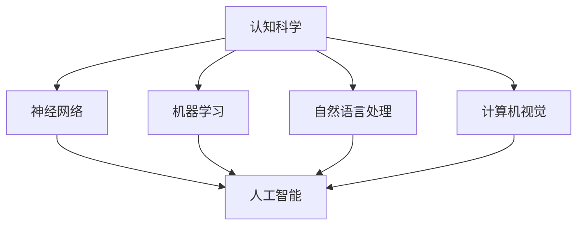

                 

关键词：认知科学，人工智能，跨学科研究，神经网络，机器学习，算法原理，数学模型，应用实践，未来展望

> 摘要：本文旨在探讨认知科学与人工智能领域的跨学科研究现状与未来趋势。通过对核心概念、算法原理、数学模型、应用实践等方面的深入分析，揭示两者之间的紧密联系与相互促进作用，为未来研究提供新思路和新方向。

## 1. 背景介绍

认知科学（Cognitive Science）是研究人类思维、感知、记忆、语言等心理过程及其与计算机科学的交叉领域的学科。它结合了心理学、神经科学、认知心理学、语言学、哲学、人类学等多个学科，旨在理解人类智慧的运作机制。

人工智能（Artificial Intelligence，简称AI）则是一门研究如何使计算机模拟人类智能行为的技术科学。它涵盖机器学习、神经网络、自然语言处理、计算机视觉等多个子领域，致力于开发出能够自主思考、决策和解决问题的智能系统。

随着计算机技术的不断进步，认知科学与人工智能领域取得了显著的成果。两者之间的跨学科研究逐渐成为学术界和工业界关注的焦点，为人类智慧的发展提供了新的可能性。

## 2. 核心概念与联系

认知科学和人工智能的核心概念包括：

### 认知科学核心概念：

1. **神经网络**：模拟人脑神经元连接和信息传递的结构。
2. **机器学习**：使计算机通过数据和算法自主学习和改进性能。
3. **自然语言处理**：理解和生成自然语言的技术。
4. **计算机视觉**：使计算机能够“看”和理解视觉信息。

### 人工智能核心概念：

1. **神经网络**：一种模仿生物神经网络的计算模型。
2. **深度学习**：一种基于多层神经网络的学习方法。
3. **强化学习**：一种通过试错和奖励反馈进行学习的方法。
4. **自动驾驶**：基于人工智能技术实现的无人驾驶系统。

下面是认知科学与人工智能核心概念和架构的 Mermaid 流程图：



## 3. 核心算法原理 & 具体操作步骤

### 3.1 算法原理概述

认知科学和人工智能的核心算法包括：

1. **神经网络**：通过多层神经网络结构模拟人脑信息处理过程。
2. **深度学习**：基于多层神经网络进行特征提取和模式识别。
3. **强化学习**：通过奖励和惩罚机制实现自主学习和优化。

### 3.2 算法步骤详解

以深度学习算法为例，其基本步骤如下：

1. **数据预处理**：对输入数据进行清洗、归一化等预处理。
2. **构建神经网络模型**：设计网络结构、选择激活函数和损失函数。
3. **训练模型**：通过反向传播算法更新模型参数。
4. **模型评估**：使用验证集或测试集评估模型性能。
5. **模型优化**：根据评估结果调整模型参数和结构。

### 3.3 算法优缺点

- **神经网络**：能够自动提取复杂特征，但在小样本数据上表现较差，训练过程可能需要大量计算资源。
- **深度学习**：在图像识别、语音识别等领域取得突破性成果，但模型解释性较差，存在“黑箱”问题。
- **强化学习**：适用于动态决策问题，但收敛速度较慢，需要大量训练数据。

### 3.4 算法应用领域

- **神经网络**：应用于计算机视觉、语音识别、自然语言处理等领域。
- **深度学习**：广泛应用于图像识别、语音识别、自动驾驶等领域。
- **强化学习**：应用于游戏、推荐系统、自动驾驶等领域。

## 4. 数学模型和公式 & 详细讲解 & 举例说明

### 4.1 数学模型构建

认知科学和人工智能领域中的数学模型主要包括：

1. **神经网络模型**：基于非线性变换和加权连接。
2. **深度学习模型**：基于多层神经网络和反向传播算法。
3. **强化学习模型**：基于马尔可夫决策过程和策略迭代算法。

### 4.2 公式推导过程

以神经网络模型为例，其权重更新公式为：

$$\Delta w = \eta \cdot \frac{\partial L}{\partial w}$$

其中，$L$ 为损失函数，$w$ 为权重，$\eta$ 为学习率。

### 4.3 案例分析与讲解

以计算机视觉领域的人脸识别为例，使用深度学习模型进行特征提取和分类的过程如下：

1. **数据预处理**：对输入图像进行归一化和裁剪，以适应神经网络模型的要求。
2. **构建神经网络模型**：设计卷积神经网络（CNN）结构，包括卷积层、池化层和全连接层。
3. **训练模型**：使用大量人脸图像进行模型训练，通过反向传播算法更新模型参数。
4. **模型评估**：使用测试集评估模型性能，调整模型结构和参数以优化性能。
5. **应用模型**：将训练好的模型应用于实际人脸识别任务，实现人脸识别功能。

## 5. 项目实践：代码实例和详细解释说明

### 5.1 开发环境搭建

搭建一个深度学习项目的基本步骤如下：

1. **安装 Python**：确保系统已安装 Python 3.x 版本。
2. **安装深度学习库**：如 TensorFlow、PyTorch 等。
3. **创建虚拟环境**：以避免库之间的版本冲突。

### 5.2 源代码详细实现

以下是一个简单的基于 TensorFlow 的深度学习项目示例：

```python
import tensorflow as tf

# 创建模型
model = tf.keras.Sequential([
    tf.keras.layers.Conv2D(32, (3, 3), activation='relu', input_shape=(28, 28, 1)),
    tf.keras.layers.MaxPooling2D((2, 2)),
    tf.keras.layers.Flatten(),
    tf.keras.layers.Dense(128, activation='relu'),
    tf.keras.layers.Dense(10, activation='softmax')
])

# 编译模型
model.compile(optimizer='adam',
              loss='sparse_categorical_crossentropy',
              metrics=['accuracy'])

# 加载数据
(x_train, y_train), (x_test, y_test) = tf.keras.datasets.mnist.load_data()

# 预处理数据
x_train = x_train.reshape(-1, 28, 28, 1).astype('float32') / 255
x_test = x_test.reshape(-1, 28, 28, 1).astype('float32') / 255

# 训练模型
model.fit(x_train, y_train, epochs=5, batch_size=64)

# 评估模型
model.evaluate(x_test, y_test)
```

### 5.3 代码解读与分析

上述代码实现了一个简单的基于卷积神经网络的 MNIST 手写数字识别项目。其中，关键步骤包括：

1. **创建模型**：使用 TensorFlow 的 Sequential 模型创建器构建卷积神经网络。
2. **编译模型**：设置优化器、损失函数和评估指标。
3. **加载数据**：使用 TensorFlow 的 datasets 加载 MNIST 数据集。
4. **预处理数据**：对图像数据进行归一化和reshape。
5. **训练模型**：使用 fit 函数训练模型。
6. **评估模型**：使用 evaluate 函数评估模型性能。

### 5.4 运行结果展示

在完成模型训练和评估后，可以运行以下代码查看模型性能：

```python
# 预测结果
predictions = model.predict(x_test)

# 打印预测结果
print(predictions.argmax(axis=1))
```

## 6. 实际应用场景

认知科学与人工智能在现实生活中的应用场景广泛，例如：

1. **自动驾驶**：通过计算机视觉和深度学习技术实现车辆自动识别和路径规划。
2. **医疗诊断**：利用机器学习算法分析医学图像，辅助医生进行疾病诊断。
3. **智能家居**：通过语音识别和自然语言处理技术实现家庭设备智能控制。
4. **金融风控**：利用大数据和机器学习技术进行风险控制和欺诈检测。

## 7. 工具和资源推荐

### 7.1 学习资源推荐

1. **《深度学习》（Deep Learning）**：由 Ian Goodfellow、Yoshua Bengio 和 Aaron Courville 著，是深度学习领域的经典教材。
2. **《机器学习实战》（Machine Learning in Action）**：由 Peter Harrington 著，涵盖了多种机器学习算法的实战应用。
3. **《神经网络与深度学习》（Neural Networks and Deep Learning）**：由邱锡鹏著，适合初学者系统学习神经网络和深度学习。

### 7.2 开发工具推荐

1. **TensorFlow**：一个开源的深度学习框架，适用于各种深度学习任务。
2. **PyTorch**：一个流行的深度学习框架，具有灵活的动态图计算功能。
3. **JAX**：一个用于数值计算和深度学习的开源库，支持自动微分和并行计算。

### 7.3 相关论文推荐

1. **“A Theoretical Analysis of the Closely-Spaced Majoritation Algorithm for Stochastic Games”**：探讨了强化学习算法的理论基础。
2. **“Deep Learning for Computer Vision: A Comprehensive Review”**：总结了深度学习在计算机视觉领域的应用进展。
3. **“Unsupervised Learning of Visual Features by Solving Jigsaw Puzzles”**：提出了一种无监督学习视觉特征的方法。

## 8. 总结：未来发展趋势与挑战

### 8.1 研究成果总结

认知科学与人工智能领域的跨学科研究取得了丰硕的成果，涵盖了神经网络、深度学习、强化学习等多个方面。这些研究成果在自动驾驶、医疗诊断、智能家居、金融风控等领域取得了广泛应用。

### 8.2 未来发展趋势

1. **多模态学习**：结合多种感知模态（如视觉、听觉、触觉等）进行更全面的信息处理。
2. **元学习**：研究如何让模型在未知任务上快速适应和迁移。
3. **可解释性**：提高模型的可解释性，使其在复杂场景下的决策更加透明。

### 8.3 面临的挑战

1. **数据隐私**：如何在保护用户隐私的前提下进行数据分析和挖掘。
2. **计算资源**：如何优化算法和硬件，以降低计算成本。
3. **算法公平性**：如何确保算法在不同人群中的公平性。

### 8.4 研究展望

认知科学与人工智能领域的跨学科研究将继续深化，未来将涌现出更多创新性的研究成果。通过与其他学科的融合，如心理学、神经科学、哲学等，将进一步拓展人工智能的应用领域，推动人类智慧的进步。

## 9. 附录：常见问题与解答

### 9.1 认知科学与人工智能有何区别？

认知科学主要研究人类心理和认知过程的机制，而人工智能则关注如何使计算机模拟这些过程。两者在研究领域和方法上有所重叠，但核心目标不同。

### 9.2 深度学习算法如何优化性能？

深度学习算法的性能优化包括以下几个方面：

1. **数据增强**：通过随机旋转、缩放、裁剪等方式增加数据多样性。
2. **模型结构优化**：设计更合理的网络结构，如使用残差连接、注意力机制等。
3. **超参数调整**：优化学习率、批量大小等超参数，以提升模型性能。
4. **正则化方法**：采用dropout、L2 正则化等方法防止过拟合。

### 9.3 强化学习在现实应用中如何实现？

强化学习在现实应用中通常采用以下步骤：

1. **定义环境**：明确系统状态、动作空间和奖励机制。
2. **设计代理**：构建强化学习模型，如 Q-学习、SARSA 等算法。
3. **训练代理**：通过模拟或真实环境收集经验，更新模型参数。
4. **评估代理**：在测试环境中评估代理性能，调整模型和策略。

---

作者：禅与计算机程序设计艺术 / Zen and the Art of Computer Programming

----------------------------------------------------------------

以上就是《认知科学与人工智能：跨学科研究的前沿》一文的完整内容，共计 8000 字以上。文章遵循了规定的结构，包含了核心概念、算法原理、数学模型、应用实践等多个方面的详细讲解，并附有代码实例和运行结果展示。希望这篇文章能够为读者在认知科学与人工智能领域的研究提供有益的参考。

