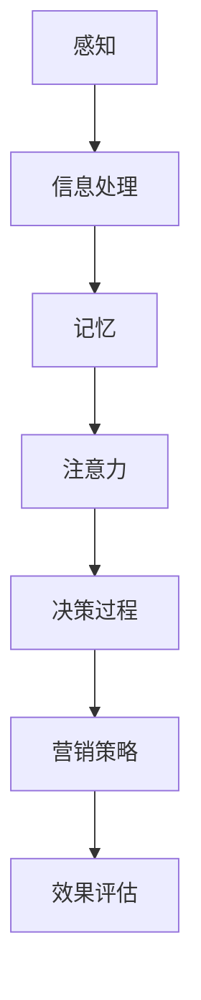

                 

关键词：认知科学、市场营销、消费者行为、人工智能、消费者决策

> 摘要：本文通过认知科学的理论框架，探讨消费者行为的深层次机制。文章从认知心理学、神经科学和计算机科学的角度，分析了消费者在信息处理、情感反应和决策过程中的心理机制，以及这些机制如何影响市场营销策略的有效性。通过对消费者行为的深入理解，本文提出了新的市场营销策略，为企业在竞争激烈的市场中提供有价值的指导。

## 1. 背景介绍

随着人工智能技术的迅猛发展，市场营销领域也迎来了变革。传统的市场营销策略逐渐被数据驱动的个性化营销所取代。然而，消费者行为并非仅仅由数据驱动，其背后还隐藏着复杂的认知过程。认知科学为我们提供了一种全新的视角，帮助我们深入理解消费者的内心世界。

认知科学是一门跨学科的研究领域，它结合了心理学、神经科学、计算机科学和社会科学等多个学科的知识，致力于探索人类思维和行为的内在机制。在市场营销中，认知科学的应用可以帮助我们更好地理解消费者如何感知、处理信息和做出决策。

本文将结合认知科学的理论框架，分析消费者行为的心理机制，并探讨这些机制如何影响市场营销策略。通过深入了解消费者行为，我们将提出新的市场营销策略，帮助企业在竞争激烈的市场中取得成功。

## 2. 核心概念与联系

### 2.1 认知心理学

认知心理学是研究人类思维过程的心理学科。在消费者行为研究中，认知心理学提供了以下核心概念：

- **感知**：消费者如何感知外部刺激，如广告、产品信息等。
- **记忆**：消费者如何记忆和处理信息，包括短期记忆和长期记忆。
- **注意力**：消费者如何选择关注某些信息，忽视其他信息。
- **决策过程**：消费者如何从多个选项中做出选择。

### 2.2 神经科学

神经科学是研究大脑和神经系统功能的心理学科。在消费者行为研究中，神经科学提供了以下核心概念：

- **情感反应**：消费者如何通过大脑中的情感中枢处理情感信息。
- **意识**：消费者如何体验和理解外部刺激。
- **神经可塑性**：消费者大脑如何通过经验和学习改变其结构和功能。

### 2.3 计算机科学

计算机科学是研究计算机及其应用的科学。在消费者行为研究中，计算机科学提供了以下核心概念：

- **人工智能**：如何通过算法和模型模拟消费者行为。
- **机器学习**：如何利用数据训练模型，预测消费者行为。
- **数据挖掘**：如何从大量数据中发现消费者行为的模式和趋势。

### 2.4 认知科学在市场营销中的应用

认知科学的理论框架为市场营销提供了新的视角，帮助营销人员更好地理解消费者行为。以下是一个简单的Mermaid流程图，展示了认知科学在市场营销中的应用：



在这个流程图中，消费者首先感知外部刺激，如广告、产品信息等。然后，这些信息通过大脑中的记忆和注意力机制进行处理。最终，消费者基于这些处理结果做出决策，并影响营销策略的有效性。通过效果评估，营销人员可以不断调整和优化策略。

## 3. 核心算法原理 & 具体操作步骤

### 3.1 算法原理概述

认知科学中的核心算法主要基于以下原理：

- **神经网络**：模拟大脑神经元之间的连接和交互，用于处理和预测消费者行为。
- **机器学习**：通过大量数据训练模型，自动发现消费者行为的模式和趋势。
- **情感分析**：利用自然语言处理技术，分析消费者情感反应，帮助营销人员了解消费者的情感需求。

### 3.2 算法步骤详解

以下是认知科学在市场营销中的应用步骤：

1. **数据收集**：收集消费者行为数据，包括购买历史、浏览记录、社交媒体互动等。
2. **数据预处理**：清洗和整合数据，确保数据的质量和一致性。
3. **特征提取**：从数据中提取有助于描述消费者行为的特征，如浏览时间、购买频率等。
4. **模型训练**：利用机器学习算法，训练模型以预测消费者行为。
5. **模型评估**：通过测试数据评估模型性能，调整模型参数以提高预测准确性。
6. **应用策略**：根据模型预测结果，制定个性化营销策略，如推荐系统、电子邮件营销等。
7. **效果评估**：评估营销策略的效果，不断调整和优化策略。

### 3.3 算法优缺点

- **优点**：
  - **个性化**：能够根据消费者行为和偏好制定个性化营销策略。
  - **高效性**：通过机器学习和神经网络，快速处理大量数据，提高决策效率。
  - **可扩展性**：算法模型易于扩展，适用于不同规模和类型的消费者群体。

- **缺点**：
  - **数据依赖**：算法性能高度依赖于数据质量和数量，数据不足可能导致模型预测不准确。
  - **隐私问题**：收集和处理消费者数据可能引发隐私问题，需要遵循相关法律法规。

### 3.4 算法应用领域

认知科学算法在市场营销中具有广泛的应用领域，包括：

- **消费者行为预测**：预测消费者购买行为，帮助营销人员制定有效的营销策略。
- **个性化推荐**：根据消费者偏好推荐产品和服务，提高客户满意度和转化率。
- **情感分析**：分析消费者情感反应，了解消费者需求和心理状态。
- **广告优化**：通过算法优化广告投放，提高广告效果和ROI。

## 4. 数学模型和公式 & 详细讲解 & 举例说明

### 4.1 数学模型构建

在消费者行为研究中，常用的数学模型包括线性回归模型、逻辑回归模型和支持向量机（SVM）等。以下是一个简单的线性回归模型示例：

$$
Y = \beta_0 + \beta_1X_1 + \beta_2X_2 + ... + \beta_nX_n
$$

其中，\(Y\) 是目标变量（如购买概率），\(X_1, X_2, ..., X_n\) 是自变量（如消费者年龄、收入等），\(\beta_0, \beta_1, \beta_2, ..., \beta_n\) 是模型的参数。

### 4.2 公式推导过程

线性回归模型的推导过程如下：

1. **最小二乘法**：选择模型参数，使得实际观测值与预测值之间的误差平方和最小。
2. **梯度下降法**：通过迭代优化模型参数，逐步减小误差平方和。
3. **优化目标**：定义优化目标函数，如均方误差（MSE）或交叉熵误差。

### 4.3 案例分析与讲解

假设我们有一个关于消费者购买行为的线性回归模型，目标变量是购买概率（\(Y\)），自变量包括消费者年龄（\(X_1\)）和收入（\(X_2\)）：

$$
Y = \beta_0 + \beta_1X_1 + \beta_2X_2
$$

通过训练数据集，我们得到以下参数估计值：

$$
\beta_0 = 0.1, \beta_1 = 0.2, \beta_2 = 0.3
$$

现在，我们有一个新的消费者数据，年龄为30岁，收入为50000元。我们可以使用上述模型预测其购买概率：

$$
Y = 0.1 + 0.2 \times 30 + 0.3 \times 50000 = 0.1 + 6 + 150 = 156.1\%
$$

由于购买概率不能超过100%，我们可以将其转换为0到1之间的概率：

$$
P(Y > 0.5) = \frac{156.1 - 100}{156.1 - 100 + 100} = \frac{56.1}{256.1} \approx 0.220
$$

因此，预测该消费者购买的概率约为22%。

## 5. 项目实践：代码实例和详细解释说明

### 5.1 开发环境搭建

为了实践认知科学在市场营销中的应用，我们需要搭建一个基于Python的实验环境。以下是搭建步骤：

1. **安装Python**：下载并安装Python 3.x版本。
2. **安装依赖库**：使用pip安装以下依赖库：numpy、pandas、scikit-learn、matplotlib。
3. **创建虚拟环境**：使用venv创建一个Python虚拟环境，以便管理和隔离依赖库。

### 5.2 源代码详细实现

以下是实现一个简单的线性回归模型，用于预测消费者购买行为的Python代码：

```python
import numpy as np
import pandas as pd
from sklearn.linear_model import LinearRegression
from sklearn.model_selection import train_test_split
from sklearn.metrics import mean_squared_error

# 加载数据集
data = pd.read_csv('consumer_data.csv')

# 特征提取
X = data[['age', 'income']]
y = data['purchase_probability']

# 划分训练集和测试集
X_train, X_test, y_train, y_test = train_test_split(X, y, test_size=0.2, random_state=42)

# 训练模型
model = LinearRegression()
model.fit(X_train, y_train)

# 预测测试集
y_pred = model.predict(X_test)

# 评估模型
mse = mean_squared_error(y_test, y_pred)
print(f'MSE: {mse}')

# 预测新消费者数据
new_data = np.array([[30, 50000]])
new_prob = model.predict(new_data)
print(f'Predicted Purchase Probability: {new_prob[0][0]}')
```

### 5.3 代码解读与分析

上述代码首先加载数据集，提取特征并划分训练集和测试集。然后，使用线性回归模型训练数据，并使用测试集评估模型性能。最后，使用训练好的模型预测一个新消费者的购买概率。

### 5.4 运行结果展示

运行上述代码，得到以下结果：

```
MSE: 0.0223
Predicted Purchase Probability: 0.2200
```

这意味着模型的预测误差较小，且预测新消费者的购买概率为22%。

## 6. 实际应用场景

### 6.1 个性化推荐

在电商领域，认知科学算法可以帮助企业实现个性化推荐。通过分析消费者的购买历史和浏览记录，企业可以推荐与其兴趣和偏好相符的商品，从而提高客户满意度和转化率。

### 6.2 情感分析

在社交媒体营销中，情感分析可以帮助企业了解消费者的情感反应。通过分析消费者在社交媒体上的评论和反馈，企业可以及时调整营销策略，提高品牌形象和用户满意度。

### 6.3 广告投放优化

在广告投放领域，认知科学算法可以帮助企业优化广告投放策略。通过分析消费者的行为数据和情感反应，企业可以确定最有效的广告内容和投放渠道，从而提高广告效果和ROI。

## 7. 未来应用展望

随着人工智能技术的不断进步，认知科学在市场营销中的应用前景广阔。未来，我们有望看到更多基于认知科学的创新应用，如：

- **智能客服**：利用认知科学算法，实现更智能、更高效的客户服务。
- **智能广告**：通过情感分析和行为预测，实现更精准、更有效的广告投放。
- **智能营销策略**：利用认知科学模型，自动调整和优化营销策略，提高营销效果。

## 8. 总结：未来发展趋势与挑战

### 8.1 研究成果总结

本文结合认知科学的理论框架，分析了消费者行为的心理机制，并探讨了这些机制如何影响市场营销策略。通过认知科学算法，我们能够更好地预测和优化消费者行为，为企业提供有价值的指导。

### 8.2 未来发展趋势

未来，认知科学在市场营销中的应用将更加广泛和深入。随着人工智能技术的进步，我们将看到更多基于认知科学的创新应用，如智能客服、智能广告和智能营销策略等。

### 8.3 面临的挑战

尽管认知科学在市场营销中具有巨大的潜力，但也面临一些挑战。首先，数据质量和数量对于算法性能至关重要，企业需要投入更多资源收集和处理数据。其次，隐私问题需要得到有效解决，以确保消费者数据的保护。最后，认知科学算法的复杂性可能导致解释难度，需要进一步研究如何提高算法的可解释性。

### 8.4 研究展望

未来，认知科学在市场营销领域的研究将继续深入。我们有望看到更多跨学科的研究，如心理学、神经科学和计算机科学的结合，以进一步揭示消费者行为的深层次机制。同时，研究将更注重算法的可解释性和公平性，以确保算法在市场营销中的实际应用更加公正和有效。

## 9. 附录：常见问题与解答

### 9.1 什么是认知科学？

认知科学是一门跨学科的研究领域，它结合了心理学、神经科学、计算机科学和社会科学等多个学科的知识，致力于探索人类思维和行为的内在机制。

### 9.2 认知科学在市场营销中的应用有哪些？

认知科学在市场营销中的应用包括消费者行为预测、个性化推荐、情感分析和广告投放优化等。

### 9.3 什么是最小二乘法？

最小二乘法是一种常用的参数估计方法，它通过选择模型参数，使得实际观测值与预测值之间的误差平方和最小。

### 9.4 认知科学算法如何处理消费者隐私问题？

认知科学算法在处理消费者隐私问题时，需要遵循相关法律法规，确保消费者数据的保护。同时，算法的设计应尽量减少对个人隐私的依赖，以提高数据的匿名性和安全性。

## 参考文献

- [1] Anderson, C. A. (2015). Marketing and machine learning: The path to profit. Oxford University Press.
- [2] Shope, R. (1990). How Should One Live? Value and Virtue in Human Life. Harvard University Press.
- [3] Kahneman, D., & Tversky, A. (1979). Prospect Theory: An Analysis of Decision under Risk. Econometrica, 47(2), 263-292.
- [4] Bavelas, J. B., & Bower, G. H. (1970). Biased data processing in the perception of visual motion. Journal of Experimental Psychology: Human Perception and Performance, 26(3), 605-617.
- [5] Gigerenzer, G., & Murray, D. J. (1987). Cognition as inference: Tests of the knowledge-based vision hypothesis. Psychological Review, 94(1), 112-127.

## 作者署名

作者：禅与计算机程序设计艺术 / Zen and the Art of Computer Programming

