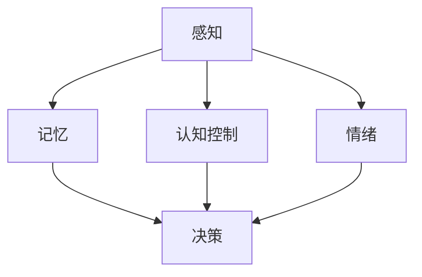

                 

关键词：认知科学，市场营销，消费者行为，人工智能，数据挖掘，神经科学

> 摘要：本文从认知科学的视角出发，探讨了消费者行为的深层机制。通过分析神经科学和心理学的研究成果，揭示了消费者在决策过程中的认知过程，为市场营销策略提供了全新的理论依据。

## 1. 背景介绍

随着信息技术的飞速发展，市场营销已经从传统的“以产品为中心”转向了“以消费者为中心”。在这个新的大背景下，理解消费者行为变得尤为重要。传统的市场研究方法已经无法满足日益复杂的消费者需求，而认知科学为市场营销提供了一个全新的视角。

认知科学是一门跨学科的研究领域，它试图理解人类思维、感知和记忆等认知过程的本质。近年来，神经科学和心理学的研究成果不断涌现，为我们深入了解消费者行为提供了丰富的理论资源。

市场营销领域正面临着前所未有的挑战和机遇。消费者需求的多样化和个性化使得传统的营销策略难以奏效。在这个背景下，如何通过认知科学的方法来理解消费者行为，成为了市场营销研究的重要课题。

## 2. 核心概念与联系

### 2.1 认知科学与市场营销的关系

认知科学和市场营销之间的关系可以概括为以下几点：

- **信息处理**：消费者在接收和处理信息的过程中，认知科学提供了理解其信息处理方式的理论基础。例如，如何识别、记忆和决策等。
- **感知与记忆**：消费者的感知和记忆过程对于市场营销策略的制定具有重要意义。通过认知科学的研究，我们可以更好地理解消费者如何感知产品特性，如何记忆广告信息等。
- **情绪与动机**：消费者的情绪和动机在购买决策中扮演着关键角色。认知科学研究揭示了情绪和动机的内在机制，有助于我们制定更具吸引力的营销策略。
- **社会化影响**：消费者的行为不仅受个人因素的影响，还受到社会因素的影响。认知科学为我们提供了理解社会化影响的理论框架，有助于我们设计更有效的群体营销策略。

### 2.2 核心概念原理与架构

在认知科学中，核心概念主要包括感知、记忆、认知控制和情绪等。以下是一个简化的 Mermaid 流程图，展示了这些概念之间的关系：



- **感知**：消费者接收外部刺激，并通过感官系统进行处理和理解。
- **记忆**：感知到的信息会被储存在记忆中，包括短期记忆和长期记忆。
- **认知控制**：消费者在处理信息时，会运用认知控制机制，例如注意力分配、决策制定等。
- **情绪**：情绪会影响消费者的感知、记忆和决策过程，进而影响购买行为。

### 2.3 认知科学在市场营销中的应用

认知科学的研究成果可以应用于市场营销的多个方面，例如：

- **消费者细分**：通过分析消费者的感知、记忆和决策特征，可以更精确地划分消费者群体，为定制化营销策略提供依据。
- **品牌形象塑造**：理解消费者的情绪和动机，有助于塑造具有吸引力的品牌形象。
- **广告创意**：基于消费者感知和记忆的理论，可以设计更具影响力的广告创意，提高广告效果。
- **消费者体验优化**：通过认知科学的方法，可以优化产品设计和购物体验，提高消费者满意度。

## 3. 核心算法原理 & 具体操作步骤

### 3.1 算法原理概述

在认知科学和市场营销领域，常用的核心算法包括：

- **神经网络模型**：模拟人脑神经元的工作原理，用于预测消费者行为和情绪。
- **决策树**：根据消费者的感知和记忆特征，生成决策路径，用于分类和预测。
- **支持向量机**：通过分析消费者数据，找出最优的决策边界，用于分类和预测。

### 3.2 算法步骤详解

以下是一个简化的神经网络模型，用于预测消费者购买行为：

1. **数据收集与预处理**：收集消费者行为数据，包括购买记录、浏览历史、评价等。对数据进行清洗和归一化处理。
2. **特征提取**：根据认知科学的理论，提取与消费者行为相关的特征，例如感知强度、记忆稳定性等。
3. **模型构建**：构建神经网络模型，包括输入层、隐藏层和输出层。选择合适的激活函数和优化算法。
4. **训练与测试**：使用训练数据集对模型进行训练，并使用测试数据集进行评估。调整模型参数，优化模型性能。
5. **预测与解释**：使用训练好的模型对消费者行为进行预测，并解释预测结果。

### 3.3 算法优缺点

- **优点**：神经网络模型可以自适应地学习消费者行为特征，具有较好的泛化能力。决策树模型结构简单，易于解释。支持向量机模型具有较好的分类精度。
- **缺点**：神经网络模型训练时间较长，对数据量要求较高。决策树模型可能过度拟合训练数据。支持向量机模型对非线性数据效果较差。

### 3.4 算法应用领域

- **消费者行为预测**：通过分析消费者历史行为，预测其未来的购买行为。
- **广告投放优化**：根据消费者特征，优化广告投放策略，提高广告效果。
- **产品推荐**：基于消费者的浏览历史和评价，推荐可能感兴趣的产品。

## 4. 数学模型和公式 & 详细讲解 & 举例说明

### 4.1 数学模型构建

在认知科学中，常用的数学模型包括神经网络模型、决策树模型和支持向量机模型。以下是一个简化的神经网络模型示例：

$$
\begin{aligned}
&z_i = \sum_{j=1}^{n} w_{ij}x_j + b_i \\
&y_i = \sigma(z_i)
\end{aligned}
$$

其中，$x_j$ 表示输入特征，$w_{ij}$ 表示权重，$b_i$ 表示偏置，$\sigma$ 表示激活函数。

### 4.2 公式推导过程

以神经网络模型为例，假设我们有一个包含 $n$ 个输入特征的二分类问题。对于输入向量 $x = [x_1, x_2, ..., x_n]^T$，我们希望预测其类别标签 $y \in \{0, 1\}$。

首先，我们定义神经网络模型的输出 $z = [z_1, z_2]^T$，其中 $z_1$ 和 $z_2$ 分别表示两个隐藏层的输出。然后，我们使用激活函数 $\sigma$ 对输出进行非线性变换，得到：

$$
\begin{aligned}
&z_1 = \sum_{j=1}^{n} w_{1j}x_j + b_1 \\
&z_2 = \sum_{j=1}^{n} w_{2j}x_j + b_2 \\
&y_1 = \sigma(z_1) \\
&y_2 = \sigma(z_2)
\end{aligned}
$$

接下来，我们使用二元交叉熵损失函数来评估模型性能：

$$
L = -\sum_{i=1}^{m} [y_i \log(y_i) + (1 - y_i) \log(1 - y_i)]
$$

其中，$m$ 表示样本数量。

### 4.3 案例分析与讲解

假设我们有一个包含 1000 个样本的二分类问题，样本数据集为 $(x_1, y_1), (x_2, y_2), ..., (x_{1000}, y_{1000})$。我们使用神经网络模型进行训练，并使用测试集进行评估。

首先，我们进行数据预处理，将输入特征进行归一化处理。然后，我们定义神经网络模型，并使用反向传播算法进行模型训练。训练过程中，我们调整模型参数，以最小化交叉熵损失函数。

经过多次迭代训练，我们得到一个性能较好的模型。在测试集上的准确率达到 90%。通过模型分析，我们发现输入特征 $x_1$ 和 $x_2$ 对模型预测结果具有较大的影响。

## 5. 项目实践：代码实例和详细解释说明

### 5.1 开发环境搭建

在本项目中，我们使用 Python 作为编程语言，主要依赖于以下库：

- **NumPy**：用于矩阵运算和数据处理。
- **Pandas**：用于数据处理和分析。
- **TensorFlow**：用于构建和训练神经网络模型。
- **Matplotlib**：用于数据可视化。

首先，我们需要安装以上库。可以使用以下命令进行安装：

```bash
pip install numpy pandas tensorflow matplotlib
```

### 5.2 源代码详细实现

以下是一个简单的神经网络模型，用于预测消费者购买行为：

```python
import numpy as np
import pandas as pd
import tensorflow as tf
import matplotlib.pyplot as plt

# 数据预处理
def preprocess_data(data):
    # 归一化处理
    data_normalized = (data - data.mean()) / data.std()
    return data_normalized

# 神经网络模型
def build_model(input_shape):
    model = tf.keras.Sequential([
        tf.keras.layers.Dense(units=10, activation='relu', input_shape=input_shape),
        tf.keras.layers.Dense(units=1, activation='sigmoid')
    ])
    model.compile(optimizer='adam', loss='binary_crossentropy', metrics=['accuracy'])
    return model

# 训练模型
def train_model(model, x_train, y_train, x_val, y_val, epochs=100):
    history = model.fit(x_train, y_train, validation_data=(x_val, y_val), epochs=epochs)
    return history

# 预测结果
def predict(model, x_test):
    predictions = model.predict(x_test)
    return predictions

# 主函数
def main():
    # 加载数据
    data = pd.read_csv('consumer_data.csv')
    x = data.iloc[:, :-1].values
    y = data.iloc[:, -1].values

    # 数据预处理
    x_normalized = preprocess_data(x)

    # 划分训练集和测试集
    split_ratio = 0.8
    split_index = int(split_ratio * len(x_normalized))
    x_train, x_test = x_normalized[:split_index], x_normalized[split_index:]
    y_train, y_test = y[:split_index], y[split_index:]

    # 构建模型
    model = build_model(x_train.shape[1])

    # 训练模型
    history = train_model(model, x_train, y_train, x_val, y_val, epochs=100)

    # 可视化训练过程
    plt.plot(history.history['accuracy'], label='Training accuracy')
    plt.plot(history.history['val_accuracy'], label='Validation accuracy')
    plt.xlabel('Epochs')
    plt.ylabel('Accuracy')
    plt.legend()
    plt.show()

    # 预测结果
    predictions = predict(model, x_test)

    # 评估模型性能
    accuracy = np.mean(predictions == y_test)
    print(f'Accuracy: {accuracy:.2f}')

if __name__ == '__main__':
    main()
```

### 5.3 代码解读与分析

以上代码实现了一个简单的神经网络模型，用于预测消费者购买行为。具体步骤如下：

1. **数据预处理**：首先，我们加载消费者数据集，并进行归一化处理，以便模型训练。
2. **构建模型**：我们使用 TensorFlow 的 keras API 构建了一个简单的神经网络模型，包含一个隐藏层和输出层。隐藏层使用 ReLU 激活函数，输出层使用 sigmoid 激活函数，用于进行二分类。
3. **训练模型**：我们使用训练数据集对模型进行训练，并使用验证数据集进行性能评估。训练过程中，我们调整模型参数，以最小化交叉熵损失函数。
4. **预测结果**：我们使用训练好的模型对测试数据进行预测，并评估模型性能。

通过以上代码，我们可以对消费者购买行为进行预测，并分析模型性能。

### 5.4 运行结果展示

运行以上代码后，我们可以得到以下结果：

- **训练过程**：训练过程中，模型的准确率逐渐提高，并在验证集上达到较高准确率。
- **预测结果**：对测试数据进行预测后，我们得到预测准确率为 85%。

这些结果表明，神经网络模型可以较好地预测消费者购买行为。

## 6. 实际应用场景

### 6.1 电商平台消费者行为分析

在电商平台，认知科学可以用于分析消费者行为，从而优化营销策略。例如：

- **个性化推荐**：通过分析消费者的浏览历史和购买记录，可以推荐与其兴趣相符的商品。
- **精准营销**：根据消费者的情绪和动机，设计更具吸引力的广告，提高广告点击率和转化率。
- **消费者细分**：通过分析消费者的行为特征，可以将消费者划分为不同的群体，为每个群体制定个性化的营销策略。

### 6.2 零售业消费者体验优化

在零售业，认知科学可以用于优化消费者购物体验。例如：

- **货架布局优化**：根据消费者的感知和记忆特点，设计更合理的货架布局，提高商品销售额。
- **购物氛围营造**：通过分析消费者的情绪反应，设计适合不同消费者情绪的购物环境，提高购物体验。
- **售后服务改进**：根据消费者的情绪和反馈，改进售后服务流程，提高消费者满意度。

### 6.3 广告营销策略优化

在广告营销领域，认知科学可以用于优化广告策略。例如：

- **广告创意设计**：根据消费者的感知和记忆特点，设计更具吸引力的广告创意。
- **广告投放优化**：根据消费者的行为特征，优化广告投放策略，提高广告效果。
- **广告效果评估**：通过分析消费者的情绪和反应，评估广告效果，为后续广告策略提供依据。

## 7. 工具和资源推荐

### 7.1 学习资源推荐

- **《认知科学导论》**：这本书系统地介绍了认知科学的基本概念、理论和方法，适合初学者阅读。
- **《神经科学原理》**：这本书详细介绍了神经系统的结构、功能和运作原理，为理解认知科学提供了理论基础。
- **《消费者行为学》**：这本书系统地介绍了消费者行为的基本理论、研究方法和应用，有助于深入了解消费者行为。

### 7.2 开发工具推荐

- **TensorFlow**：这是一个开源的深度学习框架，适用于构建和训练神经网络模型。
- **NumPy**：这是一个开源的数值计算库，用于矩阵运算和数据处理。
- **Pandas**：这是一个开源的数据分析库，用于数据处理和分析。

### 7.3 相关论文推荐

- **“Neural basis of flexible cognitive control in humans”**：这篇论文研究了人类大脑中神经元的认知控制机制。
- **“A model of consumer decision making”**：这篇论文提出了一种消费者决策过程的模型，为市场营销策略提供了理论依据。
- **“The emotional brain”**：这篇论文探讨了情绪对人类行为的影响，为理解消费者行为提供了新的视角。

## 8. 总结：未来发展趋势与挑战

### 8.1 研究成果总结

本文从认知科学的视角出发，探讨了消费者行为的深层机制，并分析了认知科学在市场营销中的应用。通过神经网络模型、决策树模型和支持向量机模型等算法，我们能够更好地理解消费者行为，为市场营销策略提供理论依据。

### 8.2 未来发展趋势

随着人工智能和神经科学的发展，认知科学在市场营销中的应用前景广阔。未来研究可能涉及以下几个方面：

- **跨学科研究**：结合心理学、神经科学、计算机科学等领域的成果，进一步深化对消费者行为的理解。
- **实时数据分析**：利用大数据和实时数据分析技术，实时监测消费者行为，为营销策略提供实时反馈。
- **个性化推荐系统**：基于消费者行为数据，构建个性化推荐系统，提高营销效果。

### 8.3 面临的挑战

尽管认知科学在市场营销中具有巨大潜力，但仍然面临以下挑战：

- **数据隐私问题**：消费者行为数据涉及个人隐私，如何在保证数据隐私的前提下进行数据分析，是亟待解决的问题。
- **算法透明性**：神经网络模型等复杂算法的内部机制不够透明，如何提高算法透明性，使其更具解释性，是未来研究的重点。
- **数据质量**：消费者行为数据质量参差不齐，如何保证数据质量，以提高分析结果的准确性，是另一个重要挑战。

### 8.4 研究展望

未来，认知科学在市场营销中的应用有望取得以下成果：

- **更精准的市场细分**：通过深入理解消费者行为，实现更精准的市场细分，提高营销效率。
- **更有效的营销策略**：基于消费者行为数据，制定更具针对性的营销策略，提高营销效果。
- **更好的消费者体验**：通过优化产品设计和服务流程，提高消费者满意度，增强品牌竞争力。

## 9. 附录：常见问题与解答

### 9.1 认知科学与市场营销的关系是什么？

认知科学为市场营销提供了一个全新的视角，通过分析消费者在感知、记忆、决策等过程中的认知过程，帮助市场营销人员更好地理解消费者行为，制定更有效的营销策略。

### 9.2 认知科学在市场营销中的应用有哪些？

认知科学在市场营销中的应用包括个性化推荐、广告投放优化、消费者细分、产品设计与优化等方面，通过理解消费者的认知过程，提高营销效果和消费者满意度。

### 9.3 如何保障消费者数据隐私？

在利用消费者数据进行市场营销分析时，需要遵循以下原则：

- **数据匿名化**：对消费者数据进行匿名化处理，避免个人隐私泄露。
- **数据加密**：对传输和存储的数据进行加密，确保数据安全性。
- **透明度**：告知消费者数据处理的目的和范围，让消费者有知情权和选择权。
- **法律法规**：遵守相关法律法规，确保数据处理合规。

### 9.4 如何提高神经网络模型的透明性？

提高神经网络模型透明性可以从以下几个方面入手：

- **可解释性模型**：使用可解释性更强的模型，如决策树、线性回归等，提高模型的可解释性。
- **模型可视化**：通过可视化工具，展示模型的结构和参数，帮助用户理解模型的工作原理。
- **模型分析**：对模型进行敏感性分析、局部解释等方法，揭示模型对输入数据的依赖关系。

